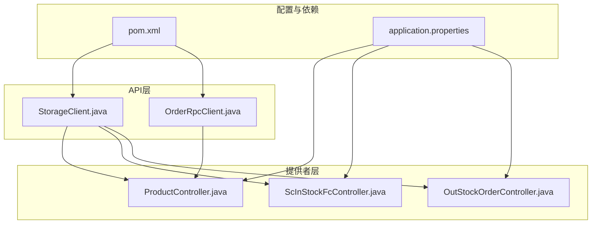
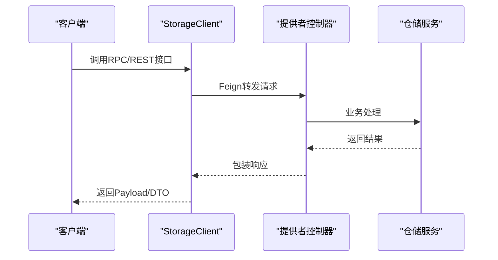
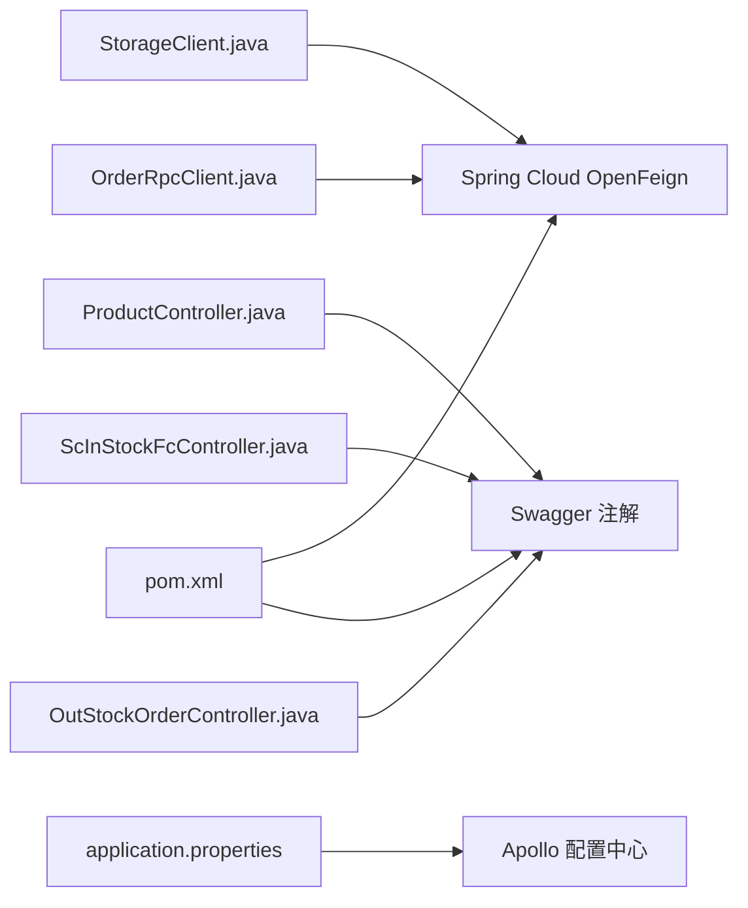

# API接口文档

<cite>
**本文引用的文件**
- [StorageClient.java](file://guoke-deepexi-storage-center-api/src/main/java/com/deepexi/api/storage/StorageClient.java)
- [OrderRpcClient.java](file://guoke-deepexi-storage-center-api/src/main/java/com/deepexi/api/storage/OrderRpcClient.java)
- [pom.xml](file://guoke-deepexi-storage-center-api/pom.xml)
- [ProductController.java](file://guoke-deepexi-storage-center-provider/src/main/java/com/deepexi/storage/controller/web/ProductController.java)
- [ScInStockFcController.java](file://guoke-deepexi-storage-center-provider/src/main/java/com/deepexi/storage/controller/web/ScInStockFcController.java)
- [OutStockOrderController.java](file://guoke-deepexi-storage-center-provider/src/main/java/com/deepexi/storage/controller/web/OutStockOrderController.java)
- [application.properties](file://guoke-deepexi-storage-center-provider/src/main/resources/application.properties)
- [README.md](file://README.md)
</cite>

## 目录
1. [简介](#简介)
2. [项目结构](#项目结构)
3. [核心组件](#核心组件)
4. [架构总览](#架构总览)
5. [详细组件分析](#详细组件分析)
6. [依赖关系分析](#依赖关系分析)
7. [性能考量](#性能考量)
8. [故障排查指南](#故障排查指南)
9. [结论](#结论)
10. [附录](#附录)

## 简介
本文件为国科恒泰仓储管理系统提供的API接口文档，覆盖RESTful与RPC两类接口，包含HTTP方法、URL模式、请求/响应模式、认证方法、错误处理策略、安全考虑、版本信息、常见用例、客户端实现指南、性能优化技巧、调试工具与监控方法，并对可能的弃用功能与向后兼容性进行说明。文档面向开发者与集成方，帮助快速理解与正确使用系统对外暴露的接口。

## 项目结构
系统采用分层与模块化组织：
- API接口定义层：在API模块中以Feign接口形式声明对外RPC接口与通用REST接口契约。
- 提供者实现层：在Provider模块中以Spring MVC控制器实现具体业务逻辑，暴露REST接口。
- 配置与依赖：通过Maven聚合构建，引入OpenFeign、Swagger等依赖；应用通过Apollo配置中心加载配置。

图表来源
- [StorageClient.java:105-107](file://guoke-deepexi-storage-center-api/src/main/java/com/deepexi/api/storage/StorageClient.java#L105-L107)
- [OrderRpcClient.java:19-21](file://guoke-deepexi-storage-center-api/src/main/java/com/deepexi/api/storage/OrderRpcClient.java#L19-L21)
- [ProductController.java:33](file://guoke-deepexi-storage-center-provider/src/main/java/com/deepexi/storage/controller/web/ProductController.java#L33)
- [ScInStockFcController.java:32](file://guoke-deepexi-storage-center-provider/src/main/java/com/deepexi/storage/controller/web/ScInStockFcController.java#L32)
- [OutStockOrderController.java:32](file://guoke-deepexi-storage-center-provider/src/main/java/com/deepexi/storage/controller/web/OutStockOrderController.java#L32)
- [pom.xml:33-44](file://guoke-deepexi-storage-center-api/pom.xml#L33-L44)
- [application.properties:1-6](file://guoke-deepexi-storage-center-provider/src/main/resources/application.properties#L1-L6)

章节来源
- [pom.xml:14-63](file://guoke-deepexi-storage-center-api/pom.xml#L14-L63)
- [application.properties:1-6](file://guoke-deepexi-storage-center-provider/src/main/resources/application.properties#L1-L6)

## 核心组件
- StorageClient：定义仓储相关RPC与REST接口契约，涵盖出入库、产品查询、寄售、库存锁定、调拨、物流、预警、结算等能力。
- OrderRpcClient：定义订单侧RPC接口，用于查询物流轨迹等。
- 控制器层：提供者侧控制器实现具体业务，如产品查询、原厂入库、出库通知单查询等。

章节来源
- [StorageClient.java:105-800](file://guoke-deepexi-storage-center-api/src/main/java/com/deepexi/api/storage/StorageClient.java#L105-L800)
- [OrderRpcClient.java:19-34](file://guoke-deepexi-storage-center-api/src/main/java/com/deepexi/api/storage/OrderRpcClient.java#L19-L34)

## 架构总览
系统采用“API契约 + 提供者实现”的分层架构，API模块通过Feign声明远程调用接口，提供者模块通过Spring MVC暴露REST接口。应用通过Apollo配置中心加载命名空间，支持多环境配置。

图表来源
- [StorageClient.java:105-107](file://guoke-deepexi-storage-center-api/src/main/java/com/deepexi/api/storage/StorageClient.java#L105-L107)
- [ProductController.java:33](file://guoke-deepexi-storage-center-provider/src/main/java/com/deepexi/storage/controller/web/ProductController.java#L33)
- [ScInStockFcController.java:32](file://guoke-deepexi-storage-center-provider/src/main/java/com/deepexi/storage/controller/web/ScInStockFcController.java#L32)
- [OutStockOrderController.java:32](file://guoke-deepexi-storage-center-provider/src/main/java/com/deepexi/storage/controller/web/OutStockOrderController.java#L32)

## 详细组件分析

### 1) 产品查询与退货接口
- GET /api/product/choose
  - 功能：销售选择商品，分页查询产品列表。
  - 认证：无。
  - 请求参数：通过查询映射传递，具体字段见请求模型。
  - 响应：分页包装的查询结果。
- GET /api/product/return
  - 功能：根据原始采购/销售单查询可退商品。
  - 参数校验：订单编号与订单ID必填。
  - 响应：分页包装的可退商品列表。
- GET /api/product/return/self
  - 功能：无源退货场景查询可退商品。
  - 响应：分页包装的可退商品列表。

章节来源
- [ProductController.java:43-86](file://guoke-deepexi-storage-center-provider/src/main/java/com/deepexi/storage/controller/web/ProductController.java#L43-L86)

### 2) 原厂入库订单接口
- POST /api/v1/stockin/scInStockFc/pageList
  - 功能：分页查询原厂入库订单列表。
  - 请求体：查询条件对象。
  - 响应：分页包装的结果。
- GET /api/v1/stockin/scInStockFc/getById/{id}
  - 功能：根据主键查询原厂入库订单详情。
  - 路径参数：id。
  - 响应：订单详情。
- POST /api/v1/stockin/scInStockFc/save
  - 功能：新建保存原厂入库订单。
  - 请求体：订单明细列表。
  - 响应：布尔成功标志。

章节来源
- [ScInStockFcController.java:39-63](file://guoke-deepexi-storage-center-provider/src/main/java/com/deepexi/storage/controller/web/ScInStockFcController.java#L39-L63)

### 3) 出库通知单与记录接口
- GET /api/out/order/list
  - 功能：根据订单编号查询出库通知单列表。
  - 响应：出库通知单简要信息列表。
- GET /api/out/order/detail/{id}
  - 功能：根据主键查询出库通知单详情（支持分页）。
  - 路径参数：id。
  - 响应：出库通知单详情。
- GET /api/out/order/record/detail
  - 功能：根据订单编号获取出库单。
  - 认证：需要鉴权注解。
  - 响应：出库记录列表。

章节来源
- [OutStockOrderController.java:44-83](file://guoke-deepexi-storage-center-provider/src/main/java/com/deepexi/storage/controller/web/OutStockOrderController.java#L44-L83)

### 4) RPC与REST混合接口（仓储）
以下接口来源于API契约层，既可通过Feign作为RPC调用，也可在提供者侧以REST方式访问（路径与注解一致）。建议客户端优先使用Feign接口，以获得统一的负载均衡与熔断能力。

- 变更出库单状态
  - GET /api/v1/rpc/stockOut/changeToAccomplishStatus
  - 参数：出库单ID。
  - 响应：基础响应封装。
- 地址查询
  - POST /api/v1/storage/rpc/address/getByBsAddress
  - 参数：地址ID。
  - 响应：地址DTO封装。
- 授权产品库存统计（已弃用）
  - POST /api/v1/rpc/stock/analyseProductStock
  - 已标记为弃用，不推荐使用。
- 出库批号/UDI明细
  - GET /api/v1/rpc/stock/productDetailUdiList
  - GET /api/v1/rpc/stock/getUdiDetail
  - 功能：查询出库相关UDI明细。
- 订单关联出库单查询
  - GET /api/v1/rpc/stock/selectListByObjId
  - 参数：对象ID、公司ID等。
- 更新出库单实例价格
  - POST /api/v1/rpc/stock/updateOutRecodeInstUnitPrice
  - 请求体：价格更新列表。
- 订单关联出库单实例ID查询
  - POST /api/v1/rpc/stock/queryOrderRelationRecodeInstIdList
  - 请求体：订单列表。
- 库存汇总调度
  - POST /api/v1/rpc/stock/dispatch/summaryInventoryDetailsByDay
  - POST /api/v1/rpc/stock/dispatch/summaryStockChangeSummary
  - 请求体：汇总请求对象。
- 关联出入库单完成状态检查
  - POST /api/v1/rpc/stockOut/queryRelationIncompleteInOutOrder
  - 请求体：映射关系。
- 入库/出库通知单
  - POST /api/instock/inStockSave
  - POST /api/instock/inStockMainSave
  - POST /api/outstock/outStockSave
  - POST /api/outstock/outStockMainSave
  - POST /api/outstock/batchSaveOutStockMain
  - 请求体：对应表单对象。
- 样品相关
  - POST /api/v1/stock/ScStock/scStockSamplePageList
  - POST /api/v1/stock/ScStock/querySample
  - POST /api/v1/stock/ScStock/reportForm
  - POST /api/v1/stock/ScStock/reportFormExport
  - 功能：样品库存分页、查询、报表与导出。
- 产品详情与列表
  - GET /api/product/detail
  - GET /api/product/choose
  - GET /api/product/trace
  - 功能：产品详情、列表、链路测试。
- 结算
  - POST /api/settlement
  - 请求体：结算请求对象。
- 物流承运信息
  - GET /api/v1/logistics/delivery/getShippingMethods
  - GET /api/v1/logistics/delivery/getDeliverysByShippingMethod
  - GET /api/v1/logistics/deliveryDetail/getDetailsByDeliveryId
  - GET /api/v1/logistics/deliveryFreight/getFreightsByDeliveryId
  - 功能：查询承运方式、承运商、时效与运费承担方。
- 报损单
  - POST /api/v1/damage/damagePageList
  - POST /api/v1/damage/damageExport
  - POST /api/v1/damage/saveDamage
  - GET /api/v1/damage/queryDamageById
  - GET /api/v1/damage/queryDamageStatusCount
  - 功能：分页、导出、保存、查询、统计。
- 配送（对接第三方）
  - POST /rpc/v1/peijia/logistics
  - POST /rpc/v1/peijia/out/cancel
  - 功能：保存物流与取消出库通知单。
- 取消出库通知单
  - PUT /api/outstock/cancel/{orderCode}
  - 路径参数：订单编号。
  - 响应：布尔成功标志。
- OMS对接
  - POST /api/instock/oms
  - POST /api/outstock/oms
  - POST /rpc/v1/stockTransferMain/oms
  - 功能：与订单系统的出入库与调拨同步。
- 公司与仓库
  - GET /api/v1/company
  - GET /api/warehouse/byproduct
  - POST /rpc/v1/warehouse/getById
  - POST /rpc/v1/warehouse/getByIdList
  - 功能：公司ID查询、按产品查仓库、按ID查询仓库。
- 物流追踪
  - POST /api/v1/logistics/OdcOutSockRecordLogistics/getMainOutSockCode
  - POST /api/v1/logistics/OdcOutSockRecordLogistics/queryLogisticsByCode
  - 功能：根据关联编码查询出库单号、查询物流信息。
- 订单级查询
  - GET /api/instock/detail/orderCodeAndId
  - GET /api/outstock/detail/byorder
  - GET /api/outstock/record/detail
  - GET /api/outstock/record/details
  - GET /api/outstock/record/detailsByComanyId
  - 功能：按订单编号查询入库/出库通知单与记录。
- 销售产品校验
  - POST /api/product/sale/valid
  - 请求体：校验请求对象。
- 库存预警推送
  - GET /api/warning/push
  - 响应：布尔成功标志。
- 寄售与库存查询
  - GET /api/product/consignment
  - GET /api/product/stock
  - GET /api/product/coordination
  - GET /api/product/coordination/pick
  - GET /api/product/outStock
  - 功能：寄售/自有库存、配位产品、出库库存查询。
- 寄售池锁定与释放
  - POST /api/consignment/findSerialNo
  - POST /api/consignment/lock
  - POST /api/consignment/unlock
  - POST /api/consignment/returnConsignment
  - 功能：序列号查询、锁定、释放、退货。
- 公司物权查询
  - POST /api/v1/company/stockRightCompanyId
  - 请求体：查询对象。
- 随货同行单
  - GET /api/outstock/getSingleWebByRecordMainId
  - 参数：记录主表ID。
- 库存序列号/批号查询
  - POST /api/product/findSerialNo
  - POST /api/product/findLotNo
  - 请求体：查询对象。
- 库存加锁/解锁
  - POST /rpc/v1/stockLock/lock
  - POST /rpc/v1/stockLock/unlock
  - 请求体：锁定日志对象。
- 出入库数量查询
  - GET /api/product/queryOutOrInStockNum
  - 参数：查询对象。
- 出库通知单详情
  - GET /api/outstock/detail/{id}
  - 路径参数：ID。
- 调拨单
  - POST /rpc/v1/stockTransferMain/saveOrSubmitTrans
  - GET /rpc/v1/stockTransferMain/transferMain
  - GET /rpc/v1/stockTransferMain/queryTransferMainById
  - DELETE /rpc/v1/stockTransferMain/transferMain/{id}
  - 功能：保存/提交、分页查询、按ID查询、删除。
- 产品库存查询
  - POST /api/product/queryStockProduct
  - POST /api/product/queryChannelStockProductByPG
  - POST /api/product/listChannelRightCompany
  - 功能：产品库存、渠道库存、物权公司列表。
- 其他出库单
  - POST /rpc/api/v1/stockOut/other/addOtherOutStockOrder
  - POST /rpc/api/v1/stockOut/other/pageOtherOutStockOrder
  - 功能：新增与其他出库单分页查询。
- 拣货
  - GET /api/out/waitPick/{outStockOrderId}
  - GET /api/out/pick/detail/{outStockOrderItemId}
  - 功能：待拣货产品与拣货明细。

章节来源
- [StorageClient.java:109-800](file://guoke-deepexi-storage-center-api/src/main/java/com/deepexi/api/storage/StorageClient.java#L109-L800)

### 5) 订单RPC接口（物流轨迹）
- POST /rpc/api/v1/order/queryLogisticsTrack
  - 请求体：物流轨迹查询对象。
  - 响应：物流轨迹列表。
- POST /rpc/api/v1/order/queryBatchLogisticsTrack
  - 请求体：物流轨迹查询列表。
  - 响应：批量物流轨迹映射。

章节来源
- [OrderRpcClient.java:23-32](file://guoke-deepexi-storage-center-api/src/main/java/com/deepexi/api/storage/OrderRpcClient.java#L23-L32)

## 依赖关系分析
- OpenFeign：用于声明式RPC调用，简化远程服务发现与调用。
- Swagger：用于接口注释与文档生成（在控制器层可见）。
- Apollo配置：应用启动时加载多个命名空间配置。

图表来源
- [pom.xml:33-44](file://guoke-deepexi-storage-center-api/pom.xml#L33-L44)
- [application.properties:2-5](file://guoke-deepexi-storage-center-provider/src/main/resources/application.properties#L2-L5)

章节来源
- [pom.xml:14-63](file://guoke-deepexi-storage-center-api/pom.xml#L14-L63)
- [application.properties:1-6](file://guoke-deepexi-storage-center-provider/src/main/resources/application.properties#L1-L6)

## 性能考量
- 分页查询：大量列表接口均支持分页，建议客户端合理设置页码与页大小，避免一次性拉取过多数据。
- 批量接口：存在批量导入与批量查询场景，建议控制单次批量规模，结合异步处理与进度反馈。
- 缓存与重试：Feign默认具备重试机制，结合Apollo配置可调整超时与重试策略。
- 并发与限流：建议在网关或服务端实现限流与熔断，保障系统稳定性。
- 监控与追踪：Apollo命名空间包含监控相关配置，建议接入Prometheus等监控体系，结合链路追踪定位性能瓶颈。

## 故障排查指南
- 参数校验异常：控制器层对关键参数进行校验，若出现参数缺失或格式错误，将抛出异常。请检查请求参数是否完整且符合要求。
- 认证失败：部分接口需鉴权，若返回认证相关错误，请确认鉴权流程与令牌有效性。
- 弃用接口：存在已弃用接口（如库存统计），请尽快迁移至替代方案，避免未来不可用。
- 日志与追踪：控制器层打印请求日志，便于问题定位；建议结合链路追踪与日志聚合系统进行问题排查。

章节来源
- [ProductController.java:60-66](file://guoke-deepexi-storage-center-provider/src/main/java/com/deepexi/storage/controller/web/ProductController.java#L60-L66)

## 结论
本API文档梳理了仓储管理系统的REST与RPC接口，明确了HTTP方法、URL模式、请求/响应模式与认证方式，并提供了性能优化、故障排查与监控建议。建议客户端优先使用Feign接口以获得更好的治理能力，并关注弃用接口的迁移计划。

## 附录

### 版本信息
- API模块版本：1.0.0-DEV-SNAPSHOT
- Provider模块版本：由父工程统一管理

章节来源
- [pom.xml:11](file://guoke-deepexi-storage-center-api/pom.xml#L11)

### 协议与认证
- 协议：HTTP/HTTPS
- 认证：部分接口标注鉴权注解，需在调用前完成认证流程
- 安全：建议启用TLS传输，敏感接口配合鉴权与权限控制

### 错误处理策略
- 统一响应包装：提供者侧普遍使用统一响应包装类，便于前端解析与错误展示
- 参数校验：控制器层对关键参数进行校验，必要时抛出参数异常
- 弃用接口提示：部分接口已标记弃用，建议及时迁移

### 常见用例
- 产品查询与退货：先查询可退商品，再发起退货流程
- 入库/出库通知单：提交通知单后等待系统处理，后续查询记录状态
- 寄售池操作：先锁定资源，再执行出库/退货，最后释放锁定
- 调拨单：新建/提交调拨单，查询主单与产品明细

### 客户端实现指南
- 使用Feign客户端：优先通过StorageClient与OrderRpcClient发起调用
- 参数传递：遵循注解约定（路径参数、请求体、查询映射）
- 分页处理：合理设置页码与页大小，避免超大分页
- 错误处理：捕获并解析统一响应中的错误信息

### 调试工具与监控
- Swagger：在控制器层使用Swagger注解，便于接口文档与在线调试
- Apollo：通过命名空间配置应用行为，便于灰度与变更管理
- 链路追踪：建议接入分布式追踪系统，结合日志与指标进行问题定位

### 弃用功能与迁移指南
- 已弃用接口：库存统计接口已标记弃用，建议替换为新的统计或报表接口
- 迁移建议：关注新接口的参数与返回值变化，逐步替换旧调用点

章节来源
- [StorageClient.java:137-139](file://guoke-deepexi-storage-center-api/src/main/java/com/deepexi/api/storage/StorageClient.java#L137-L139)