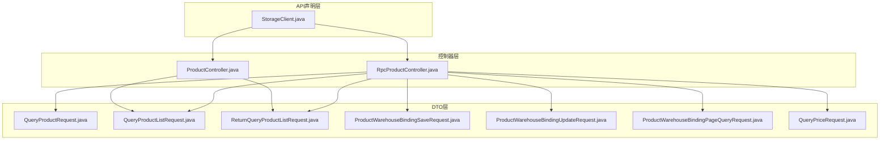
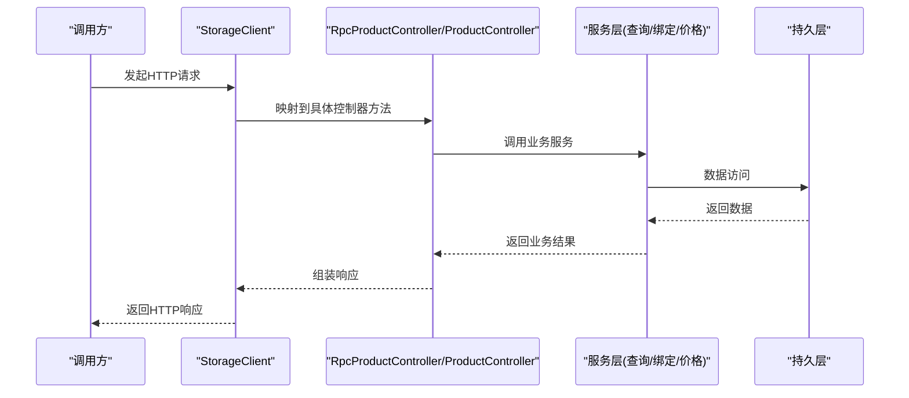
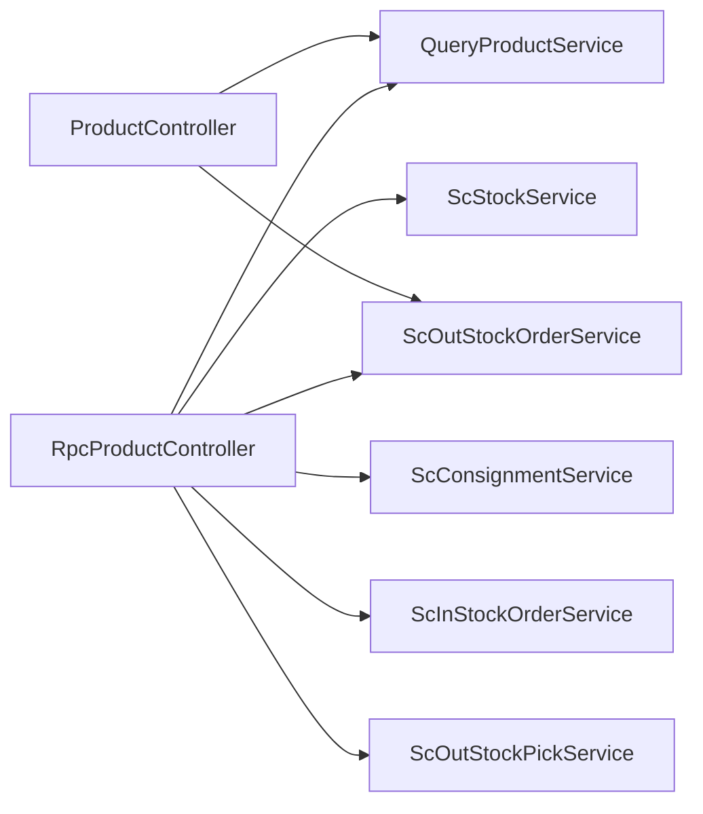

# 产品管理接口

<cite>
**本文引用的文件**
- [StorageClient.java](file://guoke-deepexi-storage-center-api/src/main/java/com/ke/deepexi/api/storage/StorageClient.java)
- [RpcProductController.java](file://guoke-deepexi-storage-center-provider/src/main/java/com/ke/deepexi/storage/controller/rpc/RpcProductController.java)
- [ProductController.java](file://guoke-deepexi-storage-center-provider/src/main/java/com/ke/deepexi/storage/controller/web/ProductController.java)
- [QueryProductRequest.java](file://guoke-deepexi-storage-center-api/src/main/java/com/ke/deepexi/api/storage/dto/product/QueryProductRequest.java)
- [QueryProductResponse.java](file://guoke-deepexi-storage-center-api/src/main/java/com/ke/deepexi/api/storage/dto/product/QueryProductResponse.java)
- [QueryProductListRequest.java](file://guoke-deepexi-storage-center-api/src/main/java/com/ke/deepexi/api/storage/dto/product/QueryProductListRequest.java)
- [QueryProductListResponse.java](file://guoke-deepexi-storage-center-api/src/main/java/com/ke/deepexi/api/storage/dto/product/QueryProductListResponse.java)
- [ReturnQueryProductListRequest.java](file://guoke-deepexi-storage-center-api/src/main/java/com/ke/deepexi/api/storage/dto/product/ReturnQueryProductListRequest.java)
- [ReturnQueryProductListResponse.java](file://guoke-deepexi-storage-center-api/src/main/java/com/ke/deepexi/api/storage/dto/product/ReturnQueryProductListResponse.java)
- [ProductWarehouseBindingSaveRequest.java](file://guoke-deepexi-storage-center-api/src/main/java/com/ke/deepexi/api/storage/dto/productwarehousebinding/ProductWarehouseBindingSaveRequest.java)
- [ProductWarehouseBindingUpdateRequest.java](file://guoke-deepexi-storage-center-api/src/main/java/com/ke/deepexi/api/storage/dto/productwarehousebinding/ProductWarehouseBindingUpdateRequest.java)
- [ProductWarehouseBindingPageQueryRequest.java](file://guoke-deepexi-storage-center-api/src/main/java/com/ke/deepexi/api/storage/dto/productwarehousebinding/ProductWarehouseBindingPageQueryRequest.java)
- [QueryPriceRequest.java](file://guoke-deepexi-storage-center-api/src/main/java/com/ke/deepexi/api/storage/dto/QueryPriceRequest.java)
- [QueryPriceResponse.java](file://guoke-deepexi-storage-center-api/src/main/java/com/ke/deepexi/api/storage/dto/QueryPriceResponse.java)
</cite>

## 目录
1. [简介](#简介)
2. [项目结构](#项目结构)
3. [核心组件](#核心组件)
4. [架构总览](#架构总览)
5. [详细组件分析](#详细组件分析)
6. [依赖分析](#依赖分析)
7. [性能考虑](#性能考虑)
8. [故障排查指南](#故障排查指南)
9. [结论](#结论)
10. [附录](#附录)

## 简介
本文件面向产品管理相关API，覆盖产品查询、产品绑定、产品价格管理等能力，提供统一的接口规范说明，包括HTTP方法、URL路径、请求参数、响应格式与错误码，并给出典型场景的请求/响应示例与数据结构说明，帮助前后端协作与集成。

## 项目结构
围绕产品管理的接口主要分布在以下位置：
- API声明层（Feign客户端）：定义对外暴露的REST接口契约
- 控制器层（RPC/Web）：实现具体业务逻辑，处理请求与返回
- DTO层：定义请求/响应数据结构与校验规则

图表来源
- [StorageClient.java:285-289](file://guoke-deepexi-storage-center-api/src/main/java/com/ke/deepexi/api/storage/StorageClient.java#L285-L289)
- [RpcProductController.java:101-106](file://guoke-deepexi-storage-center-provider/src/main/java/com/ke/deepexi/storage/controller/rpc/RpcProductController.java#L101-L106)
- [ProductController.java:43-86](file://guoke-deepexi-storage-center-provider/src/main/java/com/ke/deepexi/storage/controller/web/ProductController.java#L43-L86)

章节来源
- [StorageClient.java:285-289](file://guoke-deepexi-storage-center-api/src/main/java/com/ke/deepexi/api/storage/StorageClient.java#L285-L289)
- [RpcProductController.java:101-106](file://guoke-deepexi-storage-center-provider/src/main/java/com/ke/deepexi/storage/controller/rpc/RpcProductController.java#L101-L106)
- [ProductController.java:43-86](file://guoke-deepexi-storage-center-provider/src/main/java/com/ke/deepexi/storage/controller/web/ProductController.java#L43-L86)

## 核心组件
- 产品查询接口族
  - 查询产品详情
  - 查询产品列表（销售选择）
  - 退货相关产品查询（采购/销售/无源）
- 产品绑定接口族
  - 新增绑定
  - 更新绑定
  - 分页查询绑定
- 产品价格管理接口族
  - 批量查询出入库产品价格
- 权限与校验
  - 参数校验（非空、范围等）
  - 认证上下文注入（公司、体系等）

章节来源
- [StorageClient.java:285-289](file://guoke-deepexi-storage-center-api/src/main/java/com/ke/deepexi/api/storage/StorageClient.java#L285-L289)
- [RpcProductController.java:101-106](file://guoke-deepexi-storage-center-provider/src/main/java/com/ke/deepexi/storage/controller/rpc/RpcProductController.java#L101-L106)
- [ProductController.java:43-86](file://guoke-deepexi-storage-center-provider/src/main/java/com/ke/deepexi/storage/controller/web/ProductController.java#L43-L86)

## 架构总览
产品管理接口采用“API声明 + 控制器 + DTO”的分层设计，通过Feign客户端统一对外暴露REST接口，控制器负责参数解析、业务编排与异常处理，DTO负责数据结构与校验。

图表来源
- [StorageClient.java:285-289](file://guoke-deepexi-storage-center-api/src/main/java/com/ke/deepexi/api/storage/StorageClient.java#L285-L289)
- [RpcProductController.java:101-106](file://guoke-deepexi-storage-center-provider/src/main/java/com/ke/deepexi/storage/controller/rpc/RpcProductController.java#L101-L106)
- [ProductController.java:43-86](file://guoke-deepexi-storage-center-provider/src/main/java/com/ke/deepexi/storage/controller/web/ProductController.java#L43-L86)

## 详细组件分析

### 一、产品查询接口

#### 1. 查询产品详情
- HTTP方法：GET
- URL：/api/product/detail
- 功能：根据公司、批号、序列号、UDI等条件查询产品详情
- 请求参数（查询参数）
  - company_id：公司id（必填）
  - lot_no：批号（选填）
  - serial_no：序列号（选填）
  - udi：UDI（选填）
- 响应字段
  - prodTime：生产日期
  - expireTime：过期日期
  - lotNo：批号
  - serialNo：序列号
  - udi：UDI
- 示例
  - 请求示例：GET /api/product/detail?company_id=1001&lot_no=LOT20240101&serial_no=S123456
  - 响应示例：包含prodTime、expireTime、lotNo、serialNo、udi等字段的对象
- 错误码
  - 400：参数缺失或非法
  - 500：服务内部异常

章节来源
- [StorageClient.java:285-286](file://guoke-deepexi-storage-center-api/src/main/java/com/ke/deepexi/api/storage/StorageClient.java#L285-L286)
- [QueryProductRequest.java:18-35](file://guoke-deepexi-storage-center-api/src/main/java/com/ke/deepexi/api/storage/dto/product/QueryProductRequest.java#L18-L35)
- [QueryProductResponse.java:22-33](file://guoke-deepexi-storage-center-api/src/main/java/com/ke/deepexi/api/storage/dto/product/QueryProductResponse.java#L22-L33)

#### 2. 查询产品列表（销售选择）
- HTTP方法：GET
- URL：/api/product/choose
- 功能：按条件分页查询产品列表，用于销售选择
- 请求参数（查询参数）
  - company_id：公司id（必填）
  - product_name：产品名称（选填）
  - manufacturer：生产厂商（选填）
  - product_code：产品编码（选填）
  - regist_no：注册证号（选填）
  - right_company_id：物权方（选填）
  - warehouse_company_id：受托方/有仓库公司id（选填）
  - warehouse_id：仓库id（选填）
  - isCustomsBonded：是否保税（选填）
  - page/pageSize：分页参数（由BaseQuery提供）
- 响应字段
  - auth_id：授权id
  - plat_code：产品平台
  - product_code：产品编码
  - product_name：产品名称
  - spec：规格
  - model：型号
  - unit：最小单位
  - manufacturer_name：生产厂商
  - regist_no：注册证号
  - manage_type/manage_type_value：管理分类
  - category_2002/category_2017：分类
  - udi/serial_no/lot_no：UDI/序列号/批号
  - company_id：公司id
  - total：库存数量
  - in_stock_record_id：入库单id
  - price：模板价格
  - prod_time/expire_time：生产/失效日期
  - inStockOrderId/inStockCode/inStockObjCode：入库相关信息
- 示例
  - 请求示例：GET /api/product/choose?company_id=1001&product_name=某药品&page=1&pageSize=20
  - 响应示例：包含上述字段的分页列表
- 错误码
  - 400：参数缺失或非法
  - 500：服务内部异常

章节来源
- [StorageClient.java:288-289](file://guoke-deepexi-storage-center-api/src/main/java/com/ke/deepexi/api/storage/StorageClient.java#L288-L289)
- [QueryProductListRequest.java:19-46](file://guoke-deepexi-storage-center-api/src/main/java/com/ke/deepexi/api/storage/dto/product/QueryProductListRequest.java#L19-L46)
- [QueryProductListResponse.java:14-76](file://guoke-deepexi-storage-center-api/src/main/java/com/ke/deepexi/api/storage/dto/product/QueryProductListResponse.java#L14-L76)

#### 3. 退货相关产品查询
- 3.1 采退/消退（按原始单据查询可退商品）
  - HTTP方法：GET
  - URL：/api/product/return
  - 请求参数（查询参数）
    - company_id/right_company_id/warehouse_company_id/warehouse_id：必填
    - orderNo/orderId：必填
    - return_type：退货类型（0：采购；1：销售）
    - product_name/manufacturer/product_code/regist_no：选填
    - allData：是否包含零库存（0/1）
  - 响应字段：与退货列表一致，包含可退数量、价格、生产/失效日期、仓库信息等
  - 示例
    - 请求示例：GET /api/product/return?company_id=1001&right_company_id=2001&warehouse_company_id=1001&warehouse_id=3001&orderNo=SO20240101&orderId=OID001&return_type=0
    - 响应示例：包含退货商品列表
  - 错误码：同上

- 3.2 无源退货（按公司查询可退商品）
  - HTTP方法：GET
  - URL：/api/product/return/self
  - 请求参数：同上（除orderNo/orderId）
  - 响应字段：同上
  - 示例
    - 请求示例：GET /api/product/return/self?company_id=1001&right_company_id=2001&warehouse_company_id=1001&warehouse_id=3001&product_name=某药
    - 响应示例：包含可退商品列表
  - 错误码：同上

章节来源
- [ProductController.java:56-86](file://guoke-deepexi-storage-center-provider/src/main/java/com/ke/deepexi/storage/controller/web/ProductController.java#L56-L86)
- [ReturnQueryProductListRequest.java:21-52](file://guoke-deepexi-storage-center-api/src/main/java/com/ke/deepexi/api/storage/dto/product/ReturnQueryProductListRequest.java#L21-L52)
- [ReturnQueryProductListResponse.java:15-76](file://guoke-deepexi-storage-center-api/src/main/java/com/ke/deepexi/api/storage/dto/product/ReturnQueryProductListResponse.java#L15-L76)

### 二、产品绑定接口

#### 1. 新增产品绑定
- HTTP方法：POST
- URL：/api/product/warehouseBinding/save
- 请求体字段
  - warehouseId：仓库id（必填）
  - goodsRackId：货架id（必填）
  - goodsLocationId：货位id（必填）
  - productList：产品列表（必填）
    - rootProductId：根产品id（必填）
    - productName：产品名称（必填）
    - companyProdCode：产品编码（必填）
- 响应：成功/失败标识
- 示例
  - 请求示例：POST /api/product/warehouseBinding/save
  - 响应示例：成功/失败标识
- 错误码
  - 400：参数缺失或非法
  - 500：服务内部异常

章节来源
- [ProductWarehouseBindingSaveRequest.java:13-61](file://guoke-deepexi-storage-center-api/src/main/java/com/ke/deepexi/api/storage/dto/productwarehousebinding/ProductWarehouseBindingSaveRequest.java#L13-L61)

#### 2. 更新产品绑定
- HTTP方法：POST
- URL：/api/product/warehouseBinding/update
- 请求体字段
  - id：绑定记录id（必填）
  - rootProductId/productName/companyProdCode：同新增
  - warehouseId/goodsRackId/goodsLocationId：同新增
  - isEffective：是否启用（必填）
- 响应：成功/失败标识
- 示例
  - 请求示例：POST /api/product/warehouseBinding/update
  - 响应示例：成功/失败标识
- 错误码：同上

章节来源
- [ProductWarehouseBindingUpdateRequest.java:10-55](file://guoke-deepexi-storage-center-api/src/main/java/com/ke/deepexi/api/storage/dto/productwarehousebinding/ProductWarehouseBindingUpdateRequest.java#L10-L55)

#### 3. 分页查询产品绑定
- HTTP方法：GET
- URL：/api/product/warehouseBinding/page
- 请求参数（查询参数）
  - productName：产品名称（选填）
  - companyProdCode：产品编码（选填）
  - page/pageSize：分页参数
- 响应：分页列表（包含绑定信息）
- 示例
  - 请求示例：GET /api/product/warehouseBinding/page?companyProdCode=CP001&page=1&pageSize=20
  - 响应示例：分页列表
- 错误码：同上

章节来源
- [ProductWarehouseBindingPageQueryRequest.java:10-18](file://guoke-deepexi-storage-center-api/src/main/java/com/ke/deepexi/api/storage/dto/productwarehousebinding/ProductWarehouseBindingPageQueryRequest.java#L10-L18)

### 三、产品价格管理接口

#### 1. 批量查询出入库产品价格
- HTTP方法：POST
- URL：/api/product/queryPrice
- 请求体字段
  - stockType：库存类型（出库/入库/拣货等）
  - orderType：订单类型（出库/入库）
  - orderNo/orderId：订单编号/订单id（至少一个）
  - productIds：产品id列表（选填）
- 响应字段
  - 单据行级价格信息（如单价、金额等）
- 示例
  - 请求示例：POST /api/product/queryPrice
  - 响应示例：价格明细列表
- 错误码
  - 400：参数缺失或非法
  - 500：服务内部异常

章节来源
- [RpcProductController.java:500-518](file://guoke-deepexi-storage-center-provider/src/main/java/com/ke/deepexi/storage/controller/rpc/RpcProductController.java#L500-L518)
- [QueryPriceRequest.java](file://guoke-deepexi-storage-center-api/src/main/java/com/ke/deepexi/api/storage/dto/QueryPriceRequest.java)
- [QueryPriceResponse.java](file://guoke-deepexi-storage-center-api/src/main/java/com/ke/deepexi/api/storage/dto/QueryPriceResponse.java)

### 四、权限控制与数据验证规则

- 权限控制
  - 控制器中通过认证上下文注入公司id等信息，确保业务在正确的租户/公司域内执行
  - 部分接口对关键参数进行非空校验，避免空指针与无效查询
- 数据验证
  - 使用注解对必填字段进行约束（如@NotEmpty/@NotBlank/@Min/@Max）
  - 对枚举/范围进行限制（如退货类型0/1）
- 错误处理
  - 参数校验失败返回400
  - 业务异常捕获并返回统一错误码
  - 服务异常记录日志并返回500

章节来源
- [RpcProductController.java:283-284](file://guoke-deepexi-storage-center-provider/src/main/java/com/ke/deepexi/storage/controller/rpc/RpcProductController.java#L283-L284)
- [ProductController.java:60-65](file://guoke-deepexi-storage-center-provider/src/main/java/com/ke/deepexi/storage/controller/web/ProductController.java#L60-L65)
- [ReturnQueryProductListRequest.java:41-43](file://guoke-deepexi-storage-center-api/src/main/java/com/ke/deepexi/api/storage/dto/product/ReturnQueryProductListRequest.java#L41-L43)

## 依赖分析
- 控制器依赖
  - RpcProductController依赖查询、库存、寄售、出/入库单、拣货等相关服务
  - ProductController依赖查询与出库产品服务
- DTO依赖
  - 所有接口均以DTO作为请求/响应载体，保证契约稳定
- 外部依赖
  - Feign客户端统一声明REST接口，便于跨服务调用

图表来源
- [RpcProductController.java:49-73](file://guoke-deepexi-storage-center-provider/src/main/java/com/ke/deepexi/storage/controller/rpc/RpcProductController.java#L49-L73)
- [ProductController.java:37-41](file://guoke-deepexi-storage-center-provider/src/main/java/com/ke/deepexi/storage/controller/web/ProductController.java#L37-L41)

章节来源
- [RpcProductController.java:49-73](file://guoke-deepexi-storage-center-provider/src/main/java/com/ke/deepexi/storage/controller/rpc/RpcProductController.java#L49-L73)
- [ProductController.java:37-41](file://guoke-deepexi-storage-center-provider/src/main/java/com/ke/deepexi/storage/controller/web/ProductController.java#L37-L41)

## 性能考虑
- 分页查询：列表接口统一支持分页参数，建议前端合理设置page/pageSize，避免一次性拉取过多数据
- 缓存策略：部分DTO包含缓存注解，可结合缓存提升高频字段（如产品名称、规格等）的查询效率
- 批量操作：价格查询、退货匹配等接口支持批量输入，减少多次往返
- 日志与异常：控制器对异常进行捕获与日志记录，避免异常传播影响整体性能

## 故障排查指南
- 常见问题
  - 参数缺失：检查必填字段是否传入（如company_id、orderNo、orderId等）
  - 退货类型错误：return_type需为0或1
  - 订单为空：退货接口要求orderNo与orderId至少传其一
- 定位手段
  - 查看控制器日志输出（JSON打印请求参数）
  - 检查服务层异常栈与统一错误码
  - 核对DTO字段与接口文档一致性

章节来源
- [ProductController.java:60-65](file://guoke-deepexi-storage-center-provider/src/main/java/com/ke/deepexi/storage/controller/web/ProductController.java#L60-L65)
- [RpcProductController.java:219-224](file://guoke-deepexi-storage-center-provider/src/main/java/com/ke/deepexi/storage/controller/rpc/RpcProductController.java#L219-L224)

## 结论
本文档梳理了产品管理相关的核心接口，明确了查询、绑定与价格管理的规范与边界，提供了参数、响应与错误码说明，并给出了权限与校验要点。建议在实际对接时严格遵循DTO契约与分页规范，确保系统稳定性与扩展性。

## 附录

### A. 接口清单与示例（摘要）
- 查询产品详情
  - GET /api/product/detail
  - 请求：company_id、lot_no、serial_no、udi
  - 响应：prodTime、expireTime、lotNo、serialNo、udi
- 查询产品列表（销售选择）
  - GET /api/product/choose
  - 请求：company_id、product_name、manufacturer、product_code、regist_no、right_company_id、warehouse_company_id、warehouse_id、isCustomsBonded、page/pageSize
  - 响应：产品列表（含auth_id、plat_code、product_code、product_name、spec、model、unit、manufacturer_name、regist_no、manage_type、category_2002、category_2017、udi、serial_no、lot_no、company_id、total、in_stock_record_id、price、prod_time、expire_time、inStockOrderId、inStockCode、inStockObjCode）
- 退货相关
  - GET /api/product/return
    - 请求：company_id、right_company_id、warehouse_company_id、warehouse_id、orderNo、orderId、return_type、product_name、manufacturer、product_code、regist_no、allData
    - 响应：退货商品列表（含可退数量、价格、生产/失效日期、仓库信息）
  - GET /api/product/return/self
    - 请求：同上（不含orderNo/orderId）
- 产品绑定
  - POST /api/product/warehouseBinding/save
    - 请求：warehouseId、goodsRackId、goodsLocationId、productList（rootProductId、productName、companyProdCode）
  - POST /api/product/warehouseBinding/update
    - 请求：id、rootProductId、productName、companyProdCode、warehouseId、goodsRackId、goodsLocationId、isEffective
  - GET /api/product/warehouseBinding/page
    - 请求：productName、companyProdCode、page、pageSize
- 产品价格
  - POST /api/product/queryPrice
    - 请求：stockType、orderType、orderNo、orderId、productIds
    - 响应：价格明细列表

章节来源
- [StorageClient.java:285-289](file://guoke-deepexi-storage-center-api/src/main/java/com/ke/deepexi/api/storage/StorageClient.java#L285-L289)
- [RpcProductController.java:500-518](file://guoke-deepexi-storage-center-provider/src/main/java/com/ke/deepexi/storage/controller/rpc/RpcProductController.java#L500-L518)
- [ProductController.java:56-86](file://guoke-deepexi-storage-center-provider/src/main/java/com/ke/deepexi/storage/controller/web/ProductController.java#L56-L86)