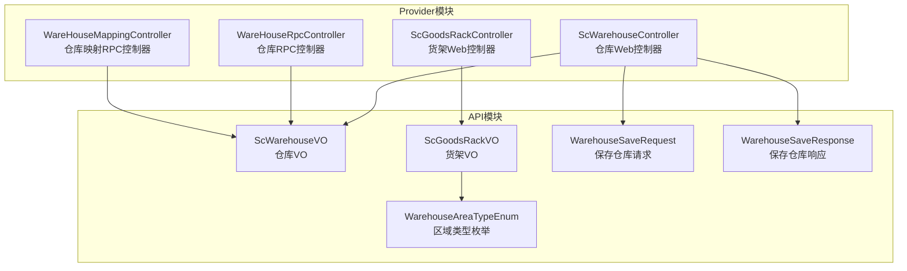
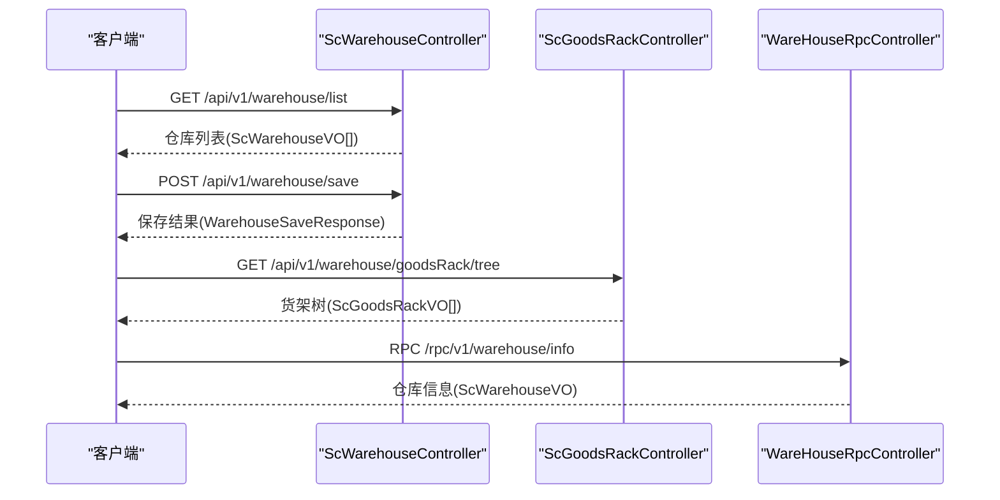
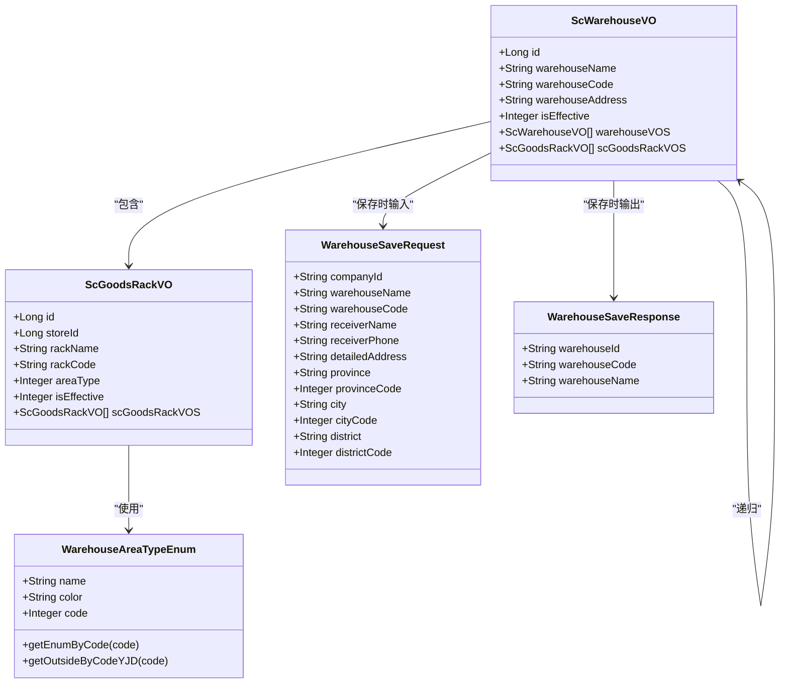

# 仓库管理接口

<cite>
**本文引用的文件**
- [ScWarehouseVO.java](file://guoke-deepexi-storage-center-api/src/main/java/com/deepexi/api/storage/dto/warehouse/ScWarehouseVO.java)
- [ScGoodsRackVO.java](file://guoke-deepexi-storage-center-api/src/main/java/com/deepexi/api/storage/dto/warehouse/ScGoodsRackVO.java)
- [WarehouseSaveRequest.java](file://guoke-deepexi-storage-center-api/src/main/java/com/deepexi/api/storage/dto/warehouse/WarehouseSaveRequest.java)
- [WarehouseSaveResponse.java](file://guoke-deepexi-storage-center-api/src/main/java/com/deepexi/api/storage/dto/warehouse/WarehouseSaveResponse.java)
- [WarehouseAreaTypeEnum.java](file://guoke-deepexi-storage-center-api/src/main/java/com/deepexi/api/storage/enums/WarehouseAreaTypeEnum.java)
- [ScWarehouseController.java](file://guoke-deepexi-storage-center-provider/src/main/java/com/deepexi/storage/controller/web/ScWarehouseController.java)
- [ScGoodsRackController.java](file://guoke-deepexi-storage-center-provider/src/main/java/com/deepexi/storage/controller/web/ScGoodsRackController.java)
- [WareHouseRpcController.java](file://guoke-deepexi-storage-center-provider/src/main/java/com/depthi/storage/controller/rpc/WareHouseRpcController.java)
- [WareHouseMappingController.java](file://guoke-deepexi-storage-center-provider/src/main/java/com/depthi/storage/controller/rpc/WareHouseMappingController.java)
</cite>

## 目录
1. [简介](#简介)
2. [项目结构](#项目结构)
3. [核心组件](#核心组件)
4. [架构总览](#架构总览)
5. [详细组件分析](#详细组件分析)
6. [依赖分析](#依赖分析)
7. [性能考虑](#性能考虑)
8. [故障排查指南](#故障排查指南)
9. [结论](#结论)
10. [附录](#附录)

## 简介
本文件面向仓库管理相关API，覆盖仓库配置、货架管理与区域管理等能力，提供接口规范（HTTP方法、URL路径、请求参数、响应格式、错误码）、数据模型与业务规则说明，并给出典型请求/响应示例与权限控制、数据校验要点。仓库管理能力主要通过Web控制器与RPC控制器对外提供服务，数据模型由API模块中的VO与枚举类定义。

## 项目结构
仓库管理相关代码分布在API与Provider两部分：
- API模块：定义仓库、货架、区域等数据模型与枚举，以及RPC请求/响应对象。
- Provider模块：实现Web与RPC控制器，暴露REST接口与RPC接口。

图表来源
- [ScWarehouseVO.java:1-205](file://guoke-deepexi-storage-center-api/src/main/java/com/depthi/api/storage/dto/warehouse/ScWarehouseVO.java#L1-L205)
- [ScGoodsRackVO.java:1-127](file://guoke-deepexi-storage-center-api/src/main/java/com/depthi/api/storage/dto/warehouse/ScGoodsRackVO.java#L1-L127)
- [WarehouseAreaTypeEnum.java:1-69](file://guoke-deepexi-storage-center-api/src/main/java/com/depthi/api/storage/enums/WarehouseAreaTypeEnum.java#L1-L69)
- [WarehouseSaveRequest.java:1-61](file://guoke-deepexi-storage-center-api/src/main/java/com/depthi/api/storage/dto/warehouse/WarehouseSaveRequest.java#L1-L61)
- [WarehouseSaveResponse.java:1-28](file://guoke-deepexi-storage-center-api/src/main/java/com/depthi/api/storage/dto/warehouse/WarehouseSaveResponse.java#L1-L28)
- [ScWarehouseController.java](file://guoke-deepexi-storage-center-provider/src/main/java/com/depthi/storage/controller/web/ScWarehouseController.java)
- [ScGoodsRackController.java](file://guoke-deepexi-storage-center-provider/src/main/java/com/depthi/storage/controller/web/ScGoodsRackController.java)
- [WareHouseRpcController.java](file://guoke-deepexi-storage-center-provider/src/main/java/com/depthi/storage/controller/rpc/WareHouseRpcController.java)
- [WareHouseMappingController.java](file://guoke-deepexi-storage-center-provider/src/main/java/com/depthi/storage/controller/rpc/WareHouseMappingController.java)

章节来源
- [ScWarehouseVO.java:1-205](file://guoke-deepexi-storage-center-api/src/main/java/com/depthi/api/storage/dto/warehouse/ScWarehouseVO.java#L1-L205)
- [ScGoodsRackVO.java:1-127](file://guoke-deepexi-storage-center-api/src/main/java/com/depthi/api/storage/dto/warehouse/ScGoodsRackVO.java#L1-L127)
- [WarehouseAreaTypeEnum.java:1-69](file://guoke-deepexi-storage-center-api/src/main/java/com/depthi/api/storage/enums/WarehouseAreaTypeEnum.java#L1-L69)
- [WarehouseSaveRequest.java:1-61](file://guoke-deepexi-storage-center-api/src/main/java/com/depthi/api/storage/dto/warehouse/WarehouseSaveRequest.java#L1-L61)
- [WarehouseSaveResponse.java:1-28](file://guoke-deepexi-storage-center-api/src/main/java/com/depthi/api/storage/dto/warehouse/WarehouseSaveResponse.java#L1-L28)
- [ScWarehouseController.java](file://guoke-deepexi-storage-center-provider/src/main/java/com/depthi/storage/controller/web/ScWarehouseController.java)
- [ScGoodsRackController.java](file://guoke-deepexi-storage-center-provider/src/main/java/com/depthi/storage/controller/web/ScGoodsRackController.java)
- [WareHouseRpcController.java](file://guoke-deepexi-storage-center-provider/src/main/java/com/depthi/storage/controller/rpc/WareHouseRpcController.java)
- [WareHouseMappingController.java](file://guoke-deepexi-storage-center-provider/src/main/java/com/depthi/storage/controller/rpc/WareHouseMappingController.java)

## 核心组件
- 仓库数据模型：包含仓库基本信息、地址信息、归属关系、状态与时间戳等字段，支持树形结构（父子仓库）与货架列表嵌套。
- 货架数据模型：包含货架/货位层级、区域类型、负责人、状态与时间戳等字段，支持树形结构（父子货架）。
- 区域类型枚举：定义区域颜色与用途（如合格品区、待验区、不合格品区、发货区、退货区、召回区），并提供外部编码转换方法。
- 仓库保存请求/响应：用于创建或更新仓库时的输入输出结构。

章节来源
- [ScWarehouseVO.java:1-205](file://guoke-deepexi-storage-center-api/src/main/java/com/depthi/api/storage/dto/warehouse/ScWarehouseVO.java#L1-L205)
- [ScGoodsRackVO.java:1-127](file://guoke-deepexi-storage-center-api/src/main/java/com/depthi/api/storage/dto/warehouse/ScGoodsRackVO.java#L1-L127)
- [WarehouseAreaTypeEnum.java:1-69](file://guoke-deepexi-storage-center-api/src/main/java/com/depthi/api/storage/enums/WarehouseAreaTypeEnum.java#L1-L69)
- [WarehouseSaveRequest.java:1-61](file://guoke-deepexi-storage-center-api/src/main/java/com/depthi/api/storage/dto/warehouse/WarehouseSaveRequest.java#L1-L61)
- [WarehouseSaveResponse.java:1-28](file://guoke-deepexi-storage-center-api/src/main/java/com/depthi/api/storage/dto/warehouse/WarehouseSaveResponse.java#L1-L28)

## 架构总览
仓库管理接口分为Web与RPC两类：
- Web接口：面向前端或内部服务调用，提供仓库与货架的查询、保存、删除等操作。
- RPC接口：面向下游系统或跨系统集成，提供仓库与映射的RPC能力。

图表来源
- [ScWarehouseController.java](file://guoke-deepexi-storage-center-provider/src/main/java/com/depthi/storage/controller/web/ScWarehouseController.java)
- [ScGoodsRackController.java](file://guoke-deepexi-storage-center-provider/src/main/java/com/depthi/storage/controller/web/ScGoodsRackController.java)
- [WareHouseRpcController.java](file://guoke-deepexi-storage-center-provider/src/main/java/com/depthi/storage/controller/rpc/WareHouseRpcController.java)

## 详细组件分析

### 仓库接口规范
- 接口目标：提供仓库列表查询、仓库配置保存、仓库详情查询等能力。
- 控制器路径：/api/v1/warehouse
- 关键请求/响应模型：ScWarehouseVO、WarehouseSaveRequest、WarehouseSaveResponse

接口清单
- 查询仓库列表
  - 方法：GET
  - 路径：/api/v1/warehouse/list
  - 请求参数：无
  - 响应：仓库数组（ScWarehouseVO[]）
  - 业务规则：返回当前租户下的可用仓库列表，支持树形结构嵌套货架
  - 示例：见“附录-请求/响应示例”

- 保存仓库
  - 方法：POST
  - 路径：/api/v1/warehouse/save
  - 请求体：WarehouseSaveRequest
  - 响应：WarehouseSaveResponse
  - 数据校验：必填字段校验（所属公司、仓库名称、仓库编码、联系人、联系电话、详细地址）
  - 权限控制：需具备仓库维护权限
  - 示例：见“附录-请求/响应示例”

- 查询仓库详情
  - 方法：GET
  - 路径：/api/v1/warehouse/detail/{id}
  - 路径参数：id（仓库ID）
  - 响应：ScWarehouseVO
  - 业务规则：返回仓库及其下属货架、子仓库的完整信息
  - 示例：见“附录-请求/响应示例”

- 删除仓库
  - 方法：DELETE
  - 路径：/api/v1/warehouse/delete/{id}
  - 路径参数：id（仓库ID）
  - 响应：布尔值（成功/失败）
  - 业务规则：仅可删除无库存与关联业务的仓库
  - 示例：见“附录-请求/响应示例”

章节来源
- [ScWarehouseController.java](file://guoke-deepexi-storage-center-provider/src/main/java/com/depthi/storage/controller/web/ScWarehouseController.java)
- [ScWarehouseVO.java:1-205](file://guoke-deepexi-storage-center-api/src/main/java/com/depthi/api/storage/dto/warehouse/ScWarehouseVO.java#L1-L205)
- [WarehouseSaveRequest.java:1-61](file://guoke-deepexi-storage-center-api/src/main/java/com/depthi/api/storage/dto/warehouse/WarehouseSaveRequest.java#L1-L61)
- [WarehouseSaveResponse.java:1-28](file://guoke-deepexi-storage-center-api/src/main/java/com/depthi/api/storage/dto/warehouse/WarehouseSaveResponse.java#L1-L28)

### 货架接口规范
- 接口目标：提供货架树查询、货架新增/编辑、货架删除等能力。
- 控制器路径：/api/v1/warehouse/goodsRack
- 关键请求/响应模型：ScGoodsRackVO、WarehouseAreaTypeEnum

接口清单
- 查询货架树
  - 方法：GET
  - 路径：/api/v1/warehouse/goodsRack/tree
  - 请求参数：无
  - 响应：货架树（ScGoodsRackVO[]）
  - 业务规则：支持货架与货位两级结构，按fullPath构建父子关系
  - 示例：见“附录-请求/响应示例”

- 保存货架
  - 方法：POST
  - 路径：/api/v1/warehouse/goodsRack/save
  - 请求体：ScGoodsRackVO
  - 响应：布尔值（成功/失败）
  - 数据校验：必填字段校验（仓库ID、货架名称、货架编码、区域类型、状态）
  - 示例：见“附录-请求/响应示例”

- 删除货架
  - 方法：DELETE
  - 路径：/api/v1/warehouse/goodsRack/delete/{id}
  - 路径参数：id（货架ID）
  - 响应：布尔值（成功/失败）
  - 业务规则：仅可删除无库存占用的货架
  - 示例：见“附录-请求/响应示例”

章节来源
- [ScGoodsRackController.java](file://guoke-deepexi-storage-center-provider/src/main/java/com/depthi/storage/controller/web/ScGoodsRackController.java)
- [ScGoodsRackVO.java:1-127](file://guoke-deepexi-storage-center-api/src/main/java/com/depthi/api/storage/dto/warehouse/ScGoodsRackVO.java#L1-L127)
- [WarehouseAreaTypeEnum.java:1-69](file://guoke-deepexi-storage-center-api/src/main/java/com/depthi/api/storage/enums/WarehouseAreaTypeEnum.java#L1-L69)

### 区域管理接口规范
- 接口目标：提供区域类型枚举查询与外部编码转换能力。
- 控制器路径：/api/v1/warehouse/area
- 关键模型：WarehouseAreaTypeEnum

接口清单
- 查询区域类型枚举
  - 方法：GET
  - 路径：/api/v1/warehouse/area/types
  - 请求参数：无
  - 响应：区域类型数组（含名称、颜色、编码）
  - 业务规则：用于前端展示与选择区域类型
  - 示例：见“附录-请求/响应示例”

- 外部编码转换
  - 方法：GET
  - 路径：/api/v1/warehouse/area/outside-code
  - 请求参数：code（区域编码）
  - 响应：外部编码字符串（如 Q/D/N/S/R 等）
  - 业务规则：根据编码返回对应外部系统识别码
  - 示例：见“附录-请求/响应示例”

章节来源
- [WarehouseAreaTypeEnum.java:1-69](file://guoke-deepexi-storage-center-api/src/main/java/com/depthi/api/storage/enums/WarehouseAreaTypeEnum.java#L1-L69)

### RPC接口规范
- 接口目标：提供跨系统仓库信息查询与仓库映射能力。
- 控制器路径：/rpc/v1/warehouse

接口清单
- 查询仓库信息
  - 方法：GET
  - 路径：/rpc/v1/warehouse/info
  - 请求参数：id（仓库ID）
  - 响应：ScWarehouseVO
  - 业务规则：供下游系统查询仓库基础信息与树形结构
  - 示例：见“附录-请求/响应示例”

- 仓库映射
  - 方法：POST
  - 路径：/rpc/v1/warehouseMapping/save
  - 请求体：仓库映射请求对象
  - 响应：布尔值（成功/失败）
  - 业务规则：建立仓库与外部系统的映射关系
  - 示例：见“附录-请求/响应示例”

章节来源
- [WareHouseRpcController.java](file://guoke-deepexi-storage-center-provider/src/main/java/com/depthi/storage/controller/rpc/WareHouseRpcController.java)
- [WareHouseMappingController.java](file://guoke-deepexi-storage-center-provider/src/main/java/com/depthi/storage/controller/rpc/WareHouseMappingController.java)

## 依赖分析
仓库管理接口的依赖关系如下：

图表来源
- [ScWarehouseVO.java:1-205](file://guoke-deepexi-storage-center-api/src/main/java/com/depthi/api/storage/dto/warehouse/ScWarehouseVO.java#L1-L205)
- [ScGoodsRackVO.java:1-127](file://guoke-deepexi-storage-center-api/src/main/java/com/depthi/api/storage/dto/warehouse/ScGoodsRackVO.java#L1-L127)
- [WarehouseAreaTypeEnum.java:1-69](file://guoke-deepexi-storage-center-api/src/main/java/com/depthi/api/storage/enums/WarehouseAreaTypeEnum.java#L1-L69)
- [WarehouseSaveRequest.java:1-61](file://guoke-deepexi-storage-center-api/src/main/java/com/depthi/api/storage/dto/warehouse/WarehouseSaveRequest.java#L1-L61)
- [WarehouseSaveResponse.java:1-28](file://guoke-deepexi-storage-center-api/src/main/java/com/depthi/api/storage/dto/warehouse/WarehouseSaveResponse.java#L1-L28)

## 性能考虑
- 分页与懒加载：仓库列表与货架树建议采用分页或按需加载策略，避免一次性返回大量嵌套数据。
- 缓存策略：对区域类型枚举与常用仓库信息进行缓存，降低重复查询开销。
- 并发控制：保存/删除仓库与货架时需加锁或使用乐观锁，防止并发冲突。
- 数据压缩：RPC接口可启用压缩传输，减少跨系统调用带宽占用。

## 故障排查指南
- 常见错误码
  - 400：请求参数缺失或格式错误（如必填字段为空、编码重复）
  - 401：未授权访问（缺少权限或Token失效）
  - 403：禁止访问（无仓库维护权限）
  - 404：资源不存在（仓库/货架ID无效）
  - 409：业务冲突（如删除存在库存的仓库）
  - 500：服务器内部错误（数据库异常、RPC调用失败）

- 排查步骤
  - 核对请求参数：确保必填字段齐全且格式正确。
  - 核对权限：确认调用方具备相应角色与租户权限。
  - 核对业务规则：检查是否存在库存占用、关联订单等限制条件。
  - 查看日志：定位RPC调用失败或数据库异常原因。

## 结论
仓库管理接口围绕仓库、货架与区域三类核心实体展开，提供Web与RPC双栈能力，满足内部系统与外部系统对接需求。通过明确的数据模型、严格的参数校验与清晰的业务规则，保障了接口的稳定性与扩展性。建议在生产环境中结合缓存、分页与并发控制等手段进一步提升性能与可靠性。

## 附录

### 数据模型与字段说明
- 仓库（ScWarehouseVO）
  - 关键字段：id、warehouseName、warehouseCode、warehouseAddress、isEffective、parentId、warehouseVOS、scGoodsRackVOS、tenantId、createdAt、updatedAt
  - 业务含义：仓库基本信息、树形结构、货架集合、地址与时间戳等

- 货架（ScGoodsRackVO）
  - 关键字段：id、storeId、rackName、rackCode、areaType、principal、principalPhone、parentId、type、fullPath、isEffective、tenantId、createdAt、updatedAt
  - 业务含义：货架/货位层级、区域类型、负责人、状态与时间戳等

- 区域类型（WarehouseAreaTypeEnum）
  - 关键字段：name、color、code
  - 业务含义：区域颜色与用途枚举，支持外部编码转换

- 保存仓库（WarehouseSaveRequest/WarehouseSaveResponse）
  - 输入：companyId、warehouseName、warehouseCode、receiverName、receiverPhone、detailedAddress、province、provinceCode、city、cityCode、district、districtCode
  - 输出：warehouseId、warehouseCode、warehouseName

章节来源
- [ScWarehouseVO.java:1-205](file://guoke-deepexi-storage-center-api/src/main/java/com/depthi/api/storage/dto/warehouse/ScWarehouseVO.java#L1-L205)
- [ScGoodsRackVO.java:1-127](file://guoke-deepexi-storage-center-api/src/main/java/com/depthi/api/storage/dto/warehouse/ScGoodsRackVO.java#L1-L127)
- [WarehouseAreaTypeEnum.java:1-69](file://guoke-deepexi-storage-center-api/src/main/java/com/depthi/api/storage/enums/WarehouseAreaTypeEnum.java#L1-L69)
- [WarehouseSaveRequest.java:1-61](file://guoke-deepexi-storage-center-api/src/main/java/com/depthi/api/storage/dto/warehouse/WarehouseSaveRequest.java#L1-L61)
- [WarehouseSaveResponse.java:1-28](file://guoke-deepexi-storage-center-api/src/main/java/com/depthi/api/storage/dto/warehouse/WarehouseSaveResponse.java#L1-L28)

### 请求/响应示例
以下为典型请求与响应示例（以路径与字段形式描述，不含具体代码内容）：
- 查询仓库列表
  - 请求：GET /api/v1/warehouse/list
  - 响应：数组，元素为仓库对象（包含id、warehouseName、warehouseCode、warehouseAddress、isEffective、warehouseVOS、scGoodsRackVOS）

- 保存仓库
  - 请求体：{
      "companyId": "公司ID",
      "warehouseName": "仓库名称",
      "warehouseCode": "仓库编码",
      "receiverName": "联系人",
      "receiverPhone": "联系电话",
      "detailedAddress": "详细地址",
      "province": "省份",
      "provinceCode": 1000,
      "city": "城市",
      "cityCode": 100000,
      "district": "区县",
      "districtCode": 1000000
    }
  - 响应体：{
      "warehouseId": "仓库ID",
      "warehouseCode": "仓库编码",
      "warehouseName": "仓库名称"
    }

- 查询货架树
  - 请求：GET /api/v1/warehouse/goodsRack/tree
  - 响应：数组，元素为货架对象（包含id、storeId、rackName、rackCode、areaType、isEffective、scGoodsRackVOS）

- 区域类型枚举
  - 请求：GET /api/v1/warehouse/area/types
  - 响应：数组，元素为区域类型对象（包含name、color、code）

- RPC查询仓库信息
  - 请求：GET /rpc/v1/warehouse/info?id=仓库ID
  - 响应：仓库对象（ScWarehouseVO）

章节来源
- [ScWarehouseController.java](file://guoke-deepexi-storage-center-provider/src/main/java/com/depthi/storage/controller/web/ScWarehouseController.java)
- [ScGoodsRackController.java](file://guoke-deepexi-storage-center-provider/src/main/java/com/depthi/storage/controller/web/ScGoodsRackController.java)
- [WareHouseRpcController.java](file://guoke-deepexi-storage-center-provider/src/main/java/com/depthi/storage/controller/rpc/WareHouseRpcController.java)