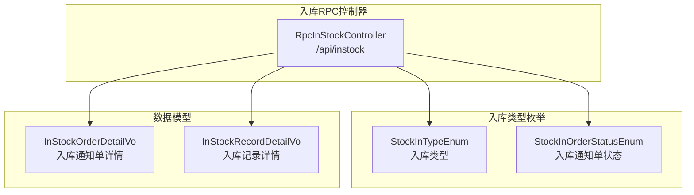
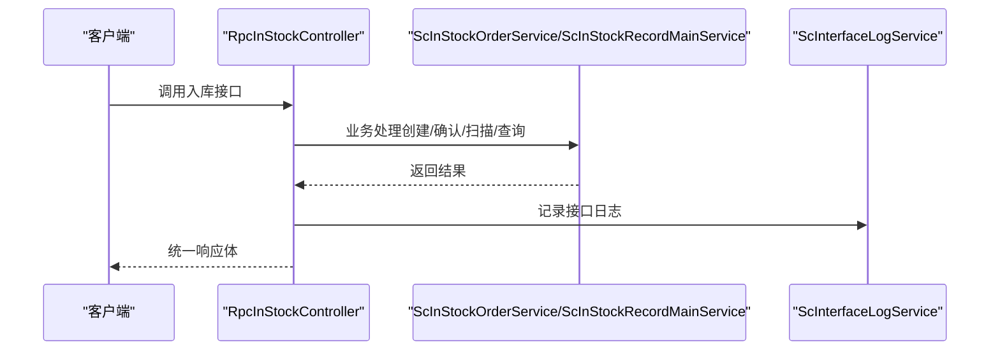
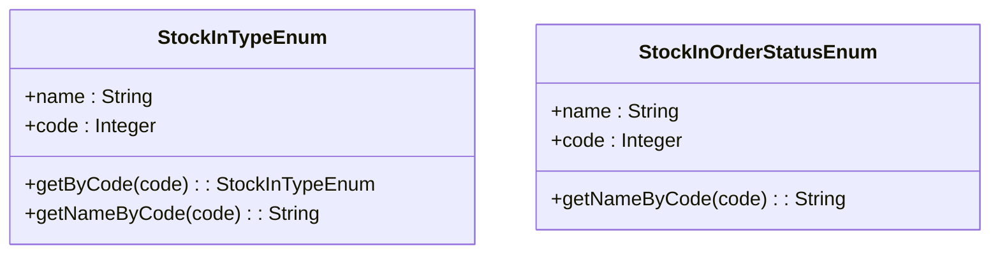
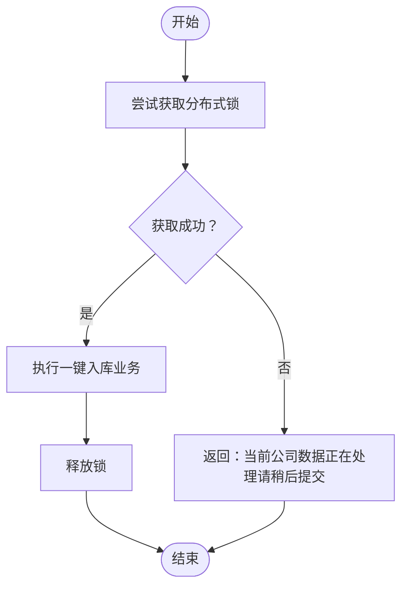
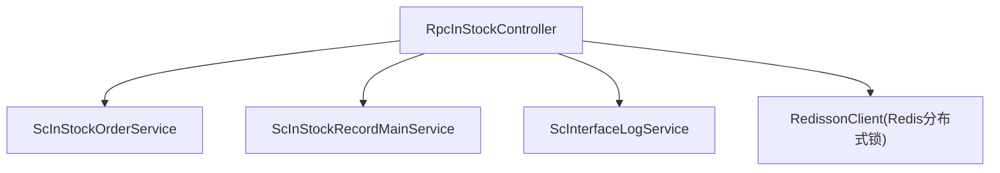

# 入库管理接口

<cite>
**本文引用的文件**
- [RpcInStockController.java](file://guoke-deepexi-storage-center-provider/src/main/java/com/deepexi/storage/controller/rpc/RpcInStockController.java)
- [StockInTypeEnum.java](file://guoke-deepexi-storage-center-api/src/main/java/com/deepexi/api/storage/enums/in/StockInTypeEnum.java)
- [StockInOrderStatusEnum.java](file://guoke-deepexi-storage-center-api/src/main/java/com/deepexi/api/storage/enums/in/StockInOrderStatusEnum.java)
- [InStockOrderDetailVo.java](file://guoke-deepexi-storage-center-api/src/main/java/com/deepexi/api/storage/dto/in/InStockOrderDetailVo.java)
- [InStockRecordDetailVo.java](file://guoke-deepexi-storage-center-api/src/main/java/com/deepexi/api/storage/dto/in/InStockRecordDetailVo.java)
- [BatchInStockByOrderInfoRequest.java](file://guoke-deepexi-storage-center-api/src/main/java/com/deepexi/api/storage/dto/BatchInStockByOrderInfoRequest.java)
- [InStockByOutStockRecordRequest.java](file://guoke-deepexi-storage-center-api/src/main/java/com/deepexi/api/storage/dto/InStockByOutStockRecordRequest.java)
- [OneClickInStockRequest.java](file://guoke-deepexi-storage-center-api/src/main/java/com/deepexi/api/storage/dto/in/OneClickInStockRequest.java)
- [InStockScanCodeImportRequest.java](file://guoke-deepexi-storage-center-api/src/main/java/com/deepexi/api/storage/dto/in/InStockScanCodeImportRequest.java)
- [ExportInStockOrderRequest.java](file://guoke-deepexi-storage-center-api/src/main/java/com/deepexi/api/storage/dto/in/ExportInStockOrderRequest.java)
- [ExportInStockRecordRequest.java](file://guoke-deepexi-storage-center-api/src/main/java/com/deepexi/api/storage/dto/in/ExportInStockRecordRequest.java)
- [InStockCheckOrReviewRecordPageRequest.java](file://guoke-deepexi-storage-center-api/src/main/java/com/deepexi/api/storage/dto/in/InStockCheckOrReviewRecordPageRequest.java)
- [InStockProductRequest.java](file://guoke-deepexi-storage-center-api/src/main/java/com/deepexi/api/storage/dto/in/InStockProductRequest.java)
- [QueryChannelInStockInstRequest.java](file://guoke-deepexi-storage-center-api/src/main/java/com/deepexi/api/storage/dto/in/QueryChannelInStockInstRequest.java)
- [ExternalInStockRecordMainDTO.java](file://guoke-deepexi-storage-center-api/src/main/java/com/deepexi/api/storage/dto/in/ExternalInStockRecordMainDTO.java)
- [UpdateRelationExternalCodeRequest.java](file://guoke-deepexi-storage-center-api/src/main/java/com/deepexi/api/storage/dto/UpdateRelationExternalCodeRequest.java)
- [ScInStockOrderDTO.java](file://guoke-deepexi-storage-center-api/src/main/java/com/deepexi/api/storage/pojo/dto/stockin/req/ScInStockOrderDTO.java)
- [ScInStockRecordMianDTO.java](file://guoke-deepexi-storage-center-api/src/main/java/com/deepexi/api/storage/pojo/dto/stockin/req/ScInStockRecordMianDTO.java)
- [OweInStockPageRequest.java](file://guoke-deepexi-storage-center-api/src/main/java/com/deepexi/api/storage/dto/out/OweInStockPageRequest.java)
</cite>

## 目录
1. [简介](#简介)
2. [项目结构](#项目结构)
3. [核心组件](#核心组件)
4. [架构概览](#架构概览)
5. [详细组件分析](#详细组件分析)
6. [依赖分析](#依赖分析)
7. [性能考虑](#性能考虑)
8. [故障排查指南](#故障排查指南)
9. [结论](#结论)
10. [附录](#附录)

## 简介
本文件面向入库管理相关API，覆盖采购入库、退货入库、调拨入库、其他入库等多种入库类型，系统性梳理以下能力与规范：
- 创建入库通知单与入库单
- 入库确认与一键入库
- 入库扫描导入与重新扫码
- 入库记录查询与导出
- 外部系统对接与欠货记录
- 权限控制、分布式锁与幂等策略
- 错误码与状态管理

## 项目结构
入库管理API主要由RPC控制器统一对外暴露，核心入口位于“/api/instock”，围绕入库通知单与入库记录两条主线提供REST接口。

图表来源
- [RpcInStockController.java:51-534](file://guoke-deepexi-storage-center-provider/src/main/java/com/depthexi/storage/controller/rpc/RpcInStockController.java#L51-L534)
- [StockInTypeEnum.java:14-53](file://guoke-deepexi-storage-center-api/src/main/java/com/depthexi/api/storage/enums/in/StockInTypeEnum.java#L14-L53)
- [StockInOrderStatusEnum.java:12-40](file://guoke-deepexi-storage-center-api/src/main/java/com/depthexi/api/storage/enums/in/StockInOrderStatusEnum.java#L12-L40)
- [InStockOrderDetailVo.java:17-41](file://guoke-deepexi-storage-center-api/src/main/java/com/depthexi/api/storage/dto/in/InStockOrderDetailVo.java#L17-L41)
- [InStockRecordDetailVo.java:15-65](file://guoke-deepexi-storage-center-api/src/main/java/com/depthexi/api/storage/dto/in/InStockRecordDetailVo.java#L15-L65)

章节来源
- [RpcInStockController.java:51-534](file://guoke-deepexi-storage-center-provider/src/main/java/com/depthexi/storage/controller/rpc/RpcInStockController.java#L51-L534)

## 核心组件
- 入库RPC控制器：集中提供入库通知单、入库单、扫描导入、记录查询、外部对接等接口。
- 入库类型枚举：定义入库类型（采购、销售退回、其他、冲红、样品、1+2模式、T3、拒收）。
- 入库状态枚举：定义入库通知单状态（待审核、待质检、待复检、待入库、已完成、已驳回）。
- 数据模型：入库通知单详情、入库记录详情等VO模型。

章节来源
- [StockInTypeEnum.java:14-53](file://guoke-deepexi-storage-center-api/src/main/java/com/depthexi/api/storage/enums/in/StockInTypeEnum.java#L14-L53)
- [StockInOrderStatusEnum.java:12-40](file://guoke-deepexi-storage-center-api/src/main/java/com/depthexi/api/storage/enums/in/StockInOrderStatusEnum.java#L12-L40)
- [InStockOrderDetailVo.java:17-41](file://guoke-deepexi-storage-center-api/src/main/java/com/depthexi/api/storage/dto/in/InStockOrderDetailVo.java#L17-L41)
- [InStockRecordDetailVo.java:15-65](file://guoke-deepexi-storage-center-api/src/main/java/com/depthexi/api/storage/dto/in/InStockRecordDetailVo.java#L15-L65)

## 架构概览
入库管理采用RPC控制器统一入口，结合分布式锁保障并发安全，通过服务层完成业务编排与数据持久化。

图表来源
- [RpcInStockController.java:51-534](file://guoke-deepexi-storage-center-provider/src/main/java/com/depthexi/storage/controller/rpc/RpcInStockController.java#L51-L534)

## 详细组件分析

### 1. 入库类型与状态
- 入库类型（StockInTypeEnum）
  - 采购入库、销售退回入库、其他入库、冲红入库、样品入库、1+2模式入库、T3入库、拒收入库。
- 入库通知单状态（StockInOrderStatusEnum）
  - 待审核、待质检、待复检、待入库、已完成、已驳回。

图表来源
- [StockInTypeEnum.java:14-53](file://guoke-deepexi-storage-center-api/src/main/java/com/depthexi/api/storage/enums/in/StockInTypeEnum.java#L14-L53)
- [StockInOrderStatusEnum.java:12-40](file://guoke-deepexi-storage-center-api/src/main/java/com/depthexi/api/storage/enums/in/StockInOrderStatusEnum.java#L12-L40)

章节来源
- [StockInTypeEnum.java:14-53](file://guoke-deepexi-storage-center-api/src/main/java/com/depthexi/api/storage/enums/in/StockInTypeEnum.java#L14-L53)
- [StockInOrderStatusEnum.java:12-40](file://guoke-deepexi-storage-center-api/src/main/java/com/depthexi/api/storage/enums/in/StockInOrderStatusEnum.java#L12-L40)

### 2. 创建入库通知单
- 接口
  - 方法：POST
  - 路径：/api/instock/inStockSave
  - 请求体：ScInStockOrderDTO
  - 响应体：BaseResponseDto<InStockOrderResponse>
- 业务要点
  - 校验请求参数，创建入库通知单并返回单据标识。
  - 统一响应封装，异常时设置失败码与消息。

章节来源
- [RpcInStockController.java:84-98](file://guoke-deepexi-storage-center-provider/src/main/java/com/depthexi/storage/controller/rpc/RpcInStockController.java#L84-L98)
- [ScInStockOrderDTO.java](file://guoke-deepexi-storage-center-api/src/main/java/com/depthexi/api/storage/pojo/dto/stockin/req/ScInStockOrderDTO.java)

### 3. 创建入库单（通用）
- 接口
  - 方法：POST
  - 路径：/api/instock/inStockMainSave
  - 请求体：ScInStockRecordMianDTO
  - 响应体：BaseResponseDto<Boolean>
- 业务要点
  - 通用生成入库单流程，返回布尔结果表示是否成功。

章节来源
- [RpcInStockController.java:120-135](file://guoke-deepexi-storage-center-provider/src/main/java/com/depthexi/storage/controller/rpc/RpcInStockController.java#L120-L135)
- [ScInStockRecordMianDTO.java](file://guoke-deepexi-storage-center-api/src/main/java/com/depthexi/api/storage/pojo/dto/stockin/req/ScInStockRecordMianDTO.java)

### 4. 一键入库
- 接口
  - 方法：POST
  - 路径：/api/instock/oneClick
  - 请求体：OneClickInStockRequest
  - 响应体：BaseResponseDto<Boolean>
- 并发与幂等
  - 使用Redisson分布式锁，避免同一公司同时处理。
  - 成功后返回true；若锁不可用，返回提示信息。

图表来源
- [RpcInStockController.java:255-280](file://guoke-deepexi-storage-center-provider/src/main/java/com/depthexi/storage/controller/rpc/RpcInStockController.java#L255-L280)

章节来源
- [RpcInStockController.java:255-280](file://guoke-deepexi-storage-center-provider/src/main/java/com/depthexi/storage/controller/rpc/RpcInStockController.java#L255-L280)
- [OneClickInStockRequest.java](file://guoke-deepexi-storage-center-api/src/main/java/com/depthexi/api/storage/dto/in/OneClickInStockRequest.java)

### 5. 根据出库单生成入库通知单
- 接口
  - 方法：POST
  - 路径：/api/instock/inStockByOutStockRecord
  - 请求体：InStockByOutStockRecordRequest
  - 响应体：BaseResponseDto<Boolean>
- 并发与幂等
  - 使用Redisson分布式锁，按公司维度加锁。
  - 若存在业务异常信息，抛出业务异常；否则返回true。

章节来源
- [RpcInStockController.java:361-389](file://guoke-deepexi-storage-center-provider/src/main/java/com/depthexi/storage/controller/rpc/RpcInStockController.java#L361-L389)
- [InStockByOutStockRecordRequest.java](file://guoke-deepexi-storage-center-api/src/main/java/com/depthexi/api/storage/dto/InStockByOutStockRecordRequest.java)

### 6. 批量一键入库（异步）
- 接口
  - 方法：POST
  - 路径：/api/instock/batchInStockByOrderInfo
  - 请求体：BatchInStockByOrderInfoRequest
  - 响应体：BaseResponseDto<Boolean>
- 并发与幂等
  - 异步线程获取锁，主线程等待最多约11秒，返回是否开始处理。
  - 超时或异常时返回相应错误码与消息。

章节来源
- [RpcInStockController.java:398-460](file://guoke-deepexi-storage-center-provider/src/main/java/com/depthexi/storage/controller/rpc/RpcInStockController.java#L398-L460)
- [BatchInStockByOrderInfoRequest.java](file://guoke-deepexi-storage-center-api/src/main/java/com/depthexi/api/storage/dto/BatchInStockByOrderInfoRequest.java)

### 7. 入库扫描导入与重新扫码
- 扫描导入
  - 方法：POST
  - 路径：/api/instock/importInStockScanCode
  - 请求体：InStockScanCodeImportRequest
  - 响应体：BaseResponseDto<List<InStockScanCodeImportResponse>>
- 批量重新扫码
  - 方法：POST
  - 路径：/api/instock/batchAfreshScanCode
  - 请求体：List<Long>（明细ID列表）
  - 响应体：BaseResponseDto<Boolean>

章节来源
- [RpcInStockController.java:154-167](file://guoke-deepexi-storage-center-provider/src/main/java/com/depthexi/storage/controller/rpc/RpcInStockController.java#L154-L167)
- [RpcInStockController.java:319-331](file://guoke-deepexi-storage-center-provider/src/main/java/com/depthexi/storage/controller/rpc/RpcInStockController.java#L319-L331)
- [InStockScanCodeImportRequest.java](file://guoke-deepexi-storage-center-api/src/main/java/com/depthexi/api/storage/dto/in/InStockScanCodeImportRequest.java)

### 8. 入库记录查询与导出
- 验收记录分页查询
  - 方法：POST
  - 路径：/api/instock/pageInStockCheckRecord
  - 请求体：InStockCheckOrReviewRecordPageRequest
  - 响应体：BaseResponseDto<PageBean<InStockCheckOrReviewRecordPageResponse>>
- 复核记录分页查询
  - 方法：POST
  - 路径：/api/instock/pageInStockReviewRecord
  - 请求体：InStockCheckOrReviewRecordPageRequest
  - 响应体：BaseResponseDto<PageBean<InStockCheckOrReviewRecordPageResponse>>
- 明细记录分页查询（带价格）
  - 方法：POST
  - 路径：/api/instock/pageInStockInstRecord
  - 请求体：InStockCheckOrReviewRecordPageRequest
  - 响应体：BaseResponseDto<PageBean<InStockCheckOrReviewRecordPageResponse>>
- 导出入库通知单
  - 方法：POST
  - 路径：/api/instock/pageExportInStockOrder
  - 请求体：ExportInStockOrderRequest
  - 响应体：BaseResponseDto<PageBean<ExportInStockOrderResponse>>
- 导出入库单
  - 方法：POST
  - 路径：/api/instock/pageExportInStockRecord
  - 请求体：ExportInStockRecordRequest
  - 响应体：BaseResponseDto<PageBean<ExportInStockRecordResponse>>

章节来源
- [RpcInStockController.java:219-253](file://guoke-deepexi-storage-center-provider/src/main/java/com/depthexi/storage/controller/rpc/RpcInStockController.java#L219-L253)
- [RpcInStockController.java:207-217](file://guoke-deepexi-storage-center-provider/src/main/java/com/depthexi/storage/controller/rpc/RpcInStockController.java#L207-L217)
- [InStockCheckOrReviewRecordPageRequest.java](file://guoke-deepexi-storage-center-api/src/main/java/com/depthexi/api/storage/dto/in/InStockCheckOrReviewRecordPageRequest.java)
- [ExportInStockOrderRequest.java](file://guoke-deepexi-storage-center-api/src/main/java/com/depthexi/api/storage/dto/in/ExportInStockOrderRequest.java)
- [ExportInStockRecordRequest.java](file://guoke-deepexi-storage-center-api/src/main/java/com/depthexi/api/storage/dto/in/ExportInStockRecordRequest.java)

### 9. 外部系统对接与欠货记录
- 外部入库（如爱康）
  - 方法：POST
  - 路径：/api/instock/external
  - 请求体：ExternalInStockRecordMainDTO
  - 响应体：BaseResponseDto<ExternalInStockRecordMainResDTO>
  - 并发：按应用+通知单维度加锁，最长持有2小时。
- 欠货记录（采购方-收货视角）
  - 方法：POST
  - 路径：/api/instock/record/pageOweInStockRecord
  - 请求体：OweInStockPageRequest
  - 响应体：BaseResponseDto<PageBean<OweInStockPageResponse>>

章节来源
- [RpcInStockController.java:468-494](file://guoke-deepexi-storage-center-provider/src/main/java/com/depthexi/storage/controller/rpc/RpcInStockController.java#L468-L494)
- [RpcInStockController.java:348-352](file://guoke-deepexi-storage-center-provider/src/main/java/com/depthexi/storage/controller/rpc/RpcInStockController.java#L348-L352)
- [ExternalInStockRecordMainDTO.java](file://guoke-deepexi-storage-center-api/src/main/java/com/depthexi/api/storage/dto/in/ExternalInStockRecordMainDTO.java)
- [OweInStockPageRequest.java](file://guoke-deepexi-storage-center-api/src/main/java/com/depthexi/api/storage/dto/out/OweInStockPageRequest.java)

### 10. 渠道库存体系下的入库明细查询
- 接口
  - 方法：POST
  - 路径：/api/instock/queryChannelInStockInst
  - 请求体：QueryChannelInStockInstRequest
  - 响应体：BaseResponseDto<PageBean<QueryChannelInStockInstResponse>>
- 适用场景
  - 查询渠道库存体系下所有公司的入库明细。

章节来源
- [RpcInStockController.java:521-532](file://guoke-deepexi-storage-center-provider/src/main/java/com/depthexi/storage/controller/rpc/RpcInStockController.java#L521-L532)
- [QueryChannelInStockInstRequest.java](file://guoke-deepexi-storage-center-api/src/main/java/com/depthexi/api/storage/dto/in/QueryChannelInStockInstRequest.java)

### 11. 关联外部单号与产品查询
- 获取未关联外部单号
  - 方法：GET
  - 路径：/api/instock/correlation
  - 响应体：List<CorrelationCodeVo>
- 根据三方单号获取入库产品
  - 方法：GET
  - 路径：/api/instock/inStockProduct
  - 查询参数：InStockProductRequest
  - 响应体：BaseResponseDto<List<InStockProductResponse>>
- 更新关联外部系统单号或ID
  - 方法：PUT
  - 路径：/api/instock/updateRelationExternalCode
  - 请求体：UpdateRelationExternalCodeRequest
  - 响应体：BaseResponseDto<Boolean>

章节来源
- [RpcInStockController.java:294-303](file://guoke-deepexi-storage-center-provider/src/main/java/com/depthexi/storage/controller/rpc/RpcInStockController.java#L294-L303)
- [RpcInStockController.java:305-317](file://guoke-deepexi-storage-center-provider/src/main/java/com/depthexi/storage/controller/rpc/RpcInStockController.java#L305-L317)
- [RpcInStockController.java:496-507](file://guoke-deepexi-storage-center-provider/src/main/java/com/depthexi/storage/controller/rpc/RpcInStockController.java#L496-L507)
- [InStockProductRequest.java](file://guoke-deepexi-storage-center-api/src/main/java/com/depthexi/api/storage/dto/in/InStockProductRequest.java)
- [UpdateRelationExternalCodeRequest.java](file://guoke-deepexi-storage-center-api/src/main/java/com/depthexi/api/storage/dto/UpdateRelationExternalCodeRequest.java)

### 12. 数据模型与字段说明
- 入库通知单详情（InStockOrderDetailVo）
  - 字段：id、inStockOrderCode、sourceCompanyName、createBy、warehouseName、createAt、inStockOrderType、inStockOrderStatus、pageItemList
- 入库记录详情（InStockRecordDetailVo）
  - 字段：in_stock_record_code、orderCode、createDate、receiveName、createBy、in_stock_order_code、warehouse_name、warehouseAddress、in_stock_record_time、in_stock_order_type、supplierCompanyName、rightCompanyName、delegateCompanyName、prodItemNum、allCount、status、relationOutRecordCode、relationOutRecordDate、itemList、pageItemList、priceInStock

章节来源
- [InStockOrderDetailVo.java:17-41](file://guoke-deepexi-storage-center-api/src/main/java/com/depthexi/api/storage/dto/in/InStockOrderDetailVo.java#L17-L41)
- [InStockRecordDetailVo.java:15-65](file://guoke-deepexi-storage-center-api/src/main/java/com/depthexi/api/storage/dto/in/InStockRecordDetailVo.java#L15-L65)

## 依赖分析
- 控制器依赖服务层与接口日志服务，实现业务编排与审计。
- 分布式锁用于并发控制，避免重复处理与数据竞争。
- 统一响应封装，便于前端与外部系统消费。

图表来源
- [RpcInStockController.java:57-76](file://guoke-deepexi-storage-center-provider/src/main/java/com/depthexi/storage/controller/rpc/RpcInStockController.java#L57-L76)

章节来源
- [RpcInStockController.java:57-76](file://guoke-deepexi-storage-center-provider/src/main/java/com/depthexi/storage/controller/rpc/RpcInStockController.java#L57-L76)

## 性能考虑
- 异步批量一键入库：主线程等待约11秒，避免阻塞；业务逻辑在异步线程执行，提升吞吐。
- 分布式锁：按公司或通知单维度加锁，减少锁竞争；超时与异常有明确返回，避免长时间阻塞。
- 分页查询：对验收、复核、明细记录均支持分页，降低单次响应体积。
- 文件导入：提供异步校验与保存回调，避免大文件直接阻塞主线程。

## 故障排查指南
- 常见错误码
  - REQUEST_FAIL_CODE：请求失败时统一错误码。
- 锁相关问题
  - 当前公司数据正在处理请稍后提交：分布式锁占用导致。
  - 解锁接口：/api/instock/unlock（仅运维使用）。
- 超时与异常
  - 任务处理超时：检查异步线程执行耗时与锁等待时间。
  - 系统内部错误：查看服务端异常栈与接口日志。
- 参数校验
  - 所有入参均进行校验，异常时返回具体错误信息。

章节来源
- [RpcInStockController.java:276-278](file://guoke-deepexi-storage-center-provider/src/main/java/com/depthexi/storage/controller/rpc/RpcInStockController.java#L276-L278)
- [RpcInStockController.java:441-458](file://guoke-deepexi-storage-center-provider/src/main/java/com/depthexi/storage/controller/rpc/RpcInStockController.java#L441-L458)
- [RpcInStockController.java:462-466](file://guoke-deepexi-storage-center-provider/src/main/java/com/depthexi/storage/controller/rpc/RpcInStockController.java#L462-L466)

## 结论
入库管理API以统一RPC入口为核心，覆盖从创建通知单、生成入库单、一键入库、扫描导入、记录查询到外部对接的完整链路。通过分布式锁与异步机制保障高并发下的稳定性，配合统一响应与日志记录，满足多场景、多系统的集成需求。

## 附录

### A. 入库类型与状态对照
- 入库类型（示例）
  - 采购入库：1
  - 销售退回入库：2
  - 其他入库：3
  - 冲红入库：4
  - 样品入库：5
  - 1+2模式入库：6
  - T3入库：7
  - 拒收入库：8
- 入库通知单状态（示例）
  - 待审核：8
  - 待质检：1
  - 待复检：7
  - 待入库：2
  - 已完成：4
  - 已驳回：5

章节来源
- [StockInTypeEnum.java:16-25](file://guoke-deepexi-storage-center-api/src/main/java/com/depthexi/api/storage/enums/in/StockInTypeEnum.java#L16-L25)
- [StockInOrderStatusEnum.java:14-25](file://guoke-deepexi-storage-center-api/src/main/java/com/depthexi/api/storage/enums/in/StockInOrderStatusEnum.java#L14-L25)