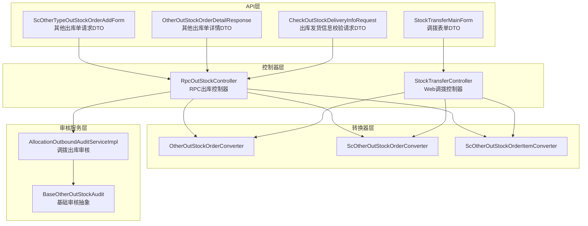
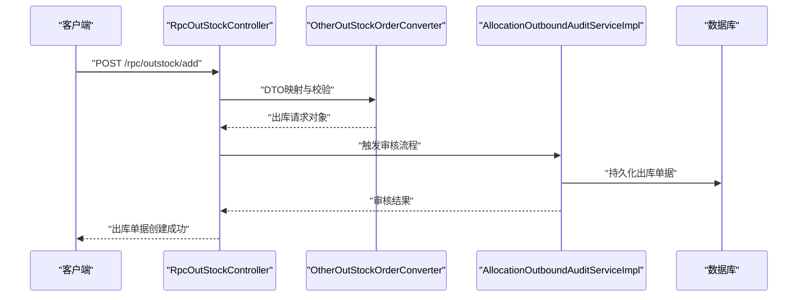
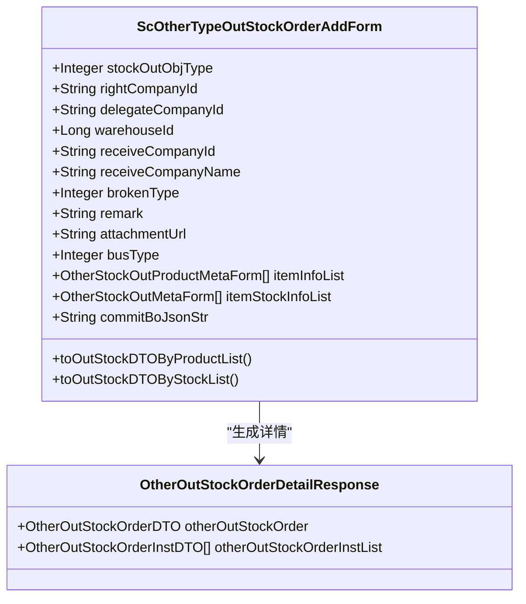
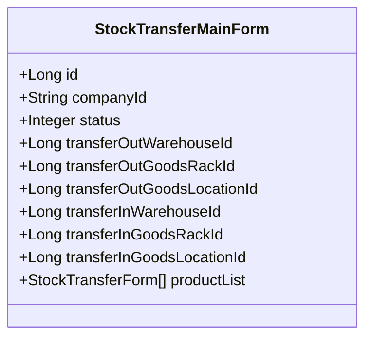
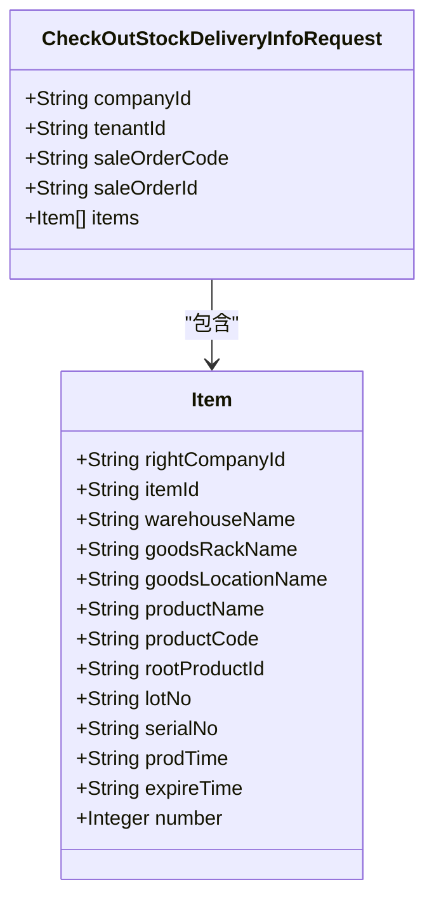
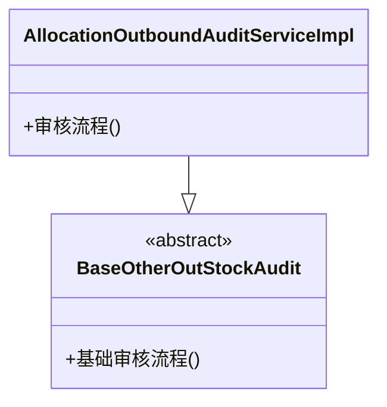
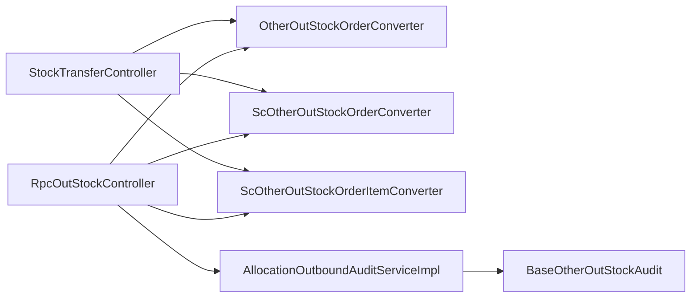

# 出库管理接口

<cite>
**本文档引用的文件**
- [ScOtherTypeOutStockOrderAddForm.java](file://guoke-deepexi-storage-center-api/src/main/java/com/deepexi/api/storage/dto/otheroutstock/request/ScOtherTypeOutStockOrderAddForm.java)
- [OtherOutStockOrderDetailResponse.java](file://guoke-deepexi-storage-center-api/src/main/java/com/deepexi/api/storage/dto/otheroutstock/response/OtherOutStockOrderDetailResponse.java)
- [StockTransferMainForm.java](file://guoke-deepexi-storage-center-api/src/main/java/com/deepexi/api/storage/dto/transfer/StockTransferMainForm.java)
- [CheckOutStockDeliveryInfoRequest.java](file://guoke-deepexi-storage-center-api/src/main/java/com/deepexi/api/storage/dto/out/CheckOutStockDeliveryInfoRequest.java)
- [RpcOutStockController.java](file://guoke-deepexi-storage-center-provider/src/main/java/com/depthexi/storage/controller/rpc/RpcOutStockController.java)
- [StockTransferController.java](file://guoke-deepexi-storage-center-provider/src/main/java/com/depthexi/storage/controller/web/StockTransferController.java)
- [OtherOutStockOrderConverter.java](file://guoke-deepexi-storage-center-provider/src/main/java/com/depthexi/storage/converter/otheroutstockorder/OtherOutStockOrderConverter.java)
- [ScOtherOutStockOrderConverter.java](file://guoke-deepexi-storage-center-provider/src/main/java/com/depthexi/storage/converter/otheroutstockorder/ScOtherOutStockOrderConverter.java)
- [ScOtherOutStockOrderItemConverter.java](file://guoke-deepexi-storage-center-provider/src/main/java/com/depthexi/storage/converter/otheroutstockorder/ScOtherOutStockOrderItemConverter.java)
- [AllocationOutboundAuditServiceImpl.java](file://guoke-deepexi-storage-center-provider/src/main/java/com/depthexi/storage/service/impl/otheroutstockaudit/AllocationOutboundAuditServiceImpl.java)
- [BaseOtherOutStockAudit.java](file://guoke-deepexi-storage-center-provider/src/main/java/com/depthexi/storage/service/impl/otheroutstockaudit/BaseOtherOutStockAudit.java)
</cite>

## 目录
1. [简介](#简介)
2. [项目结构](#项目结构)
3. [核心组件](#核心组件)
4. [架构总览](#架构总览)
5. [详细组件分析](#详细组件分析)
6. [依赖分析](#依赖分析)
7. [性能考虑](#性能考虑)
8. [故障排查指南](#故障排查指南)
9. [结论](#结论)

## 简介
本文件面向仓储中心“出库管理”相关API，覆盖销售出库、退货出库、调拨出库、其他出库等多类出库场景的接口规范与流程说明。内容包含：
- 接口定义：HTTP方法、URL路径、请求参数、响应格式、错误码
- 典型场景：创建出库单、出库确认、出库扫描、出库记录查询
- 权限控制与数据校验规则
- 状态管理与业务规则
- 以实际源码为依据的接口清单与流程图

## 项目结构
围绕出库管理的关键模块分布如下：
- API层（DTO与枚举）：定义请求/响应模型与业务枚举
- 控制器层（RPC/Web）：对外暴露REST接口
- 转换器层：DTO与持久化实体之间的映射
- 审核服务层：出库单据的审核与状态流转

图表来源
- [RpcOutStockController.java](file://guoke-deepexi-storage-center-provider/src/main/java/com/depthexi/storage/controller/rpc/RpcOutStockController.java)
- [StockTransferController.java](file://guoke-deepexi-storage-center-provider/src/main/java/com/depthexi/storage/controller/web/StockTransferController.java)
- [OtherOutStockOrderConverter.java](file://guoke-deepexi-storage-center-provider/src/main/java/com/depthexi/storage/converter/otheroutstockorder/OtherOutStockOrderConverter.java)
- [ScOtherOutStockOrderConverter.java](file://guoke-deepexi-storage-center-provider/src/main/java/com/depthexi/storage/converter/otheroutstockorder/ScOtherOutStockOrderConverter.java)
- [ScOtherOutStockOrderItemConverter.java](file://guoke-deepexi-storage-center-provider/src/main/java/com/depthexi/storage/converter/otheroutstockorder/ScOtherOutStockOrderItemConverter.java)
- [AllocationOutboundAuditServiceImpl.java](file://guoke-deepexi-storage-center-provider/src/main/java/com/depthexi/storage/service/impl/otheroutstockaudit/AllocationOutboundAuditServiceImpl.java)
- [BaseOtherOutStockAudit.java](file://guoke-deepexi-storage-center-provider/src/main/java/com/depthexi/storage/service/impl/otheroutstockaudit/BaseOtherOutStockAudit.java)

章节来源
- [RpcOutStockController.java](file://guoke-deepexi-storage-center-provider/src/main/java/com/depthexi/storage/controller/rpc/RpcOutStockController.java)
- [StockTransferController.java](file://guoke-deepexi-storage-center-provider/src/main/java/com/depthexi/storage/controller/web/StockTransferController.java)

## 核心组件
- 其他出库单请求DTO：封装其他类型出库的单据头、明细、报损类型、仓库、收货方、附件等字段，并支持按产品维度或库存维度转换为出库请求。
- 其他出库单详情DTO：封装出库单头与明细列表。
- 调拨表单DTO：封装调拨的仓库、货架、货位、产品列表等字段。
- 出库发货信息校验请求DTO：用于销售出库场景下的发货信息校验。

章节来源
- [ScOtherTypeOutStockOrderAddForm.java:25-182](file://guoke-deepexi-storage-center-api/src/main/java/com/depthexi/api/storage/dto/otheroutstock/request/ScOtherTypeOutStockOrderAddForm.java#L25-L182)
- [OtherOutStockOrderDetailResponse.java:12-20](file://guoke-deepexi-storage-center-api/src/main/java/com/depthexi/api/storage/dto/otheroutstock/response/OtherOutStockOrderDetailResponse.java#L12-L20)
- [StockTransferMainForm.java:17-55](file://guoke-deepexi-storage-center-api/src/main/java/com/depthexi/api/storage/dto/transfer/StockTransferMainForm.java#L17-L55)
- [CheckOutStockDeliveryInfoRequest.java:15-73](file://guoke-deepexi-storage-center-api/src/main/java/com/depthexi/api/storage/dto/out/CheckOutStockDeliveryInfoRequest.java#L15-L73)

## 架构总览
出库管理接口通过控制器接收请求，经由转换器映射到服务层执行业务逻辑，最终落库并返回结果。审核服务负责处理出库单据的状态流转与合规性检查。

图表来源
- [RpcOutStockController.java](file://guoke-deepexi-storage-center-provider/src/main/java/com/depthexi/storage/controller/rpc/RpcOutStockController.java)
- [OtherOutStockOrderConverter.java](file://guoke-deepexi-storage-center-provider/src/main/java/com/depthexi/storage/converter/otheroutstockorder/OtherOutStockOrderConverter.java)
- [AllocationOutboundAuditServiceImpl.java](file://guoke-deepexi-storage-center-provider/src/main/java/com/depthexi/storage/service/impl/otheroutstockaudit/AllocationOutboundAuditServiceImpl.java)

## 详细组件分析

### 其他出库接口
- 接口目标：创建其他类型的出库单据，支持按产品维度或库存维度提交。
- 请求参数要点：
  - 出库单对象类型（必填）
  - 物权方、委托方（货主）、出库仓库、收货方公司信息
  - 报损类型、备注、附件URL
  - 商品明细列表（产品维度）与库存明细列表（库存维度）
  - 审批记录JSON串（跨模块传递）
- 响应格式：包含出库单头与明细列表。
- 关键行为：
  - 支持两种转换方式：按产品维度转换为出库请求；按库存维度转换为出库请求。
  - 自动填充用户上下文信息（用户ID、公司ID、公司名称等）。

图表来源
- [ScOtherTypeOutStockOrderAddForm.java:25-182](file://guoke-deepexi-storage-center-api/src/main/java/com/depthexi/api/storage/dto/otheroutstock/request/ScOtherTypeOutStockOrderAddForm.java#L25-L182)
- [OtherOutStockOrderDetailResponse.java:12-20](file://guoke-deepexi-storage-center-api/src/main/java/com/depthexi/api/storage/dto/otheroutstock/response/OtherOutStockOrderDetailResponse.java#L12-L20)

章节来源
- [ScOtherTypeOutStockOrderAddForm.java:25-182](file://guoke-deepexi-storage-center-api/src/main/java/com/depthexi/api/storage/dto/otheroutstock/request/ScOtherTypeOutStockOrderAddForm.java#L25-L182)
- [OtherOutStockOrderDetailResponse.java:12-20](file://guoke-deepexi-storage-center-api/src/main/java/com/depthexi/api/storage/dto/otheroutstock/response/OtherOutStockOrderDetailResponse.java#L12-L20)

### 调拨出库接口
- 接口目标：创建调拨出库单据，完成从一个仓库/货架/货位向另一个仓库/货架/货位的实物转移。
- 请求参数要点：
  - 公司ID（必填）
  - 状态（必填，如未提交/已提交）
  - 移出/移入仓库、货架、货位（必填）
  - 产品列表（每项包含产品信息与数量）

图表来源
- [StockTransferMainForm.java:17-55](file://guoke-deepexi-storage-center-api/src/main/java/com/depthexi/api/storage/dto/transfer/StockTransferMainForm.java#L17-L55)

章节来源
- [StockTransferMainForm.java:17-55](file://guoke-deepexi-storage-center-api/src/main/java/com/depthexi/api/storage/dto/transfer/StockTransferMainForm.java#L17-L55)

### 销售出库发货信息校验接口
- 接口目标：在销售出库前对发货信息进行校验，确保物权方、仓库/货架/货位、产品信息、批次/序列号、有效期等一致。
- 请求参数要点：
  - 经销商ID、租户ID
  - 销售单号/销售单ID
  - 商品明细（含物权方公司ID、行ID、仓库/货架/货位名称、产品名称/编码、根产品ID、批号/序列号、生产日期/有效期、数量等）

图表来源
- [CheckOutStockDeliveryInfoRequest.java:15-73](file://guoke-deepexi-storage-center-api/src/main/java/com/depthexi/api/storage/dto/out/CheckOutStockDeliveryInfoRequest.java#L15-L73)

章节来源
- [CheckOutStockDeliveryInfoRequest.java:15-73](file://guoke-deepexi-storage-center-api/src/main/java/com/depthexi/api/storage/dto/out/CheckOutStockDeliveryInfoRequest.java#L15-L73)

### 出库确认与状态管理
- 审核服务：调拨出库审核服务负责单据状态的推进与合规性检查。
- 抽象基类：基础审核抽象定义了通用的审核流程与规则。

图表来源
- [AllocationOutboundAuditServiceImpl.java](file://guoke-deepexi-storage-center-provider/src/main/java/com/depthexi/storage/service/impl/otheroutstockaudit/AllocationOutboundAuditServiceImpl.java)
- [BaseOtherOutStockAudit.java](file://guoke-deepexi-storage-center-provider/src/main/java/com/depthexi/storage/service/impl/otheroutstockaudit/BaseOtherOutStockAudit.java)

章节来源
- [AllocationOutboundAuditServiceImpl.java](file://guoke-deepexi-storage-center-provider/src/main/java/com/depthexi/storage/service/impl/otheroutstockaudit/AllocationOutboundAuditServiceImpl.java)
- [BaseOtherOutStockAudit.java](file://guoke-deepexi-storage-center-provider/src/main/java/com/depthexi/storage/service/impl/otheroutstockaudit/BaseOtherOutStockAudit.java)

## 依赖分析
- 控制器依赖转换器：控制器通过转换器将DTO映射为服务层可处理的对象。
- 审核服务依赖转换器与DAO：审核服务在持久化单据时依赖转换器与映射关系。
- DTO之间存在组合关系：其他出库单详情DTO组合了出库单头与明细列表。

图表来源
- [RpcOutStockController.java](file://guoke-deepexi-storage-center-provider/src/main/java/com/depthexi/storage/controller/rpc/RpcOutStockController.java)
- [StockTransferController.java](file://guoke-deepexi-storage-center-provider/src/main/java/com/depthexi/storage/controller/web/StockTransferController.java)
- [OtherOutStockOrderConverter.java](file://guoke-deepexi-storage-center-provider/src/main/java/com/depthexi/storage/converter/otheroutstockorder/OtherOutStockOrderConverter.java)
- [ScOtherOutStockOrderConverter.java](file://guoke-deepexi-storage-center-provider/src/main/java/com/depthexi/storage/converter/otheroutstockorder/ScOtherOutStockOrderConverter.java)
- [ScOtherOutStockOrderItemConverter.java](file://guoke-deepexi-storage-center-provider/src/main/java/com/depthexi/storage/converter/otheroutstockorder/ScOtherOutStockOrderItemConverter.java)
- [AllocationOutboundAuditServiceImpl.java](file://guoke-deepexi-storage-center-provider/src/main/java/com/depthexi/storage/service/impl/otheroutstockaudit/AllocationOutboundAuditServiceImpl.java)
- [BaseOtherOutStockAudit.java](file://guoke-deepexi-storage-center-provider/src/main/java/com/depthexi/storage/service/impl/otheroutstockaudit/BaseOtherOutStockAudit.java)

## 性能考虑
- 批量转换：按产品维度与库存维度分别转换，减少重复计算与提升可维护性。
- 明细聚合：按产品维度转换时对明细进行分组聚合，降低后续处理复杂度。
- 审核前置：在创建阶段即引入审核服务，避免后续回滚成本。

## 故障排查指南
- 参数校验失败：检查必填字段是否为空（如公司ID、状态、仓库/货架/货位、产品数量等）。
- 单据状态异常：确认审核服务是否正确推进状态，避免重复提交或状态不一致。
- 数据映射问题：核对转换器映射字段与DTO字段是否一致，特别是产品维度与库存维度的差异。

## 结论
本文档基于实际源码梳理了仓储中心出库管理相关接口，明确了其他出库、调拨出库、销售出库发货信息校验等场景的请求/响应结构与业务规则。建议在对接时严格遵循参数校验与状态管理要求，确保出库流程的准确性与一致性。