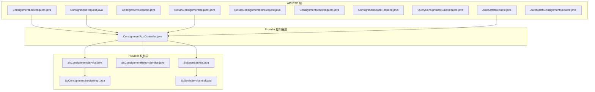
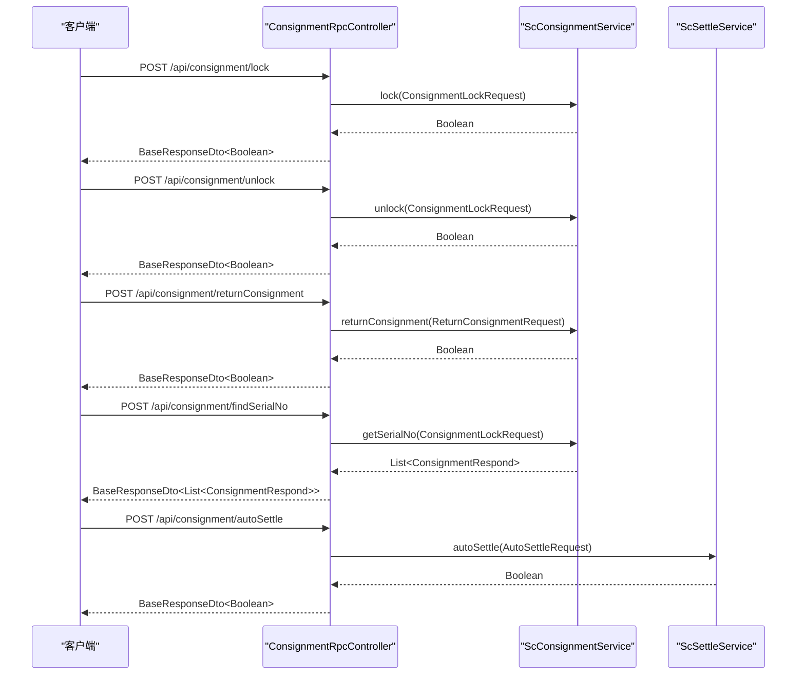
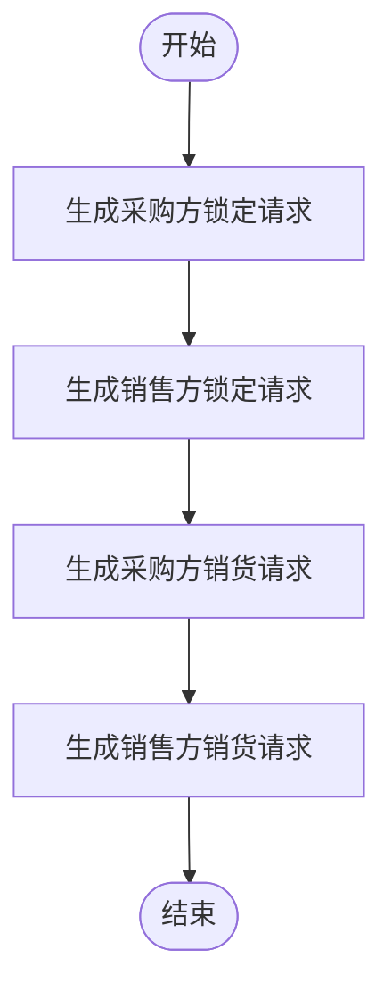
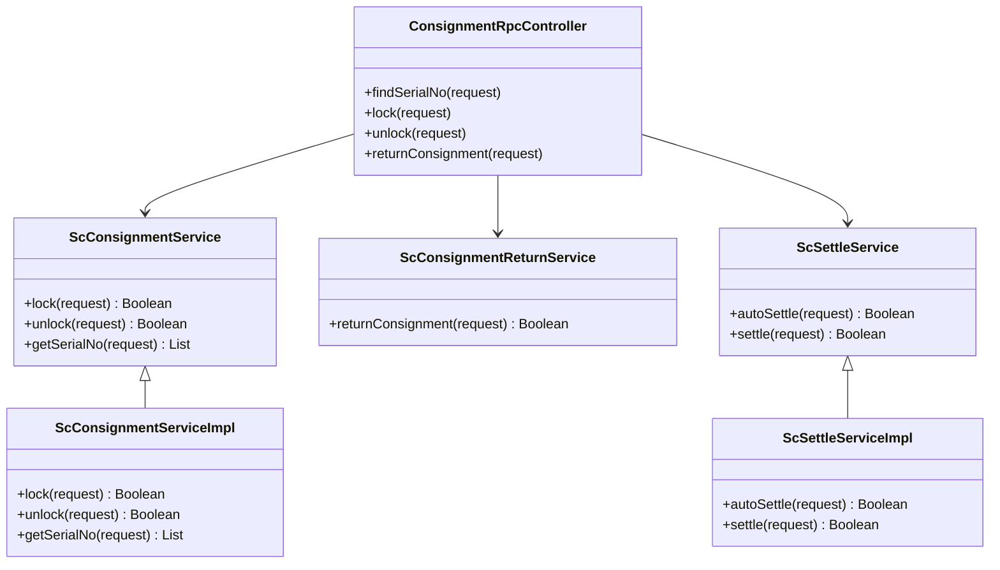

# 寄售管理接口

<cite>
**本文引用的文件**
- [ConsignmentRpcController.java](file://guoke-deepexi-storage-center-provider/src/main/java/com/deepexi/storage/controller/rpc/ConsignmentRpcController.java)
- [ScConsignmentServiceImpl.java](file://guoke-deepexi-storage-center-provider/src/main/java/com/deepexi/storage/service/impl/ScConsignmentServiceImpl.java)
- [ScConsignmentService.java](file://guoke-deepexi-storage-center-provider/src/main/java/com/deepexi/storage/service/ScConsignmentService.java)
- [ScConsignmentReturnService.java](file://guoke-deepexi-storage-center-provider/src/main/java/com/deepexi/storage/service/ScConsignmentReturnService.java)
- [ScSettleService.java](file://guoke-deepexi-storage-center-provider/src/main/java/com/deepexi/storage/service/ScSettleService.java)
- [ScSettleServiceImpl.java](file://guoke-deepexi-storage-center-provider/src/main/java/com/deepexi/storage/service/impl/ScSettleServiceImpl.java)
- [ConsignmentLockRequest.java](file://guoke-deepexi-storage-center-api/src/main/java/com/deepexi/api/storage/dto/consignment/ConsignmentLockRequest.java)
- [ConsignmentRequest.java](file://guoke-deepexi-storage-center-api/src/main/java/com/deepexi/api/storage/dto/consignment/ConsignmentRequest.java)
- [ConsignmentRespond.java](file://guoke-deepexi-storage-center-api/src/main/java/com/deepexi/api/storage/dto/consignment/ConsignmentRespond.java)
- [ReturnConsignmentRequest.java](file://guoke-deepexi-storage-center-api/src/main/java/com/deepexi/api/storage/dto/consignment/ReturnConsignmentRequest.java)
- [ReturnConsignmentItemRequest.java](file://guoke-deepexi-storage-center-api/src/main/java/com/deepexi/api/storage/dto/consignment/ReturnConsignmentItemRequest.java)
- [ConsignmentStockRequest.java](file://guoke-deepexi-storage-center-api/src/main/java/com/deepexi/api/storage/dto/consignment/ConsignmentStockRequest.java)
- [ConsignmentStockRespond.java](file://guoke-deepexi-storage-center-api/src/main/java/com/deepexi/api/storage/dto/consignment/ConsignmentStockRespond.java)
- [QueryConsignmentSaleRequest.java](file://guoke-deepexi-storage-center-api/src/main/java/com/deepexi/api/storage/dto/consignment/QueryConsignmentSaleRequest.java)
- [AutoSettleRequest.java](file://guoke-deepexi-storage-center-api/src/main/java/com/deepexi/api/storage/dto/settle/AutoSettleRequest.java)
- [AutoMatchConsignmentRequest.java](file://guoke-deepexi-storage-center-api/src/main/java/com/deepexi/api/storage/dto/settle/AutoMatchConsignmentRequest.java)
- [StorageConstant.java](file://guoke-deepexi-storage-center-provider/src/main/java/com/deepexi/storage/constans/StorageConstant.java)
</cite>

## 目录
1. [简介](#简介)
2. [项目结构](#项目结构)
3. [核心组件](#核心组件)
4. [架构总览](#架构总览)
5. [详细组件分析](#详细组件分析)
6. [依赖关系分析](#依赖关系分析)
7. [性能考量](#性能考量)
8. [故障排查指南](#故障排查指南)
9. [结论](#结论)
10. [附录](#附录)

## 简介
本文件面向寄售管理相关API，覆盖寄售订单、寄售锁定、寄售解锁、寄售结算与退货等关键能力。内容包含接口定义（HTTP方法、URL路径、请求参数、响应格式）、错误码约定、权限控制与业务规则说明，并提供典型业务流程图与时序图帮助理解。

## 项目结构
围绕寄售管理的核心代码分布在API DTO层与Provider服务实现层：
- API DTO层：定义请求与响应数据结构，确保接口契约清晰
- Provider层：
  - 控制器：对外暴露REST接口
  - 服务接口与实现：封装业务逻辑（锁定、解锁、结算、退货）
  - Mapper/POJO：持久化与领域模型

图表来源
- [ConsignmentRpcController.java:1-106](file://guoke-deepexi-storage-center-provider/src/main/java/com/deepexi/storage/controller/rpc/ConsignmentRpcController.java#L1-L106)
- [ScConsignmentService.java:1-35](file://guoke-deepexi-storage-center-provider/src/main/java/com/deepexi/storage/service/ScConsignmentService.java#L1-L35)
- [ScConsignmentServiceImpl.java:411-625](file://guoke-deepexi-storage-center-provider/src/main/java/com/deepexi/storage/service/impl/ScConsignmentServiceImpl.java#L411-L625)
- [ScConsignmentReturnService.java](file://guoke-deepexi-storage-center-provider/src/main/java/com/deepexi/storage/service/ScConsignmentReturnService.java)
- [ScSettleService.java:1-35](file://guoke-deepexi-storage-center-provider/src/main/java/com/deepexi/storage/service/ScSettleService.java#L1-L35)
- [ScSettleServiceImpl.java:104-165](file://guoke-deepexi-storage-center-provider/src/main/java/com/deepexi/storage/service/impl/ScSettleServiceImpl.java#L104-L165)

章节来源
- [ConsignmentRpcController.java:1-106](file://guoke-deepexi-storage-center-provider/src/main/java/com/deepexi/storage/controller/rpc/ConsignmentRpcController.java#L1-L106)

## 核心组件
- 寄售RPC控制器：提供寄售相关RPC接口入口，负责参数校验、调用服务层并返回统一响应体
- 寄售服务接口与实现：负责寄售锁定/解锁、库存查询、序列号查询等核心业务
- 结算服务接口与实现：负责自动结算、销货、库存匹配等结算流程
- 退货服务：处理寄售退货相关业务
- DTO层：定义请求与响应结构，保证前后端契约一致

章节来源
- [ScConsignmentService.java:1-35](file://guoke-deepexi-storage-center-provider/src/main/java/com/deepexi/storage/service/ScConsignmentService.java#L1-L35)
- [ScConsignmentServiceImpl.java:411-625](file://guoke-deepexi-storage-center-provider/src/main/java/com/deepexi/storage/service/impl/ScConsignmentServiceImpl.java#L411-L625)
- [ScSettleService.java:1-35](file://guoke-deepexi-storage-center-provider/src/main/java/com/deepexi/storage/service/ScSettleService.java#L1-L35)
- [ScSettleServiceImpl.java:104-165](file://guoke-deepexi-storage-center-provider/src/main/java/com/deepexi/storage/service/impl/ScSettleServiceImpl.java#L104-L165)

## 架构总览
寄售管理采用“控制器-服务-持久化”的分层架构，RPC控制器接收请求后，通过服务层完成业务处理，最终返回统一响应体。结算流程中，自动结算会先执行锁定，再执行销货，形成完整的闭环。

图表来源
- [ConsignmentRpcController.java:39-102](file://guoke-deepexi-storage-center-provider/src/main/java/com/deepexi/storage/controller/rpc/ConsignmentRpcController.java#L39-L102)
- [ScConsignmentService.java:13-35](file://guoke-deepexi-storage-center-provider/src/main/java/com/deepexi/storage/service/ScConsignmentService.java#L13-L35)
- [ScSettleService.java:13-35](file://guoke-deepexi-storage-center-provider/src/main/java/com/deepexi/storage/service/ScSettleService.java#L13-L35)

## 详细组件分析

### 接口清单与规范

#### 1) 寄售锁定
- 方法与路径
  - POST /api/consignment/lock
- 请求体
  - ConsignmentLockRequest
    - rightCompanyId：物权方公司id（必填）
    - companyId：货主方公司id（选填）
    - companyName：货主方公司名称（选填）
    - stockType：仓储类型（默认出库1或入库2）
    - stockObjType：单据类型（出库或入库）
    - settleCode：结算单号（选填）
    - consignmentList：寄售产品列表（必填），元素为ConsignmentRequest
      - productAuthId：授权产品id（必填）
      - authItemParentId：授权产品父级id（选填）
      - productionDate：生产日期（选填）
      - expireDate：有效日期（选填）
      - lotNo：批号（默认空串）
      - udi：UDI（默认空串）
      - serialNo：序列号（选填）
      - number：消耗数量（选填）
      - relationStockObjCode：关联外部系统订单号（选填）
      - relationRecordDetailId：关联外部系统行号（选填）
      - originalOrderCode：原始采购/销售单号（必填）
      - relatedOrderDetailId：对应关联订单的明细id（选填）
      - serialNoTotalMap：序列号与数量映射（选填）
    - creatorId/creatorBy：操作人信息（选填）
    - businessModel：业务模型（1标准，2定制，默认1）
- 响应体
  - BaseResponseDto<Boolean>
- 错误码
  - 统一使用存储常量中的失败码
- 权限控制
  - 需具备寄售锁定相关权限
- 业务规则
  - 按库存顺序锁定，支持按序列号精确锁定与按数量分配锁定
  - 支持不同仓储类型（出库/入库）与单据类型联动

章节来源
- [ConsignmentRpcController.java:53-66](file://guoke-deepexi-storage-center-provider/src/main/java/com/deepexi/storage/controller/rpc/ConsignmentRpcController.java#L53-L66)
- [ConsignmentLockRequest.java:21-75](file://guoke-deepexi-storage-center-api/src/main/java/com/deepexi/api/storage/dto/consignment/ConsignmentLockRequest.java#L21-L75)
- [ConsignmentRequest.java:19-69](file://guoke-deepexi-storage-center-api/src/main/java/com/deepexi/api/storage/dto/consignment/ConsignmentRequest.java#L19-L69)
- [StorageConstant.java](file://guoke-deepexi-storage-center-provider/src/main/java/com/deepexi/storage/constans/StorageConstant.java)

#### 2) 寄售解锁
- 方法与路径
  - POST /api/consignment/unlock
- 请求体
  - ConsignmentLockRequest（同上）
- 响应体
  - BaseResponseDto<Boolean>
- 错误码
  - 统一使用存储常量中的失败码
- 权限控制
  - 需具备寄售解锁相关权限
- 业务规则
  - 解锁后恢复库存并删除锁定记录
  - 若操作人信息缺失，控制器会从请求体填充上下文

章节来源
- [ConsignmentRpcController.java:68-87](file://guoke-deepexi-storage-center-provider/src/main/java/com/deepexi/storage/controller/rpc/ConsignmentRpcController.java#L68-L87)
- [ConsignmentLockRequest.java:21-75](file://guoke-deepexi-storage-center-api/src/main/java/com/deepexi/api/storage/dto/consignment/ConsignmentLockRequest.java#L21-L75)

#### 3) 退回寄售
- 方法与路径
  - POST /api/consignment/returnConsignment
- 请求体
  - ReturnConsignmentRequest
    - supplierCreditCode/supplierId：供应商信息（选填）
    - rightCompanyId：物权方公司id（必填）
    - companyId/companyName：货主方信息（选填）
    - returnNo：退货单号（选填）
    - returnConsignmentItemList：退货产品列表（必填），元素为ReturnConsignmentItemRequest
      - productAuthId：授权产品id（必填）
      - productionDate：生产日期（选填）
      - expireDate：有效日期（选填）
      - lotNo/udi/serialNo：批号、UDI、序列号（默认空串）
      - number：退货数量（必填）
      - authItemParentId：父级授权id（默认空串）
      - relationStockObjCode/relationRecordDetailId：关联外部系统信息（选填）
      - unit：计量单位（选填）
    - orderNo：原始单号（选填）
    - stockType：仓储类型（默认出库1或入库2）
    - stockObjType：单据类型（出库或入库）
    - creatorId/creatorBy：操作人信息（选填）
- 响应体
  - BaseResponseDto<Boolean>
- 错误码
  - 统一使用存储常量中的失败码
- 权限控制
  - 需具备寄售退货相关权限
- 业务规则
  - 支持按产品、批号、序列号、UDI等维度退货
  - 支持不同仓储类型与单据类型联动

章节来源
- [ConsignmentRpcController.java:89-102](file://guoke-deepexi-storage-center-provider/src/main/java/com/deepexi/storage/controller/rpc/ConsignmentRpcController.java#L89-L102)
- [ReturnConsignmentRequest.java:20-80](file://guoke-deepexi-storage-center-api/src/main/java/com/deepexi/api/storage/dto/consignment/ReturnConsignmentRequest.java#L20-L80)
- [ReturnConsignmentItemRequest.java:18-64](file://guoke-deepexi-storage-center-api/src/main/java/com/deepexi/api/storage/dto/consignment/ReturnConsignmentItemRequest.java#L18-L64)

#### 4) 根据产品编码获取序列号
- 方法与路径
  - POST /api/consignment/findSerialNo
- 请求体
  - ConsignmentLockRequest（用于定位产品）
- 响应体
  - BaseResponseDto<List<ConsignmentRespond>>
    - ConsignmentRespond：包含id、productAuthId、productionDate、expireDate、lotNo、udi、serialNo、saleNo、stock等字段
- 错误码
  - 统一使用存储常量中的失败码
- 权限控制
  - 需具备查询序列号相关权限
- 业务规则
  - 返回可用序列号列表，便于后续锁定或退货

章节来源
- [ConsignmentRpcController.java:39-51](file://guoke-deepexi-storage-center-provider/src/main/java/com/deepexi/storage/controller/rpc/ConsignmentRpcController.java#L39-L51)
- [ConsignmentLockRequest.java:21-75](file://guoke-deepexi-storage-center-api/src/main/java/com/deepexi/api/storage/dto/consignment/ConsignmentLockRequest.java#L21-L75)
- [ConsignmentRespond.java:19-47](file://guoke-deepexi-storage-center-api/src/main/java/com/deepexi/api/storage/dto/consignment/ConsignmentRespond.java#L19-L47)

#### 5) 自动结算
- 方法与路径
  - POST /api/consignment/autoSettle（由控制器暴露，实际调用结算服务）
- 请求体
  - AutoSettleRequest
    - rightCompanyId/companyId：物权方/货主方公司信息（必填/选填）
    - autoSettleItemList：结算产品列表（必填），元素为AutoMatchConsignmentRequest
    - purchaseSettleCode/saleSettleCode：采购/销售结算单号（选填）
    - stockType：仓储类型（默认出库1或入库2）
    - stockObjType：单据类型（出库或入库）
    - creatorId/creatorBy：操作人信息（选填）
- 响应体
  - BaseResponseDto<Boolean>
- 错误码
  - 统一使用存储常量中的失败码
- 权限控制
  - 需具备自动结算相关权限
- 业务规则
  - 自动结算流程：先按采购方/销售方分别锁定，再分别执行销货
  - 单据类型需要在枚举范围内转换

图表来源
- [ScSettleServiceImpl.java:104-126](file://guoke-deepexi-storage-center-provider/src/main/java/com/deepexi/storage/service/impl/ScSettleServiceImpl.java#L104-L126)
- [AutoSettleRequest.java:94-139](file://guoke-deepexi-storage-center-api/src/main/java/com/deepexi/api/storage/dto/settle/AutoSettleRequest.java#L94-L139)
- [AutoSettleRequest.java:146-189](file://guoke-deepexi-storage-center-api/src/main/java/com/deepexi/api/storage/dto/settle/AutoSettleRequest.java#L146-L189)

章节来源
- [ScSettleServiceImpl.java:104-165](file://guoke-deepexi-storage-center-provider/src/main/java/com/deepexi/storage/service/impl/ScSettleServiceImpl.java#L104-L165)
- [AutoSettleRequest.java:34-194](file://guoke-deepexi-storage-center-api/src/main/java/com/deepexi/api/storage/dto/settle/AutoSettleRequest.java#L34-L194)

### 数据模型与字段说明

#### 寄售库存查询响应模型
- 字段概览
  - skuId、productAuthId、productCode、productName、spec、model、unit
  - prodTime、expireTime、registNo
  - saleNo、purchaseNo、inRecordMainCode、outRecordMainCode
  - lotNo、serialNo、udi、totalStock、stock、lockStock
  - supplierId、supplierName、rightCompanyId、rightCompanyName、rightCompanyCode
  - companyId、companyName、companyCode、createDate
  - categoryInfoList、factory
  - relatedOrderDetailId、relationStockObjCode、relationRecordDetailId、admitDate
  - businessModel、consignType

章节来源
- [ConsignmentStockRespond.java:14-207](file://guoke-deepexi-storage-center-api/src/main/java/com/deepexi/api/storage/dto/consignment/ConsignmentStockRespond.java#L14-L207)

#### 寄售销售查询请求模型
- 字段概览
  - rightCompanyId、companyId（必填）
  - productCode、productName、lotNo、udi、serialNo
  - productAuthId、authItemIdParent、productAuthIdList
  - orderType、businessModel、consignType

章节来源
- [QueryConsignmentSaleRequest.java:21-52](file://guoke-deepexi-storage-center-api/src/main/java/com/deepexi/api/storage/dto/consignment/QueryConsignmentSaleRequest.java#L21-L52)

## 依赖关系分析
- 控制器依赖服务接口，服务接口委托具体实现类完成业务处理
- 结算服务内部会复用寄售锁定与销货请求转换逻辑
- DTO层作为契约，贯穿控制器、服务与外部调用方

图表来源
- [ConsignmentRpcController.java:31-102](file://guoke-deepexi-storage-center-provider/src/main/java/com/deepexi/storage/controller/rpc/ConsignmentRpcController.java#L31-L102)
- [ScConsignmentService.java:13-35](file://guoke-deepexi-storage-center-provider/src/main/java/com/deepexi/storage/service/ScConsignmentService.java#L13-L35)
- [ScConsignmentServiceImpl.java:411-625](file://guoke-deepexi-storage-center-provider/src/main/java/com/deepexi/storage/service/impl/ScConsignmentServiceImpl.java#L411-L625)
- [ScConsignmentReturnService.java](file://guoke-deepexi-storage-center-provider/src/main/java/com/deepexi/storage/service/ScConsignmentReturnService.java)
- [ScSettleService.java:13-35](file://guoke-deepexi-storage-center-provider/src/main/java/com/deepexi/storage/service/ScSettleService.java#L13-L35)
- [ScSettleServiceImpl.java:104-165](file://guoke-deepexi-storage-center-provider/src/main/java/com/deepexi/storage/service/impl/ScSettleServiceImpl.java#L104-L165)

## 性能考量
- 批量锁定与解锁：建议按批次提交，避免超大列表导致内存压力
- 库存匹配策略：按创建时间升序匹配，减少跨批次复杂度
- 日志与异常：控制器捕获异常并返回统一错误码，避免泄露内部细节
- 缓存与幂等：结合业务场景考虑缓存与幂等设计，降低重复锁定/解锁开销

## 故障排查指南
- 常见错误
  - 参数校验失败：检查必填字段与格式
  - 锁定失败：确认库存充足、序列号可用
  - 解锁失败：确认锁定记录存在且未被其他流程占用
  - 结算失败：核对单据类型转换与结算单号
- 定位手段
  - 查看控制器日志输出
  - 使用统一响应体中的错误码与消息
  - 核对DTO字段与业务规则约束

章节来源
- [ConsignmentRpcController.java:43-50](file://guoke-deepexi-storage-center-provider/src/main/java/com/deepexi/storage/controller/rpc/ConsignmentRpcController.java#L43-L50)
- [ConsignmentRpcController.java:57-65](file://guoke-deepexi-storage-center-provider/src/main/java/com/deepexi/storage/controller/rpc/ConsignmentRpcController.java#L57-L65)
- [ConsignmentRpcController.java:70-86](file://guoke-deepexi-storage-center-provider/src/main/java/com/deepexi/storage/controller/rpc/ConsignmentRpcController.java#L70-L86)
- [ConsignmentRpcController.java:91-101](file://guoke-deepexi-storage-center-provider/src/main/java/com/deepexi/storage/controller/rpc/ConsignmentRpcController.java#L91-L101)
- [StorageConstant.java](file://guoke-deepexi-storage-center-provider/src/main/java/com/deepexi/storage/constans/StorageConstant.java)

## 结论
寄售管理接口以清晰的DTO契约与分层架构实现，覆盖锁定、解锁、退货与自动结算等核心能力。通过严格的参数校验、统一错误码与明确的业务规则，保障了接口的稳定性与可维护性。建议在接入时严格遵循请求体字段与业务流程，结合日志与错误码快速定位问题。

## 附录

### 统一响应体说明
- 字段
  - code：状态码（成功/失败）
  - message：描述信息
  - data：业务数据（布尔值或对象列表）

章节来源
- [ConsignmentRpcController.java:41-50](file://guoke-deepexi-storage-center-provider/src/main/java/com/deepexi/storage/controller/rpc/ConsignmentRpcController.java#L41-L50)
- [ConsignmentRpcController.java:55-66](file://guoke-deepexi-storage-center-provider/src/main/java/com/deepexi/storage/controller/rpc/ConsignmentRpcController.java#L55-L66)
- [ConsignmentRpcController.java:70-87](file://guoke-deepexi-storage-center-provider/src/main/java/com/deepexi/storage/controller/rpc/ConsignmentRpcController.java#L70-L87)
- [ConsignmentRpcController.java:91-102](file://guoke-deepexi-storage-center-provider/src/main/java/com/deepexi/storage/controller/rpc/ConsignmentRpcController.java#L91-L102)