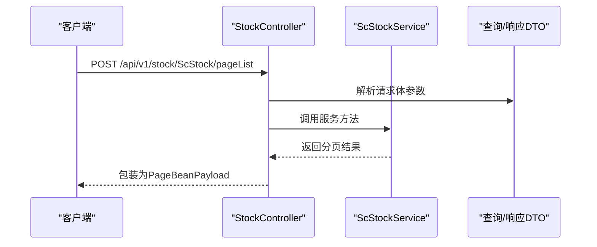

# 库存管理接口

<cite>
**本文引用的文件**
- [StockController.java](file://guoke-deepexi-storage-center-provider/src/main/java/com/zhengtong/storage/controller/web/StockController.java)
- [ScStockQuery.java](file://guoke-deepexi-storage-center-provider/src/main/java/com/zhengtong/storage/pojo/query/stock/ScStockQuery.java)
- [ScStockDetailQuery.java](file://guoke-deepexi-storage-center-provider/src/main/java/com/zhengtong/storage/pojo/query/stock/ScStockDetailQuery.java)
- [ScStockUdiQuery.java](file://guoke-deepexi-storage-center-provider/src/main/java/com/zhengtong/storage/pojo/query/stock/ScStockUdiQuery.java)
- [ScStockCodeQuery.java](file://guoke-deepexi-storage-center-provider/src/main/java/com/zhengtong/storage/pojo/query/stock/ScStockCodeQuery.java)
- [ScStockVO.java](file://guoke-deepexi-storage-center-provider/src/main/java/com/zhengtong/storage/pojo/vo/stock/ScStockVO.java)
- [ScStockCodeVO.java](file://guoke-deepexi-storage-center-provider/src/main/java/com/zhengtong/storage/pojo/vo/stock/ScStockCodeVO.java)
- [ScStockSampleQueryReqDTO.java](file://guoke-deepexi-storage-center-api/src/main/java/com/zhengtong/storage/api/storage/dto/stock/req/ScStockSampleQueryReqDTO.java)
- [SampleStockReqDTO.java](file://guoke-deepexi-storage-center-api/src/main/java/com/zhengtong/storage/api/storage/dto/stock/req/SampleStockReqDTO.java)
- [SampleStockResDTO.java](file://guoke-deepexi-storage-center-api/src/main/java/com/zhengtong/storage/api/storage/dto/stock/res/SampleStockResDTO.java)
- [ScStockSampleVO.java](file://guoke-deepexi-storage-center-api/src/main/java/com/zhengtong/storage/api/storage/dto/stock/res/ScStockSampleVO.java)
- [StockChangeRequest.java](file://guoke-deepexi-storage-center-api/src/main/java/com/zhengtong/storage/api/storage/dto/stock/StockChangeRequest.java)
- [StockChangeItemRequest.java](file://guoke-deepexi-storage-center-api/src/main/java/com/zhengtong/storage/api/storage/dto/stock/StockChangeItemRequest.java)
- [StockChangeResponse.java](file://guoke-deepexi-storage-center-api/src/main/java/com/zhengtong/storage/api/storage/dto/stock/StockChangeResponse.java)
- [QueryStockLockInfoRequest.java](file://guoke-deepexi-storage-center-api/src/main/java/com/zhengtong/storage/api/storage/dto/lock/QueryStockLockInfoRequest.java)
- [StockLockLogDTO.java](file://guoke-deepexi-storage-center-api/src/main/java/com/zhengtong/storage/api/storage/dto/stock/StockLockLogDTO.java)
- [QueryStockNumRequest.java](file://guoke-deepexi-storage-center-api/src/main/java/com/zhengtong/storage/api/storage/dto/stock/QueryStockNumRequest.java)
- [QueryStockProductRequest.java](file://guoke-deepexi-storage-center-api/src/main/java/com/zhengtong/storage/api/storage/dto/stock/QueryStockProductRequest.java)
- [ContextUtil.java](file://guoke-deepexi-storage-center-provider/src/main/java/com/zhengtong/storage/common/login/ContextUtil.java)
- [Auth.java](file://guoke-deepexi-storage-center-provider/src/main/java/com/zhengtong/storage/common/login/inf/Auth.java)
- [PageBeanPayload.java](file://guoke-deepexi-storage-center-provider/src/main/java/com/zhengtong/storage/pojo/common/PageBeanPayload.java)
- [SinglePayload.java](file://guoke-deepexi-storage-center-provider/src/main/java/com/zhengtong/storage/pojo/common/SinglePayload.java)
- [MultiPayload.java](file://guoke-deepexi-storage-center-provider/src/main/java/com/zhengtong/storage/pojo/common/MultiPayload.java)
- [BaseResponseDto.java](file://guoke-deepexi-storage-center-provider/src/main/java/com/zhengtong/storage/common/base/dto/BaseResponseDto.java)
- [BaseQuery.java](file://guoke-deepexi-storage-center-api/src/main/java/com/zhengtong/storage/api/storage/dto/common/BaseQuery.java)
</cite>

## 目录
1. [简介](#简介)
2. [项目结构](#项目结构)
3. [核心组件](#核心组件)
4. [架构总览](#架构总览)
5. [详细组件分析](#详细组件分析)
6. [依赖关系分析](#依赖关系分析)
7. [性能考虑](#性能考虑)
8. [故障排查指南](#故障排查指南)
9. [结论](#结论)
10. [附录](#附录)

## 简介
本文件面向库存管理相关API，覆盖库存查询（按产品、批次、UDI、编码）、库存数量查询、库存变更、库存锁定与解锁等核心能力。文档从接口规范、请求/响应结构、参数校验、业务约束、权限控制、限流策略与性能优化等方面进行系统化梳理，并提供调用流程图与时序图帮助理解。

## 项目结构
围绕库存管理的接口主要位于Web层控制器与API DTO之间，查询参数与返回对象在Provider与API模块中分别定义，形成清晰的分层职责：
- Web层控制器：对外暴露REST接口，负责鉴权、参数封装与响应包装
- API层DTO：定义请求/响应的数据结构与校验规则
- Provider层服务：实现具体业务逻辑（由控制器调用）

```mermaid
graph TB
subgraph "Web 层"
SC["StockController<br/>/api/v1/stock/ScStock"]
end
subgraph "API 层 DTO"
Q1["ScStockQuery"]
Q2["ScStockDetailQuery"]
Q3["ScStockUdiQuery"]
Q4["ScStockCodeQuery"]
VO1["ScStockVO"]
VO2["ScStockCodeVO"]
REQ1["StockChangeRequest"]
REQ2["StockChangeItemRequest"]
RESP1["StockChangeResponse"]
LOCKQ["QueryStockLockInfoRequest"]
LOCKLOG["StockLockLogDTO"]
NUMQ["QueryStockNumRequest"]
PRODQ["QueryStockProductRequest"]
end
subgraph "通用工具"
CTX["ContextUtil"]
AUTH["@Auth"]
PBP["PageBeanPayload"]
SP["SinglePayload"]
MP["MultiPayload"]
BR["BaseResponseDto"]
end
SC --> Q1
SC --> Q2
SC --> Q3
SC --> Q4
SC --> VO1
SC --> VO2
SC --> AUTH
SC --> CTX
SC --> PBP
SC --> SP
SC --> MP
SC --> BR
REQ1 --> REQ2
RESP1 --> BR
LOCKQ --> BR
LOCKLOG --> BR
NUMQ --> BR
PRODQ --> BR
```

图表来源
- [StockController.java:41-143](file://guoke-deepexi-storage-center-provider/src/main/java/com/zhengtong/storage/controller/web/StockController.java#L41-L143)
- [ScStockQuery.java](file://guoke-deepexi-storage-center-provider/src/main/java/com/zhengtong/storage/pojo/query/stock/ScStockQuery.java)
- [ScStockDetailQuery.java](file://guoke-deepexi-storage-center-provider/src/main/java/com/zhengtong/storage/pojo/query/stock/ScStockDetailQuery.java)
- [ScStockUdiQuery.java](file://guoke-deepexi-storage-center-provider/src/main/java/com/zhengtong/storage/pojo/query/stock/ScStockUdiQuery.java)
- [ScStockCodeQuery.java](file://guoke-deepexi-storage-center-provider/src/main/java/com/zhengtong/storage/pojo/query/stock/ScStockCodeQuery.java)
- [ScStockVO.java](file://guoke-deepexi-storage-center-provider/src/main/java/com/zhengtong/storage/pojo/vo/stock/ScStockVO.java)
- [ScStockCodeVO.java](file://guoke-deepexi-storage-center-provider/src/main/java/com/zhengtong/storage/pojo/vo/stock/ScStockCodeVO.java)
- [StockChangeRequest.java:14-28](file://guoke-deepexi-storage-center-api/src/main/java/com/zhengtong/storage/api/storage/dto/stock/StockChangeRequest.java#L14-L28)
- [StockChangeItemRequest.java:12-64](file://guoke-deepexi-storage-center-api/src/main/java/com/zhengtong/storage/api/storage/dto/stock/StockChangeItemRequest.java#L12-L64)
- [StockChangeResponse.java:17-26](file://guoke-deepexi-storage-center-api/src/main/java/com/zhengtong/storage/api/storage/dto/stock/StockChangeResponse.java#L17-L26)
- [QueryStockLockInfoRequest.java:9-16](file://guoke-deepexi-storage-center-api/src/main/java/com/zhengtong/storage/api/storage/dto/lock/QueryStockLockInfoRequest.java#L9-L16)
- [StockLockLogDTO.java:17-81](file://guoke-deepexi-storage-center-api/src/main/java/com/zhengtong/storage/api/storage/dto/stock/StockLockLogDTO.java#L17-L81)
- [QueryStockNumRequest.java:13-27](file://guoke-deepexi-storage-center-api/src/main/java/com/zhengtong/storage/api/storage/dto/stock/QueryStockNumRequest.java#L13-L27)
- [QueryStockProductRequest.java:16-86](file://guoke-deepexi-storage-center-api/src/main/java/com/zhengtong/storage/api/storage/dto/stock/QueryStockProductRequest.java#L16-L86)
- [ContextUtil.java](file://guoke-deepexi-storage-center-provider/src/main/java/com/zhengtong/storage/common/login/ContextUtil.java)
- [Auth.java](file://guoke-deepexi-storage-center-provider/src/main/java/com/zhengtong/storage/common/login/inf/Auth.java)
- [PageBeanPayload.java](file://guoke-deepexi-storage-center-provider/src/main/java/com/zhengtong/storage/pojo/common/PageBeanPayload.java)
- [SinglePayload.java](file://guoke-deepexi-storage-center-provider/src/main/java/com/zhengtong/storage/pojo/common/SinglePayload.java)
- [MultiPayload.java](file://guoke-deepexi-storage-center-provider/src/main/java/com/zhengtong/storage/pojo/common/MultiPayload.java)
- [BaseResponseDto.java](file://guoke-deepexi-storage-center-provider/src/main/java/com/zhengtong/storage/common/base/dto/BaseResponseDto.java)

章节来源
- [StockController.java:41-143](file://guoke-deepexi-storage-center-provider/src/main/java/com/zhengtong/storage/controller/web/StockController.java#L41-L143)

## 核心组件
- 控制器：StockController 提供库存查询、导出、样品相关接口，统一通过POST方式接收请求体参数，返回统一封装的Payload或BaseResponseDto。
- 查询参数：ScStockQuery、ScStockDetailQuery、ScStockUdiQuery、ScStockCodeQuery等，承载分页、筛选条件与业务维度字段。
- 响应对象：ScStockVO、ScStockCodeVO等，承载库存明细与聚合信息；PageBeanPayload、SinglePayload、MultiPayload、BaseResponseDto用于统一响应包装。
- 变更与锁定：StockChangeRequest/ItemRequest/Response、StockLockLogDTO、QueryStockLockInfoRequest等，支撑库存变更与锁定/解锁日志记录。

章节来源
- [StockController.java:48-141](file://guoke-deepexi-storage-center-provider/src/main/java/com/zhengtong/storage/controller/web/StockController.java#L48-L141)
- [ScStockQuery.java](file://guoke-deepexi-storage-center-provider/src/main/java/com/zhengtong/storage/pojo/query/stock/ScStockQuery.java)
- [ScStockDetailQuery.java](file://guoke-deepexi-storage-center-provider/src/main/java/com/zhengtong/storage/pojo/query/stock/ScStockDetailQuery.java)
- [ScStockUdiQuery.java](file://guoke-deepexi-storage-center-provider/src/main/java/com/zhengtong/storage/pojo/query/stock/ScStockUdiQuery.java)
- [ScStockCodeQuery.java](file://guoke-deepexi-storage-center-provider/src/main/java/com/zhengtong/storage/pojo/query/stock/ScStockCodeQuery.java)
- [ScStockVO.java](file://guoke-deepexi-storage-center-provider/src/main/java/com/zhengtong/storage/pojo/vo/stock/ScStockVO.java)
- [ScStockCodeVO.java](file://guoke-deepexi-storage-center-provider/src/main/java/com/zhengtong/storage/pojo/vo/stock/ScStockCodeVO.java)
- [StockChangeRequest.java:14-28](file://guoke-deepexi-storage-center-api/src/main/java/com/zhengtong/storage/api/storage/dto/stock/StockChangeRequest.java#L14-L28)
- [StockChangeItemRequest.java:12-64](file://guoke-deepexi-storage-center-api/src/main/java/com/zhengtong/storage/api/storage/dto/stock/StockChangeItemRequest.java#L12-L64)
- [StockChangeResponse.java:17-26](file://guoke-deepexi-storage-center-api/src/main/java/com/zhengtong/storage/api/storage/dto/stock/StockChangeResponse.java#L17-L26)
- [QueryStockLockInfoRequest.java:9-16](file://guoke-deepexi-storage-center-api/src/main/java/com/zhengtong/storage/api/storage/dto/lock/QueryStockLockInfoRequest.java#L9-L16)
- [StockLockLogDTO.java:17-81](file://guoke-deepexi-storage-center-api/src/main/java/com/zhengtong/storage/api/storage/dto/stock/StockLockLogDTO.java#L17-L81)
- [QueryStockNumRequest.java:13-27](file://guoke-deepexi-storage-center-api/src/main/java/com/zhengtong/storage/api/storage/dto/stock/QueryStockNumRequest.java#L13-L27)
- [QueryStockProductRequest.java:16-86](file://guoke-deepexi-storage-center-api/src/main/java/com/zhengtong/storage/api/storage/dto/stock/QueryStockProductRequest.java#L16-L86)
- [PageBeanPayload.java](file://guoke-deepexi-storage-center-provider/src/main/java/com/zhengtong/storage/pojo/common/PageBeanPayload.java)
- [SinglePayload.java](file://guoke-deepexi-storage-center-provider/src/main/java/com/zhengtong/storage/pojo/common/SinglePayload.java)
- [MultiPayload.java](file://guoke-deepexi-storage-center-provider/src/main/java/com/zhengtong/storage/pojo/common/MultiPayload.java)
- [BaseResponseDto.java](file://guoke-deepexi-storage-center-provider/src/main/java/com/zhengtong/storage/common/base/dto/BaseResponseDto.java)

## 架构总览
库存管理接口采用“Web控制器 + API DTO + Provider服务”的分层设计，Web层负责鉴权、参数解析与统一响应封装，API层定义数据契约，Provider层实现业务逻辑。

图表来源
- [StockController.java:48-56](file://guoke-deepexi-storage-center-provider/src/main/java/com/zhengtong/storage/controller/web/StockController.java#L48-L56)
- [ScStockQuery.java](file://guoke-deepexi-storage-center-provider/src/main/java/com/zhengtong/storage/pojo/query/stock/ScStockQuery.java)
- [PageBeanPayload.java](file://guoke-deepexi-storage-center-provider/src/main/java/com/zhengtong/storage/pojo/common/PageBeanPayload.java)

## 详细组件分析

### 接口清单与规范

- 基础路径
  - 前缀：/api/v1/stock/ScStock

- 认证与权限
  - 部分接口标注@Auth，需登录态与权限校验后方可访问。

- 统一响应
  - 分页接口：PageBeanPayload<T>
  - 单条：SinglePayload<T>
  - 多条：MultiPayload<T>
  - 其他：BaseResponseDto<T>

- 参数封装
  - 所有接口均以POST方式接收请求体参数，避免敏感信息出现在URL中。

章节来源
- [StockController.java:41-143](file://guoke-deepexi-storage-center-provider/src/main/java/com/zhengtong/storage/controller/web/StockController.java#L41-L143)
- [Auth.java](file://guoke-deepexi-storage-center-provider/src/main/java/com/zhengtong/storage/common/login/inf/Auth.java)
- [PageBeanPayload.java](file://guoke-deepexi-storage-center-provider/src/main/java/com/zhengtong/storage/pojo/common/PageBeanPayload.java)
- [SinglePayload.java](file://guoke-deepexi-storage-center-provider/src/main/java/com/zhengtong/storage/pojo/common/SinglePayload.java)
- [MultiPayload.java](file://guoke-deepexi-storage-center-provider/src/main/java/com/zhengtong/storage/pojo/common/MultiPayload.java)
- [BaseResponseDto.java](file://guoke-deepexi-storage-center-provider/src/main/java/com/zhengtong/storage/common/base/dto/BaseResponseDto.java)

#### 1) 库存查询（按产品）
- 方法与路径
  - POST /api/v1/stock/ScStock/pageList
- 请求参数
  - ScStockQuery：包含分页参数与多维筛选条件（如公司、供应商、产品线、产品编码/名称、批号、UDI、仓库/货架/货位、生产/有效期区间、业务类型、是否分页、是否过滤过期/锁定库存等）。
- 响应
  - PageBeanPayload<ScStockVO>：分页结果，包含库存聚合信息。
- 业务约束
  - 支持按多种维度组合筛选；可选择是否分页；可选择是否过滤过期或锁定库存。
- 示例
  - 请求示例路径：[ScStockQuery.java](file://guoke-deepexi-storage-center-provider/src/main/java/com/zhengtong/storage/pojo/query/stock/ScStockQuery.java)
  - 响应示例路径：[ScStockVO.java](file://guoke-deepexi-storage-center-provider/src/main/java/com/zhengtong/storage/pojo/vo/stock/ScStockVO.java)

章节来源
- [StockController.java:48-56](file://guoke-deepexi-storage-center-provider/src/main/java/com/zhengtong/storage/controller/web/StockController.java#L48-L56)
- [ScStockQuery.java](file://guoke-deepexi-storage-center-provider/src/main/java/com/zhengtong/storage/pojo/query/stock/ScStockQuery.java)
- [ScStockVO.java](file://guoke-deepexi-storage-center-provider/src/main/java/com/zhengtong/storage/pojo/vo/stock/ScStockVO.java)
- [PageBeanPayload.java](file://guoke-deepexi-storage-center-provider/src/main/java/com/zhengtong/storage/pojo/common/PageBeanPayload.java)

#### 2) 库存详情（按itemId）
- 方法与路径
  - POST /api/v1/stock/ScStock/getByItemId
- 请求参数
  - ScStockDetailQuery：包含itemId等定位条件。
- 响应
  - SinglePayload<ScStockVO>：单条库存详情。
- 示例
  - 请求示例路径：[ScStockDetailQuery.java](file://guoke-deepexi-storage-center-provider/src/main/java/com/zhengtong/storage/pojo/query/stock/ScStockDetailQuery.java)
  - 响应示例路径：[ScStockVO.java](file://guoke-deepexi-storage-center-provider/src/main/java/com/zhengtong/storage/pojo/vo/stock/ScStockVO.java)

章节来源
- [StockController.java:58-62](file://guoke-deepexi-storage-center-provider/src/main/java/com/zhengtong/storage/controller/web/StockController.java#L58-L62)
- [ScStockDetailQuery.java](file://guoke-deepexi-storage-center-provider/src/main/java/com/zhengtong/storage/pojo/query/stock/ScStockDetailQuery.java)
- [ScStockVO.java](file://guoke-deepexi-storage-center-provider/src/main/java/com/zhengtong/storage/pojo/vo/stock/ScStockVO.java)
- [SinglePayload.java](file://guoke-deepexi-storage-center-provider/src/main/java/com/zhengtong/storage/pojo/common/SinglePayload.java)

#### 3) 库存详情（按批号）
- 方法与路径
  - POST /api/v1/stock/ScStock/getByLotNo
- 请求参数
  - ScStockUdiQuery：包含lotNo等定位条件。
- 响应
  - SinglePayload<ScStockVO>：单条库存详情。
- 示例
  - 请求示例路径：[ScStockUdiQuery.java](file://guoke-deepexi-storage-center-provider/src/main/java/com/zhengtong/storage/pojo/query/stock/ScStockUdiQuery.java)
  - 响应示例路径：[ScStockVO.java](file://guoke-deepexi-storage-center-provider/src/main/java/com/zhengtong/storage/pojo/vo/stock/ScStockVO.java)

章节来源
- [StockController.java:64-68](file://guoke-deepexi-storage-center-provider/src/main/java/com/zhengtong/storage/controller/web/StockController.java#L64-L68)
- [ScStockUdiQuery.java](file://guoke-deepexi-storage-center-provider/src/main/java/com/zhengtong/storage/pojo/query/stock/ScStockUdiQuery.java)
- [ScStockVO.java](file://guoke-deepexi-storage-center-provider/src/main/java/com/zhengtong/storage/pojo/vo/stock/ScStockVO.java)
- [SinglePayload.java](file://guoke-deepexi-storage-center-provider/src/main/java/com/zhengtong/storage/pojo/common/SinglePayload.java)

#### 4) 库存详情（按编码）
- 方法与路径
  - POST /api/v1/stock/ScStock/getByCode
- 请求参数
  - ScStockCodeQuery：包含产品编码等条件；内部会注入当前公司ID（ContextUtil）。
- 响应
  - MultiPayload<ScStockCodeVO>：多条库存明细。
- 示例
  - 请求示例路径：[ScStockCodeQuery.java](file://guoke-deepexi-storage-center-provider/src/main/java/com/zhengtong/storage/pojo/query/stock/ScStockCodeQuery.java)
  - 响应示例路径：[ScStockCodeVO.java](file://guoke-deepexi-storage-center-provider/src/main/java/com/zhengtong/storage/pojo/vo/stock/ScStockCodeVO.java)

章节来源
- [StockController.java:70-74](file://guoke-deepexi-storage-center-provider/src/main/java/com/zhengtong/storage/controller/web/StockController.java#L70-L74)
- [ScStockCodeQuery.java](file://guoke-deepexi-storage-center-provider/src/main/java/com/zhengtong/storage/pojo/query/stock/ScStockCodeQuery.java)
- [ScStockCodeVO.java](file://guoke-deepexi-storage-center-provider/src/main/java/com/zhengtong/storage/pojo/vo/stock/ScStockCodeVO.java)
- [MultiPayload.java](file://guoke-deepexi-storage-center-provider/src/main/java/com/zhengtong/storage/pojo/common/MultiPayload.java)
- [ContextUtil.java](file://guoke-deepexi-storage-center-provider/src/main/java/com/zhengtong/storage/common/login/ContextUtil.java)

#### 5) 库存导出
- 方法与路径
  - POST /api/v1/stock/ScStock/exportScStockList
  - POST /api/v1/stock/ScStock/exportScStockDetailList
  - POST /api/v1/stock/ScStock/exportScStockUdiList
- 请求参数
  - 对应查询参数对象（ScStockQuery、ScStockDetailQuery、ScStockUdiQuery）。
- 响应
  - 流式下载（HttpServletResponse），无JSON响应体。
- 示例
  - 请求示例路径：[ScStockQuery.java](file://guoke-deepexi-storage-center-provider/src/main/java/com/zhengtong/storage/pojo/query/stock/ScStockQuery.java)
  - 请求示例路径：[ScStockDetailQuery.java](file://guoke-deepexi-storage-center-provider/src/main/java/com/zhengtong/storage/pojo/query/stock/ScStockDetailQuery.java)
  - 请求示例路径：[ScStockUdiQuery.java](file://guoke-deepexi-storage-center-provider/src/main/java/com/zhengtong/storage/pojo/query/stock/ScStockUdiQuery.java)

章节来源
- [StockController.java:76-92](file://guoke-deepexi-storage-center-provider/src/main/java/com/zhengtong/storage/controller/web/StockController.java#L76-L92)

#### 6) 样品库存（鉴权）
- 方法与路径
  - POST /api/v1/stock/ScStock/scStockSamplePageList
  - POST /api/v1/stock/ScStock/querySample
  - POST /api/v1/stock/ScStock/reportForm
  - POST /api/v1/stock/ScStock/reportFormExport
- 请求参数
  - ScStockSampleQueryReqDTO 或 SampleStockReqDTO。
- 响应
  - 分页或列表：PageBean<ScStockSampleVO> 或 List<SampleStockResDTO>。
  - 统一封装：BaseResponseDto<...>。
- 权限
  - 需@Auth鉴权。
- 示例
  - 请求示例路径：[ScStockSampleQueryReqDTO.java](file://guoke-deepexi-storage-center-api/src/main/java/com/zhengtong/storage/api/storage/dto/stock/req/ScStockSampleQueryReqDTO.java)
  - 请求示例路径：[SampleStockReqDTO.java](file://guoke-deepexi-storage-center-api/src/main/java/com/zhengtong/storage/api/storage/dto/stock/req/SampleStockReqDTO.java)
  - 响应示例路径：[ScStockSampleVO.java](file://guoke-deepexi-storage-center-api/src/main/java/com/zhengtong/storage/api/storage/dto/stock/res/ScStockSampleVO.java)
  - 响应示例路径：[SampleStockResDTO.java](file://guoke-deepexi-storage-center-api/src/main/java/com/zhengtong/storage/api/storage/dto/stock/res/SampleStockResDTO.java)

章节来源
- [StockController.java:94-141](file://guoke-deepexi-storage-center-provider/src/main/java/com/zhengtong/storage/controller/web/StockController.java#L94-L141)
- [Auth.java](file://guoke-deepexi-storage-center-provider/src/main/java/com/zhengtong/storage/common/login/inf/Auth.java)
- [BaseResponseDto.java](file://guoke-deepexi-storage-center-provider/src/main/java/com/zhengtong/storage/common/base/dto/BaseResponseDto.java)

#### 7) 库存数量查询
- 方法与路径
  - GET/POST（依据实现）/api/v1/stock/ScStock/queryStockNum
- 请求参数
  - QueryStockNumRequest：包含companyId、busType、authItemIdList等。
- 响应
  - 统一响应结构（参考分页/单条/多条接口的响应封装）。
- 业务约束
  - 支持按授权产品ID集合批量查询；可按业务类型区分数据来源。
- 示例
  - 请求示例路径：[QueryStockNumRequest.java:13-27](file://guoke-deepexi-storage-center-api/src/main/java/com/zhengtong/storage/api/storage/dto/stock/QueryStockNumRequest.java#L13-L27)

章节来源
- [QueryStockNumRequest.java:13-27](file://guoke-deepexi-storage-center-api/src/main/java/com/zhengtong/storage/api/storage/dto/stock/QueryStockNumRequest.java#L13-L27)

#### 8) 库存产品查询（多维筛选）
- 方法与路径
  - GET/POST（依据实现）/api/v1/stock/ScStock/queryStockProduct
- 请求参数
  - QueryStockProductRequest：包含产品线、注册证号、规格/型号、公司/供应商/物权公司、产品编码/名称/批号/序列号/UDI、仓库/货架/货位、库存数量区间、生产/有效期区间、业务类型、是否分页、是否过滤过期/锁定库存等。
- 响应
  - 统一响应结构（分页/列表）。
- 业务约束
  - 支持复杂组合筛选；可选择是否分组供应商。
- 示例
  - 请求示例路径：[QueryStockProductRequest.java:16-86](file://guoke-deepexi-storage-center-api/src/main/java/com/zhengtong/storage/api/storage/dto/stock/QueryStockProductRequest.java#L16-L86)

章节来源
- [QueryStockProductRequest.java:16-86](file://guoke-deepexi-storage-center-api/src/main/java/com/zhengtong/storage/api/storage/dto/stock/QueryStockProductRequest.java#L16-L86)

#### 9) 库存变更
- 方法与路径
  - POST /api/v1/stock/ScStock/changeStock
- 请求参数
  - StockChangeRequest：包含企业标识、用户信息、公司ID、库存变更明细列表（StockChangeItemRequest）。
  - StockChangeItemRequest：包含产品信息、批号/序列号/UDI、仓库/货架/货位、数量、生产/有效期、插入标志等。
- 响应
  - StockChangeResponse：包含code、message、result等。
- 业务约束
  - 明细列表需满足数量与唯一性约束；插入标志决定新增或更新行为。
- 示例
  - 请求示例路径：[StockChangeRequest.java:14-28](file://guoke-deepexi-storage-center-api/src/main/java/com/zhengtong/storage/api/storage/dto/stock/StockChangeRequest.java#L14-L28)
  - 请求示例路径：[StockChangeItemRequest.java:12-64](file://guoke-deepexi-storage-center-api/src/main/java/com/zhengtong/storage/api/storage/dto/stock/StockChangeItemRequest.java#L12-L64)
  - 响应示例路径：[StockChangeResponse.java:17-26](file://guoke-deepexi-storage-center-api/src/main/java/com/zhengtong/storage/api/storage/dto/stock/StockChangeResponse.java#L17-L26)

章节来源
- [StockChangeRequest.java:14-28](file://guoke-deepexi-storage-center-api/src/main/java/com/zhengtong/storage/api/storage/dto/stock/StockChangeRequest.java#L14-L28)
- [StockChangeItemRequest.java:12-64](file://guoke-deepexi-storage-center-api/src/main/java/com/zhengtong/storage/api/storage/dto/stock/StockChangeItemRequest.java#L12-L64)
- [StockChangeResponse.java:17-26](file://guoke-deepexi-storage-center-api/src/main/java/com/zhengtong/storage/api/storage/dto/stock/StockChangeResponse.java#L17-L26)

#### 10) 库存锁定与解锁
- 方法与路径
  - POST /api/v1/stock/ScStock/lockStock（锁定）
  - POST /api/v1/stock/ScStock/unlockStock（解锁）
- 请求参数
  - StockLockLogDTO：包含公司ID、订单ID/号、订单类型、操作人、供应商/物权/货主公司、状态、明细列表、原始采购单据、是否全量释放、业务模型、业务类型等。
  - QueryStockLockInfoRequest：用于查询锁定信息，包含ids、companyId等。
- 响应
  - 统一响应结构（参考分页/单条/多条接口的响应封装）。
- 业务约束
  - 锁定/解锁需严格匹配订单类型与明细；解锁支持整单释放或部分释放；明细行数限制在合理范围内。
- 示例
  - 请求示例路径：[StockLockLogDTO.java:17-81](file://guoke-deepexi-storage-center-api/src/main/java/com/zhengtong/storage/api/storage/dto/stock/StockLockLogDTO.java#L17-L81)
  - 请求示例路径：[QueryStockLockInfoRequest.java:9-16](file://guoke-deepexi-storage-center-api/src/main/java/com/zhengtong/storage/api/storage/dto/lock/QueryStockLockInfoRequest.java#L9-L16)

章节来源
- [StockLockLogDTO.java:17-81](file://guoke-deepexi-storage-center-api/src/main/java/com/zhengtong/storage/api/storage/dto/stock/StockLockLogDTO.java#L17-L81)
- [QueryStockLockInfoRequest.java:9-16](file://guoke-deepexi-storage-center-api/src/main/java/com/zhengtong/storage/api/storage/dto/lock/QueryStockLockInfoRequest.java#L9-L16)

### 参数校验与业务约束
- 必填字段
  - 订单ID/号、订单类型、操作人、公司ID等关键字段在锁定/解锁日志中必填。
- 数量与明细
  - 锁定明细行数需在允许范围内；解锁支持全量释放，默认true。
- 业务类型与模型
  - 支持普通品与样品两类业务类型；支持标准与定制业务模型。
- 过滤策略
  - 查询接口支持过滤过期与锁定库存，便于生成准确报表。

章节来源
- [StockLockLogDTO.java:20-67](file://guoke-deepexi-storage-center-api/src/main/java/com/zhengtong/storage/api/storage/dto/stock/StockLockLogDTO.java#L20-L67)
- [QueryStockProductRequest.java:77-84](file://guoke-deepexi-storage-center-api/src/main/java/com/zhengtong/storage/api/storage/dto/stock/QueryStockProductRequest.java#L77-L84)

### 权限控制与限流策略
- 权限控制
  - 样品相关接口标注@Auth，需登录态与权限校验。
- 限流策略
  - 未在接口层显式声明限流注解，建议结合网关或服务端限流组件对高频查询接口（如导出）实施限流，防止资源占用过高。
- 安全建议
  - 所有接口均以POST请求体传递参数，避免敏感信息暴露在URL；导出接口注意访问控制与下载速率限制。

章节来源
- [StockController.java:94-141](file://guoke-deepexi-storage-center-provider/src/main/java/com/zhengtong/storage/controller/web/StockController.java#L94-L141)
- [Auth.java](file://guoke-deepexi-storage-center-provider/src/main/java/com/zhengtong/storage/common/login/inf/Auth.java)

### 性能优化建议
- 分页与筛选
  - 使用分页参数与精确筛选条件，避免一次性返回大量数据。
- 导出优化
  - 导出接口建议异步处理并提供任务状态查询，避免阻塞主线程。
- 缓存策略
  - 对高频查询（如按编码/批号）可引入缓存，降低数据库压力。
- 并发控制
  - 库存变更与锁定/解锁需保证事务一致性，必要时引入分布式锁或幂等设计。

## 依赖关系分析

```mermaid
classDiagram
class StockController {
+pageList(query)
+getByItemId(query)
+getByLotNo(query)
+getByCode(query)
+exportScStockList(query,response)
+exportScStockDetailList(query,response)
+exportScStockUdiList(query,response)
+scStockSamplePageList(query)
+querySample(query)
+reportForm(query)
+reportFormExport(query)
}
class ScStockService {
+pageList(query)
+getByItemId(query)
+getByLotNo(query)
+getByCode(query)
+exportScStockList(query,response)
+exportScStockDetailList(query,response)
+exportScStockUdiList(query,response)
+scStockSamplePageList(query)
+querySample(query)
+reportForm(query)
+reportFormExport(query)
}
class ScStockQuery
class ScStockDetailQuery
class ScStockUdiQuery
class ScStockCodeQuery
class ScStockVO
class ScStockCodeVO
class StockChangeRequest
class StockChangeItemRequest
class StockChangeResponse
class QueryStockLockInfoRequest
class StockLockLogDTO
class QueryStockNumRequest
class QueryStockProductRequest
class PageBeanPayload
class SinglePayload
class MultiPayload
class BaseResponseDto
class ContextUtil
class Auth
StockController --> ScStockService : "调用"
StockController --> ScStockQuery : "使用"
StockController --> ScStockDetailQuery : "使用"
StockController --> ScStockUdiQuery : "使用"
StockController --> ScStockCodeQuery : "使用"
StockController --> ScStockVO : "返回"
StockController --> ScStockCodeVO : "返回"
StockController --> StockChangeRequest : "使用"
StockController --> StockChangeItemRequest : "使用"
StockController --> StockChangeResponse : "返回"
StockController --> QueryStockLockInfoRequest : "使用"
StockController --> StockLockLogDTO : "使用"
StockController --> QueryStockNumRequest : "使用"
StockController --> QueryStockProductRequest : "使用"
StockController --> PageBeanPayload : "封装"
StockController --> SinglePayload : "封装"
StockController --> MultiPayload : "封装"
StockController --> BaseResponseDto : "封装"
StockController --> ContextUtil : "注入公司ID"
StockController --> Auth : "鉴权"
```

图表来源
- [StockController.java:41-143](file://guoke-deepexi-storage-center-provider/src/main/java/com/zhengtong/storage/controller/web/StockController.java#L41-L143)
- [ScStockQuery.java](file://guoke-deepexi-storage-center-provider/src/main/java/com/zhengtong/storage/pojo/query/stock/ScStockQuery.java)
- [ScStockDetailQuery.java](file://guoke-deepexi-storage-center-provider/src/main/java/com/zhengtong/storage/pojo/query/stock/ScStockDetailQuery.java)
- [ScStockUdiQuery.java](file://guoke-deepexi-storage-center-provider/src/main/java/com/zhengtong/storage/pojo/query/stock/ScStockUdiQuery.java)
- [ScStockCodeQuery.java](file://guoke-deepexi-storage-center-provider/src/main/java/com/zhengtong/storage/pojo/query/stock/ScStockCodeQuery.java)
- [ScStockVO.java](file://guoke-deepexi-storage-center-provider/src/main/java/com/zhengtong/storage/pojo/vo/stock/ScStockVO.java)
- [ScStockCodeVO.java](file://guoke-deepexi-storage-center-provider/src/main/java/com/zhengtong/storage/pojo/vo/stock/ScStockCodeVO.java)
- [StockChangeRequest.java:14-28](file://guoke-deepexi-storage-center-api/src/main/java/com/zhengtong/storage/api/storage/dto/stock/StockChangeRequest.java#L14-L28)
- [StockChangeItemRequest.java:12-64](file://guoke-deepexi-storage-center-api/src/main/java/com/zhengtong/storage/api/storage/dto/stock/StockChangeItemRequest.java#L12-L64)
- [StockChangeResponse.java:17-26](file://guoke-deepexi-storage-center-api/src/main/java/com/zhengtong/storage/api/storage/dto/stock/StockChangeResponse.java#L17-L26)
- [QueryStockLockInfoRequest.java:9-16](file://guoke-deepexi-storage-center-api/src/main/java/com/zhengtong/storage/api/storage/dto/lock/QueryStockLockInfoRequest.java#L9-L16)
- [StockLockLogDTO.java:17-81](file://guoke-deepexi-storage-center-api/src/main/java/com/zhengtong/storage/api/storage/dto/stock/StockLockLogDTO.java#L17-L81)
- [QueryStockNumRequest.java:13-27](file://guoke-deepexi-storage-center-api/src/main/java/com/zhengtong/storage/api/storage/dto/stock/QueryStockNumRequest.java#L13-L27)
- [QueryStockProductRequest.java:16-86](file://guoke-deepexi-storage-center-api/src/main/java/com/zhengtong/storage/api/storage/dto/stock/QueryStockProductRequest.java#L16-L86)
- [PageBeanPayload.java](file://guoke-deepexi-storage-center-provider/src/main/java/com/zhengtong/storage/pojo/common/PageBeanPayload.java)
- [SinglePayload.java](file://guoke-deepexi-storage-center-provider/src/main/java/com/zhengtong/storage/pojo/common/SinglePayload.java)
- [MultiPayload.java](file://guoke-deepexi-storage-center-provider/src/main/java/com/zhengtong/storage/pojo/common/MultiPayload.java)
- [BaseResponseDto.java](file://guoke-deepexi-storage-center-provider/src/main/java/com/zhengtong/storage/common/base/dto/BaseResponseDto.java)
- [ContextUtil.java](file://guoke-deepexi-storage-center-provider/src/main/java/com/zhengtong/storage/common/login/ContextUtil.java)
- [Auth.java](file://guoke-deepexi-storage-center-provider/src/main/java/com/zhengtong/storage/common/login/inf/Auth.java)

## 性能考虑
- 合理分页：导出与列表查询建议设置最大分页大小与超时时间，避免内存溢出。
- 查询优化：对高频筛选字段建立索引；避免SELECT *，仅返回必要字段。
- 缓存命中：对热点数据（如按编码/批号）增加缓存层，减少数据库访问。
- 异步导出：大体量导出建议异步执行并提供进度查询接口。
- 并发与事务：库存变更与锁定/解锁需保证原子性与一致性，必要时引入分布式锁或幂等设计。

## 故障排查指南
- 常见错误码
  - 通用响应结构包含code、message、result等字段，接口侧可通过StockChangeResponse或统一响应封装返回错误信息。
- 参数校验失败
  - 订单ID/号、订单类型、操作人、公司ID等必填字段缺失会导致校验失败；请检查请求体参数。
- 权限不足
  - 样品相关接口需@Auth鉴权，请确认登录态与权限配置。
- 导出异常
  - 导出接口需正确设置Content-Type与文件名；若下载失败，请检查服务端输出流与客户端浏览器兼容性。

章节来源
- [StockChangeResponse.java:17-26](file://guoke-deepexi-storage-center-api/src/main/java/com/zhengtong/storage/api/storage/dto/stock/StockChangeResponse.java#L17-L26)
- [StockLockLogDTO.java:20-67](file://guoke-deepexi-storage-center-api/src/main/java/com/zhengtong/storage/api/storage/dto/stock/StockLockLogDTO.java#L20-L67)
- [StockController.java:94-141](file://guoke-deepexi-storage-center-provider/src/main/java/com/zhengtong/storage/controller/web/StockController.java#L94-L141)

## 结论
本文档系统梳理了库存管理相关API的接口规范、参数结构、业务约束与安全策略，并提供了统一的响应封装与性能优化建议。建议在生产环境中结合网关限流、缓存与异步导出等手段提升稳定性与吞吐量。

## 附录
- 统一响应封装
  - PageBeanPayload：分页结果封装
  - SinglePayload：单条结果封装
  - MultiPayload：多条结果封装
  - BaseResponseDto：通用响应封装
- 基础查询基类
  - BaseQuery：所有查询请求的基础类，提供分页与通用字段

章节来源
- [PageBeanPayload.java](file://guoke-deepexi-storage-center-provider/src/main/java/com/zhengtong/storage/pojo/common/PageBeanPayload.java)
- [SinglePayload.java](file://guoke-deepexi-storage-center-provider/src/main/java/com/zhengtong/storage/pojo/common/SinglePayload.java)
- [MultiPayload.java](file://guoke-deepexi-storage-center-provider/src/main/java/com/zhengtong/storage/pojo/common/MultiPayload.java)
- [BaseResponseDto.java](file://guoke-deepexi-storage-center-provider/src/main/java/com/zhengtong/storage/common/base/dto/BaseResponseDto.java)
- [BaseQuery.java](file://guoke-deepexi-storage-center-api/src/main/java/com/zhengtong/storage/api/storage/dto/common/BaseQuery.java)