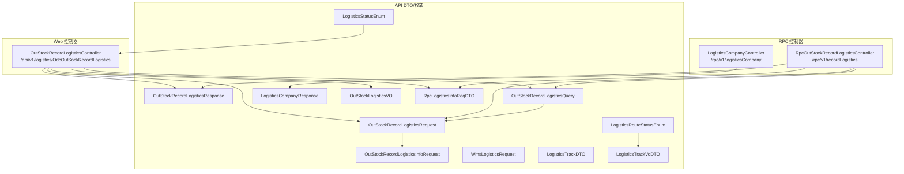
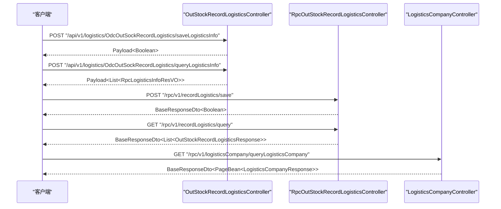
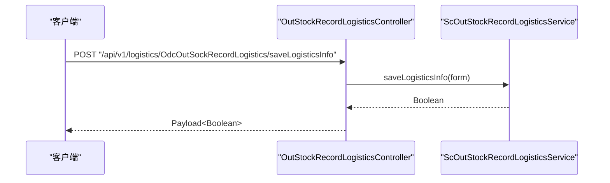
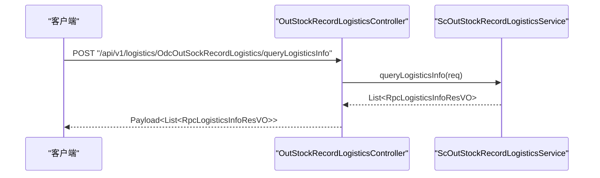
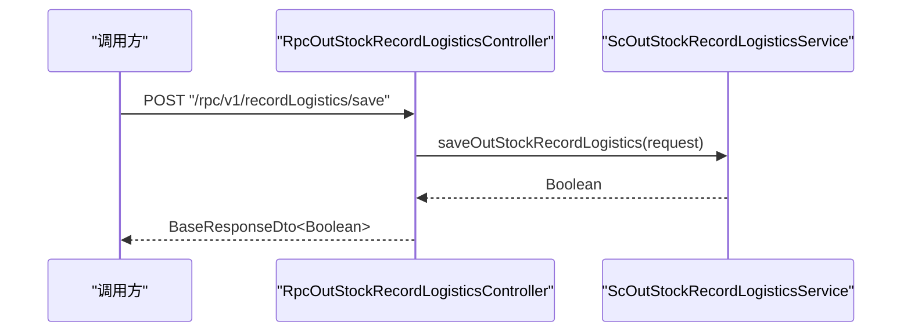
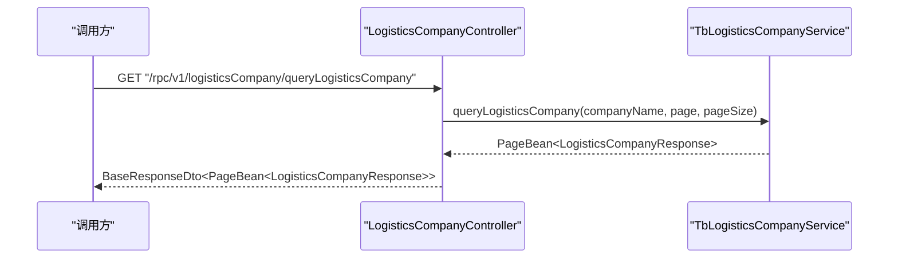
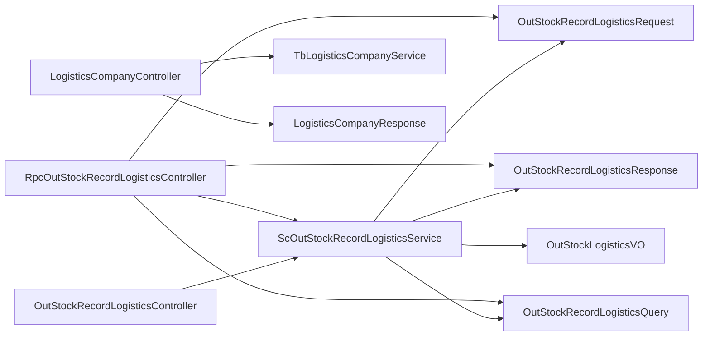

# 物流管理接口

<cite>
**本文引用的文件**
- [OutStockRecordLogisticsRequest.java](file://guoke-deepexi-storage-center-api/src/main/java/com/deepexi/api/storage/dto/logistics/OutStockRecordLogisticsRequest.java)
- [OutStockRecordLogisticsResponse.java](file://guoke-deepexi-storage-center-api/src/main/java/com/deepexi/api/storage/dto/logistics/OutStockRecordLogisticsResponse.java)
- [OutStockRecordLogisticsQuery.java](file://guoke-deepexi-storage-center-api/src/main/java/com/deepexi/api/storage/dto/logistics/OutStockRecordLogisticsQuery.java)
- [OutStockRecordLogisticsInfoRequest.java](file://guoke-deepexi-storage-center-api/src/main/java/com/deepexi/api/storage/dto/logistics/OutStockRecordLogisticsInfoRequest.java)
- [WmsLogisticsRequest.java](file://guoke-deepexi-storage-center-api/src/main/java/com/deepexi/api/storage/dto/logistics/WmsLogisticsRequest.java)
- [LogisticsCompanyResponse.java](file://guoke-deepexi-storage-center-api/src/main/java/com/deepexi/api/storage/dto/logistics/LogisticsCompanyResponse.java)
- [LogisticsStatusEnum.java](file://guoke-deepexi-storage-center-api/src/main/java/com/depthexi/api/storage/enums/LogisticsStatusEnum.java)
- [LogisticsRouteStatusEnum.java](file://guoke-deepexi-storage-center-api/src/main/java/com/depthexi/api/storage/enums/LogisticsRouteStatusEnum.java)
- [LogisticsTrackDTO.java](file://guoke-deepexi-storage-center-api/src/main/java/com/depthexi/api/storage/pojo/dto/order/LogisticsTrackDTO.java)
- [LogisticsTrackVoDTO.java](file://guoke-deepexi-storage-center-api/src/main/java/com/depthexi/api/storage/pojo/dto/order/LogisticsTrackVoDTO.java)
- [OutStockLogisticsVO.java](file://guoke-deepexi-storage-center-api/src/main/java/com/depthexi/api/storage/pojo/dto/stock/logistics/OutStockLogisticsVO.java)
- [RpcLogisticsInfoReqDTO.java](file://guoke-deepexi-storage-center-api/src/main/java/com/depthexi/api/storage/pojo/dto/stock/req/RpcLogisticsInfoReqDTO.java)
- [OutStockRecordLogisticsController.java](file://guoke-deepexi-storage-center-provider/src/main/java/com/Deepexi/storage/controller/web/OutStockRecordLogisticsController.java)
- [RpcOutStockRecordLogisticsController.java](file://guoke-deepexi-storage-center-provider/src/main/java/com/Deepexi/storage/controller/rpc/RpcOutStockRecordLogisticsController.java)
- [LogisticsCompanyController.java](file://guoke-deepexi-storage-center-provider/src/main/java/com/Deepexi/storage/controller/rpc/LogisticsCompanyController.java)
</cite>

## 目录
1. [简介](#简介)
2. [项目结构](#项目结构)
3. [核心组件](#核心组件)
4. [架构总览](#架构总览)
5. [详细组件分析](#详细组件分析)
6. [依赖分析](#依赖分析)
7. [性能考虑](#性能考虑)
8. [故障排查指南](#故障排查指南)
9. [结论](#结论)
10. [附录](#附录)

## 简介
本文件面向物流管理相关API，覆盖以下能力：
- 物流配送：保存物流信息、查询物流信息、按出库单查询物流详情
- 物流跟踪：基于快递单号与公司编码查询物流轨迹
- 物流公司管理：查询物流公司列表（分页）
- 数据模型：出库物流信息、物流公司、物流状态枚举、物流轨迹节点
- 权限与校验：接口标注鉴权注解，请求参数使用校验注解；统一响应包装

## 项目结构
物流相关接口主要分布在 provider 层的 Web/RPC 控制器与 API 层的数据传输对象与枚举中，形成“控制器-服务层-数据模型”的清晰分层。

图表来源
- [OutStockRecordLogisticsController.java:35-141](file://guoke-deepexi-storage-center-provider/src/main/java/com/Deepexi/storage/controller/web/OutStockRecordLogisticsController.java#L35-L141)
- [RpcOutStockRecordLogisticsController.java:25-67](file://guoke-deepexi-storage-center-provider/src/main/java/com/Deepexi/storage/controller/rpc/RpcOutStockRecordLogisticsController.java#L25-L67)
- [LogisticsCompanyController.java:18-38](file://guoke-deepexi-storage-center-provider/src/main/java/com/Deepexi/storage/controller/rpc/LogisticsCompanyController.java#L18-L38)
- [OutStockRecordLogisticsRequest.java:10-24](file://guoke-deepexi-storage-center-api/src/main/java/com/depthexi/api/storage/dto/logistics/OutStockRecordLogisticsRequest.java#L10-L24)
- [OutStockRecordLogisticsResponse.java:6-29](file://guoke-deepexi-storage-center-api/src/main/java/com/depthexi/api/storage/dto/logistics/OutStockRecordLogisticsResponse.java#L6-L29)
- [OutStockRecordLogisticsQuery.java:7-17](file://guoke-deepexi-storage-center-api/src/main/java/com/depthexi/api/storage/dto/logistics/OutStockRecordLogisticsQuery.java#L7-L17)
- [OutStockRecordLogisticsInfoRequest.java:10-23](file://guoke-deepexi-storage-center-api/src/main/java/com/depthexi/api/storage/dto/logistics/OutStockRecordLogisticsInfoRequest.java#L10-L23)
- [WmsLogisticsRequest.java:16-29](file://guoke-deepexi-storage-center-api/src/main/java/com/depthexi/api/storage/dto/logistics/WmsLogisticsRequest.java#L16-L29)
- [LogisticsCompanyResponse.java:6-12](file://guoke-deepexi-storage-center-api/src/main/java/com/depthexi/api/storage/dto/logistics/LogisticsCompanyResponse.java#L6-L12)
- [LogisticsStatusEnum.java:11-22](file://guoke-deepexi-storage-center-api/src/main/java/com/depthexi/api/storage/enums/LogisticsStatusEnum.java#L11-L22)
- [LogisticsRouteStatusEnum.java:11-53](file://guoke-deepexi/storage-center-api/src/main/java/com/depthexi/api/storage/enums/LogisticsRouteStatusEnum.java#L11-L53)
- [LogisticsTrackDTO.java:16-28](file://guoke-deepexi-storage-center-api/src/main/java/com/depthexi/api/storage/pojo/dto/order/LogisticsTrackDTO.java#L16-L28)
- [LogisticsTrackVoDTO.java:11-40](file://guoke-deepexi-storage-center-api/src/main/java/com/depthexi/api/storage/pojo/dto/order/LogisticsTrackVoDTO.java#L11-L40)
- [OutStockLogisticsVO.java:14-236](file://guoke-deepexi-storage-center-api/src/main/java/com/depthexi/api/storage/pojo/dto/stock/logistics/OutStockLogisticsVO.java#L14-L236)
- [RpcLogisticsInfoReqDTO.java:17-41](file://guoke-deepexi-storage-center-api/src/main/java/com/depthexi/api/storage/pojo/dto/stock/req/RpcLogisticsInfoReqDTO.java#L17-L41)

章节来源
- [OutStockRecordLogisticsController.java:35-141](file://guoke-deepexi-storage-center-provider/src/main/java/com/Deepexi/storage/controller/web/OutStockRecordLogisticsController.java#L35-L141)
- [RpcOutStockRecordLogisticsController.java:25-67](file://guoke-deepexi-storage-center-provider/src/main/java/com/Deepexi/storage/controller/rpc/RpcOutStockRecordLogisticsController.java#L25-L67)
- [LogisticsCompanyController.java:18-38](file://guoke-deepexi-storage-center-provider/src/main/java/com/Deepexi/storage/controller/rpc/LogisticsCompanyController.java#L18-L38)

## 核心组件
- Web 控制器
  - 出库物流主表接口：提供分页查询、按出库单ID查询、保存物流信息、按出库单编号查询物流、保存物流信息、查询物流信息等接口
- RPC 控制器
  - 出库物流记录接口：提供保存物流记录、查询物流记录、查询物流信息
  - 物流公司接口：提供查询物流公司列表（分页）
- 数据传输对象
  - 出库物流请求/响应/查询/明细项
  - WMS物流请求
  - 物流公司返回
  - 物流轨迹查询与返回对象
  - 出库物流VO
  - RPC物流信息请求
- 枚举
  - 物流状态枚举
  - 物流路由状态枚举

章节来源
- [OutStockRecordLogisticsController.java:35-141](file://guoke-deepexi-storage-center-provider/src/main/java/com/Deepexi/storage/controller/web/OutStockRecordLogisticsController.java#L35-L141)
- [RpcOutStockRecordLogisticsController.java:25-67](file://guoke-deepexi-storage-center-provider/src/main/java/com/Deepexi/storage/controller/rpc/RpcOutStockRecordLogisticsController.java#L25-L67)
- [LogisticsCompanyController.java:18-38](file://guoke-deepexi-storage-center-provider/src/main/java/com/Deepexi/storage/controller/rpc/LogisticsCompanyController.java#L18-L38)
- [OutStockRecordLogisticsRequest.java:10-24](file://guoke-deepexi-storage-center-api/src/main/java/com/depthexi/api/storage/dto/logistics/OutStockRecordLogisticsRequest.java#L10-L24)
- [OutStockRecordLogisticsResponse.java:6-29](file://guoke-deepexi-storage-center-api/src/main/java/com/depthexi/api/storage/dto/logistics/OutStockRecordLogisticsResponse.java#L6-L29)
- [OutStockRecordLogisticsQuery.java:7-17](file://guoke-deepexi-storage-center-api/src/main/java/com/depthexi/api/storage/dto/logistics/OutStockRecordLogisticsQuery.java#L7-L17)
- [OutStockRecordLogisticsInfoRequest.java:10-23](file://guoke-deepexi-storage-center-api/src/main/java/com/depthexi/api/storage/dto/logistics/OutStockRecordLogisticsInfoRequest.java#L10-L23)
- [WmsLogisticsRequest.java:16-29](file://guoke-deepexi-storage-center-api/src/main/java/com/depthexi/api/storage/dto/logistics/WmsLogisticsRequest.java#L16-L29)
- [LogisticsCompanyResponse.java:6-12](file://guoke-deepexi-storage-center-api/src/main/java/com/depthexi/api/storage/dto/logistics/LogisticsCompanyResponse.java#L6-L12)
- [LogisticsStatusEnum.java:11-22](file://guoke-deepexi-storage-center-api/src/main/java/com/depthexi/api/storage/enums/LogisticsStatusEnum.java#L11-L22)
- [LogisticsRouteStatusEnum.java:11-53](file://guoke-deepexi-storage-center-api/src/main/java/com/depthexi/api/storage/enums/LogisticsRouteStatusEnum.java#L11-L53)
- [LogisticsTrackDTO.java:16-28](file://guoke-deepexi-storage-center-api/src/main/java/com/depthexi/api/storage/pojo/dto/order/LogisticsTrackDTO.java#L16-L28)
- [LogisticsTrackVoDTO.java:11-40](file://guoke-deepexi-storage-center-api/src/main/java/com/depthexi/api/storage/pojo/dto/order/LogisticsTrackVoDTO.java#L11-L40)
- [OutStockLogisticsVO.java:14-236](file://guoke-deepexi-storage-center-api/src/main/java/com/depthexi/api/storage/pojo/dto/stock/logistics/OutStockLogisticsVO.java#L14-L236)
- [RpcLogisticsInfoReqDTO.java:17-41](file://guoke-deepexi-storage-center-api/src/main/java/com/depthexi/api/storage/pojo/dto/stock/req/RpcLogisticsInfoReqDTO.java#L17-L41)

## 架构总览
物流管理接口采用“Web/RPC 控制器 + DTO/VO + 枚举”的分层设计，统一通过响应包装类返回结果，支持鉴权注解与参数校验。

图表来源
- [OutStockRecordLogisticsController.java:129-139](file://guoke-deepexi-storage-center-provider/src/main/java/com/Deepexi/storage/controller/web/OutStockRecordLogisticsController.java#L129-L139)
- [RpcOutStockRecordLogisticsController.java:33-57](file://guoke-deepexi-storage-center-provider/src/main/java/com/Deepexi/storage/controller/rpc/RpcOutStockRecordLogisticsController.java#L33-L57)
- [LogisticsCompanyController.java:25-36](file://guoke-deepexi-storage-center-provider/src/main/java/com/Deepexi/storage/controller/rpc/LogisticsCompanyController.java#L25-L36)

## 详细组件分析

### Web 接口清单与规范
- 路径前缀：/api/v1/logistics/OdcOutSockRecordLogistics
- 鉴权：部分接口标注鉴权注解
- 统一响应：Payload 或 BaseResponseDto 包装

1) 列表分页查询
- 方法：POST
- 路径：/pageList
- 请求体：ScOutSockRecordLogisticsQuery
- 响应：Payload<PageBean<ScOutSockRecordLogisticsVO>>

2) 按出库单ID查询
- 方法：GET
- 路径：/getByOutSockRecordId
- 查询参数：outSockRecordId（String）
- 响应：Payload<ScOutSockRecordLogisticsVO>

3) 新建保存
- 方法：POST
- 路径：/addLogistics
- 请求体：ScOutSockRecordLogisticsForm
- 响应：Payload

4) 根据出库单关联编码查询出库编号
- 方法：POST
- 路径：/getMainOutSockCode
- 请求体：BaseRequestDto<String>
- 响应：BaseResponseDto<List<String>>

5) 根据出库单编号查询物流信息
- 方法：POST
- 路径：/queryLogisticsByCode
- 请求体：BaseRequestDto<String>
- 响应：BaseResponseDto<List<OutStockLogisticsVO>>

6) 保存物流信息
- 方法：POST
- 路径：/saveLogisticsInfo
- 请求体：SaveLogisticsInfoForm
- 响应：Payload<Boolean>

7) 查询物流信息
- 方法：POST
- 路径：/queryLogisticsInfo
- 请求体：RpcLogisticsInfoReqDTO
- 响应：Payload<List<RpcLogisticsInfoResVO>>

章节来源
- [OutStockRecordLogisticsController.java:43-139](file://guoke-deepexi-storage-center-provider/src/main/java/com/Deepexi/storage/controller/web/OutStockRecordLogisticsController.java#L43-L139)

### RPC 接口清单与规范
- 路径前缀：/rpc/v1/recordLogistics
- 鉴权：未标注
- 统一响应：BaseResponseDto 包装

1) 保存物流记录
- 方法：POST
- 路径：/save
- 请求体：OutStockRecordLogisticsRequest
- 响应：BaseResponseDto<Boolean>

2) 查询物流记录
- 方法：GET
- 路径：/query
- 查询参数：OutStockRecordLogisticsQuery（@SpringQueryMap）
- 响应：BaseResponseDto<List<OutStockRecordLogisticsResponse>>

3) 查询物流信息
- 方法：POST
- 路径：/queryLogisticsInfo
- 请求体：RpcLogisticsInfoReqDTO
- 响应：BaseResponseDto<List<RpcLogisticsInfoResVO>>

章节来源
- [RpcOutStockRecordLogisticsController.java:25-67](file://guoke-deepexi-storage-center-provider/src/main/java/com/Deepexi/storage/controller/rpc/RpcOutStockRecordLogisticsController.java#L25-L67)

### 物流公司查询接口
- 路径前缀：/rpc/v1/logisticsCompany
- 方法：GET
- 路径：/queryLogisticsCompany
- 查询参数：
  - companyName（可选，String）
  - page（默认1，Integer）
  - pageSize（默认10，Integer）
- 响应：BaseResponseDto<PageBean<LogisticsCompanyResponse>>

章节来源
- [LogisticsCompanyController.java:18-38](file://guoke-deepexi-storage-center-provider/src/main/java/com/Deepexi/storage/controller/rpc/LogisticsCompanyController.java#L18-L38)

### 数据模型与字段说明

#### 出库物流请求/响应/查询
- 出库物流请求（OutStockRecordLogisticsRequest）
  - 字段：companyId（公司ID）、outStockObjId（订单ID）、userName（操作人）、userId（操作人ID）、logistics（物流信息列表）
- 出库物流明细请求（OutStockRecordLogisticsInfoRequest）
  - 字段：logisticCompanyName、logisticCompanyCode、logisticCode、remark、outStockRecordId
- 出库物流响应（OutStockRecordLogisticsResponse）
  - 字段：logisticCompanyName、logisticCompanyCode、outStockRecordCode、outStockRecordId、logisticCode、remark、relationInRecordCode、companyId、userName、userId
- 出库物流查询（OutStockRecordLogisticsQuery）
  - 字段：relationInRecordCode（发货单号）、companyId（公司ID，必填）、outStockObjId（订单ID）

章节来源
- [OutStockRecordLogisticsRequest.java:10-24](file://guoke-deepexi-storage-center-api/src/main/java/com/depthexi/api/storage/dto/logistics/OutStockRecordLogisticsRequest.java#L10-L24)
- [OutStockRecordLogisticsInfoRequest.java:10-23](file://guoke-deepexi-storage-center-api/src/main/java/com/depthexi/api/storage/dto/logistics/OutStockRecordLogisticsInfoRequest.java#L10-L23)
- [OutStockRecordLogisticsResponse.java:6-29](file://guoke-deepexi-storage-center-api/src/main/java/com/depthexi/api/storage/dto/logistics/OutStockRecordLogisticsResponse.java#L6-L29)
- [OutStockRecordLogisticsQuery.java:7-17](file://guoke-deepexi-storage-center-api/src/main/java/com/depthexi/api/storage/dto/logistics/OutStockRecordLogisticsQuery.java#L7-L17)

#### WMS物流请求
- 字段：logisticsCode（物流单号，必填）、logisticsCompany（物流公司）

章节来源
- [WmsLogisticsRequest.java:16-29](file://guoke-deepexi-storage-center-api/src/main/java/com/depthexi/api/storage/dto/logistics/WmsLogisticsRequest.java#L16-L29)

#### 物流公司返回
- 字段：id、logisticsCompanyCode、logisticsCompanyName

章节来源
- [LogisticsCompanyResponse.java:6-12](file://guoke-deepexi-storage-center-api/src/main/java/com/depthexi/api/storage/dto/logistics/LogisticsCompanyResponse.java#L6-L12)

#### 物流轨迹查询与返回
- 物流轨迹查询（LogisticsTrackDTO）
  - 字段：expressNumber（快递单号）、expressCode（快递公司编码）、phone（手机号）
- 物流轨迹返回（LogisticsTrackVoDTO）
  - 字段：statusName（状态节点）、logisticsTrackInfoList（节点列表）
  - 节点字段：time（时间）、context（路由内容）、status（快递状态）、areaCenter（行政区域经纬度）、statusCode（物流状态）

章节来源
- [LogisticsTrackDTO.java:16-28](file://guoke-deepexi-storage-center-api/src/main/java/com/depthexi/api/storage/pojo/dto/order/LogisticsTrackDTO.java#L16-L28)
- [LogisticsTrackVoDTO.java:11-40](file://guoke-deepexi-storage-center-api/src/main/java/com/depthexi/api/storage/pojo/dto/order/LogisticsTrackVoDTO.java#L11-L40)

#### 出库物流VO
- 字段：id、outSockRecordId、outSockRecordCode、logisticsCompanyCode、waybillMainNo、waybillSonNo、sendCompanyName、sendAddress、sendContact、sendTel、receiveCompanyName、receiveAddress、receiveContact、receiveTel、receiveWarehouseAddress、cargoName、cargoCount、packageCount、packageWeight、sendRemark、packageService、otherFeeAmt、packageLength、packageWidth、packageHeight、packageVolume、expressType、payMethod、dr、tenantId、createdAt、creatorId、createdBy、modifierId、updatedBy、updatedAt、receiveProvince、receiveCity、receiveCounty、receiveDetailAddress、sendProvince、sendCity、sendCounty、sendDetailAddress

章节来源
- [OutStockLogisticsVO.java:14-236](file://guoke-deepexi-storage-center-api/src/main/java/com/depthexi/api/storage/pojo/dto/stock/logistics/OutStockLogisticsVO.java#L14-L236)

#### RPC物流信息请求
- 字段：relationOrderId、relationOrderCode、relationOrderType、waybillMainNo、sendCompanyId、receiveCompanyId

章节来源
- [RpcLogisticsInfoReqDTO.java:17-41](file://guoke-deepexi-storage-center-api/src/main/java/com/depthexi/api/storage/pojo/dto/stock/req/RpcLogisticsInfoReqDTO.java#L17-L41)

### 枚举定义
- 物流状态枚举（LogisticsStatusEnum）
  - START（在途）、END（结束）
- 物流路由状态枚举（LogisticsRouteStatusEnum）
  - ZAITU（在途）、LANSHOU（揽收）、YICHANG（异常）、QIANSHOU（签收）、JUQIAN（拒签）、PAIJIAN（派件）、TUIHUI（退回）、ZHUANHUI（转投）、QINGGUAN（清关）
  - 提供名称与值之间的互查方法

章节来源
- [LogisticsStatusEnum.java:11-22](file://guoke-deepexi-storage-center-api/src/main/java/com/depthexi/api/storage/enums/LogisticsStatusEnum.java#L11-L22)
- [LogisticsRouteStatusEnum.java:11-53](file://guoke-deepexi-storage-center-api/src/main/java/com/depthexi/api/storage/enums/LogisticsRouteStatusEnum.java#L11-L53)

### 接口调用时序图

#### 保存物流信息（Web）

图表来源
- [OutStockRecordLogisticsController.java:129-133](file://guoke-deepexi-storage-center-provider/src/main/java/com/Deepexi/storage/controller/web/OutStockRecordLogisticsController.java#L129-L133)

#### 查询物流信息（Web）

图表来源
- [OutStockRecordLogisticsController.java:135-139](file://guoke-deepexi-storage-center-provider/src/main/java/com/Deepexi/storage/controller/web/OutStockRecordLogisticsController.java#L135-L139)

#### 保存物流记录（RPC）

图表来源
- [RpcOutStockRecordLogisticsController.java:33-44](file://guoke-deepexi-storage-center-provider/src/main/java/com/Deepexi/storage/controller/rpc/RpcOutStockRecordLogisticsController.java#L33-L44)

#### 查询物流公司（RPC）

图表来源
- [LogisticsCompanyController.java:25-36](file://guoke-deepexi-storage-center-provider/src/main/java/com/Deepexi/storage/controller/rpc/LogisticsCompanyController.java#L25-L36)

### 权限控制与数据验证规则
- 权限控制
  - Web 控制器中的部分接口标注了鉴权注解，需在调用前完成认证
- 参数校验
  - Web/RPC 控制器中对请求参数使用了校验注解（如必填字段），并在异常时返回统一错误码
- 统一响应
  - Web 接口使用 Payload 包装；RPC 接口使用 BaseResponseDto 包装；均包含状态码与消息字段

章节来源
- [OutStockRecordLogisticsController.java:99-112](file://guoke-deepexi-storage-center-provider/src/main/java/com/Deepexi/storage/controller/web/OutStockRecordLogisticsController.java#L99-L112)
- [RpcOutStockRecordLogisticsController.java:33-44](file://guoke-deepexi-storage-center-provider/src/main/java/com/Deepexi/storage/controller/rpc/RpcOutStockRecordLogisticsController.java#L33-L44)
- [LogisticsCompanyController.java:25-36](file://guoke-deepexi-storage-center-provider/src/main/java/com/Deepexi/storage/controller/rpc/LogisticsCompanyController.java#L25-L36)

## 依赖分析
- 控制器依赖服务层接口，服务层负责业务逻辑与数据访问
- DTO/VO 作为跨层传输载体，保持接口契约稳定
- 枚举用于统一状态语义，避免魔法值

图表来源
- [OutStockRecordLogisticsController.java:39-40](file://guoke-deepexi-storage-center-provider/src/main/java/com/Deepexi/storage/controller/web/OutStockRecordLogisticsController.java#L39-L40)
- [RpcOutStockRecordLogisticsController.java:31-32](file://guoke-deepexi-storage-center-provider/src/main/java/com/Deepexi/storage/controller/rpc/RpcOutStockRecordLogisticsController.java#L31-L32)
- [LogisticsCompanyController.java:22-23](file://guoke-deepexi-storage-center-provider/src/main/java/com/Deepexi/storage/controller/rpc/LogisticsCompanyController.java#L22-L23)

## 性能考虑
- 分页查询：列表接口支持分页参数，建议前端传入合理页码与大小以降低单次负载
- 批量查询：RPC 查询物流记录支持批量返回，减少多次往返
- 缓存策略：对于物流公司列表等静态数据，可在服务层引入缓存以提升查询性能
- 异步处理：对于耗时的物流轨迹查询或第三方对接，建议异步化并提供轮询接口

## 故障排查指南
- 统一错误码
  - RPC 控制器在异常时设置统一错误码与消息，便于前端识别与提示
- 常见问题定位
  - 参数缺失：检查必填字段是否传入（如公司ID、发货单号）
  - 鉴权失败：确认已通过鉴权注解要求的认证流程
  - 返回空数据：确认查询条件是否正确（如出库单ID、物流单号）

章节来源
- [RpcOutStockRecordLogisticsController.java:33-57](file://guoke-deepexi-storage-center-provider/src/main/java/com/Deepexi/storage/controller/rpc/RpcOutStockRecordLogisticsController.java#L33-L57)
- [LogisticsCompanyController.java:25-36](file://guoke-deepexi-storage-center-provider/src/main/java/com/Deepexi/storage/controller/rpc/LogisticsCompanyController.java#L25-L36)

## 结论
本物流管理接口体系覆盖了从物流公司查询、物流信息保存与查询到物流轨迹查询的完整链路，采用清晰的分层设计与统一响应包装，配合参数校验与鉴权注解，满足生产环境的稳定性与可维护性需求。建议在实际接入时结合分页与缓存策略优化性能，并完善异常监控与日志追踪。

## 附录

### 请求与响应示例（示意）
- 保存物流信息（Web）
  - 请求体：SaveLogisticsInfoForm
  - 响应体：Payload<Boolean>
- 查询物流信息（Web）
  - 请求体：RpcLogisticsInfoReqDTO
  - 响应体：Payload<List<RpcLogisticsInfoResVO>>
- 保存物流记录（RPC）
  - 请求体：OutStockRecordLogisticsRequest
  - 响应体：BaseResponseDto<Boolean>
- 查询物流记录（RPC）
  - 查询参数：OutStockRecordLogisticsQuery
  - 响应体：BaseResponseDto<List<OutStockRecordLogisticsResponse>>
- 查询物流公司（RPC）
  - 查询参数：companyName、page、pageSize
  - 响应体：BaseResponseDto<PageBean<LogisticsCompanyResponse>>

章节来源
- [OutStockRecordLogisticsController.java:129-139](file://guoke-deepexi-storage-center-provider/src/main/java/com/Deepexi/storage/controller/web/OutStockRecordLogisticsController.java#L129-L139)
- [RpcOutStockRecordLogisticsController.java:33-57](file://guoke-deepexi-storage-center-provider/src/main/java/com/Deepexi/storage/controller/rpc/RpcOutStockRecordLogisticsController.java#L33-L57)
- [LogisticsCompanyController.java:25-36](file://guoke-deepexi-storage-center-provider/src/main/java/com/Deepexi/storage/controller/rpc/LogisticsCompanyController.java#L25-L36)