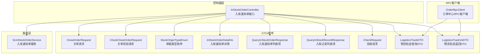
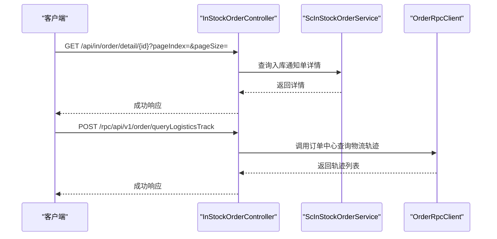
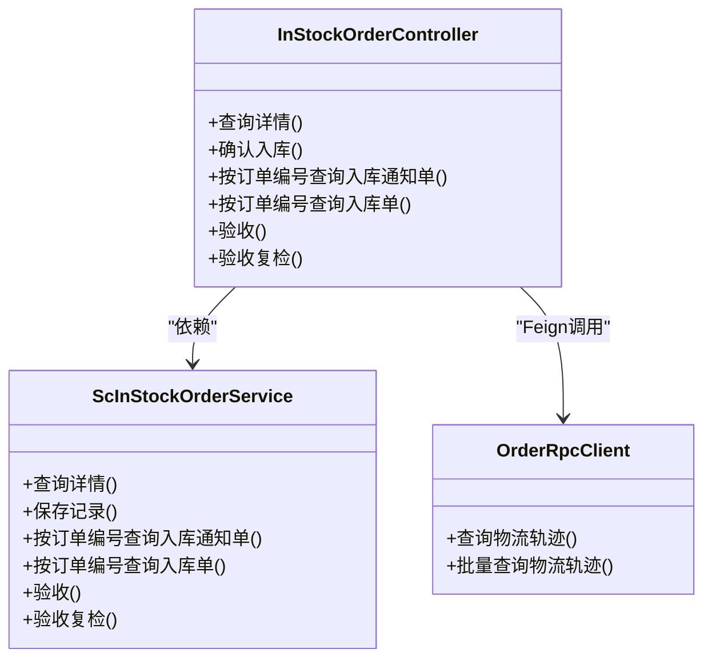
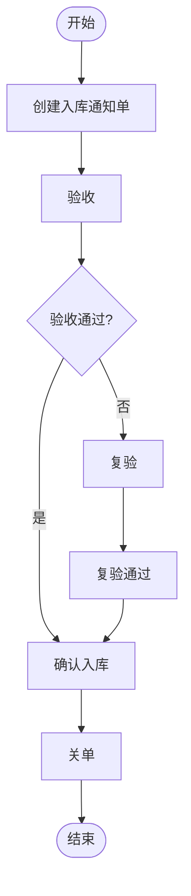

# 订单管理接口

<cite>
**本文引用的文件**
- [InStockOrderController.java](file://guoke-deepexi-storage-center-provider/src/main/java/com/deepexi/storage/controller/web/InStockOrderController.java)
- [CloseOrderRequest.java](file://guoke-deepexi-storage-center-api/src/main/java/com/Deepexi/api/storage/dto/closeorder/CloseOrderRequest.java)
- [CheckCloseOrderRequest.java](file://guoke-deepexi-storage-center-api/src/main/java/com/Deepexi/api/storage/dto/closeorder/CheckCloseOrderRequest.java)
- [OrderRpcClient.java](file://guoke-deepexi-storage-center-api/src/main/java/com/Deepexi/api/storage/OrderRpcClient.java)
- [StockOriginTypeEnum.java](file://guoke-deepexi-storage-center-api/src/main/java/com/Deepexi/api/storage/enums/in/StockOriginTypeEnum.java)
- [InStockOrderDetailVo.java](file://guoke-deepexi-storage-center-api/src/main/java/com/Deepexi/api/storage/dto/in/InStockOrderDetailVo.java)
- [QueryInStockOrderResponse.java](file://guoke-deepexi-storage-center-api/src/main/java/com/Deepexi/api/storage/dto/in/QueryInStockOrderResponse.java)
- [QueryInStockRecordResponse.java](file://guoke-deepexi-storage-center-api/src/main/java/com/Deepexi/api/storage/dto/in/QueryInStockRecordResponse.java)
- [CheckRequest.java](file://guoke-deepexi-storage-center-api/src/main/java/com/Deepexi/api/storage/dto/in/CheckRequest.java)
- [ScInStockOrderService.java](file://guoke-deepexi-storage-center-provider/src/main/java/com/deepexi/storage/service/ScInStockOrderService.java)
- [LogisticsTrackDTO.java](file://guoke-deepexi-storage-center-api/src/main/java/com/Deepexi/api/storage/pojo/dto/order/LogisticsTrackDTO.java)
- [LogisticsTrackVoDTO.java](file://guoke-deepexi-storage-center-api/src/main/java/com/Deepexi/api/storage/pojo/dto/order/LogisticsTrackVoDTO.java)
</cite>

## 目录
1. [简介](#简介)
2. [项目结构](#项目结构)
3. [核心组件](#核心组件)
4. [架构总览](#架构总览)
5. [详细组件分析](#详细组件分析)
6. [依赖关系分析](#依赖关系分析)
7. [性能考虑](#性能考虑)
8. [故障排查指南](#故障排查指南)
9. [结论](#结论)
10. [附录](#附录)

## 简介
本文件面向订单管理相关API的使用与集成，聚焦以下能力：
- 入库通知单：查询、验收、复验、确认入库、按订单编号查询入库单与记录
- 关单：校验关单与执行关单（支持入库/出库）
- 物流轨迹：查询单个与批量物流轨迹
- 权限与数据校验：基于注解与服务层的参数校验与异常处理策略

文档提供接口的HTTP方法、URL路径、请求参数、响应格式与典型错误场景，并以序列图/流程图展示关键业务流程。

## 项目结构
围绕订单管理的关键模块分布如下：
- 控制器层：提供Web/RPC接口入口，负责路由与参数透传
- DTO层：定义请求/响应模型与枚举
- 服务层：实现业务逻辑与幂等/锁控制
- RPC客户端：对外部中心（如订单中心）进行远程调用

图表来源
- [InStockOrderController.java:29-131](file://guoke-deepexi-storage-center-provider/src/main/java/com/deepexi/storage/controller/web/InStockOrderController.java#L29-L131)
- [CloseOrderRequest.java:14-28](file://guoke-deepexi-storage-center-api/src/main/java/com/Deepexi/api/storage/dto/closeorder/CloseOrderRequest.java#L14-L28)
- [CheckCloseOrderRequest.java:12-20](file://guoke-deepexi-storage-center-api/src/main/java/com/Deepexi/api/storage/dto/closeorder/CheckCloseOrderRequest.java#L12-L20)
- [StockOriginTypeEnum.java](file://guoke-deepexi-storage-center-api/src/main/java/com/Deepexi/api/storage/enums/in/StockOriginTypeEnum.java)
- [InStockOrderDetailVo.java](file://guoke-deepexi-storage-center-api/src/main/java/com/Deepexi/api/storage/dto/in/InStockOrderDetailVo.java)
- [QueryInStockOrderResponse.java](file://guoke-deepexi-storage-center-api/src/main/java/com/Deepexi/api/storage/dto/in/QueryInStockOrderResponse.java)
- [QueryInStockRecordResponse.java](file://guoke-deepexi-storage-center-api/src/main/java/com/Deepexi/api/storage/dto/in/QueryInStockRecordResponse.java)
- [CheckRequest.java](file://guoke-deepexi-storage-center-api/src/main/java/com/Deepexi/api/storage/dto/in/CheckRequest.java)
- [OrderRpcClient.java:19-34](file://guoke-deepexi-storage-center-api/src/main/java/com/Deepexi/api/storage/OrderRpcClient.java#L19-L34)

章节来源
- [InStockOrderController.java:29-131](file://guoke-deepexi-storage-center-provider/src/main/java/com/deepexi/storage/controller/web/InStockOrderController.java#L29-L131)

## 核心组件
- 入库通知单控制器：提供查询、验收、复验、确认入库、按订单编号查询入库单与记录等接口
- 关单请求DTO：封装关单校验与执行所需的字段及默认值
- 枚举：单据类型（入库/出库）用于区分关单方向
- 物流轨迹RPC客户端：对接订单中心，提供单个与批量物流轨迹查询

章节来源
- [InStockOrderController.java:29-131](file://guoke-deepexi-storage-center-provider/src/main/java/com/deepexi/storage/controller/web/InStockOrderController.java#L29-L131)
- [CloseOrderRequest.java:14-28](file://guoke-deepexi-storage-center-api/src/main/java/com/Deepexi/api/storage/dto/closeorder/CloseOrderRequest.java#L14-L28)
- [CheckCloseOrderRequest.java:12-20](file://guoke-deepexi-storage-center-api/src/main/java/com/Deepexi/api/storage/dto/closeorder/CheckCloseOrderRequest.java#L12-L20)
- [StockOriginTypeEnum.java](file://guoke-deepexi-storage-center-api/src/main/java/com/Deepexi/api/storage/enums/in/StockOriginTypeEnum.java)
- [OrderRpcClient.java:19-34](file://guoke-deepexi-storage-center-api/src/main/java/com/Deepexi/api/storage/OrderRpcClient.java#L19-L34)

## 架构总览
订单管理接口采用“控制器-服务-外部RPC”的分层架构：
- 控制器接收HTTP请求，进行参数校验与鉴权
- 服务层编排业务流程，必要时加分布式锁保证幂等
- 外部RPC客户端对接订单中心，获取物流轨迹等信息

图表来源
- [InStockOrderController.java:40-68](file://guoke-deepexi-storage-center-provider/src/main/java/com/deepexi/storage/controller/web/InStockOrderController.java#L40-L68)
- [OrderRpcClient.java:23-32](file://guoke-deepexi-storage-center-api/src/main/java/com/Deepexi/api/storage/OrderRpcClient.java#L23-L32)

## 详细组件分析

### 入库通知单接口
- 接口1：按主键查询入库通知单详情（带分页与产品筛选）
  - 方法与路径：GET /api/in/order/{id}
  - 查询参数：pageIndex、pageSize、productCode（可选）、productName（可选）
  - 响应：Payload<ScInStockOrderVO>
  - 示例：见“请求示例”与“响应示例”
- 接口2：按主键查询入库通知单详情（完整版）
  - 方法与路径：GET /api/in/order/detail/{id}
  - 查询参数：pageIndex、pageSize
  - 响应：Payload<InStockOrderDetailVo>
- 接口3：确认入库（幂等与锁控制）
  - 方法与路径：POST /api/in/order/{id}
  - 请求体：无
  - 响应：Payload<Boolean>
  - 幂等与锁：基于Redisson的分布式锁，超时重试策略
- 接口4：按订单编号查询入库通知单
  - 方法与路径：GET /api/in/order/list/orderCodeAndId
  - 查询参数：orderCode、orderId、companyId（可选）
  - 响应：Payload<List<QueryInStockOrderResponse>>
- 接口5：按订单编号查询入库单
  - 方法与路径：GET /api/in/order/record/orderCodeAndId
  - 查询参数：orderCode、orderId
  - 响应：Payload<List<QueryInStockRecordResponse>>
  - 鉴权：@Auth 注解
- 接口6：入库通知单验收
  - 方法与路径：POST /api/in/order/check
  - 请求体：CheckRequest
  - 响应：Payload<Boolean>
- 接口7：入库通知单验收复检
  - 方法与路径：POST /api/in/order/check/review
  - 请求体：CheckRequest
  - 响应：Payload<Boolean>

请求示例（仅列明关键字段）
- 查询详情（完整版）
  - GET /api/in/order/detail/{id}?pageIndex=1&pageSize=20
- 确认入库
  - POST /api/in/order/{id}
- 按订单编号查询入库通知单
  - GET /api/in/order/list/orderCodeAndId?orderCode=ABC&orderId=123&companyId=CO123
- 按订单编号查询入库单
  - GET /api/in/order/record/orderCodeAndId?orderCode=ABC&orderId=123
- 验收/复检
  - POST /api/in/order/check
  - 请求体：CheckRequest（包含验收相关字段）

响应示例（仅列明关键字段）
- 查询详情（完整版）
  - 返回：InStockOrderDetailVo（包含订单主从信息、明细分页）
- 确认入库
  - 返回：true/false
- 按订单编号查询入库通知单/入库单
  - 返回：列表对象数组
- 验收/复检
  - 返回：true/false

章节来源
- [InStockOrderController.java:40-129](file://guoke-deepexi-storage-center-provider/src/main/java/com/deepexi/storage/controller/web/InStockOrderController.java#L40-L129)
- [InStockOrderDetailVo.java](file://guoke-deepexi-storage-center-api/src/main/java/com/Deepexi/api/storage/dto/in/InStockOrderDetailVo.java)
- [QueryInStockOrderResponse.java](file://guoke-deepexi-storage-center-api/src/main/java/com/Deepexi/api/storage/dto/in/QueryInStockOrderResponse.java)
- [QueryInStockRecordResponse.java](file://guoke-deepexi-storage-center-api/src/main/java/com/Deepexi/api/storage/dto/in/QueryInStockRecordResponse.java)
- [CheckRequest.java](file://guoke-deepexi-storage-center-api/src/main/java/com/Deepexi/api/storage/dto/in/CheckRequest.java)

### 关单接口
- 关单校验
  - 方法与路径：POST /api/in/order/check/close
  - 请求体：CheckCloseOrderRequest（包含orderType、orderId、orderCode）
  - 响应：Payload<Boolean>
- 执行关单
  - 方法与路径：POST /api/in/order/close
  - 请求体：CloseOrderRequest（包含companyId、orderId、orderCode、orderType、items）
  - 响应：Payload<Boolean>

请求示例（仅列明关键字段）
- 关单校验
  - POST /api/in/order/check/close
  - 请求体：CheckCloseOrderRequest（orderType=1或2，默认出库；orderId、orderCode必填）
- 执行关单
  - POST /api/in/order/close
  - 请求体：CloseOrderRequest（orderType=1或2，默认出库；items为明细列表）

响应示例（仅列明关键字段）
- 关单校验/执行关单
  - 返回：true/false

章节来源
- [CheckCloseOrderRequest.java:12-20](file://guoke-deepexi-storage-center-api/src/main/java/com/Deepexi/api/storage/dto/closeorder/CheckCloseOrderRequest.java#L12-L20)
- [CloseOrderRequest.java:14-28](file://guoke-deepexi-storage-center-api/src/main/java/com/Deepexi/api/storage/dto/closeorder/CloseOrderRequest.java#L14-L28)
- [StockOriginTypeEnum.java](file://guoke-deepexi-storage-center-api/src/main/java/com/Deepexi/api/storage/enums/in/StockOriginTypeEnum.java)

### 物流轨迹接口
- 单个物流轨迹查询
  - 方法与路径：POST /rpc/api/v1/order/queryLogisticsTrack
  - 请求体：LogisticsTrackDTO（包含快递单号、公司编码等）
  - 响应：Payload<List<LogisticsTrackVoDTO>>
- 批量物流轨迹查询
  - 方法与路径：POST /rpc/api/v1/order/queryBatchLogisticsTrack
  - 请求体：List<LogisticsTrackDTO>
  - 响应：Payload<Map<String, List<LogisticsTrackVoDTO>>>

请求示例（仅列明关键字段）
- 单个查询
  - POST /rpc/api/v1/order/queryLogisticsTrack
  - 请求体：LogisticsTrackDTO（包含运单号、快递公司编码）
- 批量查询
  - POST /rpc/api/v1/order/queryBatchLogisticsTrack
  - 请求体：多个LogisticsTrackDTO组成的数组

响应示例（仅列明关键字段）
- 单个查询
  - 返回：轨迹列表
- 批量查询
  - 返回：Map<“运单号_快递公司编码”, 轨迹列表>

章节来源
- [OrderRpcClient.java:23-32](file://guoke-deepexi-storage-center-api/src/main/java/com/Deepexi/api/storage/OrderRpcClient.java#L23-L32)
- [LogisticsTrackDTO.java](file://guoke-deepexi-storage-center-api/src/main/java/com/Deepexi/api/storage/pojo/dto/order/LogisticsTrackDTO.java)
- [LogisticsTrackVoDTO.java](file://guoke-deepexi-storage-center-api/src/main/java/com/Deepexi/api/storage/pojo/dto/order/LogisticsTrackVoDTO.java)

## 依赖关系分析
- 控制器依赖服务层与DTO/枚举
- 服务层依赖Mapper/Manager等基础设施
- 控制器通过Feign客户端调用订单中心RPC接口
- 分布式锁用于关键写操作的幂等保护

图表来源
- [InStockOrderController.java:32-35](file://guoke-deepexi-storage-center-provider/src/main/java/com/deepexi/storage/controller/web/InStockOrderController.java#L32-L35)
- [ScInStockOrderService.java](file://guoke-deepexi-storage-center-provider/src/main/java/com/deepexi/storage/service/ScInStockOrderService.java)
- [OrderRpcClient.java:19-34](file://guoke-deepexi-storage-center-api/src/main/java/com/Deepexi/api/storage/OrderRpcClient.java#L19-L34)

## 性能考虑
- 幂等与锁：确认入库接口使用Redisson分布式锁，避免并发重复入账
- 分页查询：详情查询支持分页参数，建议前端合理设置pageSize
- 批量查询：物流轨迹提供批量接口，减少多次往返
- 异常快速失败：参数异常与业务异常均通过统一异常工具抛出，便于前端快速感知

## 故障排查指南
常见问题与定位要点
- 参数缺失或非法
  - 现象：返回参数异常
  - 定位：检查请求参数是否齐全（如orderCode、orderId、id等）
- 并发冲突
  - 现象：提示“当前公司数据正在处理请稍后提交”
  - 定位：确认分布式锁是否被占用，适当重试
- 业务校验失败
  - 现象：返回业务异常
  - 定位：查看服务层校验逻辑与外部RPC返回结果
- 权限不足
  - 现象：鉴权失败
  - 定位：确认@Auth注解的接口是否携带有效凭证

章节来源
- [InStockOrderController.java:74-93](file://guoke-deepexi-storage-center-provider/src/main/java/com/deepexi/storage/controller/web/InStockOrderController.java#L74-L93)

## 结论
本文档梳理了仓储中心订单管理相关的核心接口，覆盖入库通知单的查询、验收、复验、确认入库、按订单编号查询等能力，并补充了关单与物流轨迹查询的接口规范。结合分布式锁与鉴权机制，系统在并发与安全方面具备一定保障。建议在生产集成中严格遵循参数与鉴权要求，并利用分页与批量接口提升性能。

## 附录

### 订单状态与业务规则（概念性说明）
- 入库通知单生命周期（概念示意）
  - 创建：生成入库通知单
  - 验收：对到货商品进行验收
  - 复验：二次复核
  - 确认入库：完成库存登记
  - 关单：结束该单据的后续操作

[此图为概念流程，不对应具体源码文件]

### 错误码与响应约定（示例说明）
- 成功：Payload.success = true
- 参数异常：Payload.code = 400xx
- 业务异常：Payload.code = 500xx
- 权限异常：Payload.code = 401/403

章节来源
- [InStockOrderController.java:74-93](file://guoke-deepexi-storage-center-provider/src/main/java/com/deepexi/storage/controller/web/InStockOrderController.java#L74-L93)