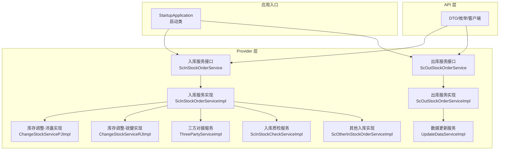
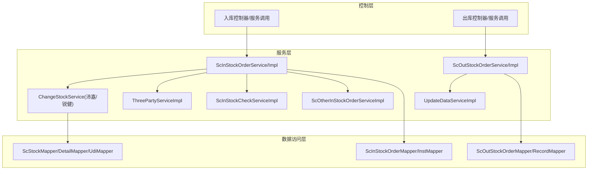
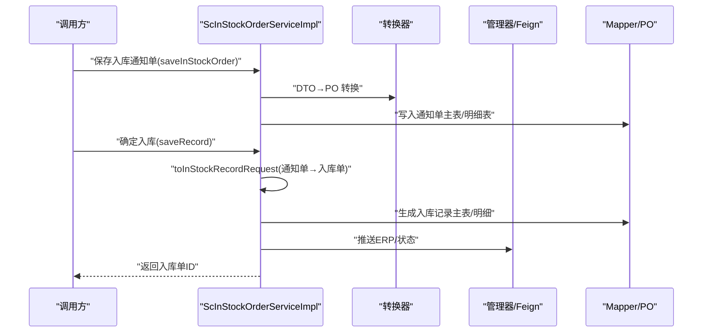
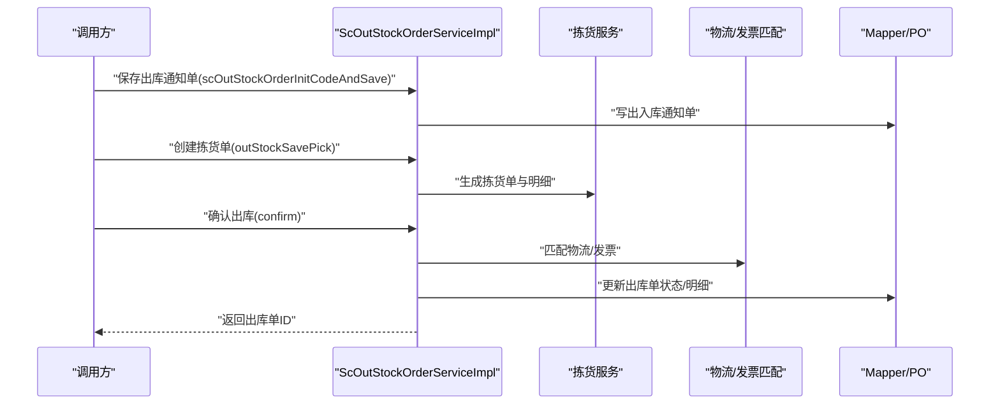
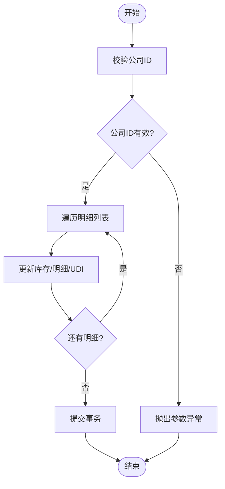
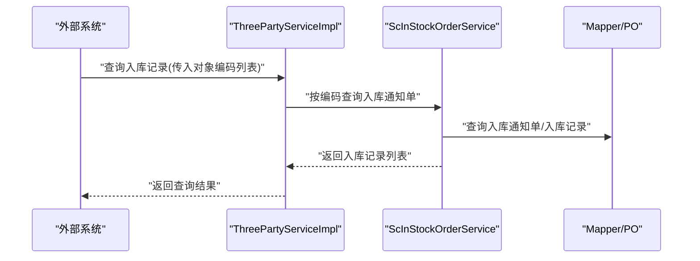
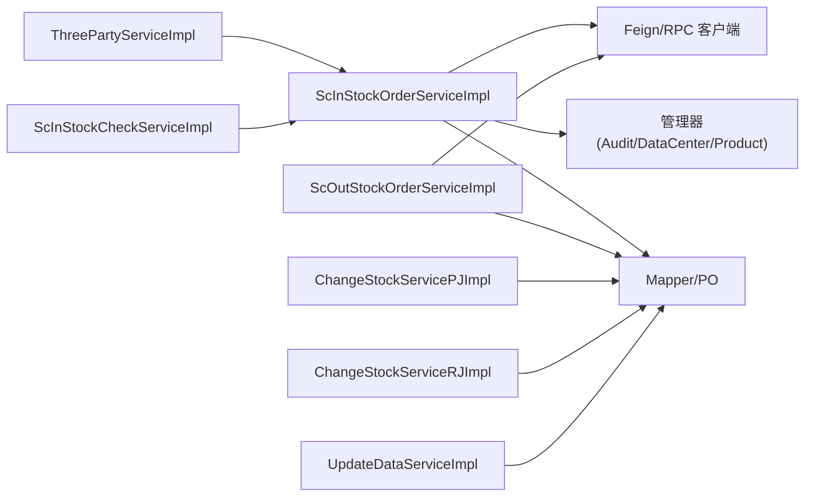

# 业务流程

<cite>
**本文引用的文件**   
- [StartupApplication.java](file://guoke-deepexi-storage-center-provider/src/main/java/com/deepexi/storage/StartupApplication.java)
- [ScInStockOrderService.java](file://guoke-deepexi-storage-center-provider/src/main/java/com/deepexi/storage/service/ScInStockOrderService.java)
- [ScInStockOrderServiceImpl.java](file://guoke-deepexi-storage-center-provider/src/main/java/com/deepexi/storage/service/impl/ScInStockOrderServiceImpl.java)
- [ScOutStockOrderService.java](file://guoke-deepexi-storage-center-provider/src/main/java/com/deepexi/storage/service/ScOutStockOrderService.java)
- [ScOutStockOrderServiceImpl.java](file://guoke-deepexi-storage-center-provider/src/main/java/com/deepexi/storage/service/impl/ScOutStockOrderServiceImpl.java)
- [ScInStockRecordRequest.java](file://guoke-deepexi-storage-center-api/src/main/java/com/deepexi/api/storage/dto/in/InStockRecordRequest.java)
- [ChangeStockServicePJImpl.java](file://guoke-deepexi-storage-center-provider/src/main/java/com/deepexi/storage/service/changeStock/ChangeStockServicePJImpl.java)
- [ChangeStockServiceRJImpl.java](file://guoke-deepexi-storage-center-provider/src/main/java/com/deepexi/storage/service/changeStock/ChangeStockServiceRJImpl.java)
- [ThreePartyServiceImpl.java](file://guoke-deepexi-storage-center-provider/src/main/java/com/deepexi/storage/service/threeParty/ThreePartyServiceImpl.java)
- [UpdateDataServiceImpl.java](file://guoke-deepexi-storage-center-provider/src/main/java/com/deepexi/storage/service/UpdateDataServiceImpl.java)
- [ScInStockCheckServiceImpl.java](file://guoke-deepexi-storage-center-provider/src/main/java/com/deepexi/storage/service/impl/ScInStockCheckServiceImpl.java)
- [ScOtherInStockOrderServiceImpl.java](file://guoke-deepexi-storage-center-provider/src/main/java/com/deepexi/storage/service/impl/ScOtherInStockOrderServiceImpl.java)
</cite>

## 目录
1. [引言](#引言)
2. [项目结构](#项目结构)
3. [核心组件](#核心组件)
4. [架构总览](#架构总览)
5. [详细组件分析](#详细组件分析)
6. [依赖分析](#依赖分析)
7. [性能考虑](#性能考虑)
8. [故障排查指南](#故障排查指南)
9. [结论](#结论)
10. [附录](#附录)

## 引言
本文件面向国科恒泰仓储管理系统，聚焦于入库、出库与库存调整三大核心业务流程，结合实际代码库中的接口定义、服务实现与领域模型，系统化梳理业务流程的调用关系、数据流、控制流与关键配置项。文档既提供面向初学者的流程图解，也提供面向资深工程师的实现细节与扩展点说明。

## 项目结构
系统采用多模块分层组织：
- provider 层：业务服务实现、控制器、转换器、管理器、Mapper/POJO/POJO VO 等
- api 层：对外 DTO、枚举、RPC 客户端等
- dao/service 层：当前仓库未直接展示，但 provider 中已包含完整 Mapper 与 Service 实现

应用入口通过 Spring Boot 启动类启用服务发现、Feign、事务、定时任务、异步执行与 RPC 能力。

图表来源
- [StartupApplication.java:28-33](file://guoke-deepexi-storage-center-provider/src/main/java/com/deepexi/storage/StartupApplication.java#L28-L33)
- [ScInStockOrderService.java:44-423](file://guoke-deepexi-storage-center-provider/src/main/java/com/deepexi/storage/service/ScInStockOrderService.java#L44-L423)
- [ScInStockOrderServiceImpl.java:180-182](file://guoke-deepexi-storage-center-provider/src/main/java/com/deepexi/storage/service/impl/ScInStockOrderServiceImpl.java#L180-L182)
- [ScOutStockOrderService.java:52-532](file://guoke-deepexi-storage-center-provider/src/main/java/com/deepexi/storage/service/ScOutStockOrderService.java#L52-L532)
- [ScOutStockOrderServiceImpl.java:173-175](file://guoke-deepexi-storage-center-provider/src/main/java/com/deepexi/storage/service/impl/ScOutStockOrderServiceImpl.java#L173-L175)
- [ChangeStockServicePJImpl.java:36-37](file://guoke-deepexi-storage-center-provider/src/main/java/com/deepexi/storage/service/changeStock/ChangeStockServicePJImpl.java#L36-L37)
- [ChangeStockServiceRJImpl.java:36-37](file://guoke-deepexi-storage-center-provider/src/main/java/com/deepexi/storage/service/changeStock/ChangeStockServiceRJImpl.java#L36-L37)
- [ThreePartyServiceImpl.java:276-293](file://guoke-deepexi-storage-center-provider/src/main/java/com/deepexi/storage/service/threeParty/ThreePartyServiceImpl.java#L276-L293)
- [UpdateDataServiceImpl.java:1-25](file://guoke-deepexi-storage-center-provider/src/main/java/com/deepexi/storage/service/UpdateDataServiceImpl.java#L1-L25)
- [ScInStockCheckServiceImpl.java:1-24](file://guoke-deepexi-storage-center-provider/src/main/java/com/deepexi/storage/service/impl/ScInStockCheckServiceImpl.java#L1-L24)
- [ScOtherInStockOrderServiceImpl.java:1-26](file://guoke-deepexi-storage-center-provider/src/main/java/com/deepexi/storage/service/impl/ScOtherInStockOrderServiceImpl.java#L1-L26)

章节来源
- [StartupApplication.java:28-33](file://guoke-deepexi-storage-center-provider/src/main/java/com/deepexi/storage/StartupApplication.java#L28-L33)

## 核心组件
- 入库服务接口与实现：负责入库通知单、入库单、质检、验收、红冲、一键入库、外部导入、扫码导入、OMS 入库、仓库与货位分配等全流程。
- 出库服务接口与实现：负责出库通知单、出库单、拣货、物流、OMS 出库、欠货统计、扫描校验、外部导入等。
- 库存调整服务：按不同业务方（沛嘉、锐健）提供库存变更实现，支持按明细批量调整。
- 三方对接服务：提供第三方入库单查询与映射能力。
- 数据更新服务：提供历史数据刷写、一致性修复等能力。
- 入库质检服务：提供质检、复检、状态更新等能力。
- 其他入库实现：处理非标准入库场景。

章节来源
- [ScInStockOrderService.java:44-423](file://guoke-deepexi-storage-center-provider/src/main/java/com/deepexi/storage/service/ScInStockOrderService.java#L44-L423)
- [ScOutStockOrderService.java:52-532](file://guoke-deepexi-storage-center-provider/src/main/java/com/deepexi/storage/service/ScOutStockOrderService.java#L52-L532)
- [ChangeStockServicePJImpl.java:36-37](file://guoke-deepexi-storage-center-provider/src/main/java/com/deepexi/storage/service/changeStock/ChangeStockServicePJImpl.java#L36-L37)
- [ChangeStockServiceRJImpl.java:36-37](file://guoke-deepexi-storage-center-provider/src/main/java/com/deepexi/storage/service/changeStock/ChangeStockServiceRJImpl.java#L36-L37)
- [ThreePartyServiceImpl.java:276-293](file://guoke-deepexi-storage-center-provider/src/main/java/com/deepexi/storage/service/threeParty/ThreePartyServiceImpl.java#L276-L293)
- [UpdateDataServiceImpl.java:1-25](file://guoke-deepexi-storage-center-provider/src/main/java/com/deepexi/storage/service/UpdateDataServiceImpl.java#L1-L25)
- [ScInStockCheckServiceImpl.java:1-24](file://guoke-deepexi-storage-center-provider/src/main/java/com/deepexi/storage/service/impl/ScInStockCheckServiceImpl.java#L1-L24)
- [ScOtherInStockOrderServiceImpl.java:1-26](file://guoke-deepexi-storage-center-provider/src/main/java/com/deepexi/storage/service/impl/ScOtherInStockOrderServiceImpl.java#L1-L26)

## 架构总览
系统采用“接口 + 实现 + 转换器 + 管理器 + Mapper”的分层设计，围绕入库/出库/库存调整三大流程构建，配合 Feign/RPC、定时任务、异步线程池与分布式锁等机制保障高可用与高性能。

图表来源
- [ScInStockOrderServiceImpl.java:180-182](file://guoke-deepexi-storage-center-provider/src/main/java/com/deepexi/storage/service/impl/ScInStockOrderServiceImpl.java#L180-L182)
- [ScOutStockOrderServiceImpl.java:173-175](file://guoke-deepexi-storage-center-provider/src/main/java/com/deepexi/storage/service/impl/ScOutStockOrderServiceImpl.java#L173-L175)
- [ChangeStockServicePJImpl.java:36-37](file://guoke-deepexi-storage-center-provider/src/main/java/com/deepexi/storage/service/changeStock/ChangeStockServicePJImpl.java#L36-L37)
- [ChangeStockServiceRJImpl.java:36-37](file://guoke-deepexi-storage-center-provider/src/main/java/com/deepexi/storage/service/changeStock/ChangeStockServiceRJImpl.java#L36-L37)
- [ThreePartyServiceImpl.java:276-293](file://guoke-deepexi-storage-center-provider/src/main/java/com/deepexi/storage/service/threeParty/ThreePartyServiceImpl.java#L276-L293)
- [UpdateDataServiceImpl.java:1-25](file://guoke-deepexi-storage-center-provider/src/main/java/com/deepexi/storage/service/UpdateDataServiceImpl.java#L1-L25)
- [ScInStockCheckServiceImpl.java:1-24](file://guoke-deepexi-storage-center-provider/src/main/java/com/deepexi/storage/service/impl/ScInStockCheckServiceImpl.java#L1-L24)
- [ScOtherInStockOrderServiceImpl.java:1-26](file://guoke-deepexi-storage-center-provider/src/main/java/com/deepexi/storage/service/impl/ScOtherInStockOrderServiceImpl.java#L1-L26)

## 详细组件分析

### 入库流程（通知单 → 入库单 → 质检/验收 → 生成库存）
- 关键接口与方法
  - 通知单保存与实例保存：saveInStockOrder、saveInStockOrderInst
  - 通知单转入库记录：toInStockRecordRequest
  - 保存入库日志：saveInStockOperLog
  - 推送状态与ERP：pushInStockStatus、pushuPurchaseInStockStatus
  - 一键入库与外部导入：oneClick、externalInStock、batchExternalInRecord
  - 扫码导入：importInStockScanCode
  - OMS 入库：omsInStock
  - 仓库/货位分配：createWarehouse、goodsRack、goodsPosition
  - 质检/复检/验收：check、checkReview、checkAccept、checkAcceptReview
  - 红冲入库：redEntryInStorage
  - 关联订单关闭检查与关闭：checkCloseOrder、closeOrder
  - 退货拒收自动入：addCheckRejectInStockOrder
- 关键 DTO
  - 入库记录请求：InStockRecordRequest（包含入库通知单ID与明细集合）

图表来源
- [ScInStockOrderService.java:264-281](file://guoke-deepexi-storage-center-provider/src/main/java/com/deepexi/storage/service/ScInStockOrderService.java#L264-L281)
- [ScInStockOrderServiceImpl.java:180-182](file://guoke-deepexi-storage-center-provider/src/main/java/com/deepexi/storage/service/impl/ScInStockOrderServiceImpl.java#L180-L182)
- [ScInStockRecordRequest.java:18-30](file://guoke-deepexi-storage-center-api/src/main/java/com/deepexi/api/storage/dto/in/InStockRecordRequest.java#L18-L30)

章节来源
- [ScInStockOrderService.java:44-423](file://guoke-deepexi-storage-center-provider/src/main/java/com/deepexi/storage/service/ScInStockOrderService.java#L44-L423)
- [ScInStockOrderServiceImpl.java:180-182](file://guoke-deepexi-storage-center-provider/src/main/java/com/deepexi/storage/service/impl/ScInStockOrderServiceImpl.java#L180-L182)
- [ScInStockRecordRequest.java:18-30](file://guoke-deepexi-storage-center-api/src/main/java/com/deepexi/api/storage/dto/in/InStockRecordRequest.java#L18-L30)

### 出库流程（通知单 → 出库单 → 拣货/复核 → 物流/开票）
- 关键接口与方法
  - 通知单保存与初始化编码：scOutStockOrderInitCodeAndSave
  - 出库单详情与分页：getOutStockOrderDetailById、getOutStockRecordDetailInfo
  - 销售出库提交：saleOutStockSubmit、saleOutStockSubmitAll
  - 出库确认：confirm（扫码确认）
  - 拣货：outStockSavePick、saveOutStockPickAndPickDetails
  - 欠货统计与客户分组：pageOweOutStockRecord、listOweOutStockRecordCustomerGroup
  - OMS 出库：omsOutStock
  - 外部导入：externalOutStock、batchExternalOutRecord
  - 扫码校验：checkScanCode
  - 关闭与复检：checkCloseOrder、closeOrder
  - 配送信息校验：checkOutStockDeliveryInfo
- 关键 DTO
  - 出库记录请求（对应文件未直接列出，但接口签名与调用链明确）

图表来源
- [ScOutStockOrderService.java:322-350](file://guoke-deepexi-storage-center-provider/src/main/java/com/deepexi/storage/service/ScOutStockOrderService.java#L322-L350)
- [ScOutStockOrderServiceImpl.java:173-175](file://guoke-deepexi-storage-center-provider/src/main/java/com/deepexi/storage/service/impl/ScOutStockOrderServiceImpl.java#L173-L175)

章节来源
- [ScOutStockOrderService.java:52-532](file://guoke-deepexi-storage-center-provider/src/main/java/com/deepexi/storage/service/ScOutStockOrderService.java#L52-L532)
- [ScOutStockOrderServiceImpl.java:173-175](file://guoke-deepexi-storage-center-provider/src/main/java/com/deepexi/storage/service/impl/ScOutStockOrderServiceImpl.java#L173-L175)

### 库存调整流程（按业务方差异化实现）
- 沛嘉实现：ChangeStockServicePJImpl
- 锐健实现：ChangeStockServiceRJImpl
- 共同点：接收 StockChangeRequest（含公司ID与明细列表），逐条校验并更新库存、库存明细与UDI；支持事务回滚。

图表来源
- [ChangeStockServicePJImpl.java:60-69](file://guoke-deepexi-storage-center-provider/src/main/java/com/deepexi/storage/service/changeStock/ChangeStockServicePJImpl.java#L60-L69)
- [ChangeStockServiceRJImpl.java:63-70](file://guoke-deepexi-storage-center-provider/src/main/java/com/deepexi/storage/service/changeStock/ChangeStockServiceRJImpl.java#L63-L70)

章节来源
- [ChangeStockServicePJImpl.java:36-37](file://guoke-deepexi-storage-center-provider/src/main/java/com/deepexi/storage/service/changeStock/ChangeStockServicePJImpl.java#L36-L37)
- [ChangeStockServiceRJImpl.java:36-37](file://guoke-deepexi-storage-center-provider/src/main/java/com/deepexi/storage/service/changeStock/ChangeStockServiceRJImpl.java#L36-L37)

### 三方对接与外部导入
- 三方查询入库记录：根据三方入库对象编码列表查询入库通知单与入库记录
- 外部导入：支持外部系统批量导入入库/出库记录

图表来源
- [ThreePartyServiceImpl.java:276-293](file://guoke-deepexi-storage-center-provider/src/main/java/com/deepexi/storage/service/threeParty/ThreePartyServiceImpl.java#L276-L293)
- [ScInStockOrderService.java:346-356](file://guoke-deepexi-storage-center-provider/src/main/java/com/deepexi/storage/service/ScInStockOrderService.java#L346-L356)

章节来源
- [ThreePartyServiceImpl.java:276-293](file://guoke-deepexi-storage-center-provider/src/main/java/com/deepexi/storage/service/threeParty/ThreePartyServiceImpl.java#L276-L293)
- [ScInStockOrderService.java:346-356](file://guoke-deepexi-storage-center-provider/src/main/java/com/deepexi/storage/service/ScInStockOrderService.java#L346-L356)

### 数据更新与历史修复
- UpdateDataServiceImpl 提供历史数据刷写、一致性修复、联动数据更新等能力，常用于系统迁移或异常恢复场景。

章节来源
- [UpdateDataServiceImpl.java:1-25](file://guoke-deepexi-storage-center-provider/src/main/java/com/deepexi/storage/service/UpdateDataServiceImpl.java#L1-L25)

### 入库质检与复检
- ScInStockCheckServiceImpl 提供质检、复检、状态更新等能力，支撑入库质量管控闭环。

章节来源
- [ScInStockCheckServiceImpl.java:1-24](file://guoke-deepexi-storage-center-provider/src/main/java/com/deepexi/storage/service/impl/ScInStockCheckServiceImpl.java#L1-L24)

### 其他入库场景
- ScOtherInStockOrderServiceImpl 处理非标准入库场景，如其他入库单、导入与转换逻辑。

章节来源
- [ScOtherInStockOrderServiceImpl.java:1-26](file://guoke-deepexi-storage-center-provider/src/main/java/com/deepexi/storage/service/impl/ScOtherInStockOrderServiceImpl.java#L1-L26)

## 依赖分析
- 组件内聚与耦合
  - 入库/出库服务均通过接口隔离，实现类内部聚合转换器、管理器与 Feign 客户端，降低跨模块耦合。
  - 库存调整服务按业务方标签区分，避免全局分支。
- 外部依赖
  - Feign/RPC：与订单、产品、报表、认证中心等系统交互
  - 分布式锁/异步：RedissonClient、@Async 线程池
  - 配置中心：公司/仓储配置读取
- 循环依赖
  - 通过 @Lazy 注入与接口分层避免循环依赖风险

图表来源
- [ScInStockOrderServiceImpl.java:180-182](file://guoke-deepexi-storage-center-provider/src/main/java/com/deepexi/storage/service/impl/ScInStockOrderServiceImpl.java#L180-L182)
- [ScOutStockOrderServiceImpl.java:173-175](file://guoke-deepexi-storage-center-provider/src/main/java/com/deepexi/storage/service/impl/ScOutStockOrderServiceImpl.java#L173-L175)
- [ChangeStockServicePJImpl.java:36-37](file://guoke-deepexi-storage-center-provider/src/main/java/com/deepexi/storage/service/changeStock/ChangeStockServicePJImpl.java#L36-L37)
- [ChangeStockServiceRJImpl.java:36-37](file://guoke-deepexi-storage-center-provider/src/main/java/com/deepexi/storage/service/changeStock/ChangeStockServiceRJImpl.java#L36-L37)
- [ThreePartyServiceImpl.java:276-293](file://guoke-deepexi-storage-center-provider/src/main/java/com/deepexi/storage/service/threeParty/ThreePartyServiceImpl.java#L276-L293)
- [UpdateDataServiceImpl.java:1-25](file://guoke-deepexi-storage-center-provider/src/main/java/com/deepexi/storage/service/UpdateDataServiceImpl.java#L1-L25)
- [ScInStockCheckServiceImpl.java:1-24](file://guoke-deepexi-storage-center-provider/src/main/java/com/deepexi/storage/service/impl/ScInStockCheckServiceImpl.java#L1-L24)

## 性能考虑
- 事务边界：入库/出库/库存调整均在事务内执行，确保一致性；注意长事务可能带来的锁竞争，建议拆分大事务或减少事务内 IO。
- 异步与批处理：提供异步任务与批量导入接口，降低前端等待时间。
- 分页与索引：查询接口普遍支持分页，建议在高频查询字段建立合适索引。
- 缓存与锁：Redisson 分布式锁用于并发控制，避免重复入库/出库；可结合缓存提升热点数据读取性能。
- 并发安全：通过状态机与操作日志保证流程幂等与可追溯。

## 故障排查指南
- 入库通知单无法生成入库单
  - 检查通知单状态与明细完整性
  - 核对转换器与权限校验
  - 查看操作日志与异常堆栈
- 出库单无法确认
  - 校验拣货状态与库存是否充足
  - 检查物流/发票匹配结果
- 库存调整无效
  - 确认公司ID与明细列表不为空
  - 检查产品权限与单位类型
- 三方对接无结果
  - 核对三方对象编码是否正确
  - 检查公司维度过滤条件

章节来源
- [ScInStockOrderService.java:264-281](file://guoke-deepexi-storage-center-provider/src/main/java/com/deepexi/storage/service/ScInStockOrderService.java#L264-L281)
- [ScOutStockOrderService.java:322-350](file://guoke-deepexi-storage-center-provider/src/main/java/com/deepexi/storage/service/ScOutStockOrderService.java#L322-L350)
- [ChangeStockServicePJImpl.java:60-69](file://guoke-deepexi-storage-center-provider/src/main/java/com/deepexi/storage/service/changeStock/ChangeStockServicePJImpl.java#L60-L69)
- [ThreePartyServiceImpl.java:276-293](file://guoke-deepexi-storage-center-provider/src/main/java/com/deepexi/storage/service/threeParty/ThreePartyServiceImpl.java#L276-L293)

## 结论
本系统围绕入库、出库与库存调整三大主线，通过清晰的接口分层与可扩展的实现策略，实现了与多系统（订单、产品、认证、报表、WMS/ERP）的协同。建议在生产环境中重点关注事务边界、并发控制与索引优化，以获得稳定高效的运行表现。

## 附录
- 关键 DTO 与枚举
  - 入库记录请求：InStockRecordRequest（包含入库通知单ID与明细集合）
- 常用接口摘要
  - 入库：saveInStockOrder、saveInStockOrderInst、toInStockRecordRequest、check、checkReview、checkAccept、checkAcceptReview、redEntryInStorage、omsInStock、externalInStock、batchExternalInRecord、importInStockScanCode、oneClick
  - 出库：scOutStockOrderInitCodeAndSave、saleOutStockSubmit、confirm、outStockSavePick、saveOutStockPickAndPickDetails、omsOutStock、externalOutStock、batchExternalOutRecord、checkScanCode、checkCloseOrder、closeOrder、checkOutStockDeliveryInfo
  - 库存调整：StockChangeRequest/StockChangeItemRequest（沛嘉/锐健实现）

章节来源
- [ScInStockRecordRequest.java:18-30](file://guoke-deepexi-storage-center-api/src/main/java/com/deepexi/api/storage/dto/in/InStockRecordRequest.java#L18-L30)
- [ScInStockOrderService.java:44-423](file://guoke-deepexi-storage-center-provider/src/main/java/com/deepexi/storage/service/ScInStockOrderService.java#L44-L423)
- [ScOutStockOrderService.java:52-532](file://guoke-deepexi-storage-center-provider/src/main/java/com/deepexi/storage/service/ScOutStockOrderService.java#L52-L532)
- [ChangeStockServicePJImpl.java:36-37](file://guoke-deepexi-storage-center-provider/src/main/java/com/deepexi/storage/service/changeStock/ChangeStockServicePJImpl.java#L36-L37)
- [ChangeStockServiceRJImpl.java:36-37](file://guoke-deepexi-storage-center-provider/src/main/java/com/deepexi/storage/service/changeStock/ChangeStockServiceRJImpl.java#L36-L37)