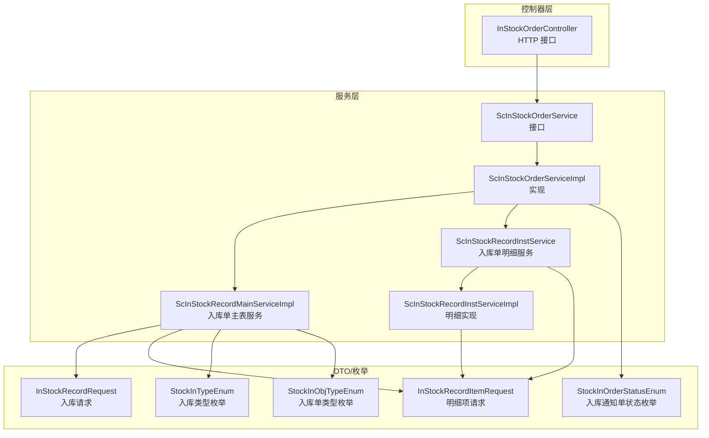
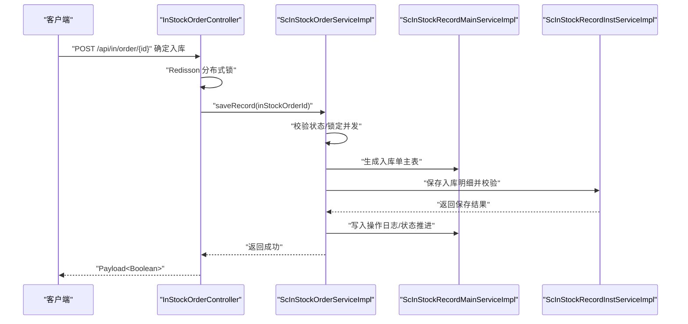
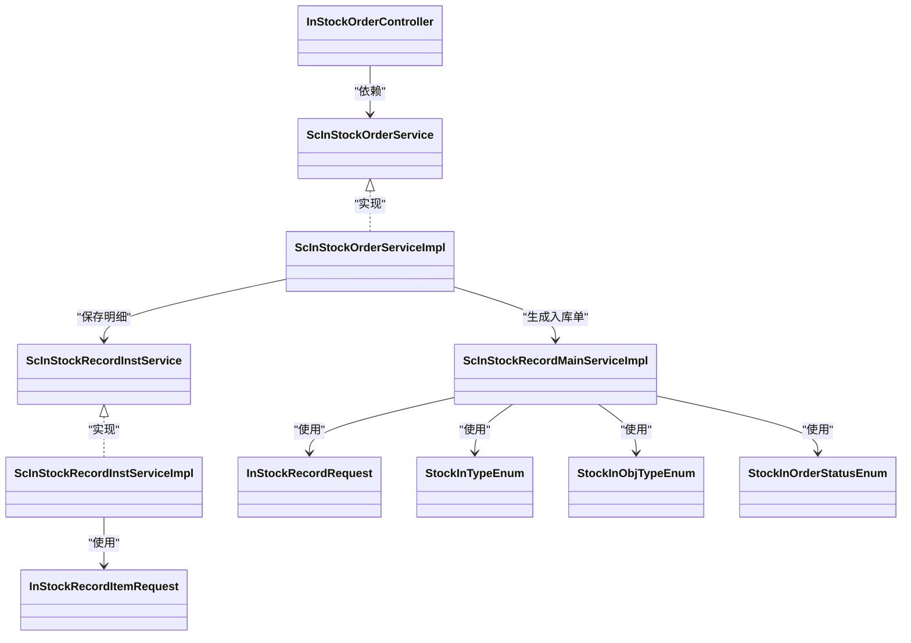

# 入库业务流程

<cite>
**本文引用的文件**
- [InStockOrderController.java](file://guoke-deepexi-storage-center-provider/src/main/java/com/deepexi/storage/controller/web/InStockOrderController.java)
- [ScInStockOrderService.java](file://guoke-deepexi-storage-center-provider/src/main/java/com/deepexi/storage/service/ScInStockOrderService.java)
- [ScInStockOrderServiceImpl.java](file://guoke-deepexi-storage-center-provider/src/main/java/com/deepexi/storage/service/impl/ScInStockOrderServiceImpl.java)
- [ScInStockRecordMainServiceImpl.java](file://guoke-deepexi-storage-center-provider/src/main/java/com/deepexi/storage/service/impl/ScInStockRecordMainServiceImpl.java)
- [ScInStockRecordInstService.java](file://guoke-deepexi-storage-center-provider/src/main/java/com/deepexi/storage/service/ScInStockRecordInstService.java)
- [ScInStockRecordInstServiceImpl.java](file://guoke-deepexi-storage-center-provider/src/main/java/com/deepexi/storage/service/impl/ScInStockRecordInstServiceImpl.java)
- [InStockRecordRequest.java](file://guoke-deepexi-storage-center-api/src/main/java/com/deepexi/api/storage/dto/in/InStockRecordRequest.java)
- [InStockRecordItemRequest.java](file://guoke-deepexi/storage-center-api/src/main/java/com/deepexi/api/storage/dto/in/InStockRecordItemRequest.java)
- [StockInTypeEnum.java](file://guoke-deepexi-storage-center-api/src/main/java/com/deepexi/api/storage/enums/in/StockInTypeEnum.java)
- [StockInObjTypeEnum.java](file://guoke-deepexi-storage-center-api/src/main/java/com/deepexi/api/storage/enums/in/StockInObjTypeEnum.java)
- [StockInOrderStatusEnum.java](file://guoke-deepexi-storage-center-api/src/main/java/com/deepexi/api/storage/enums/in/StockInOrderStatusEnum.java)
</cite>

## 目录
1. [引言](#引言)
2. [项目结构](#项目结构)
3. [核心组件](#核心组件)
4. [架构总览](#架构总览)
5. [详细组件分析](#详细组件分析)
6. [依赖分析](#依赖分析)
7. [性能考虑](#性能考虑)
8. [故障排查指南](#故障排查指南)
9. [结论](#结论)
10. [附录](#附录)

## 引言
本文件面向国科恒泰仓储管理系统“入库业务流程”的完整说明，覆盖采购入库、退货入库、调拨入库、其他入库等多场景，结合 InStockOrderController、ScInStockOrderService、ScInStockRecordMainServiceImpl、ScInStockRecordInstServiceImpl 等核心组件，系统化阐述接口定义、调用关系、数据模型、参数与返回值、与库存与订单管理的联动，以及常见问题与解决方案。文档兼顾初学者易读性与资深开发者所需的技术深度。

## 项目结构
围绕入库业务的关键模块与职责如下：
- 控制器层：对外暴露 HTTP 接口，负责鉴权、参数校验、并发控制与结果封装
- 服务层：编排业务流程，协调订单、库存、产品、仓库等子系统
- DTO/枚举层：定义入库请求、响应、类型枚举与状态枚举
- 实体与映射：持久化模型与 Mapper 层（由服务实现类直接使用）

图示来源
- [InStockOrderController.java:1-132](file://guoke-deepexi-storage-center-provider/src/main/java/com/deepexi/storage/controller/web/InStockOrderController.java#L1-L132)
- [ScInStockOrderService.java:1-423](file://guoke-deepexi-storage-center-provider/src/main/java/com/deepexi/storage/service/ScInStockOrderService.java#L1-L423)
- [ScInStockOrderServiceImpl.java:1-200](file://guoke-deepexi-storage-center-provider/src/main/java/com/deepexi/storage/service/impl/ScInStockOrderServiceImpl.java#L1-L200)
- [ScInStockRecordMainServiceImpl.java:1-800](file://guoke-deepexi-storage-center-provider/src/main/java/com/deepexi/storage/service/impl/ScInStockRecordMainServiceImpl.java#L1-L800)
- [ScInStockRecordInstService.java:1-106](file://guoke-deepexi-storage-center-provider/src/main/java/com/deepexi/storage/service/ScInStockRecordInstService.java#L1-L106)
- [ScInStockRecordInstServiceImpl.java:1-200](file://guoke-deepexi-storage-center-provider/src/main/java/com/deepexi/storage/service/impl/ScInStockRecordInstServiceImpl.java#L1-L200)
- [InStockRecordRequest.java:1-31](file://guoke-deepexi-storage-center-api/src/main/java/com/deepexi/api/storage/dto/in/InStockRecordRequest.java#L1-L31)
- [InStockRecordItemRequest.java:1-110](file://guoke-deepexi-storage-center-api/src/main/java/com/deepexi/api/storage/dto/in/InStockRecordItemRequest.java#L1-L110)
- [StockInTypeEnum.java:1-54](file://guoke-deepexi-storage-center-api/src/main/java/com/deepexi/api/storage/enums/in/StockInTypeEnum.java#L1-L54)
- [StockInObjTypeEnum.java:1-238](file://guoke-deepexi-storage-center-api/src/main/java/com/deepexi/api/storage/enums/in/StockInObjTypeEnum.java#L1-L238)
- [StockInOrderStatusEnum.java:1-41](file://guoke-deepexi-storage-center-api/src/main/java/com/deepexi/api/storage/enums/in/StockInOrderStatusEnum.java#L1-L41)

章节来源
- [InStockOrderController.java:1-132](file://guoke-deepexi-storage-center-provider/src/main/java/com/deepexi/storage/controller/web/InStockOrderController.java#L1-L132)
- [ScInStockOrderService.java:1-423](file://guoke-deepexi-storage-center-provider/src/main/java/com/deepexi/storage/service/ScInStockOrderService.java#L1-L423)
- [ScInStockOrderServiceImpl.java:1-200](file://guoke-deepexi-storage-center-provider/src/main/java/com/deepexi/storage/service/impl/ScInStockOrderServiceImpl.java#L1-L200)
- [ScInStockRecordMainServiceImpl.java:1-800](file://guoke-deepexi-storage-center-provider/src/main/java/com/deepexi/storage/service/impl/ScInStockRecordMainServiceImpl.java#L1-L800)
- [ScInStockRecordInstService.java:1-106](file://guoke-deepexi-storage-center-provider/src/main/java/com/deepexi/storage/service/ScInStockRecordInstService.java#L1-L106)
- [ScInStockRecordInstServiceImpl.java:1-200](file://guoke-deepexi-storage-center-provider/src/main/java/com/deepexi/storage/service/impl/ScInStockRecordInstServiceImpl.java#L1-L200)
- [InStockRecordRequest.java:1-31](file://guoke-deepexi-storage-center-api/src/main/java/com/deepexi/api/storage/dto/in/InStockRecordRequest.java#L1-L31)
- [InStockRecordItemRequest.java:1-110](file://guoke-deepexi-storage-center-api/src/main/java/com/deepexi/api/storage/dto/in/InStockRecordItemRequest.java#L1-L110)
- [StockInTypeEnum.java:1-54](file://guoke-deepexi-storage-center-api/src/main/java/com/deepexi/api/storage/enums/in/StockInTypeEnum.java#L1-L54)
- [StockInObjTypeEnum.java:1-238](file://guoke-deepexi-storage-center-api/src/main/java/com/deepexi/api/storage/enums/in/StockInObjTypeEnum.java#L1-L238)
- [StockInOrderStatusEnum.java:1-41](file://guoke-deepexi-storage-center-api/src/main/java/com/deepexi/api/storage/enums/in/StockInOrderStatusEnum.java#L1-L41)

## 核心组件
- InStockOrderController：提供入库通知单查询、验收、复检、确定入库等接口；使用 Redisson 实现分布式锁，避免并发重复入库
- ScInStockOrderService/Impl：编排入库通知单生命周期，包括生成入库单、状态推进、与订单/库存对接
- ScInStockRecordMainServiceImpl：负责入库单主表与明细的查询、导出、统计、重新入库等
- ScInStockRecordInstService/Impl：负责入库明细的保存、校验、数量控制、UDI/序列号/批号一致性校验

章节来源
- [InStockOrderController.java:1-132](file://guoke-deepexi-storage-center-provider/src/main/java/com/deepexi/storage/controller/web/InStockOrderController.java#L1-L132)
- [ScInStockOrderService.java:1-423](file://guoke-deepexi-storage-center-provider/src/main/java/com/deepexi/storage/service/ScInStockOrderService.java#L1-L423)
- [ScInStockOrderServiceImpl.java:1-200](file://guoke-deepexi-storage-center-provider/src/main/java/com/deepexi/storage/service/impl/ScInStockOrderServiceImpl.java#L1-L200)
- [ScInStockRecordMainServiceImpl.java:1-800](file://guoke-deepexi-storage-center-provider/src/main/java/com/deepexi/storage/service/impl/ScInStockRecordMainServiceImpl.java#L1-L800)
- [ScInStockRecordInstService.java:1-106](file://guoke-deepexi-storage-center-provider/src/main/java/com/deepexi/storage/service/ScInStockRecordInstService.java#L1-L106)
- [ScInStockRecordInstServiceImpl.java:1-200](file://guoke-deepexi-storage-center-provider/src/main/java/com/deepexi/storage/service/impl/ScInStockRecordInstServiceImpl.java#L1-L200)

## 架构总览
入库业务从“通知单”到“入库单”的流转路径如下：

图示来源
- [InStockOrderController.java:70-93](file://guoke-deepexi-storage-center-provider/src/main/java/com/deepexi/storage/controller/web/InStockOrderController.java#L70-L93)
- [ScInStockOrderServiceImpl.java:1-200](file://guoke-deepexi-storage-center-provider/src/main/java/com/deepexi/storage/service/impl/ScInStockOrderServiceImpl.java#L1-L200)
- [ScInStockRecordMainServiceImpl.java:124-156](file://guoke-deepexi-storage-center-provider/src/main/java/com/deepexi/storage/service/impl/ScInStockRecordMainServiceImpl.java#L124-L156)
- [ScInStockRecordInstServiceImpl.java:97-134](file://guoke-deepexi-storage-center-provider/src/main/java/com/deepexi/storage/service/impl/ScInStockRecordInstServiceImpl.java#L97-L134)

## 详细组件分析

### 1) 采购入库（Wholesale/Consignment/Borrowing）
- 入库类型：StockInTypeEnum.PURCHASE（采购入库）
- 入库单类型：StockInObjTypeEnum.WHOLESALE_IN、CONSIGNMENT_IN、BORROWING_IN 等
- 关键流程
  - 通知单状态：通常为“待入库”
  - 确定入库：调用控制器接口触发 saveRecord，服务层生成入库单并推进状态
  - 明细校验：按通知单发货数、质检异常数、拒收数、关单数进行累计校验，确保不超过可入库上限
  - 货位校验：非“其他入库/导入/冲红入库/T3入库”且非“1+2模式”时，必须选择到货位
- 参数与返回
  - 入库请求：InStockRecordRequest（包含入库通知单ID与明细项列表）
  - 明细项：InStockRecordItemRequest（仓库/货架/货位、批号/有效期/UDI/序列号、数量等）
  - 返回：Boolean 成功/失败
- 与库存/订单关系
  - 依据通知单生成入库单，更新通知单状态
  - 写入库存流水与可用量，触发后续对账与结算

章节来源
- [StockInTypeEnum.java:18-25](file://guoke-deepexi-storage-center-api/src/main/java/com/deepexi/api/storage/enums/in/StockInTypeEnum.java#L18-L25)
- [StockInObjTypeEnum.java:18-44](file://guoke-deepexi-storage-center-api/src/main/java/com/deepexi/api/storage/enums/in/StockInObjTypeEnum.java#L18-L44)
- [InStockRecordRequest.java:1-31](file://guoke-deepexi-storage-center-api/src/main/java/com/deepexi/api/storage/dto/in/InStockRecordRequest.java#L1-L31)
- [InStockRecordItemRequest.java:1-110](file://guoke-deepexi-storage-center-api/src/main/java/com/deepexi/api/storage/dto/in/InStockRecordItemRequest.java#L1-L110)
- [ScInStockOrderServiceImpl.java:1-200](file://guoke-deepexi-storage-center-provider/src/main/java/com/deepexi/storage/service/impl/ScInStockOrderServiceImpl.java#L1-L200)
- [ScInStockRecordInstServiceImpl.java:155-200](file://guoke-deepexi-storage-center-provider/src/main/java/com/deepexi/storage/service/impl/ScInStockRecordInstServiceImpl.java#L155-L200)

### 2) 退货入库（Sales Return/Consignment Return/Borrowing Return）
- 入库类型：StockInTypeEnum.SALES_RETURN 等
- 入库单类型：StockInObjTypeEnum.SALES_RETURN、CONSIGNMENT_RETURN、BORROWING_RETURN 等
- 关键流程
  - 退货单完成后，系统可自动/手动创建“已完成”的退货入库通知单
  - 入库时同样进行数量校验与货位校验
  - 支持“退货拒收”或“还回拒收”类型的自动入库单生成
- 参数与返回
  - 同明细项请求，返回 Boolean
- 与库存/订单关系
  - 关联上游退货/还回单号，推进通知单状态并写入库存

章节来源
- [StockInObjTypeEnum.java:26-44](file://guoke-deepexi-storage-center-api/src/main/java/com/deepexi/api/storage/enums/in/StockInObjTypeEnum.java#L26-L44)
- [ScInStockOrderServiceImpl.java:380-386](file://guoke-deepexi-storage-center-provider/src/main/java/com/deepexi/storage/service/impl/ScInStockOrderServiceImpl.java#L380-L386)

### 3) 调拨入库（Allocation In）
- 入库类型：StockInObjTypeEnum.ALLOCATION_IN
- 关键流程
  - 发货方字段作为来源公司展示，便于溯源
  - 入库时仍遵循数量与货位校验规则
- 参数与返回
  - 同明细项请求，返回 Boolean
- 与库存/订单关系
  - 关联调拨出库单，推进状态并写入库存

章节来源
- [StockInObjTypeEnum.java:40](file://guoke-deepexi-storage-center-api/src/main/java/com/deepexi/api/storage/enums/in/StockInObjTypeEnum.java#L40)
- [ScInStockRecordMainServiceImpl.java:512-519](file://guoke-deepexi-storage-center-provider/src/main/java/com/deepexi/storage/service/impl/ScInStockRecordMainServiceImpl.java#L512-L519)

### 4) 其他入库（Profit/Period/Import/Change/Compensation 等）
- 入库类型：StockInObjTypeEnum.PROFIT_IN、PERIOD_IN、IMPORT_IN、CHANGE_IN、COMPENSATION_IN 等
- 关键流程
  - 入库单类型归类于“其他入库”，通常允许更灵活的货位选择策略
  - 仍需满足数量与货位校验
- 参数与返回
  - 同明细项请求，返回 Boolean
- 与库存/订单关系
  - 自动/手工创建，推进状态并写入库存

章节来源
- [StockInObjTypeEnum.java:71-80](file://guoke-deepexi-storage-center-api/src/main/java/com/deepexi/api/storage/enums/in/StockInObjTypeEnum.java#L71-L80)
- [ScInStockRecordInstServiceImpl.java:159-166](file://guoke-deepexi-storage-center-provider/src/main/java/com/deepexi/storage/service/impl/ScInStockRecordInstServiceImpl.java#L159-L166)

### 5) 冲红入库（Red Entry）
- 入库类型：StockInTypeEnum.RED_ENTRY
- 入库单类型：StockInObjTypeEnum.RED_ENTRY_IN
- 关键流程
  - 与 T3 入库或特定业务场景配合，仅在特定条件下允许选择货位
- 参数与返回
  - 同明细项请求，返回 Boolean

章节来源
- [StockInTypeEnum.java:24](file://guoke-deepexi-storage-center-api/src/main/java/com/deepexi/api/storage/enums/in/StockInTypeEnum.java#L24)
- [StockInObjTypeEnum.java:43](file://guoke-deepexi-storage-center-api/src/main/java/com/deepexi/api/storage/enums/in/StockInObjTypeEnum.java#L43)
- [ScInStockRecordInstServiceImpl.java:161-166](file://guoke-deepexi-storage-center-provider/src/main/java/com/deepexi/storage/service/impl/ScInStockRecordInstServiceImpl.java#L161-L166)

### 6) T3 入库
- 入库类型：StockInTypeEnum.T3_IN
- 关键流程
  - 特殊业务场景下允许跳过部分货位校验
- 参数与返回
  - 同明细项请求，返回 Boolean

章节来源
- [StockInTypeEnum.java:24](file://guoke-deepexi-storage-center-api/src/main/java/com/deepexi/api/storage/enums/in/StockInTypeEnum.java#L24)
- [ScInStockRecordInstServiceImpl.java:162-166](file://guoke-deepexi-storage-center-provider/src/main/java/com/deepexi/storage/service/impl/ScInStockRecordInstServiceImpl.java#L162-L166)

### 7) 1+2 模式入库
- 入库类型：StockInTypeEnum.ONE_PLUS_TWO_IN
- 关键流程
  - 该模式绕过部分明细校验，直接按通知单生成入库单
- 参数与返回
  - 同明细项请求，返回 Boolean

章节来源
- [StockInTypeEnum.java:23](file://guoke-deepexi-storage-center-api/src/main/java/com/deepexi/api/storage/enums/in/StockInTypeEnum.java#L23)
- [ScInStockRecordInstServiceImpl.java:114-134](file://guoke-deepexi-storage-center-provider/src/main/java/com/deepexi/storage/service/impl/ScInStockRecordInstServiceImpl.java#L114-L134)

### 8) 拒收入库（退货拒收/还回拒收）
- 入库类型：StockInObjTypeEnum.RETURN_REJECT_IN、BACK_REJECT_IN
- 关键流程
  - 在退货单完成后，系统自动创建“已完成”的拒收入库通知单
- 参数与返回
  - 同明细项请求，返回 Boolean

章节来源
- [StockInObjTypeEnum.java:44-45](file://guoke-deepexi-storage-center-api/src/main/java/com/deepexi/api/storage/enums/in/StockInObjTypeEnum.java#L44-L45)
- [ScInStockOrderServiceImpl.java:380-386](file://guoke-deepexi-storage-center-provider/src/main/java/com/deepexi/storage/service/impl/ScInStockOrderServiceImpl.java#L380-L386)

### 9) 入库单查询与导出
- 查询接口
  - 控制器提供按通知单 ID 查询详情、按订单号查询入库单等接口
- 导出接口
  - 支持导出入库单明细，补充产品信息、仓库/货架/货位、验收时间等
- 参数与返回
  - 查询：分页 VO 列表
  - 导出：导出响应列表

章节来源
- [InStockOrderController.java:40-117](file://guoke-deepexi-storage-center-provider/src/main/java/com/deepexi/storage/controller/web/InStockOrderController.java#L40-L117)
- [ScInStockRecordMainServiceImpl.java:405-446](file://guoke-deepexi-storage-center-provider/src/main/java/com/deepexi/storage/service/impl/ScInStockRecordMainServiceImpl.java#L405-L446)
- [ScInStockRecordMainServiceImpl.java:448-522](file://guoke-deepexi-storage-center-provider/src/main/java/com/deepexi/storage/service/impl/ScInStockRecordMainServiceImpl.java#L448-L522)

### 10) 验收与复检
- 验收接口
  - 控制器提供“入库通知单验收/复检”接口，调用服务层推进状态
- 参数与返回
  - 请求：CheckRequest
  - 返回：Boolean

章节来源
- [InStockOrderController.java:119-129](file://guoke-deepexi-storage-center-provider/src/main/java/com/deepexi/storage/controller/web/InStockOrderController.java#L119-L129)
- [ScInStockOrderService.java:243-256](file://guoke-deepexi-storage-center-provider/src/main/java/com/deepexi/storage/service/ScInStockOrderService.java#L243-L256)

### 11) 重新入库（驳回后）
- 场景
  - 当入库单被驳回且无待审入库单时，支持“重新入库”
- 流程
  - 清理未入库明细，重新组装入库请求并调用明细保存
- 参数与返回
  - 入参：入库单主表 ID
  - 返回：Boolean

章节来源
- [ScInStockRecordMainServiceImpl.java:627-679](file://guoke-deepexi-storage-center-provider/src/main/java/com/deepexi/storage/service/impl/ScInStockRecordMainServiceImpl.java#L627-L679)

## 依赖分析
- 控制器依赖服务接口，服务实现依赖 Mapper/Manager/Feign 等组件
- 入库明细保存依赖产品中心、仓库/货架/货位、库存服务、UDI/序列号/批号一致性校验
- 入库单主表依赖导出、查询、统计、对账等能力

图示来源
- [InStockOrderController.java:1-132](file://guoke-deepexi-storage-center-provider/src/main/java/com/deepexi/storage/controller/web/InStockOrderController.java#L1-L132)
- [ScInStockOrderService.java:1-423](file://guoke-deepexi-storage-center-provider/src/main/java/com/deepexi/storage/service/ScInStockOrderService.java#L1-L423)
- [ScInStockOrderServiceImpl.java:1-200](file://guoke-deepexi-storage-center-provider/src/main/java/com/deepexi/storage/service/impl/ScInStockOrderServiceImpl.java#L1-L200)
- [ScInStockRecordMainServiceImpl.java:1-800](file://guoke-deepexi-storage-center-provider/src/main/java/com/deepexi/storage/service/impl/ScInStockRecordMainServiceImpl.java#L1-L800)
- [ScInStockRecordInstService.java:1-106](file://guoke-deepexi-storage-center-provider/src/main/java/com/deepexi/storage/service/ScInStockRecordInstService.java#L1-L106)
- [ScInStockRecordInstServiceImpl.java:1-200](file://guoke-deepexi-storage-center-provider/src/main/java/com/deepexi/storage/service/impl/ScInStockRecordInstServiceImpl.java#L1-L200)
- [InStockRecordRequest.java:1-31](file://guoke-deepexi-storage-center-api/src/main/java/com/deepexi/api/storage/dto/in/InStockRecordRequest.java#L1-L31)
- [InStockRecordItemRequest.java:1-110](file://guoke-deepexi-storage-center-api/src/main/java/com/deepexi/api/storage/dto/in/InStockRecordItemRequest.java#L1-L110)
- [StockInTypeEnum.java:1-54](file://guoke-deepexi-storage-center-api/src/main/java/com/deepexi/api/storage/enums/in/StockInTypeEnum.java#L1-L54)
- [StockInObjTypeEnum.java:1-238](file://guoke-deepexi-storage-center-api/src/main/java/com/deepexi/api/storage/enums/in/StockInObjTypeEnum.java#L1-L238)
- [StockInOrderStatusEnum.java:1-41](file://guoke-deepexi-storage-center-api/src/main/java/com/deepexi/api/storage/enums/in/StockInOrderStatusEnum.java#L1-L41)

## 性能考虑
- 并发控制：控制器使用 Redisson 分布式锁，避免同一通知单并发重复入库
- 分页查询：导出与列表查询使用分页组件，降低内存压力
- 批量操作：明细保存时按仓库分组，减少重复查询与校验成本
- 缓存与映射：产品、公司、仓库/货架/货位信息通过 Map 预加载，减少多次查询

章节来源
- [InStockOrderController.java:76-92](file://guoke-deepexi-storage-center-provider/src/main/java/com/deepexi/storage/controller/web/InStockOrderController.java#L76-L92)
- [ScInStockRecordMainServiceImpl.java:405-446](file://guoke-deepexi-storage-center-provider/src/main/java/com/deepexi/storage/service/impl/ScInStockRecordMainServiceImpl.java#L405-L446)
- [ScInStockRecordInstServiceImpl.java:155-156](file://guoke-deepexi-storage-center-provider/src/main/java/com/deepexi/storage/service/impl/ScInStockRecordInstServiceImpl.java#L155-L156)

## 故障排查指南
- 并发冲突
  - 现象：提示“当前公司数据正在处理请稍后提交”
  - 处理：等待锁释放或检查上游是否仍在处理
- 数量超限
  - 现象：提示“扫描入库产品数量，超过了该产品可入库的数量”
  - 处理：确认发货数、质检异常数、拒收数、关单数合计是否正确
- 货位缺失
  - 现象：提示“请选择至货位”
  - 处理：确认入库单类型与业务场景，确保选择到货位
- UDI/序列号/批号不一致
  - 现象：校验失败
  - 处理：核对通知单与扫码信息，确保三者一致
- 驳回后无法重新入库
  - 现象：提示“当前已存在待审核的入库单”
  - 处理：清理待审单据后再执行“重新入库”

章节来源
- [InStockOrderController.java:89-92](file://guoke-deepexi-storage-center-provider/src/main/java/com/deepexi/storage/controller/web/InStockOrderController.java#L89-L92)
- [ScInStockRecordInstServiceImpl.java:186-188](file://guoke-deepexi-storage-center-provider/src/main/java/com/deepexi/storage/service/impl/ScInStockRecordInstServiceImpl.java#L186-L188)
- [ScInStockRecordInstServiceImpl.java:163-166](file://guoke-deepexi-storage-center-provider/src/main/java/com/deepexi/storage/service/impl/ScInStockRecordInstServiceImpl.java#L163-L166)
- [ScInStockRecordInstServiceImpl.java:120-127](file://guoke-deepexi-storage-center-provider/src/main/java/com/deepexi/storage/service/impl/ScInStockRecordInstServiceImpl.java#L120-L127)
- [ScInStockRecordMainServiceImpl.java:635-642](file://guoke-deepexi-storage-center-provider/src/main/java/com/deepexi/storage/service/impl/ScInStockRecordMainServiceImpl.java#L635-L642)

## 结论
本入库流程以“通知单—入库单”为主线，通过严格的数量与货位校验、分布式锁保障并发安全，并与产品、仓库、库存、订单等模块紧密协作。不同入库类型通过枚举区分，服务层统一编排，控制器提供清晰的 HTTP 接口。建议在接入时重点关注通知单状态、明细校验与并发控制，以确保入库流程稳定可靠。

## 附录

### A. 入库接口一览（控制器）
- GET /api/in/order/{id}：按通知单 ID 查询详情（带分页）
- GET /api/in/order/detail/{id}：按通知单 ID 查询详情（分页）
- POST /api/in/order/{id}：确定入库（分布式锁保护）
- GET /api/in/order/list/orderCodeAndId：按订单号查询入库通知单
- GET /api/in/order/record/orderCodeAndId：按订单号查询入库单
- POST /api/in/order/check：入库通知单验收
- POST /api/in/order/check/review：入库通知单验收复检

章节来源
- [InStockOrderController.java:40-129](file://guoke-deepexi-storage-center-provider/src/main/java/com/deepexi/storage/controller/web/InStockOrderController.java#L40-L129)

### B. 入库请求与返回（DTO/枚举）
- 入库请求主体：InStockRecordRequest（包含通知单 ID 与明细项列表）
- 明细项：InStockRecordItemRequest（仓库/货架/货位、批号/有效期/UDI/序列号、数量等）
- 入库类型枚举：StockInTypeEnum（采购/销售退回/其他/冲红/样品/1+2/T3/拒收）
- 入库单类型枚举：StockInObjTypeEnum（批发/寄售/借货/调拨/换货/盘盈/期初/导入/补偿等）
- 通知单状态枚举：StockInOrderStatusEnum（待审核/待质检/待复检/待入库/待审核/已完成/已驳回）

章节来源
- [InStockRecordRequest.java:1-31](file://guoke-deepexi-storage-center-api/src/main/java/com/deepexi/api/storage/dto/in/InStockRecordRequest.java#L1-L31)
- [InStockRecordItemRequest.java:1-110](file://guoke-deepexi-storage-center-api/src/main/java/com/deepexi/api/storage/dto/in/InStockRecordItemRequest.java#L1-L110)
- [StockInTypeEnum.java:1-54](file://guoke-deepexi-storage-center-api/src/main/java/com/deepexi/api/storage/enums/in/StockInTypeEnum.java#L1-L54)
- [StockInObjTypeEnum.java:1-238](file://guoke-deepexi-storage-center-api/src/main/java/com/deepexi/api/storage/enums/in/StockInObjTypeEnum.java#L1-L238)
- [StockInOrderStatusEnum.java:1-41](file://guoke-deepexi-storage-center-api/src/main/java/com/deepexi/api/storage/enums/in/StockInOrderStatusEnum.java#L1-L41)