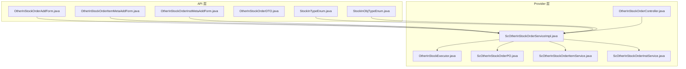
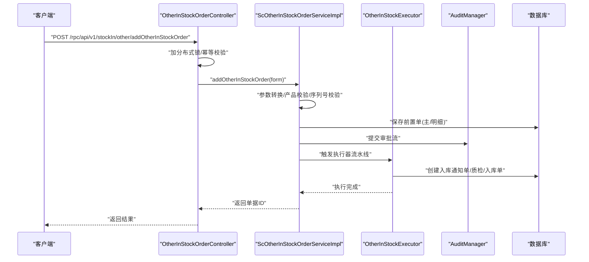
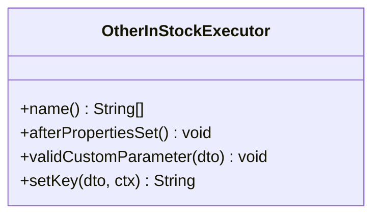
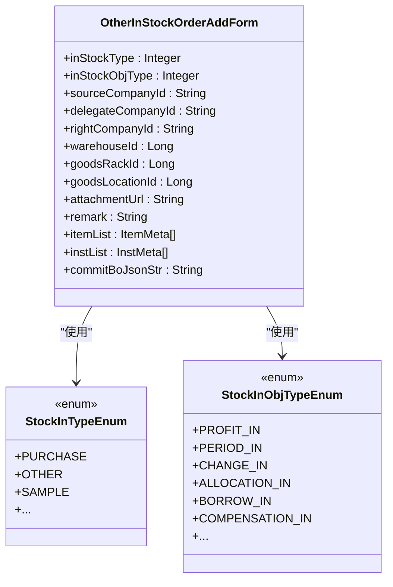
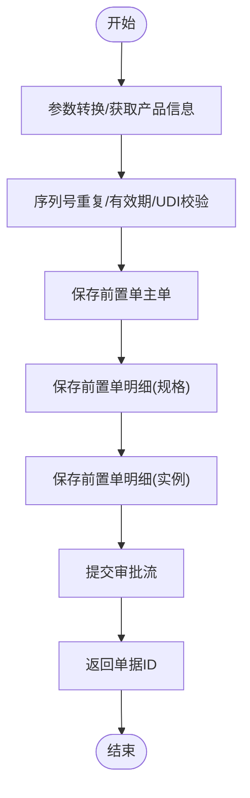
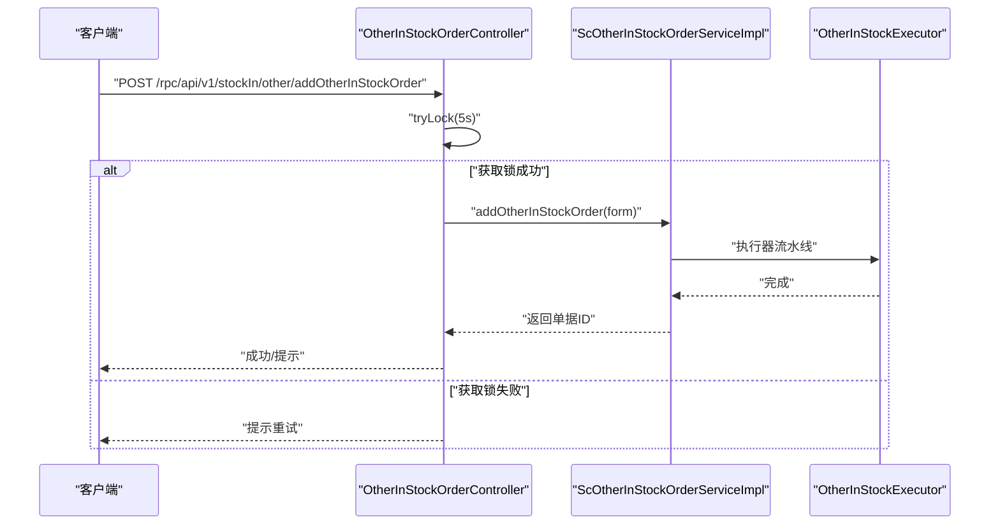
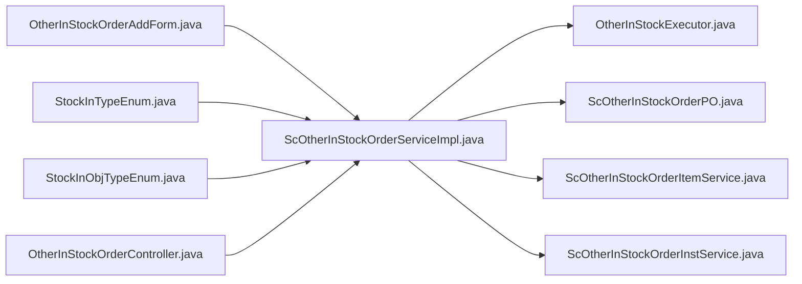

# 其他入库流程

<cite>
**本文引用的文件**
- [OtherInStockExecutor.java](file://guoke-deepexi-storage-center-provider/src/main/java/com/chenxudong/storage/handler/in/executor/OtherInStockExecutor.java)
- [OtherInStockOrderAddForm.java](file://guoke-deepexi-storage-center-api/src/main/java/com/deepexi/api/storage/dto/otherinstock/request/OtherInStockOrderAddForm.java)
- [OtherInStockOrderItemMetaAddForm.java](file://guoke-deepexi-storage-center-api/src/main/java/com/deepexi/api/storage/dto/otherinstock/request/OtherInStockOrderItemMetaAddForm.java)
- [OtherInStockOrderInstMetaAddForm.java](file://guoke-deepexi-storage-center-api/src/main/java/com/deepexi/api/storage/dto/otherinstock/request/OtherInStockOrderInstMetaAddForm.java)
- [OtherInStockOrderDTO.java](file://guoke-deepexi-storage-center-api/src/main/java/com/deepexi/api/storage/dto/otherinstock/response/OtherInStockOrderDTO.java)
- [StockInTypeEnum.java](file://guoke-deepexi-storage-center-api/src/main/java/com/deepexi/api/storage/enums/in/StockInTypeEnum.java)
- [StockInObjTypeEnum.java](file://guoke-deepexi-storage-center-api/src/main/java/com/deepexi/api/storage/enums/in/StockInObjTypeEnum.java)
- [OtherInStockOrderController.java](file://guoke-deepexi-storage-center-provider/src/main/java/com/deepexi/storage/controller/rpc/OtherInStockOrderController.java)
- [ScOtherInStockOrderServiceImpl.java](file://guoke-deepexi-storage-center-provider/src/main/java/com/deepexi/storage/service/impl/ScOtherInStockOrderServiceImpl.java)
- [ScOtherInStockOrderPO.java](file://guoke-deepexi-storage-center-provider/src/main/java/com/deepexi/storage/model/ScOtherInStockOrderPO.java)
- [ScOtherInStockOrderItemService.java](file://guoke-deepexi-storage-center-provider/src/main/java/com/deepexi/storage/service/ScOtherInStockOrderItemService.java)
- [ScOtherInStockOrderInstService.java](file://guoke-deepexi-storage-center-provider/src/main/java/com/deepexi/storage/service/ScOtherInStockOrderInstService.java)
</cite>

## 目录
1. [简介](#简介)
2. [项目结构](#项目结构)
3. [核心组件](#核心组件)
4. [架构总览](#架构总览)
5. [详细组件分析](#详细组件分析)
6. [依赖分析](#依赖分析)
7. [性能考虑](#性能考虑)
8. [故障排查指南](#故障排查指南)
9. [结论](#结论)
10. [附录](#附录)

## 简介
本文件面向“其他入库”流程，系统性梳理除采购、退货、调拨之外的多种入库场景（如盘盈入库、期初入库、样品入库、赠品入库、换货入库、赔付入库等），并重点说明 OtherInStockExecutor 执行器如何统一承接这些非标准入库流程；同时给出各类型业务规则、审批流程、账务处理要点、与库存调整/样品管理/促销活动等模块的集成关系，并提供完整 API 接口说明与典型业务示例路径，帮助开发者快速理解与扩展。

## 项目结构
围绕“其他入库”的关键代码分布在以下层次：
- API 层：定义请求/响应 DTO 与枚举，明确业务类型与字段约束
- Provider 层：控制器、服务实现、模型与执行器，承载业务编排与流程控制
- Mapper/Model：持久化映射与实体定义
- 枚举：统一管理入库类型与对象类型

图表来源
- [OtherInStockOrderAddForm.java:1-71](file://guoke-deepexi-storage-center-api/src/main/java/com/deepexi/api/storage/dto/otherinstock/request/OtherInStockOrderAddForm.java#L1-L71)
- [OtherInStockOrderItemMetaAddForm.java:1-34](file://guoke-deepexi-storage-center-api/src/main/java/com/deepexi/api/storage/dto/otherinstock/request/OtherInStockOrderItemMetaAddForm.java#L1-L34)
- [OtherInStockOrderInstMetaAddForm.java:1-75](file://guoke-deepexi-storage-center-api/src/main/java/com/deepexi/api/storage/dto/otherinstock/request/OtherInStockOrderInstMetaAddForm.java#L1-L75)
- [OtherInStockOrderDTO.java:1-66](file://guoke-deepexi-storage-center-api/src/main/java/com/deepexi/api/storage/dto/otherinstock/response/OtherInStockOrderDTO.java#L1-L66)
- [StockInTypeEnum.java:1-54](file://guoke-deepexi-storage-center-api/src/main/java/com/deepexi/api/storage/enums/in/StockInTypeEnum.java#L1-L54)
- [StockInObjTypeEnum.java:1-238](file://guoke-deepexi-storage-center-api/src/main/java/com/deepexi/api/storage/enums/in/StockInObjTypeEnum.java#L1-L238)
- [OtherInStockOrderController.java:1-115](file://guoke-deepexi-storage-center-provider/src/main/java/com/deepexi/storage/controller/rpc/OtherInStockOrderController.java#L1-L115)
- [ScOtherInStockOrderServiceImpl.java:1-200](file://guoke-deepexi-storage-center-provider/src/main/java/com/deepexi/storage/service/impl/ScOtherInStockOrderServiceImpl.java#L1-L200)
- [OtherInStockExecutor.java:1-46](file://guoke-deepexi-storage-center-provider/src/main/java/com/chenxudong/storage/handler/in/executor/OtherInStockExecutor.java#L1-L46)
- [ScOtherInStockOrderPO.java:1-133](file://guoke-deepexi-storage-center-provider/src/main/java/com/deepexi/storage/model/ScOtherInStockOrderPO.java#L1-L133)
- [ScOtherInStockOrderItemService.java:1-15](file://guoke-deepexi-storage-center-provider/src/main/java/com/deepexi/storage/service/ScOtherInStockOrderItemService.java#L1-L15)
- [ScOtherInStockOrderInstService.java:1-19](file://guoke-deepexi-storage-center-provider/src/main/java/com/deepexi/storage/service/ScOtherInStockOrderInstService.java#L1-L19)

章节来源
- [OtherInStockOrderController.java:31-35](file://guoke-deepexi-storage-center-provider/src/main/java/com/deepexi/storage/controller/rpc/OtherInStockOrderController.java#L31-L35)
- [StockInTypeEnum.java:18-25](file://guoke-deepexi-storage-center-api/src/main/java/com/deepexi/api/storage/enums/in/StockInTypeEnum.java#L18-L25)
- [StockInObjTypeEnum.java:37-80](file://guoke-deepexi-storage-center-api/src/main/java/com/deepexi/api/storage/enums/in/StockInObjTypeEnum.java#L37-L80)

## 核心组件
- OtherInStockExecutor：继承通用入库执行器，定义“其他入库”的流水线步骤（加载配置、加载产品、创建入库通知单、质检、创建入库单）
- OtherInStockOrderController：对外暴露新建、详情、分页、期初入库导入解析等 RPC 接口
- ScOtherInStockOrderServiceImpl：核心业务编排，负责参数校验、单据落库、审批提交、后续执行器触发
- DTO/枚举：定义业务类型、对象类型、字段约束与默认值
- Model：持久化实体，承载单据主从明细与状态

章节来源
- [OtherInStockExecutor.java:16-44](file://guoke-deepexi-storage-center-provider/src/main/java/com/chenxudong/storage/handler/in/executor/OtherInStockExecutor.java#L16-L44)
- [OtherInStockOrderController.java:47-112](file://guoke-deepexi-storage-center-provider/src/main/java/com/deepexi/storage/controller/rpc/OtherInStockOrderController.java#L47-L112)
- [ScOtherInStockOrderServiceImpl.java:112-147](file://guoke-deepexi-storage-center-provider/src/main/java/com/deepexi/storage/service/impl/ScOtherInStockOrderServiceImpl.java#L112-L147)
- [OtherInStockOrderAddForm.java:18-70](file://guoke-deepexi-storage-center-api/src/main/java/com/deepexi/api/storage/dto/otherinstock/request/OtherInStockOrderAddForm.java#L18-L70)
- [StockInTypeEnum.java:18-25](file://guoke-deepexi-storage-center-api/src/main/java/com/deepexi/api/storage/enums/in/StockInTypeEnum.java#L18-L25)
- [StockInObjTypeEnum.java:37-80](file://guoke-deepexi-storage-center-api/src/main/java/com/deepexi/api/storage/enums/in/StockInObjTypeEnum.java#L37-L80)
- [ScOtherInStockOrderPO.java:22-131](file://guoke-deepexi-storage-center-provider/src/main/java/com/deepexi/storage/model/ScOtherInStockOrderPO.java#L22-L131)

## 架构总览
“其他入库”采用“前置单 + 执行器流水线”的架构模式：
- 控制器接收请求，进行幂等与锁保护
- 服务层完成参数转换、校验、落库与审批提交
- 执行器按固定顺序推进：加载配置 → 加载产品 → 创建入库通知单 → 质检 → 创建入库单
- 与库存、UDI、产品、仓库、审计等模块协作

图表来源
- [OtherInStockOrderController.java:47-73](file://guoke-deepexi-storage-center-provider/src/main/java/com/deepexi/storage/controller/rpc/OtherInStockOrderController.java#L47-L73)
- [ScOtherInStockOrderServiceImpl.java:112-147](file://guoke-deepexi-storage-center-provider/src/main/java/com/deepexi/storage/service/impl/ScOtherInStockOrderServiceImpl.java#L112-L147)
- [OtherInStockExecutor.java:34-44](file://guoke-deepexi-storage-center-provider/src/main/java/com/chenxudong/storage/handler/in/executor/OtherInStockExecutor.java#L34-L44)

## 详细组件分析

### OtherInStockExecutor 执行器
- 角色定位：统一处理“其他入库”类型的通知单到入库单的全流程
- 关键行为：
  - 自定义参数校验占位（可扩展）
  - 设置执行键（用于日志与追踪）
  - 注册流水线步骤：加载配置 → 加载产品 → 创建入库通知单 → 质检 → 创建入库单
- 适用范围：所有“其他入库”对象类型（盘盈、期初、换货、赔付、调拨、借货、赠品等）

图表来源
- [OtherInStockExecutor.java:16-44](file://guoke-deepexi-storage-center-provider/src/main/java/com/chenxudong/storage/handler/in/executor/OtherInStockExecutor.java#L16-L44)

章节来源
- [OtherInStockExecutor.java:18-44](file://guoke-deepexi-storage-center-provider/src/main/java/com/chenxudong/storage/handler/in/executor/OtherInStockExecutor.java#L18-L44)

### 请求 DTO 与业务类型
- OtherInStockOrderAddForm：定义“其他入库”的入参结构，包含入库类型、对象类型、公司信息、仓库货架货位、附件、备注、产品/实例明细、审批提交 BO 的 JSON 字符串
- StockInTypeEnum：定义入库类型，其中“其他入库”为 3
- StockInObjTypeEnum：定义入库对象类型，其中“盘盈入库”为 303，“期初入库”为 304；其他还包括换货、调拨、借货、赔付等

图表来源
- [OtherInStockOrderAddForm.java:18-70](file://guoke-deepexi-storage-center-api/src/main/java/com/deepexi/api/storage/dto/otherinstock/request/OtherInStockOrderAddForm.java#L18-L70)
- [StockInTypeEnum.java:18-25](file://guoke-deepexi-storage-center-api/src/main/java/com/deepexi/api/storage/enums/in/StockInTypeEnum.java#L18-L25)
- [StockInObjTypeEnum.java:37-80](file://guoke-deepexi-storage-center-api/src/main/java/com/deepexi/api/storage/enums/in/StockInObjTypeEnum.java#L37-L80)

章节来源
- [OtherInStockOrderAddForm.java:18-70](file://guoke-deepexi-storage-center-api/src/main/java/com/deepexi/api/storage/dto/otherinstock/request/OtherInStockOrderAddForm.java#L18-L70)
- [StockInTypeEnum.java:18-25](file://guoke-deepexi-storage-center-api/src/main/java/com/deepexi/api/storage/enums/in/StockInTypeEnum.java#L18-L25)
- [StockInObjTypeEnum.java:37-80](file://guoke-deepexi-storage-center-api/src/main/java/com/deepexi/api/storage/enums/in/StockInObjTypeEnum.java#L37-L80)

### 服务实现与审批集成
- ScOtherInStockOrderServiceImpl：
  - 参数转换与产品信息获取
  - 序列号重复校验、有效期校验、UDI/序列号一致性校验
  - 保存前置单（主单、明细）、设置业务类型（样品/普通）、状态、附件、备注等
  - 提交审批流（通过 ExamineRecordCommitBo）
  - 返回单据 ID
- 审批状态：默认待审（AWAIT），由外部审批系统驱动后续流程

图表来源
- [ScOtherInStockOrderServiceImpl.java:112-147](file://guoke-deepexi-storage-center-provider/src/main/java/com/deepexi/storage/service/impl/ScOtherInStockOrderServiceImpl.java#L112-L147)

章节来源
- [ScOtherInStockOrderServiceImpl.java:112-198](file://guoke-deepexi-storage-center-provider/src/main/java/com/deepexi/storage/service/impl/ScOtherInStockOrderServiceImpl.java#L112-L198)

### 控制器与 API 文档
- 新建其他入库单：幂等 + 分布式锁保护，返回“是否自动入库”的提示消息
- 查询详情、分页查询、期初入库导入解析

图表来源
- [OtherInStockOrderController.java:47-73](file://guoke-deepexi-storage-center-provider/src/main/java/com/deepexi/storage/controller/rpc/OtherInStockOrderController.java#L47-L73)
- [OtherInStockExecutor.java:34-44](file://guoke-deepexi-storage-center-provider/src/main/java/com/chenxudong/storage/handler/in/executor/OtherInStockExecutor.java#L34-L44)

章节来源
- [OtherInStockOrderController.java:47-112](file://guoke-deepexi-storage-center-provider/src/main/java/com/deepexi/storage/controller/rpc/OtherInStockOrderController.java#L47-L112)

### 数据模型与明细服务
- ScOtherInStockOrderPO：承载“其他入库”前置单的主单信息（类型、对象类型、公司、仓库、状态、附件、备注、业务类型等）
- 明细服务：
  - ScOtherInStockOrderItemService：规格级明细
  - ScOtherInStockOrderInstService：实例级明细（含批次、生产/失效期、UDI、序列号等）

章节来源
- [ScOtherInStockOrderPO.java:22-131](file://guoke-deepexi-storage-center-provider/src/main/java/com/deepexi/storage/model/ScOtherInStockOrderPO.java#L22-L131)
- [ScOtherInStockOrderItemService.java:12-14](file://guoke-deepexi-storage-center-provider/src/main/java/com/deepexi/storage/service/ScOtherInStockOrderItemService.java#L12-L14)
- [ScOtherInStockOrderInstService.java:14-18](file://guoke-deepexi-storage-center-provider/src/main/java/com/deepexi/storage/service/ScOtherInStockOrderInstService.java#L14-L18)

## 依赖分析
- 类型依赖：请求 DTO 使用入库类型与对象类型枚举，确保业务语义一致
- 执行器依赖：OtherInStockExecutor 继承通用执行器，复用流水线步骤
- 服务依赖：ScOtherInStockOrderServiceImpl 依赖产品、审计、仓库、UDI、库存等模块
- 控制器依赖：幂等与分布式锁，保障并发安全

图表来源
- [OtherInStockOrderAddForm.java:18-70](file://guoke-deepexi-storage-center-api/src/main/java/com/deepexi/api/storage/dto/otherinstock/request/OtherInStockOrderAddForm.java#L18-L70)
- [StockInTypeEnum.java:18-25](file://guoke-deepexi-storage-center-api/src/main/java/com/deepexi/api/storage/enums/in/StockInTypeEnum.java#L18-L25)
- [StockInObjTypeEnum.java:37-80](file://guoke-deepexi-storage-center-api/src/main/java/com/deepexi/api/storage/enums/in/StockInObjTypeEnum.java#L37-L80)
- [ScOtherInStockOrderServiceImpl.java:70-111](file://guoke-deepexi-storage-center-provider/src/main/java/com/deepexi/storage/service/impl/ScOtherInStockOrderServiceImpl.java#L70-L111)
- [OtherInStockExecutor.java:16-44](file://guoke-deepexi-storage-center-provider/src/main/java/com/chenxudong/storage/handler/in/executor/OtherInStockExecutor.java#L16-L44)
- [ScOtherInStockOrderPO.java:22-131](file://guoke-deepexi-storage-center-provider/src/main/java/com/deepexi/storage/model/ScOtherInStockOrderPO.java#L22-L131)
- [OtherInStockOrderController.java:47-73](file://guoke-deepexi-storage-center-provider/src/main/java/com/deepexi/storage/controller/rpc/OtherInStockOrderController.java#L47-L73)

章节来源
- [ScOtherInStockOrderServiceImpl.java:70-111](file://guoke-deepexi-storage-center-provider/src/main/java/com/deepexi/storage/service/impl/ScOtherInStockOrderServiceImpl.java#L70-L111)
- [OtherInStockExecutor.java:16-44](file://guoke-deepexi-storage-center-provider/src/main/java/com/chenxudong/storage/handler/in/executor/OtherInStockExecutor.java#L16-L44)

## 性能考虑
- 幂等与锁：控制器层使用分布式锁与幂等注解，避免并发重复提交
- 分页查询：分页接口返回 PageBean，建议前端合理设置页码与大小
- 批量校验：序列号与有效期在服务层集中校验，减少后续异常开销
- 执行器流水线：步骤顺序固定，便于缓存与日志追踪

[本节为通用指导，不直接分析具体文件]

## 故障排查指南
- 幂等锁冲突：若提示“当前公司正在处理入库业务，请勿重复提交或稍后再试”，检查锁持有情况与业务重试策略
- 审批提交失败：确认 commitBoJsonStr 是否正确、ExamineRecordCommitBo 结构是否匹配
- 序列号冲突：UDI/序列号重复会导致校验失败，需清理或修正
- 有效期错误：生效日期不得晚于失效日期，否则抛出参数异常
- 执行器未触发：确认执行器名称与引擎映射一致，且流水线已注册

章节来源
- [OtherInStockOrderController.java:52-71](file://guoke-deepexi-storage-center-provider/src/main/java/com/deepexi/storage/controller/rpc/OtherInStockOrderController.java#L52-L71)
- [ScOtherInStockOrderServiceImpl.java:121-134](file://guoke-deepexi-storage-center-provider/src/main/java/com/deepexi/storage/service/impl/ScOtherInStockOrderServiceImpl.java#L121-L134)

## 结论
“其他入库”通过统一的前置单与执行器流水线，实现了盘盈、期初、换货、赔付、调拨、借货、赠品等多种场景的一致化处理。配合严格的参数校验、审批集成与幂等保护，能够在保证准确性的同时提升扩展性。开发者可基于现有执行器与 DTO 枚举，快速新增业务类型并接入审批与账务流程。

[本节为总结性内容，不直接分析具体文件]

## 附录

### API 接口清单与说明
- 新建其他入库单
  - 方法：POST
  - 路径：/rpc/api/v1/stockIn/other/addOtherInStockOrder
  - 功能：创建其他入库单，支持盘盈/期初/换货/赔付/调拨/借货/赠品等类型
  - 幂等与锁：内置分布式锁与幂等注解
  - 返回：单据 ID；若未开启审核，系统将自动入库
- 查询其他入库单详情
  - 方法：POST
  - 路径：/rpc/api/v1/stockIn/other/getOtherInStockOrderDetail
  - 入参：otherInStockOrderId
  - 返回：单据详情（含主/明细、公司、仓库、状态、附件、备注等）
- 分页查询其他入库单
  - 方法：POST
  - 路径：/rpc/api/v1/stockIn/other/pageOtherInStockOrder
  - 入参：OtherInStockOrderPageRequest
  - 返回：PageBean<OtherInStockOrderPageResponse>
- 解析期初入库导入数据
  - 方法：POST
  - 路径：/rpc/api/v1/stockIn/other/parseEarlyInboundExcelData
  - 入参：EarlyInboundExcelDataParseRequest
  - 返回：EarlyInboundExcelDataParseResponse

章节来源
- [OtherInStockOrderController.java:47-112](file://guoke-deepexi-storage-center-provider/src/main/java/com/deepexi/storage/controller/rpc/OtherInStockOrderController.java#L47-L112)

### 典型业务场景与示例路径
- 盘盈入库
  - 入库类型：其他入库（3）
  - 对象类型：盘盈入库（303）
  - 示例路径：[OtherInStockOrderAddForm.java:32-36](file://guoke-deepexi-storage-center-api/src/main/java/com/deepexi/api/storage/dto/otherinstock/request/OtherInStockOrderAddForm.java#L32-L36)
- 期初入库
  - 入库类型：其他入库（3）
  - 对象类型：期初入库（304）
  - 示例路径：[OtherInStockOrderController.java:102-112](file://guoke-deepexi-storage-center-provider/src/main/java/com/deepexi/storage/controller/rpc/OtherInStockOrderController.java#L102-L112)
- 样品入库
  - 入库类型：样品入库（5）
  - 业务类型标记：busType=1
  - 示例路径：[ScOtherInStockOrderServiceImpl.java:170-172](file://guoke-deepexi-storage-center-provider/src/main/java/com/deepexi/storage/service/impl/ScOtherInStockOrderServiceImpl.java#L170-L172)
- 赠品入库
  - 入库类型：其他入库（3）
  - 对象类型：根据枚举扩展（例如换货/补偿等）
  - 示例路径：[StockInObjTypeEnum.java:72-80](file://guoke-deepexi-storage-center-api/src/main/java/com/deepexi/api/storage/enums/in/StockInObjTypeEnum.java#L72-L80)
- 换货入库
  - 对象类型：换货入库（3）
  - 示例路径：[StockInObjTypeEnum.java:37-43](file://guoke-deepexi-storage-center-api/src/main/java/com/deepexi/api/storage/enums/in/StockInObjTypeEnum.java#L37-L43)
- 赔付入库
  - 对象类型：赔付入库（308）
  - 示例路径：[StockInObjTypeEnum.java:42-43](file://guoke-deepexi-storage-center-api/src/main/java/com/deepexi/api/storage/enums/in/StockInObjTypeEnum.java#L42-L43)

### 与库存调整、样品管理、促销活动的集成关系
- 库存调整：执行器完成后创建入库单，库存按批次/序列号/有效期等维度入账
- 样品管理：当 inStockType 为样品入库时，前置单 busType 标记为 1，便于后续统计与归档
- 促销活动：可通过审批流与业务单据联动，但具体促销逻辑不在本模块内实现，需在上游或下游系统中扩展

章节来源
- [ScOtherInStockOrderServiceImpl.java:169-172](file://guoke-deepexi-storage-center-provider/src/main/java/com/deepexi/storage/service/impl/ScOtherInStockOrderServiceImpl.java#L169-L172)
- [OtherInStockExecutor.java:34-44](file://guoke-deepexi-storage-center-provider/src/main/java/com/chenxudong/storage/handler/in/executor/OtherInStockExecutor.java#L34-L44)