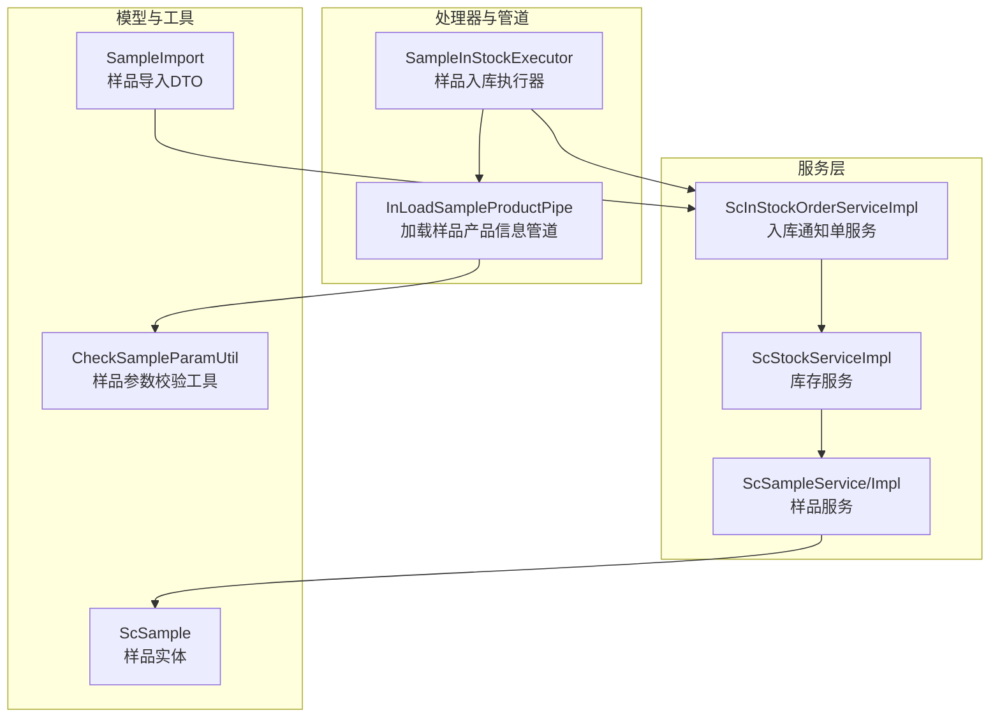
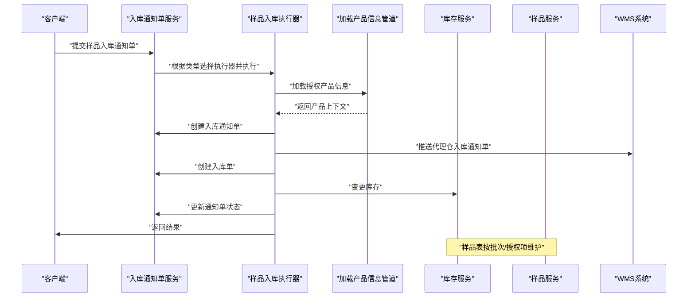
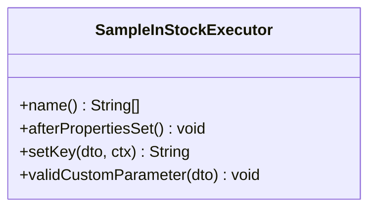
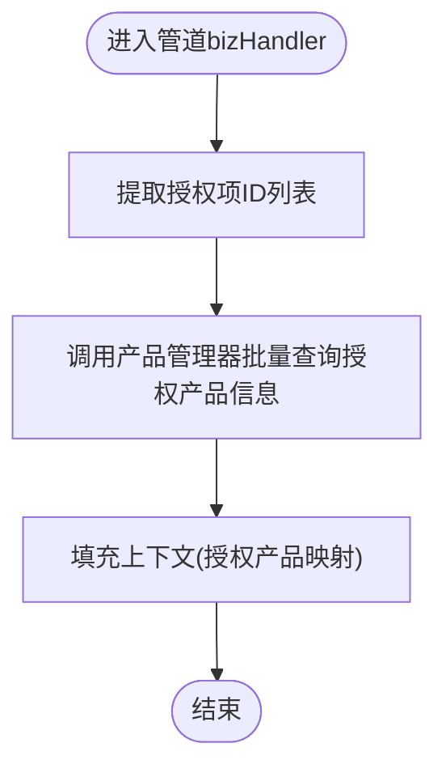
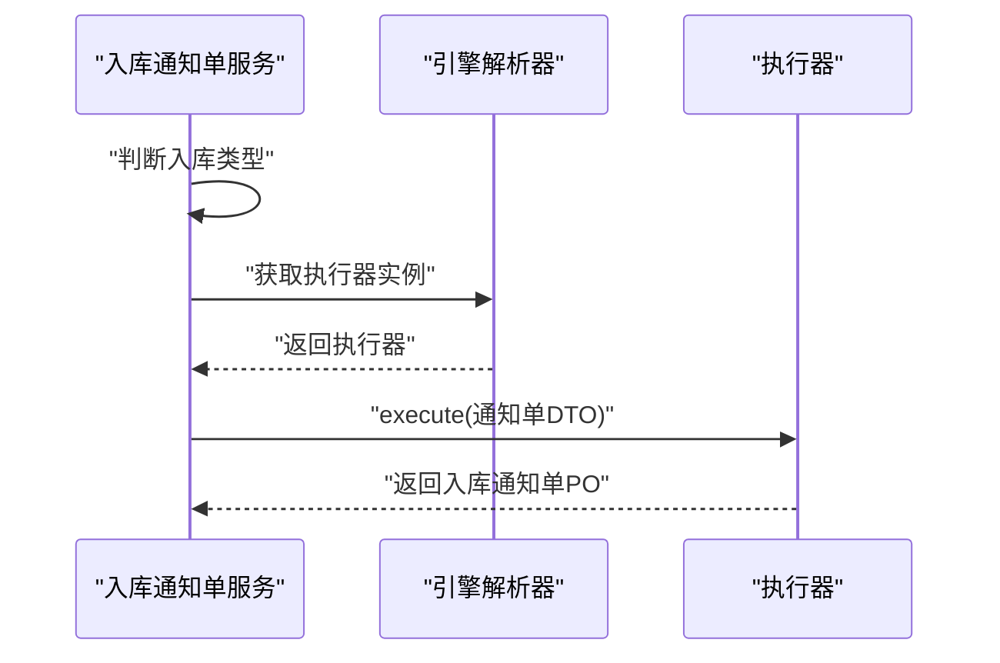
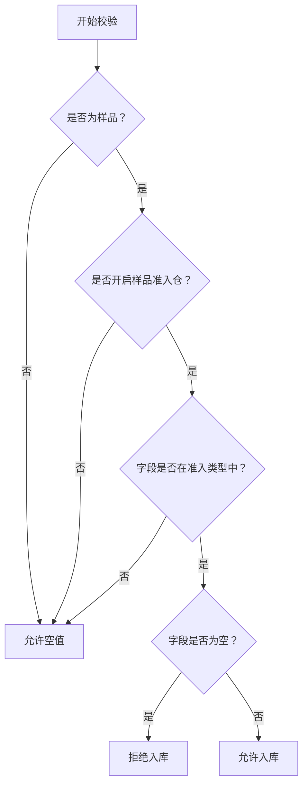
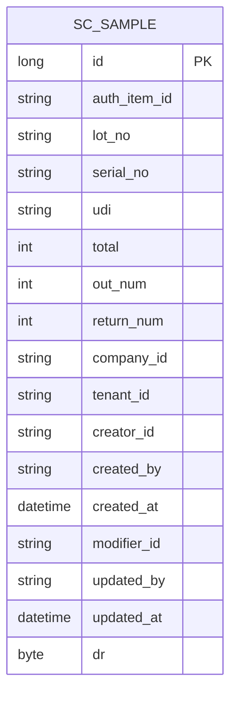
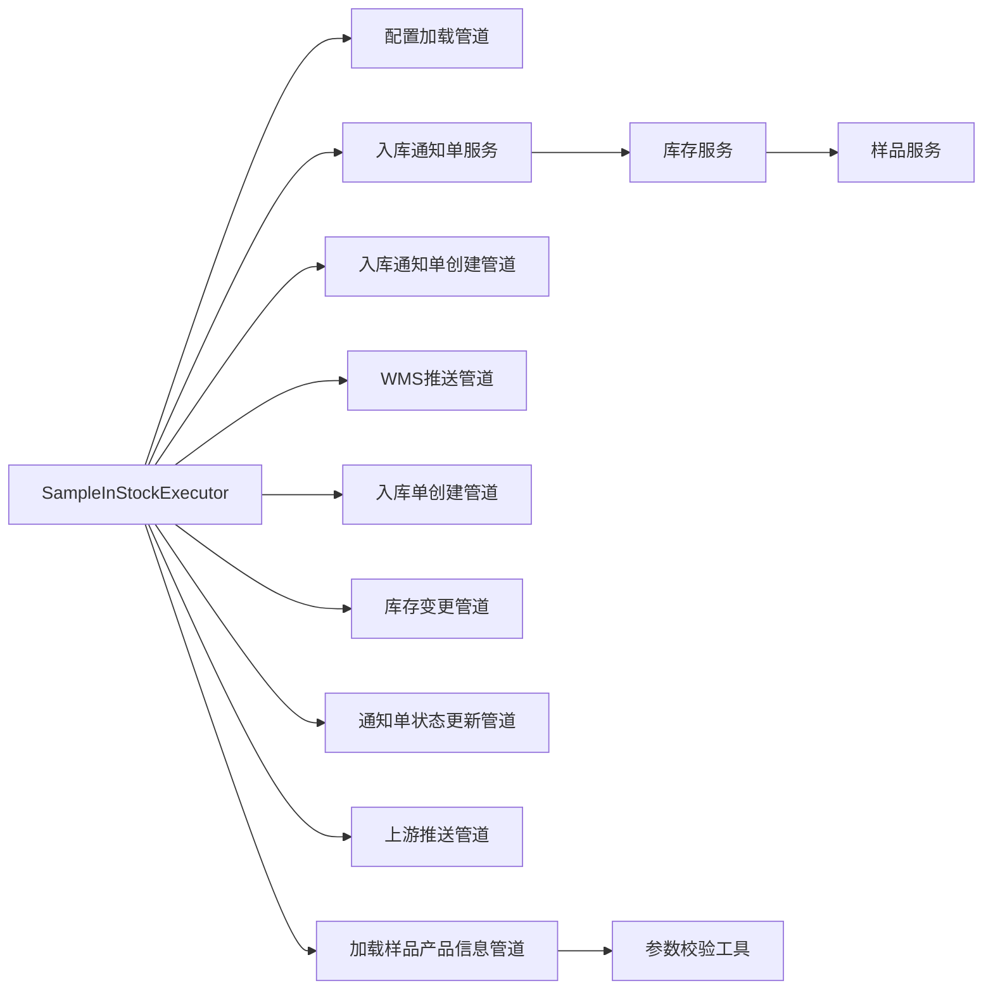

# 样品入库流程

<cite>
**本文引用的文件**
- [SampleInStockExecutor.java](file://guoke-deepexi-storage-center-provider/src/main/java/com/ deepexi/storage/handler/in/executor/SampleInStockExecutor.java)
- [InLoadSampleProductPipe.java](file://guoke-deepexi-storage-center-provider/src/main/java/com/ deepexi/storage/handler/in/pipe/sample/InLoadSampleProductPipe.java)
- [ScInStockOrderServiceImpl.java](file://guoke-deepexi-storage-center-provider/src/main/java/com/ deepexi/storage/service/impl/ScInStockOrderServiceImpl.java)
- [ScSample.java](file://guoke-deepexi-storage-center-provider/src/main/java/com/ deepexi/storage/model/ScSample.java)
- [ScSampleService.java](file://guoke-deepexi-storage-center-provider/src/main/java/com/ deepexi/storage/service/ScSampleService.java)
- [ScSampleServiceImpl.java](file://guoke-deepexi-storage-center-provider/src/main/java/com/ deepexi/storage/service/impl/ScSampleServiceImpl.java)
- [CheckSampleParamUtil.java](file://guoke-deepexi-storage-center-provider/src/main/java/com/ deepexi/storage/common/util/CheckSampleParamUtil.java)
- [SampleImport.java](file://guoke-deepexi-storage-center-api/src/main/java/com/ deepexi/api/storage/dto/sample/SampleImport.java)
- [ScStockServiceImpl.java](file://guoke-deepexi-storage-center-provider/src/main/java/com/ deepexi/storage/service/impl/ScStockServiceImpl.java)
- [ScStockService.java](file://guoke-deepexi-storage-center-provider/src/main/java/com/ deepexi/storage/service/ScStockService.java)
</cite>

## 目录
1. [简介](#简介)
2. [项目结构](#项目结构)
3. [核心组件](#核心组件)
4. [架构总览](#架构总览)
5. [详细组件分析](#详细组件分析)
6. [依赖关系分析](#依赖关系分析)
7. [性能考虑](#性能考虑)
8. [故障排查指南](#故障排查指南)
9. [结论](#结论)
10. [附录](#附录)

## 简介
本文件面向“样品入库”业务流程，系统性阐述样品接收、登记、存储与处理的完整链路，并重点解析以下关键点：
- 样品入库专用执行器与管道：SampleInStockExecutor 执行器与 InLoadSampleProductPipe 管道的职责与协作机制
- 样品入库的特殊规则：如批号、生产日期、有效期、序列号、UDI、主码等字段的准入校验策略
- 与产品中心、库存中心、WMS 等系统的集成方式
- 样品库存查询与报表能力
- 实际应用场景与 API 规范指引（以路径代替具体代码）

## 项目结构
围绕样品入库的关键模块分布如下：
- 处理器与管道：handler/in 下的执行器与管道负责按步骤编排入库流程
- 服务层：service 层对入库通知单、库存变更、样品表操作进行编排与落地
- 数据模型：model 层定义样品表结构及字段含义
- 工具与 DTO：common/util 提供参数校验工具；api/dto 提供导入模板与查询请求体

图表来源
- [SampleInStockExecutor.java:1-55](file://guoke-deepexi-storage-center-provider/src/main/java/com/deepexi/storage/handler/in/executor/SampleInStockExecutor.java#L1-L55)
- [InLoadSampleProductPipe.java:1-39](file://guoke-deepexi-storage-center-provider/src/main/java/com/deepexi/storage/handler/in/pipe/sample/InLoadSampleProductPipe.java#L1-L39)
- [ScInStockOrderServiceImpl.java:1824-1870](file://guoke-deepexi-storage-center-provider/src/main/java/com/deepexi/storage/service/impl/ScInStockOrderServiceImpl.java#L1824-L1870)
- [ScStockServiceImpl.java:1103-1188](file://guoke-deepexi-storage-center-provider/src/main/java/com/deepexi/storage/service/impl/ScStockServiceImpl.java#L1103-L1188)
- [ScSampleService.java:1-22](file://guoke-deepexi-storage-center-provider/src/main/java/com/deepexi/storage/service/ScSampleService.java#L1-L22)
- [ScSampleServiceImpl.java:1-47](file://guoke-deepexi/storage/service/impl/ScSampleServiceImpl.java#L1-L47)
- [ScSample.java:1-171](file://guoke-deepexi-storage-center-provider/src/main/java/com/deepexi/storage/model/ScSample.java#L1-L171)
- [CheckSampleParamUtil.java:1-75](file://guoke-deepexi-storage-center-provider/src/main/java/com/deepexi/storage/common/util/CheckSampleParamUtil.java#L1-L75)
- [SampleImport.java:1-41](file://guoke-deepexi-storage-center-api/src/main/java/com/deepexi/api/storage/dto/sample/SampleImport.java#L1-L41)

章节来源
- [SampleInStockExecutor.java:1-55](file://guoke-deepexi-storage-center-provider/src/main/java/com/deepexi/storage/handler/in/executor/SampleInStockExecutor.java#L1-L55)
- [InLoadSampleProductPipe.java:1-39](file://guoke-deepexi-storage-center-provider/src/main/java/com/deepexi/storage/handler/in/pipe/sample/InLoadSampleProductPipe.java#L1-L39)
- [ScInStockOrderServiceImpl.java:1824-1870](file://guoke-deepexi-storage-center-provider/src/main/java/com/deepexi/storage/service/impl/ScInStockOrderServiceImpl.java#L1824-L1870)

## 核心组件
- 样品入库执行器：SampleInStockExecutor 负责装配流水线，按顺序执行配置加载、产品信息加载、入库通知单创建、WMS 推送、入库单创建、库存变更、通知单状态更新、上游推送等步骤
- 加载样品产品信息管道：InLoadSampleProductPipe 从产品中心批量拉取授权产品信息，填充上下文，供后续步骤使用
- 入库通知单服务：ScInStockOrderServiceImpl 根据入库类型选择执行器（样品类型走样品执行器），并驱动执行器完成全流程
- 样品服务：ScSampleService/Impl 提供样品表的增删改查与按批次查询能力
- 样品参数校验工具：CheckSampleParamUtil 提供针对批号、生产日期、有效期、序列号、UDI、主码等字段的准入校验策略
- 样品导入 DTO：SampleImport 定义样品目录导入的字段映射
- 样品库存查询与报表：ScStockServiceImpl 提供样品分页、规格查询、报表导出等能力

章节来源
- [SampleInStockExecutor.java:18-55](file://guoke-deepexi-storage-center-provider/src/main/java/com/deepexi/storage/handler/in/executor/SampleInStockExecutor.java#L18-L55)
- [InLoadSampleProductPipe.java:22-39](file://guoke-deepexi-storage-center-provider/src/main/java/com/deepexi/storage/handler/in/pipe/sample/InLoadSampleProductPipe.java#L22-L39)
- [ScInStockOrderServiceImpl.java:1824-1870](file://guoke-deepexi-storage-center-provider/src/main/java/com/deepexi/storage/service/impl/ScInStockOrderServiceImpl.java#L1824-L1870)
- [ScSampleService.java:1-22](file://guoke-deepexi-storage-center-provider/src/main/java/com/deepexi/storage/service/ScSampleService.java#L1-L22)
- [ScSampleServiceImpl.java:1-47](file://guoke-deepexi-storage-center-provider/src/main/java/com/deepexi/storage/service/impl/ScSampleServiceImpl.java#L1-L47)
- [CheckSampleParamUtil.java:1-75](file://guoke-deepexi-storage-center-provider/src/main/java/com/deepexi/storage/common/util/CheckSampleParamUtil.java#L1-L75)
- [SampleImport.java:1-41](file://guoke-deepexi-storage-center-api/src/main/java/com/deepexi/api/storage/dto/sample/SampleImport.java#L1-L41)
- [ScStockServiceImpl.java:1103-1188](file://guoke-deepexi-storage-center-provider/src/main/java/com/deepexi/storage/service/impl/ScStockServiceImpl.java#L1103-L1188)

## 架构总览
下图展示样品入库从入口到落库的关键调用链与数据流：

图表来源
- [ScInStockOrderServiceImpl.java:1824-1870](file://guoke-deepexi-storage-center-provider/src/main/java/com/deepexi/storage/service/impl/ScInStockOrderServiceImpl.java#L1824-L1870)
- [SampleInStockExecutor.java:36-53](file://guoke-deepexi-storage-center-provider/src/main/java/com/deepexi/storage/handler/in/executor/SampleInStockExecutor.java#L36-L53)
- [InLoadSampleProductPipe.java:33-38](file://guoke-deepexi-storage-center-provider/src/main/java/com/deepexi/storage/handler/in/pipe/sample/InLoadSampleProductPipe.java#L33-L38)
- [ScStockServiceImpl.java:1103-1188](file://guoke-deepexi-storage-center-provider/src/main/java/com/deepexi/storage/service/impl/ScStockServiceImpl.java#L1103-L1188)
- [ScSampleServiceImpl.java:35-43](file://guoke-deepexi-storage-center-provider/src/main/java/com/deepexi/storage/service/impl/ScSampleServiceImpl.java#L35-L43)

## 详细组件分析

### 组件一：SampleInStockExecutor 执行器
- 职责
  - 定义样品入库专属流水线步骤，覆盖配置加载、产品信息加载、入库通知单创建、WMS 推送、入库单创建、库存变更、通知单状态更新、上游推送
  - 通过执行器名称与引擎解析器对接，确保按入库类型动态选择执行器
- 关键行为
  - afterPropertiesSet 中按序添加各步骤管道
  - name 返回执行器标识，用于引擎解析
  - setKey 生成可读的业务键，便于日志追踪

图表来源
- [SampleInStockExecutor.java:18-55](file://guoke-deepexi-storage-center-provider/src/main/java/com/deepexi/storage/handler/in/executor/SampleInStockExecutor.java#L18-L55)

章节来源
- [SampleInStockExecutor.java:18-55](file://guoke-deepexi-storage-center-provider/src/main/java/com/deepexi/storage/handler/in/executor/SampleInStockExecutor.java#L18-L55)

### 组件二：InLoadSampleProductPipe 管道
- 职责
  - 在样品入库场景中，从产品中心批量查询授权产品信息，填充上下文，供后续步骤使用
- 关键行为
  - bizHandler 从入库通知单明细提取授权项 ID 列表，调用产品管理器批量查询并写入上下文

图表来源
- [InLoadSampleProductPipe.java:33-38](file://guoke-deepexi-storage-center-provider/src/main/java/com/deepexi/storage/handler/in/pipe/sample/InLoadSampleProductPipe.java#L33-L38)

章节来源
- [InLoadSampleProductPipe.java:22-39](file://guoke-deepexi-storage-center-provider/src/main/java/com/deepexi/storage/handler/in/pipe/sample/InLoadSampleProductPipe.java#L22-L39)

### 组件三：入库通知单服务（按类型选择执行器）
- 职责
  - 根据入库类型动态选择执行器（样品、一加二、其他），并将请求交给执行器完成全流程
- 关键行为
  - inStockSave 中根据类型设置执行器名称并执行

图表来源
- [ScInStockOrderServiceImpl.java:1824-1870](file://guoke-deepexi-storage-center-provider/src/main/java/com/deepexi/storage/service/impl/ScInStockOrderServiceImpl.java#L1824-L1870)

章节来源
- [ScInStockOrderServiceImpl.java:1824-1870](file://guoke-deepexi-storage-center-provider/src/main/java/com/deepexi/storage/service/impl/ScInStockOrderServiceImpl.java#L1824-L1870)

### 组件四：样品参数校验工具
- 职责
  - 针对样品入库的批号、生产日期、有效期、序列号、UDI、主码等字段，结合系统配置与业务开关进行准入校验
- 关键规则
  - 当开启样品准入仓且对应字段被纳入准入类型时，若字段为空则拒绝入库
  - 非样品场景允许空值（由业务决定）

图表来源
- [CheckSampleParamUtil.java:14-72](file://guoke-deepexi-storage-center-provider/src/main/java/com/deepexi/storage/common/util/CheckSampleParamUtil.java#L14-L72)

章节来源
- [CheckSampleParamUtil.java:1-75](file://guoke-deepexi-storage-center-provider/src/main/java/com/deepexi/storage/common/util/CheckSampleParamUtil.java#L1-L75)

### 组件五：样品实体与服务
- ScSample 实体
  - 字段涵盖授权项 ID、批号、序列号、UDI、总数、借出数、归还数、公司与租户标识等
- ScSampleService/Impl
  - 提供批量更新、批量插入、按授权项+批号+公司查询等能力

图表来源
- [ScSample.java:1-171](file://guoke-deepexi-storage-center-provider/src/main/java/com/deepexi/storage/model/ScSample.java#L1-L171)

章节来源
- [ScSample.java:1-171](file://guoke-deepexi-storage-center-provider/src/main/java/com/deepexi/storage/model/ScSample.java#L1-L171)
- [ScSampleService.java:1-22](file://guoke-deepexi-storage-center-provider/src/main/java/com/deepexi/storage/service/ScSampleService.java#L1-L22)
- [ScSampleServiceImpl.java:1-47](file://guoke-deepexi-storage-center-provider/src/main/java/com/deepexi/storage/service/impl/ScSampleServiceImpl.java#L1-L47)

### 组件六：样品库存查询与报表
- 能力
  - 分页查询样品库存、按规格过滤、报表导出
  - 结合产品中心授权产品信息补充厂商、公司产品编码、平台编码、规格与型号等
- 关键行为
  - 查询样品分页列表时，按授权项 ID 列表批量查询授权产品信息并回填

章节来源
- [ScStockServiceImpl.java:1103-1188](file://guoke-deepexi-storage-center-provider/src/main/java/com/deepexi/storage/service/impl/ScStockServiceImpl.java#L1103-L1188)
- [ScStockService.java:138-177](file://guoke-deepexi-storage-center-provider/src/main/java/com/deepexi/storage/service/ScStockService.java#L138-L177)

## 依赖关系分析
- 执行器与管道
  - SampleInStockExecutor 依赖多个管道（配置加载、产品信息加载、入库单创建、WMS 推送、库存变更、通知单状态更新、上游推送）形成完整的流水线
- 服务层耦合
  - 入库通知单服务根据类型选择执行器，执行器再调用库存服务进行库存变更
  - 样品服务与库存服务共同维护样品表与库存数据一致性
- 工具与模型
  - 样品参数校验工具贯穿入库前校验阶段
  - 样品实体作为落库载体，被样品服务与库存服务使用

图表来源
- [SampleInStockExecutor.java:36-53](file://guoke-deepexi-storage-center-provider/src/main/java/com/deepexi/storage/handler/in/executor/SampleInStockExecutor.java#L36-L53)
- [InLoadSampleProductPipe.java:22-39](file://guoke-deepexi-storage-center-provider/src/main/java/com/deepexi/storage/handler/in/pipe/sample/InLoadSampleProductPipe.java#L22-L39)
- [ScInStockOrderServiceImpl.java:1824-1870](file://guoke-deepexi-storage-center-provider/src/main/java/com/deepexi/storage/service/impl/ScInStockOrderServiceImpl.java#L1824-L1870)
- [ScStockServiceImpl.java:1103-1188](file://guoke-deepexi-storage-center-provider/src/main/java/com/deepexi/storage/service/impl/ScStockServiceImpl.java#L1103-L1188)
- [ScSampleServiceImpl.java:35-43](file://guoke-deepexi-storage-center-provider/src/main/java/com/deepexi/storage/service/impl/ScSampleServiceImpl.java#L35-L43)
- [CheckSampleParamUtil.java:1-75](file://guoke-deepexi-storage-center-provider/src/main/java/com/deepexi/storage/common/util/CheckSampleParamUtil.java#L1-L75)

## 性能考虑
- 批量查询优化
  - 在加载产品信息阶段，通过一次性批量查询授权产品信息，减少多次远程调用
- 分页与缓存
  - 样品分页查询与报表导出建议结合分页与缓存策略，避免大表全量扫描
- 流水线并行化
  - 在保证数据一致性的前提下，可评估部分非关键步骤的并行化以缩短整体耗时

## 故障排查指南
- 入库失败
  - 检查执行器是否正确选择（样品类型应走样品执行器）
  - 查看流水线各步骤日志，定位失败节点
- 产品信息缺失
  - 确认授权项 ID 列表是否正确传递，产品中心是否返回对应授权产品信息
- 样品准入校验失败
  - 核对系统配置与准入类型，确认必填字段是否为空
- 库存不一致
  - 核对库存变更步骤与通知单状态更新步骤是否成功执行

章节来源
- [SampleInStockExecutor.java:36-53](file://guoke-deepexi-storage-center-provider/src/main/java/com/deepexi/storage/handler/in/executor/SampleInStockExecutor.java#L36-L53)
- [InLoadSampleProductPipe.java:33-38](file://guoke-deepexi-storage-center-provider/src/main/java/com/deepexi/storage/handler/in/pipe/sample/InLoadSampleProductPipe.java#L33-L38)
- [CheckSampleParamUtil.java:14-72](file://guoke-deepexi-storage-center-provider/src/main/java/com/deepexi/storage/common/util/CheckSampleParamUtil.java#L14-L72)

## 结论
样品入库流程通过“执行器 + 管道”的流水线设计，实现了从产品信息加载到库存变更的闭环。执行器按入库类型动态选择，确保了业务规则的可扩展性；参数校验工具保障了准入质量；库存与样品服务协同维护了数据一致性。结合本文档的规则与接口规范，开发者可快速实现并集成样品入库功能。

## 附录

### 样品入库 API 规范（路径指引）
- 入库通知单保存（按类型选择执行器）
  - [ScInStockOrderServiceImpl.inStockSave:1824-1870](file://guoke-deepexi-storage-center-provider/src/main/java/com/deepexi/storage/service/impl/ScInStockOrderServiceImpl.java#L1824-L1870)
- 样品导入模板
  - [SampleImport:1-41](file://guoke-deepexi-storage-center-api/src/main/java/com/deepexi/api/storage/dto/sample/SampleImport.java#L1-L41)
- 样品库存分页查询
  - [ScStockServiceImpl.scStockSamplePageList:1103-1188](file://guoke-deepexi-storage-center-provider/src/main/java/com/deepexi/storage/service/impl/ScStockServiceImpl.java#L1103-L1188)
- 样品报表导出
  - [ScStockService.reportFormExport:155-156](file://guoke-deepexi-storage-center-provider/src/main/java/com/deepexi/storage/service/ScStockService.java#L155-L156)

### 样品标识与存储要求（规则摘要）
- 标识字段
  - 批号、序列号、UDI、主码等字段需满足准入校验规则
- 存储要求
  - 样品库存按授权项与批号进行聚合统计，借出与归还分别计数
- 使用限制
  - 样品出入库遵循严格的审批与追踪流程，出入库单据与通知单状态联动更新

章节来源
- [CheckSampleParamUtil.java:14-72](file://guoke-deepexi-storage-center-provider/src/main/java/com/deepexi/storage/common/util/CheckSampleParamUtil.java#L14-L72)
- [ScSample.java:31-71](file://guoke-deepexi-storage-center-provider/src/main/java/com/deepexi/storage/model/ScSample.java#L31-L71)
- [ScSampleServiceImpl.java:35-43](file://guoke-deepexi-storage-center-provider/src/main/java/com/deepexi/storage/service/impl/ScSampleServiceImpl.java#L35-L43)