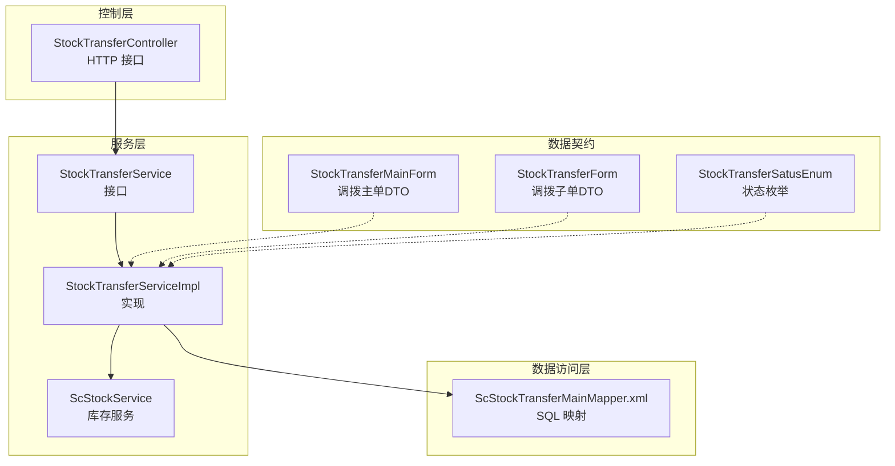
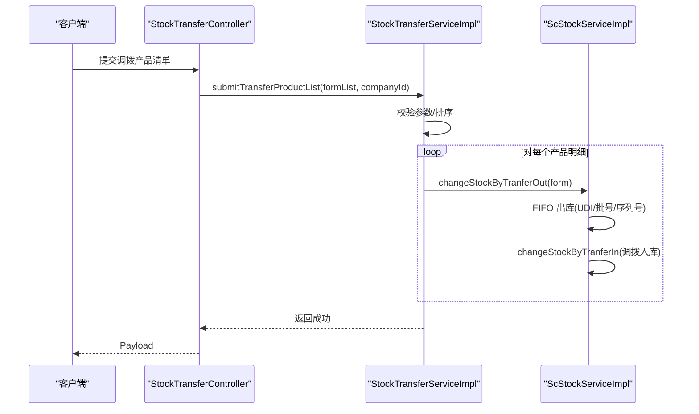
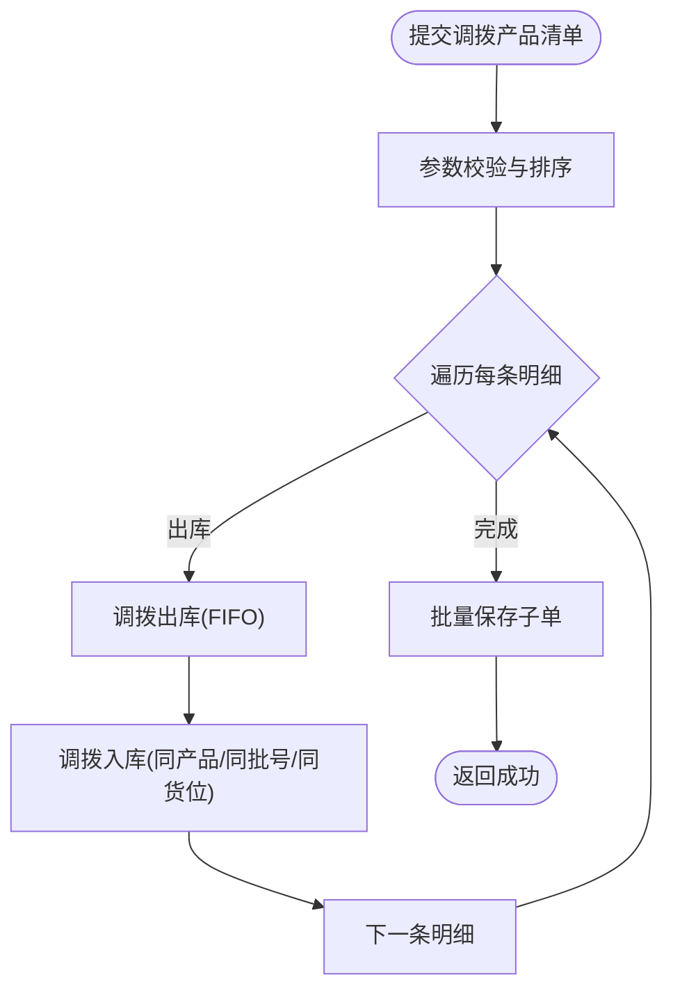
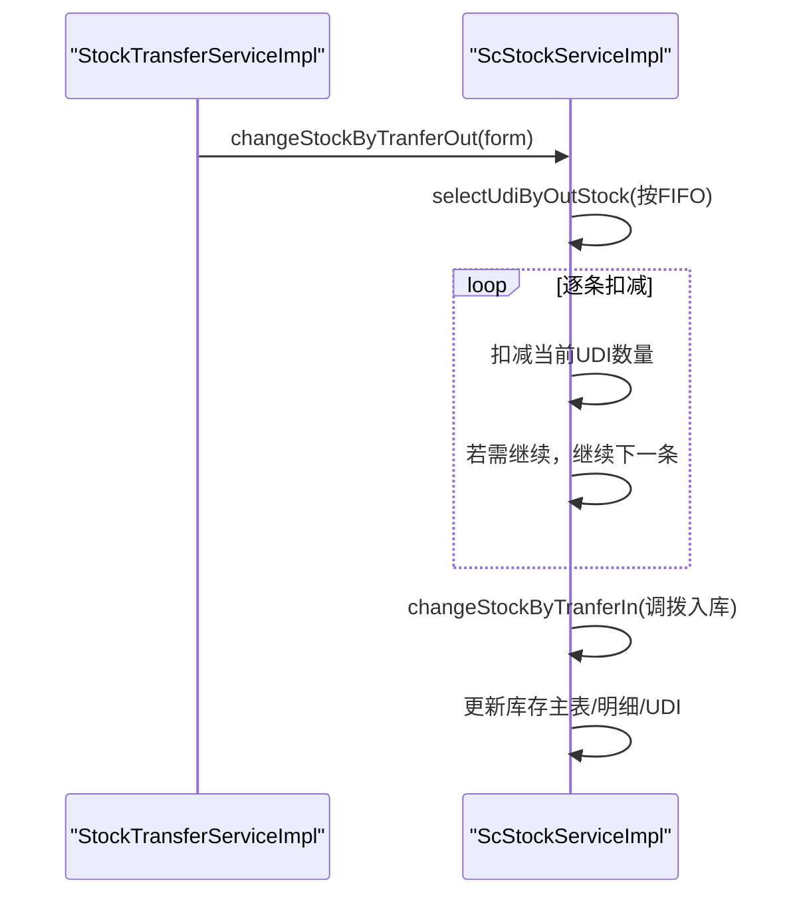
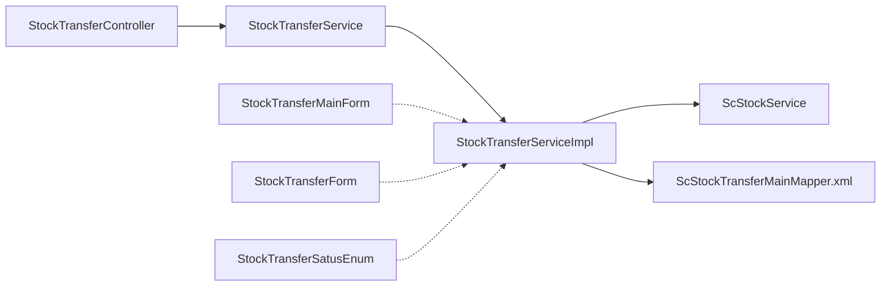

# 调拨入库流程

<cite>
**本文引用的文件**
- [StockTransferController.java](file://guoke-deepexi-storage-center-provider/src/main/java/com/deepexi/storage/controller/web/StockTransferController.java)
- [StockTransferService.java](file://guoke-deepexi-storage-center-provider/src/main/java/com/deepexi/storage/service/StockTransferService.java)
- [StockTransferServiceImpl.java](file://guoke-deepexi-storage-center-provider/src/main/java/com/deepexi/storage/service/impl/StockTransferServiceImpl.java)
- [ScStockService.java](file://guoke-deepexi-storage-center-provider/src/main/java/com/deepexi/storage/service/ScStockService.java)
- [ScStockServiceImpl.java](file://guoke-deepexi-storage-center-provider/src/main/java/com/deepexi/storage/service/impl/ScStockServiceImpl.java)
- [StockTransferMainForm.java](file://guoke-deepexi-storage-center-api/src/main/java/com/ deepexi/api/storage/dto/transfer/StockTransferMainForm.java)
- [StockTransferForm.java](file://guoke-deepexi-storage-center-api/src/main/java/com/ deepexi/api/storage/dto/transfer/StockTransferForm.java)
- [QueryStockTransferMainRequest.java](file://guoke-deepexi-storage-center-api/src/main/java/com/ deepexi/api/storage/dto/transfer/QueryStockTransferMainRequest.java)
- [QueryStockTransferProductRequest.java](file://guoke-deepexi-storage-center-api/src/main/java/com/ deepexi/api/storage/dto/transfer/QueryStockTransferProductRequest.java)
- [StockTransferSatusEnum.java](file://guoke-deepexi-storage-center-api/src/main/java/com/ deepexi/api/storage/enums/StockTransferSatusEnum.java)
- [StockTransferVO.java](file://guoke-deepexi-storage-center-provider/src/main/java/com/deepexi/storage/pojo/vo/transfer/StockTransferVO.java)
- [ScStockTransferMainMapper.xml](file://guoke-deepexi-storage-center-provider/src/main/resources/mapper/transfer/ScStockTransferMainMapper.xml)
</cite>

## 目录
1. [引言](#引言)
2. [项目结构](#项目结构)
3. [核心组件](#核心组件)
4. [架构总览](#架构总览)
5. [详细组件分析](#详细组件分析)
6. [依赖分析](#依赖分析)
7. [性能考虑](#性能考虑)
8. [故障排查指南](#故障排查指南)
9. [结论](#结论)
10. [附录：API 规范与最佳实践](#附录api-规范与最佳实践)

## 引言
本文件围绕“调拨入库”流程进行系统化梳理，覆盖从调拨申请、调拨出库到调拨入库的关键环节，解释库存转移机制与账务处理逻辑，明确业务规则、时效与质量标准，并给出与多仓库管理、库存分配等系统的协同方式。同时提供调拨入库相关的 API 接口规范、参数说明与错误处理方案，并结合实际业务场景给出最佳实践建议。

## 项目结构
调拨入库能力主要分布在以下模块：
- 控制层：提供对外 HTTP 接口，负责参数接收与响应封装
- 服务层：实现业务编排与校验，协调库存服务执行库存转移
- 数据访问层：基于 MyBatis-Plus 与 XML Mapper 实现数据库读写
- DTO/枚举：定义调拨主子单、查询请求、状态枚举等数据契约

图表来源
- [StockTransferController.java:30-64](file://guoke-deepexi-storage-center-provider/src/main/java/com/deepexi/storage/controller/web/StockTransferController.java#L30-L64)
- [StockTransferService.java:22-42](file://guoke-deepexi-storage-center-provider/src/main/java/com/deepexi/storage/service/StockTransferService.java#L22-L42)
- [StockTransferServiceImpl.java:52-184](file://guoke-deepexi-storage-center-provider/src/main/java/com/deepexi/storage/service/impl/StockTransferServiceImpl.java#L52-L184)
- [ScStockService.java:217-217](file://guoke-deepexi-storage-center-provider/src/main/java/com/deepexi/storage/service/ScStockService.java#L217-L217)
- [ScStockTransferMainMapper.xml:658-697](file://guoke-deepexi-storage-center-provider/src/main/resources/mapper/transfer/ScStockTransferMainMapper.xml#L658-L697)
- [StockTransferMainForm.java:17-55](file://guoke-deepexi-storage-center-api/src/main/java/com/deepexi/api/storage/dto/transfer/StockTransferMainForm.java#L17-L55)
- [StockTransferForm.java:14-68](file://guoke-deepexi-storage-center-api/src/main/java/com/deepexi/api/storage/dto/transfer/StockTransferForm.java#L14-L68)
- [StockTransferSatusEnum.java:13-20](file://guoke-deepexi-storage-center-api/src/main/java/com/deepexi/api/storage/enums/StockTransferSatusEnum.java#L13-L20)

章节来源
- [StockTransferController.java:30-64](file://guoke-deepexi-storage-center-provider/src/main/java/com/deepexi/storage/controller/web/StockTransferController.java#L30-L64)
- [StockTransferServiceImpl.java:52-184](file://guoke-deepexi-storage-center-provider/src/main/java/com/deepexi/storage/service/impl/StockTransferServiceImpl.java#L52-L184)
- [ScStockService.java:217-217](file://guoke-deepexi-storage-center-provider/src/main/java/com/deepexi/storage/service/ScStockService.java#L217-L217)

## 核心组件
- 控制器：提供调拨入库相关接口，如分页查询、提交调拨产品清单等
- 服务接口与实现：负责参数校验、调拨出库触发、调拨入库库存更新、VO 转换与分页查询
- 库存服务：实现 FIFO 出库策略，按 UDI/批号/序列号等维度进行库存扣减与新增
- 数据契约：定义调拨主单、子单、查询请求及状态枚举，确保前后端一致的数据模型
- SQL 映射：提供调拨主单与子单的查询能力，支持按仓库、货架、货位、产品等多维过滤

章节来源
- [StockTransferController.java:36-64](file://guoke-deepexi-storage-center-provider/src/main/java/com/deepexi/storage/controller/web/StockTransferController.java#L36-L64)
- [StockTransferService.java:22-42](file://guoke-deepexi-storage-center-provider/src/main/java/com/deepexi/storage/service/StockTransferService.java#L22-L42)
- [StockTransferServiceImpl.java:162-184](file://guoke-deepexi-storage-center-provider/src/main/java/com/deepexi/storage/service/impl/StockTransferServiceImpl.java#L162-L184)
- [ScStockService.java:217-217](file://guoke-deepexi-storage-center-provider/src/main/java/com/deepexi/storage/service/ScStockService.java#L217-L217)
- [StockTransferMainForm.java:17-55](file://guoke-deepexi-storage-center-api/src/main/java/com/deepexi/api/storage/dto/transfer/StockTransferMainForm.java#L17-L55)
- [StockTransferForm.java:14-68](file://guoke-deepexi-storage-center-api/src/main/java/com/deepexi/api/storage/dto/transfer/StockTransferForm.java#L14-L68)
- [StockTransferSatusEnum.java:13-20](file://guoke-deepexi-storage-center-api/src/main/java/com/deepexi/api/storage/enums/StockTransferSatusEnum.java#L13-L20)
- [ScStockTransferMainMapper.xml:658-697](file://guoke-deepexi-storage-center-provider/src/main/resources/mapper/transfer/ScStockTransferMainMapper.xml#L658-L697)

## 架构总览
调拨入库流程在服务层完成“提交调拨产品清单”的动作，核心在于：
- 参数校验与排序
- 触发调拨出库（FIFO）
- 基于调拨出库结果执行调拨入库（同产品、同批号、同货位/货架/仓库的库存累加）

图表来源
- [StockTransferController.java:56-63](file://guoke-deepexi-storage-center-provider/src/main/java/com/deepexi/storage/controller/web/StockTransferController.java#L56-L63)
- [StockTransferServiceImpl.java:162-184](file://guoke-deepexi-storage-center-provider/src/main/java/com/deepexi/storage/service/impl/StockTransferServiceImpl.java#L162-L184)
- [ScStockServiceImpl.java:2802-2848](file://guoke-deepexi-storage-center-provider/src/main/java/com/deepexi/storage/service/impl/ScStockServiceImpl.java#L2802-L2848)

## 详细组件分析

### 组件一：调拨入库控制器（StockTransferController）
- 职责
  - 分页查询调拨记录：listStockTransferVOs
  - 分页查询可调拨产品：listStockProductVOs
  - 提交流拨产品清单：submitTransferProductList
- 关键点
  - 自动注入公司上下文 ID
  - 对空参数进行统一异常抛出
  - 将请求转发至服务层并返回 Payload 包装

章节来源
- [StockTransferController.java:36-63](file://guoke-deepexi-storage-center-provider/src/main/java/com/deepexi/storage/controller/web/StockTransferController.java#L36-L63)

### 组件二：调拨入库服务接口与实现（StockTransferService/StockTransferServiceImpl）
- 职责
  - 校验参数并按 UDI/序列号/批号排序
  - 触发调拨出库与调拨入库
  - 保存调拨子单
  - 支持按主单 ID 查询子单、删除主单关联子单
- 关键实现
  - submitTransferProductList：逐条校验并调用库存服务完成出库，随后批量保存子单
  - changeStockByTranferOut：委托库存服务执行 FIFO 出库
  - 调拨入库：在库存服务中按目标仓库/货架/货位/批号查找或新建库存明细与 UDI 记录

图表来源
- [StockTransferServiceImpl.java:162-184](file://guoke-deepexi-storage-center-provider/src/main/java/com/deepexi/storage/service/impl/StockTransferServiceImpl.java#L162-L184)
- [ScStockServiceImpl.java:2802-2848](file://guoke-deepexi-storage-center-provider/src/main/java/com/deepexi/storage/service/impl/ScStockServiceImpl.java#L2802-L2848)

章节来源
- [StockTransferService.java:22-42](file://guoke-deepexi-storage-center-provider/src/main/java/com/deepexi/storage/service/StockTransferService.java#L22-L42)
- [StockTransferServiceImpl.java:162-184](file://guoke-deepexi-storage-center-provider/src/main/java/com/deepexi/storage/service/impl/StockTransferServiceImpl.java#L162-L184)

### 组件三：库存服务（ScStockService/ScStockServiceImpl）
- 调拨出库（changeStockByTranferOut）
  - 构建出库查询条件（公司、产品授权、仓库、货架、货位、批号、序列号、UDI 等）
  - FIFO 顺序扣减 UDI 数量，直至满足调拨数量
  - 调拨入库（changeStockByTranferIn）：按目标仓库/货架/货位/批号查找或新建库存明细与 UDI
- 关键点
  - 出库遵循 FIFO 规则
  - 入库按“同产品、同批号、同货位/货架/仓库”合并或新建
  - 更新库存主表、明细表与 UDI 表

图表来源
- [ScStockServiceImpl.java:2802-2848](file://guoke-deepexi-storage-center-provider/src/main/java/com/deepexi/storage/service/impl/ScStockServiceImpl.java#L2802-L2848)
- [ScStockServiceImpl.java:2899-2919](file://guoke-deepexi-storage-center-provider/src/main/java/com/deepexi/storage/service/impl/ScStockServiceImpl.java#L2899-L2919)

章节来源
- [ScStockService.java:217-217](file://guoke-deepexi-storage-center-provider/src/main/java/com/deepexi/storage/service/ScStockService.java#L217-L217)
- [ScStockServiceImpl.java:2802-2848](file://guoke-deepexi-storage-center-provider/src/main/java/com/deepexi/storage/service/impl/ScStockServiceImpl.java#L2802-L2848)
- [ScStockServiceImpl.java:2899-2919](file://guoke-deepexi-storage-center-provider/src/main/java/com/deepexi/storage/service/impl/ScStockServiceImpl.java#L2899-L2919)

### 组件四：数据契约与查询
- 调拨主单/子单 DTO：定义调拨出入库涉及的字段，如产品信息、仓库/货架/货位、批号/序列号/UDI、数量、物权方/货主等
- 查询请求：支持按公司、仓库/货架/货位、产品编码/名称、批号/序列号等条件查询
- 状态枚举：定义“暂存/提交”等状态

章节来源
- [StockTransferMainForm.java:17-55](file://guoke-deepexi-storage-center-api/src/main/java/com/deepexi/api/storage/dto/transfer/StockTransferMainForm.java#L17-L55)
- [StockTransferForm.java:14-68](file://guoke-deepexi-storage-center-api/src/main/java/com/deepexi/api/storage/dto/transfer/StockTransferForm.java#L14-L68)
- [QueryStockTransferMainRequest.java:18-69](file://guoke-deepexi-storage-center-api/src/main/java/com/deepexi/api/storage/dto/transfer/QueryStockTransferMainRequest.java#L18-L69)
- [QueryStockTransferProductRequest.java:18-48](file://guoke-deepexi-storage-center-api/src/main/java/com/deepexi/api/storage/dto/transfer/QueryStockTransferProductRequest.java#L18-L48)
- [StockTransferSatusEnum.java:13-20](file://guoke-deepexi-storage-center-api/src/main/java/com/deepexi/api/storage/enums/StockTransferSatusEnum.java#L13-L20)

### 组件五：调拨主单查询（SQL 映射）
- 支持按主单 ID、单号、仓库/货架/货位、产品编码/名称、批号/序列号等条件查询
- 用于前端展示调拨主单与子单详情

章节来源
- [ScStockTransferMainMapper.xml:658-697](file://guoke-deepexi-storage-center-provider/src/main/resources/mapper/transfer/ScStockTransferMainMapper.xml#L658-L697)

## 依赖分析
- 控制器依赖服务接口
- 服务实现依赖库存服务与数据访问层
- DTO/枚举作为跨层数据契约
- SQL 映射支撑主单与子单查询

图表来源
- [StockTransferController.java:30-64](file://guoke-deepexi-storage-center-provider/src/main/java/com/deepexi/storage/controller/web/StockTransferController.java#L30-L64)
- [StockTransferService.java:22-42](file://guoke-deepexi-storage-center-provider/src/main/java/com/deepexi/storage/service/StockTransferService.java#L22-L42)
- [StockTransferServiceImpl.java:52-184](file://guoke-deepexi-storage-center-provider/src/main/java/com/deepexi/storage/service/impl/StockTransferServiceImpl.java#L52-L184)
- [ScStockService.java:217-217](file://guoke-deepexi-storage-center-provider/src/main/java/com/deepexi/storage/service/ScStockService.java#L217-L217)
- [ScStockTransferMainMapper.xml:658-697](file://guoke-deepexi-storage-center-provider/src/main/resources/mapper/transfer/ScStockTransferMainMapper.xml#L658-L697)
- [StockTransferMainForm.java:17-55](file://guoke-deepexi-storage-center-api/src/main/java/com/deepexi/api/storage/dto/transfer/StockTransferMainForm.java#L17-L55)
- [StockTransferForm.java:14-68](file://guoke-deepexi-storage-center-api/src/main/java/com/deepexi/api/storage/dto/transfer/StockTransferForm.java#L14-L68)
- [StockTransferSatusEnum.java:13-20](file://guoke-deepexi-storage-center-api/src/main/java/com/deepexi/api/storage/enums/StockTransferSatusEnum.java#L13-L20)

## 性能考虑
- 批量操作：服务层对明细进行排序后批量保存子单，减少多次数据库往返
- FIFO 出库：按 UDI/批号/序列号顺序扣减，避免跨批次混合导致的复杂度
- 分页查询：控制器与服务层均使用分页组件，降低大结果集内存压力
- 事务边界：提交调拨产品清单采用事务，确保出库与入库的一致性

## 故障排查指南
- 常见错误类型
  - 参数缺失：未选择移入货位、未填写调拨数量、产品 ID 或库存数量为空
  - 库存不足：调拨数量超过可用库存
  - 货位/仓库为空：转出货架或仓库为空
  - 同货位重复调拨：调入与调出货位相同
- 定位方法
  - 查看控制器与服务层的参数校验与异常抛出位置
  - 结合库存服务的 FIFO 出库与入库逻辑定位问题点
  - 使用 SQL 映射提供的查询条件核对主单与子单数据

章节来源
- [StockTransferServiceImpl.java:218-234](file://guoke-deepexi-storage-center-provider/src/main/java/com/deepexi/storage/service/impl/StockTransferServiceImpl.java#L218-L234)
- [StockTransferServiceImpl.java:297-306](file://guoke-deepexi-storage-center-provider/src/main/java/com/deepexi/storage/service/impl/StockTransferServiceImpl.java#L297-L306)
- [ScStockServiceImpl.java:2802-2848](file://guoke-deepexi-storage-center-provider/src/main/java/com/deepexi/storage/service/impl/ScStockServiceImpl.java#L2802-L2848)

## 结论
调拨入库流程以“提交调拨产品清单”为核心入口，通过服务层编排与库存服务的 FIFO 出入库实现完整的库存转移。系统在参数校验、事务控制、分页查询与数据契约方面具备清晰的设计与实现，能够满足多仓库、多货架、多货位下的库存协同需求。

## 附录：API 规范与最佳实践

### API 接口规范（POST）
- 提交调拨产品清单
  - 路径：/api/v1/stockTransfer/submitTransferProductList
  - 请求体：数组，元素为调拨子单 DTO
  - 成功响应：Payload（无具体数据体）
  - 错误处理：参数缺失、库存不足、重复调拨等异常抛出

章节来源
- [StockTransferController.java:56-63](file://guoke-deepexi-storage-center-provider/src/main/java/com/deepexi/storage/controller/web/StockTransferController.java#L56-L63)
- [StockTransferForm.java:14-68](file://guoke-deepexi-storage-center-api/src/main/java/com/deepexi/api/storage/dto/transfer/StockTransferForm.java#L14-L68)

### 业务规则与质量标准
- 必填字段：移入货位、调拨数量、产品 ID、库存数量
- 库存校验：调拨数量不得大于可用库存
- 货位校验：转出货架/仓库不得为空；调入/调出货位不得相同
- 批次与序列号：按批号/序列号/UDI 精确匹配与合并

章节来源
- [StockTransferServiceImpl.java:218-234](file://guoke-deepexi-storage-center-provider/src/main/java/com/deepexi/storage/service/impl/StockTransferServiceImpl.java#L218-L234)
- [StockTransferServiceImpl.java:297-306](file://guoke-deepexi-storage-center-provider/src/main/java/com/deepexi/storage/service/impl/StockTransferServiceImpl.java#L297-L306)

### 与多仓库管理、库存分配的协同
- 多仓库协同：通过仓库/货架/货位维度进行库存隔离与合并
- 库存分配：FIFO 策略确保先入先出，避免过期与积压
- 数据一致性：事务包裹提交流程，保证出库与入库原子性

章节来源
- [ScStockServiceImpl.java:2802-2848](file://guoke-deepexi-storage-center-provider/src/main/java/com/deepexi/storage/service/impl/ScStockServiceImpl.java#L2802-L2848)
- [StockTransferServiceImpl.java:162-184](file://guoke-deepexi-storage-center-provider/src/main/java/com/deepexi/storage/service/impl/StockTransferServiceImpl.java#L162-L184)

### 最佳实践建议
- 在提交前进行库存与货位校验，避免重复调拨与无效操作
- 对大批量调拨采用分批提交，降低事务持续时间
- 使用查询接口按仓库/货架/货位/产品等维度筛选，提升运营效率
- 对异常场景（库存不足、参数缺失）做好前端提示与重试策略