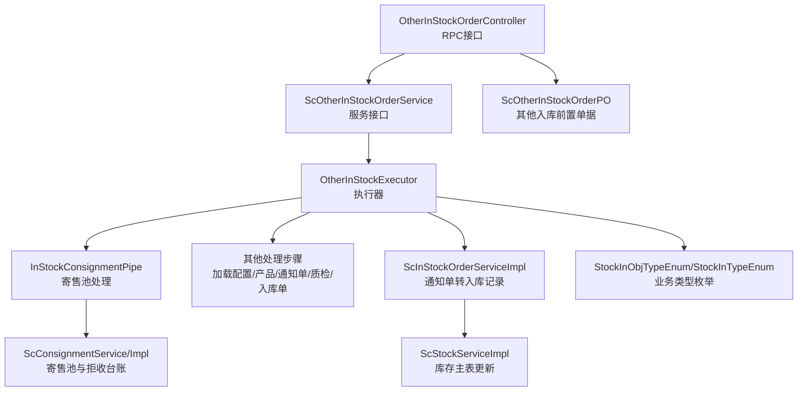
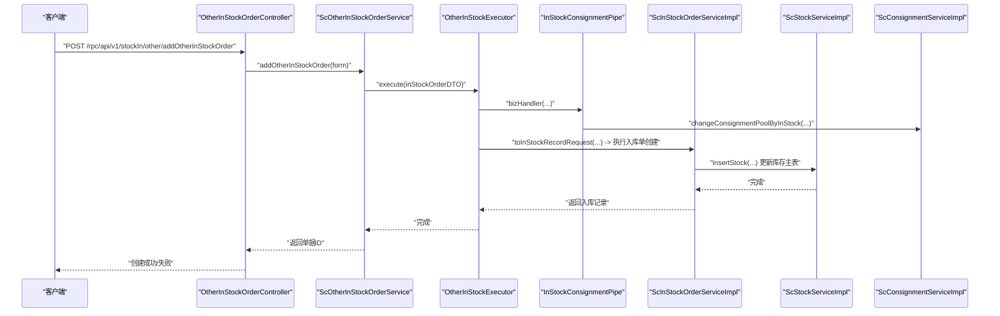
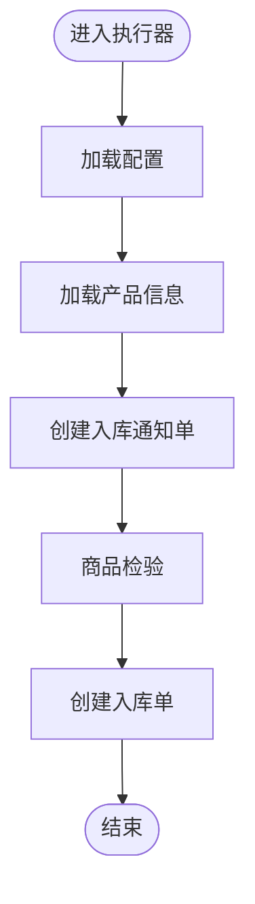
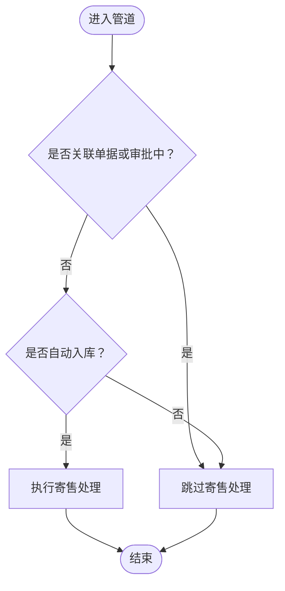
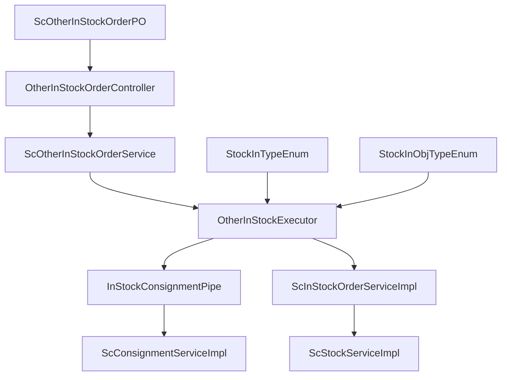

# 退货入库流程

<cite>
**本文引用的文件**
- [OtherInStockExecutor.java](file://guoke-deepexi-storage-center-provider/src/main/java/com/deepexi/storage/handler/in/executor/OtherInStockExecutor.java)
- [InStockConsignmentPipe.java](file://guoke-deepexi-storage-center-provider/src/main/java/com/deepexi/storage/handler/in/pipe/InStockConsignmentPipe.java)
- [OtherInStockOrderController.java](file://guoke-deepexi-storage-center-provider/src/main/java/com/deepexi/storage/controller/rpc/OtherInStockOrderController.java)
- [ScOtherInStockOrderService.java](file://guoke-deepexi-storage-center-provider/src/main/java/com/deepexi/storage/service/ScOtherInStockOrderService.java)
- [ScOtherInStockOrderPO.java](file://guoke-deepexi-storage-center-provider/src/main/java/com/deepexi/storage/model/ScOtherInStockOrderPO.java)
- [StockInObjTypeEnum.java](file://guoke-deepexi-storage-center-api/src/main/java/com/deepexi/api/storage/enums/in/StockInObjTypeEnum.java)
- [StockInTypeEnum.java](file://guoke-deepexi-storage-center-api/src/main/java/com/deepexi/api/storage/enums/in/StockInTypeEnum.java)
- [ScConsignmentService.java](file://guoke-deepexi-storage-center-provider/src/main/java/com/deepexi/storage/service/ScConsignmentService.java)
- [ScConsignmentServiceImpl.java](file://guoke-deepexi-storage-center-provider/src/main/java/com/deepexi/storage/service/impl/ScConsignmentServiceImpl.java)
- [ScStockServiceImpl.java](file://guoke-deepexi-storage-center-provider/src/main/java/com/deepexi/storage/service/impl/ScStockServiceImpl.java)
- [ThreePartyWmsProxyHandler.java](file://guoke-deepexi-storage-center-provider/src/main/java/com/deepexi/storage/service/hanlder/ThreePartyWmsProxyHandler.java)
- [ScInStockOrderServiceImpl.java](file://guoke-deepexi-storage-center-provider/src/main/java/com/deepexi/storage/service/impl/ScInStockOrderServiceImpl.java)
</cite>

## 目录
1. [引言](#引言)
2. [项目结构](#项目结构)
3. [核心组件](#核心组件)
4. [架构总览](#架构总览)
5. [详细组件分析](#详细组件分析)
6. [依赖分析](#依赖分析)
7. [性能考虑](#性能考虑)
8. [故障排查指南](#故障排查指南)
9. [结论](#结论)
10. [附录](#附录)

## 引言
本文件面向“退货入库”业务场景，系统性梳理从退货申请、商品检验、重新入库到库存更新与寄售池台账调整的完整流程。重点说明OtherInStockExecutor执行器与InStockConsignmentPipe管道在退货入库中的职责与协作方式，并结合枚举定义明确退货入库的业务规则、质量标准与处理时限边界。同时，给出与销售退货、供应商退货、客户退回等场景的关联关系说明，以及API接口清单与使用示例路径，帮助开发者正确实现与维护退货入库功能。

## 项目结构
围绕退货入库的关键模块与文件分布如下：
- 控制层：OtherInStockOrderController 提供RPC接口，支撑期初入库/盘盈入库等特殊场景的单据创建与查询。
- 服务层：ScOtherInStockOrderService 定义其他入库单的新增、审核、分页与明细查询等能力；ScConsignmentService/Impl 提供寄售池台账变更与拒收入库台账处理；ScStockServiceImpl 负责库存主表的插入与更新。
- 处理引擎：OtherInStockExecutor 作为执行器，串联加载配置、加载产品、创建入库通知单、质检、创建入库单等步骤；InStockConsignmentPipe 在合适时机触发寄售池与拒收台账处理。
- 枚举与模型：StockInTypeEnum/StockInObjTypeEnum 明确入库类型与退货子类型；ScOtherInStockOrderPO 描述其他入库前置单据的字段与状态。
- 关联处理：ThreePartyWmsProxyHandler 提供销退入库通知WMS的能力；ScInStockOrderServiceImpl 将入库通知单转换为入库记录并执行引擎。

图表来源
- [OtherInStockOrderController.java:31-115](file://guoke-deepexi-storage-center-provider/src/main/java/com/deepexi/storage/controller/rpc/OtherInStockOrderController.java#L31-L115)
- [ScOtherInStockOrderService.java:20-45](file://guoke-deepexi-storage-center-provider/src/main/java/com/deepexi/storage/service/ScOtherInStockOrderService.java#L20-L45)
- [OtherInStockExecutor.java:12-46](file://guoke-deepexi-storage-center-provider/src/main/java/com/deepexi/storage/handler/in/executor/OtherInStockExecutor.java#L12-L46)
- [InStockConsignmentPipe.java:13-43](file://guoke-deepexi-storage-center-provider/src/main/java/com/deepexi/storage/handler/in/pipe/InStockConsignmentPipe.java#L13-L43)
- [ScConsignmentService.java:17-106](file://guoke-deepexi-storage-center-provider/src/main/java/com/deepexi/storage/service/ScConsignmentService.java#L17-L106)
- [ScConsignmentServiceImpl.java:938-1074](file://guoke-deepexi-storage-center-provider/src/main/java/com/deepexi/storage/service/impl/ScConsignmentServiceImpl.java#L938-L1074)
- [ScStockServiceImpl.java:1330-1367](file://guoke-deepexi-storage-center-provider/src/main/java/com/deepexi/storage/service/impl/ScStockServiceImpl.java#L1330-L1367)
- [ScInStockOrderServiceImpl.java:1844-1870](file://guoke-deepexi-storage-center-provider/src/main/java/com/deepexi/storage/service/impl/ScInStockOrderServiceImpl.java#L1844-L1870)
- [StockInObjTypeEnum.java:14-238](file://guoke-deepexi-storage-center-api/src/main/java/com/deepexi/api/storage/enums/in/StockInObjTypeEnum.java#L14-L238)
- [StockInTypeEnum.java:8-54](file://guoke-deepexi-storage-center-api/src/main/java/com/deepexi/api/storage/enums/in/StockInTypeEnum.java#L8-L54)
- [ScOtherInStockOrderPO.java:11-133](file://guoke-deepexi-storage-center-provider/src/main/java/com/deepexi/storage/model/ScOtherInStockOrderPO.java#L11-L133)

章节来源
- [OtherInStockOrderController.java:31-115](file://guoke-deepexi-storage-center-provider/src/main/java/com/deepexi/storage/controller/rpc/OtherInStockOrderController.java#L31-L115)
- [ScOtherInStockOrderService.java:20-45](file://guoke-deepexi-storage-center-provider/src/main/java/com/deepexi/storage/service/ScOtherInStockOrderService.java#L20-L45)
- [OtherInStockExecutor.java:12-46](file://guoke-deepexi-storage-center-provider/src/main/java/com/deepexi/storage/handler/in/executor/OtherInStockExecutor.java#L12-L46)
- [InStockConsignmentPipe.java:13-43](file://guoke-deepexi-storage-center-provider/src/main/java/com/deepexi/storage/handler/in/pipe/InStockConsignmentPipe.java#L13-L43)
- [ScConsignmentService.java:17-106](file://guoke-deepexi-storage-center-provider/src/main/java/com/deepexi/storage/service/ScConsignmentService.java#L17-L106)
- [ScConsignmentServiceImpl.java:938-1074](file://guoke-deepexi-storage-center-provider/src/main/java/com/deepexi/storage/service/impl/ScConsignmentServiceImpl.java#L938-L1074)
- [ScStockServiceImpl.java:1330-1367](file://guoke-deepexi-storage-center-provider/src/main/java/com/deepexi/storage/service/impl/ScStockServiceImpl.java#L1330-L1367)
- [ScInStockOrderServiceImpl.java:1844-1870](file://guoke-deepexi-storage-center-provider/src/main/java/com/deepexi/storage/service/impl/ScInStockOrderServiceImpl.java#L1844-L1870)
- [StockInObjTypeEnum.java:14-238](file://guoke-deepexi-storage-center-api/src/main/java/com/deepexi/api/storage/enums/in/StockInObjTypeEnum.java#L14-L238)
- [StockInTypeEnum.java:8-54](file://guoke-deepexi-storage-center-api/src/main/java/com/deepexi/api/storage/enums/in/StockInTypeEnum.java#L8-L54)
- [ScOtherInStockOrderPO.java:11-133](file://guoke-deepexi-storage-center-provider/src/main/java/com/deepexi/storage/model/ScOtherInStockOrderPO.java#L11-L133)

## 核心组件
- OtherInStockExecutor：负责退货入库场景的执行编排，按顺序加载配置、产品、创建入库通知单、质检、创建入库单。
- InStockConsignmentPipe：在特定条件下（如非关联单据且非自动入库）触发寄售池与拒收台账处理。
- ScOtherInStockOrderService：提供期初入库/盘盈入库等特殊场景的单据新增、审核、分页与明细查询。
- ScConsignmentService/Impl：根据入库记录变更寄售池，处理质检拒收导致的台账调整。
- ScStockServiceImpl：根据入库单据更新库存主表。
- StockInObjTypeEnum/StockInTypeEnum：定义退货入库的业务类型与子类型，明确销退、寄售销还、借货销还、退货拒收等场景。

章节来源
- [OtherInStockExecutor.java:12-46](file://guoke-deepexi-storage-center-provider/src/main/java/com/deepexi/storage/handler/in/executor/OtherInStockExecutor.java#L12-L46)
- [InStockConsignmentPipe.java:13-43](file://guoke-deepexi-storage-center-provider/src/main/java/com/deepexi/storage/handler/in/pipe/InStockConsignmentPipe.java#L13-L43)
- [ScOtherInStockOrderService.java:20-45](file://guoke-deepexi-storage-center-provider/src/main/java/com/deepexi/storage/service/ScOtherInStockOrderService.java#L20-L45)
- [ScConsignmentService.java:17-106](file://guoke-deepexi-storage-center-provider/src/main/java/com/deepexi/storage/service/ScConsignmentService.java#L17-L106)
- [ScConsignmentServiceImpl.java:938-1074](file://guoke-deepexi-storage-center-provider/src/main/java/com/deepexi/storage/service/impl/ScConsignmentServiceImpl.java#L938-L1074)
- [ScStockServiceImpl.java:1330-1367](file://guoke-deepexi-storage-center-provider/src/main/java/com/deepexi/storage/service/impl/ScStockServiceImpl.java#L1330-L1367)
- [StockInObjTypeEnum.java:14-238](file://guoke-deepexi-storage-center-api/src/main/java/com/deepexi/api/storage/enums/in/StockInObjTypeEnum.java#L14-L238)
- [StockInTypeEnum.java:8-54](file://guoke-deepexi-storage-center-api/src/main/java/com/deepexi/api/storage/enums/in/StockInTypeEnum.java#L8-L54)

## 架构总览
退货入库的整体处理链路如下：
- 控制层接收请求，构造参数并调用服务层。
- 服务层将请求转换为入库通知单DTO，交由执行器处理。
- 执行器按步骤执行：加载配置、加载产品、创建入库通知单、质检、创建入库单。
- 寄售池处理在合适时机进行，依据入库单类型与上下文决定是否跳过。
- 入库单据最终驱动库存主表更新与寄售池台账同步。

图表来源
- [OtherInStockOrderController.java:47-73](file://guoke-deepexi-storage-center-provider/src/main/java/com/deepexi/storage/controller/rpc/OtherInStockOrderController.java#L47-L73)
- [ScOtherInStockOrderService.java:28-38](file://guoke-deepexi-storage-center-provider/src/main/java/com/deepexi/storage/service/ScOtherInStockOrderService.java#L28-L38)
- [OtherInStockExecutor.java:34-44](file://guoke-deepexi-storage-center-provider/src/main/java/com/deepexi/storage/handler/in/executor/OtherInStockExecutor.java#L34-L44)
- [InStockConsignmentPipe.java:39-42](file://guoke-deepexi-storage-center-provider/src/main/java/com/deepexi/storage/handler/in/pipe/InStockConsignmentPipe.java#L39-L42)
- [ScInStockOrderServiceImpl.java:1844-1870](file://guoke-deepexi-storage-center-provider/src/main/java/com/deepexi/storage/service/impl/ScInStockOrderServiceImpl.java#L1844-L1870)
- [ScStockServiceImpl.java:1330-1367](file://guoke-deepexi-storage-center-provider/src/main/java/com/deepexi/storage/service/impl/ScStockServiceImpl.java#L1330-L1367)
- [ScConsignmentServiceImpl.java:938-1074](file://guoke-deepexi-storage-center-provider/src/main/java/com/deepexi/storage/service/impl/ScConsignmentServiceImpl.java#L938-L1074)

## 详细组件分析

### OtherInStockExecutor 执行器
- 职责：组织退货入库的处理步骤，按顺序添加配置加载、产品加载、入库通知单创建、质检、入库单创建等步骤。
- 关键点：
  - 自定义校验为空，表示该执行器对入参不做额外限制。
  - 名称返回固定执行器代码，用于引擎调度。
  - 步骤顺序确保先加载配置与产品，再创建通知单与质检，最后生成入库单。

图表来源
- [OtherInStockExecutor.java:34-44](file://guoke-deepexi-storage-center-provider/src/main/java/com/deepexi/storage/handler/in/executor/OtherInStockExecutor.java#L34-L44)

章节来源
- [OtherInStockExecutor.java:12-46](file://guoke-deepexi-storage-center-provider/src/main/java/com/deepexi/storage/handler/in/executor/OtherInStockExecutor.java#L12-L46)

### InStockConsignmentPipe 管道
- 职责：在非关联单据且非自动入库时，触发寄售池与拒收台账处理。
- 过滤条件：
  - 若存在外部关联单号或处于审批流程中，则跳过寄售处理。
  - 若为自动入库，则不跳过，继续处理。
- 处理内容：调用寄售服务，基于入库记录更新寄售池与拒收台账。

图表来源
- [InStockConsignmentPipe.java:25-42](file://guoke-deepexi-storage-center-provider/src/main/java/com/deepexi/storage/handler/in/pipe/InStockConsignmentPipe.java#L25-L42)

章节来源
- [InStockConsignmentPipe.java:13-43](file://guoke-deepexi-storage-center-provider/src/main/java/com/deepexi/storage/handler/in/pipe/InStockConsignmentPipe.java#L13-L43)

### 退货入库业务规则与质量标准
- 退货入库类型：
  - 销售退回：对应入库类型为销售退回入库。
  - 寄售销还/借货销还：对应入库类型为其他入库。
  - 退货拒收/还回拒收：对应入库类型为拒收入库。
- 质量标准：
  - 入库前需完成商品检验，不合格品进入拒收入库流程。
  - 检验通过后方可生成入库单并更新库存与寄售池。
- 处理时限：
  - 系统支持自动入库与人工审核两种模式，具体时限以业务配置为准。
  - 期初入库/盘盈入库等特殊场景通过RPC接口直接创建，若未开启审核则自动入库。

章节来源
- [StockInTypeEnum.java:8-54](file://guoke-deepexi-storage-center-api/src/main/java/com/deepexi/api/storage/enums/in/StockInTypeEnum.java#L8-L54)
- [StockInObjTypeEnum.java:14-238](file://guoke-deepexi-storage-center-api/src/main/java/com/deepexi/api/storage/enums/in/StockInObjTypeEnum.java#L14-L238)
- [OtherInStockOrderController.java:31-35](file://guoke-deepexi-storage-center-provider/src/main/java/com/deepexi/storage/controller/rpc/OtherInStockOrderController.java#L31-L35)

### 与销售退货、供应商退货、客户退回的关联
- 销售退货：对应“批发销退”、“寄售销还”、“借货销还”等子类型，统一归入销售退回入库或其它入库。
- 供应商退货：通常通过采购退货流程，对应“采购退回入库”等出库类型，其反向入库类型在枚举中有映射关系。
- 客户退回：对应“售后退回入库”等场景，同样纳入退货入库范畴。

章节来源
- [StockInObjTypeEnum.java:168-228](file://guoke-deepexi-storage-center-api/src/main/java/com/deepexi/api/storage/enums/in/StockInObjTypeEnum.java#L168-L228)

### API 接口说明与使用示例
- 新建其他入库单
  - 方法：POST
  - 路径：/rpc/api/v1/stockIn/other/addOtherInStockOrder
  - 请求体：OtherInStockOrderAddForm
  - 返回：BaseResponseDto<Long>（单据ID）
  - 示例路径：[OtherInStockOrderController.addOtherInStockOrder:47-73](file://guoke-deepexi-storage-center-provider/src/main/java/com/deepexi/storage/controller/rpc/OtherInStockOrderController.java#L47-L73)
- 查询其他入库单详情
  - 方法：POST
  - 路径：/rpc/api/v1/stockIn/other/getOtherInStockOrderDetail
  - 参数：otherInStockOrderId
  - 返回：OtherInStockOrderDetailResponse
  - 示例路径：[OtherInStockOrderController.getOtherInStockOrderDetail:75-85](file://guoke-deepexi-storage-center-provider/src/main/java/com/deepexi/storage/controller/rpc/OtherInStockOrderController.java#L75-L85)
- 分页查询其他入库单
  - 方法：POST
  - 路径：/rpc/api/v1/stockIn/other/pageOtherInStockOrder
  - 请求体：OtherInStockOrderPageRequest
  - 返回：PageBean<OtherInStockOrderPageResponse>
  - 示例路径：[OtherInStockOrderController.pageOtherInStockOrder:87-100](file://guoke-deepexi-storage-center-provider/src/main/java/com/deepexi/storage/controller/rpc/OtherInStockOrderController.java#L87-L100)
- 解析期初入库导入数据
  - 方法：POST
  - 路径：/rpc/api/v1/stockIn/other/parseEarlyInboundExcelData
  - 请求体：EarlyInboundExcelDataParseRequest
  - 返回：EarlyInboundExcelDataParseResponse
  - 示例路径：[OtherInStockOrderController.parseEarlyInboundExcelData:102-112](file://guoke-deepexi-storage-center-provider/src/main/java/com/deepexi/storage/controller/rpc/OtherInStockOrderController.java#L102-L112)

章节来源
- [OtherInStockOrderController.java:31-115](file://guoke-deepexi-storage-center-provider/src/main/java/com/deepexi/storage/controller/rpc/OtherInStockOrderController.java#L31-L115)

### 入库通知单转入库记录与库存更新
- 入库通知单转入库记录：将通知单与明细转换为入库记录请求，驱动后续入库单创建。
- 库存更新：根据入库单据更新库存主表，涉及公司、仓库、货位、单位、批次等维度的唯一性查询与累加。

章节来源
- [ScInStockOrderServiceImpl.java:1844-1870](file://guoke-deepexi-storage-center-provider/src/main/java/com/deepexi/storage/service/impl/ScInStockOrderServiceImpl.java#L1844-L1870)
- [ScStockServiceImpl.java:1330-1367](file://guoke-deepexi-storage-center-provider/src/main/java/com/deepexi/storage/service/impl/ScStockServiceImpl.java#L1330-L1367)

### 与WMS的销退入库对接
- 当发生销退入库时，可通过代理处理器将入库单据推送到WMS，包含业务类型、单据号、公司信息、仓库信息与明细等。
- 示例路径：[ThreePartyWmsProxyHandler.sendSaleReturnInStockOrder:167-186](file://guoke-deepexi-storage-center-provider/src/main/java/com/deepexi/storage/service/hanlder/ThreePartyWmsProxyHandler.java#L167-L186)

章节来源
- [ThreePartyWmsProxyHandler.java:161-186](file://guoke-deepexi-storage-center-provider/src/main/java/com/deepexi/storage/service/hanlder/ThreePartyWmsProxyHandler.java#L161-L186)

## 依赖分析
- 执行器与管道：
  - OtherInStockExecutor 通过管道链路串联各处理步骤，InStockConsignmentPipe 在合适时机介入寄售处理。
- 服务与模型：
  - ScOtherInStockOrderService 依赖 OtherInStockExecutor 与入库单服务；ScOtherInStockOrderPO 描述其他入库前置单据字段。
- 枚举约束：
  - StockInTypeEnum/StockInObjTypeEnum 严格定义了退货入库的类型范围与映射关系，保证业务一致性。
- 寄售与库存：
  - ScConsignmentServiceImpl 在入库后更新寄售池与拒收台账；ScStockServiceImpl 更新库存主表。

图表来源
- [OtherInStockExecutor.java:34-44](file://guoke-deepexi-storage-center-provider/src/main/java/com/deepexi/storage/handler/in/executor/OtherInStockExecutor.java#L34-L44)
- [InStockConsignmentPipe.java:39-42](file://guoke-deepexi-storage-center-provider/src/main/java/com/deepexi/storage/handler/in/pipe/InStockConsignmentPipe.java#L39-L42)
- [ScConsignmentServiceImpl.java:938-1074](file://guoke-deepexi-storage-center-provider/src/main/java/com/deepexi/storage/service/impl/ScConsignmentServiceImpl.java#L938-L1074)
- [ScInStockOrderServiceImpl.java:1844-1870](file://guoke-deepexi-storage-center-provider/src/main/java/com/deepexi/storage/service/impl/ScInStockOrderServiceImpl.java#L1844-L1870)
- [ScStockServiceImpl.java:1330-1367](file://guoke-deepexi-storage-center-provider/src/main/java/com/deepexi/storage/service/impl/ScStockServiceImpl.java#L1330-L1367)
- [OtherInStockOrderController.java:47-73](file://guoke-deepexi-storage-center-provider/src/main/java/com/deepexi/storage/controller/rpc/OtherInStockOrderController.java#L47-L73)
- [ScOtherInStockOrderService.java:28-38](file://guoke-deepexi-storage-center-provider/src/main/java/com/deepexi/storage/service/ScOtherInStockOrderService.java#L28-L38)
- [StockInTypeEnum.java:8-54](file://guoke-deepexi-storage-center-api/src/main/java/com/deepexi/api/storage/enums/in/StockInTypeEnum.java#L8-L54)
- [StockInObjTypeEnum.java:14-238](file://guoke-deepexi-storage-center-api/src/main/java/com/deepexi/api/storage/enums/in/StockInObjTypeEnum.java#L14-L238)
- [ScOtherInStockOrderPO.java:11-133](file://guoke-deepexi-storage-center-provider/src/main/java/com/deepexi/storage/model/ScOtherInStockOrderPO.java#L11-L133)

## 性能考虑
- 并发控制：新建其他入库单接口使用分布式锁，避免同一公司在高并发下重复提交导致的资源竞争。
- 自动化与审核：期初入库/盘盈入库等场景可直接自动入库，减少人工干预；其他场景可接入审批流，提升吞吐与合规性。
- 寄售处理：仅在必要条件下触发寄售池与拒收台账处理，降低不必要的数据库写入压力。

章节来源
- [OtherInStockOrderController.java:47-73](file://guoke-deepexi-storage-center-provider/src/main/java/com/deepexi/storage/controller/rpc/OtherInStockOrderController.java#L47-L73)
- [InStockConsignmentPipe.java:25-42](file://guoke-deepexi-storage-center-provider/src/main/java/com/deepexi/storage/handler/in/pipe/InStockConsignmentPipe.java#L25-L42)

## 故障排查指南
- 入库失败日志定位：入库异常会在服务层记录错误原因，便于快速定位问题。
- 锁冲突：若出现“当前公司正在处理入库业务，请勿重复提交或稍后再试”，检查分布式锁持有情况与业务重试策略。
- 寄售处理跳过：若发现寄售池未更新，确认是否为关联单据或审批中状态，以及是否为自动入库模式。
- WMS推送：销退入库通知WMS时，检查公司信息、仓库信息与明细数据是否完整。

章节来源
- [ScInStockOrderServiceImpl.java:1844-1849](file://guoke-deepexi-storage-center-provider/src/main/java/com/deepexi/storage/service/impl/ScInStockOrderServiceImpl.java#L1844-L1849)
- [OtherInStockOrderController.java:67-71](file://guoke-deepexi-storage-center-provider/src/main/java/com/deepexi/storage/controller/rpc/OtherInStockOrderController.java#L67-L71)
- [InStockConsignmentPipe.java:25-42](file://guoke-deepexi-storage-center-provider/src/main/java/com/deepexi/storage/handler/in/pipe/InStockConsignmentPipe.java#L25-L42)
- [ThreePartyWmsProxyHandler.java:167-186](file://guoke-deepexi-storage-center-provider/src/main/java/com/deepexi/storage/service/hanlder/ThreePartyWmsProxyHandler.java#L167-L186)

## 结论
退货入库流程通过OtherInStockExecutor与InStockConsignmentPipe实现了从申请到检验再到重新入库的闭环管理。借助StockInObjTypeEnum/StockInTypeEnum的枚举约束，系统明确了销退、寄售销还、借货销还及拒收入库等场景的业务边界。配合ScStockServiceImpl与ScConsignmentServiceImpl，能够准确更新库存与寄售池台账。通过RPC接口与分布式锁保障了业务的稳定性与一致性。建议在接入审批流与WMS对接时，遵循现有执行器与管道的扩展点，确保流程可控、可观测、可维护。

## 附录
- 退货入库类型对照参考：[StockInObjTypeEnum.java:14-238](file://guoke-deepexi-storage-center-api/src/main/java/com/deepexi/api/storage/enums/in/StockInObjTypeEnum.java#L14-L238)
- 入库类型总览：[StockInTypeEnum.java:8-54](file://guoke-deepexi-storage-center-api/src/main/java/com/deepexi/api/storage/enums/in/StockInTypeEnum.java#L8-L54)
- 其他入库前置单据模型：[ScOtherInStockOrderPO.java:11-133](file://guoke-deepexi-storage-center-provider/src/main/java/com/deepexi/storage/model/ScOtherInStockOrderPO.java#L11-L133)