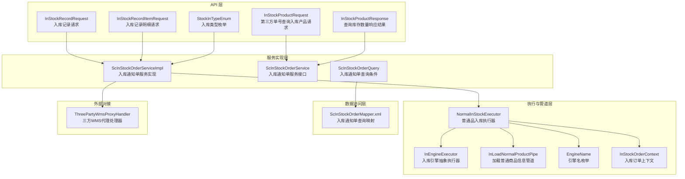
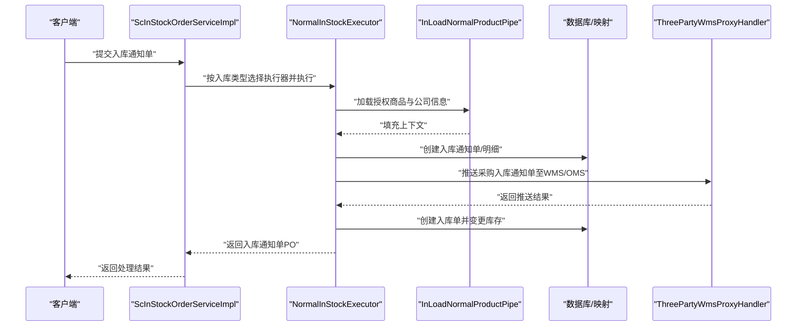
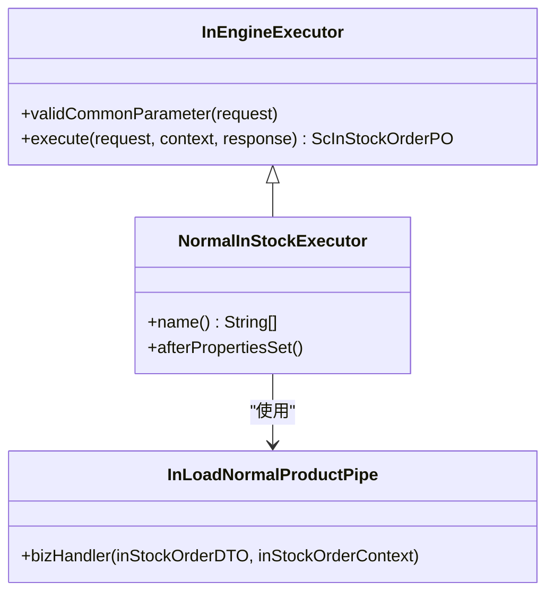
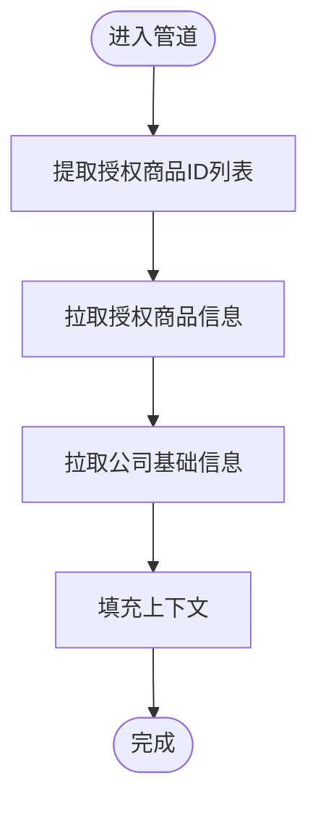
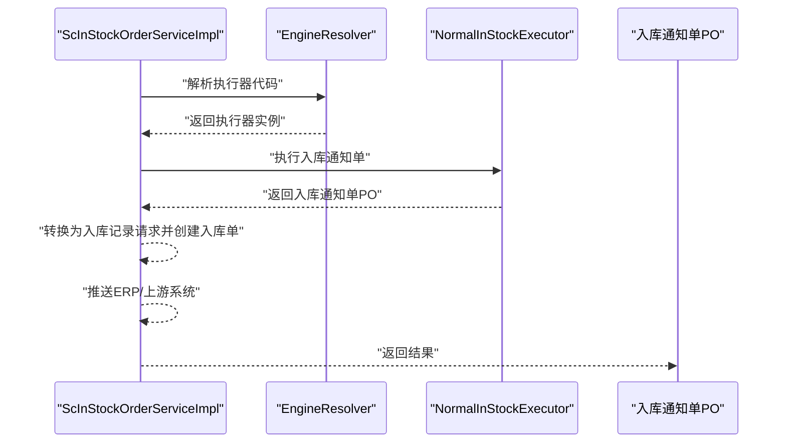
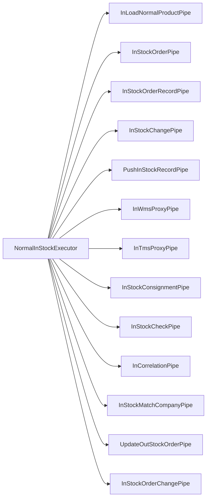

# 采购入库流程

<cite>
**本文引用的文件**
- [NormalInStockExecutor.java](file://guoke-deepexi-storage-center-provider/src/main/java/com/ deepexi/storage/handler/in/executor/NormalInStockExecutor.java)
- [InLoadNormalProductPipe.java](file://guoke-deepexi-storage-center-provider/src/main/java/com/ deepexi/storage/handler/in/pipe/normal/InLoadNormalProductPipe.java)
- [InEngineExecutor.java](file://guoke-deepexi-storage-center-provider/src/main/java/com/ deepexi/storage/handler/in/InEngineExecutor.java)
- [EngineName.java](file://guoke-deepexi-storage-center-provider/src/main/java/com/ deepexi/storage/handler/EngineName.java)
- [ScInStockOrderServiceImpl.java](file://guoke-deepexi-storage-center-provider/src/main/java/com/ deepexi/storage/service/impl/ScInStockOrderServiceImpl.java)
- [ScInStockOrderService.java](file://guoke-deepexi-storage-center-provider/src/main/java/com/ deepexi/storage/service/ScInStockOrderService.java)
- [InStockRecordRequest.java](file://guoke-deepexi-storage-center-api/src/main/java/com/deepexi/api/storage/dto/in/InStockRecordRequest.java)
- [InStockRecordItemRequest.java](file://guoke-deepexi-storage-center-api/src/main/java/com/deepexi/api/storage/dto/in/InStockRecordItemRequest.java)
- [InStockProductRequest.java](file://guoke-deepexi-storage-center-api/src/main/java/com/deepexi/api/storage/dto/in/InStockProductRequest.java)
- [InStockProductResponse.java](file://guoke-deepexi-storage-center-api/src/main/java/com/deepexi/api/storage/dto/in/InStockProductResponse.java)
- [StockInTypeEnum.java](file://guoke-deepexi-storage-center-api/src/main/java/com/deepexi/api/storage/enums/in/StockInTypeEnum.java)
- [ScInStockOrderQuery.java](file://guoke-deepexi-storage-center-provider/src/main/java/com/ deepexi/storage/pojo/query/stockin/ScInStockOrderQuery.java)
- [ScInStockOrderMapper.xml](file://guoke-deepexi-storage-center-provider/src/main/resources/mapper/stockin/ScInStockOrderMapper.xml)
- [ThreePartyWmsProxyHandler.java](file://guoke-deepexi-storage-center-provider/src/main/java/com/ deepexi/storage/service/hanlder/ThreePartyWmsProxyHandler.java)
- [InStockOrderContext.java](file://guoke-deepexi-storage-center-provider/src/main/java/com/ deepexi/storage/handler/in/bo/InStockOrderContext.java)
</cite>

## 目录
1. [简介](#简介)
2. [项目结构](#项目结构)
3. [核心组件](#核心组件)
4. [架构总览](#架构总览)
5. [详细组件分析](#详细组件分析)
6. [依赖分析](#依赖分析)
7. [性能考虑](#性能考虑)
8. [故障排查指南](#故障排查指南)
9. [结论](#结论)
10. [附录](#附录)

## 简介
本文件面向“采购入库”业务场景，系统性梳理从“订单创建、商品验收、库存更新”到“上游系统对接”的完整流程，重点解析 NormalInStockExecutor 执行器与 InLoadNormalProductPipe 管道的工作机制，明确相关 API 的请求参数与响应格式，并说明与供应商管理、采购订单、质量检验等系统的集成方式。文档同时提供可视化图示与可操作的配置说明，帮助开发者快速理解与扩展采购入库能力。

## 项目结构
围绕采购入库的关键模块分布如下：
- 提供者侧服务与处理器：负责业务执行、管道编排、上下文传递、与外部系统对接。
- API 定义：定义入库通知单、入库记录、产品查询等 DTO 与枚举。
- 数据访问层：提供入库通知单、明细、记录等的查询与映射。

图表来源
- [ScInStockOrderServiceImpl.java](file://guoke-deepexi-storage-center-provider/src/main/java/com/deepexi/storage/service/impl/ScInStockOrderServiceImpl.java)
- [InEngineExecutor.java](file://guoke-deepexi-storage-center-provider/src/main/java/com/deepexi/storage/handler/in/InEngineExecutor.java)
- [NormalInStockExecutor.java](file://guoke-deepexi-storage-center-provider/src/main/java/com/deepexi/storage/handler/in/executor/NormalInStockExecutor.java)
- [InLoadNormalProductPipe.java](file://guoke-deepexi-storage-center-provider/src/main/java/com/deepexi/storage/handler/in/pipe/normal/InLoadNormalProductPipe.java)
- [EngineName.java](file://guoke-deepexi-storage-center-provider/src/main/java/com/deepexi/storage/handler/EngineName.java)
- [InStockOrderContext.java](file://guoke-deepexi-storage-center-provider/src/main/java/com/deepexi/storage/handler/in/bo/InStockOrderContext.java)
- [InStockRecordRequest.java](file://guoke-deepexi-storage-center-api/src/main/java/com/deepexi/api/storage/dto/in/InStockRecordRequest.java)
- [InStockRecordItemRequest.java](file://guoke-deepexi-storage-center-api/src/main/java/com/deepexi/api/storage/dto/in/InStockRecordItemRequest.java)
- [InStockProductRequest.java](file://guoke-deepexi-storage-center-api/src/main/java/com/deepexi/api/storage/dto/in/InStockProductRequest.java)
- [InStockProductResponse.java](file://guoke-deepexi-storage-center-api/src/main/java/com/deepexi/api/storage/dto/in/InStockProductResponse.java)
- [StockInTypeEnum.java](file://guoke-deepexi-storage-center-api/src/main/java/com/deepexi/api/storage/enums/in/StockInTypeEnum.java)
- [ScInStockOrderQuery.java](file://guoke-deepexi-storage-center-provider/src/main/java/com/deepexi/storage/pojo/query/stockin/ScInStockOrderQuery.java)
- [ScInStockOrderMapper.xml](file://guoke-deepexi-storage-center-provider/src/main/resources/mapper/stockin/ScInStockOrderMapper.xml)
- [ThreePartyWmsProxyHandler.java](file://guoke-deepexi-storage-center-provider/src/main/java/com/deepexi/storage/service/hanlder/ThreePartyWmsProxyHandler.java)

章节来源
- [ScInStockOrderServiceImpl.java](file://guoke-deepexi-storage-center-provider/src/main/java/com/deepexi/storage/service/impl/ScInStockOrderServiceImpl.java)
- [InEngineExecutor.java](file://guoke-deepexi/storage/handler/in/InEngineExecutor.java)
- [NormalInStockExecutor.java](file://guoke-deepexi-storage-center-provider/src/main/java/com/deepexi/storage/handler/in/executor/NormalInStockExecutor.java)
- [InLoadNormalProductPipe.java](file://guoke-deepexi-storage-center-provider/src/main/java/com/deepexi/storage/handler/in/pipe/normal/InLoadNormalProductPipe.java)
- [EngineName.java](file://guoke-deepexi-storage-center-provider/src/main/java/com/deepexi/storage/handler/EngineName.java)
- [InStockOrderContext.java](file://guoke-deepexi-storage-center-provider/src/main/java/com/deepexi/storage/handler/in/bo/InStockOrderContext.java)
- [InStockRecordRequest.java](file://guoke-deepexi-storage-center-api/src/main/java/com/deepexi/api/storage/dto/in/InStockRecordRequest.java)
- [InStockRecordItemRequest.java](file://guoke-deepexi-storage-center-api/src/main/java/com/deepexi/api/storage/dto/in/InStockRecordItemRequest.java)
- [InStockProductRequest.java](file://guoke-deepexi-storage-center-api/src/main/java/com/deepexi/api/storage/dto/in/InStockProductRequest.java)
- [InStockProductResponse.java](file://guoke-deepexi-storage-center-api/src/main/java/com/deepexi/api/storage/dto/in/InStockProductResponse.java)
- [StockInTypeEnum.java](file://guoke-deepexi-storage-center-api/src/main/java/com/deepexi/api/storage/enums/in/StockInTypeEnum.java)
- [ScInStockOrderQuery.java](file://guoke-deepexi-storage-center-provider/src/main/java/com/deepexi/storage/pojo/query/stockin/ScInStockOrderQuery.java)
- [ScInStockOrderMapper.xml](file://guoke-deepexi-storage-center-provider/src/main/resources/mapper/stockin/ScInStockOrderMapper.xml)
- [ThreePartyWmsProxyHandler.java](file://guoke-deepexi-storage-center-provider/src/main/java/com/deepexi/storage/service/hanlder/ThreePartyWmsProxyHandler.java)

## 核心组件
- 入库通知单服务实现：负责接收入库通知单、选择执行器、编排流水线、调用外部系统、回写状态与推送 ERP。
- 入库引擎执行器：抽象出通用的执行框架，支持不同入库类型的执行器扩展。
- 普通品入库执行器：面向“采购入库”的具体执行器，串联配置加载、商品信息加载、订单创建、质检、WMS/TMS 推送、入库单创建、寄售处理、库存变更、状态更新、上游推送等步骤。
- 加载普通商品信息管道：负责拉取授权商品与公司基础信息，填充上下文。
- API DTO 与枚举：定义入库记录请求、明细请求、产品查询请求/响应以及入库类型枚举。
- 外部对接：与三方 WMS/OMS 等系统进行对接，推送采购入库通知单与状态。

章节来源
- [ScInStockOrderServiceImpl.java](file://guoke-deepexi-storage-center-provider/src/main/java/com/deepexi/storage/service/impl/ScInStockOrderServiceImpl.java)
- [InEngineExecutor.java](file://guoke-deepexi-storage-center-provider/src/main/java/com/deepexi/storage/handler/in/InEngineExecutor.java)
- [NormalInStockExecutor.java](file://guoke-deepexi-storage-center-provider/src/main/java/com/deepexi/storage/handler/in/executor/NormalInStockExecutor.java)
- [InLoadNormalProductPipe.java](file://guoke-deepexi-storage-center-provider/src/main/java/com/deepexi/storage/handler/in/pipe/normal/InLoadNormalProductPipe.java)
- [InStockRecordRequest.java](file://guoke-deepexi-storage-center-api/src/main/java/com/deepexi/api/storage/dto/in/InStockRecordRequest.java)
- [InStockRecordItemRequest.java](file://guoke-deepexi-storage-center-api/src/main/java/com/deepexi/api/storage/dto/in/InStockRecordItemRequest.java)
- [InStockProductRequest.java](file://guoke-deepexi-storage-center-api/src/main/java/com/deepexi/api/storage/dto/in/InStockProductRequest.java)
- [InStockProductResponse.java](file://guoke-deepexi-storage-center-api/src/main/java/com/deepexi/api/storage/dto/in/InStockProductResponse.java)
- [StockInTypeEnum.java](file://guoke-deepexi-storage-center-api/src/main/java/com/deepexi/api/storage/enums/in/StockInTypeEnum.java)
- [ThreePartyWmsProxyHandler.java](file://guoke-deepexi-storage-center-provider/src/main/java/com/deepexi/storage/service/hanlder/ThreePartyWmsProxyHandler.java)

## 架构总览
下图展示“采购入库”从请求到落库与外部系统对接的整体流程：

图表来源
- [ScInStockOrderServiceImpl.java](file://guoke-deepexi-storage-center-provider/src/main/java/com/deepexi/storage/service/impl/ScInStockOrderServiceImpl.java)
- [NormalInStockExecutor.java](file://guoke-deepexi-storage-center-provider/src/main/java/com/deepexi/storage/handler/in/executor/NormalInStockExecutor.java)
- [InLoadNormalProductPipe.java](file://guoke-deepexi-storage-center-provider/src/main/java/com/deepexi/storage/handler/in/pipe/normal/InLoadNormalProductPipe.java)
- [ThreePartyWmsProxyHandler.java](file://guoke-deepexi-storage-center-provider/src/main/java/com/deepexi/storage/service/hanlder/ThreePartyWmsProxyHandler.java)

## 详细组件分析

### NormalInStockExecutor 执行器工作机制
- 角色定位：面向“普通品采购入库”的执行器，负责串联完整的入库流程。
- 流水线步骤（按顺序）：
  1) 配置加载
  2) 加载普通商品信息
  3) 关联单据处理（采购单-入库通知单）
  4) 匹配业务公司信息
  5) 创建入库通知单
  6) 更新出库单状态
  7) 质检处理
  8) 推送代理仓库入库通知单（WMS）
  9) 推送TMS生成物流运单
  10) 创建入库单
  11) 寄售处理
  12) 变更库存
  13) 修改入库通知单数量与状态
  14) 推送上游业务入库数据

图表来源
- [InEngineExecutor.java](file://guoke-deepexi-storage-center-provider/src/main/java/com/deepexi/storage/handler/in/InEngineExecutor.java)
- [NormalInStockExecutor.java](file://guoke-deepexi-storage-center-provider/src/main/java/com/deepexi/storage/handler/in/executor/NormalInStockExecutor.java)
- [InLoadNormalProductPipe.java](file://guoke-deepexi-storage-center-provider/src/main/java/com/deepexi/storage/handler/in/pipe/normal/InLoadNormalProductPipe.java)

章节来源
- [NormalInStockExecutor.java](file://guoke-deepexi-storage-center-provider/src/main/java/com/deepexi/storage/handler/in/executor/NormalInStockExecutor.java)
- [InEngineExecutor.java](file://guoke-deepexi-storage-center-provider/src/main/java/com/deepexi/storage/handler/in/InEngineExecutor.java)
- [InLoadNormalProductPipe.java](file://guoke-deepexi-storage-center-provider/src/main/java/com/deepexi/storage/handler/in/pipe/normal/InLoadNormalProductPipe.java)

### InLoadNormalProductPipe 管道工作机制
- 过滤逻辑：默认不过滤，直接进入业务处理。
- 业务处理：
  - 从入库通知单明细中提取授权商品 ID 列表。
  - 拉取授权商品信息与公司基础信息，填充到上下文中，供后续步骤使用。
- 上下文作用：为后续创建入库通知单、质检、WMS/TMS 推送、库存变更等步骤提供必要的商品与公司维度数据。

图表来源
- [InLoadNormalProductPipe.java](file://guoke-deepexi-storage-center-provider/src/main/java/com/deepexi/storage/handler/in/pipe/normal/InLoadNormalProductPipe.java)
- [InStockOrderContext.java](file://guoke-deepexi-storage-center-provider/src/main/java/com/deepexi/storage/handler/in/bo/InStockOrderContext.java)

章节来源
- [InLoadNormalProductPipe.java](file://guoke-deepexi-storage-center-provider/src/main/java/com/deepexi/storage/handler/in/pipe/normal/InLoadNormalProductPipe.java)
- [InStockOrderContext.java](file://guoke-deepexi-storage-center-provider/src/main/java/com/deepexi/storage/handler/in/bo/InStockOrderContext.java)

### 入库通知单服务实现（采购入库入口）
- 入口方法：接收入库通知单 DTO，依据入库类型选择执行器，执行后返回入库通知单 PO。
- 关键行为：
  - 根据入库类型映射到对应执行器代码。
  - 通过引擎解析器获取执行器并执行。
  - 将执行结果封装为入库通知单 PO 返回。
- 后续动作：
  - 将入库通知单转换为入库记录请求，创建入库单并变更库存。
  - 推送 ERP 与上游系统状态。

图表来源
- [ScInStockOrderServiceImpl.java](file://guoke-deepexi-storage-center-provider/src/main/java/com/deepexi/storage/service/impl/ScInStockOrderServiceImpl.java)
- [EngineName.java](file://guoke-deepexi-storage-center-provider/src/main/java/com/deepexi/storage/handler/EngineName.java)

章节来源
- [ScInStockOrderServiceImpl.java](file://guoke-deepexi-storage-center-provider/src/main/java/com/deepexi/storage/service/impl/ScInStockOrderServiceImpl.java)
- [EngineName.java](file://guoke-deepexi-storage-center-provider/src/main/java/com/deepexi/storage/handler/EngineName.java)

### API 接口与数据模型

#### 入库记录请求与明细
- 入库记录请求
  - 字段要点：入库通知单 ID、明细列表（必填且数量范围限制）。
  - 用途：用于创建入库单时提交明细。
- 入库记录明细请求
  - 必填字段：仓库 ID、货架 ID、货位 ID、批号、入库数量（≥1）。
  - 可选字段：主码、序列号、UDI、生产/有效日期、质检异常数量等。

章节来源
- [InStockRecordRequest.java](file://guoke-deepexi-storage-center-api/src/main/java/com/deepexi/api/storage/dto/in/InStockRecordRequest.java)
- [InStockRecordItemRequest.java](file://guoke-deepexi-storage-center-api/src/main/java/com/deepexi/api/storage/dto/in/InStockRecordItemRequest.java)

#### 第三方单号查询入库产品
- 请求参数：三方单号、公司 ID。
- 响应参数：授权产品 ID、总数量。

章节来源
- [InStockProductRequest.java](file://guoke-deepexi-storage-center-api/src/main/java/com/deepexi/api/storage/dto/in/InStockProductRequest.java)
- [InStockProductResponse.java](file://guoke-deepexi-storage-center-api/src/main/java/com/deepexi/api/storage/dto/in/InStockProductResponse.java)

#### 入库类型枚举
- 采购入库：对应入库类型枚举中的“采购入库”。
- 其他类型：样品、1+2、其它、冲红、T3、拒收等。

章节来源
- [StockInTypeEnum.java](file://guoke-deepexi-storage-center-api/src/main/java/com/deepexi/api/storage/enums/in/StockInTypeEnum.java)

### 与供应商管理、采购订单、质量检验的集成

#### 供应商管理与公司信息
- 在加载普通商品信息管道中，会拉取公司基础信息（如货主公司、物权所属公司等），用于后续单据与 WMS/TMS 推送。
- 入库通知单服务实现中也会根据公司配置推送 ERP 状态。

章节来源
- [InLoadNormalProductPipe.java](file://guoke-deepexi-storage-center-provider/src/main/java/com/deepexi/storage/handler/in/pipe/normal/InLoadNormalProductPipe.java)
- [ScInStockOrderServiceImpl.java](file://guoke-deepexi-storage-center-provider/src/main/java/com/deepexi/storage/service/impl/ScInStockOrderServiceImpl.java)

#### 采购订单与欠货记录
- 通过入库通知单查询条件与映射，支持按供应商名称、入库单类型、业务类型等过滤欠货记录。
- 支持根据三方单号查询入库产品数量，辅助采购对账与补货。

章节来源
- [ScInStockOrderQuery.java](file://guoke-deepexi-storage-center-provider/src/main/java/com/deepexi/storage/pojo/query/stockin/ScInStockOrderQuery.java)
- [ScInStockOrderMapper.xml](file://guoke-deepexi-storage-center-provider/src/main/resources/mapper/stockin/ScInStockOrderMapper.xml)
- [InStockProductRequest.java](file://guoke-deepexi-storage-center-api/src/main/java/com/deepexi/api/storage/dto/in/InStockProductRequest.java)
- [InStockProductResponse.java](file://guoke-deepexi-storage-center-api/src/main/java/com/deepexi/api/storage/dto/in/InStockProductResponse.java)

#### 质量检验
- 入库流程包含质检处理步骤，可在入库记录明细中传入质检异常数量，用于后续库存与状态控制。

章节来源
- [NormalInStockExecutor.java](file://guoke-deepexi-storage-center-provider/src/main/java/com/deepexi/storage/handler/in/executor/NormalInStockExecutor.java)
- [InStockRecordItemRequest.java](file://guoke-deepexi-storage-center-api/src/main/java/com/deepexi/api/storage/dto/in/InStockRecordItemRequest.java)

### 外部系统对接（WMS/OMS/TMS/ERP）
- 三方 WMS/OMS 对接：在创建入库通知单后，推送采购入库通知单至外部系统，并记录接口日志。
- TMS 推送：在入库流程中包含推送 TMS 生成物流运单的步骤。
- ERP 推送：根据入库通知单类型与状态，推送 ERP 系统更新。

章节来源
- [ThreePartyWmsProxyHandler.java](file://guoke-deepexi-storage-center-provider/src/main/java/com/deepexi/storage/service/hanlder/ThreePartyWmsProxyHandler.java)
- [NormalInStockExecutor.java](file://guoke-deepexi-storage-center-provider/src/main/java/com/deepexi/storage/handler/in/executor/NormalInStockExecutor.java)
- [ScInStockOrderServiceImpl.java](file://guoke-deepexi-storage-center-provider/src/main/java/com/deepexi/storage/service/impl/ScInStockOrderServiceImpl.java)

## 依赖分析
- 执行器与管道耦合：NormalInStockExecutor 组合多个管道，形成强内聚的执行链；InEngineExecutor 提供统一的执行框架。
- 上下文传递：InStockOrderContext 在各管道间传递授权商品与公司信息，降低重复查询成本。
- 外部系统依赖：通过 ThreePartyWmsProxyHandler 与外部系统交互，保证流程可扩展与解耦。

图表来源
- [NormalInStockExecutor.java](file://guoke-deepexi-storage-center-provider/src/main/java/com/deepexi/storage/handler/in/executor/NormalInStockExecutor.java)
- [InEngineExecutor.java](file://guoke-deepexi-storage-center-provider/src/main/java/com/deepexi/storage/handler/in/InEngineExecutor.java)

章节来源
- [NormalInStockExecutor.java](file://guoke-deepexi-storage-center-provider/src/main/java/com/deepexi/storage/handler/in/executor/NormalInStockExecutor.java)
- [InEngineExecutor.java](file://guoke-deepexi-storage-center-provider/src/main/java/com/deepexi/storage/handler/in/InEngineExecutor.java)

## 性能考虑
- 管道复用与上下文缓存：通过 InStockOrderContext 缓存授权商品与公司信息，减少重复查询。
- 批量处理：入库记录明细支持批量提交，建议前端按批次聚合，避免单次请求过大。
- 外部系统幂等：WMS/OMS/TMS 推送需具备幂等校验，避免重复推送导致的数据不一致。
- 数据库分页与过滤：查询欠货记录时合理使用过滤条件，避免全表扫描。

## 故障排查指南
- 入库通知单创建失败
  - 检查入库类型是否正确，确认执行器代码映射。
  - 查看执行器流水线中是否有异常步骤阻塞。
- 商品信息缺失
  - 确认授权商品 ID 是否正确，检查授权商品与公司信息拉取是否成功。
- 外部系统对接异常
  - 查看接口日志记录，确认请求体与返回体。
  - 核对外部系统可用性与鉴权配置。
- ERP 推送失败
  - 检查公司配置与推送状态，必要时重试或人工干预。

章节来源
- [ScInStockOrderServiceImpl.java](file://guoke-deepexi-storage-center-provider/src/main/java/com/deepexi/storage/service/impl/ScInStockOrderServiceImpl.java)
- [ThreePartyWmsProxyHandler.java](file://guoke-deepexi-storage-center-provider/src/main/java/com/deepexi/storage/service/hanlder/ThreePartyWmsProxyHandler.java)

## 结论
采购入库流程以 NormalInStockExecutor 为核心，通过 InLoadNormalProductPipe 等管道完成商品与公司信息加载，并串联订单创建、质检、WMS/TMS 推送、入库单创建、寄售处理、库存变更与状态更新等关键环节。配合完善的 API 定义与外部系统对接，能够满足多场景的采购入库需求。建议在实际落地中关注上下文缓存、批量处理与外部系统幂等设计，确保流程稳定与高效。

## 附录

### 配置说明（示例）
- 执行器选择
  - 入库类型为“采购入库”时，执行器代码为“商品入库通知单”，由服务实现层根据类型映射。
- 管道顺序
  - 普通品入库执行器固定按预设顺序串联各管道，若需新增步骤，应在执行器初始化阶段追加。
- 外部系统对接
  - WMS/OMS/TMS 推送需在执行器中启用相应管道，并确保接口日志记录与重试策略。

章节来源
- [EngineName.java](file://guoke-deepexi-storage-center-provider/src/main/java/com/deepexi/storage/handler/EngineName.java)
- [NormalInStockExecutor.java](file://guoke-deepexi-storage-center-provider/src/main/java/com/deepexi/storage/handler/in/executor/NormalInStockExecutor.java)
- [ThreePartyWmsProxyHandler.java](file://guoke-deepexi-storage-center-provider/src/main/java/com/deepexi/storage/service/hanlder/ThreePartyWmsProxyHandler.java)