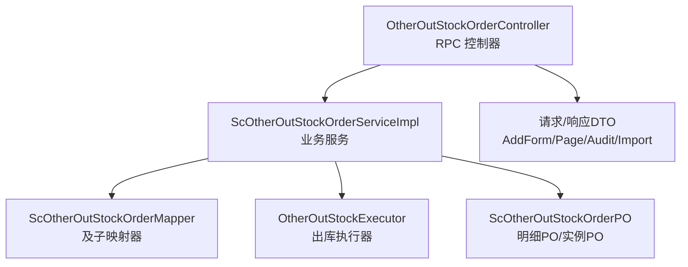
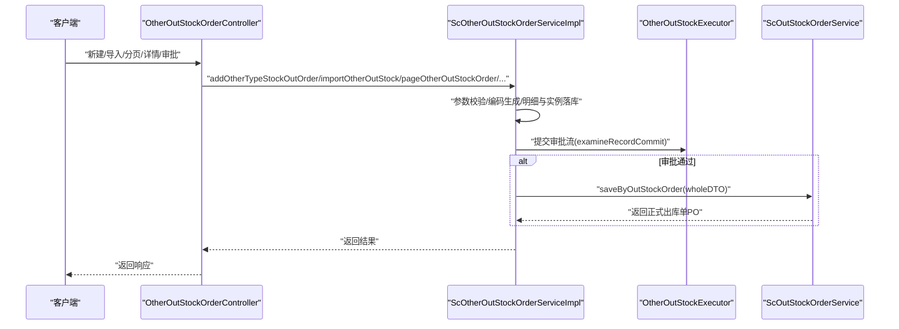
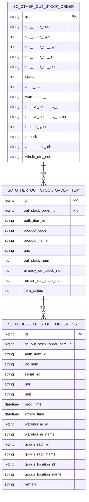
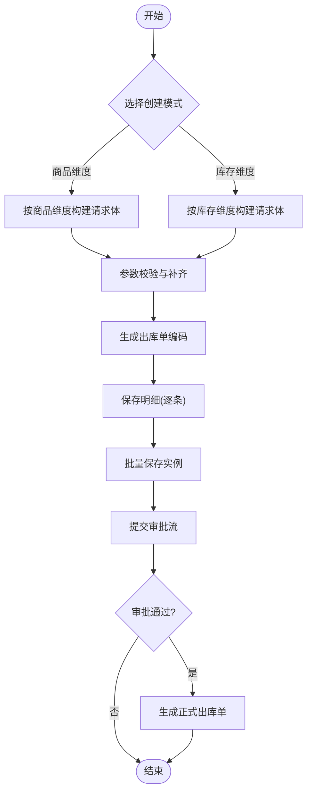
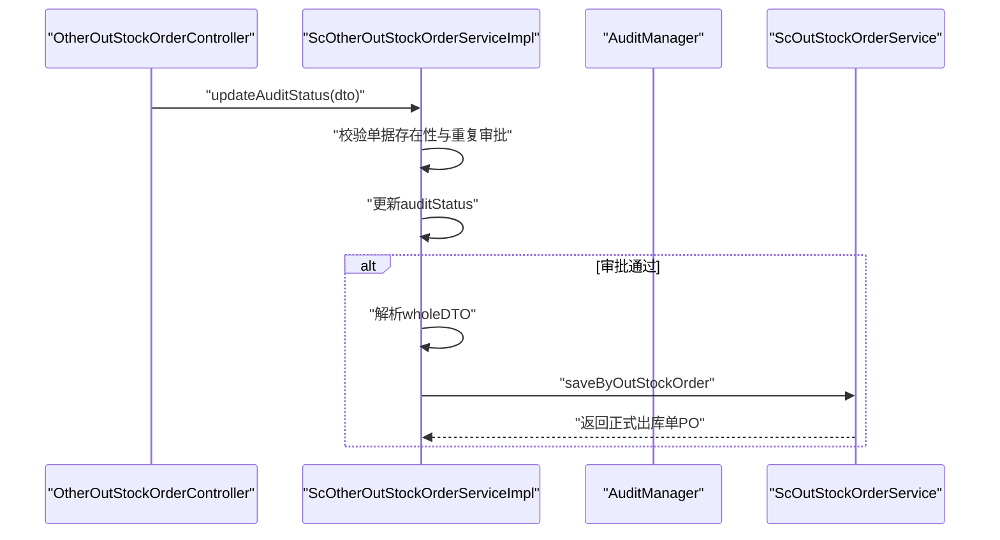
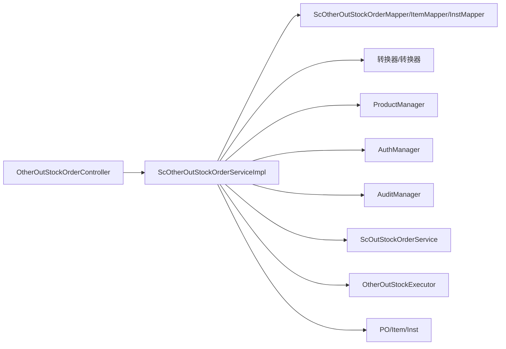

# 其他出库流程

<cite>
**本文引用的文件**
- [ScOtherOutStockOrderServiceImpl.java](file://guoke-deepexi-storage-center-provider/src/main/java/com/deepexi/storage/service/impl/ScOtherOutStockOrderServiceImpl.java)
- [OtherOutStockOrderController.java](file://guoke-deepexi-storage-center-provider/src/main/java/com/deepexi/storage/controller/rpc/OtherOutStockOrderController.java)
- [OtherOutStockExecutor.java](file://guoke-deepexi-storage-center-provider/src/main/java/com/deepexi/storage/handler/out/executor/OtherOutStockExecutor.java)
- [StockOutObjTypeEnum.java](file://guoke-deepexi-storage-center-api/src/main/java/com/deepexi/api/storage/enums/out/StockOutObjTypeEnum.java)
- [BrokenTypeEnum.java](file://guoke-deepexi-storage-center-api/src/main/java/com/deepexi/api/storage/enums/out/BrokenTypeEnum.java)
- [StockOutTypeEnum.java](file://guoke-deepexi-storage-center-api/src/main/java/com/deepexi/api/storage/enums/out/StockOutTypeEnum.java)
- [ScOtherOutStockOrderPO.java](file://guoke-deepexi-storage-center-provider/src/main/java/com/deepexi/storage/model/ScOtherOutStockOrderPO.java)
- [ScOtherOutStockOrderItemPO.java](file://guoke-deepexi-storage-center-provider/src/main/java/com/deepexi/storage/model/ScOtherOutStockOrderItemPO.java)
- [ScOtherOutStockOrderInstPO.java](file://guoke-deepexi-storage-center-provider/src/main/java/com/deepexi/storage/model/ScOtherOutStockOrderInstPO.java)
- [ScOtherOutStockOrderInstService.java](file://guoke-deepexi-storage-center-provider/src/main/java/com/deepexi/storage/service/ScOtherOutStockOrderInstService.java)
- [ScOtherOutStockOrderInstServiceImpl.java](file://guoke-deepexi-storage-center-provider/src/main/java/com/deepexi/storage/service/impl/ScOtherOutStockOrderInstServiceImpl.java)
- [ScOtherOutStockOrderItemService.java](file://guoke-deepexi-storage-center-provider/src/main/java/com/deepexi/storage/service/ScOtherOutStockOrderItemService.java)
- [ScOtherOutStockOrderItemServiceImpl.java](file://guoke-deepexi-storage-center-provider/src/main/java/com/deepexi/storage/service/impl/ScOtherOutStockOrderItemServiceImpl.java)
- [ScOtherTypeOutStockOrderAddForm.java](file://guoke-deepexi-storage-center-api/src/main/java/com/deepexi/api/storage/dto/otheroutstock/request/ScOtherTypeOutStockOrderAddForm.java)
- [OtherOutStockOrderDetailResponse.java](file://guoke-deepexi-storage-center-api/src/main/java/com/deepexi/api/storage/dto/otheroutstock/response/OtherOutStockOrderDetailResponse.java)
- [OtherOutStockOrderPageRequest.java](file://guoke-deepexi-storage-center-api/src/main/java/com/deepexi/api/storage/dto/otheroutstock/request/OtherOutStockOrderPageRequest.java)
- [OtherOutStockOrderPageResponse.java](file://guoke-deepexi-storage-center-api/src/main/java/com/deepexi/api/storage/dto/otheroutstock/response/OtherOutStockOrderPageResponse.java)
- [OtherOutStockOrderAuditRequest.java](file://guoke-deepexi-storage-center-api/src/main/java/com/deepexi/api/storage/dto/otheroutstock/request/OtherOutStockOrderAuditRequest.java)
- [OtherOutStockImportResponse.java](file://guoke-deepexi-storage-center-api/src/main/java/com/deepexi/api/storage/dto/out/OtherOutStockImportResponse.java)
- [OutStockImportParamDTO.java](file://guoke-deepexi-storage-center-api/src/main/java/com/deepexi/api/storage/dto/out/OutStockImportParamDTO.java)
- [OutStockImportRequest.java](file://guoke-deepexi-storage-center-api/src/main/java/com/deepexi/api/storage/dto/out/OutStockImportRequest.java)
- [OutStockImportResponse.java](file://guoke-deepexi-storage-center-api/src/main/java/com/deepexi/api/storage/dto/out/OutStockImportResponse.java)
- [StockOutRelatedOrderTypeEnum.java](file://guoke-deepexi-storage-center-api/src/main/java/com/deepexi/api/storage/enums/StockOutRelatedOrderTypeEnum.java)
</cite>

## 目录
1. [简介](#简介)
2. [项目结构](#项目结构)
3. [核心组件](#核心组件)
4. [架构总览](#架构总览)
5. [详细组件分析](#详细组件分析)
6. [依赖分析](#依赖分析)
7. [性能考虑](#性能考虑)
8. [故障排查指南](#故障排查指南)
9. [结论](#结论)
10. [附录](#附录)

## 简介
本文件面向国科恒泰仓储管理系统中的“其他出库流程”，系统性梳理除销售、退货、调拨之外的多种出库类型，包括但不限于：报损出库、样品出库、借货出库、借货还回、展览出库、盘亏出库、赔付出库等。文档重点阐述 ScOtherOutStockOrderServiceImpl 的实现机制、各类出库类型的业务规则、审批流程与权限控制、账务处理方式、特殊数据模型与状态管理，并提供配置方法与异常处理策略。

## 项目结构
围绕“其他出库”的核心模块由以下层次构成：
- 控制层：OtherOutStockOrderController 提供 RPC 接口，负责参数校验与调用服务层。
- 服务层：ScOtherOutStockOrderServiceImpl 实现业务编排，包括单据创建、导入校验、审批流转、生成正式出库单等。
- 执行器：OtherOutStockExecutor 定义出库引擎执行流水线，串联配置加载、出库通知单、产品信息、拣货、出库单生成等步骤。
- 数据模型：ScOtherOutStockOrderPO、ScOtherOutStockOrderItemPO、ScOtherOutStockOrderInstPO 构成“其他出库单-明细-实例”的三层结构。
- 映射与服务：Mapper 与 Service 实现对明细与实例的增删改查；控制器与服务通过 DTO/PO 转换器对接。

图表来源
- [OtherOutStockOrderController.java:1-128](file://guoke-deepexi-storage-center-provider/src/main/java/com/deepexi/storage/controller/rpc/OtherOutStockOrderController.java#L1-L128)
- [ScOtherOutStockOrderServiceImpl.java:1-660](file://guoke-deepexi-storage-center-provider/src/main/java/com/deepexi/storage/service/impl/ScOtherOutStockOrderServiceImpl.java#L1-L660)
- [OtherOutStockExecutor.java:1-51](file://guoke-deepexi-storage-center-provider/src/main/java/com/deepexi/storage/handler/out/executor/OtherOutStockExecutor.java#L1-L51)
- [ScOtherOutStockOrderPO.java:1-251](file://guoke-deepexi-storage-center-provider/src/main/java/com/deepexi/storage/model/ScOtherOutStockOrderPO.java#L1-L251)

章节来源
- [OtherOutStockOrderController.java:1-128](file://guoke-deepexi-storage-center-provider/src/main/java/com/deepexi/storage/controller/rpc/OtherOutStockOrderController.java#L1-L128)
- [ScOtherOutStockOrderServiceImpl.java:1-660](file://guoke-deepexi-storage-center-provider/src/main/java/com/deepexi/storage/service/impl/ScOtherOutStockOrderServiceImpl.java#L1-L660)
- [OtherOutStockExecutor.java:1-51](file://guoke-deepexi-storage-center-provider/src/main/java/com/deepexi/storage/handler/out/executor/OtherOutStockExecutor.java#L1-L51)
- [ScOtherOutStockOrderPO.java:1-251](file://guoke-deepexi-storage-center-provider/src/main/java/com/deepexi/storage/model/ScOtherOutStockOrderPO.java#L1-L251)

## 核心组件
- ScOtherOutStockOrderServiceImpl：核心业务实现，负责单据创建、导入校验、审批状态更新、生成正式出库单、编码生成、参数补齐、明细与实例落库、提交审批流等。
- OtherOutStockOrderController：对外暴露 RPC 接口，负责参数校验（如调拨/借货/借货还回需填写收货方）、调用服务层并封装响应。
- OtherOutStockExecutor：定义出库引擎执行流水线，按顺序加载配置、创建出库通知单、加载产品信息、拣货、生成出库单等。
- 数据模型：三层结构支撑“其他出库单”的完整性与可追溯性，实例层支持批号、序列号、UDI、货位等精细化管理。
- 明细与实例服务：分别提供按明细ID集合查询实例、按出库单ID查询明细等能力，保障查询与落库的一致性。

章节来源
- [ScOtherOutStockOrderServiceImpl.java:1-660](file://guoke-deepexi-storage-center-provider/src/main/java/com/deepexi/storage/service/impl/ScOtherOutStockOrderServiceImpl.java#L1-L660)
- [OtherOutStockOrderController.java:1-128](file://guoke-deepexi-storage-center-provider/src/main/java/com/deepexi/storage/controller/rpc/OtherOutStockOrderController.java#L1-L128)
- [OtherOutStockExecutor.java:1-51](file://guoke-deepexi-storage-center-provider/src/main/java/com/deepexi/storage/handler/out/executor/OtherOutStockExecutor.java#L1-L51)
- [ScOtherOutStockOrderItemService.java:1-25](file://guoke-deepexi-storage-center-provider/src/main/java/com/deepexi/storage/service/ScOtherOutStockOrderItemService.java#L1-L25)
- [ScOtherOutStockOrderInstService.java:1-15](file://guoke-deepexi-storage-center-provider/src/main/java/com/deepexi/storage/service/ScOtherOutStockOrderInstService.java#L1-L15)

## 架构总览
下图展示了“其他出库”从接口到服务再到执行器的整体流程，以及与正式出库单的关系。

图表来源
- [OtherOutStockOrderController.java:36-125](file://guoke-deepexi-storage-center-provider/src/main/java/com/deepexi/storage/controller/rpc/OtherOutStockOrderController.java#L36-L125)
- [ScOtherOutStockOrderServiceImpl.java:202-230](file://guoke-deepexi-storage-center-provider/src/main/java/com/deepexi/storage/service/impl/ScOtherOutStockOrderServiceImpl.java#L202-L230)
- [OtherOutStockExecutor.java:24-49](file://guoke-deepexi-storage-center-provider/src/main/java/com/deepexi/storage/handler/out/executor/OtherOutStockExecutor.java#L24-L49)

## 详细组件分析

### 1) 出库类型与业务规则
- 出库类型大类：销售出库、其他出库、采退出库、样品出库、1+2模式出库、T3出库（参见枚举）。
- 其他出库类型：借货出库、展览出库、报损出库、盘亏出库、归还报损出库、赔付出库、换货出库、调拨出库、借货还回等。
- 报损类型：过效期、实物丢失、实物破损、其他。
- 关联订单类型：批发、寄售、跟台、补货、其他。

章节来源
- [StockOutTypeEnum.java:1-65](file://guoke-deepexi-storage-center-api/src/main/java/com/deepexi/api/storage/enums/out/StockOutTypeEnum.java#L1-L65)
- [StockOutObjTypeEnum.java:1-396](file://guoke-deepexi-storage-center-api/src/main/java/com/deepexi/api/storage/enums/out/StockOutObjTypeEnum.java#L1-L396)
- [BrokenTypeEnum.java:1-37](file://guoke-deepexi-storage-center-api/src/main/java/com/deepexi/api/storage/enums/out/BrokenTypeEnum.java#L1-L37)
- [StockOutRelatedOrderTypeEnum.java:1-43](file://guoke-deepexi-storage-center-api/src/main/java/com/deepexi/api/storage/enums/StockOutRelatedOrderTypeEnum.java#L1-L43)

### 2) 数据模型与状态管理
- 单头：ScOtherOutStockOrderPO，包含出库单编号、出库类型、出库单类型、关联单编码、收货信息、仓库信息、物权/委托方、报损类型、状态、审批状态、备注、附件等。
- 明细：ScOtherOutStockOrderItemPO，包含授权产品信息、单位、数量、已出库/剩余数量、扫码状态、业务类型等。
- 实例：ScOtherOutStockOrderInstPO，包含批号、序列号、UDI、单位、生产/失效日期、货位信息、仓库/货架/货位ID与名称、备注等。
- 状态与审批：单头包含状态与审批状态字段，服务层在审批通过后将“wholeDTO”持久化，并触发正式出库单生成。

图表来源
- [ScOtherOutStockOrderPO.java:21-251](file://guoke-deepexi-storage-center-provider/src/main/java/com/deepexi/storage/model/ScOtherOutStockOrderPO.java#L21-L251)
- [ScOtherOutStockOrderItemPO.java:15-162](file://guoke-deepexi-storage-center-provider/src/main/java/com/deepexi/storage/model/ScOtherOutStockOrderItemPO.java#L15-L162)
- [ScOtherOutStockOrderInstPO.java:16-152](file://guoke-deepexi/storage/model/ScOtherOutStockOrderInstPO.java#L16-L152)

章节来源
- [ScOtherOutStockOrderPO.java:1-251](file://guoke-deepexi-storage-center-provider/src/main/java/com/deepexi/storage/model/ScOtherOutStockOrderPO.java#L1-L251)
- [ScOtherOutStockOrderItemPO.java:1-162](file://guoke-deepexi-storage-center-provider/src/main/java/com/deepexi/storage/model/ScOtherOutStockOrderItemPO.java#L1-L162)
- [ScOtherOutStockOrderInstPO.java:1-152](file://guoke-deepexi-storage-center-provider/src/main/java/com/deepexi/storage/model/ScOtherOutStockOrderInstPO.java#L1-L152)

### 3) 创建与导入流程
- 新建其他出库单：
  - 支持两种来源：按“商品维度”或“库存维度”构造出库请求体。
  - 参数校验：当出库类型为调拨/借货/借货还回时，要求填写收货方公司ID与名称。
  - 编码生成：报损出库使用独立前缀，其他类型使用统一前缀。
  - 明细与实例落库：按授权产品ID聚合数量，逐条保存明细以获取主键，再批量保存实例。
  - 提交审批流：通过 examineRecordCommit 提交审批。
- 导入其他出库单：
  - 参数初检：产品编码、单位、批号、数量、仓库/货架/货位、生产/失效日期等。
  - 库存校验：根据产品编码、批号、单位、生产/失效日期、序列号、UDI、仓库/货架/货位进行匹配与数量校验。
  - 数量矫正：按库存顺序扣减，确保出库数量不超过可用库存。
  - 组装正式出库请求并创建“其他出库单”，随后进入审批与生成正式出库单流程。

图表来源
- [ScOtherTypeOutStockOrderAddForm.java:83-182](file://guoke-deepexi-storage-center-api/src/main/java/com/deepexi/api/storage/dto/otheroutstock/request/ScOtherTypeOutStockOrderAddForm.java#L83-L182)
- [ScOtherOutStockOrderServiceImpl.java:232-294](file://guoke-deepexi-storage-center-provider/src/main/java/com/deepexi/storage/service/impl/ScOtherOutStockOrderServiceImpl.java#L232-L294)
- [OtherOutStockOrderController.java:36-56](file://guoke-deepexi-storage-center-provider/src/main/java/com/deepexi/storage/controller/rpc/OtherOutStockOrderController.java#L36-L56)

章节来源
- [ScOtherTypeOutStockOrderAddForm.java:1-184](file://guoke-deepexi-storage-center-api/src/main/java/com/deepexi/api/storage/dto/otheroutstock/request/ScOtherTypeOutStockOrderAddForm.java#L1-L184)
- [ScOtherOutStockOrderServiceImpl.java:232-294](file://guoke-deepexi-storage-center-provider/src/main/java/com/deepexi/storage/service/impl/ScOtherOutStockOrderServiceImpl.java#L232-L294)
- [OtherOutStockOrderController.java:36-56](file://guoke-deepexi-storage-center-provider/src/main/java/com/deepexi/storage/controller/rpc/OtherOutStockOrderController.java#L36-L56)

### 4) 审批流程与权限控制
- 审批状态：单头包含 auditStatus 字段，服务层在 updateAuditStatus 中更新状态并在通过时解析 wholeDTO 生成正式出库单。
- 权限控制：控制器在新增与导入时对特定出库类型强制校验收货方信息；服务层通过上下文获取公司ID、用户信息等。
- 执行器：定义出库执行流水线，按顺序加载配置、创建出库通知单、加载产品信息、拣货、生成出库单等步骤。

图表来源
- [ScOtherOutStockOrderServiceImpl.java:202-230](file://guoke-deepexi-storage-center-provider/src/main/java/com/deepexi/storage/service/impl/ScOtherOutStockOrderServiceImpl.java#L202-L230)
- [OtherOutStockExecutor.java:24-49](file://guoke-deepexi-storage-center-provider/src/main/java/com/deepexi/storage/handler/out/executor/OtherOutStockExecutor.java#L24-L49)

章节来源
- [ScOtherOutStockOrderServiceImpl.java:202-230](file://guoke-deepexi-storage-center-provider/src/main/java/com/deepexi/storage/service/impl/ScOtherOutStockOrderServiceImpl.java#L202-L230)
- [OtherOutStockOrderController.java:41-48](file://guoke-deepexi-storage-center-provider/src/main/java/com/deepexi/storage/controller/rpc/OtherOutStockOrderController.java#L41-L48)
- [OtherOutStockExecutor.java:1-51](file://guoke-deepexi-storage-center-provider/src/main/java/com/deepexi/storage/handler/out/executor/OtherOutStockExecutor.java#L1-L51)

### 5) 账务处理方式
- 正式出库单生成：审批通过后，服务层将“wholeDTO”解析为正式出库请求，调用 ScOutStockOrderService.saveByOutStockOrder 生成正式出库单。
- 关联关系：出库类型与入库类型存在映射关系（例如换货出库对应换货入库），便于账务与库存对账。
- 报损类型：报损出库单独编码规则与流程，报损类型字段用于后续财务/统计口径区分。

章节来源
- [ScOtherOutStockOrderServiceImpl.java:221-228](file://guoke-deepexi-storage-center-provider/src/main/java/com/deepexi/storage/service/impl/ScOtherOutStockOrderServiceImpl.java#L221-L228)
- [StockOutObjTypeEnum.java:165-201](file://guoke-deepexi-storage-center-api/src/main/java/com/deepexi/api/storage/enums/out/StockOutObjTypeEnum.java#L165-L201)

### 6) 特殊场景与配置
- 报损出库：支持报损类型（过效期、实物丢失、实物破损、其他），单头包含 brokenType 字段；详情接口单独提供。
- 样品出库：通过 busType 标识样品业务类型，参数补齐时会结合样品属性。
- 借货/借货还回/调拨：对收货方信息强制校验，确保下游物流与账务正确性。
- 执行器配置：OtherOutStockExecutor 在 afterPropertiesSet 中按固定顺序装配执行步骤，保证流程一致性。

章节来源
- [ScOtherOutStockOrderServiceImpl.java:296-303](file://guoke-deepexi-storage-center-provider/src/main/java/com/deepexi/storage/service/impl/ScOtherOutStockOrderServiceImpl.java#L296-L303)
- [OtherOutStockOrderController.java:41-48](file://guoke-deepexi-storage-center-provider/src/main/java/com/deepexi/storage/controller/rpc/OtherOutStockOrderController.java#L41-L48)
- [OtherOutStockExecutor.java:34-49](file://guoke-deepexi-storage-center-provider/src/main/java/com/deepexi/storage/handler/out/executor/OtherOutStockExecutor.java#L34-L49)

### 7) 查询与分页
- 分页查询：支持按仓库名称模糊查询、按出库类型/报损类型/状态等筛选，返回页面化结果并补充仓库名称与状态描述。
- 详情查询：提供通用详情与报损详情接口，分别返回不同字段集。

章节来源
- [ScOtherOutStockOrderServiceImpl.java:170-200](file://guoke-deepexi-storage-center-provider/src/main/java/com/deepexi/storage/service/impl/ScOtherOutStockOrderServiceImpl.java#L170-L200)
- [OtherOutStockOrderController.java:58-100](file://guoke-deepexi-storage-center-provider/src/main/java/com/deepexi/storage/controller/rpc/OtherOutStockOrderController.java#L58-L100)

## 依赖分析
- 控制器依赖服务层与 DTO/POJO。
- 服务层依赖 Mapper、转换器、产品中心、鉴权与审计管理器、正式出库服务。
- 执行器依赖出库引擎框架，按固定顺序执行各阶段。
- 数据模型之间存在明确的外键关系，明细与实例分别承载聚合数量与精细化库存定位。

图表来源
- [OtherOutStockOrderController.java:1-128](file://guoke-deepexi-storage-center-provider/src/main/java/com/deepexi/storage/controller/rpc/OtherOutStockOrderController.java#L1-L128)
- [ScOtherOutStockOrderServiceImpl.java:70-102](file://guoke-deepexi-storage-center-provider/src/main/java/com/deepexi/storage/service/impl/ScOtherOutStockOrderServiceImpl.java#L70-L102)

章节来源
- [OtherOutStockOrderController.java:1-128](file://guoke-deepexi-storage-center-provider/src/main/java/com/deepexi/storage/controller/rpc/OtherOutStockOrderController.java#L1-L128)
- [ScOtherOutStockOrderServiceImpl.java:70-102](file://guoke-deepexi-storage-center-provider/src/main/java/com/deepexi/storage/service/impl/ScOtherOutStockOrderServiceImpl.java#L70-L102)

## 性能考虑
- 明细聚合与实例批量写入：按授权产品ID聚合数量，逐条保存明细以获取主键后再批量保存实例，避免重复查询与锁竞争。
- 导入校验优化：先做参数初检与仓库/货架/货位映射，再进行库存匹配与数量矫正，减少无效计算。
- 分页查询：按仓库名称模糊查询后过滤仓库ID，再分页查询，降低无关数据扫描。
- 审批状态幂等：重复审批直接返回，避免重复生成正式出库单。

## 故障排查指南
- 参数校验失败：检查请求体中出库类型与收货方信息是否满足强制校验条件；确认产品编码、单位、批号、数量、仓库/货架/货位、生产/失效日期等是否符合规范。
- 导入失败：查看 failList 中的错误信息，逐项修正；关注库存不足、序列号/UDI不存在、货位不匹配等问题。
- 审批异常：确认单据存在且未重复审批；检查 wholeDTO 是否正确解析；核对审批流配置。
- 编码冲突：报损出库与普通其他出库采用不同前缀，若出现冲突需检查编码生成逻辑与数据库唯一约束。

章节来源
- [ScOtherOutStockOrderServiceImpl.java:401-485](file://guoke-deepexi-storage-center-provider/src/main/java/com/deepexi/storage/service/impl/ScOtherOutStockOrderServiceImpl.java#L401-L485)
- [ScOtherOutStockOrderServiceImpl.java:492-636](file://guoke-deepexi-storage-center-provider/src/main/java/com/deepexi/storage/service/impl/ScOtherOutStockOrderServiceImpl.java#L492-L636)
- [OtherOutStockOrderController.java:102-125](file://guoke-deepexi-storage-center-provider/src/main/java/com/deepexi/storage/controller/rpc/OtherOutStockOrderController.java#L102-L125)

## 结论
“其他出库流程”通过清晰的三层数据模型与严格的参数校验，实现了对多种出库类型的统一管理。服务层在创建、导入、审批与生成正式出库单的关键节点提供了完善的控制与扩展点，执行器保证了流程的标准化与可维护性。结合报损类型、样品业务、收货方强制校验等特性，系统能够满足多样化的仓储与财务需求。

## 附录
- 接口清单
  - 新建其他出库单：/rpc/api/v1/stockOut/other/addOtherOutStockOrder
  - 分页查询其他出库单：/rpc/api/v1/stockOut/other/pageOtherOutStockOrder
  - 查询其他出库单详情：/rpc/api/v1/stockOut/other/getOtherOutStockOrderDetail
  - 查询报损单详情：/rpc/api/v1/stockOut/other/getBrokenTypeOrderDetail
  - 导入其他出库单：/rpc/api/importOtherOutStock
- 关键DTO
  - ScOtherTypeOutStockOrderAddForm：创建请求体
  - OtherOutStockOrderPageRequest/OtherOutStockOrderPageResponse：分页查询请求/响应
  - OtherOutStockOrderDetailResponse：通用详情响应
  - OtherOutStockImportResponse/OutStockImportParamDTO/OutStockImportRequest/OutStockImportResponse：导入相关请求/响应
  - OtherOutStockOrderAuditRequest：审批请求

章节来源
- [OtherOutStockOrderController.java:36-125](file://guoke-deepexi-storage-center-provider/src/main/java/com/deepexi/storage/controller/rpc/OtherOutStockOrderController.java#L36-L125)
- [ScOtherTypeOutStockOrderAddForm.java:1-184](file://guoke-deepexi-storage-center-api/src/main/java/com/deepexi/api/storage/dto/otheroutstock/request/ScOtherTypeOutStockOrderAddForm.java#L1-L184)
- [OtherOutStockOrderPageRequest.java](file://guoke-deepexi-storage-center-api/src/main/java/com/deepexi/api/storage/dto/otheroutstock/request/OtherOutStockOrderPageRequest.java)
- [OtherOutStockOrderPageResponse.java](file://guoke-deepexi-storage-center-api/src/main/java/com/deepexi/api/storage/dto/otheroutstock/response/OtherOutStockOrderPageResponse.java)
- [OtherOutStockOrderDetailResponse.java](file://guoke-deepexi-storage-center-api/src/main/java/com/deepexi/api/storage/dto/otheroutstock/response/OtherOutStockOrderDetailResponse.java)
- [OtherOutStockImportResponse.java](file://guoke-deepexi-storage-center-api/src/main/java/com/deepexi/api/storage/dto/out/OtherOutStockImportResponse.java)
- [OutStockImportParamDTO.java](file://guoke-deepexi-storage-center-api/src/main/java/com/deepexi/api/storage/dto/out/OutStockImportParamDTO.java)
- [OutStockImportRequest.java](file://guoke-deepexi-storage-center-api/src/main/java/com/deepexi/api/storage/dto/out/OutStockImportRequest.java)
- [OutStockImportResponse.java](file://guoke-deepexi-storage-center-api/src/main/java/com/deepexi/api/storage/dto/out/OutStockImportResponse.java)
- [OtherOutStockOrderAuditRequest.java](file://guoke-deepexi-storage-center-api/src/main/java/com/deepexi/api/storage/dto/otheroutstock/request/OtherOutStockOrderAuditRequest.java)