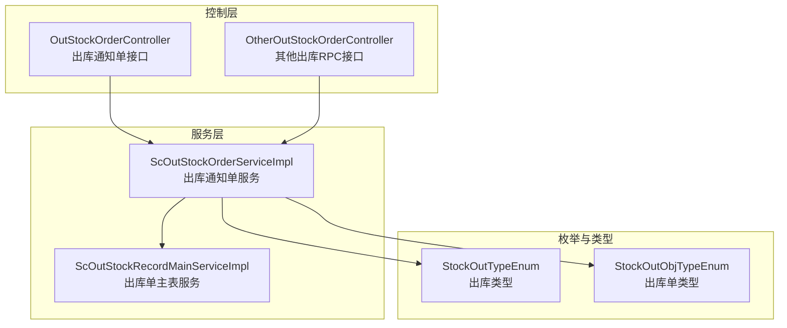
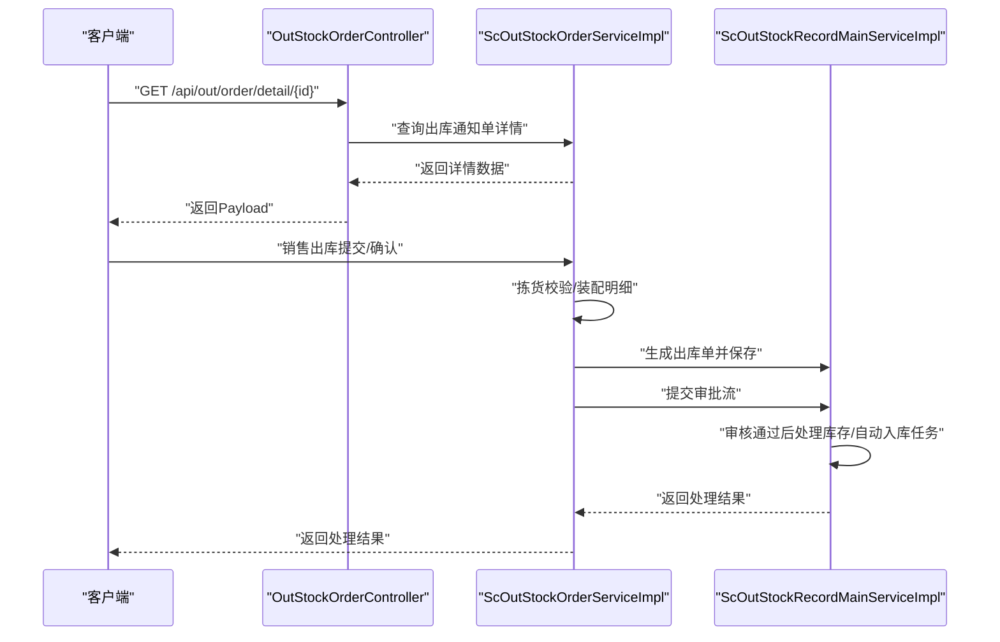
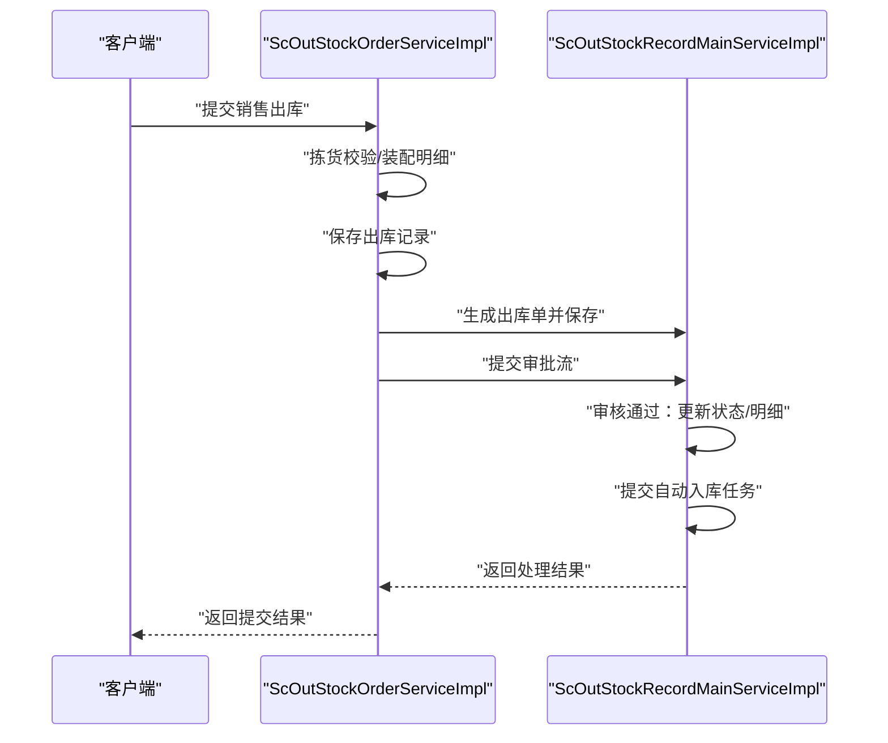
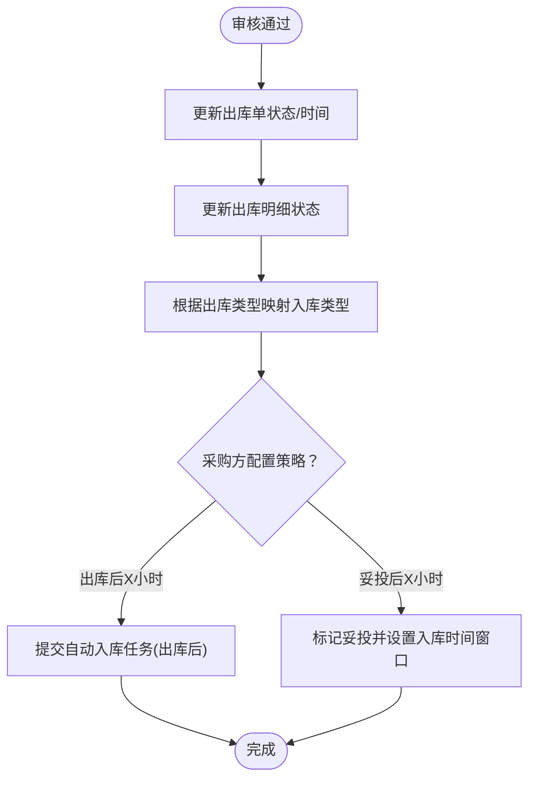
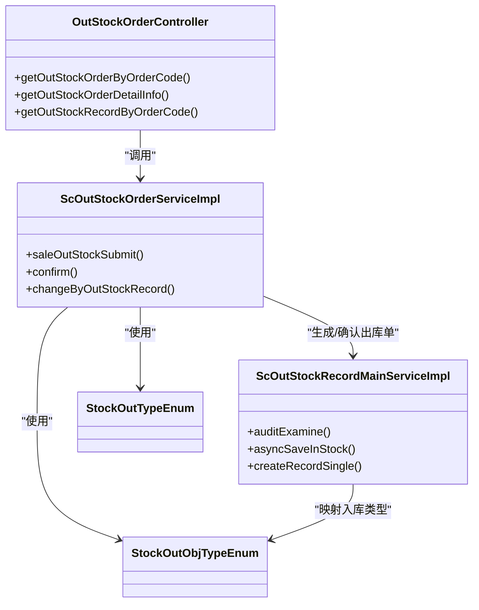

# 出库业务流程

<cite>
**本文引用的文件**
- [OutStockOrderController.java](file://guoke-deepexi-storage-center-provider/src/main/java/com/Deepexi/storage/controller/web/OutStockOrderController.java)
- [ScOutStockOrderServiceImpl.java](file://guoke-deepexi-storage-center-provider/src/main/java/com/Deepexi/storage/service/impl/ScOutStockOrderServiceImpl.java)
- [ScOutStockRecordMainServiceImpl.java](file://guoke-deepexi-storage-center-provider/src/main/java/com/Deepexi/storage/service/impl/ScOutStockRecordMainServiceImpl.java)
- [OtherOutStockOrderController.java](file://guoke-deepexi-storage-center-provider/src/main/java/com/Deepexi/storage/controller/rpc/OtherOutStockOrderController.java)
- [StockOutTypeEnum.java](file://guoke-deepexi-storage-center-api/src/main/java/com/Deepexi/api/storage/enums/out/StockOutTypeEnum.java)
- [StockOutObjTypeEnum.java](file://guoke-deepexi-storage-center-api/src/main/java/com/Deepexi/api/storage/enums/out/StockOutObjTypeEnum.java)
</cite>

## 目录
1. [简介](#简介)
2. [项目结构](#项目结构)
3. [核心组件](#核心组件)
4. [架构总览](#架构总览)
5. [详细组件分析](#详细组件分析)
6. [依赖分析](#依赖分析)
7. [性能考虑](#性能考虑)
8. [故障排查指南](#故障排查指南)
9. [结论](#结论)
10. [附录](#附录)

## 简介
本文件面向国科恒泰仓储管理系统中的“出库业务流程”，系统性梳理销售出库、退货出库、调拨出库、其他出库等多场景的实现细节、调用关系、接口与使用模式，并结合 OutStockOrderController、ScOutStockOrderServiceImpl、ScOutStockRecordMainServiceImpl 等核心组件，给出可操作的配置项、参数与返回值说明，以及与库存管理、订单管理、物流管理等模块的集成关系。文档兼顾初学者易懂与资深开发者所需的技术深度。

## 项目结构
围绕出库业务的关键模块与文件如下：
- 控制层
  - Web 控制器：OutStockOrderController（提供出库通知单与出库单查询接口）
  - RPC 控制器：OtherOutStockOrderController（提供其他出库单新增、分页、详情与导入接口）
- 服务层
  - 出库通知单服务：ScOutStockOrderServiceImpl（负责销售出库、拣货、确认、统计、导出等）
  - 出库单主表服务：ScOutStockRecordMainServiceImpl（负责出库单生成、审核、自动入库、随货同行单生成等）
- 枚举与类型
  - 出库类型枚举：StockOutTypeEnum（销售出库、其他出库、采退出库、样品出库等）
  - 出库单类型枚举：StockOutObjTypeEnum（批发销售、寄售销售、借货、调拨、报损、盘亏、换货、采退等）

图表来源
- [OutStockOrderController.java:1-86](file://guoke-deepexi-storage-center-provider/src/main/java/com/Deepexi/storage/controller/web/OutStockOrderController.java#L1-L86)
- [OtherOutStockOrderController.java:1-128](file://guoke-deepexi-storage-center-provider/src/main/java/com/Deepexi/storage/controller/rpc/OtherOutStockOrderController.java#L1-L128)
- [ScOutStockOrderServiceImpl.java:1-320](file://guoke-deepexi-storage-center-provider/src/main/java/com/Deepexi/storage/service/impl/ScOutStockOrderServiceImpl.java#L1-L320)
- [ScOutStockRecordMainServiceImpl.java:1-200](file://guoke-deepexi-storage-center-provider/src/main/java/com/Deepexi/storage/service/impl/ScOutStockRecordMainServiceImpl.java#L1-L200)
- [StockOutTypeEnum.java:1-65](file://guoke-deepexi-storage-center-api/src/main/java/com/Deepexi/api/storage/enums/out/StockOutTypeEnum.java#L1-L65)
- [StockOutObjTypeEnum.java:1-120](file://guoke-deepexi-storage-center-api/src/main/java/com/Deepexi/api/storage/enums/out/StockOutObjTypeEnum.java#L1-L120)

章节来源
- [OutStockOrderController.java:1-86](file://guoke-deepexi-storage-center-provider/src/main/java/com/Deepexi/storage/controller/web/OutStockOrderController.java#L1-L86)
- [OtherOutStockOrderController.java:1-128](file://guoke-deepexi-storage-center-provider/src/main/java/com/Deepexi/storage/controller/rpc/OtherOutStockOrderController.java#L1-L128)
- [ScOutStockOrderServiceImpl.java:1-320](file://guoke-deepexi-storage-center-provider/src/main/java/com/Deepexi/storage/service/impl/ScOutStockOrderServiceImpl.java#L1-L320)
- [ScOutStockRecordMainServiceImpl.java:1-200](file://guoke-deepexi-storage-center-provider/src/main/java/com/Deepexi/storage/service/impl/ScOutStockRecordMainServiceImpl.java#L1-L200)
- [StockOutTypeEnum.java:1-65](file://guoke-deepexi-storage-center-api/src/main/java/com/Deepexi/api/storage/enums/out/StockOutTypeEnum.java#L1-L65)
- [StockOutObjTypeEnum.java:1-120](file://guoke-deepexi-storage-center-api/src/main/java/com/Deepexi/api/storage/enums/out/StockOutObjTypeEnum.java#L1-L120)

## 核心组件
- OutStockOrderController
  - 提供出库通知单列表查询、详情查询、按订单编号查询出库单等接口
  - 关键接口路径与用途
    - GET /api/out/order/list：按订单编号与订单ID查询出库通知单列表
    - GET /api/out/order/detail/{id}：按主键查询出库通知单详情（支持分页）
    - GET /api/out/order/record/detail：按订单编号查询出库单列表
- ScOutStockOrderServiceImpl
  - 出库通知单生命周期管理：初始化编码、保存、分页查询、导出、统计
  - 销售出库提交与确认：拣货校验、明细装配、保存出库单、路由记录、审批流对接
  - 数据联动：变更出库通知单状态与明细数量、生成随货同行单、历史出库信息汇总
- ScOutStockRecordMainServiceImpl
  - 出库单主表服务：生成出库单、审核通过后的库存处理、自动入库任务调度、随货同行单生成
  - 审批流对接：审核通过后更新状态、明细状态、触发自动入库任务
- OtherOutStockOrderController
  - 新增其他出库单、分页查询、详情查询、导入其他出库单
  - 针对调拨、借货、借货还回等场景的收货方必填校验

章节来源
- [OutStockOrderController.java:38-83](file://guoke-deepexi-storage-center-provider/src/main/java/com/Deepexi/storage/controller/web/OutStockOrderController.java#L38-L83)
- [ScOutStockOrderServiceImpl.java:474-740](file://guoke-deepexi-storage-center-provider/src/main/java/com/Deepexi/storage/service/impl/ScOutStockOrderServiceImpl.java#L474-L740)
- [ScOutStockRecordMainServiceImpl.java:2018-2102](file://guoke-deepexi-storage-center-provider/src/main/java/com/Deepexi/storage/service/impl/ScOutStockRecordMainServiceImpl.java#L2018-L2102)
- [OtherOutStockOrderController.java:36-125](file://guoke-deepexi-storage-center-provider/src/main/java/com/Deepexi/storage/controller/rpc/OtherOutStockOrderController.java#L36-L125)

## 架构总览
出库业务从“通知单—出库单—审核—自动入库/物流”形成闭环，核心调用链如下：

图表来源
- [OutStockOrderController.java:64-69](file://guoke-deepexi-storage-center-provider/src/main/java/com/Deepexi/storage/controller/web/OutStockOrderController.java#L64-L69)
- [ScOutStockOrderServiceImpl.java:674-740](file://guoke-deepexi-storage-center-provider/src/main/java/com/Deepexi/storage/service/impl/ScOutStockOrderServiceImpl.java#L674-L740)
- [ScOutStockRecordMainServiceImpl.java:2018-2102](file://guoke-deepexi-storage-center-provider/src/main/java/com/Deepexi/storage/service/impl/ScOutStockRecordMainServiceImpl.java#L2018-L2102)

## 详细组件分析

### 销售出库（含拣货、确认、自动入库）
- 场景要点
  - 基于出库通知单明细进行拣货校验与出库装配
  - 支持“全部拣货”与“按明细逐笔出库”的两种模式
  - 审批流通过后，自动触发采购方自动入库任务或物流妥投后入库
- 关键流程
  - 销售出库提交：校验拣货明细、装配出库记录、批量保存
  - 确认流程：生成出库单主表与明细、写入路由、提交审批流
  - 审核通过：更新出库单状态、明细状态、触发自动入库任务
- 参数与返回
  - 提交接口：OutStockRecordItemRequest（包含明细列表、批次、效期、序列号等）
  - 返回：Payload<List<StockOutErrorTip>>（错误提示列表）或成功标记
- 自动入库策略
  - 根据采购方配置，支持“出库后X小时”或“妥投后X小时”两类策略
  - 不同出库类型（批发、寄售、借货、返利、国际、租赁、补货、换货）分别配置

图表来源
- [ScOutStockOrderServiceImpl.java:474-512](file://guoke-deepexi-storage-center-provider/src/main/java/com/Deepexi/storage/service/impl/ScOutStockOrderServiceImpl.java#L474-L512)
- [ScOutStockOrderServiceImpl.java:548-589](file://guoke-deepexi-storage-center-provider/src/main/java/com/Deepexi/storage/service/impl/ScOutStockOrderServiceImpl.java#L548-L589)
- [ScOutStockOrderServiceImpl.java:674-740](file://guoke-deepexi-storage-center-provider/src/main/java/com/Deepexi/storage/service/impl/ScOutStockOrderServiceImpl.java#L674-L740)
- [ScOutStockRecordMainServiceImpl.java:2018-2102](file://guoke-deepexi-storage-center-provider/src/main/java/com/Deepexi/storage/service/impl/ScOutStockRecordMainServiceImpl.java#L2018-L2102)
- [ScOutStockRecordMainServiceImpl.java:2107-2241](file://guoke-deepexi-storage-center-provider/src/main/java/com/Deepexi/storage/service/impl/ScOutStockRecordMainServiceImpl.java#L2107-L2241)

章节来源
- [ScOutStockOrderServiceImpl.java:474-740](file://guoke-deepexi-storage-center-provider/src/main/java/com/Deepexi/storage/service/impl/ScOutStockOrderServiceImpl.java#L474-L740)
- [ScOutStockRecordMainServiceImpl.java:2018-2241](file://guoke-deepexi-storage-center-provider/src/main/java/com/Deepexi/storage/service/impl/ScOutStockRecordMainServiceImpl.java#L2018-L2241)

### 退货出库（采退出库）
- 场景要点
  - 出库类型为采退出库（StockOutTypeEnum.PURCHASE_RETURN）
  - 出库单类型涵盖多种采退形态（如返利采退、寄售采还、借货采还等）
  - 审批通过后，系统根据出库类型映射到对应入库类型（如销退入库）
- 关键点
  - 出库类型与入库类型的映射由 StockOutObjTypeEnum.outToInEnum 提供
  - 审核通过后触发自动入库任务（与销售出库类似）

章节来源
- [StockOutTypeEnum.java:20-25](file://guoke-deepexi-storage-center-api/src/main/java/com/Deepexi/api/storage/enums/out/StockOutTypeEnum.java#L20-L25)
- [StockOutObjTypeEnum.java:367-386](file://guoke-deepexi-storage-center-api/src/main/java/com/Deepexi/api/storage/enums/out/StockOutObjTypeEnum.java#L367-L386)
- [ScOutStockRecordMainServiceImpl.java:2070-2082](file://guoke-deepexi-storage-center-provider/src/main/java/com/Deepexi/storage/service/impl/ScOutStockRecordMainServiceImpl.java#L2070-L2082)

### 调拨出库
- 场景要点
  - 出库单类型：ALLOCATION_OUT（调拨出库）
  - RPC 新增接口要求收货方信息必填（OtherOutStockOrderController）
  - 审核通过后触发自动入库（针对采购方配置）
- 参数校验
  - 调拨、借货、借货还回三类场景，收货方公司ID与名称必填

章节来源
- [StockOutObjTypeEnum.java:46-46](file://guoke-deepexi-storage-center-api/src/main/java/com/Deepexi/api/storage/enums/out/StockOutObjTypeEnum.java#L46-L46)
- [OtherOutStockOrderController.java:42-48](file://guoke-deepexi-storage-center-provider/src/main/java/com/Deepexi/storage/controller/rpc/OtherOutStockOrderController.java#L42-L48)

### 借货出库与借货还回
- 场景要点
  - 出库单类型：BORROW（借货出库）、BORROWING_OUT（借货销售）、BORROWING_RETURN（借货采还）、LEND_BACK_OUT（借货还回出库）
  - 借货还回出库需设置收货方信息
- 集成关系
  - 借货相关出库类型映射到入库类型（如借货入库）

章节来源
- [StockOutObjTypeEnum.java:41-44](file://guoke-deepexi-storage-center-api/src/main/java/com/Deepexi/api/storage/enums/out/StockOutObjTypeEnum.java#L41-L44)
- [StockOutObjTypeEnum.java:236-294](file://guoke-deepexi-storage-center-api/src/main/java/com/Deepexi/api/storage/enums/out/StockOutObjTypeEnum.java#L236-L294)
- [OtherOutStockOrderController.java:109-116](file://guoke-deepexi-storage-center-provider/src/main/java/com/Deepexi/storage/controller/rpc/OtherOutStockOrderController.java#L109-L116)

### 其他出库（报损、展览、盘亏、赔付等）
- 场景要点
  - 出库类型：OTHER_OUT（其他出库）
  - 包括：报损出库（BROKEN_OUT）、展览出库（EXHIBITION）、盘亏出库（LOSS_OUT）、赔付出库（COMPENSATION_OUT）、换货出库（CHANGE_OUT）等
  - RPC 提供新增、分页、详情、导入接口
- 参数与返回
  - 新增接口：ScOtherTypeOutStockOrderAddForm（包含出库类型、明细、收货方等）
  - 分页查询：OtherOutStockOrderPageRequest
  - 详情查询：OtherOutStockOrderDetailResponse / OtherOutBrokenTypeDetailResponse
  - 导入接口：OutStockImportParamDTO

章节来源
- [StockOutTypeEnum.java:21-21](file://guoke-deepexi-storage-center-api/src/main/java/com/Deepexi/api/storage/enums/out/StockOutTypeEnum.java#L21-L21)
- [StockOutObjTypeEnum.java:103-111](file://guoke-deepexi-storage-center-api/src/main/java/com/Deepexi/api/storage/enums/out/StockOutObjTypeEnum.java#L103-L111)
- [OtherOutStockOrderController.java:36-125](file://guoke-deepexi-storage-center-provider/src/main/java/com/Deepexi/storage/controller/rpc/OtherOutStockOrderController.java#L36-L125)

### 出库单主表服务（审核、自动入库、随货同行单）
- 核心职责
  - 审核通过：更新出库单与明细状态、触发库存处理、自动入库任务
  - 自动入库：基于采购方配置，支持“出库后X小时”或“妥投后X小时”
  - 随货同行单：根据出库单明细生成随货同行单数据
- 关键流程
  - 审核通过后，根据出库类型映射入库类型，提交自动入库任务
  - 若为“妥投后入库”，写入物流妥投标记与时间段

图表来源
- [ScOutStockRecordMainServiceImpl.java:2038-2082](file://guoke-deepexi-storage-center-provider/src/main/java/com/Deepexi/storage/service/impl/ScOutStockRecordMainServiceImpl.java#L2038-L2082)
- [ScOutStockRecordMainServiceImpl.java:2107-2241](file://guoke-deepexi-storage-center-provider/src/main/java/com/Deepexi/storage/service/impl/ScOutStockRecordMainServiceImpl.java#L2107-L2241)

章节来源
- [ScOutStockRecordMainServiceImpl.java:2018-2241](file://guoke-deepexi-storage-center-provider/src/main/java/com/Deepexi/storage/service/impl/ScOutStockRecordMainServiceImpl.java#L2018-L2241)

## 依赖分析
- 组件耦合
  - OutStockOrderController 依赖 ScOutStockOrderServiceImpl 提供的查询与业务能力
  - ScOutStockOrderServiceImpl 作为核心服务，向上承接控制器请求，向下协调库存、拣货、物流、审批等模块
  - ScOutStockRecordMainServiceImpl 作为出库单主表服务，承担审核、自动入库、随货同行单生成等关键职责
- 类型映射
  - StockOutTypeEnum 与 StockOutObjTypeEnum 提供出库类型与入库类型的双向映射，确保出库与入库流程的一致性

图表来源
- [OutStockOrderController.java:35-83](file://guoke-deepexi-storage-center-provider/src/main/java/com/Deepexi/storage/controller/web/OutStockOrderController.java#L35-L83)
- [ScOutStockOrderServiceImpl.java:474-740](file://guoke-deepexi-storage-center-provider/src/main/java/com/Deepexi/storage/service/impl/ScOutStockOrderServiceImpl.java#L474-L740)
- [ScOutStockRecordMainServiceImpl.java:2018-2102](file://guoke-deepexi-storage-center-provider/src/main/java/com/Deepexi/storage/service/impl/ScOutStockRecordMainServiceImpl.java#L2018-L2102)
- [StockOutTypeEnum.java:18-28](file://guoke-deepexi-storage-center-api/src/main/java/com/Deepexi/api/storage/enums/out/StockOutTypeEnum.java#L18-L28)
- [StockOutObjTypeEnum.java:326-386](file://guoke-deepexi-storage-center-api/src/main/java/com/Deepexi/api/storage/enums/out/StockOutObjTypeEnum.java#L326-L386)

章节来源
- [OutStockOrderController.java:35-83](file://guoke-deepexi-storage-center-provider/src/main/java/com/Deepexi/storage/controller/web/OutStockOrderController.java#L35-L83)
- [ScOutStockOrderServiceImpl.java:474-740](file://guoke-deepexi-storage-center-provider/src/main/java/com/Deepexi/storage/service/impl/ScOutStockOrderServiceImpl.java#L474-L740)
- [ScOutStockRecordMainServiceImpl.java:2018-2102](file://guoke-deepexi-storage-center-provider/src/main/java/com/Deepexi/storage/service/impl/ScOutStockRecordMainServiceImpl.java#L2018-L2102)
- [StockOutTypeEnum.java:18-28](file://guoke-deepexi-storage-center-api/src/main/java/com/Deepexi/api/storage/enums/out/StockOutTypeEnum.java#L18-L28)
- [StockOutObjTypeEnum.java:326-386](file://guoke-deepexi-storage-center-api/src/main/java/com/Deepexi/api/storage/enums/out/StockOutObjTypeEnum.java#L326-L386)

## 性能考虑
- 批量操作与分页
  - 出库通知单与出库单明细查询广泛采用分页与批量查询，避免一次性加载大量数据
- 事务与异步
  - 审核通过后的自动入库任务通过延迟任务提交，降低主流程阻塞
- 缓存与映射
  - 通过 Map 结构缓存公司、产品、货架等信息，减少重复查询
- 并行处理
  - 部分流程使用并行流处理，提升大列表场景下的处理效率

## 故障排查指南
- 常见问题与定位
  - 出库数量超限：在变更出库通知单数量时，若出库数量超过指定总量，会抛出业务异常
    - 定位路径：[ScOutStockOrderServiceImpl.java:442-444](file://guoke-deepexi-storage-center-provider/src/main/java/com/Deepexi/storage/service/impl/ScOutStockOrderServiceImpl.java#L442-L444)
  - 拣货未完成：提交销售出库时，若不存在已拣货未出库的拣货明细，会抛出业务异常
    - 定位路径：[ScOutStockOrderServiceImpl.java:481-484](file://guoke-deepexi-storage-center-provider/src/main/java/com/Deepexi/storage/service/impl/ScOutStockOrderServiceImpl.java#L481-L484)
  - 审核失败：审核拒绝时，会回滚并更新出库通知单状态
    - 定位路径：[ScOutStockRecordMainServiceImpl.java:2084-2089](file://guoke-deepexi-storage-center-provider/src/main/java/com/Deepexi/storage/service/impl/ScOutStockRecordMainServiceImpl.java#L2084-L2089)
  - 收货方必填：调拨、借货、借货还回等场景，若收货方为空，会抛出参数异常
    - 定位路径：[OtherOutStockOrderController.java:42-48](file://guoke-deepexi-storage-center-provider/src/main/java/com/Deepexi/storage/controller/rpc/OtherOutStockOrderController.java#L42-L48)
- 建议处理步骤
  - 核对拣货明细与出库数量，确保未超出剩余可出库数量
  - 确认收货方信息在调拨/借货场景下完整
  - 检查审批流状态与自动入库配置，确保任务按时提交

章节来源
- [ScOutStockOrderServiceImpl.java:442-444](file://guoke-deepexi-storage-center-provider/src/main/java/com/Deepexi/storage/service/impl/ScOutStockOrderServiceImpl.java#L442-L444)
- [ScOutStockOrderServiceImpl.java:481-484](file://guoke-deepexi-storage-center-provider/src/main/java/com/Deepexi/storage/service/impl/ScOutStockOrderServiceImpl.java#L481-L484)
- [ScOutStockRecordMainServiceImpl.java:2084-2089](file://guoke-deepexi-storage-center-provider/src/main/java/com/Deepexi/storage/service/impl/ScOutStockRecordMainServiceImpl.java#L2084-L2089)
- [OtherOutStockOrderController.java:42-48](file://guoke-deepexi-storage-center-provider/src/main/java/com/Deepexi/storage/controller/rpc/OtherOutStockOrderController.java#L42-L48)

## 结论
本系统通过“出库通知单—出库单主表—审批与自动入库—随货同行单”的完整链路，覆盖销售出库、退货出库、调拨出库、借货出库、其他出库等多场景。核心服务层以 ScOutStockOrderServiceImpl 和 ScOutStockRecordMainServiceImpl 为核心，配合类型枚举与 RPC 控制器，实现了高内聚、低耦合的出库业务架构。建议在实际部署中重点关注拣货完整性、收货方必填校验与自动入库配置，以保障出库流程稳定运行。

## 附录
- 接口与参数速查
  - 出库通知单查询
    - GET /api/out/order/list：orderCode, orderId
    - GET /api/out/order/detail/{id}：pageIndex, pageSize
    - GET /api/out/order/record/detail：orderCode, orderId（可选）
  - 其他出库
    - POST /rpc/api/v1/stockOut/other/addOtherOutStockOrder：ScOtherTypeOutStockOrderAddForm
    - POST /rpc/api/v1/stockOut/other/pageOtherOutStockOrder：OtherOutStockOrderPageRequest
    - POST /rpc/api/v1/stockOut/other/getOtherOutStockOrderDetail：otherOutStockOrderId
    - POST /rpc/api/v1/stockOut/other/getBrokenTypeOrderDetail：otherOutStockOrderId
    - POST /rpc/api/importOtherOutStock：OutStockImportParamDTO

章节来源
- [OutStockOrderController.java:44-83](file://guoke-deepexi-storage-center-provider/src/main/java/com/Deepexi/storage/controller/web/OutStockOrderController.java#L44-L83)
- [OtherOutStockOrderController.java:36-125](file://guoke-deepexi-storage-center-provider/src/main/java/com/Deepexi/storage/controller/rpc/OtherOutStockOrderController.java#L36-L125)