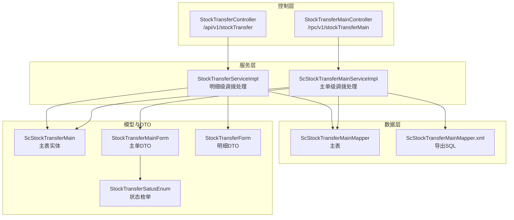
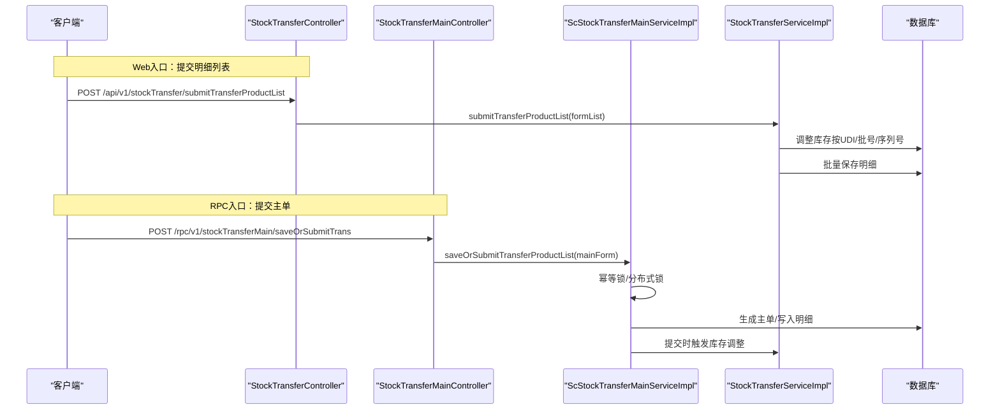
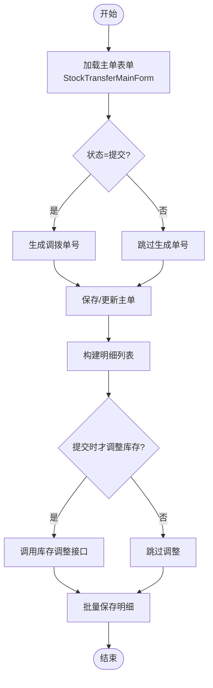
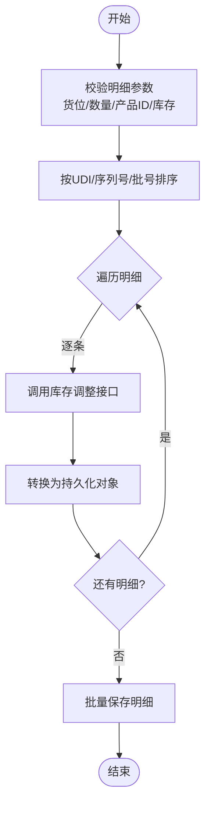
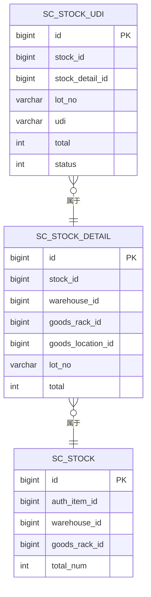
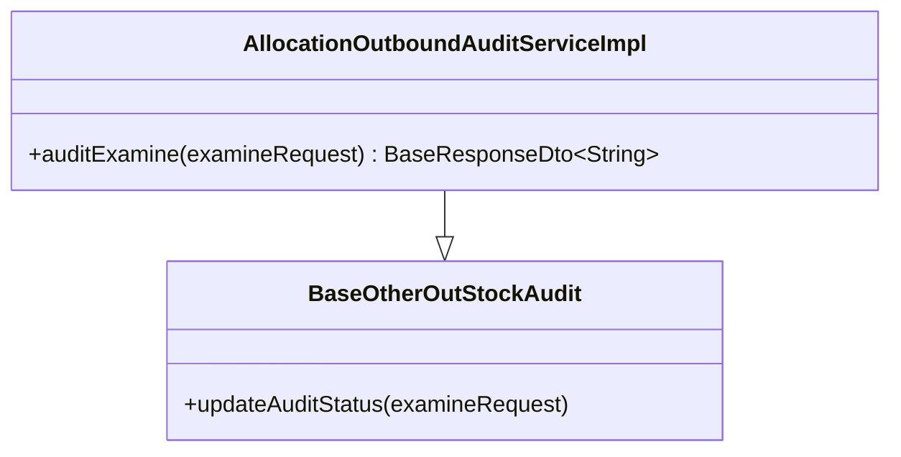
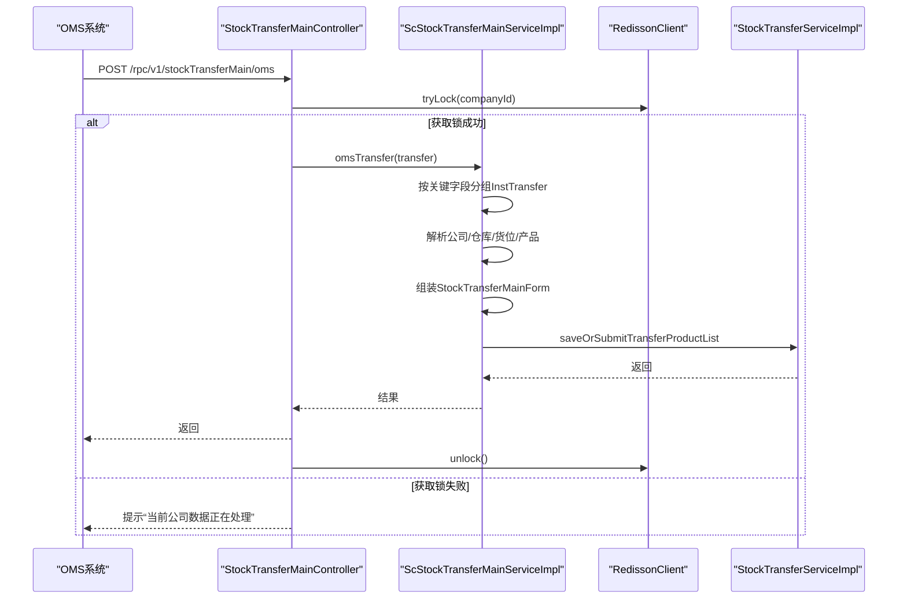
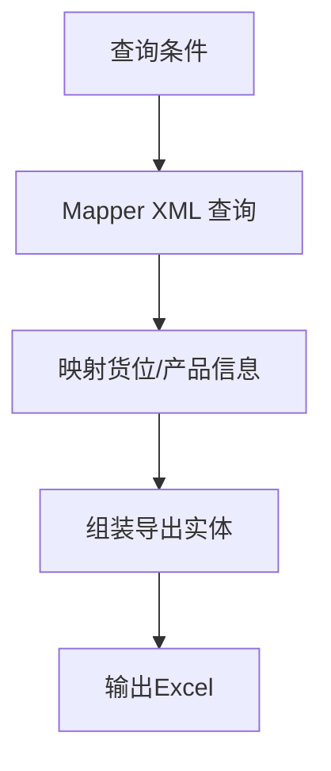
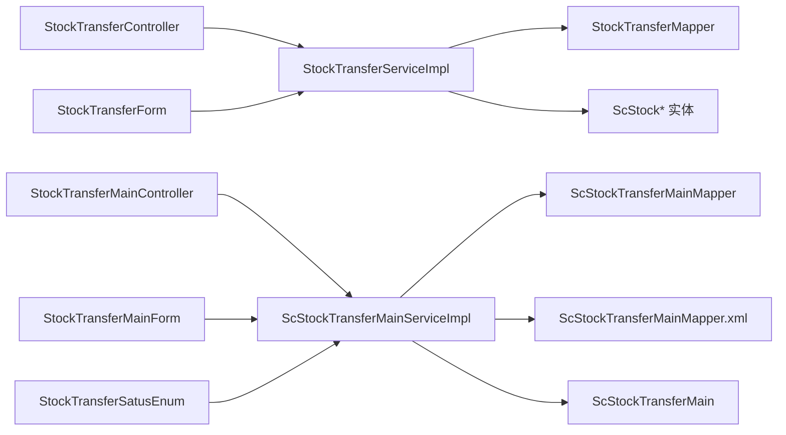

# 调拨出库流程

<cite>
**本文引用的文件**
- [StockTransferServiceImpl.java](file://guoke-deepexi-storage-center-provider/src/main/java/com/deepexi/storage/service/impl/StockTransferServiceImpl.java)
- [ScStockTransferMainServiceImpl.java](file://guoke-deepexi-storage-center-provider/src/main/java/com/deepexi/storage/service/impl/ScStockTransferMainServiceImpl.java)
- [StockTransferController.java](file://guoke-deepexi-storage-center-provider/src/main/java/com/deepexi/storage/controller/web/StockTransferController.java)
- [StockTransferMainController.java](file://guoke-deepexi-storage-center-provider/src/main/java/com/deepexi/storage/controller/rpc/StockTransferMainController.java)
- [StockTransferMainForm.java](file://guoke-deepexi-storage-center-api/src/main/java/com/deepexi/api/storage/dto/transfer/StockTransferMainForm.java)
- [StockTransferForm.java](file://guoke-deepexi-storage-center-api/src/main/java/com/deepexi/api/storage/dto/transfer/StockTransferForm.java)
- [StockTransferSatusEnum.java](file://guoke-deepexi-storage-center-api/src/main/java/com/deepexi/api/storage/enums/StockTransferSatusEnum.java)
- [ScStockTransferMain.java](file://guoke-deepexi-storage-center-provider/src/main/java/com/deepexi/storage/model/ScStockTransferMain.java)
- [ScStockTransferMainMapper.java](file://guoke-deepexi-storage-center-provider/src/main/java/com/deepexi/storage/mapper/transfer/ScStockTransferMainMapper.java)
- [ScStockTransferMainMapper.xml](file://guoke-deepexi-storage-center-provider/src/main/resources/mapper/transfer/ScStockTransferMainMapper.xml)
- [AllocationOutboundAuditServiceImpl.java](file://guoke-deepexi-storage-center-provider/src/main/java/com/deepexi/storage/service/impl/otheroutstockaudit/AllocationOutboundAuditServiceImpl.java)
- [StorageClient.java](file://guoke-deepexi-storage-center-api/src/main/java/com/deepexi/api/storage/StorageClient.java)
</cite>

## 目录
1. [简介](#简介)
2. [项目结构](#项目结构)
3. [核心组件](#核心组件)
4. [架构总览](#架构总览)
5. [详细组件分析](#详细组件分析)
6. [依赖分析](#依赖分析)
7. [性能考虑](#性能考虑)
8. [故障排查指南](#故障排查指南)
9. [结论](#结论)
10. [附录](#附录)

## 简介
本文件面向国科恒泰仓储管理系统，系统性阐述“调拨出库”业务流程，覆盖从调拨申请、审批、出库准备到调拨执行的完整闭环；并重点对比调拨出库与普通销售出库在数据结构、状态管理、跨仓库协调与库存转移上的差异与特殊处理逻辑。文档同时解析核心服务类 StockTransferServiceImpl、ScStockTransferMainServiceImpl 的实现原理，给出库存转移、成本核算与财务处理建议，以及异常处理与监控机制的最佳实践。

## 项目结构
围绕调拨出库的关键模块分布如下：
- 控制层（Web/RPC）：StockTransferController、StockTransferMainController 提供对外接口
- 服务层：StockTransferServiceImpl（明细级）、ScStockTransferMainServiceImpl（主单级）
- 数据模型与映射：ScStockTransferMain、StockTransferPO 及其 Mapper
- DTO 与枚举：StockTransferMainForm、StockTransferForm、StockTransferSatusEnum
- 审核扩展：AllocationOutboundAuditServiceImpl 实现调拨出库审核扩展点

图表来源
- [StockTransferController.java:30-64](file://guoke-deepexi-storage-center-provider/src/main/java/com/deepexi/storage/controller/web/StockTransferController.java#L30-L64)
- [StockTransferMainController.java:32-134](file://guoke-deepexi-storage-center-provider/src/main/java/com/deepexi/storage/controller/rpc/StockTransferMainController.java#L32-L134)
- [StockTransferServiceImpl.java:53-184](file://guoke-deepexi-storage-center-provider/src/main/java/com/deepexi/storage/service/impl/StockTransferServiceImpl.java#L53-L184)
- [ScStockTransferMainServiceImpl.java:58-154](file://guoke-deepexi-storage-center-provider/src/main/java/com/deepexi/storage/service/impl/ScStockTransferMainServiceImpl.java#L58-L154)
- [ScStockTransferMainMapper.java:12-25](file://guoke-deepexi-storage-center-provider/src/main/java/com/deepexi/storage/mapper/transfer/ScStockTransferMainMapper.java#L12-L25)
- [ScStockTransferMainMapper.xml:649-697](file://guoke-deepexi-storage-center-provider/src/main/resources/mapper/transfer/ScStockTransferMainMapper.xml#L649-L697)
- [ScStockTransferMain.java:21-185](file://guoke-deepexi-storage-center-provider/src/main/java/com/deepexi/storage/model/ScStockTransferMain.java#L21-L185)
- [StockTransferMainForm.java:17-55](file://guoke-deepexi-storage-center-api/src/main/java/com/deepexi/api/storage/dto/transfer/StockTransferMainForm.java#L17-L55)
- [StockTransferForm.java:13-68](file://guoke-deepexi-storage-center-api/src/main/java/com/deepexi/api/storage/dto/transfer/StockTransferForm.java#L13-L68)
- [StockTransferSatusEnum.java:13-52](file://guoke-deepexi-storage-center-api/src/main/java/com/deepexi/api/storage/enums/StockTransferSatusEnum.java#L13-L52)

章节来源
- [StockTransferController.java:30-64](file://guoke-deepexi-storage-center-provider/src/main/java/com/deepexi/storage/controller/web/StockTransferController.java#L30-L64)
- [StockTransferMainController.java:32-134](file://guoke-deepexi-storage-center-provider/src/main/java/com/deepexi/storage/controller/rpc/StockTransferMainController.java#L32-L134)

## 核心组件
- StockTransferController：提供调拨出库的列表查询与提交接口，负责鉴权与上下文注入
- StockTransferServiceImpl：实现明细级调拨提交与库存调整，支持按 UDI/批号/序列号排序与校验
- ScStockTransferMainServiceImpl：实现主单级调拨提交、查询、导出与 OMS 对接，含幂等锁与分布式锁
- ScStockTransferMain：主表实体，承载调拨单基础信息与状态
- StockTransferMainForm/StockTransferForm：主单与明细 DTO，承载调拨参数与产品信息
- StockTransferSatusEnum：调拨状态枚举（暂存/提交）

章节来源
- [StockTransferController.java:36-63](file://guoke-deepexi-storage-center-provider/src/main/java/com/deepexi/storage/controller/web/StockTransferController.java#L36-L63)
- [StockTransferServiceImpl.java:162-184](file://guoke-deepexi-storage-center-provider/src/main/java/com/deepexi/storage/service/impl/StockTransferServiceImpl.java#L162-L184)
- [ScStockTransferMainServiceImpl.java:107-154](file://guoke-deepexi-storage-center-provider/src/main/java/com/deepexi/storage/service/impl/ScStockTransferMainServiceImpl.java#L107-L154)
- [ScStockTransferMain.java:21-185](file://guoke-deepexi-storage-center-provider/src/main/java/com/deepexi/storage/model/ScStockTransferMain.java#L21-L185)
- [StockTransferMainForm.java:17-55](file://guoke-deepexi-storage-center-api/src/main/java/com/deepexi/api/storage/dto/transfer/StockTransferMainForm.java#L17-L55)
- [StockTransferForm.java:13-68](file://guoke-deepexi-storage-center-api/src/main/java/com/deepexi/api/storage/dto/transfer/StockTransferForm.java#L13-L68)
- [StockTransferSatusEnum.java:13-52](file://guoke-deepexi-storage-center-api/src/main/java/com/deepexi/api/storage/enums/StockTransferSatusEnum.java#L13-L52)

## 架构总览
调拨出库采用“主单+明细”双层结构，主单负责状态与汇总信息，明细负责具体产品与批次的库存转移。提交流程支持两种入口：
- Web 接口：StockTransferController → StockTransferServiceImpl（明细级）
- RPC 接口：StockTransferMainController → ScStockTransferMainServiceImpl（主单级，含幂等与分布式锁）

图表来源
- [StockTransferController.java:56-63](file://guoke-deepexi-storage-center-provider/src/main/java/com/deepexi/storage/controller/web/StockTransferController.java#L56-L63)
- [StockTransferMainController.java:45-66](file://guoke-deepexi-storage-center-provider/src/main/java/com/deepexi/storage/controller/rpc/StockTransferMainController.java#L45-L66)
- [ScStockTransferMainServiceImpl.java:107-154](file://guoke-deepexi-storage-center-provider/src/main/java/com/deepexi/storage/service/impl/ScStockTransferMainServiceImpl.java#L107-L154)
- [StockTransferServiceImpl.java:162-184](file://guoke-deepexi-storage-center-provider/src/main/java/com/deepexi/storage/service/impl/StockTransferServiceImpl.java#L162-L184)

## 详细组件分析

### 调拨出库流程（主单级）
主单级流程强调“主单聚合、明细拆分、提交即生效”的特性，适合批量导入与外部系统对接。

图表来源
- [ScStockTransferMainServiceImpl.java:107-154](file://guoke-deepexi-storage-center-provider/src/main/java/com/deepexi/storage/service/impl/ScStockTransferMainServiceImpl.java#L107-L154)
- [StockTransferMainForm.java:17-55](file://guoke-deepexi-storage-center-api/src/main/java/com/deepexi/api/storage/dto/transfer/StockTransferMainForm.java#L17-L55)

章节来源
- [ScStockTransferMainServiceImpl.java:107-154](file://guoke-deepexi-storage-center-provider/src/main/java/com/deepexi/storage/service/impl/ScStockTransferMainServiceImpl.java#L107-L154)
- [StockTransferMainForm.java:17-55](file://guoke-deepexi-storage-center-api/src/main/java/com/deepexi/api/storage/dto/transfer/StockTransferMainForm.java#L17-L55)

### 调拨出库流程（明细级）
明细级流程强调“逐条提交、即时校验、即时落库”，适合人工录入与小批量场景。

图表来源
- [StockTransferServiceImpl.java:162-184](file://guoke-deepexi-storage-center-provider/src/main/java/com/deepexi/storage/service/impl/StockTransferServiceImpl.java#L162-L184)
- [StockTransferForm.java:13-68](file://guoke-deepexi-storage-center-api/src/main/java/com/deepexi/api/storage/dto/transfer/StockTransferForm.java#L13-L68)

章节来源
- [StockTransferServiceImpl.java:162-184](file://guoke-deepexi-storage-center-provider/src/main/java/com/deepexi/storage/service/impl/StockTransferServiceImpl.java#L162-L184)
- [StockTransferForm.java:13-68](file://guoke-deepexi-storage-center-api/src/main/java/com/deepexi/api/storage/dto/transfer/StockTransferForm.java#L13-L68)

### 库存转移与跨仓库协调
调拨出库的核心在于“同一公司内跨仓库/跨货架/跨货位”的库存转移，涉及三张表的协同：
- UDI 层：ScStockUdiPO（按批号/序列号/UDI 精细化管理）
- 明细层：ScStockDetailPO（按仓库/货架/货位聚合）
- 总账层：ScStockPO（按产品维度聚合）

图表来源
- [StockTransferServiceImpl.java:273-403](file://guoke-deepexi-storage-center-provider/src/main/java/com/deepexi/storage/service/impl/StockTransferServiceImpl.java#L273-L403)

章节来源
- [StockTransferServiceImpl.java:236-403](file://guoke-deepexi-storage-center-provider/src/main/java/com/deepexi/storage/service/impl/StockTransferServiceImpl.java#L236-L403)

### 调拨出库与普通销售出库的差异
- 数据来源与目标
  - 销售出库：面向客户/下游渠道，通常产生销售收入与应收账款
  - 调拨出库：公司内部跨仓库/货位转移，不改变所有权，不产生收入
- 成本核算
  - 销售出库：按销售单价与成本结转，影响利润表
  - 调拨出库：一般不改变成本价，仅做库存转移，不影响损益
- 财务处理
  - 销售出库：需生成销售单据与发票匹配
  - 调拨出库：通常仅生成内部调拨单据，财务上以“内部转移”处理
- 审批与风控
  - 销售出库：可能涉及信用额度、回款周期等风控
  - 调拨出库：侧重跨仓库权限与货位一致性校验

章节来源
- [AllocationOutboundAuditServiceImpl.java:10-18](file://guoke-deepexi-storage-center-provider/src/main/java/com/deepexi/storage/service/impl/otheroutstockaudit/AllocationOutboundAuditServiceImpl.java#L10-L18)

### 审核扩展与调拨出库
调拨出库可通过扩展点实现审批流集成，例如 AllocationOutboundAuditServiceImpl 继承基类并复用通用审核状态更新逻辑。

图表来源
- [AllocationOutboundAuditServiceImpl.java:10-18](file://guoke-deepexi-storage-center-provider/src/main/java/com/deepexi/storage/service/impl/otheroutstockaudit/AllocationOutboundAuditServiceImpl.java#L10-L18)

章节来源
- [AllocationOutboundAuditServiceImpl.java:10-18](file://guoke-deepexi-storage-center-provider/src/main/java/com/deepexi/storage/service/impl/otheroutstockaudit/AllocationOutboundAuditServiceImpl.java#L10-L18)

### OMS 对接与幂等处理
ScStockTransferMainServiceImpl 支持 OMS 批量导入，按“委托方/受托方/物权方+仓库+货位”分组，确保同一批次调拨的幂等性与一致性，并通过 Redisson 分布式锁避免并发冲突。

图表来源
- [StockTransferMainController.java:107-132](file://guoke-deepexi-storage-center-provider/src/main/java/com/deepexi/storage/controller/rpc/StockTransferMainController.java#L107-L132)
- [ScStockTransferMainServiceImpl.java:341-416](file://guoke-deepexi-storage-center-provider/src/main/java/com/deepexi/storage/service/impl/ScStockTransferMainServiceImpl.java#L341-L416)

章节来源
- [StockTransferMainController.java:45-66](file://guoke-deepexi-storage-center-provider/src/main/java/com/deepexi/storage/controller/rpc/StockTransferMainController.java#L45-L66)
- [ScStockTransferMainServiceImpl.java:341-416](file://guoke-deepexi-storage-center-provider/src/main/java/com/deepexi/storage/service/impl/ScStockTransferMainServiceImpl.java#L341-L416)

### 导出与报表
主单导出基于 Mapper XML 的 SQL 聚合明细，结合产品中心信息与货位映射生成可读报表。

图表来源
- [ScStockTransferMainMapper.xml:649-697](file://guoke-deepexi-storage-center-provider/src/main/resources/mapper/transfer/ScStockTransferMainMapper.xml#L649-L697)
- [ScStockTransferMainServiceImpl.java:308-339](file://guoke-deepexi-storage-center-provider/src/main/java/com/deepexi/storage/service/impl/ScStockTransferMainServiceImpl.java#L308-L339)

章节来源
- [ScStockTransferMainMapper.xml:649-697](file://guoke-deepexi-storage-center-provider/src/main/resources/mapper/transfer/ScStockTransferMainMapper.xml#L649-L697)
- [ScStockTransferMainServiceImpl.java:308-339](file://guoke-deepexi-storage-center-provider/src/main/java/com/deepexi/storage/service/impl/ScStockTransferMainServiceImpl.java#L308-L339)

## 依赖分析
- 控制器依赖服务层：StockTransferController 依赖 StockTransferServiceImpl；StockTransferMainController 依赖 ScStockTransferMainServiceImpl
- 服务层依赖数据层：两者均依赖各自 Mapper 与 Model
- DTO/枚举依赖：主单/明细 DTO 与状态枚举贯穿控制器与服务层
- 外部系统集成：OMS 对接通过 ScStockTransferMainServiceImpl 完成

图表来源
- [StockTransferController.java:30-64](file://guoke-deepexi-storage-center-provider/src/main/java/com/deepexi/storage/controller/web/StockTransferController.java#L30-L64)
- [StockTransferMainController.java:32-134](file://guoke-deepexi-storage-center-provider/src/main/java/com/deepexi/storage/controller/rpc/StockTransferMainController.java#L32-L134)
- [StockTransferServiceImpl.java:53-184](file://guoke-deepexi-storage-center-provider/src/main/java/com/deepexi/storage/service/impl/StockTransferServiceImpl.java#L53-L184)
- [ScStockTransferMainServiceImpl.java:58-154](file://guoke-deepexi-storage-center-provider/src/main/java/com/deepexi/storage/service/impl/ScStockTransferMainServiceImpl.java#L58-L154)
- [ScStockTransferMainMapper.java:12-25](file://guoke-deepexi-storage-center-provider/src/main/java/com/deepexi/storage/mapper/transfer/ScStockTransferMainMapper.java#L12-L25)
- [ScStockTransferMainMapper.xml:649-697](file://guoke-deepexi-storage-center-provider/src/main/resources/mapper/transfer/ScStockTransferMainMapper.xml#L649-L697)
- [StockTransferForm.java:13-68](file://guoke-deepexi-storage-center-api/src/main/java/com/deepexi/api/storage/dto/transfer/StockTransferForm.java#L13-L68)
- [StockTransferMainForm.java:17-55](file://guoke-deepexi-storage-center-api/src/main/java/com/deepexi/api/storage/dto/transfer/StockTransferMainForm.java#L17-L55)
- [StockTransferSatusEnum.java:13-52](file://guoke-deepexi-storage-center-api/src/main/java/com/deepexi/api/storage/enums/StockTransferSatusEnum.java#L13-L52)

章节来源
- [StockTransferController.java:30-64](file://guoke-deepexi-storage-center-provider/src/main/java/com/deepexi/storage/controller/web/StockTransferController.java#L30-L64)
- [StockTransferMainController.java:32-134](file://guoke-deepexi-storage-center-provider/src/main/java/com/deepexi/storage/controller/rpc/StockTransferMainController.java#L32-L134)
- [StockTransferServiceImpl.java:53-184](file://guoke-deepexi-storage-center-provider/src/main/java/com/deepexi/storage/service/impl/StockTransferServiceImpl.java#L53-L184)
- [ScStockTransferMainServiceImpl.java:58-154](file://guoke-deepexi-storage-center-provider/src/main/java/com/deepexi/storage/service/impl/ScStockTransferMainServiceImpl.java#L58-L154)

## 性能考虑
- 批量操作：明细提交与主单保存均使用批量插入/更新，减少事务次数
- 排序与去重：按 UDI/序列号/批号排序，便于后续库存匹配与去重
- 幂等与锁：RPC 入口使用 Redisson 分布式锁与幂等注解，避免重复提交
- 导出优化：Mapper XML 直连聚合查询，减少中间层转换开销

## 故障排查指南
- 参数校验异常：当缺少货位/数量/产品ID/库存等关键字段时抛出参数异常
- 库存不足：当 UDI 层可用数量小于调拨数量时抛出业务异常
- 货位相同：若调入与调出货位一致，直接提示无需调拨
- 并发冲突：RPC 入口获取锁失败时提示“当前公司数据正在处理，请稍后再试”
- OMS 对接：OMS 参数缺失（如信用代码）会触发参数异常；产品信息缺失会提示检查产品状态

章节来源
- [StockTransferServiceImpl.java:218-234](file://guoke-deepexi-storage-center-provider/src/main/java/com/deepexi/storage/service/impl/StockTransferServiceImpl.java#L218-L234)
- [StockTransferServiceImpl.java:368-378](file://guoke-deepexi-storage-center-provider/src/main/java/com/deepexi/storage/service/impl/StockTransferServiceImpl.java#L368-L378)
- [StockTransferMainController.java:63-66](file://guoke-deepexi-storage-center-provider/src/main/java/com/deepexi/storage/controller/rpc/StockTransferMainController.java#L63-L66)
- [ScStockTransferMainServiceImpl.java:356-358](file://guoke-deepexi-storage-center-provider/src/main/java/com/deepexi/storage/service/impl/ScStockTransferMainServiceImpl.java#L356-L358)
- [ScStockTransferMainServiceImpl.java:386-388](file://guoke-deepexi-storage-center-provider/src/main/java/com/deepexi/storage/service/impl/ScStockTransferMainServiceImpl.java#L386-L388)

## 结论
调拨出库在本系统中通过“主单+明细”的双层设计实现了高内聚、低耦合的跨仓库库存转移能力。主单级适合 OMS 批量导入与外部系统集成，明细级适合人工录入与小批量场景。通过 UDI/明细/总账三层库存模型与严格的参数校验、并发控制与导出能力，系统在保证数据一致性的同时提升了可运维性与可观测性。

## 附录
- 接口参考
  - Web 提交明细：POST /api/v1/stockTransfer/submitTransferProductList
  - RPC 提交主单：POST /rpc/v1/stockTransferMain/saveOrSubmitTrans
  - RPC 查询主单：GET /rpc/v1/stockTransferMain/transferMain
  - RPC 查询主单详情：GET /rpc/v1/stockTransferMain/queryTransferMainById
  - RPC 删除主单：DELETE /rpc/v1/stockTransferMain/transferMain/{id}
  - RPC OMS 对接：POST /rpc/v1/stockTransferMain/oms

章节来源
- [StockTransferController.java:56-63](file://guoke-deepexi-storage-center-provider/src/main/java/com/deepexi/storage/controller/web/StockTransferController.java#L56-L63)
- [StockTransferMainController.java:74-132](file://guoke-deepexi-storage-center-provider/src/main/java/com/deepexi/storage/controller/rpc/StockTransferMainController.java#L74-L132)
- [StorageClient.java:714-732](file://guoke-deepexi-storage-center-api/src/main/java/com/deepexi/api/storage/StorageClient.java#L714-L732)