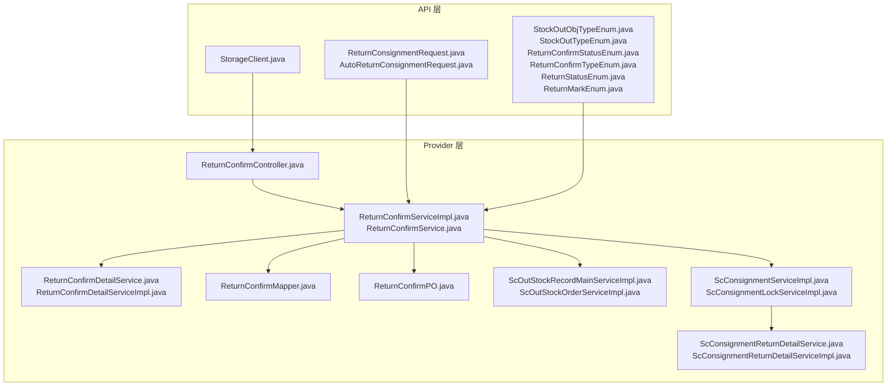
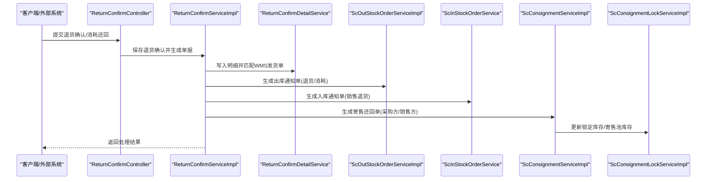
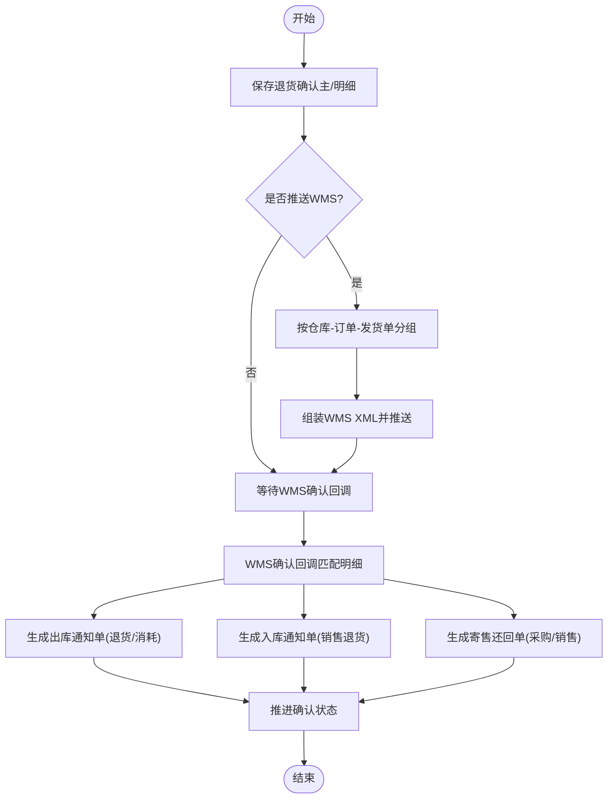
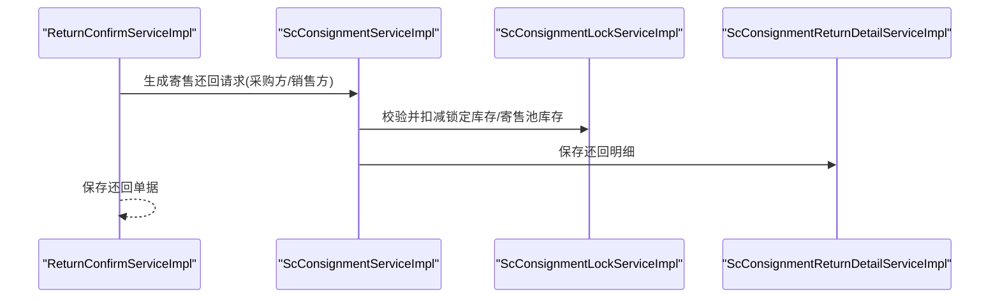
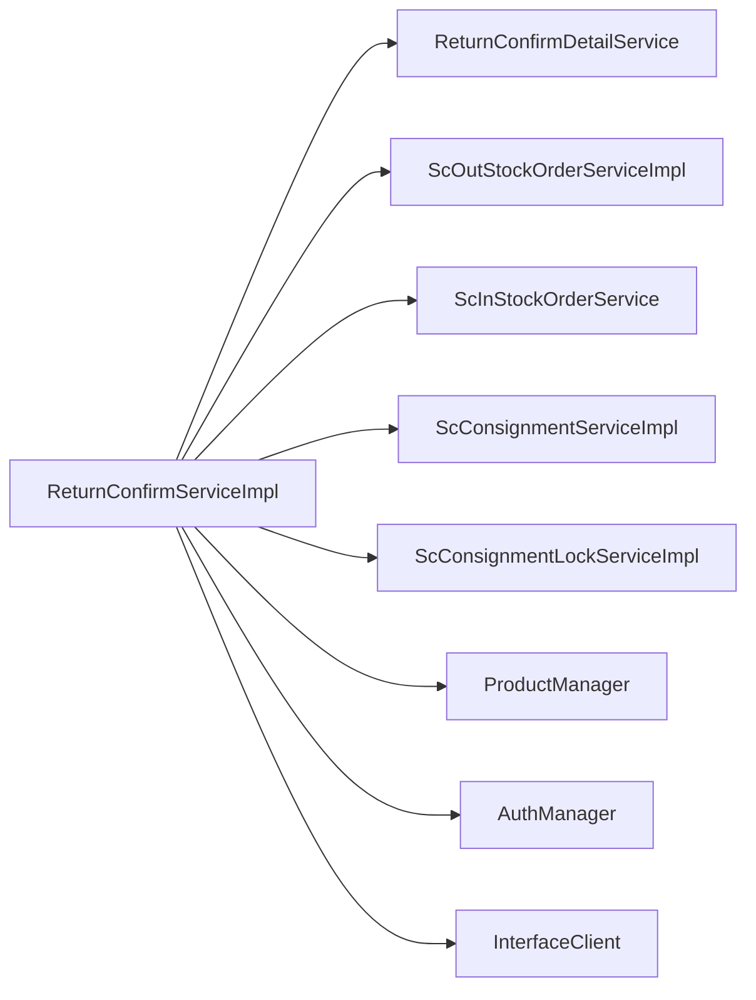

# 退货出库流程

<cite>
**本文引用的文件**
- [ReturnConfirmServiceImpl.java](file://guoke-deepexi-storage-center-provider/src/main/java/com/deepexi/storage/service/impl/ReturnConfirmServiceImpl.java)
- [ReturnConfirmService.java](file://guoke-deepexi-storage-center-provider/src/main/java/com/deepexi/storage/service/ReturnConfirmService.java)
- [ReturnConfirmDetailService.java](file://guoke-deepexi-storage-center-provider/src/main/java/com/deepexi/storage/service/ReturnConfirmDetailService.java)
- [ReturnConfirmMapper.java](file://guoke-deepexi-storage-center-provider/src/main/java/com/deepexi/storage/mapper/ReturnConfirmMapper.java)
- [ReturnConfirmPO.java](file://guoke-deepexi-storage-center-provider/src/main/java/com/deepexi/storage/model/ReturnConfirmPO.java)
- [ReturnConfirmDetailServiceImpl.java](file://guoke-deepexi-storage-center-provider/src/main/java/com/deepexi/storage/service/impl/ReturnConfirmDetailServiceImpl.java)
- [ReturnConfirmController.java](file://guoke-deepexi-storage-center-provider/src/main/java/com/deepexi/storage/controller/web/ReturnConfirmController.java)
- [StorageClient.java](file://guoke-deepexi-storage-center-api/src/main/java/com/deepexi/api/storage/StorageClient.java)
- [StockOutObjTypeEnum.java](file://guoke-deepexi-storage-center-api/src/main/java/com/deepexi/api/storage/enums/out/StockOutObjTypeEnum.java)
- [StockOutTypeEnum.java](file://guoke-deepexi-storage-center-api/src/main/java/com/deepexi/api/storage/enums/out/StockOutTypeEnum.java)
- [ReturnConsignmentRequest.java](file://guoke-deepexi-storage-center-api/src/main/java/com/deepexi/api/storage/dto/consignment/ReturnConsignmentRequest.java)
- [AutoReturnConsignmentRequest.java](file://guoke-deepexi-storage-center-api/src/main/java/com/deepexi/api/storage/dto/consignment/AutoReturnConsignmentRequest.java)
- [ScOutStockRecordMainServiceImpl.java](file://guoke-deepexi-storage-center-provider/src/main/java/com/deepexi/storage/service/impl/ScOutStockRecordMainServiceImpl.java)
- [ScOutStockOrderServiceImpl.java](file://guoke-deepexi-storage-center-provider/src/main/java/com/deepexi/storage/service/impl/ScOutStockOrderServiceImpl.java)
- [ScConsignmentServiceImpl.java](file://guoke-deepexi-storage-center-provider/src/main/java/com/deepexi/storage/service/impl/ScConsignmentServiceImpl.java)
- [ScConsignmentLockServiceImpl.java](file://guoke-deepexi-storage-center-provider/src/main/java/com/deepexi/storage/service/impl/ScConsignmentLockServiceImpl.java)
- [ScConsignmentReturnDetailService.java](file://guoke-deepexi-storage-center-provider/src/main/java/com/deepexi/storage/service/ScConsignmentReturnDetailService.java)
- [ScConsignmentReturnDetailServiceImpl.java](file://guoke-deepexi-storage-center-provider/src/main/java/com/deepexi/storage/service/impl/ScConsignmentReturnDetailServiceImpl.java)
- [ReturnConfirmStatusEnum.java](file://guoke-deepexi-storage-center-api/src/main/java/com/deepexi/api/storage/enums/returnConfirm/ReturnConfirmStatusEnum.java)
- [ReturnConfirmTypeEnum.java](file://guoke-deepexi-storage-center-api/src/main/java/com/deepexi/api/storage/enums/returnConfirm/ReturnConfirmTypeEnum.java)
- [ReturnStatusEnum.java](file://guoke-deepexi-storage-center-api/src/main/java/com/deepexi/api/storage/enums/returnConfirm/ReturnStatusEnum.java)
- [ReturnMarkEnum.java](file://guoke-deepexi-storage-center-api/src/main/java/com/deepexi/api/storage/enums/returnConfirm/ReturnMarkEnum.java)
</cite>

## 目录
1. [引言](#引言)
2. [项目结构](#项目结构)
3. [核心组件](#核心组件)
4. [架构总览](#架构总览)
5. [详细组件分析](#详细组件分析)
6. [依赖分析](#依赖分析)
7. [性能考虑](#性能考虑)
8. [故障排查指南](#故障排查指南)
9. [结论](#结论)
10. [附录](#附录)

## 引言
本文件面向国科恒泰仓储管理系统，系统化梳理“退货出库”业务流程，覆盖退货申请、退货审核、商品验收、出库登记等关键环节；重点阐述退货订单的特殊处理流程与状态管理机制；对比退货出库与销售出库的差异及特殊要求；并结合服务类与控制器实现细节，展示退货确认、库存回冲等核心功能。文档同时提供异常处理与质量控制措施，以及典型业务场景与代码路径示例，帮助研发与运营人员快速理解与落地。

## 项目结构
围绕退货出库流程的关键模块与文件组织如下：
- API 层：定义 RPC/HTTP 接口、DTO、枚举（退货确认、出库类型、状态枚举）
- Provider 层：服务实现（退货确认、寄售还回、出库/入库单据生成）、控制器、Mapper/PO
- 数据模型：退货确认主/明细、寄售还回明细等

图表来源
- [StorageClient.java:1341-1348](file://guoke-deepexi-storage-center-api/src/main/java/com/deepexi/api/storage/StorageClient.java#L1341-L1348)
- [ReturnConfirmServiceImpl.java:126-127](file://guoke-deepexi-storage-center-provider/src/main/java/com/deepexi/storage/service/impl/ReturnConfirmServiceImpl.java#L126-L127)
- [ReturnConfirmDetailService.java:12-18](file://guoke-deepexi-storage-center-provider/src/main/java/com/deepexi/storage/service/ReturnConfirmDetailService.java#L12-L18)
- [ReturnConfirmMapper.java:10-13](file://guoke-deepexi-storage-center-provider/src/main/java/com/deepexi/storage/mapper/ReturnConfirmMapper.java#L10-L13)
- [ReturnConfirmPO.java:15-73](file://guoke-deepexi-storage-center-provider/src/main/java/com/deepexi/storage/model/ReturnConfirmPO.java#L15-L73)
- [ScOutStockRecordMainServiceImpl.java:126-127](file://guoke-deepexi-storage-center-provider/src/main/java/com/deepexi/storage/service/impl/ScOutStockRecordMainServiceImpl.java#L126-L127)
- [ScOutStockOrderServiceImpl.java:4178-4195](file://guoke-deepexi-storage-center-provider/src/main/java/com/deepexi/storage/service/impl/ScOutStockOrderServiceImpl.java#L4178-L4195)
- [ScConsignmentServiceImpl.java:144-182](file://guoke-deepexi-storage-center-provider/src/main/java/com/deepexi/storage/service/impl/ScConsignmentServiceImpl.java#L144-L182)
- [ScConsignmentLockServiceImpl.java:198-220](file://guoke-deepexi-storage-center-provider/src/main/java/com/deepexi/storage/service/impl/ScConsignmentLockServiceImpl.java#L198-L220)
- [ScConsignmentReturnDetailService.java:9-16](file://guoke-deepexi-storage-center-provider/src/main/java/com/deepexi/storage/service/ScConsignmentReturnDetailService.java#L9-L16)
- [ScConsignmentReturnDetailServiceImpl.java:51-75](file://guoke-deepexi-storage-center-provider/src/main/java/com/deepexi/storage/service/impl/ScConsignmentReturnDetailServiceImpl.java#L51-L75)
- [ReturnConsignmentRequest.java:17-79](file://guoke-deepexi-storage-center-api/src/main/java/com/deepexi/api/storage/dto/consignment/ReturnConsignmentRequest.java#L17-L79)
- [AutoReturnConsignmentRequest.java:33-172](file://guoke-deepexi-storage-center-api/src/main/java/com/deepexi/api/storage/dto/consignment/AutoReturnConsignmentRequest.java#L33-L172)
- [StockOutObjTypeEnum.java:16-117](file://guoke-deepexi-storage-center-api/src/main/java/com/deepexi/api/storage/enums/out/StockOutObjTypeEnum.java#L16-L117)
- [StockOutTypeEnum.java:16-64](file://guoke-deepexi-storage-center-api/src/main/java/com/deepexi/api/storage/enums/out/StockOutTypeEnum.java#L16-L64)

章节来源
- [StorageClient.java:1341-1348](file://guoke-deepexi-storage-center-api/src/main/java/com/deepexi/api/storage/StorageClient.java#L1341-L1348)
- [ReturnConfirmServiceImpl.java:126-127](file://guoke-deepexi-storage-center-provider/src/main/java/com/deepexi/storage/service/impl/ReturnConfirmServiceImpl.java#L126-L127)
- [ReturnConfirmDetailService.java:12-18](file://guoke-deepexi-storage-center-provider/src/main/java/com/deepexi/storage/service/ReturnConfirmDetailService.java#L12-L18)
- [ReturnConfirmMapper.java:10-13](file://guoke-deepexi-storage-center-provider/src/main/java/com/deepexi/storage/mapper/ReturnConfirmMapper.java#L10-L13)
- [ReturnConfirmPO.java:15-73](file://guoke-deepexi-storage-center-provider/src/main/java/com/deepexi/storage/model/ReturnConfirmPO.java#L15-L73)
- [ScOutStockRecordMainServiceImpl.java:126-127](file://guoke-deepexi-storage-center-provider/src/main/java/com/deepexi/storage/service/impl/ScOutStockRecordMainServiceImpl.java#L126-L127)
- [ScOutStockOrderServiceImpl.java:4178-4195](file://guoke-deepexi-storage-center-provider/src/main/java/com/deepexi/storage/service/impl/ScOutStockOrderServiceImpl.java#L4178-L4195)
- [ScConsignmentServiceImpl.java:144-182](file://guoke-deepexi-storage-center-provider/src/main/java/com/deepexi/storage/service/impl/ScConsignmentServiceImpl.java#L144-L182)
- [ScConsignmentLockServiceImpl.java:198-220](file://guoke-deepexi-storage-center-provider/src/main/java/com/deepexi/storage/service/impl/ScConsignmentLockServiceImpl.java#L198-L220)
- [ScConsignmentReturnDetailService.java:9-16](file://guoke-deepexi-storage-center-provider/src/main/java/com/deepexi/storage/service/ScConsignmentReturnDetailService.java#L9-L16)
- [ScConsignmentReturnDetailServiceImpl.java:51-75](file://guoke-deepexi-storage-center-provider/src/main/java/com/deepexi/storage/service/impl/ScConsignmentReturnDetailServiceImpl.java#L51-L75)
- [ReturnConsignmentRequest.java:17-79](file://guoke-deepexi-storage-center-api/src/main/java/com/deepexi/api/storage/dto/consignment/ReturnConsignmentRequest.java#L17-L79)
- [AutoReturnConsignmentRequest.java:33-172](file://guoke-deepexi-storage-center-api/src/main/java/com/deepexi/api/storage/dto/consignment/AutoReturnConsignmentRequest.java#L33-L172)
- [StockOutObjTypeEnum.java:16-117](file://guoke-deepexi-storage-center-api/src/main/java/com/deepexi/api/storage/enums/out/StockOutObjTypeEnum.java#L16-L117)
- [StockOutTypeEnum.java:16-64](file://guoke-deepexi-storage-center-api/src/main/java/com/deepexi/api/storage/enums/out/StockOutTypeEnum.java#L16-L64)

## 核心组件
- 退货确认服务：负责接收并校验退货/消耗还回信息，生成出库/入库通知单，触发寄售还回，推进状态流转与WMS对接。
- 退货确认明细服务：按WMS回调或内部规则匹配退货明细，更新确认状态与回写WMS标识。
- 出库/入库单据服务：根据退货确认结果生成销售出库/采退出库通知单与对应入库通知单。
- 寄售还回服务：生成寄售还回单据并更新寄售池库存与锁定库存。
- 控制器：对外暴露RPC/HTTP接口，承接前端与外部系统调用。

章节来源
- [ReturnConfirmService.java:16-41](file://guoke-deepexi-storage-center-provider/src/main/java/com/deepexi/storage/service/ReturnConfirmService.java#L16-L41)
- [ReturnConfirmDetailService.java:9-18](file://guoke-deepexi-storage-center-provider/src/main/java/com/deepexi/storage/service/ReturnConfirmDetailService.java#L9-L18)
- [ReturnConfirmServiceImpl.java:126-127](file://guoke-deepexi-storage-center-provider/src/main/java/com/deepexi/storage/service/impl/ReturnConfirmServiceImpl.java#L126-L127)
- [ReturnConfirmDetailServiceImpl.java:16-29](file://guoke-deepexi-storage-center-provider/src/main/java/com/deepexi/storage/service/impl/ReturnConfirmDetailServiceImpl.java#L16-L29)
- [ScOutStockRecordMainServiceImpl.java:126-127](file://guoke-deepexi-storage-center-provider/src/main/java/com/deepexi/storage/service/impl/ScOutStockRecordMainServiceImpl.java#L126-L127)
- [ScOutStockOrderServiceImpl.java:4178-4195](file://guoke-deepexi-storage-center-provider/src/main/java/com/deepexi/storage/service/impl/ScOutStockOrderServiceImpl.java#L4178-L4195)
- [ScConsignmentServiceImpl.java:144-182](file://guoke-deepexi-storage-center-provider/src/main/java/com/deepexi/storage/service/impl/ScConsignmentServiceImpl.java#L144-L182)
- [ScConsignmentLockServiceImpl.java:198-220](file://guoke-deepexi-storage-center-provider/src/main/java/com/deepexi/storage/service/impl/ScConsignmentLockServiceImpl.java#L198-L220)

## 架构总览
退货出库流程从“退货确认”开始，贯穿“WMS确认”、“出库/入库单据生成”、“寄售还回”、“状态推进”，最终完成库存回冲与账务闭环。

图表来源
- [ReturnConfirmServiceImpl.java:126-127](file://guoke-deepexi-storage-center-provider/src/main/java/com/deepexi/storage/service/impl/ReturnConfirmServiceImpl.java#L126-L127)
- [ReturnConfirmDetailService.java:12-18](file://guoke-deepexi-storage-center-provider/src/main/java/com/deepexi/storage/service/ReturnConfirmDetailService.java#L12-L18)
- [ScOutStockOrderServiceImpl.java:4178-4195](file://guoke-deepexi-storage-center-provider/src/main/java/com/deepexi/storage/service/impl/ScOutStockOrderServiceImpl.java#L4178-L4195)
- [ScOutStockRecordMainServiceImpl.java:126-127](file://guoke-deepexi-storage-center-provider/src/main/java/com/deepexi/storage/service/impl/ScOutStockRecordMainServiceImpl.java#L126-L127)
- [ScConsignmentServiceImpl.java:144-182](file://guoke-deepexi-storage-center-provider/src/main/java/com/deepexi/storage/service/impl/ScConsignmentServiceImpl.java#L144-L182)
- [ScConsignmentLockServiceImpl.java:198-220](file://guoke-deepexi-storage-center-provider/src/main/java/com/deepexi/storage/service/impl/ScConsignmentLockServiceImpl.java#L198-L220)

## 详细组件分析

### 退货确认服务（ReturnConfirmServiceImpl）
职责与流程要点：
- 保存退货确认主/明细：校验出库信息、匹配WMS发货单、写入证书与位置信息、设置状态。
- WMS推送：按仓库-订单-发货单分组组装XML并推送。
- 确认回调：解析WMS确认结果，按序列号/状态优先匹配，更新明细状态与WMS行标识。
- 单据生成：针对“已还回”生成出库通知单（退货出库）与入库通知单（销售退货），针对“已消耗”生成出库通知单（消耗出库）。
- 寄售还回：分别生成采购方与销售方寄售还回单，并保存还回明细。
- 状态推进：根据明细完成度推进主表确认状态，支持部分确认与批量处理。

图表来源
- [ReturnConfirmServiceImpl.java:126-127](file://guoke-deepexi-storage-center-provider/src/main/java/com/deepexi/storage/service/impl/ReturnConfirmServiceImpl.java#L126-L127)
- [ReturnConfirmServiceImpl.java:346-344](file://guoke-deepexi-storage-center-provider/src/main/java/com/deepexi/storage/service/impl/ReturnConfirmServiceImpl.java#L346-L344)
- [ReturnConfirmServiceImpl.java:346-572](file://guoke-deepexi-storage-center-provider/src/main/java/com/deepexi/storage/service/impl/ReturnConfirmServiceImpl.java#L346-L572)
- [ReturnConfirmServiceImpl.java:574-758](file://guoke-deepexi-storage-center-provider/src/main/java/com/deepexi/storage/service/impl/ReturnConfirmServiceImpl.java#L574-L758)

章节来源
- [ReturnConfirmServiceImpl.java:126-127](file://guoke-deepexi-storage-center-provider/src/main/java/com/deepexi/storage/service/impl/ReturnConfirmServiceImpl.java#L126-L127)
- [ReturnConfirmServiceImpl.java:346-572](file://guoke-deepexi-storage-center-provider/src/main/java/com/deepexi/storage/service/impl/ReturnConfirmServiceImpl.java#L346-L572)
- [ReturnConfirmServiceImpl.java:574-758](file://guoke-deepexi-storage-center-provider/src/main/java/com/deepexi/storage/service/impl/ReturnConfirmServiceImpl.java#L574-L758)

### 退货确认明细服务（ReturnConfirmDetailService）
职责与流程要点：
- 按WMS确认信息批量查询退货明细，用于状态推进与回写。
- 按主表ID批量查询明细，用于统计完成度与状态判断。

章节来源
- [ReturnConfirmDetailService.java:9-18](file://guoke-deepexi-storage-center-provider/src/main/java/com/deepexi/storage/service/ReturnConfirmDetailService.java#L9-L18)
- [ReturnConfirmDetailServiceImpl.java:16-29](file://guoke-deepexi-storage-center-provider/src/main/java/com/deepexi/storage/service/impl/ReturnConfirmDetailServiceImpl.java#L16-L29)

### 出库/入库单据生成
- 出库通知单：根据退货确认明细生成“退货出库/消耗出库”通知单，设置出库对象类型与自动出库标志。
- 入库通知单：针对“已还回”的明细生成“销售退货”入库通知单，设置入库对象类型与自动入库标志。
- 关联关系：明细中记录WMS行标识，便于后续核对与回写。

章节来源
- [ReturnConfirmServiceImpl.java:574-758](file://guoke-deepexi-storage-center-provider/src/main/java/com/deepexi/storage/service/impl/ReturnConfirmServiceImpl.java#L574-L758)
- [ReturnConfirmServiceImpl.java:601-683](file://guoke-deepexi-storage-center-provider/src/main/java/com/deepexi/storage/service/impl/ReturnConfirmServiceImpl.java#L601-L683)
- [ScOutStockOrderServiceImpl.java:4178-4195](file://guoke-deepexi-storage-center-provider/src/main/java/com/deepexi/storage/service/impl/ScOutStockOrderServiceImpl.java#L4178-L4195)
- [ScOutStockRecordMainServiceImpl.java:119-164](file://guoke-deepexi-storage-center-provider/src/main/java/com/deepexi/storage/service/impl/ScOutStockRecordMainServiceImpl.java#L119-L164)

### 寄售还回与库存回冲
- 寄售还回：分别生成采购方与销售方寄售还回单，填充产品批次、效期待、序列号、UDI等信息。
- 锁定库存回冲：校验锁定库存是否足够，逐条扣减锁定库存与寄售池库存。
- 还回明细：保存还回明细，包含SKU、单位、时间、批号、序列号、UDI、数量等字段。

图表来源
- [ReturnConfirmServiceImpl.java:547-556](file://guoke-deepexi-storage-center-provider/src/main/java/com/deepexi/storage/service/impl/ReturnConfirmServiceImpl.java#L547-L556)
- [ScConsignmentServiceImpl.java:144-182](file://guoke-deepexi-storage-center-provider/src/main/java/com/deepexi/storage/service/impl/ScConsignmentServiceImpl.java#L144-L182)
- [ScConsignmentLockServiceImpl.java:198-220](file://guoke-deepexi-storage-center-provider/src/main/java/com/deepexi/storage/service/impl/ScConsignmentLockServiceImpl.java#L198-L220)
- [ScConsignmentReturnDetailServiceImpl.java:51-75](file://guoke-deepexi-storage-center-provider/src/main/java/com/deepexi/storage/service/impl/ScConsignmentReturnDetailServiceImpl.java#L51-L75)

章节来源
- [ReturnConsignmentRequest.java:17-79](file://guoke-deepexi-storage-center-api/src/main/java/com/deepexi/api/storage/dto/consignment/ReturnConsignmentRequest.java#L17-L79)
- [ScConsignmentServiceImpl.java:144-182](file://guoke-deepexi-storage-center-provider/src/main/java/com/deepexi/storage/service/impl/ScConsignmentServiceImpl.java#L144-L182)
- [ScConsignmentLockServiceImpl.java:198-220](file://guoke-deepexi-storage-center-provider/src/main/java/com/deepexi/storage/service/impl/ScConsignmentLockServiceImpl.java#L198-L220)
- [ScConsignmentReturnDetailService.java:9-16](file://guoke-deepexi-storage-center-provider/src/main/java/com/deepexi/storage/service/ScConsignmentReturnDetailService.java#L9-L16)
- [ScConsignmentReturnDetailServiceImpl.java:51-75](file://guoke-deepexi-storage-center-provider/src/main/java/com/deepexi/storage/service/impl/ScConsignmentReturnDetailServiceImpl.java#L51-L75)

### 控制器与接口
- RPC/HTTP 接口：提供退货确认分页、详情查询、确认结果提交等能力。
- 控制器：接收请求、装配上下文、调用服务层处理并返回结果。

章节来源
- [StorageClient.java:1341-1348](file://guoke-deepexi-storage-center-api/src/main/java/com/deepexi/api/storage/StorageClient.java#L1341-L1348)
- [ReturnConfirmController.java](file://guoke-deepexi-storage-center-provider/src/main/java/com/deepexi/storage/controller/web/ReturnConfirmController.java)

### 出库类型与状态枚举
- 出库类型：区分销售出库、采退出库、其他出库等大类；出库对象类型涵盖寄售销售、批发销售、跟台销售、退货出库、消耗出库等。
- 状态枚举：退货确认状态、退货类型、退货标记、退货状态等，支撑流程推进与界面展示。

章节来源
- [StockOutTypeEnum.java:16-64](file://guoke-deepexi-storage-center-api/src/main/java/com/deepexi/api/storage/enums/out/StockOutTypeEnum.java#L16-L64)
- [StockOutObjTypeEnum.java:16-117](file://guoke-deepexi-storage-center-api/src/main/java/com/deepexi/api/storage/enums/out/StockOutObjTypeEnum.java#L16-L117)
- [ReturnConfirmStatusEnum.java](file://guoke-deepexi-storage-center-api/src/main/java/com/deepexi/api/storage/enums/returnConfirm/ReturnConfirmStatusEnum.java)
- [ReturnConfirmTypeEnum.java](file://guoke-deepexi-storage-center-api/src/main/java/com/deepexi/api/storage/enums/returnConfirm/ReturnConfirmTypeEnum.java)
- [ReturnStatusEnum.java](file://guoke-deepexi-storage-center-api/src/main/java/com/deepexi/api/storage/enums/returnConfirm/ReturnStatusEnum.java)
- [ReturnMarkEnum.java](file://guoke-deepexi-storage-center-api/src/main/java/com/deepexi/api/storage/enums/returnConfirm/ReturnMarkEnum.java)

## 依赖分析
- 服务耦合：ReturnConfirmServiceImpl 依赖多个服务与管理器，包括出/入库单服务、寄售服务、WMS对接、产品与权限管理、认证与公司信息等。
- 数据依赖：主/明细PO与Mapper，明细按WMS行ID与头ID进行匹配，确保状态推进与回写准确。
- 外部集成：WMS推送与确认回调，通过接口客户端与XML转换工具完成。

图表来源
- [ReturnConfirmServiceImpl.java:81-124](file://guoke-deepexi-storage-center-provider/src/main/java/com/deepexi/storage/service/impl/ReturnConfirmServiceImpl.java#L81-L124)

章节来源
- [ReturnConfirmServiceImpl.java:81-124](file://guoke-deepexi-storage-center-provider/src/main/java/com/deepexi/storage/service/impl/ReturnConfirmServiceImpl.java#L81-L124)

## 性能考虑
- 批量处理：明细匹配与状态推进采用流式过滤与分组聚合，减少循环次数与内存占用。
- 分页查询：退货确认分页查询基于PageHelper，避免一次性加载大量数据。
- 并发控制：事务边界明确，WMS推送与状态推进在事务内完成，保证一致性。
- 缓存与懒加载：部分服务采用懒加载注入，降低启动时依赖复杂度。

## 故障排查指南
常见问题与处理建议：
- 未找到出库信息：保存退货确认时若无法匹配到对应出库记录，抛出业务异常，需检查销售单号、批号、序列号、UDI等关键字段。
- WMS确认不匹配：按序列号优先匹配，其次按状态匹配，最后兜底匹配；若仍找不到，抛出参数异常，需核对WMS行ID与头ID。
- 锁定库存不足：寄售还回前校验锁定库存，若退回数量大于可用库存，抛出业务异常，需先释放锁定或补充库存。
- 状态推进异常：部分确认与全部确认的判断逻辑需确保明细计数正确，避免重复推进或遗漏推进。

章节来源
- [ReturnConfirmServiceImpl.java:167-179](file://guoke-deepexi-storage-center-provider/src/main/java/com/deepexi/storage/service/impl/ReturnConfirmServiceImpl.java#L167-L179)
- [ReturnConfirmServiceImpl.java:400-455](file://guoke-deepexi-storage-center-provider/src/main/java/com/deepexi/storage/service/impl/ReturnConfirmServiceImpl.java#L400-L455)
- [ScConsignmentLockServiceImpl.java:208-212](file://guoke-deepexi-storage-center-provider/src/main/java/com/deepexi/storage/service/impl/ScConsignmentLockServiceImpl.java#L208-L212)

## 结论
退货出库流程通过“退货确认—WMS确认—单据生成—寄售还回—状态推进—库存回冲”的闭环设计，实现了与WMS的高效协同与账实一致。服务层以ReturnConfirmServiceImpl为核心，串联出/入库单据与寄售还回，配合明细匹配与状态推进，确保流程可控、可观测、可追溯。建议在生产环境中强化异常监控与重试策略，保障WMS交互的稳定性。

## 附录
- 实际业务场景示例（路径参考）：
  - 保存消耗还回并推送WMS：[ReturnConfirmServiceImpl.java:126-344](file://guoke-deepexi-storage-center-provider/src/main/java/com/deepexi/storage/service/impl/ReturnConfirmServiceImpl.java#L126-L344)
  - WMS确认回调与状态推进：[ReturnConfirmServiceImpl.java:346-572](file://guoke-deepexi-storage-center-provider/src/main/java/com/deepexi/storage/service/impl/ReturnConfirmServiceImpl.java#L346-L572)
  - 生成出库/入库通知单：[ReturnConfirmServiceImpl.java:574-758](file://guoke-deepexi-storage-center-provider/src/main/java/com/deepexi/storage/service/impl/ReturnConfirmServiceImpl.java#L574-L758)
  - 寄售还回与锁定库存回冲：[ScConsignmentServiceImpl.java:144-182](file://guoke-deepexi-storage-center-provider/src/main/java/com/deepexi/storage/service/impl/ScConsignmentServiceImpl.java#L144-L182), [ScConsignmentLockServiceImpl.java:198-220](file://guoke-deepexi-storage-center-provider/src/main/java/com/deepexi/storage/service/impl/ScConsignmentLockServiceImpl.java#L198-L220)
  - 自动退货寄售（采退出库/销售退货）：[AutoReturnConsignmentRequest.java:86-172](file://guoke-deepexi-storage-center-api/src/main/java/com/deepexi/api/storage/dto/consignment/AutoReturnConsignmentRequest.java#L86-L172)