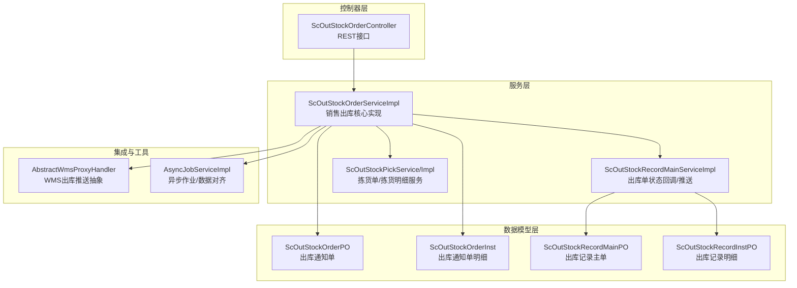
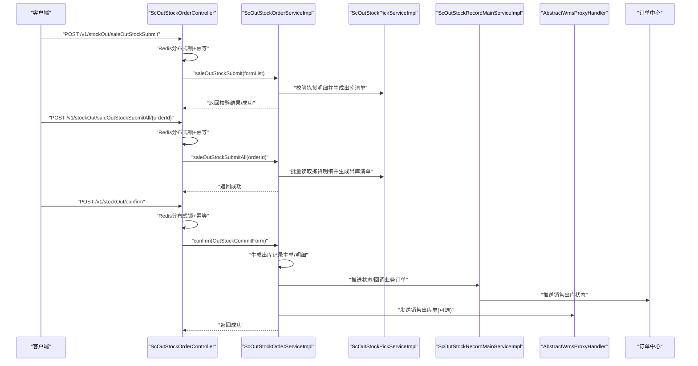
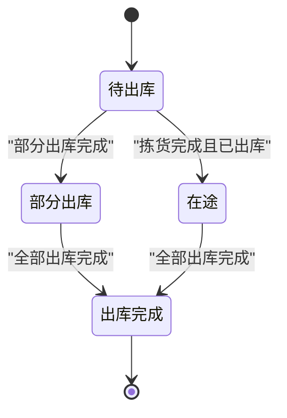
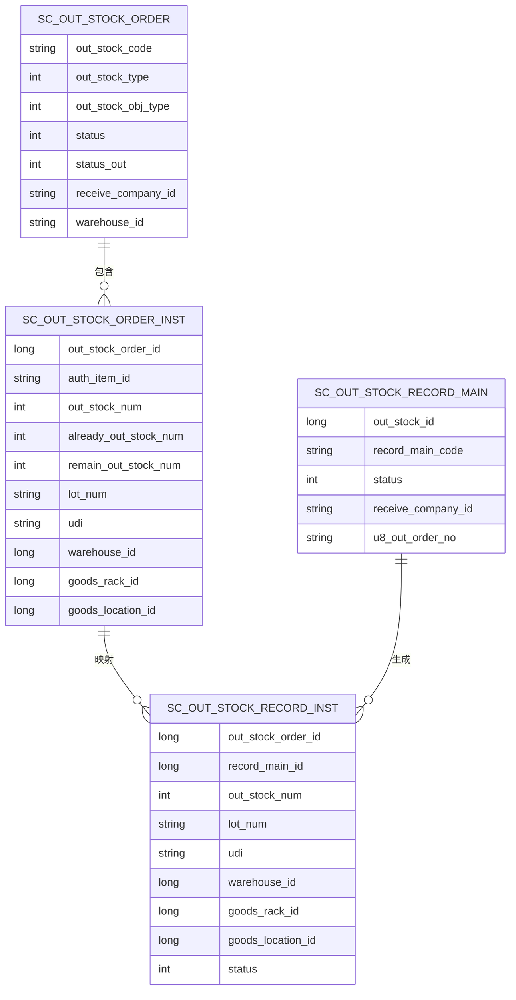
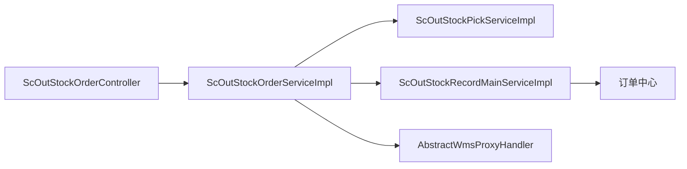

# 销售出库流程

<cite>
**本文引用的文件**   
- [ScOutStockOrderServiceImpl.java](file://guoke-deepexi-storage-center-provider/src/main/java/com/deepexi/storage/service/impl/ScOutStockOrderServiceImpl.java)
- [ScOutStockOrderService.java](file://guoke-deepexi-storage-center-provider/src/main/java/com/deepexi/storage/service/ScOutStockOrderService.java)
- [ScOutStockOrderController.java](file://guoke-deepexi-storage-center-provider/src/main/java/com/deepexi/storage/controller/web/ScOutStockOrderController.java)
- [ScOutStockOrderPO.java](file://guoke-deepexi-storage-center-provider/src/main/java/com/deepexi/storage/model/ScOutStockOrderPO.java)
- [ScOutStockOrderInst.java](file://guoke-deepexi-storage-center-provider/src/main/java/com/deepexi/storage/model/ScOutStockOrderInst.java)
- [ScOutStockRecordMainPO.java](file://guoke-deepexi-storage-center-provider/src/main/java/com/deepexi/storage/model/ScOutStockRecordMainPO.java)
- [ScOutStockRecordInstPO.java](file://guoke-deepexi-storage-center-provider/src/main/java/com/deepexi/storage/model/ScOutStockRecordInstPO.java)
- [OutStockCommitForm.java](file://guoke-deepexi-storage-center-provider/src/main/java/com/deepexi/storage/pojo/form/stockout/OutStockCommitForm.java)
- [ScOutStockRecordMainServiceImpl.java](file://guoke-deepexi-storage-center-provider/src/main/java/com/deepexi/storage/service/impl/ScOutStockRecordMainServiceImpl.java)
- [ScOutStockPickService.java](file://guoke-deepexi-storage-center-provider/src/main/java/com/deepexi/storage/service/ScOutStockPickService.java)
- [ScOutStockPickServiceImpl.java](file://guoke-deepexi-storage-center-provider/src/main/java/com/deepexi/storage/service/impl/ScOutStockPickServiceImpl.java)
- [ScOutStockPickDetailService.java](file://guoke-deepexi-storage-center-provider/src/main/java/com/deepexi/storage/service/ScOutStockPickDetailService.java)
- [ScOutStockPickDetailServiceImpl.java](file://guoke-deepexi-storage-center-provider/src/main/java/com/deepexi/storage/service/impl/ScOutStockPickDetailServiceImpl.java)
- [AbstractWmsProxyHandler.java](file://guoke-deepexi-storage-center-provider/src/main/java/com/deepexi/storage/service/handler/AbstractWmsProxyHandler.java)
- [AsyncJobServiceImpl.java](file://guoke-deepexi-storage-center-provider/src/main/java/com/deepexi/storage/service/AsyncJobServiceImpl.java)
- [ScOutStockOperLogQuery.java](file://guoke-deepexi-storage-center-provider/src/main/java/com/deepexi/storage/pojo/query/stockout/ScOutStockOperLogQuery.java)
</cite>

## 目录
1. [引言](#引言)
2. [项目结构](#项目结构)
3. [核心组件](#核心组件)
4. [架构总览](#架构总览)
5. [详细组件分析](#详细组件分析)
6. [依赖分析](#依赖分析)
7. [性能考虑](#性能考虑)
8. [故障排查指南](#故障排查指南)
9. [结论](#结论)
10. [附录](#附录)

## 引言
本文件面向国科恒泰仓储管理系统中的“销售出库”业务，系统性梳理从“订单创建到出库确认与库存更新”的完整流程，重点解析 ScOutStockOrderServiceImpl 与 OutStockOrderController 的职责边界与协作关系，明确销售出库订单的生命周期管理、关键数据模型、状态流转与业务规则，并给出常见问题的解决方案与最佳实践。

## 项目结构
围绕销售出库的关键模块与文件组织如下：
- 控制器层：对外暴露 REST 接口，负责参数校验、幂等控制与分布式锁保护，调用服务层执行业务逻辑。
- 服务层：实现销售出库的核心业务，包括拣货明细校验、出库清单生成、出库确认、状态推进与与外部系统对接。
- 数据模型层：出库通知单、出库明细、出库记录主单与明细等核心 PO 实体。
- 集成与工具：拣货服务、WMS 代理抽象、异步作业等。

图示来源
- [ScOutStockOrderController.java:1-352](file://guoke-deepexi-storage-center-provider/src/main/java/com/deepexi/storage/controller/web/ScOutStockOrderController.java#L1-L352)
- [ScOutStockOrderServiceImpl.java:1-800](file://guoke-deepexi-storage-center-provider/src/main/java/com/deepexi/storage/service/impl/ScOutStockOrderServiceImpl.java#L1-L800)
- [ScOutStockRecordMainServiceImpl.java:1646-1796](file://guoke-deepexi-storage-center-provider/src/main/java/com/deepexi/storage/service/impl/ScOutStockRecordMainServiceImpl.java#L1646-L1796)
- [ScOutStockPickServiceImpl.java:123-878](file://guoke-deepexi-storage-center-provider/src/main/java/com/deepexi/storage/service/impl/ScOutStockPickServiceImpl.java#L123-L878)
- [AbstractWmsProxyHandler.java:50-68](file://guoke-deepexi-storage-center-provider/src/main/java/com/deepexi/storage/service/handler/AbstractWmsProxyHandler.java#L50-L68)
- [AsyncJobServiceImpl.java:228-302](file://guoke-deepexi-storage-center-provider/src/main/java/com/deepexi/storage/service/AsyncJobServiceImpl.java#L228-L302)

章节来源
- [ScOutStockOrderController.java:1-352](file://guoke-deepexi-storage-center-provider/src/main/java/com/deepexi/storage/controller/web/ScOutStockOrderController.java#L1-L352)
- [ScOutStockOrderServiceImpl.java:1-800](file://guoke-deepexi-storage-center-provider/src/main/java/com/deepexi/storage/service/impl/ScOutStockOrderServiceImpl.java#L1-L800)

## 核心组件
- ScOutStockOrderController：提供销售出库相关接口，如“按明细去出库”、“拣货全部去出库”、“确认出库”等，内置 Redis 分布式锁与幂等控制。
- ScOutStockOrderServiceImpl：销售出库核心实现，负责拣货校验、出库清单生成、出库确认、状态推进、与外部系统对接（如 WMS、订单中心）。
- ScOutStockRecordMainServiceImpl：出库单状态回调与业务订单状态推送，支持销售出库与寄售补货出库状态同步。
- ScOutStockPickService/Impl：拣货单与拣货明细服务，支撑销售出库的拣货到出库闭环。
- 数据模型：ScOutStockOrderPO、ScOutStockOrderInst、ScOutStockRecordMainPO、ScOutStockRecordInstPO。

章节来源
- [ScOutStockOrderController.java:1-352](file://guoke-deepexi-storage-center-provider/src/main/java/com/deepexi/storage/controller/web/ScOutStockOrderController.java#L1-L352)
- [ScOutStockOrderService.java:1-24](file://guoke-deepexi-storage-center-provider/src/main/java/com/deepexi/storage/service/ScOutStockOrderService.java#L1-L24)
- [ScOutStockOrderServiceImpl.java:1-800](file://guoke-deepexi-storage-center-provider/src/main/java/com/deepexi/storage/service/impl/ScOutStockOrderServiceImpl.java#L1-L800)
- [ScOutStockRecordMainServiceImpl.java:1646-1796](file://guoke-deepexi-storage-center-provider/src/main/java/com/deepexi/storage/service/impl/ScOutStockRecordMainServiceImpl.java#L1646-L1796)
- [ScOutStockPickService.java:1-31](file://guoke-deepexi-storage-center-provider/src/main/java/com/deepexi/storage/service/ScOutStockPickService.java#L1-L31)
- [ScOutStockPickServiceImpl.java:123-878](file://guoke-deepexi-storage-center-provider/src/main/java/com/deepexi/storage/service/impl/ScOutStockPickServiceImpl.java#L123-L878)

## 架构总览
销售出库流程涉及“控制器—服务—数据模型—外部系统”的多层交互。控制器负责请求接入与并发控制，服务层负责业务编排与状态推进，数据模型承载业务数据，外部系统通过 WMS 抽象与订单中心进行集成。

图示来源
- [ScOutStockOrderController.java:138-211](file://guoke-deepexi-storage-center-provider/src/main/java/com/deepexi/storage/controller/web/ScOutStockOrderController.java#L138-L211)
- [ScOutStockOrderServiceImpl.java:474-739](file://guoke-deepexi-storage-center-provider/src/main/java/com/deepexi/storage/service/impl/ScOutStockOrderServiceImpl.java#L474-L739)
- [ScOutStockRecordMainServiceImpl.java:1646-1796](file://guoke-deepexi-storage-center-provider/src/main/java/com/deepexi/storage/service/impl/ScOutStockRecordMainServiceImpl.java#L1646-L1796)
- [AbstractWmsProxyHandler.java:50-68](file://guoke-deepexi-storage-center-provider/src/main/java/com/deepexi/storage/service/handler/AbstractWmsProxyHandler.java#L50-L68)

## 详细组件分析

### 1) 销售出库订单生命周期与状态流转
- 订单阶段：出库通知单（ScOutStockOrderPO）→ 出库记录主单（ScOutStockRecordMainPO）→ 出库记录明细（ScOutStockRecordInstPO）
- 关键状态：
  - 出库通知单状态：正常、取消、在途、完成
  - 出库通知单出库状态：待出库、部分出库、出库完成
  - 出库记录主单状态：待出库、出库审核、已出库、已作废、已作废(重新出库)
- 状态推进：
  - “拣货全部去出库”会将拣货明细转为出库清单并推进出库通知单状态
  - “确认出库”生成出库记录主单/明细，推进通知单状态并在必要时触发审批流
  - 出库完成后，回调业务订单状态并推送至订单中心

图示来源
- [ScOutStockOrderPO:121-134](file://guoke-deepexi-storage-center-provider/src/main/java/com/deepexi/storage/model/ScOutStockOrderPO.java#L121-L134)
- [ScOutStockRecordMainPO:76-78](file://guoke-deepexi-storage-center-provider/src/main/java/com/deepexi/storage/model/ScOutStockRecordMainPO.java#L76-L78)

章节来源
- [ScOutStockOrderPO:121-134](file://guoke-deepexi-storage-center-provider/src/main/java/com/deepexi/storage/model/ScOutStockOrderPO.java#L121-L134)
- [ScOutStockRecordMainPO:76-78](file://guoke-deepexi-storage-center-provider/src/main/java/com/deepexi/storage/model/ScOutStockRecordMainPO.java#L76-L78)

### 2) 订单创建与拣货准备
- 拣货单生成与状态：拣货服务负责生成拣货单与拣货明细，状态从“待拣货”逐步推进至“拣货完成”，并为后续“去出库”做准备。
- 拣货明细校验：服务层在“去出库”时对拣货明细进行数量、批次、有效期等校验，确保出库准确性。

章节来源
- [ScOutStockPickService.java:23-31](file://guoke-deepexi-storage-center-provider/src/main/java/com/deepexi/storage/service/ScOutStockPickService.java#L23-L31)
- [ScOutStockPickServiceImpl.java:123-134](file://guoke-deepexi-storage-center-provider/src/main/java/com/deepexi/storage/service/impl/ScOutStockPickServiceImpl.java#L123-L134)
- [ScOutStockPickDetailServiceImpl.java:1-32](file://guoke-deepexi-storage-center-provider/src/main/java/com/deepexi/storage/service/impl/ScOutStockPickDetailServiceImpl.java#L1-L32)

### 3) 商品拣选与出库清单生成
- 明细去出库：控制器提供“按明细去出库”与“拣货全部去出库”两个入口，服务层对拣货明细进行校验并生成出库记录明细。
- 参数校验与错误提示：服务层收集拣货异常项，补充仓库/货架/货位名称并返回统一的错误提示结构。

章节来源
- [ScOutStockOrderController.java:138-182](file://guoke-deepexi-storage-center-provider/src/main/java/com/deepexi/storage/controller/web/ScOutStockOrderController.java#L138-L182)
- [ScOutStockOrderServiceImpl.java:474-512](file://guoke-deepexi-storage-center-provider/src/main/java/com/deepexi/storage/service/impl/ScOutStockOrderServiceImpl.java#L474-L512)
- [ScOutStockOrderServiceImpl.java:548-607](file://guoke-deepexi-storage-center-provider/src/main/java/com/deepexi/storage/service/impl/ScOutStockOrderServiceImpl.java#L548-L607)

### 4) 出库确认与库存更新
- 确认出库：控制器接收 OutStockCommitForm，服务层生成出库记录主单/明细，推进通知单状态，并触发审批流（非样品出库）。
- 审批与路由：服务层构建审批上下文并调用审批组件，自动通过或人工审核后推进状态。
- 路由记录：为每个出库记录生成路由记录，便于追踪物流轨迹。

章节来源
- [ScOutStockOrderController.java:191-211](file://guoke-deepexi-storage-center-provider/src/main/java/com/deepexi/storage/controller/web/ScOutStockOrderController.java#L191-L211)
- [OutStockCommitForm.java:1-20](file://guoke-deepexi-storage-center-provider/src/main/java/com/deepexi/storage/pojo/form/stockout/OutStockCommitForm.java#L1-L20)
- [ScOutStockOrderServiceImpl.java:674-739](file://guoke-deepexi-storage-center-provider/src/main/java/com/deepexi/storage/service/impl/ScOutStockOrderServiceImpl.java#L674-L739)

### 5) 业务订单状态回调与外部系统集成
- 状态回调：出库完成后，服务层回调业务订单状态，组装销售出库数据并推送到订单中心。
- WMS 集成：服务层通过 WMS 抽象发送销售出库单，实现与外部仓储系统的数据互通。

章节来源
- [ScOutStockRecordMainServiceImpl.java:1646-1796](file://guoke-deepexi-storage-center-provider/src/main/java/com/deepexi/storage/service/impl/ScOutStockRecordMainServiceImpl.java#L1646-L1796)
- [AbstractWmsProxyHandler.java:50-68](file://guoke-deepexi-storage-center-provider/src/main/java/com/deepexi/storage/service/handler/AbstractWmsProxyHandler.java#L50-L68)

### 6) 数据模型与字段说明
- 出库通知单（ScOutStockOrderPO）：包含出库单编号、类型、对象类型、状态、拣货状态、收货信息、仓库信息、业务线等。
- 出库通知单明细（ScOutStockOrderInst）：包含授权产品信息、数量、单价、税额、批号、序列号、有效期、仓库/货架/货位等。
- 出库记录主单（ScOutStockRecordMainPO）：包含出库单编号、状态、收货信息、随货同行单、U8单据号、金额等。
- 出库记录明细（ScOutStockRecordInstPO）：包含出库数量、单价、税额、批号、序列号、有效期、仓库/货架/货位、状态等。

图示来源
- [ScOutStockOrderPO.java:26-261](file://guoke-deepexi-storage-center-provider/src/main/java/com/deepexi/storage/model/ScOutStockOrderPO.java#L26-L261)
- [ScOutStockOrderInst.java:34-332](file://guoke-deepexi-storage-center-provider/src/main/java/com/deepexi/storage/model/ScOutStockOrderInst.java#L34-L332)
- [ScOutStockRecordMainPO.java:23-210](file://guoke-deepexi-storage-center-provider/src/main/java/com/deepexi/storage/model/ScOutStockRecordMainPO.java#L23-L210)
- [ScOutStockRecordInstPO.java:23-238](file://guoke-deepexi-storage-center-provider/src/main/java/com/deepexi/storage/model/ScOutStockRecordInstPO.java#L23-L238)

章节来源
- [ScOutStockOrderPO.java:26-261](file://guoke-deepexi-storage-center-provider/src/main/java/com/deepexi/storage/model/ScOutStockOrderPO.java#L26-L261)
- [ScOutStockOrderInst.java:34-332](file://guoke-deepexi-storage-center-provider/src/main/java/com/deepexi/storage/model/ScOutStockOrderInst.java#L34-L332)
- [ScOutStockRecordMainPO.java:23-210](file://guoke-deepexi-storage-center-provider/src/main/java/com/deepexi/storage/model/ScOutStockRecordMainPO.java#L23-L210)
- [ScOutStockRecordInstPO.java:23-238](file://guoke-deepexi-storage-center-provider/src/main/java/com/deepexi/storage/model/ScOutStockRecordInstPO.java#L23-L238)

### 7) 业务规则与校验要点
- 拣货到出库一致性：仅能对已拣货未出库的明细进行出库，且出库数量不得超出拣货数量。
- 批次/有效期/UDI 校验：出库时需匹配拣货明细的批次、有效期与 UDID 等关键属性。
- 并发控制：接口层采用 Redis 分布式锁与幂等注解，避免重复提交与并发冲突。
- 审批流程：非样品出库默认进入审批流，审批通过后方可完成出库确认。

章节来源
- [ScOutStockOrderController.java:138-182](file://guoke-deepexi-storage-center-provider/src/main/java/com/deepexi/storage/controller/web/ScOutStockOrderController.java#L138-L182)
- [ScOutStockOrderServiceImpl.java:474-512](file://guoke-deepexi-storage-center-provider/src/main/java/com/deepexi/storage/service/impl/ScOutStockOrderServiceImpl.java#L474-L512)
- [ScOutStockOrderServiceImpl.java:674-739](file://guoke-deepexi-storage-center-provider/src/main/java/com/deepexi/storage/service/impl/ScOutStockOrderServiceImpl.java#L674-L739)

## 依赖分析
- 控制器依赖服务：ScOutStockOrderController 依赖 ScOutStockOrderService 接口与其实现。
- 服务内部依赖：ScOutStockOrderServiceImpl 依赖拣货服务、记录主单/明细服务、WMS 抽象、订单中心客户端等。
- 数据模型依赖：各 PO 之间通过外键字段建立一对多关系，保证订单与明细的一致性。
- 外部系统依赖：通过 WMS 抽象与订单中心进行集成，实现销售出库单的推送与状态回调。

图示来源
- [ScOutStockOrderController.java:57-58](file://guoke-deepexi-storage-center-provider/src/main/java/com/deepexi/storage/controller/web/ScOutStockOrderController.java#L57-L58)
- [ScOutStockOrderServiceImpl.java:183-319](file://guoke-deepexi-storage-center-provider/src/main/java/com/deepexi/storage/service/impl/ScOutStockOrderServiceImpl.java#L183-L319)
- [ScOutStockRecordMainServiceImpl.java:1646-1796](file://guoke-deepexi-storage-center-provider/src/main/java/com/deepexi/storage/service/impl/ScOutStockRecordMainServiceImpl.java#L1646-L1796)
- [AbstractWmsProxyHandler.java:50-68](file://guoke-deepexi-storage-center-provider/src/main/java/com/deepexi/storage/service/handler/AbstractWmsProxyHandler.java#L50-L68)

章节来源
- [ScOutStockOrderController.java:57-58](file://guoke-deepexi-storage-center-provider/src/main/java/com/deepexi/storage/controller/web/ScOutStockOrderController.java#L57-L58)
- [ScOutStockOrderServiceImpl.java:183-319](file://guoke-deepexi-storage-center-provider/src/main/java/com/deepexi/storage/service/impl/ScOutStockOrderServiceImpl.java#L183-L319)

## 性能考虑
- 分布式锁与幂等：控制器层对关键接口加 Redis 分布式锁与幂等注解，降低并发风险与重复计算成本。
- 批量操作：提供“拣货全部去出库”接口，减少多次往返，提升吞吐。
- 审批流异步化：审批通过后才推进状态，避免阻塞主流程；可通过异步作业进行数据对齐与回写。
- 查询分页：列表查询使用分页组件，避免一次性加载大量数据。

## 故障排查指南
- 常见错误与定位
  - “不存在已拣货未出库的拣货明细”：检查拣货单是否已生成且处于“待出库”状态。
  - “出库数量超出拣货数量”：核对拣货明细与出库清单数量一致性。
  - “出库清单不能为空”：确认已通过“去出库”生成出库记录明细。
  - “当前公司数据正在处理请稍后提交”：检查 Redis 分布式锁是否释放或超时。
- 日志与审计
  - 使用操作日志查询（ScOutStockOperLogQuery）定位操作轨迹与异常节点。
  - 关注拣货明细状态与出库记录状态变化，确保一致性。
- 外部系统问题
  - WMS 推送失败：检查 WMS 抽象实现与网络连通性。
  - 订单中心回调失败：检查回调参数与业务订单状态推进逻辑。

章节来源
- [ScOutStockOrderController.java:138-182](file://guoke-deepexi-storage-center-provider/src/main/java/com/deepexi/storage/controller/web/ScOutStockOrderController.java#L138-L182)
- [ScOutStockOrderServiceImpl.java:474-512](file://guoke-deepexi-storage-center-provider/src/main/java/com/deepexi/storage/service/impl/ScOutStockOrderServiceImpl.java#L474-L512)
- [ScOutStockOperLogQuery.java:48-106](file://guoke-deepexi-storage-center-provider/src/main/java/com/deepexi/storage/pojo/query/stockout/ScOutStockOperLogQuery.java#L48-L106)

## 结论
销售出库流程以“拣货—去出库—确认出库—状态回调—外部系统集成”为主线，通过控制器层的并发控制与服务层的业务编排，实现了从订单到出库的全链路闭环。关键在于拣货与出库的一致性校验、状态推进的严谨性以及与外部系统的稳定对接。建议在实际部署中结合监控与日志体系，持续优化性能与稳定性。

## 附录
- 接口与表单
  - 提交出库明细：/v1/stockOut/saleOutStockSubmit（支持 Redis 分布式锁与幂等）
  - 拣货全部去出库：/v1/stockOut/saleOutStockSubmitAll/{outStockOrderId}
  - 确认出库：/v1/stockOut/confirm（OutStockCommitForm）
- 关键数据模型
  - 出库通知单：ScOutStockOrderPO
  - 出库通知单明细：ScOutStockOrderInst
  - 出库记录主单：ScOutStockRecordMainPO
  - 出库记录明细：ScOutStockRecordInstPO