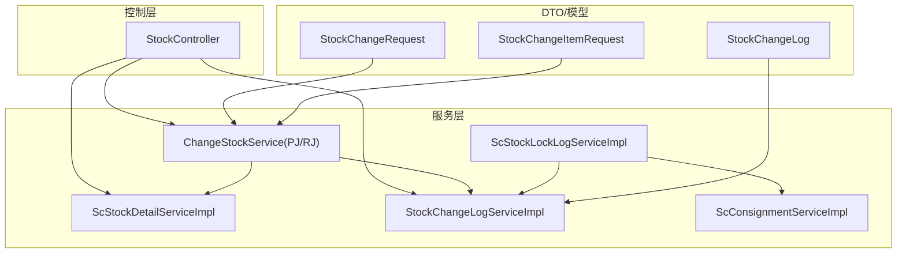
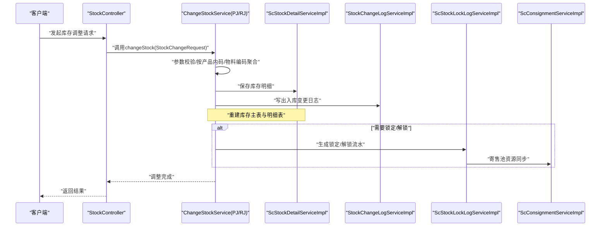
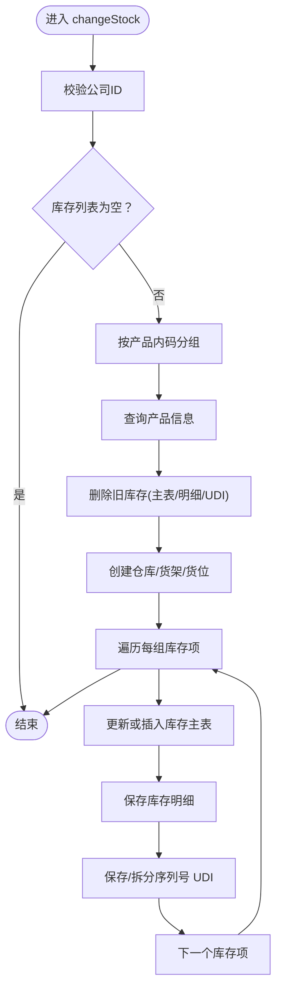
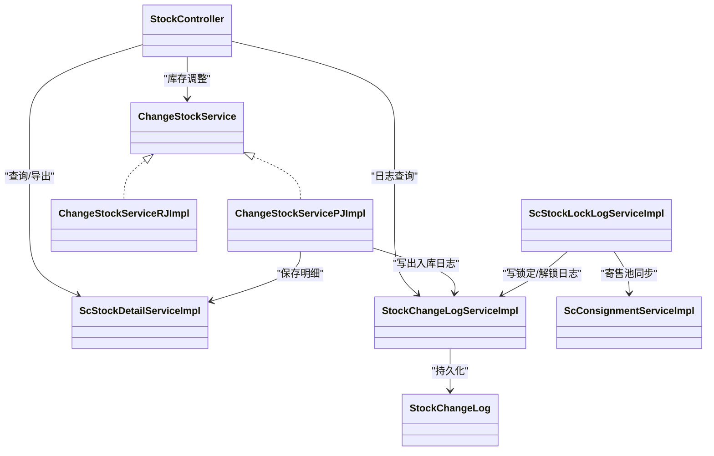

# 库存调整流程

<cite>
**本文引用的文件**
- [StockController.java](file://guoke-deepexi-storage-center-provider/src/main/java/com/deepexi/storage/controller/web/StockController.java)
- [ScStockDetailServiceImpl.java](file://guoke-deepexi-storage-center-provider/src/main/java/com/deepexi/storage/service/impl/ScStockDetailServiceImpl.java)
- [StockChangeLogServiceImpl.java](file://guoke-deepexi-storage-center-provider/src/main/java/com/deepexi/storage/service/impl/StockChangeLogServiceImpl.java)
- [ChangeStockService.java](file://guoke-deepexi-storage-center-provider/src/main/java/com/deepexi/storage/service/changeStock/ChangeStockService.java)
- [ChangeStockServicePJImpl.java](file://guoke-deepexi-storage-center-provider/src/main/java/com/deepexi/storage/service/changeStock/ChangeStockServicePJImpl.java)
- [ChangeStockServiceRJImpl.java](file://guoke-deepexi-storage-center-provider/src/main/java/com/deepexi/storage/service/changeStock/ChangeStockServiceRJImpl.java)
- [StockChangeRequest.java](file://guoke-deepexi-storage-center-api/src/main/java/com/depth/storage/dto/stock/StockChangeRequest.java)
- [StockChangeItemRequest.java](file://guoke-deepexi-storage-center-api/src/main/java/com/depth/storage/dto/stock/StockChangeItemRequest.java)
- [StockChangeLog.java](file://guoke-deepexi-storage-center-provider/src/main/java/com/depth/storage/model/StockChangeLog.java)
- [ScStockLockLogServiceImpl.java](file://guoke-deepexi-storage-center-provider/src/main/java/com/depth/storage/service/impl/ScStockLockLogServiceImpl.java)
- [ScConsignmentServiceImpl.java](file://guoke-deepexi-storage-center-provider/src/main/java/com/depth/storage/service/impl/ScConsignmentServiceImpl.java)
</cite>

## 目录
1. [简介](#简介)
2. [项目结构](#项目结构)
3. [核心组件](#核心组件)
4. [架构总览](#架构总览)
5. [详细组件分析](#详细组件分析)
6. [依赖关系分析](#依赖关系分析)
7. [性能考量](#性能考量)
8. [故障排查指南](#故障排查指南)
9. [结论](#结论)
10. [附录](#附录)

## 简介
本文件面向国科恒泰仓储管理系统中“库存调整”流程，系统性梳理库存盘点、库存转移、库存锁定/解锁等场景的实现细节、调用关系、接口与使用模式。重点围绕以下核心组件展开：StockController、ScStockDetailServiceImpl、StockChangeLogServiceImpl、ChangeStockService 及其 PJ/RJ 实现类；并结合 DTO 定义与日志模型，给出可操作的配置项、参数说明、返回值约定以及常见问题的解决方案。

## 项目结构
围绕库存调整的关键模块分布如下：
- 控制层：StockController 提供库存查询与导出等接口入口
- 服务层：
  - ScStockDetailServiceImpl：库存明细的新增、查询与筛选
  - StockChangeLogServiceImpl：出入库变更日志写入
  - ChangeStockService 及其实现：库存批量调整（沛嘉/PJ、锐健/RJ）
  - ScStockLockLogServiceImpl：库存锁定/解锁流水与寄售池联动
  - ScConsignmentServiceImpl：寄售池加锁/解锁资源同步
- DTO 层：StockChangeRequest/StockChangeItemRequest 描述库存调整输入
- 模型层：StockChangeLog 记录出入库变更日志

图表来源
- [StockController.java:1-143](file://guoke-deepexi-storage-center-provider/src/main/java/com/depth/storage/controller/web/StockController.java#L1-L143)
- [ScStockDetailServiceImpl.java:1-202](file://guoke-deepexi-storage-center-provider/src/main/java/com/depth/storage/service/impl/ScStockDetailServiceImpl.java#L1-L202)
- [StockChangeLogServiceImpl.java:1-116](file://guoke-deepexi-storage-center-provider/src/main/java/com/depth/storage/service/impl/StockChangeLogServiceImpl.java#L1-L116)
- [ChangeStockService.java:1-14](file://guoke-deepexi-storage-center-provider/src/main/java/com/depth/storage/service/changeStock/ChangeStockService.java#L1-L14)
- [ChangeStockServicePJImpl.java:1-230](file://guoke-deepexi-storage-center-provider/src/main/java/com/depth/storage/service/changeStock/ChangeStockServicePJImpl.java#L1-L230)
- [ChangeStockServiceRJImpl.java:1-220](file://guoke-deepexi-storage-center-provider/src/main/java/com/depth/storage/service/changeStock/ChangeStockServiceRJImpl.java#L1-L220)
- [StockChangeRequest.java:1-29](file://guoke-deepexi-storage-center-api/src/main/java/com/depth/storage/dto/stock/StockChangeRequest.java#L1-L29)
- [StockChangeItemRequest.java:1-65](file://guoke-deepexi-storage-center-api/src/main/java/com/depth/storage/dto/stock/StockChangeItemRequest.java#L1-L65)
- [StockChangeLog.java:1-305](file://guoke-deepexi-storage-center-provider/src/main/java/com/depth/storage/model/StockChangeLog.java#L1-L305)

章节来源
- [StockController.java:1-143](file://guoke-deepexi-storage-center-provider/src/main/java/com/depth/storage/controller/web/StockController.java#L1-L143)
- [ScStockDetailServiceImpl.java:1-202](file://guoke-deepexi-storage-center-provider/src/main/java/com/depth/storage/service/impl/ScStockDetailServiceImpl.java#L1-L202)
- [StockChangeLogServiceImpl.java:1-116](file://guoke-deepexi-storage-center-provider/src/main/java/com/depth/storage/service/impl/StockChangeLogServiceImpl.java#L1-L116)
- [ChangeStockService.java:1-14](file://guoke-deepexi-storage-center-provider/src/main/java/com/depth/storage/service/changeStock/ChangeStockService.java#L1-L14)
- [ChangeStockServicePJImpl.java:1-230](file://guoke-deepexi-storage-center-provider/src/main/java/com/depth/storage/service/changeStock/ChangeStockServicePJImpl.java#L1-L230)
- [ChangeStockServiceRJImpl.java:1-220](file://guoke-deepexi-storage-center-provider/src/main/java/com/depth/storage/service/changeStock/ChangeStockServiceRJImpl.java#L1-L220)
- [StockChangeRequest.java:1-29](file://guoke-deepexi-storage-center-api/src/main/java/com/depth/storage/dto/stock/StockChangeRequest.java#L1-L29)
- [StockChangeItemRequest.java:1-65](file://guoke-deepexi-storage-center-api/src/main/java/com/depth/storage/dto/stock/StockChangeItemRequest.java#L1-L65)
- [StockChangeLog.java:1-305](file://guoke-deepexi-storage-center-provider/src/main/java/com/depth/storage/model/StockChangeLog.java#L1-L305)

## 核心组件
- StockController：提供库存分页查询、按批号/编码/明细查询、导出等功能，作为库存调整相关查询的入口。
- ScStockDetailServiceImpl：负责库存明细的保存、按条件查询与聚合，支撑库存调整后的明细落库与查询。
- StockChangeLogServiceImpl：负责出入库变更日志的生成与持久化，确保库存调整可追溯。
- ChangeStockService 及其实现：
  - ChangeStockService：定义统一的库存调整接口。
  - ChangeStockServicePJImpl：针对沛嘉场景的库存批量调整实现，支持按产品内码聚合、删除旧库存后重建。
  - ChangeStockServiceRJImpl：针对锐健场景的库存批量调整实现，支持按物料编码聚合、删除旧库存后重建。
- ScStockLockLogServiceImpl：负责库存锁定/解锁流水记录，支持 FIFO 出库规则、寄售池联动。
- ScConsignmentServiceImpl：与寄售池的加锁/解锁资源同步，保障锁定/解锁一致性。

章节来源
- [StockController.java:44-143](file://guoke-deepexi-storage-center-provider/src/main/java/com/depth/storage/controller/web/StockController.java#L44-L143)
- [ScStockDetailServiceImpl.java:43-202](file://guoke-deepexi-storage-center-provider/src/main/java/com/depth/storage/service/impl/ScStockDetailServiceImpl.java#L43-L202)
- [StockChangeLogServiceImpl.java:18-116](file://guoke-deepexi-storage-center-provider/src/main/java/com/depth/storage/service/impl/StockChangeLogServiceImpl.java#L18-L116)
- [ChangeStockService.java:6-14](file://guoke-deepexi-storage-center-provider/src/main/java/com/depth/storage/service/changeStock/ChangeStockService.java#L6-L14)
- [ChangeStockServicePJImpl.java:35-230](file://guoke-deepexi-storage-center-provider/src/main/java/com/depth/storage/service/changeStock/ChangeStockServicePJImpl.java#L35-L230)
- [ChangeStockServiceRJImpl.java:35-220](file://guoke-deepexi-storage-center-provider/src/main/java/com/depth/storage/service/changeStock/ChangeStockServiceRJImpl.java#L35-L220)
- [ScStockLockLogServiceImpl.java:50-535](file://guoke-deepexi-storage-center-provider/src/main/java/com/depth/storage/service/impl/ScStockLockLogServiceImpl.java#L50-L535)
- [ScConsignmentServiceImpl.java:504-550](file://guoke-deepexi-storage-center-provider/src/main/java/com/depth/storage/service/impl/ScConsignmentServiceImpl.java#L504-L550)

## 架构总览
库存调整涉及“查询—调整—落库—日志—锁定/解锁”的完整闭环。下图展示了从接口到服务再到数据模型的交互路径：

图表来源
- [StockController.java:44-143](file://guoke-deepexi-storage-center-provider/src/main/java/com/depth/storage/controller/web/StockController.java#L44-L143)
- [ChangeStockServicePJImpl.java:60-230](file://guoke-deepexi-storage-center-provider/src/main/java/com/depth/storage/service/changeStock/ChangeStockServicePJImpl.java#L60-L230)
- [ChangeStockServiceRJImpl.java:63-220](file://guoke-deepexi-storage-center-provider/src/main/java/com/depth/storage/service/changeStock/ChangeStockServiceRJImpl.java#L63-L220)
- [ScStockDetailServiceImpl.java:60-127](file://guoke-deepexi-storage-center-provider/src/main/java/com/depth/storage/service/impl/ScStockDetailServiceImpl.java#L60-L127)
- [StockChangeLogServiceImpl.java:25-114](file://guoke-deepexi-storage-center-provider/src/main/java/com/depth/storage/service/impl/StockChangeLogServiceImpl.java#L25-L114)
- [ScStockLockLogServiceImpl.java:137-264](file://guoke-deepexi-storage-center-provider/src/main/java/com/depth/storage/service/impl/ScStockLockLogServiceImpl.java#L137-L264)
- [ScConsignmentServiceImpl.java:518-550](file://guoke-deepexi-storage-center-provider/src/main/java/com/depth/storage/service/impl/ScConsignmentServiceImpl.java#L518-L550)

## 详细组件分析

### StockController：库存查询与导出
- 职责：提供库存分页、按批号/编码/明细查询及导出能力，作为库存调整相关查询的入口。
- 关键点：
  - 分页查询与导出接口均委托给 ScStockService（在该控制器中通过字段注入）。
  - 支持样品库存相关查询与报表导出。
- 使用建议：
  - 在库存调整前先通过分页查询确认当前状态，避免重复调整。
  - 导出功能可用于审计与对账。

章节来源
- [StockController.java:44-143](file://guoke-deepexi-storage-center-provider/src/main/java/com/depth/storage/controller/web/StockController.java#L44-L143)

### ScStockDetailServiceImpl：库存明细管理
- 职责：保存库存明细、按 authItemId 查询明细、按多维条件筛选明细、查询可操作公司等。
- 关键点：
  - 参数校验：createdAt、updatedAt、dr 必填。
  - 查询时聚合仓库与货架信息，补充产品认证信息。
  - 支持按 ids、stockIds、仓库/货架/货位/批次等条件查询。
- 性能与复杂度：
  - 查询采用分页与多表映射，注意批量查询时的内存与网络开销。
- 使用建议：
  - 在库存调整后，使用明细查询核对批号、序列号、有效期等关键字段。

章节来源
- [ScStockDetailServiceImpl.java:43-202](file://guoke-deepexi-storage-center-provider/src/main/java/com/depth/storage/service/impl/ScStockDetailServiceImpl.java#L43-L202)

### StockChangeLogServiceImpl：出入库变更日志
- 职责：根据出入库单据生成库存变更日志，记录期初/变动/期末数量、产品信息、仓库/货架/货位、批号/序列号/UDI、有效期等。
- 关键点：
  - 入库：qtyBefore=历史总和，qtyChange=入库数量，qtyAfter=before+change。
  - 出库：qtyBefore=历史总和或锁定总和（当 isLock=true），qtyChange=出库数量，qtyAfter=before-change。
  - 字段覆盖：产品线、单位、规格、型号、批号、序列号、UDI、生产/失效日期等。
- 使用建议：
  - 日志是审计与对账的核心依据，务必保证字段完整性与事务一致性。

章节来源
- [StockChangeLogServiceImpl.java:18-116](file://guoke-deepexi-storage-center-provider/src/main/java/com/depth/storage/service/impl/StockChangeLogServiceImpl.java#L18-L116)
- [StockChangeLog.java:14-305](file://guoke-deepexi-storage-center-provider/src/main/java/com/depth/storage/model/StockChangeLog.java#L14-L305)

### ChangeStockService 及其实现：库存批量调整
- ChangeStockService：定义统一接口 changeStock(StockChangeRequest)。
- ChangeStockServicePJImpl（沛嘉）：
  - 按产品内码分组，删除指定公司下的库存主表、明细表、UDI 表。
  - 为每个库存项创建/更新库存主表、明细表与 UDI 表，支持序列号拆分。
  - 通过产品管理器获取根产品信息，确保产品维度正确。
- ChangeStockServiceRJImpl（锐健）：
  - 按物料编码分组，删除指定公司且业务类型为 0 的库存相关数据。
  - 逻辑与 PJ 类似，但查询产品方式不同（按物料编码）。
- 关键流程（以 PJ 为例）：

图表来源
- [ChangeStockServicePJImpl.java:60-230](file://guoke-deepexi-storage-center-provider/src/main/java/com/depth/storage/service/changeStock/ChangeStockServicePJImpl.java#L60-L230)
- [ChangeStockServiceRJImpl.java:63-220](file://guoke-deepexi-storage-center-provider/src/main/java/com/depth/storage/service/changeStock/ChangeStockServiceRJImpl.java#L63-L220)

章节来源
- [ChangeStockService.java:6-14](file://guoke-deepexi-storage-center-provider/src/main/java/com/depth/storage/service/changeStock/ChangeStockService.java#L6-L14)
- [ChangeStockServicePJImpl.java:35-230](file://guoke-deepexi-storage-center-provider/src/main/java/com/depth/storage/service/changeStock/ChangeStockServicePJImpl.java#L35-L230)
- [ChangeStockServiceRJImpl.java:35-220](file://guoke-deepexi-storage-center-provider/src/main/java/com/depth/storage/service/changeStock/ChangeStockServiceRJImpl.java#L35-L220)

### 库存锁定/解锁：ScStockLockLogServiceImpl 与 ScConsignmentServiceImpl
- ScStockLockLogServiceImpl：
  - 校验加锁数量非负，若未指定加锁单位则使用常用单位。
  - 基于 FIFO 规则选择可用库存，生成锁定流水，支持寄售池联动。
  - 支持加锁/解锁后的回写与寄售池资源同步。
- ScConsignmentServiceImpl：
  - 针对特定订单类型（如归还/寄售归还）进行寄售池资源的加锁/解锁与删除。
- 关键点：
  - 锁定/解锁状态与流水记录一一对应，便于追踪。
  - 寄售池资源与锁定流水保持一致，避免超卖或误锁。

章节来源
- [ScStockLockLogServiceImpl.java:122-264](file://guoke-deepexi-storage-center-provider/src/main/java/com/depth/storage/service/impl/ScStockLockLogServiceImpl.java#L122-L264)
- [ScConsignmentServiceImpl.java:504-550](file://guoke-deepexi-storage-center-provider/src/main/java/com/depth/storage/service/impl/ScConsignmentServiceImpl.java#L504-L550)

## 依赖关系分析
- 控制层依赖服务层；服务层内部存在跨服务协作：
  - ChangeStockService 实现依赖 ScStockDetailService、ScStockUdiService、产品管理器、仓库/货架/货位服务。
  - StockChangeLogServiceImpl 依赖产品认证信息与出入库单据上下文。
  - ScStockLockLogServiceImpl 依赖 ScStockUdiService、ScInStockOrderService、ScConsignmentServiceImpl。
- 数据模型：
  - StockChangeLog 作为出入库变更的唯一事实来源，被多个服务写入。

图表来源
- [StockController.java:44-143](file://guoke-deepexi-storage-center-provider/src/main/java/com/depth/storage/controller/web/StockController.java#L44-L143)
- [ScStockDetailServiceImpl.java:43-202](file://guoke-deepexi-storage-center-provider/src/main/java/com/depth/storage/service/impl/ScStockDetailServiceImpl.java#L43-L202)
- [StockChangeLogServiceImpl.java:18-116](file://guoke-deepexi-storage-center-provider/src/main/java/com/depth/storage/service/impl/StockChangeLogServiceImpl.java#L18-L116)
- [ChangeStockService.java:6-14](file://guoke-deepexi-storage-center-provider/src/main/java/com/depth/storage/service/changeStock/ChangeStockService.java#L6-L14)
- [ChangeStockServicePJImpl.java:35-230](file://guoke-deepexi-storage-center-provider/src/main/java/com/depth/storage/service/changeStock/ChangeStockServicePJImpl.java#L35-L230)
- [ChangeStockServiceRJImpl.java:35-220](file://guoke-deepexi-storage-center-provider/src/main/java/com/depth/storage/service/changeStock/ChangeStockServiceRJImpl.java#L35-L220)
- [ScStockLockLogServiceImpl.java:50-535](file://guoke-deepexi-storage-center-provider/src/main/java/com/depth/storage/service/impl/ScStockLockLogServiceImpl.java#L50-L535)
- [ScConsignmentServiceImpl.java:504-550](file://guoke-deepexi-storage-center-provider/src/main/java/com/depth/storage/service/impl/ScConsignmentServiceImpl.java#L504-L550)
- [StockChangeLog.java:14-305](file://guoke-deepexi-storage-center-provider/src/main/java/com/depth/storage/model/StockChangeLog.java#L14-L305)

## 性能考量
- 批量调整：
  - PJ/RJ 实现会先删除旧库存再重建，适合全量替换场景；注意在高并发下可能产生短暂的库存不可用窗口。
  - 建议在业务低峰期执行全量替换，或分批导入以降低影响。
- 明细与 UDI 写入：
  - 序列号拆分会增加写入次数，建议控制单条记录的序列号数量或合并写入。
- 日志写入：
  - StockChangeLog 写入频繁，建议关注数据库索引与批量写入策略，避免阻塞主流程。
- 锁定/解锁：
  - FIFO 选择与寄售池同步涉及多次查询与更新，建议开启事务并合理设置重试与幂等逻辑。

## 故障排查指南
- 常见问题与定位
  - 公司ID为空：库存调整入口会抛出参数异常，需检查请求体。
  - 产品信息缺失：按产品内码/物料编码查询不到产品信息会导致异常，需确认产品基础数据维护。
  - 序列号格式错误：序列号包含分隔符时会拆分为多条 UDI，若格式不规范可能导致部分拆分失败。
  - 锁定数量非法：加锁数量必须非负，否则抛出业务异常。
  - 寄售池同步失败：仅对特定订单类型生效，需确认订单类型与寄售池状态。
- 建议排查步骤
  - 核对请求参数：公司ID、产品编码/内码、批号、序列号、数量、有效期等。
  - 查看日志：出入库日志与锁定/解锁日志是否完整写入。
  - 对账：导出库存明细与 UDI 进行比对，确保期初/变动/期末一致。
  - 并发：在高并发场景下观察是否存在重复调整或数据不一致。

章节来源
- [ChangeStockServicePJImpl.java:64-82](file://guoke-deepexi-storage-center-provider/src/main/java/com/depth/storage/service/changeStock/ChangeStockServicePJImpl.java#L64-L82)
- [ChangeStockServiceRJImpl.java:67-82](file://guoke-deepexi-storage-center-provider/src/main/java/com/depth/storage/service/changeStock/ChangeStockServiceRJImpl.java#L67-L82)
- [ScStockLockLogServiceImpl.java:128-135](file://guoke-deepexi-storage-center-provider/src/main/java/com/depth/storage/service/impl/ScStockLockLogServiceImpl.java#L128-L135)
- [ScConsignmentServiceImpl.java:518-522](file://guoke-deepexi-storage-center-provider/src/main/java/com/depth/storage/service/impl/ScConsignmentServiceImpl.java#L518-L522)

## 结论
本文基于实际代码梳理了国科恒泰仓储管理系统中库存调整的完整流程，覆盖查询、批量调整、明细落库、日志记录与锁定/解锁等环节。通过明确各组件职责、调用关系与关键参数，既可帮助初学者快速上手，也为资深开发者提供了深入的技术参考。建议在生产环境中结合业务高峰与数据规模制定导入策略与监控方案，确保库存调整的准确性与时效性。

## 附录

### 接口与使用模式

- 入库/出库日志写入（StockChangeLogServiceImpl）
  - 入库：根据入库单据生成日志，qtyBefore 为历史总和，qtyChange 为入库数量，qtyAfter=before+change。
  - 出库：根据出库单据生成日志，若为采购退回等场景，qtyBefore 使用锁定总和，qtyChange 为出库数量，qtyAfter=before-change。
  - 返回值：无显式返回值，日志持久化成功即完成。
- 库存批量调整（ChangeStockService）
  - 输入：StockChangeRequest（包含公司ID、用户信息、库存列表）。
  - 输出：无显式返回值，调整完成后可通过明细查询核对。
  - 场景差异：PJ 按产品内码聚合，RJ 按物料编码聚合；两者均会删除旧库存后重建。
- 库存锁定/解锁（ScStockLockLogServiceImpl）
  - 输入：锁定/解锁 DTO（含产品、数量、批号、序列号、有效期等）。
  - 流程：校验数量、选择 FIFO 库存、生成流水、寄售池同步。
  - 返回：生成的锁定/解锁流水集合。

章节来源
- [StockChangeLogServiceImpl.java:25-114](file://guoke-deepexi-storage-center-provider/src/main/java/com/depth/storage/service/impl/StockChangeLogServiceImpl.java#L25-L114)
- [ChangeStockService.java:6-14](file://guoke-deepexi-storage-center-provider/src/main/java/com/depth/storage/service/changeStock/ChangeStockService.java#L6-L14)
- [ChangeStockServicePJImpl.java:60-230](file://guoke-deepexi-storage-center-provider/src/main/java/com/depth/storage/service/changeStock/ChangeStockServicePJImpl.java#L60-L230)
- [ChangeStockServiceRJImpl.java:63-220](file://guoke-deepexi-storage-center-provider/src/main/java/com/depth/storage/service/changeStock/ChangeStockServiceRJImpl.java#L63-L220)
- [ScStockLockLogServiceImpl.java:137-264](file://guoke-deepexi-storage-center-provider/src/main/java/com/depth/storage/service/impl/ScStockLockLogServiceImpl.java#L137-L264)