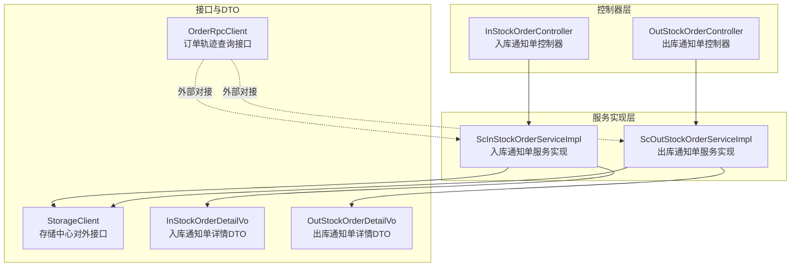
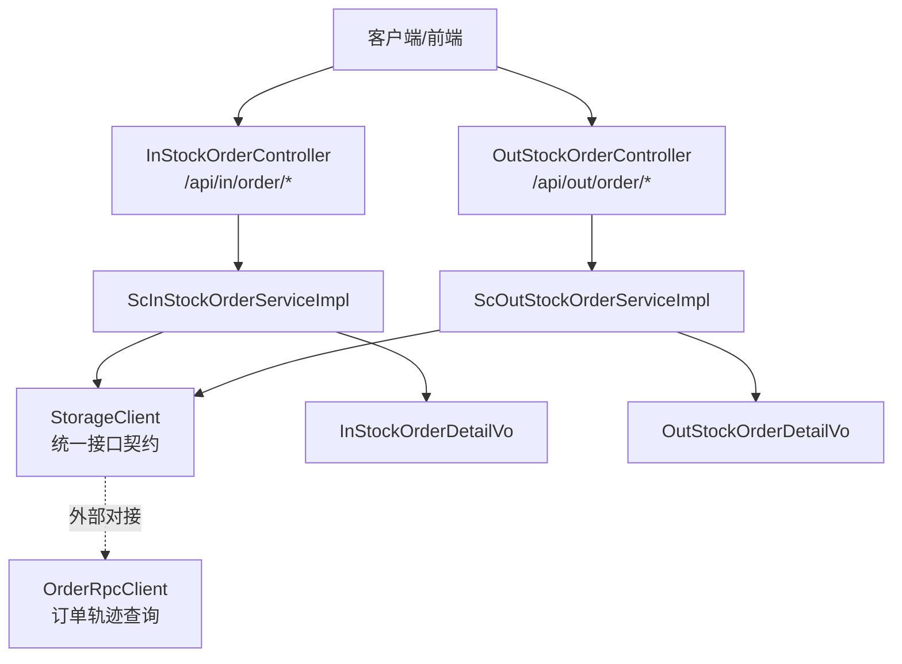
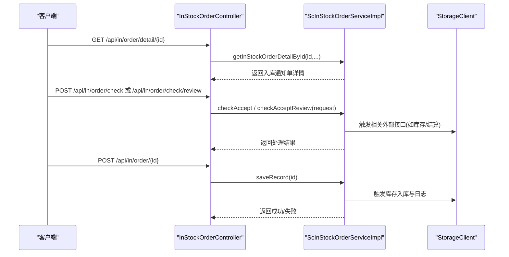
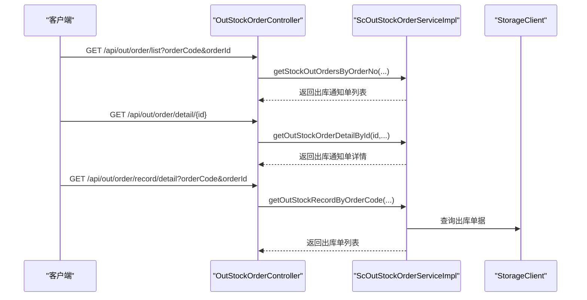
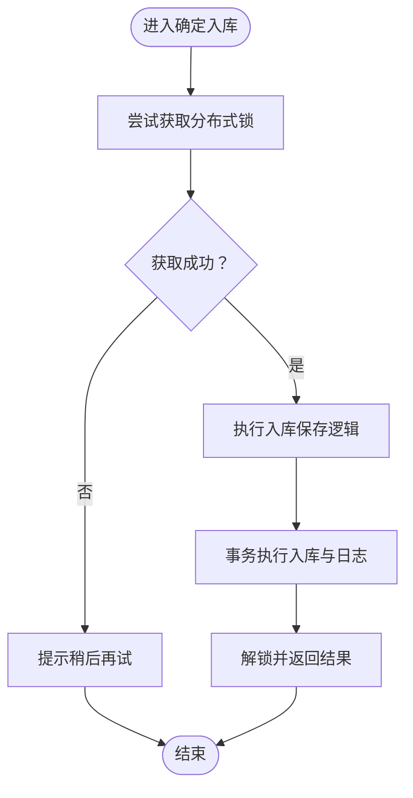
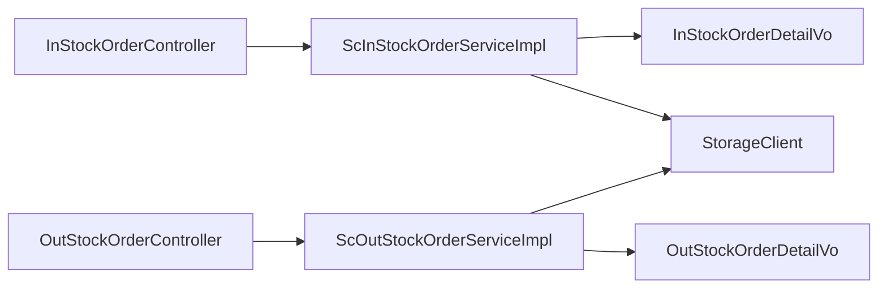

# 订单管理流程

<cite>
**本文引用的文件**
- [InStockOrderController.java](file://guoke-deepexi-storage-center-provider/src/main/java/com/deepexi/storage/controller/web/InStockOrderController.java)
- [OutStockOrderController.java](file://guoke-deepexi-storage-center-provider/src/main/java/com/deepexi/storage/controller/web/OutStockOrderController.java)
- [ScInStockOrderServiceImpl.java](file://guoke-deepexi-storage-center-provider/src/main/java/com/deepexi/storage/service/impl/ScInStockOrderServiceImpl.java)
- [ScOutStockOrderServiceImpl.java](file://guoke-deepexi-storage-center-provider/src/main/java/com/deepexi/storage/service/impl/ScOutStockOrderServiceImpl.java)
- [InStockOrderDetailVo.java](file://guoke-deepexi-storage-center-api/src/main/java/com/deepexi/api/storage/dto/in/InStockOrderDetailVo.java)
- [OutStockOrderDetailVo.java](file://guoke-deepexi-storage-center-api/src/main/java/com/deepexi/api/storage/dto/out/OutStockOrderDetailVo.java)
- [StorageClient.java](file://guoke-deepexi-storage-center-api/src/main/java/com/deepexi/api/storage/StorageClient.java)
- [OrderRpcClient.java](file://guoke-deepexi-storage-center-api/src/main/java/com/deepexi/api/storage/OrderRpcClient.java)
</cite>

## 目录
1. [简介](#简介)
2. [项目结构](#项目结构)
3. [核心组件](#核心组件)
4. [架构总览](#架构总览)
5. [详细组件分析](#详细组件分析)
6. [依赖分析](#依赖分析)
7. [性能考虑](#性能考虑)
8. [故障排查指南](#故障排查指南)
9. [结论](#结论)
10. [附录](#附录)

## 简介
本文件面向国科恒泰仓储管理系统中的“订单管理”模块，围绕入库通知单与出库通知单的生命周期进行系统化梳理，覆盖订单创建、审核、执行、关闭等关键阶段，明确接口定义、调用关系、数据模型与业务规则，并给出常见问题与优化建议。文档以InStockOrderController、OutStockOrderController以及对应的ServiceImpl为核心，结合StorageClient、OrderRpcClient等外部接口，帮助初学者快速上手，同时为有经验的开发者提供足够的技术深度。

## 项目结构
围绕订单管理的关键文件组织如下：
- 控制器层
  - 入库通知单控制器：InStockOrderController
  - 出库通知单控制器：OutStockOrderController
- 服务实现层
  - 入库通知单服务实现：ScInStockOrderServiceImpl
  - 出库通知单服务实现：ScOutStockOrderServiceImpl
- DTO与客户端
  - 入库通知单详情DTO：InStockOrderDetailVo
  - 出库通知单详情DTO：OutStockOrderDetailVo
  - 存储中心对外接口：StorageClient
  - 订单轨迹查询接口：OrderRpcClient

**图表来源**
- [InStockOrderController.java:30-131](file://guoke-deepexi-storage-center-provider/src/main/java/com/deepexi/storage/controller/web/InStockOrderController.java#L30-L131)
- [OutStockOrderController.java:32-85](file://guoke-deepexi-storage-center-provider/src/main/java/com/deepexi/storage/controller/web/OutStockOrderController.java#L32-L85)
- [ScInStockOrderServiceImpl.java:182-314](file://guoke-deepexi-storage-center-provider/src/main/java/com/deepexi/storage/service/impl/ScInStockOrderServiceImpl.java#L182-L314)
- [ScOutStockOrderServiceImpl.java:175-323](file://guoke-deepexi-storage-center-provider/src/main/java/com/deepexi/storage/service/impl/ScOutStockOrderServiceImpl.java#L175-L323)
- [InStockOrderDetailVo.java:22-41](file://guoke-deepexi-storage-center-api/src/main/java/com/deepexi/api/storage/dto/in/InStockOrderDetailVo.java#L22-L41)
- [OutStockOrderDetailVo.java:22-55](file://guoke-deepexi-storage-center-api/src/main/java/com/deepexi/api/storage/dto/out/OutStockOrderDetailVo.java#L22-L55)
- [StorageClient.java:107-620](file://guoke-deepexi-storage-center-api/src/main/java/com/deepexi/api/storage/StorageClient.java#L107-L620)
- [OrderRpcClient.java:19-34](file://guoke-deepexi-storage-center-api/src/main/java/com/deepexi/api/storage/OrderRpcClient.java#L19-L34)

**章节来源**
- [InStockOrderController.java:30-131](file://guoke-deepexi-storage-center-provider/src/main/java/com/deepexi/storage/controller/web/InStockOrderController.java#L30-L131)
- [OutStockOrderController.java:32-85](file://guoke-deepexi-storage-center-provider/src/main/java/com/deepexi/storage/controller/web/OutStockOrderController.java#L32-L85)
- [ScInStockOrderServiceImpl.java:182-314](file://guoke-deepexi-storage-center-provider/src/main/java/com/deepexi/storage/service/impl/ScInStockOrderServiceImpl.java#L182-L314)
- [ScOutStockOrderServiceImpl.java:175-323](file://guoke-deepexi-storage-center-provider/src/main/java/com/deepexi/storage/service/impl/ScOutStockOrderServiceImpl.java#L175-L323)
- [InStockOrderDetailVo.java:22-41](file://guoke-deepexi-storage-center-api/src/main/java/com/deepexi/api/storage/dto/in/InStockOrderDetailVo.java#L22-L41)
- [OutStockOrderDetailVo.java:22-55](file://guoke-deepexi-storage-center-api/src/main/java/com/deepexi/api/storage/dto/out/OutStockOrderDetailVo.java#L22-L55)
- [StorageClient.java:107-620](file://guoke-deepexi-storage-center-api/src/main/java/com/deepexi/api/storage/StorageClient.java#L107-L620)
- [OrderRpcClient.java:19-34](file://guoke-deepexi-storage-center-api/src/main/java/com/deepexi/api/storage/OrderRpcClient.java#L19-L34)

## 核心组件
- 入库通知单控制器
  - 提供查询、验收、复检、确定入库等接口，支持分页与条件筛选；内部使用Redisson分布式锁保障并发安全。
- 出库通知单控制器
  - 提供按订单编号查询出库通知单列表、详情查询、按订单编号查询出库单等功能。
- 入库通知单服务实现
  - 负责订单创建、状态流转、明细计算、库存联动、操作日志、导出、与外部系统对接等。
- 出库通知单服务实现
  - 负责订单创建、状态变更、拣货与出库执行、审批流对接、路由记录、导出等。
- DTO与客户端
  - InStockOrderDetailVo/OutStockOrderDetailVo用于封装订单详情响应；
  - StorageClient定义与外部系统的统一接口契约；
  - OrderRpcClient用于对接订单轨迹查询能力。

**章节来源**
- [InStockOrderController.java:30-131](file://guoke-deepexi-storage-center-provider/src/main/java/com/deepexi/storage/controller/web/InStockOrderController.java#L30-L131)
- [OutStockOrderController.java:32-85](file://guoke-deepexi-storage-center-provider/src/main/java/com/deepexi/storage/controller/web/OutStockOrderController.java#L32-L85)
- [ScInStockOrderServiceImpl.java:182-314](file://guoke-deepexi-storage-center-provider/src/main/java/com/deepexi/storage/service/impl/ScInStockOrderServiceImpl.java#L182-L314)
- [ScOutStockOrderServiceImpl.java:175-323](file://guoke-deepexi-storage-center-provider/src/main/java/com/deepexi/storage/service/impl/ScOutStockOrderServiceImpl.java#L175-L323)
- [InStockOrderDetailVo.java:22-41](file://guoke-deepexi-storage-center-api/src/main/java/com/deepexi/api/storage/dto/in/InStockOrderDetailVo.java#L22-L41)
- [OutStockOrderDetailVo.java:22-55](file://guoke-deepexi-storage-center-api/src/main/java/com/deepexi/api/storage/dto/out/OutStockOrderDetailVo.java#L22-L55)
- [StorageClient.java:107-620](file://guoke-deepexi-storage-center-api/src/main/java/com/deepexi/api/storage/StorageClient.java#L107-L620)
- [OrderRpcClient.java:19-34](file://guoke-deepexi-storage-center-api/src/main/java/com/deepexi/api/storage/OrderRpcClient.java#L19-L34)

## 架构总览
订单管理采用“控制器-服务实现-接口/DTO-外部客户端”的分层架构，控制器负责HTTP入口与参数校验，服务实现负责业务编排与事务控制，接口/DTO负责跨模块数据契约，外部客户端负责与第三方系统交互。

**图表来源**
- [InStockOrderController.java:30-131](file://guoke-deepexi-storage-center-provider/src/main/java/com/deepexi/storage/controller/web/InStockOrderController.java#L30-L131)
- [OutStockOrderController.java:32-85](file://guoke-deepexi-storage-center-provider/src/main/java/com/deepexi/storage/controller/web/OutStockOrderController.java#L32-L85)
- [ScInStockOrderServiceImpl.java:182-314](file://guoke-deepexi-storage-center-provider/src/main/java/com/deepexi/storage/service/impl/ScInStockOrderServiceImpl.java#L182-L314)
- [ScOutStockOrderServiceImpl.java:175-323](file://guoke-deepexi-storage-center-provider/src/main/java/com/deepexi/storage/service/impl/ScOutStockOrderServiceImpl.java#L175-L323)
- [InStockOrderDetailVo.java:22-41](file://guoke-deepexi-storage-center-api/src/main/java/com/deepexi/api/storage/dto/in/InStockOrderDetailVo.java#L22-L41)
- [OutStockOrderDetailVo.java:22-55](file://guoke-deepexi-storage-center-api/src/main/java/com/deepexi/api/storage/dto/out/OutStockOrderDetailVo.java#L22-L55)
- [StorageClient.java:107-620](file://guoke-deepexi-storage-center-api/src/main/java/com/deepexi/api/storage/StorageClient.java#L107-L620)
- [OrderRpcClient.java:19-34](file://guoke-deepexi-storage-center-api/src/main/java/com/deepexi/api/storage/OrderRpcClient.java#L19-L34)

## 详细组件分析

### 入库通知单生命周期与接口
- 创建与初始化
  - 通过ScInStockOrderServiceImpl完成入库通知单的创建、状态设置、编码生成、明细落库等。
- 审核与验收
  - 控制器提供“验收/复检”接口，服务实现负责校验与状态推进。
- 执行与入库
  - 控制器提供“确定入库”接口，使用Redisson分布式锁避免并发冲突；服务实现负责库存更新、日志记录与后续流程触发。
- 关闭与导出
  - 支持按订单编号查询入库通知单与入库单列表，导出功能由服务实现提供。

**图表来源**
- [InStockOrderController.java:40-129](file://guoke-deepexi-storage-center-provider/src/main/java/com/deepexi/storage/controller/web/InStockOrderController.java#L40-L129)
- [ScInStockOrderServiceImpl.java:318-392](file://guoke-deepexi-storage-center-provider/src/main/java/com/deepexi/storage/service/impl/ScInStockOrderServiceImpl.java#L318-L392)
- [StorageClient.java:107-620](file://guoke-deepexi-storage-center-api/src/main/java/com/deepexi/api/storage/StorageClient.java#L107-L620)

**章节来源**
- [InStockOrderController.java:40-129](file://guoke-deepexi-storage-center-provider/src/main/java/com/deepexi/storage/controller/web/InStockOrderController.java#L40-L129)
- [ScInStockOrderServiceImpl.java:318-392](file://guoke-deepexi-storage-center-provider/src/main/java/com/deepexi/storage/service/impl/ScInStockOrderServiceImpl.java#L318-L392)
- [InStockOrderDetailVo.java:22-41](file://guoke-deepexi-storage-center-api/src/main/java/com/deepexi/api/storage/dto/in/InStockOrderDetailVo.java#L22-L41)
- [StorageClient.java:107-620](file://guoke-deepexi-storage-center-api/src/main/java/com/deepexi/api/storage/StorageClient.java#L107-L620)

### 出库通知单生命周期与接口
- 创建与初始化
  - 通过ScOutStockOrderServiceImpl完成出库通知单创建、状态设置、编码生成、明细落库等。
- 审核与执行
  - 支持提交出库清单、自动审批流对接、拣货状态联动与路由记录。
- 关闭与状态推进
  - 根据出库单明细与出库记录推进通知单状态，支持“在途/完成”等状态切换。

**图表来源**
- [OutStockOrderController.java:38-83](file://guoke-deepexi-storage-center-provider/src/main/java/com/deepexi/storage/controller/web/OutStockOrderController.java#L38-L83)
- [ScOutStockOrderServiceImpl.java:323-343](file://guoke-deepexi-storage-center-provider/src/main/java/com/deepexi/storage/service/impl/ScOutStockOrderServiceImpl.java#L323-L343)
- [OutStockOrderDetailVo.java:22-55](file://guoke-deepexi-storage-center-api/src/main/java/com/deepexi/api/storage/dto/out/OutStockOrderDetailVo.java#L22-L55)
- [StorageClient.java:107-620](file://guoke-deepexi-storage-center-api/src/main/java/com/deepexi/api/storage/StorageClient.java#L107-L620)

**章节来源**
- [OutStockOrderController.java:38-83](file://guoke-deepexi-storage-center-provider/src/main/java/com/deepexi/storage/controller/web/OutStockOrderController.java#L38-L83)
- [ScOutStockOrderServiceImpl.java:323-343](file://guoke-deepexi-storage-center-provider/src/main/java/com/deepexi/storage/service/impl/ScOutStockOrderServiceImpl.java#L323-L343)
- [OutStockOrderDetailVo.java:22-55](file://guoke-deepexi-storage-center-api/src/main/java/com/deepexi/api/storage/dto/out/OutStockOrderDetailVo.java#L22-L55)
- [StorageClient.java:107-620](file://guoke-deepexi-storage-center-api/src/main/java/com/deepexi/api/storage/StorageClient.java#L107-L620)

### 数据模型与复杂度分析
- 入库通知单详情模型
  - 字段涵盖通知单主键、编码、供应商、创建人、仓库、提交时间、单据类型、状态及分页明细。
- 出库通知单详情模型
  - 字段涵盖通知单主键、编码、关联订单号、创建人、提交时间、物流信息、收货人/公司/仓库、单据类型及分页明细。
- 复杂度要点
  - 分页查询与明细聚合：服务实现中对订单明细进行聚合统计与分页，时间复杂度与订单项数量线性相关。
  - 并发控制：确定入库使用Redisson分布式锁，避免重复提交导致的状态错乱。

**章节来源**
- [InStockOrderDetailVo.java:22-41](file://guoke-deepexi-storage-center-api/src/main/java/com/deepexi/api/storage/dto/in/InStockOrderDetailVo.java#L22-L41)
- [OutStockOrderDetailVo.java:22-55](file://guoke-deepexi-storage-center-api/src/main/java/com/deepexi/api/storage/dto/out/OutStockOrderDetailVo.java#L22-L55)
- [InStockOrderController.java:76-93](file://guoke-deepexi-storage-center-provider/src/main/java/com/deepexi/storage/controller/web/InStockOrderController.java#L76-L93)

### 复杂逻辑流程图：确定入库（并发安全）

**图表来源**
- [InStockOrderController.java:76-93](file://guoke-deepexi-storage-center-provider/src/main/java/com/deepexi/storage/controller/web/InStockOrderController.java#L76-L93)
- [ScInStockOrderServiceImpl.java:666-781](file://guoke-deepexi-storage-center-provider/src/main/java/com/deepexi/storage/service/impl/ScInStockOrderServiceImpl.java#L666-L781)

**章节来源**
- [InStockOrderController.java:76-93](file://guoke-deepexi-storage-center-provider/src/main/java/com/deepexi/storage/controller/web/InStockOrderController.java#L76-L93)
- [ScInStockOrderServiceImpl.java:666-781](file://guoke-deepexi-storage-center-provider/src/main/java/com/deepexi/storage/service/impl/ScInStockOrderServiceImpl.java#L666-L781)

## 依赖分析
- 控制器到服务实现
  - InStockOrderController与OutStockOrderController分别注入ScInStockOrderService与ScOutStockOrderService，形成清晰的职责边界。
- 服务实现到接口/客户端
  - 两个ServiceImpl均通过StorageClient与外部系统交互，统一接口契约便于扩展与替换。
- DTO与服务实现
  - 服务实现返回的VO与API层DTO保持一致，确保前后端契约稳定。

**图表来源**
- [InStockOrderController.java:32-35](file://guoke-deepexi-storage-center-provider/src/main/java/com/deepexi/storage/controller/web/InStockOrderController.java#L32-L35)
- [OutStockOrderController.java:35-36](file://guoke-deepexi-storage-center-provider/src/main/java/com/deepexi/storage/controller/web/OutStockOrderController.java#L35-L36)
- [ScInStockOrderServiceImpl.java:182-314](file://guoke-deepexi-storage-center-provider/src/main/java/com/deepexi/storage/service/impl/ScInStockOrderServiceImpl.java#L182-L314)
- [ScOutStockOrderServiceImpl.java:175-323](file://guoke-deepexi-storage-center-provider/src/main/java/com/deepexi/storage/service/impl/ScOutStockOrderServiceImpl.java#L175-L323)
- [InStockOrderDetailVo.java:22-41](file://guoke-deepexi-storage-center-api/src/main/java/com/deepexi/api/storage/dto/in/InStockOrderDetailVo.java#L22-L41)
- [OutStockOrderDetailVo.java:22-55](file://guoke-deepexi-storage-center-api/src/main/java/com/deepexi/api/storage/dto/out/OutStockOrderDetailVo.java#L22-L55)
- [StorageClient.java:107-620](file://guoke-deepexi-storage-center-api/src/main/java/com/deepexi/api/storage/StorageClient.java#L107-L620)

**章节来源**
- [InStockOrderController.java:32-35](file://guoke-deepexi-storage-center-provider/src/main/java/com/deepexi/storage/controller/web/InStockOrderController.java#L32-L35)
- [OutStockOrderController.java:35-36](file://guoke-deepexi-storage-center-provider/src/main/java/com/deepexi/storage/controller/web/OutStockOrderController.java#L35-L36)
- [ScInStockOrderServiceImpl.java:182-314](file://guoke-deepexi-storage-center-provider/src/main/java/com/deepexi/storage/service/impl/ScInStockOrderServiceImpl.java#L182-L314)
- [ScOutStockOrderServiceImpl.java:175-323](file://guoke-deepexi-storage-center-provider/src/main/java/com/deepexi/storage/service/impl/ScOutStockOrderServiceImpl.java#L175-L323)
- [StorageClient.java:107-620](file://guoke-deepexi-storage-center-api/src/main/java/com/deepexi/api/storage/StorageClient.java#L107-L620)

## 性能考虑
- 分页与聚合
  - 服务实现广泛使用分页组件与聚合统计，建议在高并发场景下合理设置分页大小与索引策略，避免大列表全量扫描。
- 并发控制
  - 确定入库使用Redisson分布式锁，建议结合业务峰值评估锁粒度与超时时间，防止热点单据阻塞。
- 外部接口调用
  - 通过StorageClient统一外部调用，建议在服务层增加重试与熔断策略，提升整体可用性。

[本节为通用指导，无需具体文件引用]

## 故障排查指南
- 确定入库失败或提示“请稍后提交”
  - 可能原因：分布式锁被占用；建议等待锁释放或检查上游是否异常阻塞。
  - 参考路径：[InStockOrderController.java:76-93](file://guoke-deepexi-storage-center-provider/src/main/java/com/deepexi/storage/controller/web/InStockOrderController.java#L76-L93)
- 出库通知单状态推进异常
  - 可能原因：拣货未完成或出库数量超限；建议检查拣货明细与出库数量一致性。
  - 参考路径：[ScOutStockOrderServiceImpl.java:426-472](file://guoke-deepexi-storage-center-provider/src/main/java/com/deepexi/storage/service/impl/ScOutStockOrderServiceImpl.java#L426-L472)
- 订单详情查询为空
  - 可能原因：订单不存在或参数不匹配；建议核对订单编号与公司维度。
  - 参考路径：[InStockOrderController.java:60-68](file://guoke-deepexi-storage-center-provider/src/main/java/com/deepexi/storage/controller/web/InStockOrderController.java#L60-L68)，[OutStockOrderController.java:64-69](file://guoke-deepexi-storage-center-provider/src/main/java/com/deepexi/storage/controller/web/OutStockOrderController.java#L64-L69)

**章节来源**
- [InStockOrderController.java:76-93](file://guoke-deepexi-storage-center-provider/src/main/java/com/deepexi/storage/controller/web/InStockOrderController.java#L76-L93)
- [ScOutStockOrderServiceImpl.java:426-472](file://guoke-deepexi-storage-center-provider/src/main/java/com/deepexi/storage/service/impl/ScOutStockOrderServiceImpl.java#L426-L472)
- [InStockOrderController.java:60-68](file://guoke-deepexi-storage-center-provider/src/main/java/com/deepexi/storage/controller/web/InStockOrderController.java#L60-L68)
- [OutStockOrderController.java:64-69](file://guoke-deepexi-storage-center-provider/src/main/java/com/deepexi/storage/controller/web/OutStockOrderController.java#L64-L69)

## 结论
订单管理模块通过清晰的分层设计与统一的接口契约，实现了入库通知单与出库通知单的完整生命周期管理。控制器层提供稳定的HTTP入口，服务实现层承载复杂的业务编排与事务控制，接口/DTO与外部客户端保证了系统的可扩展性。建议在高并发场景下关注锁策略与分页性能，并持续完善外部接口的容错机制。

[本节为总结性内容，无需具体文件引用]

## 附录

### 接口与返回值概览
- 入库通知单
  - 查询详情：GET /api/in/order/detail/{id} → 返回InStockOrderDetailVo
  - 确定入库：POST /api/in/order/{id} → 返回布尔值
  - 验收/复检：POST /api/in/order/check | /api/in/order/check/review → 返回布尔值
  - 按订单查询通知单/入库单：GET /api/in/order/list/orderCodeAndId... | GET /api/in/order/record/orderCodeAndId...
- 出库通知单
  - 查询通知单列表：GET /api/out/order/list → 返回列表
  - 查询详情：GET /api/out/order/detail/{id} → 返回OutStockOrderDetailVo
  - 查询出库单：GET /api/out/order/record/detail → 返回列表

**章节来源**
- [InStockOrderController.java:40-129](file://guoke-deepexi-storage-center-provider/src/main/java/com/deepexi/storage/controller/web/InStockOrderController.java#L40-L129)
- [OutStockOrderController.java:38-83](file://guoke-deepexi-storage-center-provider/src/main/java/com/deepexi/storage/controller/web/OutStockOrderController.java#L38-L83)
- [InStockOrderDetailVo.java:22-41](file://guoke-deepexi-storage-center-api/src/main/java/com/deepexi/api/storage/dto/in/InStockOrderDetailVo.java#L22-L41)
- [OutStockOrderDetailVo.java:22-55](file://guoke-deepexi-storage-center-api/src/main/java/com/deepexi/api/storage/dto/out/OutStockOrderDetailVo.java#L22-L55)
- [StorageClient.java:107-620](file://guoke-deepexi-storage-center-api/src/main/java/com/deepexi/api/storage/StorageClient.java#L107-L620)