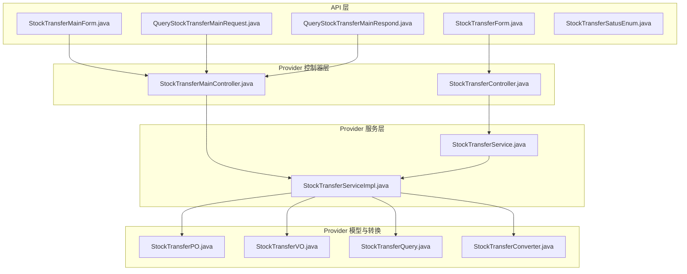
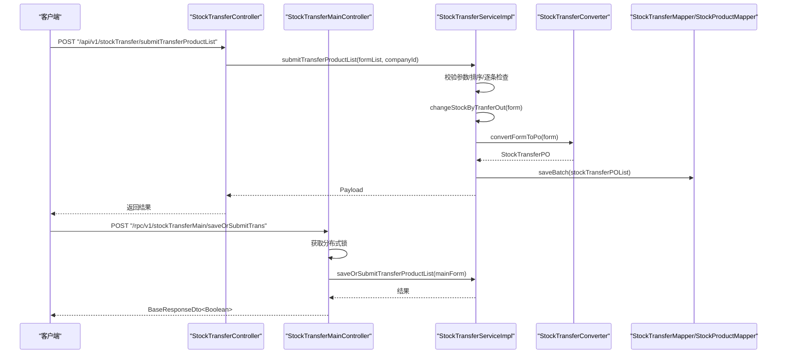
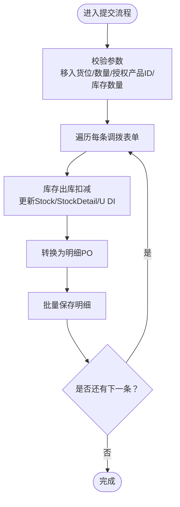
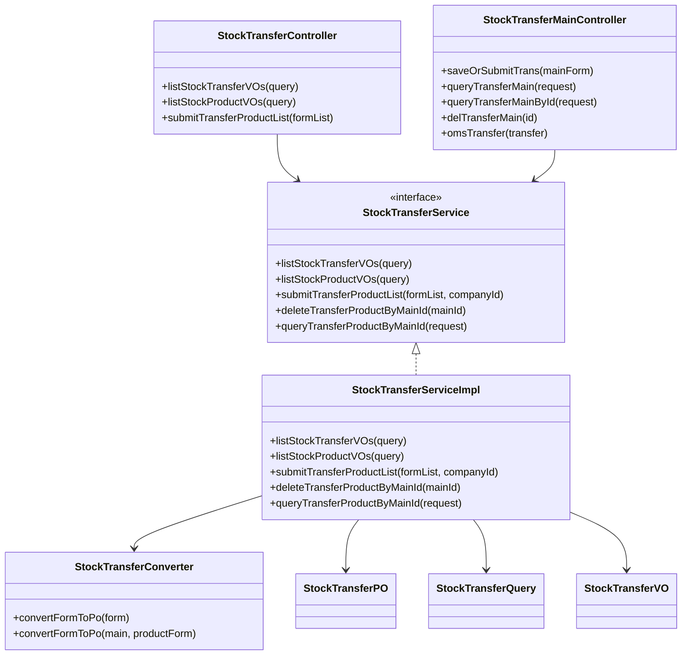

# 调拨业务流程

<cite>
**本文引用的文件**
- [StockTransferController.java](file://guoke-deepexi-storage-center-provider/src/main/java/com/deepexi/storage/controller/web/StockTransferController.java)
- [StockTransferMainController.java](file://guoke-deepexi-storage-center-provider/src/main/java/com/deepexi/storage/controller/rpc/StockTransferMainController.java)
- [StockTransferService.java](file://guoke-deepexi-storage-center-provider/src/main/java/com/deepexi/storage/service/StockTransferService.java)
- [StockTransferServiceImpl.java](file://guoke-deepexi-storage-center-provider/src/main/java/com/deepexi/storage/service/impl/StockTransferServiceImpl.java)
- [StockTransferForm.java](file://guoke-deepexi-storage-center-api/src/main/java/com/deepexi/api/storage/dto/transfer/StockTransferForm.java)
- [StockTransferMainForm.java](file://guoke-deepexi-storage-center-api/src/main/java/com/deepexi/api/storage/dto/transfer/StockTransferMainForm.java)
- [QueryStockTransferMainRequest.java](file://guoke-deepexi-storage-center-api/src/main/java/com/deepexi/api/storage/dto/transfer/QueryStockTransferMainRequest.java)
- [QueryStockTransferMainRespond.java](file://guoke-deepexi-storage-center-api/src/main/java/com/deepexi/api/storage/dto/transfer/QueryStockTransferMainRespond.java)
- [StockTransferPO.java](file://guoke-deepexi-storage-center-provider/src/main/java/com/deepexi/storage/model/StockTransferPO.java)
- [StockTransferQuery.java](file://guoke-deepexi-storage-center-provider/src/main/java/com/deepexi/storage/pojo/query/transfer/StockTransferQuery.java)
- [StockTransferVO.java](file://guoke-deepexi-storage-center-provider/src/main/java/com/deepexi/storage/pojo/vo/transfer/StockTransferVO.java)
- [StockTransferConverter.java](file://guoke-deepexi-storage-center-provider/src/main/java/com/deepexi/storage/converter/transfer/StockTransferConverter.java)
- [StockTransferSatusEnum.java](file://guoke-deepexi-storage-center-api/src/main/java/com/deepexi/api/storage/enums/StockTransferSatusEnum.java)
</cite>

## 目录
1. [简介](#简介)
2. [项目结构](#项目结构)
3. [核心组件](#核心组件)
4. [架构总览](#架构总览)
5. [详细组件分析](#详细组件分析)
6. [依赖关系分析](#依赖关系分析)
7. [性能考量](#性能考量)
8. [故障排查指南](#故障排查指南)
9. [结论](#结论)
10. [附录](#附录)

## 简介
本文件面向国科恒泰仓储管理系统中的“调拨”业务流程，系统性梳理从“库存调拨申请、调拨审批、调拨执行、调拨确认”的完整链路，重点说明以下内容：
- 控制器与服务层职责划分：StockTransferController（Web入口）、StockTransferMainController（RPC入口）
- 服务实现细节：StockTransferServiceImpl 的参数校验、库存扣减与新增、明细与U DI联动更新
- 数据模型与转换：StockTransferPO、StockTransferForm/MainForm、StockTransferConverter
- 查询与分页：StockTransferQuery、StockTransferVO、QueryStockTransferMainRequest/Respond
- 与库存管理、仓库管理、货位/货架、产品授权项的关联
- 常见问题与排障建议

## 项目结构
调拨相关代码主要分布在 provider 层的 controller、service、mapper、model、pojo、converter 等包中；API 层提供 DTO 与枚举。

图表来源
- [StockTransferController.java:30-64](file://guoke-deepexi-storage-center-provider/src/main/java/com/deepexi/storage/controller/web/StockTransferController.java#L30-L64)
- [StockTransferMainController.java:32-134](file://guoke-deepexi-storage-center-provider/src/main/java/com/deepexi/storage/controller/rpc/StockTransferMainController.java#L32-L134)
- [StockTransferService.java:22-42](file://guoke-deepexi-storage-center-provider/src/main/java/com/deepexi/storage/service/StockTransferService.java#L22-L42)
- [StockTransferServiceImpl.java:52-641](file://guoke-deepexi-storage-center-provider/src/main/java/com/deepexi/storage/service/impl/StockTransferServiceImpl.java#L52-L641)
- [StockTransferForm.java:14-68](file://guoke-deepexi-storage-center-api/src/main/java/com/deepexi/api/storage/dto/transfer/StockTransferForm.java#L14-L68)
- [StockTransferMainForm.java:17-54](file://guoke-deepexi-storage-center-api/src/main/java/com/deepexi/api/storage/dto/transfer/StockTransferMainForm.java#L17-L54)
- [QueryStockTransferMainRequest.java:18-69](file://guoke-deepexi-storage-center-api/src/main/java/com/deepexi/api/storage/dto/transfer/QueryStockTransferMainRequest.java#L18-L69)
- [QueryStockTransferMainRespond.java:11-52](file://guoke-deepexi-storage-center-api/src/main/java/com/deepexi/api/storage/dto/transfer/QueryStockTransferMainRespond.java#L11-L52)
- [StockTransferPO.java:18-128](file://guoke-deepexi-storage-center-provider/src/main/java/com/deepexi/storage/model/StockTransferPO.java#L18-L128)
- [StockTransferQuery.java:14-158](file://guoke-deepexi-storage-center-provider/src/main/java/com/deepexi/storage/pojo/query/transfer/StockTransferQuery.java#L14-L158)
- [StockTransferVO.java:20-161](file://guoke-deepexi-storage-center-provider/src/main/java/com/deepexi/storage/pojo/vo/transfer/StockTransferVO.java#L20-L161)
- [StockTransferConverter.java:19-106](file://guoke-deepexi-storage-center-provider/src/main/java/com/deepexi/storage/converter/transfer/StockTransferConverter.java#L19-L106)

章节来源
- [StockTransferController.java:30-64](file://guoke-deepexi-storage-center-provider/src/main/java/com/deepexi/storage/controller/web/StockTransferController.java#L30-L64)
- [StockTransferMainController.java:32-134](file://guoke-deepexi-storage-center-provider/src/main/java/com/deepexi/storage/controller/rpc/StockTransferMainController.java#L32-L134)

## 核心组件
- Web 入口控制器：StockTransferController 提供分页查询与提交调拨产品清单的能力，负责注入 StockTransferService 并进行参数预处理（如公司ID注入）。
- RPC 入口控制器：StockTransferMainController 提供主单保存/提交、查询主单、按主单查询子单、删除主单、OMS 对接等能力，并使用分布式锁保障并发安全。
- 服务接口与实现：StockTransferService 定义了分页查询、提交清单、按主单删除子单、按主单与条件查询子单等方法；StockTransferServiceImpl 实现了参数校验、库存扣减与新增、明细与U DI联动更新、VO 转换与名称映射等逻辑。
- 数据模型与转换：StockTransferPO 表示调拨明细记录；StockTransferConverter 负责将 DTO/Form 转换为 PO；StockTransferVO 用于对外返回分页结果。
- 查询与响应：StockTransferQuery/StockTransferVO 用于 Web 查询；QueryStockTransferMainRequest/Respond 用于 RPC 查询主单与子单。

章节来源
- [StockTransferService.java:22-42](file://guoke-deepexi-storage-center-provider/src/main/java/com/deepexi/storage/service/StockTransferService.java#L22-L42)
- [StockTransferServiceImpl.java:52-641](file://guoke-deepexi-storage-center-provider/src/main/java/com/deepexi/storage/service/impl/StockTransferServiceImpl.java#L52-L641)
- [StockTransferPO.java:18-128](file://guoke-deepexi-storage-center-provider/src/main/java/com/deepexi/storage/model/StockTransferPO.java#L18-L128)
- [StockTransferConverter.java:19-106](file://guoke-deepexi-storage-center-provider/src/main/java/com/deepexi/storage/converter/transfer/StockTransferConverter.java#L19-L106)
- [StockTransferQuery.java:14-158](file://guoke-deepexi-storage-center-provider/src/main/java/com/deepexi/storage/pojo/query/transfer/StockTransferQuery.java#L14-L158)
- [StockTransferVO.java:20-161](file://guoke-deepexi-storage-center-provider/src/main/java/com/deepexi/storage/pojo/vo/transfer/StockTransferVO.java#L20-L161)
- [QueryStockTransferMainRequest.java:18-69](file://guoke-deepexi-storage-center-api/src/main/java/com/deepexi/api/storage/dto/transfer/QueryStockTransferMainRequest.java#L18-L69)
- [QueryStockTransferMainRespond.java:11-52](file://guoke-deepexi-storage-center-api/src/main/java/com/deepexi/api/storage/dto/transfer/QueryStockTransferMainRespond.java#L11-L52)

## 架构总览
调拨业务采用典型的三层结构：Web/RPC 控制器负责请求接入与参数校验，Service 层编排业务逻辑，Mapper/Model 负责持久化与数据映射。RPC 控制器还引入分布式锁以避免同一公司并发写入冲突。

图表来源
- [StockTransferController.java:36-63](file://guoke-deepexi-storage-center-provider/src/main/java/com/deepexi/storage/controller/web/StockTransferController.java#L36-L63)
- [StockTransferMainController.java:45-66](file://guoke-deepexi-storage-center-provider/src/main/java/com/deepexi/storage/controller/rpc/StockTransferMainController.java#L45-L66)
- [StockTransferServiceImpl.java:162-184](file://guoke-deepexi-storage-center-provider/src/main/java/com/deepexi/storage/service/impl/StockTransferServiceImpl.java#L162-L184)
- [StockTransferConverter.java:44-104](file://guoke-deepexi-storage-center-provider/src/main/java/com/deepexi/storage/converter/transfer/StockTransferConverter.java#L44-L104)

## 详细组件分析

### Web 入口：StockTransferController
- 职责
  - 列表查询：接收 StockTransferQuery，注入公司ID后调用服务分页查询调拨记录。
  - 产品查询：接收 StockProductQuery，注入公司ID后调用服务分页查询当前货位产品。
  - 提交流拨清单：接收 List<StockTransferForm>，校验登录上下文后调用服务批量提交。
- 关键点
  - 自动注入公司ID，确保多租户隔离。
  - 对空参数进行兜底构造，避免空指针。
  - 使用 Payload 包装返回，便于前端统一处理。

章节来源
- [StockTransferController.java:36-63](file://guoke-deepexi-storage-center-provider/src/main/java/com/deepexi/storage/controller/web/StockTransferController.java#L36-L63)
- [StockTransferQuery.java:14-158](file://guoke-deepexi-storage-center-provider/src/main/java/com/deepexi/storage/pojo/query/transfer/StockTransferQuery.java#L14-L158)

### RPC 入口：StockTransferMainController
- 职责
  - 保存/提交主单：基于 StockTransferMainForm，使用幂等注解与分布式锁保障并发安全。
  - 查询主单：支持按 QueryStockTransferMainRequest 分页查询。
  - 查询子单：按主单ID与产品条件查询子单。
  - 删除主单：按主单ID删除子单。
  - OMS 对接：接收 Oms2StockTransfer 进行处理。
- 关键点
  - 幂等键与锁过期策略配置，避免重复提交。
  - 异常捕获并统一封装 BaseResponseDto。
  - 支持按 QueryMap 参数传递查询条件。

章节来源
- [StockTransferMainController.java:45-132](file://guoke-deepexi-storage-center-provider/src/main/java/com/deepexi/storage/controller/rpc/StockTransferMainController.java#L45-L132)
- [QueryStockTransferMainRequest.java:18-69](file://guoke-deepexi-storage-center-api/src/main/java/com/deepexi/api/storage/dto/transfer/QueryStockTransferMainRequest.java#L18-L69)

### 服务实现：StockTransferServiceImpl
- 分页查询主单
  - 处理前端传入的货位/货架字段识别，必要时转换为货架ID。
  - 组装查询条件并分页返回 VO 列表，同时补充仓库与货架名称映射。
- 分页查询产品
  - 若传入自定义编码/注册证等产品信息，则映射为授权产品ID后再查询。
  - 同样处理货位/货架字段识别与名称映射。
- 提交调拨清单
  - 校验参数：必须包含移入货位、调拨数量、授权产品ID、库存数量等。
  - 逐条调用库存变更方法（出库扣减），随后批量保存调拨明细。
  - 明细保存前进行排序（按 UDI、序列号、批号）以保证一致性。
- 子单管理
  - 按主单ID删除子单。
  - 按主单ID与产品条件（名称、编码、注册证、批号、UDI、序列号）查询子单。

章节来源
- [StockTransferServiceImpl.java:76-111](file://guoke-deepexi-storage-center-provider/src/main/java/com/deepexi/storage/service/impl/StockTransferServiceImpl.java#L76-L111)
- [StockTransferServiceImpl.java:113-159](file://guoke-deepexi-storage-center-provider/src/main/java/com/deepexi/storage/service/impl/StockTransferServiceImpl.java#L113-L159)
- [StockTransferServiceImpl.java:162-184](file://guoke-deepexi-storage-center-provider/src/main/java/com/deepexi/storage/service/impl/StockTransferServiceImpl.java#L162-L184)
- [StockTransferServiceImpl.java:186-216](file://guoke-deepexi-storage-center-provider/src/main/java/com/deepexi/storage/service/impl/StockTransferServiceImpl.java#L186-L216)

### 数据模型与转换：StockTransferPO、StockTransferConverter、StockTransferVO
- StockTransferPO
  - 记录一次调拨明细：移出/移入货位、货架、仓库，产品信息（名称、编码、注册证、UDI、批号、序列号、单位），调拨数量、授权产品ID、货主与委托方等。
- StockTransferConverter
  - 将 StockTransferForm 转为 StockTransferPO；或将主单与产品表单组合转换为明细 PO。
- StockTransferVO
  - 对外返回的分页视图对象，包含产品信息、仓库/货架/货位名称、调拨数量、操作人与时间等。

章节来源
- [StockTransferPO.java:18-128](file://guoke-deepexi-storage-center-provider/src/main/java/com/deepexi/storage/model/StockTransferPO.java#L18-L128)
- [StockTransferConverter.java:44-104](file://guoke-deepexi-storage-center-provider/src/main/java/com/deepexi/storage/converter/transfer/StockTransferConverter.java#L44-L104)
- [StockTransferVO.java:20-161](file://guoke-deepexi-storage-center-provider/src/main/java/com/deepexi/storage/pojo/vo/transfer/StockTransferVO.java#L20-L161)

### 参数与返回值规范
- Web 查询参数：StockTransferQuery
  - 支持按调出/调入货位/货架、平台编码、公司编码、产品名称、注册证、时间范围、操作人、UDI、批号、公司ID等过滤。
- RPC 查询参数：QueryStockTransferMainRequest
  - 支持按单号、公司ID、状态、移库日期区间、移出/移入货位/货架/仓库、产品编码/名称/批号/序列号等过滤。
- 返回对象：StockTransferVO、QueryStockTransferMainRespond
  - VO 包含产品信息、仓库/货架/货位名称、调拨数量、操作人与时间等。
  - 主单响应包含主单基本信息、仓库/货架/货位名称、提交时间、提交人、总数量及子单列表。

章节来源
- [StockTransferQuery.java:14-158](file://guoke-deepexi-storage-center-provider/src/main/java/com/deepexi/storage/pojo/query/transfer/StockTransferQuery.java#L14-L158)
- [QueryStockTransferMainRequest.java:18-69](file://guoke-deepexi-storage-center-api/src/main/java/com/deepexi/api/storage/dto/transfer/QueryStockTransferMainRequest.java#L18-L69)
- [QueryStockTransferMainRespond.java:11-52](file://guoke-deepexi-storage-center-api/src/main/java/com/deepexi/api/storage/dto/transfer/QueryStockTransferMainRespond.java#L11-L52)

### 调拨执行流程（库存扣减与新增）

图表来源
- [StockTransferServiceImpl.java:162-184](file://guoke-deepexi-storage-center-provider/src/main/java/com/deepexi/storage/service/impl/StockTransferServiceImpl.java#L162-L184)
- [StockTransferServiceImpl.java:218-234](file://guoke-deepexi-storage-center-provider/src/main/java/com/deepexi/storage/service/impl/StockTransferServiceImpl.java#L218-L234)
- [StockTransferServiceImpl.java:236-271](file://guoke-deepexi-storage-center-provider/src/main/java/com/deepexi/storage/service/impl/StockTransferServiceImpl.java#L236-L271)
- [StockTransferServiceImpl.java:273-322](file://guoke-deepexi-storage-center-provider/src/main/java/com/deepexi/storage/service/impl/StockTransferServiceImpl.java#L273-L322)
- [StockTransferConverter.java:44-67](file://guoke-deepexi-storage-center-provider/src/main/java/com/deepexi/storage/converter/transfer/StockTransferConverter.java#L44-L67)

## 依赖关系分析
- 控制器依赖服务接口，服务实现依赖转换器与多个 Mapper（仓库、货架、库存、明细、U DI、产品等）。
- 查询层通过 QueryWrapper/LambdaQueryWrapper 组合条件，结合分页插件 PageHelper 实现分页。
- VO 名称映射依赖仓库与货架名称映射 Map，来源于数据库查询结果。

图表来源
- [StockTransferController.java:32-64](file://guoke-deepexi-storage-center-provider/src/main/java/com/deepexi/storage/controller/web/StockTransferController.java#L32-L64)
- [StockTransferMainController.java:34-134](file://guoke-deepexi-storage-center-provider/src/main/java/com/deepexi/storage/controller/rpc/StockTransferMainController.java#L34-L134)
- [StockTransferService.java:22-42](file://guoke-deepexi-storage-center-provider/src/main/java/com/deepexi/storage/service/StockTransferService.java#L22-L42)
- [StockTransferServiceImpl.java:52-641](file://guoke-deepexi-storage-center-provider/src/main/java/com/deepexi/storage/service/impl/StockTransferServiceImpl.java#L52-L641)
- [StockTransferConverter.java:19-106](file://guoke-deepexi-storage-center-provider/src/main/java/com/deepexi/storage/converter/transfer/StockTransferConverter.java#L19-L106)
- [StockTransferPO.java:18-128](file://guoke-deepexi-storage-center-provider/src/main/java/com/deepexi/storage/model/StockTransferPO.java#L18-L128)
- [StockTransferQuery.java:14-158](file://guoke-deepexi-storage-center-provider/src/main/java/com/deepexi/storage/pojo/query/transfer/StockTransferQuery.java#L14-L158)
- [StockTransferVO.java:20-161](file://guoke-deepexi-storage-center-provider/src/main/java/com/deepexi/storage/pojo/vo/transfer/StockTransferVO.java#L20-L161)

## 性能考量
- 分页查询：使用 PageHelper 进行分页，建议在高频查询场景下配合索引优化（如按公司ID、创建时间、仓库/货架/货位等）。
- 批量保存：提交流程中对明细进行批量保存，减少多次数据库往返。
- 排序与去重：按 UDI/序列号/批号排序有助于后续库存匹配与一致性控制。
- 并发控制：RPC 保存/提交使用分布式锁与幂等注解，避免同一公司并发写入导致的数据不一致。

## 故障排查指南
- 参数校验失败
  - 现象：提示“未选择移入货位”“未填写调拨数量”“调拨产品ID不能为空”“库存数量不能为空”等。
  - 处理：检查前端传入的 StockTransferForm 字段是否完整，特别是移入货位、调拨数量、授权产品ID、库存数量。
- 库存不足
  - 现象：提示“库存数量不足”或“库存为空”“无仓库或货架信息”。
  - 处理：核对当前货位库存与授权产品ID是否正确；确认移出/移入货位、货架、仓库是否一致。
- 调拨目标货位与调出货位相同
  - 现象：提示“调入货位与调出货位完全相同，不用调拨”。
  - 处理：修正移入/移出货位配置，确保调拨方向有效。
- 并发冲突
  - 现象：提示“当前公司数据正在处理请稍后提交”。
  - 处理：等待锁释放或降低提交频率；检查幂等键与锁过期时间配置。

章节来源
- [StockTransferServiceImpl.java:218-234](file://guoke-deepexi-storage-center-provider/src/main/java/com/deepexi/storage/service/impl/StockTransferServiceImpl.java#L218-L234)
- [StockTransferServiceImpl.java:248-255](file://guoke-deepexi-storage-center-provider/src/main/java/com/deepexi/storage/service/impl/StockTransferServiceImpl.java#L248-L255)
- [StockTransferServiceImpl.java:303-306](file://guoke-deepexi-storage-center-provider/src/main/java/com/deepexi/storage/service/impl/StockTransferServiceImpl.java#L303-L306)
- [StockTransferMainController.java:63-66](file://guoke-deepexi-storage-center-provider/src/main/java/com/deepexi/storage/controller/rpc/StockTransferMainController.java#L63-L66)

## 结论
调拨业务在本系统中通过清晰的控制器-服务-模型-转换分层实现，具备完善的参数校验、库存扣减与新增、VO 名称映射与分页查询能力。RPC 入口提供了并发安全保障与 OM S 对接能力。建议在生产环境中关注索引设计、批量操作性能与并发锁策略，以进一步提升稳定性与吞吐量。

## 附录
- 调拨状态枚举：保存（0）、提交（1），可通过名称/值互转工具类使用。
- DTO 与 Form 字段对照：StockTransferForm 与 StockTransferMainForm 提供调拨所需的最小必要字段集合，便于前后端交互与扩展。

章节来源
- [StockTransferSatusEnum.java:13-51](file://guoke-deepexi-storage-center-api/src/main/java/com/deepexi/api/storage/enums/StockTransferSatusEnum.java#L13-L51)
- [StockTransferForm.java:14-68](file://guoke-deepexi-storage-center-api/src/main/java/com/deepexi/api/storage/dto/transfer/StockTransferForm.java#L14-L68)
- [StockTransferMainForm.java:17-54](file://guoke-deepexi-storage-center-api/src/main/java/com/deepexi/api/storage/dto/transfer/StockTransferMainForm.java#L17-L54)