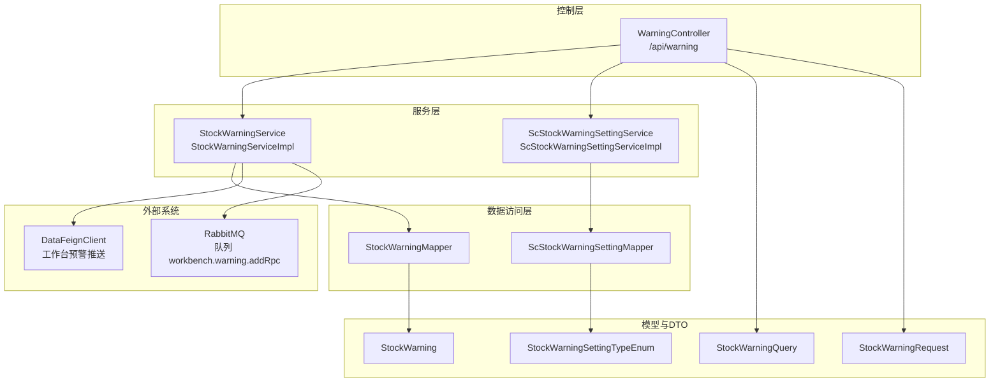
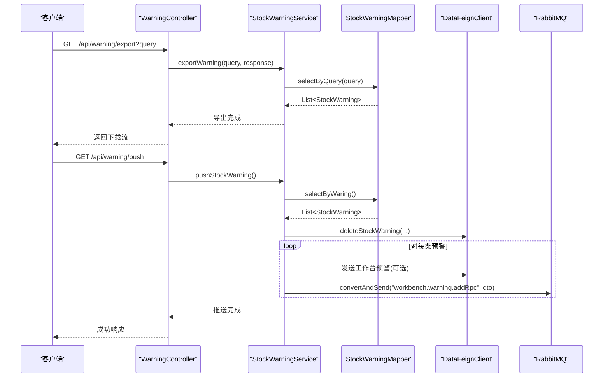
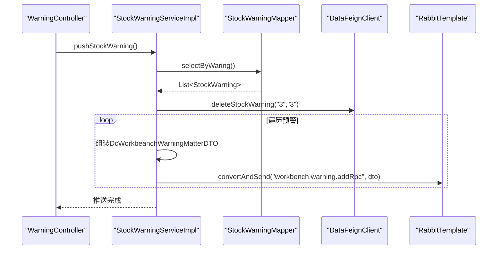
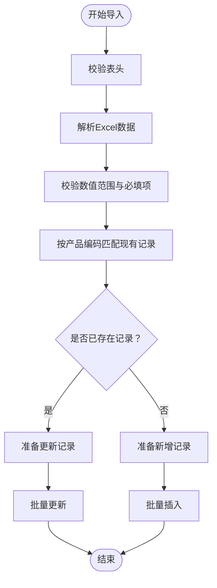
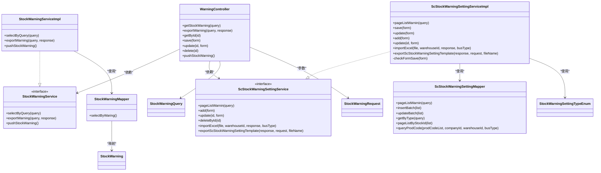
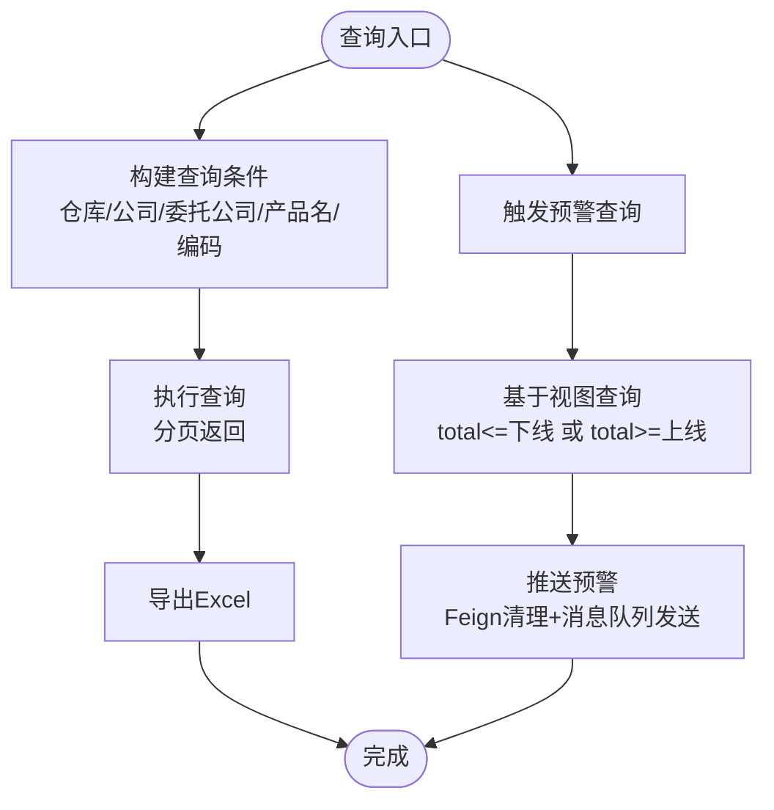

# 预警业务流程

<cite>
**本文引用的文件**
- [WarningController.java](file://guoke-deepexi-storage-center-provider/src/main/java/com/deepexi/storage/controller/web/WarningController.java)
- [StockWarningService.java](file://guoke-deepexi-storage-center-provider/src/main/java/com/deepexi/storage/service/StockWarningService.java)
- [StockWarningServiceImpl.java](file://guoke-deepexi-storage-center-provider/src/main/java/com/deepexi/storage/service/impl/StockWarningServiceImpl.java)
- [ScStockWarningSettingService.java](file://guoke-deepexi-storage-center-provider/src/main/java/com/deepexi/storage/service/ScStockWarningSettingService.java)
- [ScStockWarningSettingServiceImpl.java](file://guoke-deepexi-storage-center-provider/src/main/java/com/deepexi/storage/service/impl/ScStockWarningSettingServiceImpl.java)
- [StockWarningMapper.java](file://guoke-deepexi-storage-center-provider/src/main/java/com/deepexi/storage/mapper/StockWarningMapper.java)
- [ScStockWarningSettingMapper.java](file://guoke-deepexi-storage-center-provider/src/main/java/com/deepexi/storage/mapper/stock/ScStockWarningSettingMapper.java)
- [StockWarning.java](file://guoke-deepexi-storage-center-provider/src/main/java/com/deepexi/storage/model/StockWarning.java)
- [StockWarningQuery.java](file://guoke-deepexi-storage-center-api/src/main/java/com/deepexi/api/storage/dto/stock/StockWarningQuery.java)
- [StockWarningRequest.java](file://guoke-deepexi-storage-center-api/src/main/java/com/deepexi/api/storage/dto/stock/StockWarningRequest.java)
- [StockWarningSettingTypeEnum.java](file://guoke-deepexi-storage-center-api/src/main/java/com/deepexi/api/storage/enums/StockWarningSettingTypeEnum.java)
</cite>

## 目录
1. [简介](#简介)
2. [项目结构](#项目结构)
3. [核心组件](#核心组件)
4. [架构总览](#架构总览)
5. [详细组件分析](#详细组件分析)
6. [依赖关系分析](#依赖关系分析)
7. [性能考量](#性能考量)
8. [故障排查指南](#故障排查指南)
9. [结论](#结论)
10. [附录](#附录)

## 简介
本文件面向国科恒泰仓储管理系统中的“预警业务流程”，系统性阐述库存预警的设置、规则配置、预警触发与处理的完整链路。文档以实际代码库为依据，重点解析 WarningController、StockWarningService 及其具体实现、ScStockWarningSettingService 及其具体实现、StockWarningMapper、ScStockWarningSettingMapper 等核心组件的工作机制；并给出预警业务的配置项、参数与返回值说明，以及与库存管理、产品管理、通知系统等模块的集成关系。最后提供常见问题与解决方案，帮助初学者快速上手，同时为有经验的开发者提供足够的技术深度。

## 项目结构
预警业务主要分布在以下层次：
- 控制层：WarningController 提供对外接口，负责接收请求、鉴权与分发。
- 服务层：StockWarningService 定义预警查询、导出、推送等能力；ScStockWarningSettingService 定义预警设置的新增、修改、删除、导入导出等能力。
- 数据访问层：StockWarningMapper、ScStockWarningSettingMapper 提供数据库访问方法。
- 模型与DTO：StockWarning 实体映射视图 v_stock_warning；StockWarningQuery/StockWarningRequest 用于查询与保存的输入参数。

图表来源
- [WarningController.java:1-97](file://guoke-deepexi-storage-center-provider/src/main/java/com/deepexi/storage/controller/web/WarningController.java#L1-L97)
- [StockWarningService.java:1-36](file://guoke-deepexi-storage-center-provider/src/main/java/com/deepexi/storage/service/StockWarningService.java#L1-L36)
- [StockWarningServiceImpl.java:1-123](file://guoke-deepexi-storage-center-provider/src/main/java/com/deepexi/storage/service/impl/StockWarningServiceImpl.java#L1-L123)
- [ScStockWarningSettingService.java:47-82](file://guoke-deepexi-storage-center-provider/src/main/java/com/deepexi/storage/service/ScStockWarningSettingService.java#L47-L82)
- [ScStockWarningSettingServiceImpl.java:1-361](file://guoke-deepexi-storage-center-provider/src/main/java/com/deepexi/storage/service/impl/ScStockWarningSettingServiceImpl.java#L1-L361)
- [StockWarningMapper.java:1-22](file://guoke-deepexi-storage-center-provider/src/main/java/com/deepexi/storage/mapper/StockWarningMapper.java#L1-L22)
- [ScStockWarningSettingMapper.java:1-39](file://guoke-deepexi-storage-center-provider/src/main/java/com/deepexi/storage/mapper/stock/ScStockWarningSettingMapper.java#L1-L39)
- [StockWarning.java:1-184](file://guoke-deepexi-storage-center-provider/src/main/java/com/deepexi/storage/model/StockWarning.java#L1-L184)
- [StockWarningQuery.java:1-24](file://guoke-deepexi-storage-center-api/src/main/java/com/deepexi/api/storage/dto/stock/StockWarningQuery.java#L1-L24)
- [StockWarningRequest.java:1-30](file://guoke-deepexi-storage-center-api/src/main/java/com/deepexi/api/storage/dto/stock/StockWarningRequest.java#L1-L30)
- [StockWarningSettingTypeEnum.java:1-17](file://guoke-deepexi-storage-center-api/src/main/java/com/deepexi/api/storage/enums/StockWarningSettingTypeEnum.java#L1-L17)

章节来源
- [WarningController.java:1-97](file://guoke-deepexi-storage-center-provider/src/main/java/com/deepexi/storage/controller/web/WarningController.java#L1-L97)
- [StockWarningService.java:1-36](file://guoke-deepexi-storage-center-provider/src/main/java/com/deepexi/storage/service/StockWarningService.java#L1-L36)
- [ScStockWarningSettingService.java:47-82](file://guoke-deepexi-storage-center-provider/src/main/java/com/deepexi/storage/service/ScStockWarningSettingService.java#L47-L82)

## 核心组件
- 控制器：WarningController 提供预警查询、导出、新增、修改、删除、推送等接口，路径前缀为 /api/warning。
- 预警服务：StockWarningService 定义查询、导出、推送预警的能力；其实现负责组装查询条件、执行导出、推送至工作台或消息队列。
- 预警设置服务：ScStockWarningSettingService 定义预警设置的分页查询、新增、修改、删除、导入导出等能力；其实现负责校验参数、批量保存、导入校验与分组保存/更新。
- 数据访问层：StockWarningMapper 提供基于视图 v_stock_warning 的查询；ScStockWarningSettingMapper 提供预警设置的分页、按类型/库存ID查询、批量插入/更新、产品编码匹配等。
- 模型与DTO：StockWarning 映射视图字段；StockWarningQuery/StockWarningRequest 描述查询与保存的输入参数；StockWarningSettingTypeEnum 定义仓库统一与个性化两种设置类型。

章节来源
- [StockWarningServiceImpl.java:1-123](file://guoke-deepexi-storage-center-provider/src/main/java/com/deepexi/storage/service/impl/StockWarningServiceImpl.java#L1-L123)
- [ScStockWarningSettingServiceImpl.java:1-361](file://guoke-deepexi-storage-center-provider/src/main/java/com/deepexi/storage/service/impl/ScStockWarningSettingServiceImpl.java#L1-L361)
- [StockWarningMapper.java:1-22](file://guoke-deepexi-storage-center-provider/src/main/java/com/deepexi/storage/mapper/StockWarningMapper.java#L1-L22)
- [ScStockWarningSettingMapper.java:1-39](file://guoke-deepexi-storage-center-provider/src/main/java/com/deepexi/storage/mapper/stock/ScStockWarningSettingMapper.java#L1-L39)
- [StockWarning.java:1-184](file://guoke-deepexi-storage-center-provider/src/main/java/com/deepexi/storage/model/StockWarning.java#L1-L184)
- [StockWarningQuery.java:1-24](file://guoke-deepexi-storage-center-api/src/main/java/com/deepexi/api/storage/dto/stock/StockWarningQuery.java#L1-L24)
- [StockWarningRequest.java:1-30](file://guoke-deepexi-storage-center-api/src/main/java/com/deepexi/api/storage/dto/stock/StockWarningRequest.java#L1-L30)
- [StockWarningSettingTypeEnum.java:1-17](file://guoke-deepexi-storage-center-api/src/main/java/com/deepexi/api/storage/enums/StockWarningSettingTypeEnum.java#L1-L17)

## 架构总览
预警业务采用典型的分层架构：控制层负责请求接入与鉴权，服务层封装业务逻辑，数据访问层对接数据库视图与表，外部系统通过 Feign 或消息队列进行集成。

图表来源
- [WarningController.java:44-96](file://guoke-deepexi-storage-center-provider/src/main/java/com/deepexi/storage/controller/web/WarningController.java#L44-L96)
- [StockWarningServiceImpl.java:57-122](file://guoke-deepexi-storage-center-provider/src/main/java/com/deepexi/storage/service/impl/StockWarningServiceImpl.java#L57-L122)
- [StockWarningMapper.java:20-21](file://guoke-deepexi-storage-center-provider/src/main/java/com/epexi/storage/mapper/StockWarningMapper.java#L20-L21)

## 详细组件分析

### 控制器：WarningController
- 职责：提供预警查询、导出、新增、修改、删除、推送等接口；对部分接口进行鉴权注解保护。
- 关键接口：
  - GET /api/warning：分页查询预警列表，支持按产品名称/编码、仓库ID、委托公司ID过滤。
  - GET /api/warning/export：导出预警列表为Excel。
  - GET /api/warning/{id}：按主键查询单条预警。
  - POST /api/warning：新增预警设置（批量保存）。
  - PUT /api/warning/{id}：修改预警设置。
  - DELETE /api/warning/{id}：删除预警设置。
  - GET /api/warning/push：推送预警到工作台或消息队列。
- 参数与返回：
  - 查询参数：StockWarningQuery，包含仓库ID、委托公司ID、产品名称/编码等。
  - 保存参数：StockWarningRequest，包含仓库ID、委托公司ID、上下线阈值、产品授权ID列表等。
  - 返回：Payload 包裹 PageBean 或布尔值。

章节来源
- [WarningController.java:44-96](file://guoke-deepexi-storage-center-provider/src/main/java/com/epexi/storage/controller/web/WarningController.java#L44-L96)
- [StockWarningQuery.java:12-24](file://guoke-deepexi-storage-center-api/src/main/java/com/deepexi/api/storage/dto/stock/StockWarningQuery.java#L12-L24)
- [StockWarningRequest.java:16-30](file://guoke-deepexi-storage-center-api/src/main/java/com/deepexi/api/storage/dto/stock/StockWarningRequest.java#L16-L30)

### 服务层：StockWarningService 与 StockWarningServiceImpl
- StockWarningService：定义批量插入/更新、查询、导出、推送预警等接口。
- StockWarningServiceImpl：
  - 查询：根据查询条件拼装 SQL 条件，支持模糊匹配产品名称/编码、精确匹配仓库ID/公司ID/委托公司ID，分页返回。
  - 导出：将查询结果转换为导出实体列表，生成 Excel 文件并输出到 HttpServletResponse。
  - 推送：从视图查询预警集合，先调用 Feign 删除历史预警，再逐条构造工作台预警 DTO，发送至消息队列 workbench.warning.addRpc；同时记录日志。

图表来源
- [StockWarningServiceImpl.java:96-122](file://guoke-deepexi-storage-center-provider/src/main/java/com/deepexi/storage/service/impl/StockWarningServiceImpl.java#L96-L122)
- [StockWarningMapper.java:20-21](file://guoke-deepexi-storage-center-provider/src/main/java/com/deepexi/storage/mapper/StockWarningMapper.java#L20-L21)

章节来源
- [StockWarningService.java:10-36](file://guoke-deepexi-storage-center-provider/src/main/java/com/deepexi/storage/service/StockWarningService.java#L10-L36)
- [StockWarningServiceImpl.java:57-122](file://guoke-deepexi-storage-center-provider/src/main/java/com/deepexi/storage/service/impl/StockWarningServiceImpl.java#L57-L122)
- [StockWarningMapper.java:20-21](file://guoke-deepexi-storage-center-provider/src/main/java/com/deepexi/storage/mapper/StockWarningMapper.java#L20-L21)

### 服务层：ScStockWarningSettingService 与 ScStockWarningSettingServiceImpl
- ScStockWarningSettingService：定义分页查询、新增、修改、删除、导入模板下载、Excel 导入等接口。
- ScStockWarningSettingServiceImpl：
  - 分页查询：自动注入公司ID，分页查询预警设置。
  - 新增/保存：参数校验（仓库ID、类型、个性化时的授权ID与库存ID），避免重复数据（同一仓库统一设置或个性化设置只允许一条），支持更新或新增。
  - 批量新增：接收产品授权ID列表，批量保存预警设置。
  - 修改：按ID更新上下线阈值。
  - 导入：校验表头、解析 Excel、校验数值范围（上下线、效期预警天数）、匹配产品编码、区分新增与更新并批量入库。
  - 导出模板：下载 Excel 模板文件。

图表来源
- [ScStockWarningSettingServiceImpl.java:159-224](file://guoke-deepexi-storage-center-provider/src/main/java/com/deepexi/storage/service/impl/ScStockWarningSettingServiceImpl.java#L159-L224)
- [ScStockWarningSettingServiceImpl.java:248-311](file://guoke-deepexi-storage-center-provider/src/main/java/com/deepexi/storage/service/impl/ScStockWarningSettingServiceImpl.java#L248-L311)

章节来源
- [ScStockWarningSettingService.java:47-82](file://guoke-deepexi-storage-center-provider/src/main/java/com/deepexi/storage/service/ScStockWarningSettingService.java#L47-L82)
- [ScStockWarningSettingServiceImpl.java:59-121](file://guoke-deepexi-storage-center-provider/src/main/java/com/deepexi/storage/service/impl/ScStockWarningSettingServiceImpl.java#L59-L121)
- [ScStockWarningSettingServiceImpl.java:159-224](file://guoke-deepexi-storage-center-provider/src/main/java/com/deepexi/storage/service/impl/ScStockWarningSettingServiceImpl.java#L159-L224)
- [ScStockWarningSettingServiceImpl.java:330-361](file://guoke-deepexi-storage-center-provider/src/main/java/com/deepexi/storage/service/impl/ScStockWarningSettingServiceImpl.java#L330-L361)

### 数据访问层：StockWarningMapper 与 ScStockWarningSettingMapper
- StockWarningMapper：
  - 提供批量插入、插入或更新、插入或更新选择性更新等通用方法。
  - 提供基于视图 v_stock_warning 的查询方法，筛选 total 小于等于下线或大于等于上线的记录。
- ScStockWarningSettingMapper：
  - 提供分页查询、按类型查询、按库存ID分页查询、按产品编码列表查询、批量插入/更新等方法。

章节来源
- [StockWarningMapper.java:12-21](file://guoke-deepexi-storage-center-provider/src/main/java/com/deepexi/storage/mapper/StockWarningMapper.java#L12-L21)
- [ScStockWarningSettingMapper.java:15-39](file://guoke-deepexi-storage-center-provider/src/main/java/com/deepexi/storage/mapper/stock/ScStockWarningSettingMapper.java#L15-L39)

### 数据模型与枚举
- StockWarning：映射视图 v_stock_warning，包含预警上下线、产品信息、仓库信息、公司信息、总量等字段。
- StockWarningSettingTypeEnum：定义仓库统一设置（1）与个性化设置（2）两种类型。

章节来源
- [StockWarning.java:20-184](file://guoke-deepexi-storage-center-provider/src/main/java/com/deepexi/storage/model/StockWarning.java#L20-L184)
- [StockWarningSettingTypeEnum.java:8-16](file://guoke-deepexi-storage-center-api/src/main/java/com/deepexi/api/storage/enums/StockWarningSettingTypeEnum.java#L8-L16)

## 依赖关系分析
- 控制器依赖服务层：WarningController 注入 StockWarningService 与 ScStockWarningSettingService。
- 服务层依赖数据访问层：StockWarningServiceImpl 依赖 StockWarningMapper；ScStockWarningSettingServiceImpl 依赖 ScStockWarningSettingMapper。
- 外部系统集成：StockWarningServiceImpl 通过 DataFeignClient 与消息队列 RabbitTemplate 进行集成，分别用于工作台预警推送与消息队列发送。
- DTO/枚举：StockWarningQuery/StockWarningRequest 作为输入参数，StockWarningSettingTypeEnum 作为设置类型标识。

图表来源
- [WarningController.java:35-96](file://guoke-deepexi-storage-center-provider/src/main/java/com/deepexi/storage/controller/web/WarningController.java#L35-L96)
- [StockWarningService.java:10-36](file://guoke-deepexi-storage-center-provider/src/main/java/com/deepexi/storage/service/StockWarningService.java#L10-L36)
- [StockWarningServiceImpl.java:34-122](file://guoke-deepexi-storage-center-provider/src/main/java/com/deepexi/storage/service/impl/StockWarningServiceImpl.java#L34-L122)
- [ScStockWarningSettingService.java:47-82](file://guoke-deepexi-storage-center-provider/src/main/java/com/deepexi/storage/service/ScStockWarningSettingService.java#L47-L82)
- [ScStockWarningSettingServiceImpl.java:47-361](file://guoke-deepexi-storage-center-provider/src/main/java/com/deepexi/storage/service/impl/ScStockWarningSettingServiceImpl.java#L47-L361)
- [StockWarningMapper.java:12-21](file://guoke-deepexi-storage-center-provider/src/main/java/com/deepexi/storage/mapper/StockWarningMapper.java#L12-L21)
- [ScStockWarningSettingMapper.java:15-39](file://guoke-deepexi-storage-center-provider/src/main/java/com/deepexi/storage/mapper/stock/ScStockWarningSettingMapper.java#L15-L39)
- [StockWarning.java:20-184](file://guoke-deepexi-storage-center-provider/src/main/java/com/deepexi/storage/model/StockWarning.java#L20-L184)
- [StockWarningQuery.java:12-24](file://guoke-deepexi-storage-center-api/src/main/java/com/deepexi/api/storage/dto/stock/StockWarningQuery.java#L12-L24)
- [StockWarningRequest.java:16-30](file://guoke-deepexi-storage-center-api/src/main/java/com/deepexi/api/storage/dto/stock/StockWarningRequest.java#L16-L30)
- [StockWarningSettingTypeEnum.java:8-16](file://guoke-deepexi-storage-center-api/src/main/java/com/deepexi/api/storage/enums/StockWarningSettingTypeEnum.java#L8-L16)

## 性能考量
- 分页查询：服务层使用分页组件限制查询规模，避免一次性加载大量数据。
- 视图查询：预警推送直接基于视图 v_stock_warning 的 SQL 过滤，减少复杂联表计算。
- 批量操作：导入与新增支持批量插入/更新，降低数据库往返次数。
- 导出优化：导出时一次性查询全部数据并转为导出实体列表，建议在高并发场景下控制导出范围与并发度。
- 消息队列：推送预警通过消息队列异步发送，避免阻塞主线程。

[本节为通用性能建议，无需特定文件来源]

## 故障排查指南
- 参数校验异常
  - 仓库ID为空、类型非法、个性化设置缺少授权ID或库存ID等，会抛出参数异常。检查请求参数与设置类型。
  - 章节来源
    - [ScStockWarningSettingServiceImpl.java:124-141](file://guoke-deepexi-storage-center-provider/src/main/java/com/deepexi/storage/service/impl/ScStockWarningSettingServiceImpl.java#L124-L141)
- 导入模板错误
  - 表头不匹配或数值格式不正确会导致导入失败。检查 Excel 表头与数值范围（上下线不超过7位、效期天数不超过700天）。
  - 章节来源
    - [ScStockWarningSettingServiceImpl.java:226-246](file://guoke-deepexi-storage-center-provider/src/main/java/com/deepexi/storage/service/impl/ScStockWarningSettingServiceImpl.java#L226-L246)
    - [ScStockWarningSettingServiceImpl.java:248-311](file://guoke-deepexi-storage-center-provider/src/main/java/com/deepexi/storage/service/impl/ScStockWarningSettingServiceImpl.java#L248-L311)
- 导出无数据
  - 查询不到预警数据时会抛出业务异常提示。确认查询条件与数据是否存在。
  - 章节来源
    - [StockWarningServiceImpl.java:76-94](file://guoke-deepexi-storage-center-provider/src/main/java/com/deepexi/storage/service/impl/StockWarningServiceImpl.java#L76-L94)
- 推送失败
  - 推送前会清理历史预警，若 Feign 调用或消息队列发送失败，需检查目标系统连通性与队列状态。
  - 章节来源
    - [StockWarningServiceImpl.java:96-122](file://guoke-deepexi-storage-center-provider/src/main/java/com/deepexi/storage/service/impl/StockWarningServiceImpl.java#L96-L122)

## 结论
预警业务通过清晰的分层设计实现了“设置—触发—推送”的闭环：设置层由 ScStockWarningSettingServiceImpl 负责，触发层由 StockWarningMapper 基于视图实现，处理层由 StockWarningServiceImpl 负责导出与推送。控制层 WarningController 提供统一入口与鉴权保护。整体流程具备良好的扩展性与可维护性，适合在多仓库、多产品场景下稳定运行。

[本节为总结性内容，无需特定文件来源]

## 附录

### 预警业务配置项与参数说明
- 查询参数（StockWarningQuery）
  - 仓库ID：用于限定查询范围。
  - 委托公司ID：用于限定货主/经销商范围。
  - 设置类型：1=仓库统一，2=个性化。
  - 产品名称/编码：支持模糊匹配。
- 保存参数（StockWarningRequest）
  - 仓库ID：必填。
  - 委托公司ID：必填。
  - 预警上线/下线：整数，上限7位。
  - 产品授权ID列表：个性化设置必填。
- 设置类型枚举（StockWarningSettingTypeEnum）
  - 仓库统一设置：1
  - 个性化设置：2

章节来源
- [StockWarningQuery.java:12-24](file://guoke-deepexi-storage-center-api/src/main/java/com/deepexi/api/storage/dto/stock/StockWarningQuery.java#L12-L24)
- [StockWarningRequest.java:16-30](file://guoke-deepexi-storage-center-api/src/main/java/com/deepexi/api/storage/dto/stock/StockWarningRequest.java#L16-L30)
- [StockWarningSettingTypeEnum.java:8-16](file://guoke-deepexi-storage-center-api/src/main/java/com/deepexi/api/storage/enums/StockWarningSettingTypeEnum.java#L8-L16)

### 预警触发与处理流程图

图表来源
- [StockWarningServiceImpl.java:57-73](file://guoke-deepexi-storage-center-provider/src/main/java/com/deepexi/storage/service/impl/StockWarningServiceImpl.java#L57-L73)
- [StockWarningMapper.java:20-21](file://guoke-deepexi-storage-center-provider/src/main/java/com/deepexi/storage/mapper/StockWarningMapper.java#L20-L21)
- [StockWarningServiceImpl.java:96-122](file://guoke-deepexi-storage-center-provider/src/main/java/com/deepexi/storage/service/impl/StockWarningServiceImpl.java#L96-L122)