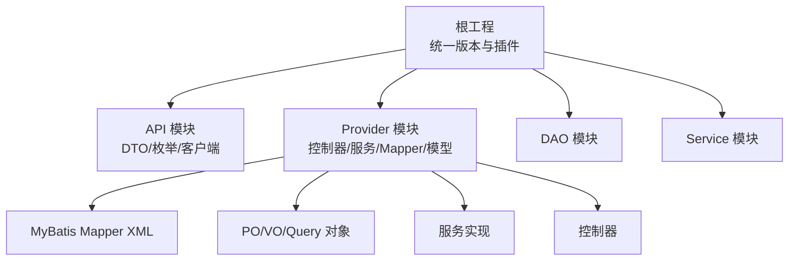
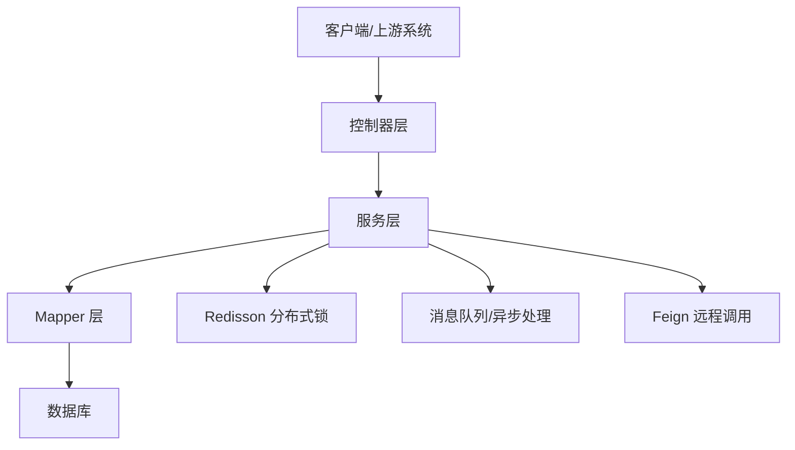
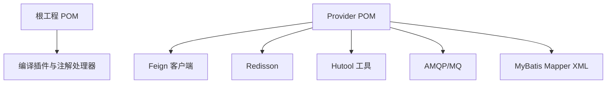

# 代码规范

<cite>
**本文引用的文件**
- [根工程 POM](file://pom.xml)
- [API 模块 POM](file://guoke-deepexi-storage-center-api\pom.xml)
- [Provider 模块 POM](file://guoke-deepexi-storage-center-provider\pom.xml)
- [MyBatis Mapper XML 示例](file://guoke-deepexi-storage-center-provider\src\main\resources\mapper\ScOperateLogMapper.xml)
- [MyBatis Mapper XML 结果列示例](file://guoke-deepexi-storage-center-provider\src\main\resources\mapper\ScInStockOrderCorrelationMapper.xml)
- [基础实体类 BasePO](file://guoke-deepexi-storage-center-provider\src\main\java\com\deepexi\storage\model\BasePO.java)
- [仓储服务实现类（示例）](file://guoke-deepexi-storage-center-provider\src\main\java\com\deepexi\storage\service\impl\ScStockServiceImpl.java)
- [仓储锁定日志服务实现类（示例）](file://guoke-deepexi-storage-center-provider\src\main\java\com\deepexi\storage\service\impl\ScStockLockLogServiceImpl.java)
- [仓库映射服务实现类（示例）](file://guoke-deepexi-storage-center-provider\src\main\java\com\deepexi\storage\service\impl\TbWarehouseMappingServiceImpl.java)
- [物流信息定时任务处理器（示例）](file://guoke-deepexi-storage-center-provider\src\main\java\com\deepexi\storage\scheduled\LogisticsInfoHandler.java)
- [仓储查询 VO（示例）](file://guoke-deepexi-storage-center-provider\src\main\java\com\deepexi\storage\pojo\vo\stock\ScStockChangeRecordVO.java)
- [仓储查询 Query（示例）](file://guoke-deepexi-storage-center-provider\src\main\java\com\deepexi\storage\pojo\query\storage\ScWarehouseEntryQuery.java)
- [仓储查询 Item Query（示例）](file://guoke-deepexi-storage-center-provider\src\main\java\com\deepexi\storage\pojo\query\storage\ScWarehouseEntryItemQuery.java)
- [出库操作日志 Query（示例）](file://guoke-deepexi-storage-center-provider\src\main\java\com\deepexi\storage\pojo\query\stockout\ScOutStockOperLogQuery.java)
</cite>

## 目录
1. [引言](#引言)
2. [项目结构](#项目结构)
3. [核心组件](#核心组件)
4. [架构总览](#架构总览)
5. [组件详细分析](#组件详细分析)
6. [依赖关系分析](#依赖关系分析)
7. [性能考量](#性能考量)
8. [故障排查指南](#故障排查指南)
9. [结论](#结论)
10. [附录](#附录)

## 引言
本文件面向国科恒泰仓储管理系统，制定统一的 Java 编码规范与最佳实践，覆盖命名约定、注释规范、代码格式化、Lombok 使用、MapStruct 映射、MyBatis Plus 使用、分层组织（控制器层、服务层、数据访问层）、异常处理、日志记录与安全编码，并提供代码审查清单与示例路径指引，帮助团队在大型多模块项目中保持一致性与可维护性。

## 项目结构
系统采用 Maven 多模块结构，核心模块包括：
- 根工程：统一版本与插件配置（含 MapStruct、Lombok 注解处理器）
- API 模块：对外 DTO、枚举、客户端接口定义
- Provider 模块：业务实现、控制器、服务、Mapper、模型与资源文件
- DAO/Service 模块：独立模块化拆分（当前仓库可见）

图表来源
- [根工程 POM:1-68](file://pom.xml#L1-L68)
- [API 模块 POM:1-88](file://guoke-deepexi-storage-center-api\pom.xml#L1-L88)
- [Provider 模块 POM:1-422](file://guoke-deepexi-storage-center-provider\pom.xml#L1-L422)

章节来源
- [根工程 POM:1-68](file://pom.xml#L1-L68)
- [API 模块 POM:1-88](file://guoke-deepexi-storage-center-api\pom.xml#L1-L88)
- [Provider 模块 POM:1-422](file://guoke-deepexi-storage-center-provider\pom.xml#L1-L422)

## 核心组件
- 分层架构
  - 控制器层：接收请求、参数校验、调用服务、返回响应
  - 服务层：编排业务流程、事务控制、幂等与分布式锁
  - 数据访问层：MyBatis Plus Mapper、XML 映射、逻辑删除、自动填充
- 统一基类与字段：通过 BasePO 统一管理租户、公司、创建/更新信息与逻辑删除
- 注解驱动：Lombok 简化 POJO；MapStruct 实现 DTO/PO 转换；MyBatis Plus 提供 ORM 能力
- 日志与链路追踪：MDC 注入 traceId，结合日志输出定位问题
- 并发与事务：Redisson 分布式锁，Spring 事务同步回调确保释放锁

章节来源
- [基础实体类 BasePO:1-80](file://guoke-deepexi-storage-center-provider\src\main\java\com\deepexi\storage\model\BasePO.java#L1-L80)
- [仓储服务实现类（示例）:3363-3392](file://guoke-deepexi-storage-center-provider\src\main\java\com\deepexi\storage\service\impl\ScStockServiceImpl.java#L3363-L3392)
- [物流信息定时任务处理器（示例）:39-61](file://guoke-deepexi-storage-center-provider\src\main\java\com\deepexi\storage\scheduled\LogisticsInfoHandler.java#L39-L61)

## 架构总览
系统围绕“仓储”主业务域，通过 RPC/HTTP 接口与外部中心交互，内部以 Provider 模块为核心承载业务逻辑，DAO/Service 模块提供数据与服务能力，配合 Redisson、MQ、Feign 等中间件完成高并发与跨系统协作。

图表来源
- [Provider 模块 POM:15-394](file://guoke-deepexi-storage-center-provider\pom.xml#L15-L394)

## 组件详细分析

### Java 编码标准与命名约定
- 类名：采用大驼峰，使用名词或复合词，如 ScStockServiceImpl、ScOperateLogMapper
- 方法名：动宾短语，小驼峰，如 distributedLock、init、execute
- 常量：全大写+下划线，如 LOGISTIC_STATUS_START
- 包名：域名反写+功能域，如 com.deepexi.storage.controller.web
- 参数与局部变量：小驼峰，避免缩写，必要时使用语义明确的缩写
- 枚举：名词或形容词，常量风格命名，如 StockLogStatusEnum.LOCK
- DTO/VO/Query：以 Request/Response/VO/Query 结尾，区分职责
- 异常类：以 Exception 结尾，如 BusinessException

章节来源
- [仓储服务实现类（示例）:3363-3392](file://guoke-deepexi-storage-center-provider\src\main\java\com\deepexi\storage\service\impl\ScStockServiceImpl.java#L3363-L3392)
- [物流信息定时任务处理器（示例）:39-61](file://guoke-deepexi-storage-center-provider\src\main\java\com\deepexi\storage\scheduled\LogisticsInfoHandler.java#L39-L61)

### 注释规范
- 类注释：简述职责与关键行为，标注作者与日期
- 方法注释：说明输入、输出、异常、边界条件与注意事项
- 字段注释：说明业务含义与约束
- 枚举注释：说明取值含义与用途
- XML 注释：Mapper 中对字段映射与 SQL 的说明

章节来源
- [基础实体类 BasePO:12-18](file://guoke-deepexi-storage-center-provider\src\main\java\com\deepexi\storage\model\BasePO.java#L12-L18)

### Lombok 使用规范
- @Data：用于 POJO，自动生成 getter/setter/toString/hashCode/equals
- @NoArgsConstructor/@AllArgsConstructor：按需生成构造函数
- @Builder：复杂对象构建场景
- 避免在实体类上滥用 @ToString(exclude=...) 导致日志不可读
- 与 MapStruct 绑定：通过注解处理器统一生效

章节来源
- [根工程 POM:52-60](file://pom.xml#L52-L60)
- [基础实体类 BasePO](file://guoke-deepexi-storage-center-provider\src\main\java\com\deepexi\storage\model\BasePO.java#L18)

### MapStruct 映射转换规范
- 接口声明与注解：定义映射接口，启用注解处理器
- 命名与包结构：与 DTO/PO 对应，便于查找
- 自定义映射：针对复杂类型或字段不一致场景提供自定义方法
- 注解处理器：确保编译期生成映射实现，避免运行时开销

章节来源
- [根工程 POM:18-34](file://pom.xml#L18-L34)

### MyBatis Plus 使用规范
- 基类字段：通过 BasePO 统一注入 tenantId、companyId、创建/更新信息与逻辑删除
- 自动填充：利用 FieldFill 注解在插入/更新时自动赋值
- 逻辑删除：使用 @TableLogic 统一处理软删
- 查询封装：优先使用 LambdaQueryWrapper，避免硬编码字符串
- Mapper XML：仅在需要复杂 SQL 或批量操作时使用，保持简洁与可读性

章节来源
- [基础实体类 BasePO:23-77](file://guoke-deepexi-storage-center-provider\src\main\java\com\deepexi\storage\model\BasePO.java#L23-L77)
- [MyBatis Mapper XML 示例:1-25](file://guoke-deepexi-storage-center-provider\src\main\resources\mapper\ScOperateLogMapper.xml#L1-L25)
- [MyBatis Mapper XML 结果列示例:19-56](file://guoke-deepexi-storage-center-provider\src\main\resources\mapper\ScInStockOrderCorrelationMapper.xml#L19-L56)

### 分层组织原则
- 控制器层
  - 职责：参数校验、调用服务、组装响应
  - 建议：每个业务域一个控制器包，如 controller.web.stock
- 服务层
  - 职责：业务编排、事务控制、幂等、分布式锁
  - 建议：接口与实现分离，异常统一处理
- 数据访问层
  - 职责：Mapper、XML、PO/VO/Query
  - 建议：批量操作与复杂 SQL 放置在 XML，简单查询使用注解或 Wrapper

章节来源
- [仓储服务实现类（示例）:3363-3392](file://guoke-deepexi-storage-center-provider\src\main\java\com\deepexi\storage\service\impl\ScStockServiceImpl.java#L3363-L3392)
- [仓库映射服务实现类（示例）:71-99](file://guoke-deepexi-storage-center-provider\src\main\java\com\deepexi\storage\service\impl\TbWarehouseMappingServiceImpl.java#L71-L99)

### 异常处理规范
- 业务异常：抛出业务异常，携带明确错误码与提示
- 系统异常：捕获并记录日志，向上抛出包装后的异常
- 全局异常：建议在控制器层或网关层进行统一拦截与转换
- 事务回滚：确保异常触发回滚，避免脏数据

章节来源
- [仓储服务实现类（示例）:3367-3384](file://guoke-deepexi-storage-center-provider\src\main\java\com\deepexi\storage\service\impl\ScStockServiceImpl.java#L3367-L3384)

### 日志记录规范
- 链路追踪：使用 MDC 注入 traceId，贯穿请求生命周期
- 日志级别：INFO/DEBUG/WARN/ERROR 合理使用，避免冗余
- 关键路径：请求入参、关键计算、异常堆栈、结果摘要
- 定时任务：在任务入口与关键节点输出日志，便于监控

章节来源
- [物流信息定时任务处理器（示例）:48-61](file://guoke-deepexi-storage-center-provider\src\main\java\com\deepexi\storage\scheduled\LogisticsInfoHandler.java#L48-L61)

### 安全编码要求
- 输入校验：使用 Bean Validation 注解或手动校验
- 权限控制：基于上下文获取公司/租户 ID，防止越权
- 敏感信息：脱敏输出，避免日志泄露
- 幂等设计：结合唯一键与状态机，防止重复提交
- 分布式锁：对关键资源加锁，释放必须在事务完成后保证释放

章节来源
- [仓储服务实现类（示例）:3366-3392](file://guoke-deepexi-storage-center-provider\src\main\java\com\deepexi\storage\service\impl\ScStockServiceImpl.java#L3366-L3392)

### 代码审查清单
- 命名与注释：类/方法/字段命名清晰，注释完整
- 分层与职责：控制器只做编排，服务层无持久化逻辑
- 异常与日志：异常有明确提示，日志包含关键上下文
- 并发与事务：分布式锁使用正确，事务边界清晰
- MyBatis Plus：字段填充与逻辑删除配置一致，Wrapper 使用规范
- MapStruct/Lombok：注解处理器配置正确，避免过度使用注解导致可读性下降
- 安全：输入校验、权限校验、敏感信息脱敏

## 依赖关系分析
- 根工程统一管理 MapStruct 与 Lombok 注解处理器，确保编译期生成
- Provider 模块引入大量外部依赖（Feign、Redisson、Hutool、MQ 等），注意版本兼容与排除冲突
- Mapper XML 与 PO/VO/Query 一一对应，保持结构清晰

图表来源
- [根工程 POM:36-66](file://pom.xml#L36-L66)
- [Provider 模块 POM:15-394](file://guoke-deepexi-storage-center-provider\pom.xml#L15-L394)

章节来源
- [根工程 POM:17-66](file://pom.xml#L17-L66)
- [Provider 模块 POM:15-394](file://guoke-deepexi-storage-center-provider\pom.xml#L15-L394)

## 性能考量
- 批量操作：优先使用 MyBatis Plus 批量接口或 XML 批处理，减少往返
- 分页查询：使用 Page 对象，避免一次性加载大结果集
- 缓存策略：结合 Redis 与本地缓存，降低数据库压力
- 锁粒度：尽量缩小锁范围，缩短持有时间，避免热点资源争用
- 日志采样：高频路径开启采样，避免日志风暴影响性能

## 故障排查指南
- 分布式锁未释放：检查事务同步回调注册与状态判断，确保无论成功失败均释放
- 逻辑删除误判：确认 @TableLogic 配置与查询条件，避免误删
- 字段填充异常：检查 FieldFill 注入时机与空值处理
- 定时任务堆积：查看任务状态与日志，优化批处理大小与并发度

章节来源
- [仓储服务实现类（示例）:3386-3392](file://guoke-deepexi-storage-center-provider\src\main\java\com\deepexi\storage\service\impl\ScStockServiceImpl.java#L3386-L3392)
- [基础实体类 BasePO:76-77](file://guoke-deepexi-storage-center-provider\src\main\java\com\deepexi\storage\model\BasePO.java#L76-L77)

## 结论
通过统一的编码规范、分层架构与工具链配置，国科恒泰仓储管理系统可在保证高性能与高可用的同时，提升代码可读性与可维护性。建议持续完善注释与测试覆盖率，强化安全与合规性检查，确保系统长期稳定演进。

## 附录

### 代码结构与文件组织要点
- 控制器层：按业务域划分包，请求/响应 DTO 与枚举集中管理
- 服务层：接口与实现分离，复杂流程拆分为多个方法，保持单一职责
- 数据访问层：PO/VO/Query 与 Mapper/XML 对应，遵循统一命名与注释规范
- 资源文件：Mapper XML 与 SQL 统一管理，避免硬编码

章节来源
- [仓储查询 VO（示例）:205-262](file://guoke-deepexi-storage-center-provider\src\main\java\com\deepexi\storage\pojo\vo\stock\ScStockChangeRecordVO.java#L205-L262)
- [仓储查询 Query（示例）:223-290](file://guoke-deepexi-storage-center-provider\src\main\java\com\deepexi\storage\pojo\query\storage\ScWarehouseEntryQuery.java#L223-L290)
- [仓储查询 Item Query（示例）:168-205](file://guoke-deepexi-storage-center-provider\src\main\java\com\deepexi\storage\pojo\query\storage\ScWarehouseEntryItemQuery.java#L168-L205)
- [出库操作日志 Query（示例）:156-204](file://guoke-deepexi-storage-center-provider\src\main\java\com\deepexi\storage\pojo\query\stockout\ScOutStockOperLogQuery.java#L156-L204)