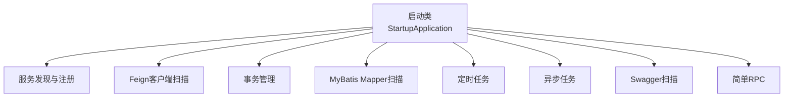
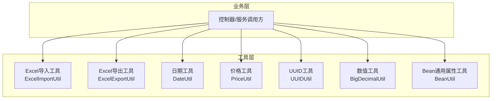
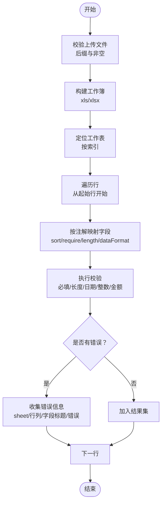
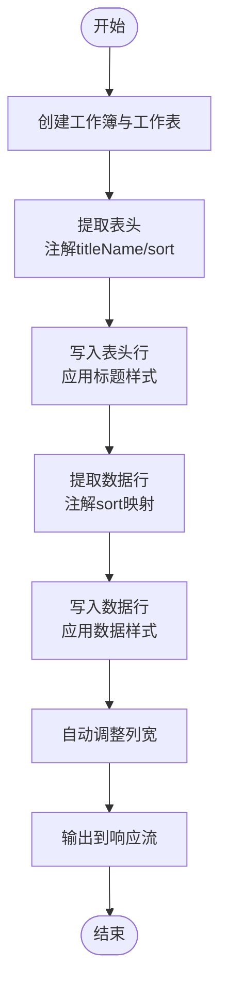
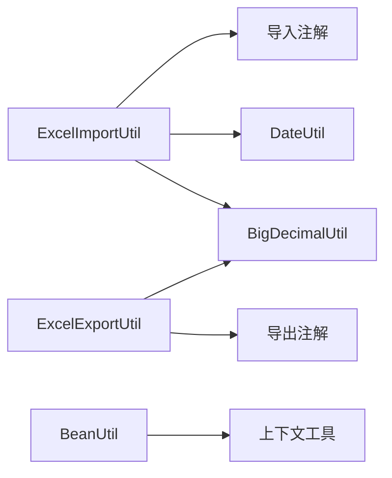

# 工具类与组件

<cite>
**本文引用的文件**
- [StartupApplication.java](file://guoke-deepexi-storage-center-provider/src/main/java/com/deepexi/storage/StartupApplication.java)
- [ExcelImportUtil.java](file://guoke-deepexi-storage-center-provider/src/main/java/com/depthexi/storage/common/util/ExcelImportUtil.java)
- [ExcelExportUtil.java](file://guoke-deepexi-storage-center-provider/src/main/java/com/depthexi/storage/common/util/ExcelExportUtil.java)
- [DateUtil.java](file://guoke-deepexi-storage-center-provider/src/main/java/com/depthexi/storage/common/util/DateUtil.java)
- [PriceUtil.java](file://guoke-deepexi-storage-center-provider/src/main/java/com/depthexi/storage/common/util/PriceUtil.java)
- [UUIDUtil.java](file://guoke-deepexi-storage-center-provider/src/main/java/com/depthexi/storage/common/util/UUIDUtil.java)
- [BigDecimalUtil.java](file://guoke-deepexi-storage-center-provider/src/main/java/com/depthexi/storage/common/util/BigDecimalUtil.java)
- [BeanUtil.java](file://guoke-deepexi-storage-center-provider/src/main/java/com/depthexi/storage/common/util/BeanUtil.java)
</cite>

## 目录
1. [简介](#简介)
2. [项目结构](#项目结构)
3. [核心组件](#核心组件)
4. [架构总览](#架构总览)
5. [详细组件分析](#详细组件分析)
6. [依赖分析](#依赖分析)
7. [性能考虑](#性能考虑)
8. [故障排查指南](#故障排查指南)
9. [结论](#结论)
10. [附录](#附录)

## 简介
本指南面向国科恒泰仓储管理系统，聚焦“工具类与组件”的使用与最佳实践，覆盖以下主题：
- Excel导入导出工具：支持多格式文件、表头校验、数据校验与错误收集、导出样式与列宽控制。
- 日期处理工具：统一字符串与日期/时间类型的转换、本地时间与系统时区映射、多格式解析。
- 价格计算工具：在记录价与订单项价之间进行优先级选择。
- UUID生成工具：生成去横线的唯一标识。
- 数值运算工具：安全的BigDecimal加法与比较运算。
- 实体通用属性工具：新增/更新时统一填充租户、用户、时间等字段。
- 组件配置与扫描：应用启动类中启用的服务发现、Feign、事务、MyBatis Mapper扫描、定时任务、异步任务、Swagger扫描与RPC能力。

## 项目结构
系统采用Spring Boot工程，启动入口位于provider模块，工具类集中于common.util包下，便于跨模块复用。

图表来源
- [StartupApplication.java:19-27](file://guoke-deepexi-storage-center-provider/src/main/java/com/depthexi/storage/StartupApplication.java#L19-L27)

章节来源
- [StartupApplication.java:14-33](file://guoke-deepexi-storage-center-provider/src/main/java/com/depthexi/storage/StartupApplication.java#L14-L33)

## 核心组件
- Excel导入工具：支持xls/xlsx，基于注解映射字段，提供表头校验、必填校验、长度校验、日期格式校验、整数/金额格式校验，并输出结构化错误信息。
- Excel导出工具：根据实体注解生成表头与数据，自动设置样式、边框、列宽，支持响应式下载。
- 日期处理工具：提供字符串到Date/LocalDateTime的双向转换、多格式解析、本地时间到Date的转换、当前时间到次日0点的秒差计算。
- 价格计算工具：在记录价与订单项价之间择优，空值兜底为0。
- UUID生成工具：生成不含横线的UUID字符串。
- BigDecimal工具：安全求和与比较，避免空指针。
- Bean通用属性工具：统一填充新增/更新的租户、用户、时间等字段。

章节来源
- [ExcelImportUtil.java:46-229](file://guoke-deepexi-storage-center-provider/src/main/java/com/depthexi/storage/common/util/ExcelImportUtil.java#L46-L229)
- [ExcelExportUtil.java:25-203](file://guoke-deepexi-storage-center-provider/src/main/java/com/depthexi/storage/common/util/ExcelExportUtil.java#L25-L203)
- [DateUtil.java:37-217](file://guoke-deepexi-storage-center-provider/src/main/java/com/depthexi/storage/common/util/DateUtil.java#L37-L217)
- [PriceUtil.java:12-21](file://guoke-deepexi-storage-center-provider/src/main/java/com/depthexi/storage/common/util/PriceUtil.java#L12-L21)
- [UUIDUtil.java:10-13](file://guoke-deepexi-storage-center-provider/src/main/java/com/depthexi/storage/common/util/UUIDUtil.java#L10-L13)
- [BigDecimalUtil.java:20-68](file://guoke-deepexi-storage-center-provider/src/main/java/com/depthexi/storage/common/util/BigDecimalUtil.java#L20-L68)
- [BeanUtil.java:25-73](file://guoke-deepexi-storage-center-provider/src/main/java/com/depthexi/storage/common/util/BeanUtil.java#L25-L73)

## 架构总览
下图展示Excel导入/导出在系统中的位置与职责边界：

图表来源
- [ExcelImportUtil.java:46-229](file://guoke-deepexi-storage-center-provider/src/main/java/com/depthexi/storage/common/util/ExcelImportUtil.java#L46-L229)
- [ExcelExportUtil.java:25-203](file://guoke-deepexi/storage/common/util/ExcelExportUtil.java#L25-L203)
- [DateUtil.java:37-217](file://guoke-deepexi-storage-center-provider/src/main/java/com/depthexi/storage/common/util/DateUtil.java#L37-L217)
- [PriceUtil.java:12-21](file://guoke-deepexi-storage-center-provider/src/main/java/com/depthexi/storage/common/util/PriceUtil.java#L12-L21)
- [UUIDUtil.java:10-13](file://guoke-deepexi-storage-center-provider/src/main/java/com/depthexi/storage/common/util/UUIDUtil.java#L10-L13)
- [BigDecimalUtil.java:20-68](file://guoke-deepexi-storage-center-provider/src/main/java/com/depthexi/storage/common/util/BigDecimalUtil.java#L20-L68)
- [BeanUtil.java:25-73](file://guoke-deepexi-storage-center-provider/src/main/java/com/depthexi/storage/common/util/BeanUtil.java#L25-L73)

## 详细组件分析

### Excel导入工具（ExcelImportUtil）
- 功能要点
  - 支持xls/xlsx文件读取与工作簿构建。
  - 基于字段注解进行映射，自动按sort排序写入目标对象。
  - 提供表头校验、必填校验、长度校验、日期格式校验（yyyy-MM-dd、yyyy/MM/dd）、整数/金额格式校验。
  - 错误信息收集为结构化列表，包含sheet名、行列、字段标题与具体错误。
  - 提供文件中心样式的临时工作簿构造与校验流程。
- 使用建议
  - DTO需标注导入注解并正确设置sort、headName、require、length、dataFormat等元数据。
  - 合理设置起始行与日期格式模式，确保解析一致性。
  - 对批量导入场景，结合错误收集结果进行分批处理与提示。
- 注意事项
  - 空值与非法字符会触发异常抛出或错误收集，需在上层捕获并反馈。
  - 日期格式严格匹配，避免因格式差异导致校验失败。
  - 大数据量导入建议分页读取与事务拆分，降低内存压力。

图表来源
- [ExcelImportUtil.java:46-229](file://guoke-deepexi-storage-center-provider/src/main/java/com/depthexi/storage/common/util/ExcelImportUtil.java#L46-L229)
- [ExcelImportUtil.java:346-593](file://guoke-deepexi-storage-center-provider/src/main/java/com/depthexi/storage/common/util/ExcelImportUtil.java#L346-L593)

章节来源
- [ExcelImportUtil.java:46-229](file://guoke-deepexi-storage-center-provider/src/main/java/com/depthexi/storage/common/util/ExcelImportUtil.java#L46-L229)
- [ExcelImportUtil.java:269-333](file://guoke-deepexi-storage-center-provider/src/main/java/com/depthexi/storage/common/util/ExcelImportUtil.java#L269-L333)
- [ExcelImportUtil.java:346-593](file://guoke-deepexi-storage-center-provider/src/main/java/com/depthexi/storage/common/util/ExcelImportUtil.java#L346-L593)

### Excel导出工具（ExcelExportUtil）
- 功能要点
  - 根据实体注解生成表头与数据行，自动排序与填充。
  - 统一设置标题与数据样式（字体、对齐、背景色、边框）。
  - 自动调整列宽，保证可读性且不超过上限。
  - 输出为响应流，支持浏览器下载。
- 使用建议
  - DTO需标注导出注解并设置titleName与sort。
  - 列数较多时，建议控制每批次导出条数，避免内存峰值过高。
- 注意事项
  - 注解缺失或排序冲突会导致列顺序错乱，需严格校验注解配置。
  - 列宽自动调整可能受内容影响，必要时手动微调。

图表来源
- [ExcelExportUtil.java:25-203](file://guoke-deepexi-storage-center-provider/src/main/java/com/depthexi/storage/common/util/ExcelExportUtil.java#L25-L203)

章节来源
- [ExcelExportUtil.java:25-203](file://guoke-deepexi-storage-center-provider/src/main/java/com/depthexi/storage/common/util/ExcelExportUtil.java#L25-L203)

### 日期处理工具（DateUtil）
- 功能要点
  - 字符串到Date/LocalDateTime双向转换，支持多格式。
  - 本地时间与Date互转，利用系统时区。
  - 多格式解析尝试，提升容错性。
  - 计算当前时间到次日凌晨的秒差，便于定时任务调度。
- 使用建议
  - 明确业务期望的日期格式，避免歧义。
  - 涉及跨时区场景，优先使用LocalDateTime与系统时区转换。
- 注意事项
  - 解析异常会被记录日志并返回空值，调用方需判空处理。

章节来源
- [DateUtil.java:37-217](file://guoke-deepexi-storage-center-provider/src/main/java/com/depthexi/storage/common/util/DateUtil.java#L37-L217)

### 价格计算工具（PriceUtil）
- 功能要点
  - 在记录价与订单项价之间择优，空值兜底为0。
- 使用建议
  - 优先使用记录价，若不可用再回退到订单项价，确保业务一致性。
- 注意事项
  - 传入参数需为非负数，避免业务逻辑异常。

章节来源
- [PriceUtil.java:12-21](file://guoke-deepexi-storage-center-provider/src/main/java/com/depthexi/storage/common/util/PriceUtil.java#L12-L21)

### UUID生成工具（UUIDUtil）
- 功能要点
  - 生成不含横线的UUID字符串，适合数据库主键或外部对接标识。
- 使用建议
  - 与业务主键策略配合，避免重复与冲突。
- 注意事项
  - 仅作为标识生成，不包含业务语义。

章节来源
- [UUIDUtil.java:10-13](file://guoke-deepexi-storage-center-provider/src/main/java/com/depthexi/storage/common/util/UUIDUtil.java#L10-L13)

### 数值运算工具（BigDecimalUtil）
- 功能要点
  - 安全求和：空值按0处理，避免空指针。
  - 比较运算：提供小于、小于等于、等于、不等于、大于、大于等于。
- 使用建议
  - 金额计算优先使用该工具，确保空值安全与比较稳定。
- 注意事项
  - 比较前确保精度一致，避免隐式转换误差。

章节来源
- [BigDecimalUtil.java:20-68](file://guoke-deepexi-storage-center-provider/src/main/java/com/depthexi/storage/common/util/BigDecimalUtil.java#L20-L68)

### Bean通用属性工具（BeanUtil）
- 功能要点
  - 新增时统一填充公司ID、租户ID、创建者、创建时间、修改者、修改时间、删除标记等。
  - 更新时统一更新修改者、修改时间等。
- 使用建议
  - 所有持久化实体在保存/更新前调用该工具，确保审计字段一致。
- 注意事项
  - 依赖上下文工具获取用户与公司信息，需在请求链路中确保上下文可用。

章节来源
- [BeanUtil.java:25-73](file://guoke-deepexi-storage-center-provider/src/main/java/com/depthexi/storage/common/util/BeanUtil.java#L25-L73)

## 依赖分析
- 工具类之间无直接耦合，通过统一的业务DTO与注解进行协作。
- Excel导入/导出依赖注解驱动的字段映射，减少样板代码。
- 日期与数值工具为纯函数式封装，便于全局复用。
- Bean工具依赖上下文工具，确保审计字段一致性。

图表来源
- [ExcelImportUtil.java:125-147](file://guoke-deepexi-storage-center-provider/src/main/java/com/depthexi/storage/common/util/ExcelImportUtil.java#L125-L147)
- [ExcelExportUtil.java:131-164](file://guoke-deepexi-storage-center-provider/src/main/java/com/depthexi/storage/common/util/ExcelExportUtil.java#L131-L164)
- [BeanUtil.java:25-73](file://guoke-deepexi-storage-center-provider/src/main/java/com/depthexi/storage/common/util/BeanUtil.java#L25-L73)

## 性能考虑
- Excel导入
  - 大文件建议分批读取与分页处理，避免一次性加载过多行导致内存溢出。
  - 校验逻辑在行级别执行，尽量减少不必要的反射开销。
- Excel导出
  - 控制单次导出数据量，避免响应过大；必要时采用分片导出与断点续传。
  - 自动列宽计算为O(n*m)，n为列数，m为行数，建议限制最大列宽。
- 日期与数值
  - 日期解析采用多格式尝试，建议在接口层固定格式，减少尝试次数。
  - BigDecimal运算建议复用工具类，避免重复构造对象。

## 故障排查指南
- Excel导入
  - 表头不匹配：检查DTO注解headName与实际表头是否一致。
  - 数据格式错误：核对dataFormat（日期/整数/金额）与输入格式，确保符合校验规则。
  - 必填字段缺失：确认require=true的字段是否填写。
  - 长度超限：调整字段长度限制或优化输入内容。
- Excel导出
  - 列顺序错乱：检查注解sort是否正确设置。
  - 列宽异常：确认自动列宽策略与内容长度，必要时手动微调。
- 日期处理
  - 解析失败：确认输入格式与期望格式一致，或提供多种备选格式。
- 价格与数值
  - 金额为负：检查输入合法性，确保非负约束。
- Bean属性
  - 审计字段为空：确认上下文工具可用，请求链路中已注入用户信息。

章节来源
- [ExcelImportUtil.java:269-333](file://guoke-deepexi-storage-center-provider/src/main/java/com/depthexi/storage/common/util/ExcelImportUtil.java#L269-L333)
- [ExcelImportUtil.java:446-575](file://guoke-deepexi-storage-center-provider/src/main/java/com/depthexi/storage/common/util/ExcelImportUtil.java#L446-L575)
- [ExcelExportUtil.java:126-184](file://guoke-deepexi-storage-center-provider/src/main/java/com/depthexi/storage/common/util/ExcelExportUtil.java#L126-L184)
- [DateUtil.java:205-217](file://guoke-deepexi-storage-center-provider/src/main/java/com/depthexi/storage/common/util/DateUtil.java#L205-L217)
- [BeanUtil.java:25-73](file://guoke-deepexi-storage-center-provider/src/main/java/com/depthexi/storage/common/util/BeanUtil.java#L25-L73)

## 结论
本指南梳理了仓储管理系统的常用工具类与组件，明确了Excel导入/导出、日期处理、价格计算、UUID生成、数值运算与Bean通用属性的使用方法与注意事项。通过注解驱动与统一工具封装，系统实现了高复用、低耦合的工具层设计。建议在实际开发中遵循注解规范、统一格式、控制批量规模与内存占用，并在异常场景下结合错误收集与日志进行快速定位与修复。

## 附录
- 组件配置与扫描
  - 启用服务发现、Feign客户端、事务管理、MyBatis Mapper扫描、定时任务、异步任务、Swagger扫描与RPC能力。
- 最佳实践
  - DTO注解配置要完整且一致，避免映射与校验失败。
  - 批量操作分批处理，控制内存与网络压力。
  - 统一日期与数值格式，减少解析与比较成本。
  - 审计字段必须由Bean工具统一填充，确保数据一致性。

章节来源
- [StartupApplication.java:19-27](file://guoke-deepexi-storage-center-provider/src/main/java/com/depthexi/storage/StartupApplication.java#L19-L27)