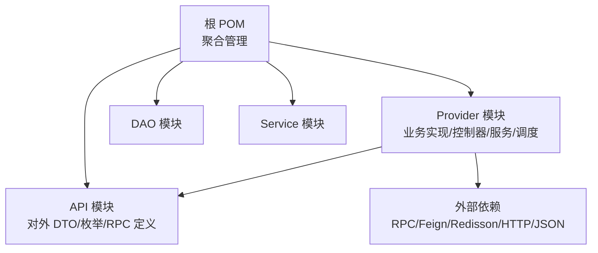
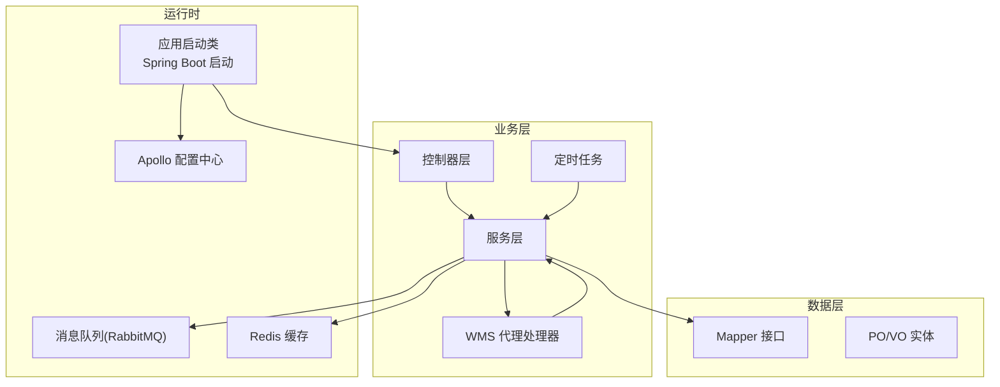
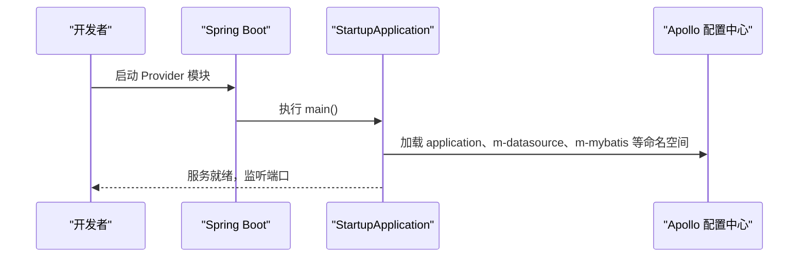
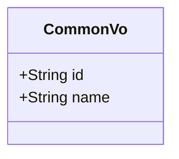
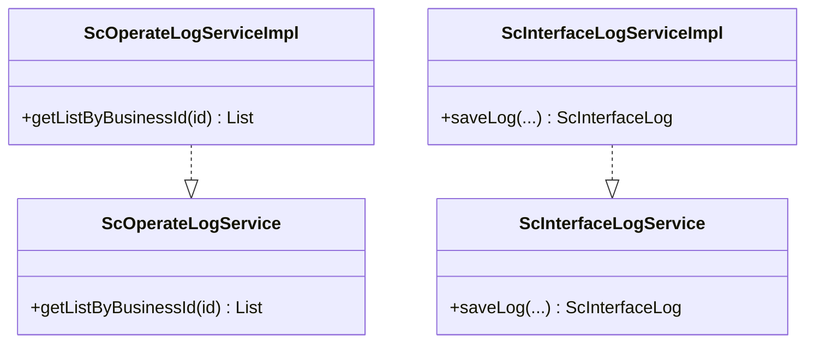
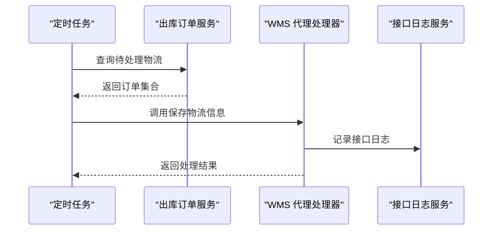
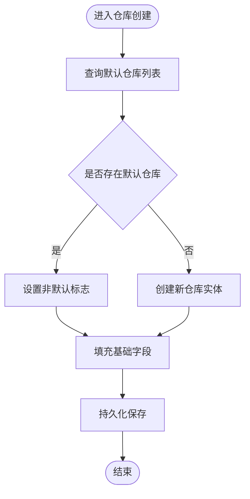
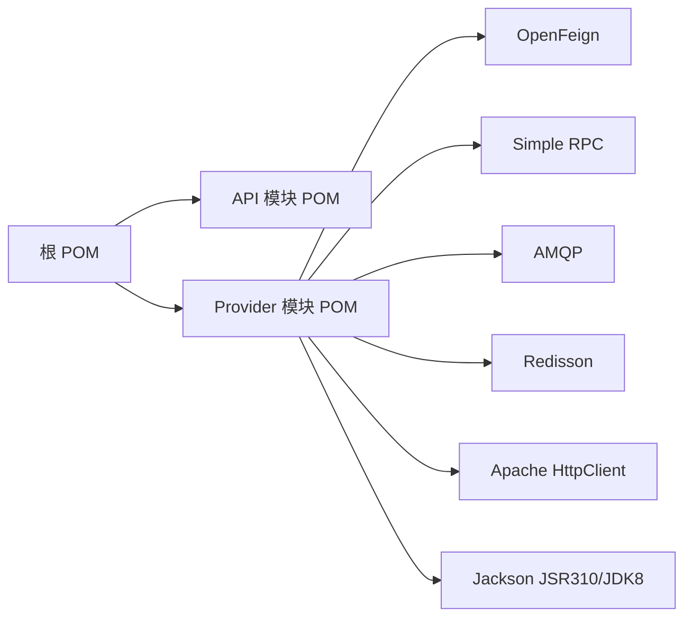

# 开发指南

<cite>
**本文引用的文件**
- [根 POM 文件](file://pom.xml)
- [API 模块 POM](file://guoke-deepexi-storage-center-api/pom.xml)
- [Provider 模块 POM](file://guoke-deepexi-storage-center-provider/pom.xml)
- [应用启动类](file://guoke-deepexi-storage-center-provider/src/main/java/com/ deepexi/storage/StartupApplication.java)
- [应用配置文件](file://guoke-deepexi-storage-center-provider/src/main/resources/application.properties)
- [通用返回 VO 示例](file://guoke-deepexi-storage-center-provider/src/main/java/com/deepexi/storage/pojo/vo/common/CommonVo.java)
- [操作日志服务接口](file://guoke-deepexi-storage-center-provider/src/main/java/com/deepexi/storage/service/ScOperateLogService.java)
- [操作日志服务实现](file://guoke-deepexi-storage-center-provider/src/main/java/com/deepexi/storage/service/impl/ScOperateLogServiceImpl.java)
- [接口日志服务接口](file://guoke-deepexi-storage-center-provider/src/main/java/com/deepexi/storage/service/ScInterfaceLogService.java)
- [接口日志服务实现](file://guoke-deepexi-storage-center-provider/src/main/java/com/deepexi/storage/service/impl/ScInterfaceLogServiceImpl.java)
- [物流信息定时任务处理器](file://guoke-deepexi-storage-center-provider/src/main/java/com/deepexi/storage/scheduled/LogisticsInfoHandler.java)
- [三方 WMS 代理处理器](file://guoke-deepexi-storage-center-provider/src/main/java/com/deepexi/storage/service/hanlder/ThreePartyWmsProxyHandler.java)
- [示例业务服务实现片段](file://guoke-deepexi-storage-center-provider/src/main/java/com/deepexi/storage/service/impl/ScDeliveryInfoMainServiceImpl.java)
</cite>

## 目录
1. [简介](#简介)
2. [项目结构](#项目结构)
3. [核心组件](#核心组件)
4. [架构总览](#架构总览)
5. [详细组件分析](#详细组件分析)
6. [依赖分析](#依赖分析)
7. [性能考虑](#性能考虑)
8. [故障排查指南](#故障排查指南)
9. [结论](#结论)
10. [附录](#附录)

## 简介
本指南面向国科恒泰仓储管理系统的新老开发者，提供从开发环境搭建、编码规范、工具类与公共组件使用、测试策略（单元测试、集成测试、性能测试）、代码生成与版本管理到发布流程的完整开发指导。文档以仓库实际代码为依据，结合模块化架构与 Spring Boot/Spring Cloud 技术栈，帮助团队统一开发标准、提升协作效率与系统稳定性。

## 项目结构
项目采用多模块 Maven 结构，核心模块包括：
- 根 POM：聚合管理各子模块与公共插件配置
- API 模块：对外 DTO、枚举与 RPC 客户端定义
- Provider 模块：业务实现、控制器、服务、持久层与调度任务
- DAO/Service 模块：数据库访问与服务封装（在当前视图中以依赖形式出现）

图表来源
- [根 POM 文件:21-26](file://pom.xml#L21-L26)
- [Provider 模块 POM:15-394](file://guoke-deepexi-storage-center-provider/pom.xml#L15-L394)
- [API 模块 POM:14-63](file://guoke-deepexi-storage-center-api/pom.xml#L14-L63)

章节来源
- [根 POM 文件:1-68](file://pom.xml#L1-L68)
- [API 模块 POM:1-88](file://guoke-deepexi-storage-center-api/pom.xml#L1-L88)
- [Provider 模块 POM:1-422](file://guoke-deepexi-storage-center-provider/pom.xml#L1-L422)

## 核心组件
- 应用启动类：启用服务发现、Feign、事务、MyBatis Mapper 扫描、定时任务与 RPC 能力
- 应用配置：Apollo 配置中心接入、多命名空间加载、激活环境变量
- 通用返回 VO：基于 Swagger 注解与缓存注解的可序列化对象示例
- 日志服务：操作日志与接口日志的统一抽象与实现
- 定时任务：物流信息抓取与处理的调度器
- 三方 WMS 代理：对接第三方 WMS 的代理处理器

章节来源
- [应用启动类:14-28](file://guoke-deepexi-storage-center-provider/src/main/java/com/deepexi/storage/StartupApplication.java#L14-L28)
- [应用配置文件:1-6](file://guoke-deepexi-storage-center-provider/src/main/resources/application.properties#L1-L6)
- [通用返回 VO 示例:11-38](file://guoke-deepexi-storage-center-provider/src/main/java/com/deepexi/storage/pojo/vo/common/CommonVo.java#L11-L38)
- [操作日志服务接口:13-16](file://guoke-deepexi-storage-center-provider/src/main/java/com/deepexi/storage/service/ScOperateLogService.java#L13-L16)
- [操作日志服务实现:19-26](file://guoke-deepexi-storage-center-provider/src/main/java/com/deepexi/storage/service/impl/ScOperateLogServiceImpl.java#L19-L26)
- [接口日志服务接口:17-18](file://guoke-deepexi-storage-center-provider/src/main/java/com/deepexi/storage/service/ScInterfaceLogService.java#L17-L18)
- [接口日志服务实现:17-29](file://guoke-deepexi-storage-center-provider/src/main/java/com/deepexi/storage/service/impl/ScInterfaceLogServiceImpl.java#L17-L29)
- [物流信息定时任务处理器:47-61](file://guoke-deepexi-storage-center-provider/src/main/java/com/deepexi/storage/scheduled/LogisticsInfoHandler.java#L47-L61)
- [三方 WMS 代理处理器:46-74](file://guoke-deepexi-storage-center-provider/src/main/java/com/deepexi/storage/service/hanlder/ThreePartyWmsProxyHandler.java#L46-L74)

## 架构总览
系统采用微服务分层架构，Provider 模块作为业务中枢，通过 Feign 进行跨模块/跨服务调用，结合 Apollo 配置中心、Redisson 分布式能力、RabbitMQ 消息队列与定时任务完成数据流转与异步处理。

图表来源
- [应用启动类:19-27](file://guoke-deepexi-storage-center-provider/src/main/java/com/deepexi/storage/StartupApplication.java#L19-L27)
- [应用配置文件:1-6](file://guoke-deepexi-storage-center-provider/src/main/resources/application.properties#L1-L6)
- [物流信息定时任务处理器:47-61](file://guoke-deepexi-storage-center-provider/src/main/java/com/deepexi/storage/scheduled/LogisticsInfoHandler.java#L47-L61)
- [三方 WMS 代理处理器:46-74](file://guoke-deepexi-storage-center-provider/src/main/java/com/deepexi/storage/service/hanlder/ThreePartyWmsProxyHandler.java#L46-L74)

## 详细组件分析

### 组件一：应用启动与配置
- 启用特性：服务发现、Feign 客户端、事务管理、MyBatis Mapper 扫描、定时任务、异步执行、RPC 能力
- 配置来源：Apollo 多命名空间加载，支持环境变量切换

图表来源
- [应用启动类:30-32](file://guoke-deepexi-storage-center-provider/src/main/java/com/deepexi/storage/StartupApplication.java#L30-L32)
- [应用配置文件:1-6](file://guoke-deepexi-storage-center-provider/src/main/resources/application.properties#L1-L6)

章节来源
- [应用启动类:14-28](file://guoke-deepexi-storage-center-provider/src/main/java/com/deepexi/storage/StartupApplication.java#L14-L28)
- [应用配置文件:1-6](file://guoke-deepexi-storage-center-provider/src/main/resources/application.properties#L1-L6)

### 组件二：通用返回 VO 与缓存注解
- 作用：统一返回结构，标注缓存键与实例映射，便于缓存命中与序列化
- 使用建议：在 VO 层统一字段与注解，避免重复定义

图表来源
- [通用返回 VO 示例:11-38](file://guoke-deepexi-storage-center-provider/src/main/java/com/deepexi/storage/pojo/vo/common/CommonVo.java#L11-L38)

章节来源
- [通用返回 VO 示例:11-38](file://guoke-deepexi-storage-center-provider/src/main/java/com/deepexi/storage/pojo/vo/common/CommonVo.java#L11-L38)

### 组件三：操作日志与接口日志
- 操作日志：按业务 ID 查询最新状态日志，支持排序与过滤
- 接口日志：统一记录请求/响应 JSON，便于问题回溯与审计

图表来源
- [操作日志服务接口:13-16](file://guoke-deepexi-storage-center-provider/src/main/java/com/deepexi/storage/service/ScOperateLogService.java#L13-L16)
- [操作日志服务实现:17-26](file://guoke-deepexi-storage-center-provider/src/main/java/com/deepexi/storage/service/impl/ScOperateLogServiceImpl.java#L17-L26)
- [接口日志服务接口:17-18](file://guoke-deepexi-storage-center-provider/src/main/java/com/deepexi/storage/service/ScInterfaceLogService.java#L17-L18)
- [接口日志服务实现:17-29](file://guoke-deepexi-storage-center-provider/src/main/java/com/deepexi/storage/service/impl/ScInterfaceLogServiceImpl.java#L17-L29)

章节来源
- [操作日志服务接口:13-16](file://guoke-deepexi-storage-center-provider/src/main/java/com/deepexi/storage/service/ScOperateLogService.java#L13-L16)
- [操作日志服务实现:19-26](file://guoke-deepexi-storage-center-provider/src/main/java/com/deepexi/storage/service/impl/ScOperateLogServiceImpl.java#L19-L26)
- [接口日志服务接口:17-18](file://guoke-deepexi-storage-center-provider/src/main/java/com/deepexi/storage/service/ScInterfaceLogService.java#L17-L18)
- [接口日志服务实现:17-29](file://guoke-deepexi-storage-center-provider/src/main/java/com/deepexi/storage/service/impl/ScInterfaceLogServiceImpl.java#L17-L29)

### 组件四：定时任务与三方 WMS 代理
- 物流定时任务：扫描待处理物流记录，批量拉取并写入
- 三方 WMS 代理：封装与第三方系统的交互逻辑，统一异常与日志

图表来源
- [物流信息定时任务处理器:47-61](file://guoke-deepexi-storage-center-provider/src/main/java/com/deepexi/storage/scheduled/LogisticsInfoHandler.java#L47-L61)
- [三方 WMS 代理处理器:46-74](file://guoke-deepexi-storage-center-provider/src/main/java/com/deepexi/storage/service/hanlder/ThreePartyWmsProxyHandler.java#L46-L74)
- [接口日志服务实现:17-29](file://guoke-deepexi-storage-center-provider/src/main/java/com/deepexi/storage/service/impl/ScInterfaceLogServiceImpl.java#L17-L29)

章节来源
- [物流信息定时任务处理器:47-61](file://guoke-deepexi-storage-center-provider/src/main/java/com/deepexi/storage/scheduled/LogisticsInfoHandler.java#L47-L61)
- [三方 WMS 代理处理器:46-74](file://guoke-deepexi-storage-center-provider/src/main/java/com/deepexi/storage/service/hanlder/ThreePartyWmsProxyHandler.java#L46-L74)
- [接口日志服务实现:17-29](file://guoke-deepexi-storage-center-provider/src/main/java/com/deepexi/storage/service/impl/ScInterfaceLogServiceImpl.java#L17-L29)

### 组件五：示例业务流程（仓库创建）
以下流程展示典型业务分支判断与实体构建过程，体现代码中的条件逻辑与数据组装。

图表来源
- [示例业务服务实现片段:1866-1882](file://guoke-deepexi-storage-center-provider/src/main/java/com/deepexi/storage/service/impl/ScDeliveryInfoMainServiceImpl.java#L1866-L1882)

章节来源
- [示例业务服务实现片段:1852-1882](file://guoke-deepexi-storage-center-provider/src/main/java/com/deepexi/storage/service/impl/ScDeliveryInfoMainServiceImpl.java#L1852-L1882)

## 依赖分析
- 根 POM 聚合 API/Provider/DAO/Service 四个模块，并统一 MapStruct 注解处理器
- Provider 模块引入大量外部依赖：RPC/Feign、监控、配置中心、作业调度、消息队列、Redisson、HTTP 客户端、Jackson 时间类型支持等
- API 模块提供对外 DTO 与 RPC 客户端，避免 Provider 对外暴露内部模型

图表来源
- [根 POM 文件:21-26](file://pom.xml#L21-L26)
- [Provider 模块 POM:15-394](file://guoke-deepexi-storage-center-provider/pom.xml#L15-L394)
- [API 模块 POM:14-63](file://guoke-deepexi-storage-center-api/pom.xml#L14-L63)

章节来源
- [根 POM 文件:1-68](file://pom.xml#L1-L68)
- [Provider 模块 POM:1-422](file://guoke-deepexi-storage-center-provider/pom.xml#L1-L422)
- [API 模块 POM:1-88](file://guoke-deepexi-storage-center-api/pom.xml#L1-L88)

## 性能考虑
- 定时任务批处理：对查询与处理进行分批，避免一次性拉取过多数据导致内存压力
- 缓存与序列化：合理使用缓存注解与序列化策略，减少重复计算与网络传输
- 异步与消息：对耗时操作采用异步或消息队列，降低请求延迟
- 日志与追踪：在定时任务中注入 traceId，便于链路追踪与性能定位

章节来源
- [物流信息定时任务处理器:47-61](file://guoke-deepexi-storage-center-provider/src/main/java/com/deepexi/storage/scheduled/LogisticsInfoHandler.java#L47-L61)
- [通用返回 VO 示例:11-38](file://guoke-deepexi-storage-center-provider/src/main/java/com/deepexi/storage/pojo/vo/common/CommonVo.java#L11-L38)

## 故障排查指南
- 启动失败
  - 检查 Apollo 命名空间是否正确加载，确认命名空间列表与环境变量
  - 校验 Feign/RPC 依赖是否可用，Mapper 扫描包路径是否匹配
- 接口日志缺失
  - 确认接口日志服务是否被正确注入与调用
  - 检查 JSON 序列化配置与字段是否为空
- 定时任务不执行
  - 校验调度开关与 Cron 表达式
  - 查看任务执行上下文与异常堆栈，关注 traceId
- 三方 WMS 交互异常
  - 检查代理处理器注册与调用链
  - 关注接口日志与异常重试策略

章节来源
- [应用配置文件:1-6](file://guoke-deepexi-storage-center-provider/src/main/resources/application.properties#L1-L6)
- [应用启动类:19-27](file://guoke-deepexi-storage-center-provider/src/main/java/com/deepexi/storage/StartupApplication.java#L19-L27)
- [接口日志服务实现:17-29](file://guoke-deepexi-storage-center-provider/src/main/java/com/deepexi/storage/service/impl/ScInterfaceLogServiceImpl.java#L17-L29)
- [物流信息定时任务处理器:47-61](file://guoke-deepexi-storage-center-provider/src/main/java/com/deepexi/storage/scheduled/LogisticsInfoHandler.java#L47-L61)
- [三方 WMS 代理处理器:46-74](file://guoke-deepexi-storage-center-provider/src/main/java/com/deepexi/storage/service/hanlder/ThreePartyWmsProxyHandler.java#L46-L74)

## 结论
本指南基于仓库现有代码，梳理了模块结构、核心组件、依赖关系与常见开发场景。建议新开发者优先阅读“应用启动与配置”“通用返回 VO 与日志服务”“定时任务与代理处理器”，并结合“故障排查指南”快速定位问题。后续可在现有基础上完善测试与文档，持续优化性能与可观测性。

## 附录

### 开发环境搭建
- JDK 8（编译插件配置为 1.8）
- Maven 依赖
  - 根 POM 已配置 MapStruct 注解处理器
  - Provider 模块引入 Apollo、Feign、RPC、Redisson、AMQP、HTTP、Jackson 等依赖
- 启动步骤
  - 在 Provider 模块中运行应用启动类
  - 确认 Apollo 命名空间加载成功

章节来源
- [根 POM 文件:36-66](file://pom.xml#L36-L66)
- [Provider 模块 POM:15-394](file://guoke-deepexi-storage-center-provider/pom.xml#L15-L394)
- [应用启动类:30-32](file://guoke-deepexi-storage-center-provider/src/main/java/com/deepexi/storage/StartupApplication.java#L30-L32)

### 代码规范与最佳实践
- 统一使用 Swagger 注解描述 VO/DTO 字段
- 使用缓存注解标识缓存键与实例映射
- 日志记录请求/响应 JSON，便于问题回溯
- 定时任务批处理与异常隔离，注入 traceId
- 服务层尽量无状态，避免共享可变资源

章节来源
- [通用返回 VO 示例:11-38](file://guoke-deepexi-storage-center-provider/src/main/java/com/deepexi/storage/pojo/vo/common/CommonVo.java#L11-L38)
- [接口日志服务实现:17-29](file://guoke-deepexi-storage-center-provider/src/main/java/com/deepexi/storage/service/impl/ScInterfaceLogServiceImpl.java#L17-L29)
- [物流信息定时任务处理器:47-61](file://guoke-deepexi-storage-center-provider/src/main/java/com/deepexi/storage/scheduled/LogisticsInfoHandler.java#L47-L61)

### 测试策略
- 单元测试
  - 针对服务层方法编写单元测试，Mock 外部依赖（Feign/RPC/Redisson/HTTP）
  - 使用断言验证日志记录与返回值
- 集成测试
  - 启动 Provider 模块，验证 Apollo 配置加载与 Feign/RPC 可用性
  - 验证定时任务执行与日志落库
- 性能测试
  - 对定时任务批处理进行压力测试，评估内存与 CPU 使用
  - 使用 traceId 追踪链路，定位瓶颈

章节来源
- [应用配置文件:1-6](file://guoke-deepexi-storage-center-provider/src/main/resources/application.properties#L1-L6)
- [接口日志服务实现:17-29](file://guoke-deepexi-storage-center-provider/src/main/java/com/deepexi/storage/service/impl/ScInterfaceLogServiceImpl.java#L17-L29)
- [物流信息定时任务处理器:47-61](file://guoke-deepexi-storage-center-provider/src/main/java/com/deepexi/storage/scheduled/LogisticsInfoHandler.java#L47-L61)

### 版本管理与发布
- 版本号
  - 根 POM：项目版本为快照版本
  - API 模块：独立快照版本，便于对外发布
- 发布流程
  - 在根 POM 中执行构建与打包，Provider 模块通过 Spring Boot 插件重新打包
  - 如需部署至制品库，可调整 Provider 模块的部署插件配置

章节来源
- [根 POM 文件:14-15](file://pom.xml#L14-L15)
- [API 模块 POM:10-12](file://guoke-deepexi-storage-center-api/pom.xml#L10-L12)
- [Provider 模块 POM:396-420](file://guoke-deepexi-storage-center-provider/pom.xml#L396-L420)