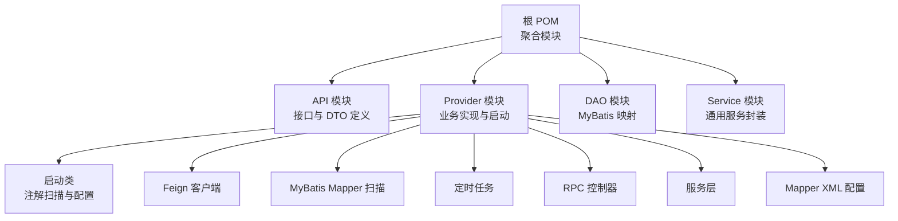
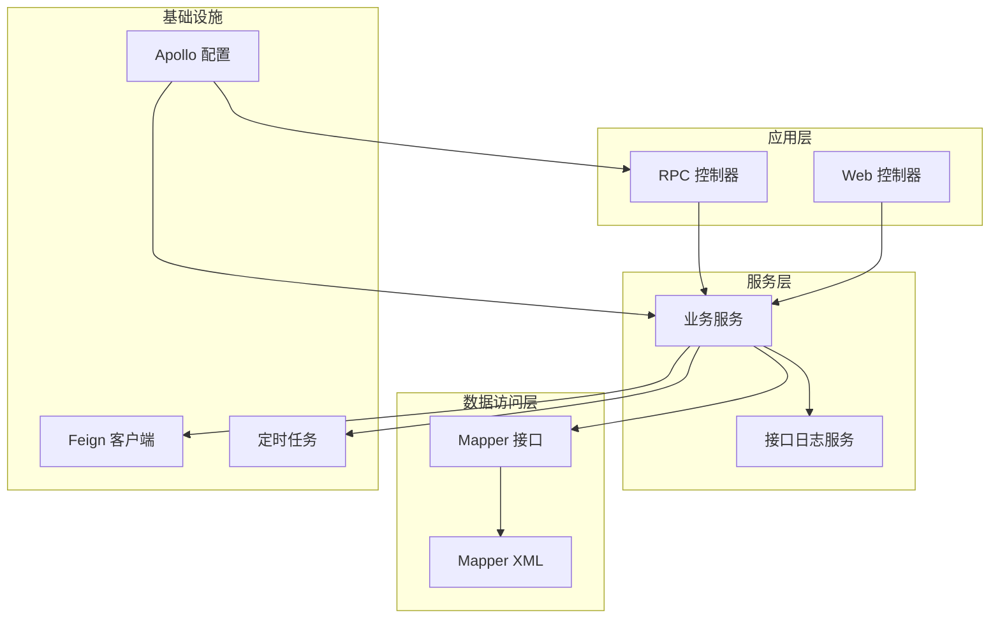
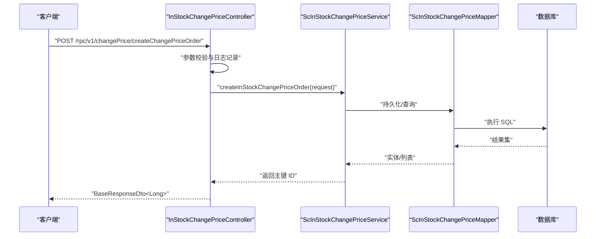
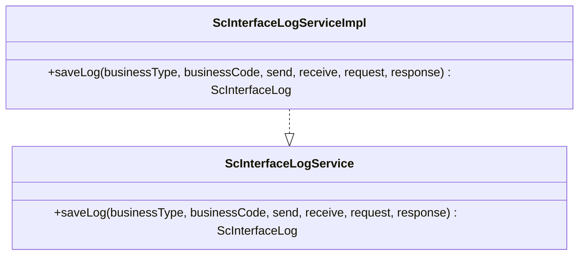
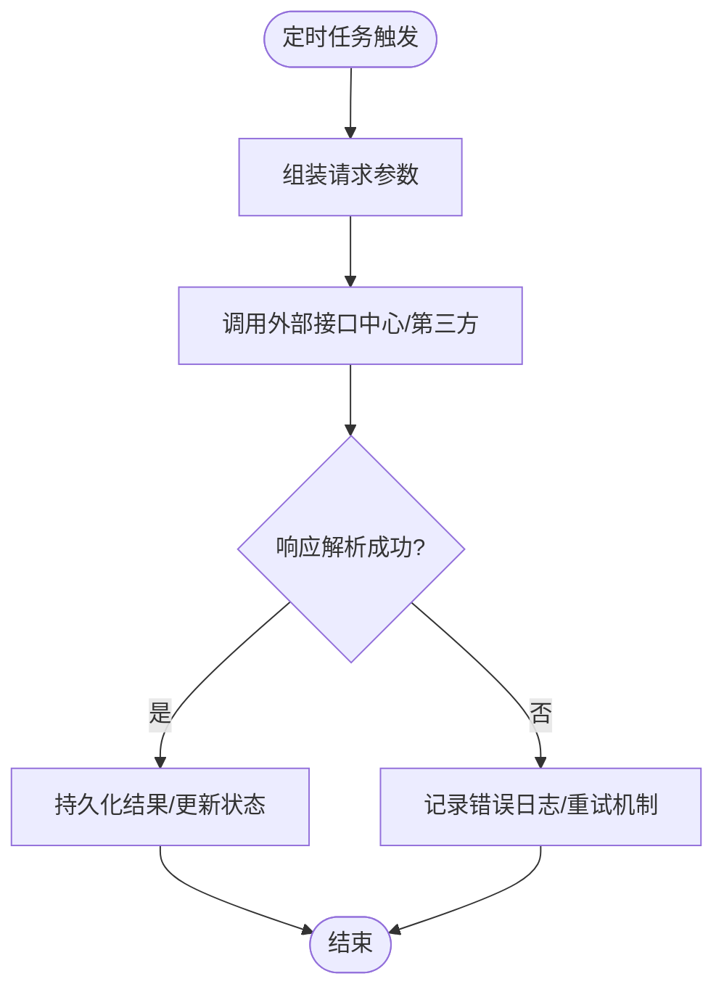
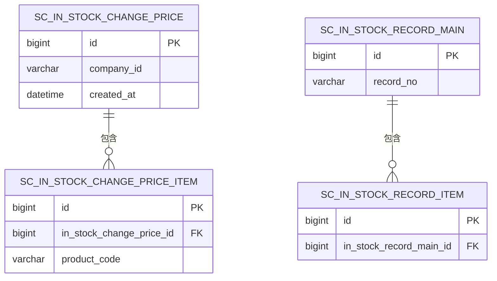
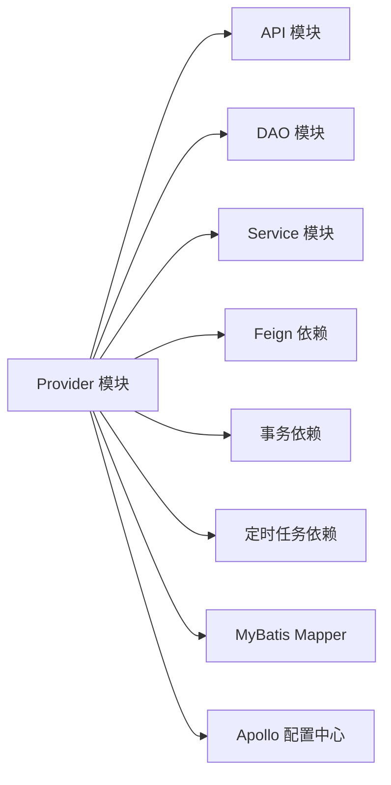

# 开发流程

<cite>
**本文引用的文件**
- [根 POM 文件](file://pom.xml)
- [API 模块 POM](file://guoke-deepexi-storage-center-api/pom.xml)
- [Provider 模块 POM](file://guoke-deepexi-storage-center-provider/pom.xml)
- [应用启动类](file://guoke-deepexi-storage-center-provider/src/main/java/com/ deepexi/storage/StartupApplication.java)
- [应用配置文件](file://guoke-deepexi-storage-center-provider/src/main/resources/application.properties)
- [接口日志服务接口](file://guoke-deepexi-storage-center-provider/src/main/java/com/ deepexi/storage/service/ScInterfaceLogService.java)
- [接口日志服务实现](file://guoke-deepexi-storage-center-provider/src/main/java/com/ deepexi/storage/service/impl/ScInterfaceLogServiceImpl.java)
- [价格调整 RPC 控制器](file://guoke-deepexi-storage-center-provider/src/main/java/com/ deepexi/storage/controller/rpc/InStockChangePriceController.java)
- [价格调整 Mapper](file://guoke-deepexi-storage-center-provider/src/main/java/com/ deepexi/storage/mapper/ScInStockChangePriceMapper.java)
- [仓库映射 Mapper XML](file://guoke-deepexi-storage-center-provider/src/main/resources/mapper/warehouse/TbWarehouseMappingMapper.xml)
- [产品仓绑定 Mapper XML](file://guoke-deepexi-storage-center-provider/src/main/resources/mapper/ScProductWarehouseBindingMapper.xml)
- [调度任务示例（美敦力库存）](file://guoke-deepexi-storage-center-provider/src/main/java/com/ deepexi/storage/scheduled/GetStockMDLHandler.java)
- [Push MDL 实现](file://guoke-deepexi-storage-center-provider/src/main/java/com/ deepexi/storage/service/push/PushServiceMDLImpl.java)
- [README 示例 JSON](file://README.md)
</cite>

## 目录
1. [引言](#引言)
2. [项目结构](#项目结构)
3. [核心组件](#核心组件)
4. [架构总览](#架构总览)
5. [详细组件分析](#详细组件分析)
6. [依赖关系分析](#依赖关系分析)
7. [性能考虑](#性能考虑)
8. [故障排查指南](#故障排查指南)
9. [结论](#结论)
10. [附录](#附录)

## 引言
本开发流程文档面向国科恒泰仓储管理系统，覆盖从需求分析到代码上线的完整生命周期。内容包括模块划分原则、接口设计流程、业务逻辑实现步骤，以及控制器层、服务层、数据访问层的编写规范；同时给出分支管理策略、代码合并流程与版本控制最佳实践，并提供开发环境搭建、本地调试与联调测试的具体步骤。

## 项目结构
系统采用多模块 Maven 结构，分为 API、Provider、DAO、Service 四大模块，分别承担对外接口定义、业务实现、数据访问与通用能力封装职责。Provider 模块作为主应用，负责启动、扫描组件、启用 Feign、事务、定时任务等能力。

图表来源
- [根 POM 文件:21-26](file://pom.xml#L21-L26)
- [Provider 模块 POM:1-422](file://guoke-deepexi-storage-center-provider/pom.xml#L1-L422)
- [应用启动类:19-27](file://guoke-deepexi-storage-center-provider/src/main/java/com/ deepexi/storage/StartupApplication.java#L19-L27)

章节来源
- [根 POM 文件:21-26](file://pom.xml#L21-L26)
- [Provider 模块 POM:1-422](file://guoke-deepexi-storage-center-provider/pom.xml#L1-L422)
- [应用启动类:19-27](file://guoke-deepexi-storage-center-provider/src/main/java/com/ deepexi/storage/StartupApplication.java#L19-L27)

## 核心组件
- 启动与配置
  - 应用启动类启用服务发现、Feign、事务、定时任务、Mapper 扫描、异步执行与 RPC 能力，确保 Provider 模块具备完整的运行时环境。
  - 应用配置文件启用 Apollo 配置中心、多命名空间加载与多环境激活，支持动态配置与多环境部署。
- 接口日志服务
  - 提供统一接口日志记录能力，便于问题追踪与审计。
- RPC 控制器
  - 以 InStockChangePriceController 为例，展示 RPC 接口的请求处理、参数校验、异常捕获与响应封装流程。
- 数据访问层
  - Mapper 接口与 XML 映射文件分离，遵循 MyBatis 分层规范，支持复杂查询与分页场景。

章节来源
- [应用启动类:19-27](file://guoke-deepexi-storage-center-provider/src/main/java/com/ deepexi/storage/StartupApplication.java#L19-L27)
- [应用配置文件:1-6](file://guoke-deepexi-storage-center-provider/src/main/resources/application.properties#L1-L6)
- [接口日志服务接口:1-20](file://guoke-deepexi-storage-center-provider/src/main/java/com/ deepexi/storage/service/ScInterfaceLogService.java#L1-L20)
- [接口日志服务实现:1-31](file://guoke-deepexi-storage-center-provider/src/main/java/com/ deepexi/storage/service/impl/ScInterfaceLogServiceImpl.java#L1-L31)
- [价格调整 RPC 控制器:1-85](file://guoke-deepexi-storage-center-provider/src/main/java/com/ deepexi/storage/controller/rpc/InStockChangePriceController.java#L1-L85)
- [价格调整 Mapper:1-18](file://guoke-deepexi-storage-center-provider/src/main/java/com/ deepexi/storage/mapper/ScInStockChangePriceMapper.java#L1-L18)

## 架构总览
系统采用分层架构与微服务思想，结合 RPC 与 Feign 进行跨模块/跨服务通信，配合定时任务与消息队列实现异步处理与外部系统对接。

图表来源
- [应用启动类:19-27](file://guoke-deepexi-storage-center-provider/src/main/java/com/ deepexi/storage/StartupApplication.java#L19-L27)
- [接口日志服务实现:1-31](file://guoke-deepexi-storage-center-provider/src/main/java/com/ deepexi/storage/service/impl/ScInterfaceLogServiceImpl.java#L1-L31)
- [价格调整 RPC 控制器:1-85](file://guoke-deepexi-storage-center-provider/src/main/java/com/ deepexi/storage/controller/rpc/InStockChangePriceController.java#L1-L85)
- [价格调整 Mapper:1-18](file://guoke-deepexi-storage-center-provider/src/main/java/com/ deepexi/storage/mapper/ScInStockChangePriceMapper.java#L1-L18)

## 详细组件分析

### 组件一：RPC 接口开发流程（以“入库价差调整”为例）
- 需求分析与接口设计
  - 明确业务目标：创建价差调整单、分页查询、查看详情、按入库单汇总明细。
  - DTO 设计：在 API 模块中定义请求/响应 DTO，确保前后端契约一致。
- 控制器层
  - 使用@RestController 与@RequestMapping 定义 RPC 路径，方法内进行参数校验与异常捕获，统一返回 BaseResponseDto。
- 服务层
  - 编写服务接口与实现，处理业务规则、调用数据访问层与外部服务。
- 数据访问层
  - 在 Mapper 中定义 SQL 查询方法，必要时在 XML 中补充复杂 SQL。
- 测试与验证
  - 单元测试覆盖核心逻辑，集成测试验证 RPC 调用链路。

图表来源
- [价格调整 RPC 控制器:32-44](file://guoke-deepexi-storage-center-provider/src/main/java/com/ deepexi/storage/controller/rpc/InStockChangePriceController.java#L32-L44)
- [价格调整 Mapper:15-15](file://guoke-deepexi-storage-center-provider/src/main/java/com/ deepexi/storage/mapper/ScInStockChangePriceMapper.java#L15-L15)

章节来源
- [价格调整 RPC 控制器:1-85](file://guoke-deepexi-storage-center-provider/src/main/java/com/ deepexi/storage/controller/rpc/InStockChangePriceController.java#L1-L85)
- [价格调整 Mapper:1-18](file://guoke-deepexi-storage-center-provider/src/main/java/com/ deepexi/storage/mapper/ScInStockChangePriceMapper.java#L1-L18)

### 组件二：接口日志服务（统一审计与追踪）
- 设计目标
  - 记录业务类型、业务编号、发送方、接收方、请求与响应体，便于问题定位与审计。
- 实现要点
  - 服务接口定义统一保存方法；实现类序列化对象为 JSON 并持久化。
- 使用建议
  - 在 RPC/HTTP 入口与关键业务节点调用，避免敏感字段脱敏。

图表来源
- [接口日志服务接口:1-20](file://guoke-deepexi-storage-center-provider/src/main/java/com/ deepexi/storage/service/ScInterfaceLogService.java#L1-L20)
- [接口日志服务实现:1-31](file://guoke-deepexi-storage-center-provider/src/main/java/com/ deepexi/storage/service/impl/ScInterfaceLogServiceImpl.java#L1-L31)

章节来源
- [接口日志服务接口:1-20](file://guoke-deepexi-storage-center-provider/src/main/java/com/ deepexi/storage/service/ScInterfaceLogService.java#L1-L20)
- [接口日志服务实现:1-31](file://guoke-deepexi-storage-center-provider/src/main/java/com/ deepexi/storage/service/impl/ScInterfaceLogServiceImpl.java#L1-L31)

### 组件三：定时任务与外部系统对接
- 定时任务
  - 通过注解启用调度，任务中调用外部接口中心或直接对接第三方系统（如美敦力），并记录接口日志。
- 外部系统对接
  - 使用 Feign 或 HTTP 客户端发起请求，解析响应后回写系统状态或触发后续流程。

图表来源
- [调度任务示例（美敦力库存）:34-62](file://guoke-deepexi-storage-center-provider/src/main/java/com/ deepexi/storage/scheduled/GetStockMDLHandler.java#L34-L62)
- [Push MDL 实现:189-204](file://guoke-deepexi-storage-center-provider/src/main/java/com/ deepexi/storage/service/push/PushServiceMDLImpl.java#L189-L204)

章节来源
- [调度任务示例（美敦力库存）:34-62](file://guoke-deepexi-storage-center-provider/src/main/java/com/ deepexi/storage/scheduled/GetStockMDLHandler.java#L34-L62)
- [Push MDL 实现:189-204](file://guoke-deepexi-storage-center-provider/src/main/java/com/ deepexi/storage/service/push/PushServiceMDLImpl.java#L189-L204)

### 组件四：数据访问层规范（Mapper 与 XML）
- 规范要求
  - Mapper 接口仅声明方法，SQL 放入对应 XML 文件，保持清晰分层。
  - 使用 MyBatis 注解与 XML 组合，复杂查询优先 XML。
- 示例参考
  - 仓库映射与产品仓绑定的 XML 映射文件展示了标准字段映射与插入/更新片段。

图表来源
- [价格调整 Mapper:1-18](file://guoke-deepexi-storage-center-provider/src/main/java/com/ deepexi/storage/mapper/ScInStockChangePriceMapper.java#L1-L18)
- [仓库映射 Mapper XML:144-193](file://guoke-deepexi-storage-center-provider/src/main/resources/mapper/warehouse/TbWarehouseMappingMapper.xml#L144-L193)
- [产品仓绑定 Mapper XML:19-50](file://guoke-deepexi-storage-center-provider/src/main/resources/mapper/ScProductWarehouseBindingMapper.xml#L19-L50)

章节来源
- [价格调整 Mapper:1-18](file://guoke-deepexi-storage-center-provider/src/main/java/com/ deepexi/storage/mapper/ScInStockChangePriceMapper.java#L1-L18)
- [仓库映射 Mapper XML:144-193](file://guoke-deepexi-storage-center-provider/src/main/resources/mapper/warehouse/TbWarehouseMappingMapper.xml#L144-L193)
- [产品仓绑定 Mapper XML:19-50](file://guoke-deepexi-storage-center-provider/src/main/resources/mapper/ScProductWarehouseBindingMapper.xml#L19-L50)

## 依赖关系分析
- 模块依赖
  - Provider 依赖 API、DAO、Service 等模块，形成清晰的分层依赖。
  - API 模块提供 DTO 与接口契约，被 Provider 与外部消费者复用。
- 外部依赖
  - 启用 Feign、事务、定时任务、Mapper 扫描、Apollo 配置中心等，支撑分布式与动态配置。
- 版本与构建
  - 根 POM 统一管理 MapStruct、Lombok 等注解处理器，Provider 使用 Spring Boot Maven 插件打包。

图表来源
- [根 POM 文件:21-26](file://pom.xml#L21-L26)
- [Provider 模块 POM:15-394](file://guoke-deepexi-storage-center-provider/pom.xml#L15-L394)
- [API 模块 POM:14-63](file://guoke-deepexi-storage-center-api/pom.xml#L14-L63)

章节来源
- [根 POM 文件:21-26](file://pom.xml#L21-L26)
- [Provider 模块 POM:15-394](file://guoke-deepexi-storage-center-provider/pom.xml#L15-L394)
- [API 模块 POM:14-63](file://guoke-deepexi-storage-center-api/pom.xml#L14-L63)

## 性能考虑
- 查询优化
  - 复杂分页查询建议在 XML 中优化索引与 SQL，避免 N+1 查询。
- 缓存与异步
  - 对热点数据引入缓存，对耗时操作采用异步或消息队列处理。
- 并发控制
  - 关键业务使用分布式锁或幂等设计，避免重复处理。
- 监控与日志
  - 借助 Apollo 配置中心与监控组件，动态调整阈值与开关。

## 故障排查指南
- 接口日志定位
  - 通过接口日志服务记录的请求/响应 JSON 快速定位问题。
- 配置检查
  - 确认 Apollo 命名空间加载顺序与环境变量 env 是否正确。
- 外部系统对接
  - 检查定时任务与 Feign 调用链路，关注超时与重试策略。
- 数据一致性
  - 核对 Mapper XML 字段映射与插入片段，确保字段齐全。

章节来源
- [接口日志服务实现:1-31](file://guoke-deepexi-storage-center-provider/src/main/java/com/ deepexi/storage/service/impl/ScInterfaceLogServiceImpl.java#L1-L31)
- [应用配置文件:1-6](file://guoke-deepexi-storage-center-provider/src/main/resources/application.properties#L1-L6)
- [调度任务示例（美敦力库存）:34-62](file://guoke-deepexi-storage-center-provider/src/main/java/com/ deepexi/storage/scheduled/GetStockMDLHandler.java#L34-L62)
- [仓库映射 Mapper XML:144-193](file://guoke-deepexi-storage-center-provider/src/main/resources/mapper/warehouse/TbWarehouseMappingMapper.xml#L144-L193)

## 结论
本流程文档基于现有代码库总结了从需求到上线的关键路径：明确模块边界、规范接口设计、严格分层实现、完善日志与监控、建立稳定的 CI/CD 与版本控制策略。建议在实际开发中持续沉淀领域模型与公共能力，提升系统的可维护性与扩展性。

## 附录

### 开发环境搭建与本地调试
- 环境准备
  - 安装 JDK 8、Maven、IDE（推荐 IDEA）、Apollo 配置中心、数据库与消息中间件。
- 项目导入
  - 导入根 POM，等待依赖下载完成；确认 Provider 模块可正常启动。
- 启动应用
  - 设置环境变量 env 指向目标环境；启动 StartupApplication。
- 调试要点
  - 在 RPC 控制器设置断点，观察请求参数与响应封装；在服务层断点验证业务逻辑；在 Mapper 层断点查看 SQL 与结果集。

章节来源
- [应用启动类:30-33](file://guoke-deepexi-storage-center-provider/src/main/java/com/ deepexi/storage/StartupApplication.java#L30-L33)
- [应用配置文件:1-6](file://guoke-deepexi-storage-center-provider/src/main/resources/application.properties#L1-L6)

### 分支管理策略与代码合并流程
- 分支策略
  - develop：日常开发分支；release-x.y：预发布分支；hotfix/*：紧急修复分支；feature/*：新功能开发分支。
- 提交规范
  - 提交信息包含模块、功能点与影响范围，例如 "[API] 新增价格调整 DTO"。
- 代码评审
  - PR 必须通过至少一名 reviewer 同意；确保单元测试与集成测试通过。
- 合并流程
  - rebase 优先，保证线性历史；合并前执行全量构建与冒烟测试。

### 版本控制最佳实践
- 版本号
  - 主版本号.次版本号.修订号；语义化版本，变更需记录 Changelog。
- 发布标签
  - 重要里程碑打 Tag，关联 Release Notes。
- 回滚策略
  - 保留最近 3 个版本的镜像，出现问题快速回滚。

### 联调测试步骤
- 准备阶段
  - 确认各模块依赖版本一致；配置 Apollo 命名空间与数据库连接。
- 接口联调
  - 使用 RPC 控制器进行端到端测试，验证 DTO 传递与业务结果。
- 外部系统对接
  - 启动定时任务或手动触发，观察外部系统回调与日志记录。
- 性能压测
  - 对高频接口进行并发测试，评估线程池与数据库连接池配置。

章节来源
- [价格调整 RPC 控制器:1-85](file://guoke-deepexi-storage-center-provider/src/main/java/com/ deepexi/storage/controller/rpc/InStockChangePriceController.java#L1-L85)
- [调度任务示例（美敦力库存）:34-62](file://guoke-deepexi-storage-center-provider/src/main/java/com/ deepexi/storage/scheduled/GetStockMDLHandler.java#L34-L62)
- [README 示例 JSON:1-92](file://README.md#L1-L92)