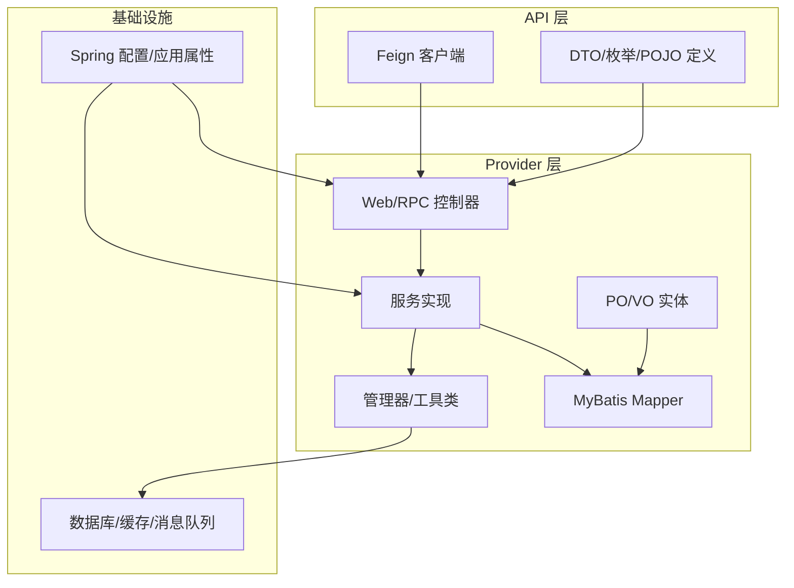
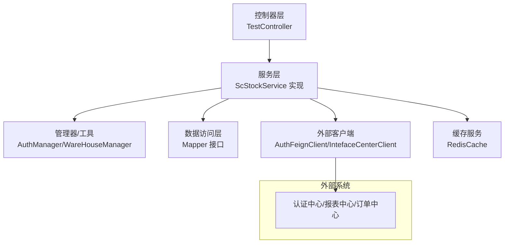
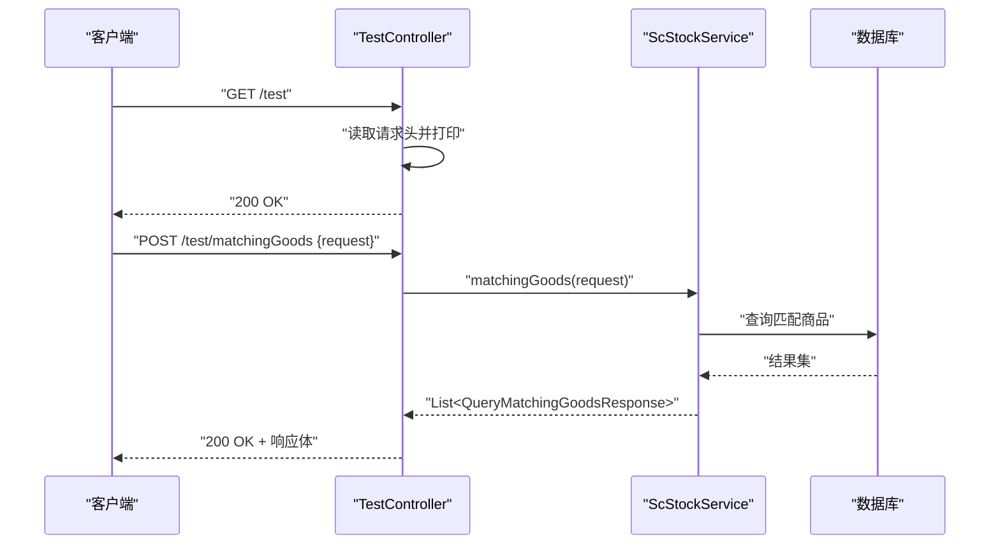
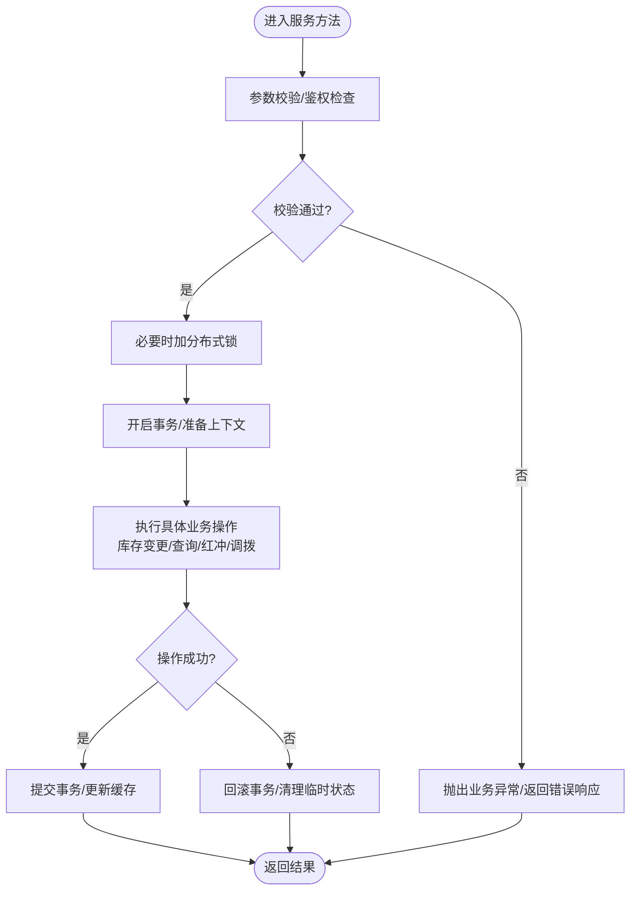
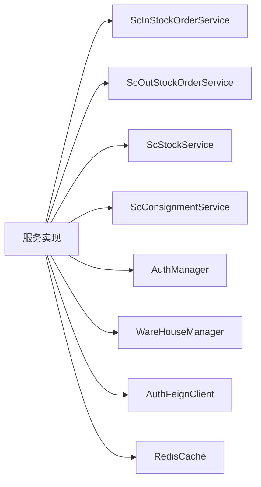

# 测试策略

<cite>
**本文引用的文件**
- [pom.xml](file://pom.xml)
- [guoke-deepexi-storage-center-provider/pom.xml](file://guoke-deepexi-storage-center-provider/pom.xml)
- [application.properties](file://guoke-deepexi-storage-center-provider/src/main/resources/application.properties)
- [TestController.java](file://guoke-deepexi-storage-center-provider/src/main/java/com/deepexi/storage/controller/web/TestController.java)
- [ScStockService.java](file://guoke-deepexi-storage-center-provider/src/main/java/com/deepexi/storage/service/ScStockService.java)
- [TransactionServiceImpl.java](file://guoke-deepexi-storage-center-provider/src/main/java/com/deepexi/storage/service/TransactionServiceImpl.java)
- [ScDeliveryInfoMainServiceImpl.java](file://guoke-deepexi-storage-center-provider/src/main/java/com/deepexi/storage/service/impl/ScDeliveryInfoMainServiceImpl.java)
</cite>

## 目录
1. [引言](#引言)
2. [项目结构](#项目结构)
3. [核心组件](#核心组件)
4. [架构总览](#架构总览)
5. [详细组件分析](#详细组件分析)
6. [依赖分析](#依赖分析)
7. [性能考虑](#性能考虑)
8. [故障排查指南](#故障排查指南)
9. [结论](#结论)
10. [附录](#附录)

## 引言
本测试策略面向国科恒泰仓储管理系统，目标是建立覆盖单元测试、集成测试与端到端测试的完整测试体系，确保服务层、控制器层与数据访问层的质量与稳定性。策略涵盖测试用例设计原则、Mock对象使用、测试数据准备与测试环境配置，并给出性能测试、压力测试与安全测试的执行方法，以及测试覆盖率要求、持续集成中的测试流程与自动化测试脚本编写指南。

## 项目结构
系统采用多模块 Maven 结构，核心业务位于 provider 模块，API 模块提供 DTO 与 RPC 客户端契约，DAO 与 Service 模块分别承担数据访问与业务逻辑封装。测试应围绕以下层次展开：
- 控制器层：对外暴露的 Web/RPC 接口，负责请求解析与响应返回
- 服务层：核心业务逻辑，包含事务与跨 Mapper 的协调
- 数据访问层：MyBatis Mapper 与 POJO 映射，负责数据库读写

图表来源
- [guoke-deepexi-storage-center-provider/pom.xml:15-394](file://guoke-deepexi-storage-center-provider/pom.xml#L15-L394)
- [application.properties:1-6](file://guoke-deepexi-storage-center-provider/src/main/resources/application.properties#L1-L6)

章节来源
- [guoke-deepexi-storage-center-provider/pom.xml:15-394](file://guoke-deepexi-storage-center-provider/pom.xml#L15-L394)
- [application.properties:1-6](file://guoke-deepexi-storage-center-provider/src/main/resources/application.properties#L1-L6)

## 核心组件
- 控制器层：以 TestController 为例，提供 GET/POST 接口，用于验证请求头与调用服务层能力
- 服务层：ScStockService 定义库存相关核心能力；TransactionServiceImpl 作为复杂事务协调者，注入多个服务与管理器
- 数据访问层：ScDeliveryInfoMainServiceImpl 展示了典型的多依赖注入与 Mapper 使用模式，体现服务层对数据访问层的依赖

章节来源
- [TestController.java:12-27](file://guoke-deepexi-storage-center-provider/src/main/java/com/deepexi/storage/controller/web/TestController.java#L12-L27)
- [ScStockService.java:44-296](file://guoke-deepexi-storage-center-provider/src/main/java/com/deepexi/storage/service/ScStockService.java#L44-L296)
- [TransactionServiceImpl.java:32-78](file://guoke-deepexi-storage-center-provider/src/main/java/com/deepexi/storage/service/TransactionServiceImpl.java#L32-L78)
- [ScDeliveryInfoMainServiceImpl.java:104-145](file://guoke-deepexi-storage-center-provider/src/main/java/com/deepexi/storage/service/impl/ScDeliveryInfoMainServiceImpl.java#L104-L145)

## 架构总览
下图展示控制器、服务与数据访问之间的交互关系，以及外部依赖（Feign 客户端、Redis 缓存等）在服务层的使用方式。

图表来源
- [ScDeliveryInfoMainServiceImpl.java:104-145](file://guoke-deepexi-storage-center-provider/src/main/java/com/deepexi/storage/service/impl/ScDeliveryInfoMainServiceImpl.java#L104-L145)
- [TransactionServiceImpl.java:32-78](file://guoke-deepexi-storage-center-provider/src/main/java/com/deepexi/storage/service/TransactionServiceImpl.java#L32-L78)

## 详细组件分析

### 控制器层测试策略
- 单元测试
  - 使用 MockMvc 或 Spring Boot Test 启动器，针对 TestController 的 GET/POST 方法进行请求模拟
  - 验证请求头传递、请求体解析、响应状态码与返回值类型
  - 对异常场景（如非法参数、鉴权失败）进行断言
- 集成测试
  - 在测试环境中启动 Provider 应用，通过 RestAssured 或 WebTestClient 发起真实 HTTP 请求
  - 关注与 Feign 客户端的协作与外部接口超时/熔断行为
- 端到端测试
  - 通过 Postman/Newman 或 Cypress/Selenium，覆盖从浏览器到后端的完整链路
  - 包含鉴权、权限控制、跨域与网关代理场景

图表来源
- [TestController.java:18-26](file://guoke-deepexi-storage-center-provider/src/main/java/com/deepexi/storage/controller/web/TestController.java#L18-L26)
- [ScStockService.java:264-264](file://guoke-deepexi-storage-center-provider/src/main/java/com/deepexi/storage/service/ScStockService.java#L264-L264)

章节来源
- [TestController.java:12-27](file://guoke-deepexi-storage-center-provider/src/main/java/com/deepexi/storage/controller/web/TestController.java#L12-L27)

### 服务层测试策略
- 单元测试
  - 使用 Mockito 对 ScStockService 的实现进行测试，重点覆盖库存查询、变更、红冲入库、调拨出、物权变更等核心方法
  - 对 TransactionServiceImpl 中的多服务协调逻辑进行分层测试，确保事务边界与异常回滚正确
- 集成测试
  - 在测试容器中启动 MySQL/Redis，使用 @DataMySQL/@AutoConfigureTestDatabase 等注解，验证服务层与数据库的真实交互
  - 对 Feign 客户端与外部系统进行契约测试，确保参数与响应格式一致
- 端到端测试
  - 通过 API 场景编排，验证从控制器到服务再到数据访问的完整链路，包括缓存命中与失效策略

图表来源
- [ScStockService.java:158-224](file://guoke-deepexi-storage-center-provider/src/main/java/com/deepexi/storage/service/ScStockService.java#L158-L224)
- [TransactionServiceImpl.java:32-78](file://guoke-deepexi-storage-center-provider/src/main/java/com/deepexi/storage/service/TransactionServiceImpl.java#L32-L78)

章节来源
- [ScStockService.java:44-296](file://guoke-deepexi-storage-center-provider/src/main/java/com/deepexi/storage/service/ScStockService.java#L44-L296)
- [TransactionServiceImpl.java:32-78](file://guoke-deepexi-storage-center-provider/src/main/java/com/deepexi/storage/service/TransactionServiceImpl.java#L32-L78)

### 数据访问层测试策略
- 单元测试
  - 使用 MyBatis 测试框架或嵌入式数据库，对 Mapper 进行 CRUD 与条件查询测试
  - 验证 SQL 片段、动态 SQL 与分页插件的行为
- 集成测试
  - 在测试容器中运行 MySQL，使用 @Sql 注解初始化测试数据，验证复杂联表查询与事务一致性
- 端到端测试
  - 通过服务层调用 Mapper，验证真实业务场景下的数据一致性与性能

章节来源
- [ScDeliveryInfoMainServiceImpl.java:104-145](file://guoke-deepexi-storage-center-provider/src/main/java/com/deepexi/storage/service/impl/ScDeliveryInfoMainServiceImpl.java#L104-L145)

## 依赖分析
- 外部依赖
  - Feign 客户端：认证中心、报表中心、订单中心等，需在测试中通过 @MockBean 或 WireMock 进行替换
  - 缓存：Redisson/Redis，需在测试中使用嵌入式 Redis 或内存缓存替代
  - 消息队列：RabbitMQ，可使用 Embedded RabbitMQ 进行集成测试
- 内部依赖
  - 服务层对管理器（AuthManager、WareHouseManager）与多个 Mapper 的依赖，测试中通过 @MockBean 或 @SpyBean 替换
  - 事务协调：TransactionServiceImpl 注入多个服务，需通过分层测试保证事务边界

图表来源
- [TransactionServiceImpl.java:32-78](file://guoke-deepexi-storage-center-provider/src/main/java/com/deepexi/storage/service/TransactionServiceImpl.java#L32-L78)
- [ScDeliveryInfoMainServiceImpl.java:104-145](file://guoke-deepexi-storage-center-provider/src/main/java/com/deepexi/storage/service/impl/ScDeliveryInfoMainServiceImpl.java#L104-L145)

章节来源
- [guoke-deepexi-storage-center-provider/pom.xml:15-394](file://guoke-deepexi-storage-center-provider/pom.xml#L15-L394)

## 性能考虑
- 单元测试
  - 使用 @DirtiesContext 或隔离测试类，避免共享状态影响性能
  - 对热点方法进行基准测试（JMH），识别瓶颈
- 集成测试
  - 使用测试容器（Testcontainers）启动 MySQL/Redis，模拟真实环境延迟
  - 对批量操作（批量入库/出库）进行吞吐量与延迟测试
- 端到端测试
  - 使用 K6/JMeter 对关键路径（库存查询、匹配商品、出入库）进行负载测试
  - 关注数据库连接池、缓存命中率与外部接口 SLA

## 故障排查指南
- 控制器层
  - 检查请求头与请求体是否正确传递，关注 JSON 序列化/反序列化异常
  - 对异常处理器进行测试，确保错误码与提示信息符合预期
- 服务层
  - 对事务边界进行断言，确认异常时回滚生效
  - 检查分布式锁与幂等性，避免重复扣减库存
- 数据访问层
  - 校验 SQL 执行计划与索引使用情况，定位慢查询
  - 对批量插入/更新进行分页与限流测试

章节来源
- [TestController.java:18-26](file://guoke-deepexi-storage-center-provider/src/main/java/com/deepexi/storage/controller/web/TestController.java#L18-L26)
- [ScStockService.java:290-296](file://guoke-deepexi-storage-center-provider/src/main/java/com/deepexi/storage/service/ScStockService.java#L290-L296)

## 结论
本测试策略以“分层覆盖、依赖隔离、环境一致”为核心原则，结合单元测试的高密度与高反馈、集成测试的端到端验证与外部依赖模拟、端到端测试的用户场景闭环，形成完整的质量保障体系。建议在 CI 中引入自动化测试流水线，结合覆盖率工具与性能基线，持续提升系统稳定性与交付效率。

## 附录

### 测试用例设计原则
- 正向用例：覆盖正常输入与边界条件
- 反向用例：覆盖空值、越界、非法字符、缺失参数
- 异常用例：网络异常、外部服务不可用、数据库锁冲突
- 幂等性：重复请求不产生副作用
- 并发性：高并发下的数据一致性与锁竞争

### Mock 对象使用
- 控制器层：Mock ScStockService，断言调用次数与参数
- 服务层：Mock Mapper、Feign 客户端、Redis 缓存，隔离外部依赖
- 管理器层：Mock AuthManager/WareHouseManager，验证业务分支

### 测试数据准备
- 初始化脚本：SQL 文件或 YAML 固化数据，支持快速回放
- 分层隔离：每条测试使用独立 Schema/表前缀，避免交叉污染
- 外部数据：使用 WireMock/Stubby4J 模拟第三方接口

### 测试环境配置
- 应用配置：通过 application-test.properties 或环境变量切换测试配置
- 依赖服务：使用 Docker Compose 启动 MySQL/Redis/RabbitMQ
- CI 集成：在流水线中自动拉起测试容器并执行测试套件

章节来源
- [application.properties:1-6](file://guoke-deepexi-storage-center-provider/src/main/resources/application.properties#L1-L6)

### 性能测试、压力测试与安全测试
- 性能测试：对高频接口进行 RPS/延迟分布统计，识别瓶颈
- 压力测试：逐步增加并发与数据规模，观察系统饱和点与恢复时间
- 安全测试：对鉴权、CSRF、SQL 注入、XSS 进行扫描与渗透验证

### 测试覆盖率要求
- 行覆盖率：≥80%
- 分支覆盖率：≥70%
- 关键路径：100% 覆盖（事务边界、异常路径、外部依赖）

### 持续集成中的测试流程与自动化脚本
- 单元测试：本地开发阶段执行，失败即阻断
- 集成测试：PR 合并前在 CI 执行，依赖容器化环境
- 端到端测试：每日流水线执行，结合报告与回归分析
- 自动化脚本：Shell/Python 脚本封装测试命令与报告收集