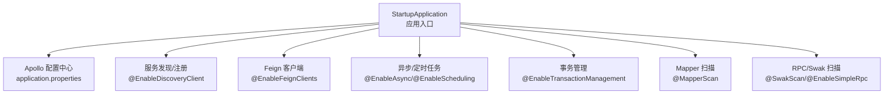
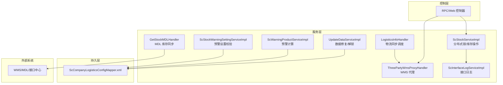
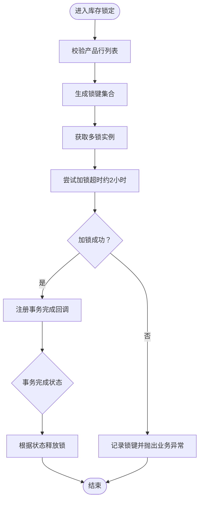
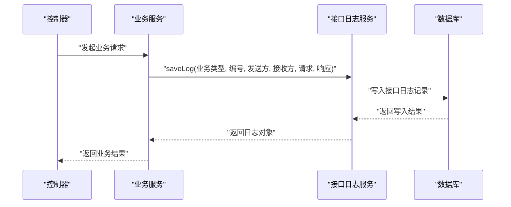
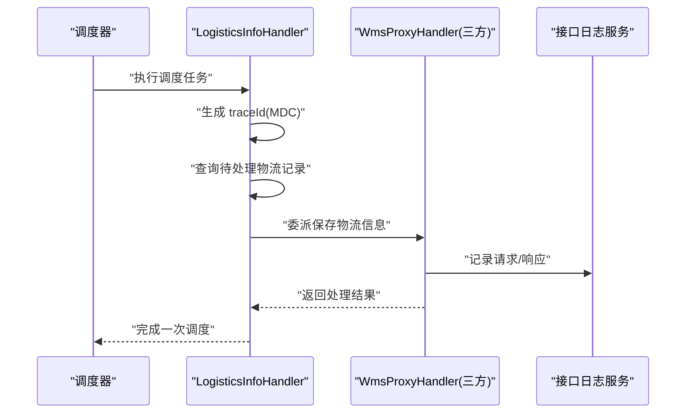
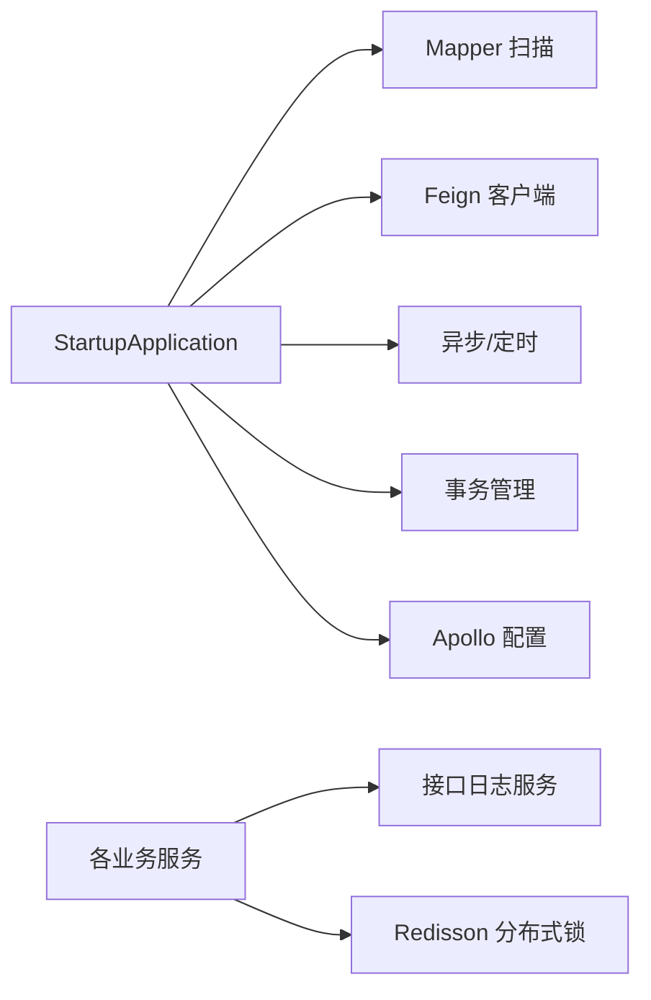

# 调试与故障排查

<cite>
**本文引用的文件**
- [application.properties](file://guoke-deepexi-storage-center-provider/src/main/resources/application.properties)
- [StartupApplication.java](file://guoke-deepexi-storage-center-provider/src/main/java/com/deepexi/storage/StartupApplication.java)
- [ScStockServiceImpl.java](file://guoke-deepexi-storage-center-provider/src/main/java/com/deepexi/storage/service/impl/ScStockServiceImpl.java)
- [ScInterfaceLogService.java](file://guoke-deepexi-storage-center-provider/src/main/java/com/deepexi/storage/service/ScInterfaceLogService.java)
- [ScInterfaceLogServiceImpl.java](file://guoke-deepexi-storage-center-provider/src/main/java/com/deepexi/storage/service/impl/ScInterfaceLogServiceImpl.java)
- [ThreePartyWmsProxyHandler.java](file://guoke-deepexi-storage-center-provider/src/main/java/com/deepexi/storage/service/hanlder/ThreePartyWmsProxyHandler.java)
- [LogisticsInfoHandler.java](file://guoke-deepexi-storage-center-provider/src/main/java/com/deepexi/storage/scheduled/LogisticsInfoHandler.java)
- [GetStockMDLHandler.java](file://guoke-deepexi-storage-center-provider/src/main/java/com/deepexi/storage/scheduled/GetStockMDLHandler.java)
- [UpdateDataServiceImpl.java](file://guoke-deepexi-storage-center-provider/src/main/java/com/deepexi/storage/service/UpdateDataServiceImpl.java)
- [ScCompanyLogisticsConfigService.java](file://guoke-deepexi-storage-center-provider/src/main/java/com/deepexi/storage/service/ScCompanyLogisticsConfigService.java)
- [ScCompanyLogisticsConfigServiceImpl.java](file://guoke-deepexi-storage-center-provider/src/main/java/com/deepexi/storage/service/impl/ScCompanyLogisticsConfigServiceImpl.java)
- [ScCompanyLogisticsConfigMapper.xml](file://guoke-deepexi-storage-center-provider/src/main/resources/mapper/logistics/ScCompanyLogisticsConfigMapper.xml)
- [ScWarningProductServiceImpl.java](file://guoke-deepexi-storage-center-provider/src/main/java/com/deepexi/storage/service/impl/ScWarningProductServiceImpl.java)
- [ScStockWarningSettingServiceImpl.java](file://guoke-deepexi-storage-center-provider/src/main/java/com/deepexi/storage/service/impl/ScStockWarningSettingServiceImpl.java)
- [ScStockWarningSettingExcel.java](file://guoke-deepexi-storage-center-provider/src/main/java/com/deepexi/storage/pojo/vo/stock/ScStockWarningSettingExcel.java)
</cite>

## 目录
1. [简介](#简介)
2. [项目结构](#项目结构)
3. [核心组件](#核心组件)
4. [架构总览](#架构总览)
5. [详细组件分析](#详细组件分析)
6. [依赖关系分析](#依赖关系分析)
7. [性能考量](#性能考量)
8. [故障排查指南](#故障排查指南)
9. [结论](#结论)
10. [附录](#附录)

## 简介
本指南面向国科恒泰仓储管理系统（Storage Center）的研发与运维人员，聚焦于开发调试技巧、断点设置与变量检查方法；覆盖数据库连接异常、Redis/分布式锁异常、接口调用异常等常见问题的诊断与修复；总结日志分析方法、性能监控指标与系统瓶颈定位技巧；解释AOP日志拦截、异常处理器与全局异常处理的调试方法；并提供生产环境问题排查流程、监控告警配置建议与故障恢复策略。

## 项目结构
系统采用多模块聚合工程，核心应用位于 provider 模块，基于 Spring Boot 启动，启用服务发现、Feign 客户端、异步与定时任务、MyBatis Mapper 扫描与事务管理，并通过 Apollo 配置中心加载多命名空间配置。应用通过 RPC/Swak 扫描与 Simple RPC 提供业务能力，同时集成 Redisson 分布式锁与多种外部接口对接。

图表来源
- [StartupApplication.java:19-27](file://guoke-deepexi-storage-center-provider/src/main/java/com/deepexi/storage/StartupApplication.java#L19-L27)
- [application.properties:1-6](file://guoke-deepexi-storage-center-provider/src/main/resources/application.properties#L1-L6)

章节来源
- [StartupApplication.java:14-33](file://guoke-deepexi-storage-center-provider/src/main/java/com/deepexi/storage/StartupApplication.java#L14-L33)
- [application.properties:1-6](file://guoke-deepexi-storage-center-provider/src/main/resources/application.properties#L1-L6)

## 核心组件
- 应用启动与配置：通过 StartupApplication 启动，application.properties 加载 Apollo 多命名空间配置，激活环境 profile。
- 接口日志服务：ScInterfaceLogService/Impl 提供统一接口请求/响应日志落库能力，便于问题回溯。
- 分布式锁与库存操作：ScStockServiceImpl 使用 Redisson 获取多锁，结合事务同步回调确保锁释放时机正确。
- WMS 代理与物流同步：ThreePartyWmsProxyHandler 作为三方货主代理，LogisticsInfoHandler 调度拉取物流信息并委派给代理处理器。
- 数据更新与校验：UpdateDataServiceImpl 提供批量数据修复与强制解锁；Warning 相关服务负责预警计算与设置校验。
- 物流配置：ScCompanyLogisticsConfigService/Impl 及其 MyBatis Mapper 提供按公司维度的物流配置查询与批量插入。

章节来源
- [ScInterfaceLogService.java:1-20](file://guoke-deepexi-storage-center-provider/src/main/java/com/deepexi/storage/service/ScInterfaceLogService.java#L1-L20)
- [ScInterfaceLogServiceImpl.java:1-31](file://guoke-deepexi-storage-center-provider/src/main/java/com/deepexi/storage/service/impl/ScInterfaceLogServiceImpl.java#L1-L31)
- [ScStockServiceImpl.java:3366-3392](file://guoke-deepexi-storage-center-provider/src/main/java/com/deepexi/storage/service/impl/ScStockServiceImpl.java#L3366-L3392)
- [ThreePartyWmsProxyHandler.java:46-74](file://guoke-deepexi-storage-center-provider/src/main/java/com/deepexi/storage/service/hanlder/ThreePartyWmsProxyHandler.java#L46-L74)
- [LogisticsInfoHandler.java:39-61](file://guoke-deepexi-storage-center-provider/src/main/java/com/deepexi/storage/scheduled/LogisticsInfoHandler.java#L39-L61)
- [UpdateDataServiceImpl.java:819-842](file://guoke-deepexi-storage-center-provider/src/main/java/com/deepexi/storage/service/UpdateDataServiceImpl.java#L819-L842)
- [ScCompanyLogisticsConfigService.java:1-18](file://guoke-deepexi-storage-center-provider/src/main/java/com/deepexi/storage/service/ScCompanyLogisticsConfigService.java#L1-L18)
- [ScCompanyLogisticsConfigServiceImpl.java:1-30](file://guoke-deepexi-storage-center-provider/src/main/java/com/deepexi/storage/service/impl/ScCompanyLogisticsConfigServiceImpl.java#L1-L30)
- [ScCompanyLogisticsConfigMapper.xml:1-39](file://guoke-deepexi-storage-center-provider/src/main/resources/mapper/logistics/ScCompanyLogisticsConfigMapper.xml#L1-L39)

## 架构总览
系统围绕“控制器-服务-持久层”分层，结合 RPC/Swak、Feign、Redisson、定时任务与接口日志服务，形成仓储业务闭环。外部接口（如 WMS、MDL）通过代理处理器统一接入，内部通过接口日志服务记录交互痕迹，便于问题定位。

图表来源
- [ScStockServiceImpl.java:3366-3392](file://guoke-deepexi-storage-center-provider/src/main/java/com/deepexi/storage/service/impl/ScStockServiceImpl.java#L3366-L3392)
- [ThreePartyWmsProxyHandler.java:46-74](file://guoke-deepexi-storage-center-provider/src/main/java/com/deepexi/storage/service/hanlder/ThreePartyWmsProxyHandler.java#L46-L74)
- [ScInterfaceLogServiceImpl.java:17-29](file://guoke-deepexi-storage-center-provider/src/main/java/com/deepexi/storage/service/impl/ScInterfaceLogServiceImpl.java#L17-L29)
- [LogisticsInfoHandler.java:47-61](file://guoke-deepexi-storage-center-provider/src/main/java/com/deepexi/storage/scheduled/LogisticsInfoHandler.java#L47-L61)
- [GetStockMDLHandler.java:38-51](file://guoke-deepexi-storage-center-provider/src/main/java/com/deepexi/storage/scheduled/GetStockMDLHandler.java#L38-L51)
- [UpdateDataServiceImpl.java:819-842](file://guoke-deepexi-storage-center-provider/src/main/java/com/deepexi/storage/service/UpdateDataServiceImpl.java#L819-L842)
- [ScCompanyLogisticsConfigMapper.xml:1-39](file://guoke-deepexi-storage-center-provider/src/main/resources/mapper/logistics/ScCompanyLogisticsConfigMapper.xml#L1-L39)

## 详细组件分析

### 组件一：分布式锁与库存操作（Redisson）
- 关键点
  - 使用 Redisson 获取多锁并设置超时时间，避免死锁。
  - 在事务完成后通过同步回调释放锁，保证一致性。
  - 锁失败时记录锁键信息并抛出业务异常，便于快速定位。
- 调试要点
  - 断点设置在获取锁前与 tryLock 成功/失败分支，观察锁键集合与返回状态。
  - 检查事务状态回调中的状态码，确认是否提前回滚导致未释放锁。
  - 结合接口日志服务查看对应业务请求/响应，复现锁冲突场景。

图表来源
- [ScStockServiceImpl.java:3366-3392](file://guoke-deepexi-storage-center-provider/src/main/java/com/deepexi/storage/service/impl/ScStockServiceImpl.java#L3366-L3392)

章节来源
- [ScStockServiceImpl.java:3366-3392](file://guoke-deepexi-storage-center-provider/src/main/java/com/deepexi/storage/service/impl/ScStockServiceImpl.java#L3366-L3392)

### 组件二：接口日志服务（统一记录请求/响应）
- 关键点
  - ScInterfaceLogService.saveLog 统一封装请求/响应 JSON 并持久化。
  - 便于问题回溯与审计，支持按业务类型/编号检索。
- 调试要点
  - 在业务关键路径调用 saveLog 前后设置断点，检查序列化结果与入库状态。
  - 使用数据库客户端直接查询接口日志表，核对字段完整性与时间戳。

图表来源
- [ScInterfaceLogServiceImpl.java:17-29](file://guoke-deepexi-storage-center-provider/src/main/java/com/deepexi/storage/service/impl/ScInterfaceLogServiceImpl.java#L17-L29)
- [ScInterfaceLogService.java:6-19](file://guoke-deepexi-storage-center-provider/src/main/java/com/deepexi/storage/service/ScInterfaceLogService.java#L6-L19)

章节来源
- [ScInterfaceLogService.java:1-20](file://guoke-deepexi-storage-center-provider/src/main/java/com/deepexi/storage/service/ScInterfaceLogService.java#L1-L20)
- [ScInterfaceLogServiceImpl.java:1-31](file://guoke-deepexi-storage-center-provider/src/main/java/com/deepexi/storage/service/impl/ScInterfaceLogServiceImpl.java#L1-L31)

### 组件三：WMS 代理与物流同步调度
- 关键点
  - ThreePartyWmsProxyHandler 作为三方货主代理，封装与外部系统的交互。
  - LogisticsInfoHandler 通过调度器扫描待处理物流记录，委派代理处理器执行。
  - 使用 MDC 注入 traceId，便于链路追踪。
- 调试要点
  - 在调度执行入口设置断点，观察待处理列表与映射关系。
  - 在代理处理器内设置断点，检查请求构造、调用链路与异常捕获。
  - 结合接口日志服务核对请求/响应内容与时间线。

图表来源
- [LogisticsInfoHandler.java:47-61](file://guoke-deepexi-storage-center-provider/src/main/java/com/deepexi/storage/scheduled/LogisticsInfoHandler.java#L47-L61)
- [ThreePartyWmsProxyHandler.java:46-74](file://guoke-deepexi-storage-center-provider/src/main/java/com/deepexi/storage/service/hanlder/ThreePartyWmsProxyHandler.java#L46-L74)
- [ScInterfaceLogServiceImpl.java:17-29](file://guoke-deepexi-storage-center-provider/src/main/java/com/deepexi/storage/service/impl/ScInterfaceLogServiceImpl.java#L17-L29)

章节来源
- [LogisticsInfoHandler.java:39-61](file://guoke-deepexi-storage-center-provider/src/main/java/com/deepexi/storage/scheduled/LogisticsInfoHandler.java#L39-L61)
- [ThreePartyWmsProxyHandler.java:46-74](file://guoke-deepexi-storage-center-provider/src/main/java/com/deepexi/storage/service/hanlder/ThreePartyWmsProxyHandler.java#L46-L74)

### 组件四：MDL 库存同步调度
- 关键点
  - GetStockMDLHandler 负责调用接口中心并访问 MDL 接口，回调同步库存。
  - 包含错误日志记录，便于定位外部接口异常。
- 调试要点
  - 在调度入口与外部接口调用前后设置断点，检查参数构造与异常堆栈。
  - 对比接口日志与外部系统返回，确认协议与鉴权信息。

章节来源
- [GetStockMDLHandler.java:38-51](file://guoke-deepexi-storage-center-provider/src/main/java/com/deepexi/storage/scheduled/GetStockMDLHandler.java#L38-L51)

### 组件五：数据修复与强制解锁
- 关键点
  - UpdateDataServiceImpl 支持批量数据修复与强制解锁，修复后重新计算汇总字段。
- 调试要点
  - 在 SQL 更新前后设置断点，核对影响行数与最终汇总值。
  - 观察 Redis 锁强制释放后的业务行为，避免并发冲突。

章节来源
- [UpdateDataServiceImpl.java:819-842](file://guoke-deepexi-storage-center-provider/src/main/java/com/deepexi/storage/service/UpdateDataServiceImpl.java#L819-L842)

### 组件六：预警计算与设置校验
- 关键点
  - ScWarningProductServiceImpl 计算效期/库龄天数并填充位置信息。
  - ScStockWarningSettingServiceImpl 校验预警天数/上下限等数值合法性。
  - ScStockWarningSettingExcel 提供导入导出模型。
- 调试要点
  - 在计算逻辑分支设置断点，核对日期差值与边界条件。
  - 在设置校验中设置断点，验证异常提示与错误集合。

章节来源
- [ScWarningProductServiceImpl.java:209-228](file://guoke-deepexi-storage-center-provider/src/main/java/com/deepexi/storage/service/impl/ScWarningProductServiceImpl.java#L209-L228)
- [ScStockWarningSettingServiceImpl.java:274-300](file://guoke-deepexi-storage-center-provider/src/main/java/com/deepexi/storage/service/impl/ScStockWarningSettingServiceImpl.java#L274-L300)
- [ScStockWarningSettingExcel.java:106-144](file://guoke-deepexi-storage-center-provider/src/main/java/com/deepexi/storage/pojo/vo/stock/ScStockWarningSettingExcel.java#L106-L144)

### 组件七：物流配置（按公司维度）
- 关键点
  - ScCompanyLogisticsConfigService/Impl 提供按公司查询与批量插入能力。
  - Mapper XML 定义查询与批量插入语句。
- 调试要点
  - 在查询与插入路径设置断点，核对参数与返回结果。
  - 使用数据库客户端验证批量插入的完整性与唯一性约束。

章节来源
- [ScCompanyLogisticsConfigService.java:1-18](file://guoke-deepexi-storage-center-provider/src/main/java/com/deepexi/storage/service/ScCompanyLogisticsConfigService.java#L1-L18)
- [ScCompanyLogisticsConfigServiceImpl.java:1-30](file://guoke-deepexi-storage-center-provider/src/main/java/com/deepexi/storage/service/impl/ScCompanyLogisticsConfigServiceImpl.java#L1-L30)
- [ScCompanyLogisticsConfigMapper.xml:1-39](file://guoke-deepexi-storage-center-provider/src/main/resources/mapper/logistics/ScCompanyLogisticsConfigMapper.xml#L1-L39)

## 依赖关系分析
- 启动类 StartupApplication 统一开启各类能力，并通过 @MapperScan 指定 Mapper 扫描包。
- application.properties 通过 Apollo 多命名空间加载配置，包括数据库、Redis、Prometheus、XXL-Job、RabbitMQ、Elasticsearch 等。
- 服务层广泛依赖接口日志服务进行可观测性记录，便于问题回溯。
- 分布式锁依赖 Redisson，事务同步回调确保锁释放时机正确。

图表来源
- [StartupApplication.java:19-27](file://guoke-deepexi-storage-center-provider/src/main/java/com/deepexi/storage/StartupApplication.java#L19-L27)
- [application.properties:1-6](file://guoke-deepexi-storage-center-provider/src/main/resources/application.properties#L1-L6)
- [ScInterfaceLogServiceImpl.java:17-29](file://guoke-deepexi-storage-center-provider/src/main/java/com/deepexi/storage/service/impl/ScInterfaceLogServiceImpl.java#L17-L29)
- [ScStockServiceImpl.java:3366-3392](file://guoke-deepexi-storage-center-provider/src/main/java/com/deepexi/storage/service/impl/ScStockServiceImpl.java#L3366-L3392)

章节来源
- [StartupApplication.java:14-33](file://guoke-deepexi-storage-center-provider/src/main/java/com/deepexi/storage/StartupApplication.java#L14-L33)
- [application.properties:1-6](file://guoke-deepexi-storage-center-provider/src/main/resources/application.properties#L1-L6)

## 性能考量
- 分布式锁
  - 锁超时时间较长（约2小时），需关注长时间持有锁导致的阻塞风险；建议缩短业务执行时间，减少锁占用。
  - 多锁合并策略可降低锁竞争，但需控制锁键数量，避免过度膨胀。
- 接口日志
  - 请求/响应 JSON 序列化可能带来额外开销，建议对大对象进行裁剪或分页记录。
- 调度任务
  - 物流与 MDL 同步任务应设置合理的执行间隔与并发度，避免对外部系统造成压力。
- 数据修复
  - 批量更新涉及多表与汇总字段重算，建议在低峰期执行并分批处理。

## 故障排查指南

### 开发调试技巧与断点设置
- 入口与配置
  - 在 StartupApplication 的 main 方法设置断点，验证 Apollo 命名空间加载顺序与环境变量生效情况。
  - 在 application.properties 中确认命名空间列表与 profile 激活状态。
- 分布式锁
  - 在获取锁前断点检查锁键集合与输入参数；在 tryLock 分支断点观察加锁结果；在事务回调断点检查状态码与释放逻辑。
- 接口日志
  - 在 saveLog 调用前后断点，检查请求/响应序列化与入库状态；必要时在数据库侧核对字段。
- WMS/物流同步
  - 在调度执行入口断点，观察待处理列表与映射；在代理处理器断点，检查请求构造与异常捕获。
- 数据修复
  - 在批量更新前后断点，核对影响行数与最终汇总值；在强制解锁断点，确认锁释放状态。

章节来源
- [StartupApplication.java:30-32](file://guoke-deepexi-storage-center-provider/src/main/java/com/deepexi/storage/StartupApplication.java#L30-L32)
- [application.properties:1-6](file://guoke-deepexi-storage-center-provider/src/main/resources/application.properties#L1-L6)
- [ScStockServiceImpl.java:3366-3392](file://guoke-deepexi-storage-center-provider/src/main/java/com/deepexi/storage/service/impl/ScStockServiceImpl.java#L3366-L3392)
- [ScInterfaceLogServiceImpl.java:17-29](file://guoke-deepexi-storage-center-provider/src/main/java/com/deepexi/storage/service/impl/ScInterfaceLogServiceImpl.java#L17-L29)
- [LogisticsInfoHandler.java:47-61](file://guoke-deepexi-storage-center-provider/src/main/java/com/deepexi/storage/scheduled/LogisticsInfoHandler.java#L47-L61)
- [UpdateDataServiceImpl.java:819-842](file://guoke-deepexi-storage-center-provider/src/main/java/com/deepexi/storage/service/UpdateDataServiceImpl.java#L819-L842)

### 常见异常诊断与解决
- 数据库连接异常
  - 现象：SQL 执行失败、连接池耗尽、超时。
  - 诊断：检查数据库连接池配置（来自 Apollo 命名空间）、慢查询日志与事务隔离级别；在 Mapper XML 中核对 SQL 语法与索引使用。
  - 解决：优化 SQL 与索引、调整连接池大小、拆分热点表或引入只读副本。
- Redis 连接异常/分布式锁失败
  - 现象：tryLock 返回失败、锁无法释放、业务报错。
  - 诊断：检查 Redis 集群连通性与可用性；在分布式锁断点观察锁键集合与超时参数；确认事务回调是否执行。
  - 解决：增加重试机制、缩短业务执行时间、在异常分支强制解锁。
- 接口调用异常
  - 现象：WMS/MDL/接口中心调用失败、超时、鉴权失败。
  - 诊断：在代理处理器与调度器断点检查请求构造与异常捕获；通过接口日志服务核对请求/响应；检查外部系统健康状态。
  - 解决：完善重试与熔断策略、校验鉴权头与协议版本、限流与降级。

章节来源
- [ScCompanyLogisticsConfigMapper.xml:1-39](file://guoke-deepexi-storage-center-provider/src/main/resources/mapper/logistics/ScCompanyLogisticsConfigMapper.xml#L1-L39)
- [ScStockServiceImpl.java:3366-3392](file://guoke-deepexi-storage-center-provider/src/main/java/com/deepexi/storage/service/impl/ScStockServiceImpl.java#L3366-L3392)
- [ThreePartyWmsProxyHandler.java:46-74](file://guoke-deepexi-storage-center-provider/src/main/java/com/deepexi/storage/service/hanlder/ThreePartyWmsProxyHandler.java#L46-L74)
- [LogisticsInfoHandler.java:47-61](file://guoke-deepexi-storage-center-provider/src/main/java/com/deepexi/storage/scheduled/LogisticsInfoHandler.java#L47-L61)
- [GetStockMDLHandler.java:46-48](file://guoke-deepexi-storage-center-provider/src/main/java/com/deepexi/storage/scheduled/GetStockMDLHandler.java#L46-L48)

### 日志分析方法
- 接口日志
  - 使用接口日志服务记录的关键字段（业务类型、编号、发送方、接收方、请求/响应 JSON）进行回放与对比。
  - 在数据库侧按时间范围与 traceId 查询，定位异常请求。
- 调度与代理
  - 在调度器与代理处理器中观察日志输出，结合 MDC traceId 进行链路关联。
- 错误堆栈
  - 关注外部接口调用异常与分布式锁异常的堆栈信息，优先处理上游依赖问题。

章节来源
- [ScInterfaceLogServiceImpl.java:17-29](file://guoke-deepexi-storage-center-provider/src/main/java/com/deepexi/storage/service/impl/ScInterfaceLogServiceImpl.java#L17-L29)
- [LogisticsInfoHandler.java:47-61](file://guoke-deepexi-storage-center-provider/src/main/java/com/deepexi/storage/scheduled/LogisticsInfoHandler.java#L47-L61)

### 性能监控指标与瓶颈定位
- 指标建议
  - 接口耗时与成功率、数据库慢查询、Redis 命中率与延迟、线程池排队长度、GC 时间占比、内存使用率。
- 瓶颈定位
  - 使用 Prometheus 与可视化面板跟踪关键指标；结合接口日志与链路追踪定位热点接口与慢 SQL。
  - 对分布式锁持有时间过长的业务进行拆分与优化。

章节来源
- [application.properties:5](file://guoke-deepexi-storage-center-provider/src/main/resources/application.properties#L5)

### AOP 日志拦截、异常处理器与全局异常处理的调试
- AOP 日志拦截
  - 通过 @SwakScan 与 RPC/Swak 扫描，结合接口日志服务实现横切记录；在拦截点断点观察请求上下文与响应。
- 异常处理器与全局异常
  - 建议在业务层抛出明确的业务异常并在上层进行统一包装与记录；在分布式锁与外部调用处补充异常捕获与重试。
- 调试方法
  - 在异常抛出点与捕获点分别断点，核对异常类型与消息；结合接口日志确认异常传播路径。

章节来源
- [StartupApplication.java:26](file://guoke-deepexi-storage-center-provider/src/main/java/com/deepexi/storage/StartupApplication.java#L26)
- [ScStockServiceImpl.java:3381-3384](file://guoke-deepexi-storage-center-provider/src/main/java/com/deepexi/storage/service/impl/ScStockServiceImpl.java#L3381-L3384)

### 生产环境问题排查流程
- 快速定位
  - 依据告警触发时间与 traceId，在接口日志与链路追踪中回放请求。
  - 检查外部系统健康状态与鉴权配置。
- 逐步收敛
  - 通过断点与日志核对参数构造、SQL 与 Redis 操作；在分布式锁处确认锁释放时机。
- 恢复策略
  - 对于数据库/Redis 临时故障，采用重试与熔断；对于外部系统故障，降级为离线处理并补偿。
  - 对于数据修复场景，采用分批与幂等设计，避免重复更新。

章节来源
- [ScInterfaceLogServiceImpl.java:17-29](file://guoke-deepexi-storage-center-provider/src/main/java/com/deepexi/storage/service/impl/ScInterfaceLogServiceImpl.java#L17-L29)
- [UpdateDataServiceImpl.java:819-842](file://guoke-deepexi-storage-center-provider/src/main/java/com/deepexi/storage/service/UpdateDataServiceImpl.java#L819-L842)

## 结论
本指南从启动配置、核心组件、日志与监控、分布式锁与外部接口等方面提供了系统性的调试与故障排查方法。建议在开发阶段即建立完善的日志与监控体系，结合断点与变量检查快速定位问题；在生产环境遵循“快速定位、逐步收敛、安全恢复”的流程，确保系统稳定运行。

## 附录
- 关键文件清单
  - 启动与配置：[StartupApplication.java](file://guoke-deepexi-storage-center-provider/src/main/java/com/deepexi/storage/StartupApplication.java)，[application.properties](file://guoke-deepexi-storage-center-provider/src/main/resources/application.properties)
  - 接口日志：[ScInterfaceLogService.java](file://guoke-deepexi-storage-center-provider/src/main/java/com/deepexi/storage/service/ScInterfaceLogService.java)，[ScInterfaceLogServiceImpl.java](file://guoke-deepexi-storage-center-provider/src/main/java/com/deepexi/storage/service/impl/ScInterfaceLogServiceImpl.java)
  - 分布式锁：[ScStockServiceImpl.java](file://guoke-deepexi-storage-center-provider/src/main/java/com/deepexi/storage/service/impl/ScStockServiceImpl.java)
  - WMS/物流：[ThreePartyWmsProxyHandler.java](file://guoke-deepexi-storage-center-provider/src/main/java/com/deepexi/storage/service/hanlder/ThreePartyWmsProxyHandler.java)，[LogisticsInfoHandler.java](file://guoke-deepexi-storage-center-provider/src/main/java/com/deepexi/storage/scheduled/LogisticsInfoHandler.java)
  - 外部接口同步：[GetStockMDLHandler.java](file://guoke-deepexi-storage-center-provider/src/main/java/com/deepexi/storage/scheduled/GetStockMDLHandler.java)
  - 数据修复：[UpdateDataServiceImpl.java](file://guoke-deepexi-storage-center-provider/src/main/java/com/deepexi/storage/service/UpdateDataServiceImpl.java)
  - 物流配置：[ScCompanyLogisticsConfigService.java](file://guoke-deepexi-storage-center-provider/src/main/java/com/deepexi/storage/service/ScCompanyLogisticsConfigService.java)，[ScCompanyLogisticsConfigServiceImpl.java](file://guoke-deepexi-storage-center-provider/src/main/java/com/deepexi/storage/service/impl/ScCompanyLogisticsConfigServiceImpl.java)，[ScCompanyLogisticsConfigMapper.xml](file://guoke-deepexi-storage-center-provider/src/main/resources/mapper/logistics/ScCompanyLogisticsConfigMapper.xml)
  - 预警相关：[ScWarningProductServiceImpl.java](file://guoke-deepexi-storage-center-provider/src/main/java/com/deepexi/storage/service/impl/ScWarningProductServiceImpl.java)，[ScStockWarningSettingServiceImpl.java](file://guoke-deepexi-storage-center-provider/src/main/java/com/deepexi/storage/service/impl/ScStockWarningSettingServiceImpl.java)，[ScStockWarningSettingExcel.java](file://guoke-deepexi-storage-center-provider/src/main/java/com/deepexi/storage/pojo/vo/stock/ScStockWarningSettingExcel.java)