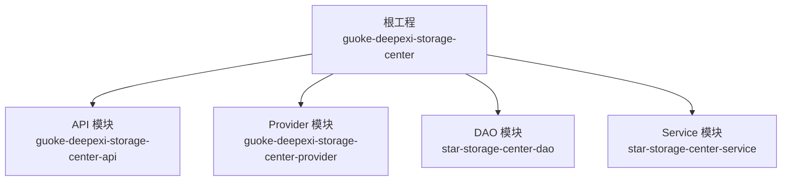
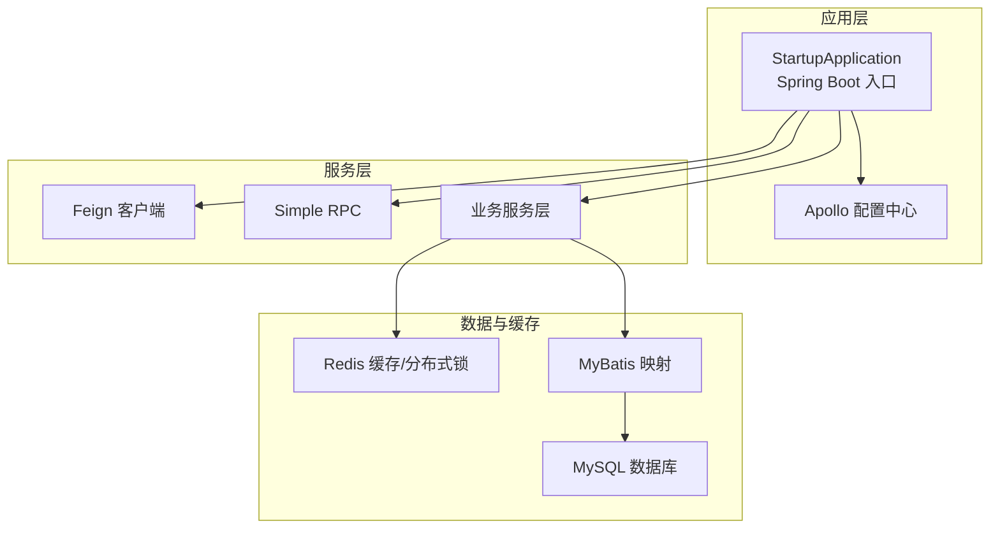
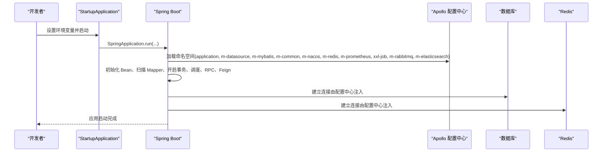
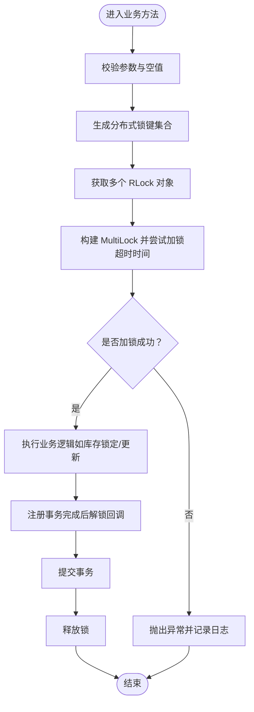
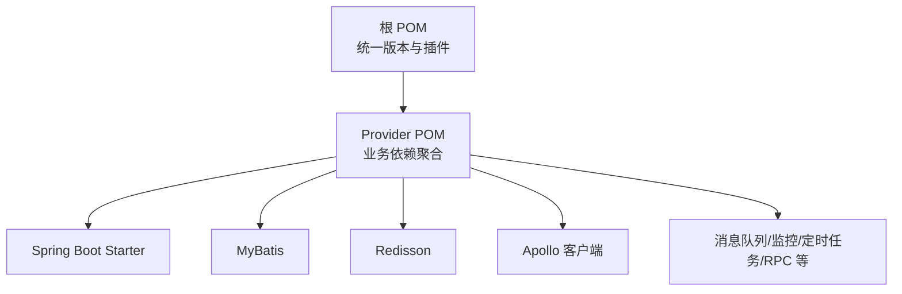

# 快速开始

<cite>
**本文引用的文件**
- [根 POM 文件](file://pom.xml)
- [提供者模块 POM](file://guoke-deepexi-storage-center-provider/pom.xml)
- [API 模块 POM](file://guoke-deepexi-storage-center-api/pom.xml)
- [应用入口类](file://guoke-deepexi-storage-center-provider/src/main/java/com/deepexi/storage/StartupApplication.java)
- [应用配置文件](file://guoke-deepexi-storage-center-provider/src/main/resources/application.properties)
- [MyBatis 映射示例](file://guoke-deepexi-storage-center-provider/src/main/resources/mapper/individuation/ScCompanyIndividuationConfigMapper.xml)
- [MyBatis 物流配置映射示例](file://guoke-deepexi-storage-center-provider/src/main/resources/mapper/logistics/ScCompanyLogisticsConfigMapper.xml)
- [更新数据服务实现（Redis 分布式锁）](file://guoke-deepexi-storage-center-provider/src/main/java/com/deepexi/storage/service/UpdateDataServiceImpl.java)
- [库存服务实现（Redis 分布式锁）](file://guoke-deepexi-storage-center-provider/src/main/java/com/deepexi/storage/service/impl/ScStockServiceImpl.java)
</cite>

## 目录
1. [简介](#简介)
2. [项目结构](#项目结构)
3. [核心组件](#核心组件)
4. [架构总览](#架构总览)
5. [详细组件分析](#详细组件分析)
6. [依赖分析](#依赖分析)
7. [性能考虑](#性能考虑)
8. [故障排除指南](#故障排除指南)
9. [结论](#结论)
10. [附录](#附录)

## 简介
本指南面向不同技术背景的开发者，帮助您在本地快速搭建国科恒泰仓储管理系统（Guoke DeepExi Storage Center）的开发与运行环境。内容涵盖环境要求、项目克隆、依赖安装、数据库与缓存准备、配置文件修改以及启动验证等关键步骤，并提供常见问题与解决方案，确保您能在最短时间内完成从零到一的部署。

## 项目结构
该仓库采用 Maven 多模块结构，主要模块包括：
- 根工程：统一版本与插件配置
- API 模块：对外 DTO、枚举与接口定义
- Provider 模块：业务实现、控制器、MyBatis 映射、服务与定时任务等
- DAO 与 Service 模块：独立模块化封装

图表来源
- [根 POM 文件:21-26](file://pom.xml#L21-L26)

章节来源
- [根 POM 文件:1-68](file://pom.xml#L1-L68)

## 核心组件
- 应用入口与启动类：负责启用 Spring Boot、服务发现、Feign 客户端、事务管理、MyBatis 扫描、调度与 RPC 能力。
- 配置中心集成：通过 Apollo 启动命名空间加载，支持多命名空间配置聚合。
- 数据访问层：基于 MyBatis 的 XML 映射，提供仓储与查询能力。
- 缓存与分布式锁：使用 Redis（Redisson）实现分布式锁与缓存服务。
- 依赖管理：Provider 模块引入大量企业级中间件与第三方能力（消息队列、监控、定时任务、RPC 等）。

章节来源
- [应用入口类:14-28](file://guoke-deepexi-storage-center-provider/src/main/java/com/deepexi/storage/StartupApplication.java#L14-L28)
- [应用配置文件:1-6](file://guoke-deepexi-storage-center-provider/src/main/resources/application.properties#L1-L6)
- [Provider 模块 POM:15-394](file://guoke-deepexi-storage-center-provider/pom.xml#L15-L394)

## 架构总览
系统采用微服务架构，结合 Spring Cloud 生态与 Apollo 配置中心，通过 Feign 进行服务间调用，使用 Redis 实现分布式锁与缓存，MyBatis 访问关系型数据库。

图表来源
- [应用入口类:19-27](file://guoke-deepexi-storage-center-provider/src/main/java/com/deepexi/storage/StartupApplication.java#L19-L27)
- [应用配置文件:2-5](file://guoke-deepexi-storage-center-provider/src/main/resources/application.properties#L2-L5)
- [Provider 模块 POM:16-394](file://guoke-deepexi-storage-center-provider/pom.xml#L16-L394)

## 详细组件分析

### 启动流程与配置加载
应用启动时，会根据环境变量激活对应配置文件，并从 Apollo 加载多个命名空间的配置，随后初始化 Spring 上下文与各组件。

图表来源
- [应用入口类:30-32](file://guoke-deepexi-storage-center-provider/src/main/java/com/deepexi/storage/StartupApplication.java#L30-L32)
- [应用配置文件:1-6](file://guoke-deepexi-storage-center-provider/src/main/resources/application.properties#L1-L6)

章节来源
- [应用入口类:14-33](file://guoke-deepexi-storage-center-provider/src/main/java/com/deepexi/storage/StartupApplication.java#L14-L33)
- [应用配置文件:1-6](file://guoke-deepexi-storage-center-provider/src/main/resources/application.properties#L1-L6)

### 数据访问与分布式锁
- MyBatis 映射：通过 XML 定义 SQL 与结果映射，支持条件查询与批量插入等场景。
- 分布式锁：使用 Redisson 在高并发场景下对库存等关键操作进行加锁，保证一致性。

图表来源
- [库存服务实现（Redis 分布式锁）:3366-3392](file://guoke-deepexi-storage-center-provider/src/main/java/com/deepexi/storage/service/impl/ScStockServiceImpl.java#L3366-L3392)
- [更新数据服务实现（Redis 分布式锁）:819-842](file://guoke-deepexi-storage-center-provider/src/main/java/com/deepexi/storage/service/UpdateDataServiceImpl.java#L819-L842)

章节来源
- [MyBatis 映射示例:1-21](file://guoke-deepexi-storage-center-provider/src/main/resources/mapper/individuation/ScCompanyIndividuationConfigMapper.xml#L1-L21)
- [MyBatis 物流配置映射示例:1-39](file://guoke-deepexi-storage-center-provider/src/main/resources/mapper/logistics/ScCompanyLogisticsConfigMapper.xml#L1-L39)
- [库存服务实现（Redis 分布式锁）:3366-3392](file://guoke-deepexi-storage-center-provider/src/main/java/com/deepexi/storage/service/impl/ScStockServiceImpl.java#L3366-L3392)
- [更新数据服务实现（Redis 分布式锁）:819-842](file://guoke-deepexi-storage-center-provider/src/main/java/com/deepexi/storage/service/UpdateDataServiceImpl.java#L819-L842)

## 依赖分析
- JDK 版本：编译与目标均为 Java 8。
- Spring Boot 与 Spring Cloud：提供微服务基础能力。
- MyBatis：持久层框架，配合 XML 映射。
- Redisson：Redis 客户端，提供分布式锁与缓存。
- Apollo：配置中心客户端，支持多命名空间配置。
- 其他中间件：消息队列、监控、定时任务、RPC 等。

图表来源
- [根 POM 文件:17-66](file://pom.xml#L17-L66)
- [Provider 模块 POM:15-394](file://guoke-deepexi-storage-center-provider/pom.xml#L15-L394)

章节来源
- [根 POM 文件:17-66](file://pom.xml#L17-L66)
- [Provider 模块 POM:15-394](file://guoke-deepexi-storage-center-provider/pom.xml#L15-L394)
- [API 模块 POM:14-63](file://guoke-deepexi-storage-center-api/pom.xml#L14-L63)

## 性能考虑
- 使用 Redisson 实现分布式锁，避免热点商品/库存的并发竞争。
- MyBatis XML 映射可针对复杂查询进行优化，建议结合慢查询日志与索引策略。
- 合理设置 Apollo 命名空间与配置项，减少不必要的热更新带来的抖动。
- 启动参数与 JVM 参数需按实际负载调整，关注 GC 与堆内存使用情况。

## 故障排除指南
- 启动报错：无法连接 Apollo 或配置中心
  - 检查环境变量 env 是否正确设置，确认 Apollo 地址与命名空间配置。
  - 参考路径：[应用配置文件:1-6](file://guoke-deepexi-storage-center-provider/src/main/resources/application.properties#L1-L6)
- 启动报错：无法连接数据库
  - 确认数据库服务可用、账号密码与连接串配置正确。
  - 参考路径：[MyBatis 映射示例:1-21](file://guoke-deepexi-storage-center-provider/src/main/resources/mapper/individuation/ScCompanyIndividuationConfigMapper.xml#L1-L21)
- 启动报错：Redis 连接失败
  - 确认 Redis 服务可用、认证配置正确。
  - 参考路径：[库存服务实现（Redis 分布式锁）:3366-3392](file://guoke-deepexi-storage-center-provider/src/main/java/com/deepexi/storage/service/impl/ScStockServiceImpl.java#L3366-L3392)
- 启动报错：JDK 版本不匹配
  - 确保使用 JDK 1.8 进行编译与运行。
  - 参考路径：[根 POM 文件:42-44](file://pom.xml#L42-L44)
- 启动报错：类找不到或依赖冲突
  - 清理并重新安装依赖，必要时排除冲突传递依赖。
  - 参考路径：[Provider 模块 POM:31-44](file://guoke-deepexi-storage-center-provider/pom.xml#L31-L44)

章节来源
- [应用配置文件:1-6](file://guoke-deepexi-storage-center-provider/src/main/resources/application.properties#L1-L6)
- [MyBatis 映射示例:1-21](file://guoke-deepexi-storage-center-provider/src/main/resources/mapper/individuation/ScCompanyIndividuationConfigMapper.xml#L1-L21)
- [库存服务实现（Redis 分布式锁）:3366-3392](file://guoke-deepexi-storage-center-provider/src/main/java/com/deepexi/storage/service/impl/ScStockServiceImpl.java#L3366-L3392)
- [根 POM 文件:42-44](file://pom.xml#L42-L44)
- [Provider 模块 POM:31-44](file://guoke-deepexi-storage-center-provider/pom.xml#L31-L44)

## 结论
通过本快速开始指南，您已经了解了系统的整体架构、核心组件与启动流程，并掌握了环境准备、配置加载与常见问题排查的方法。建议在本地先完成 Apollo、MySQL、Redis 的最小可用配置，再进行模块编译与启动验证，逐步扩展到完整的开发与调试流程。

## 附录

### 环境要求
- JDK 1.8
- MySQL（版本与驱动请参考具体依赖）
- Redis（用于缓存与分布式锁）
- Apollo 配置中心（用于集中配置管理）

章节来源
- [根 POM 文件:42-44](file://pom.xml#L42-L44)

### 安装与运行步骤
- 步骤 1：克隆仓库
  - 使用 Git 工具克隆项目至本地工作目录。
- 步骤 2：安装依赖
  - 在根目录执行 Maven 安装命令，下载所有依赖。
  - 参考路径：[根 POM 文件:1-68](file://pom.xml#L1-L68)
- 步骤 3：准备数据库
  - 创建数据库与用户，导入初始脚本（如有），确保连接信息正确。
  - 参考路径：[MyBatis 映射示例:1-21](file://guoke-deepexi-storage-center-provider/src/main/resources/mapper/individuation/ScCompanyIndividuationConfigMapper.xml#L1-L21)
- 步骤 4：准备缓存与配置
  - 启动 Redis 服务，确保连通性。
  - 配置 Apollo 命名空间与连接信息。
  - 参考路径：[应用配置文件:1-6](file://guoke-deepexi-storage-center-provider/src/main/resources/application.properties#L1-L6)
- 步骤 5：修改配置文件
  - 根据本地环境调整数据库连接、Redis 地址、Apollo 地址与命名空间。
  - 参考路径：[应用配置文件:1-6](file://guoke-deepexi-storage-center-provider/src/main/resources/application.properties#L1-L6)
- 步骤 6：启动应用
  - 设置环境变量 env，启动应用入口类。
  - 参考路径：[应用入口类:30-32](file://guoke-deepexi-storage-center-provider/src/main/java/com/deepexi/storage/StartupApplication.java#L30-L32)
- 步骤 7：验证运行
  - 访问健康检查端点或相关接口，确认服务正常。
  - 参考路径：[应用入口类:19-27](file://guoke-deepexi-storage-center-provider/src/main/java/com/deepexi/storage/StartupApplication.java#L19-L27)

章节来源
- [应用入口类:19-32](file://guoke-deepexi-storage-center-provider/src/main/java/com/deepexi/storage/StartupApplication.java#L19-L32)
- [应用配置文件:1-6](file://guoke-deepexi-storage-center-provider/src/main/resources/application.properties#L1-L6)
- [MyBatis 映射示例:1-21](file://guoke-deepexi-storage-center-provider/src/main/resources/mapper/individuation/ScCompanyIndividuationConfigMapper.xml#L1-L21)
- [根 POM 文件:1-68](file://pom.xml#L1-L68)