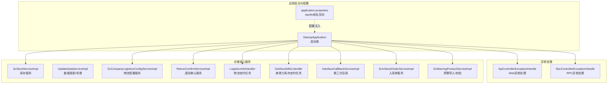
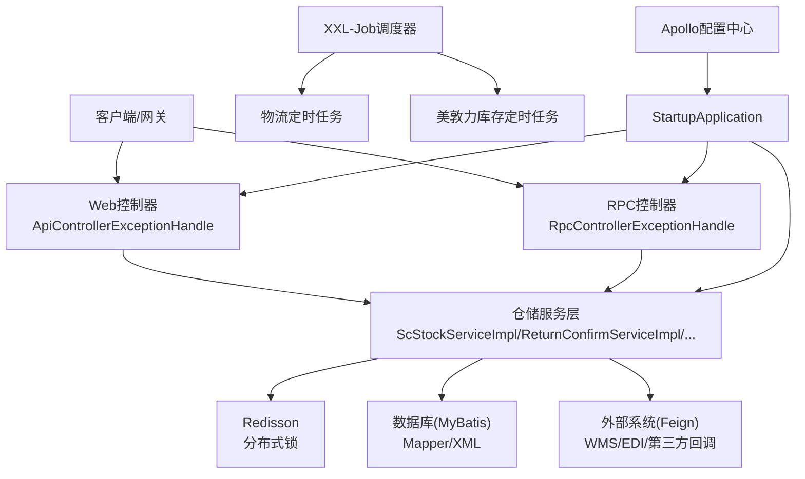
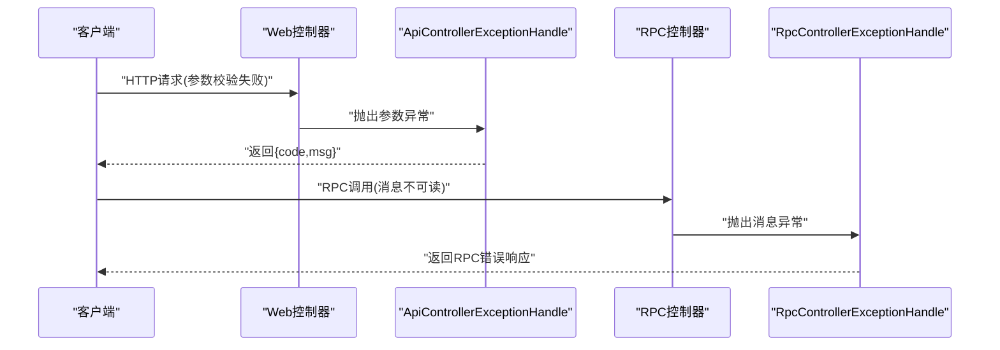
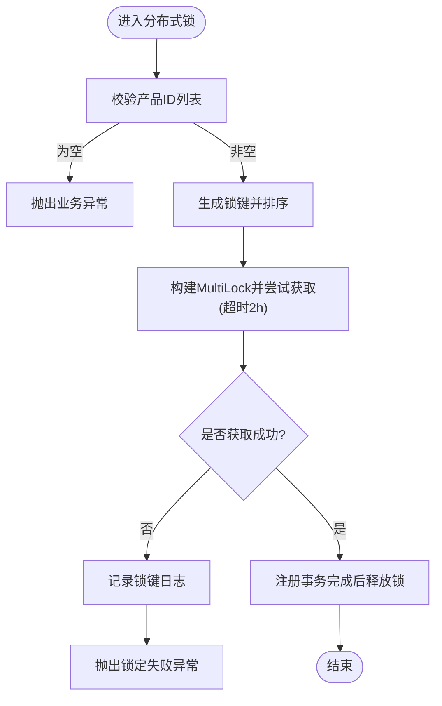

# 故障排除与FAQ

<cite>
**本文引用的文件**
- [application.properties](file://guoke-deepexi-storage-center-provider/src/main/resources/application.properties)
- [ApiControllerExceptionHandle.java](file://guoke-deepexi-storage-center-provider/src/main/java/com/zhengyang/storage/common/extension/ApiControllerExceptionHandle.java)
- [RpcControllerExceptionHandle.java](file://guoke-deepexi-storage-center-provider/src/main/java/com/zhengyang/storage/common/extension/RpcControllerExceptionHandle.java)
- [StartupApplication.java](file://guoke-deepexi-storage-center-provider/src/main/java/com/zhengyang/storage/StartupApplication.java)
- [ScStockServiceImpl.java](file://guoke-deepexi-storage-center-provider/src/main/java/com/zhengyang/storage/service/impl/ScStockServiceImpl.java)
- [UpdateDataServiceImpl.java](file://guoke-deepexi-storage-center-provider/src/main/java/com/zhengyang/storage/service/UpdateDataServiceImpl.java)
- [ScCompanyLogisticsConfigServiceImpl.java](file://guoke-deepexi-storage-center-provider/src/main/java/com/zhengyang/storage/service/impl/ScCompanyLogisticsConfigServiceImpl.java)
- [ScCompanyLogisticsConfigMapper.xml](file://guoke-deepexi-storage-center-provider/src/main/resources/mapper/logistics/ScCompanyLogisticsConfigMapper.xml)
- [ScWarningStockMapper.xml](file://guoke-deepexi-storage-center-provider/src/main/resources/mapper/ScWarningStockMapper.xml)
- [StockOutErrorTip.java](file://guoke-deepexi-storage-center-provider/src/main/java/com/zhengyang/storage/pojo/vo/stockout/StockOutErrorTip.java)
- [ExcelErrorInfo.java](file://guoke-deepexi-storage-center-provider/src/main/java/com/zhengyang/storage/common/util/excel/ExcelErrorInfo.java)
- [ReturnConfirmServiceImpl.java](file://guoke-deepexi-storage-center-provider/src/main/java/com/zhengyang/storage/service/impl/ReturnConfirmServiceImpl.java)
- [LogisticsInfoHandler.java](file://guoke-deepexi-storage-center-provider/src/main/java/com/zhengyang/storage/scheduled/LogisticsInfoHandler.java)
- [GetStockMDLHandler.java](file://guoke-deepexi-storage-center-provider/src/main/java/com/zhengyang/storage/scheduled/GetStockMDLHandler.java)
- [InterfaceCallBackServiceImpl.java](file://guoke-deepexi-storage-center-provider/src/main/java/com/zhengyang/storage/service/impl/InterfaceCallBackServiceImpl.java)
- [ScInStockOrderServiceImpl.java](file://guoke-deepexi-storage-center-provider/src/main/java/com/zhengyang/storage/service/impl/ScInStockOrderServiceImpl.java)
- [ScWarningProductServiceImpl.java](file://guoke-deepexi-storage-center-provider/src/main/java/com/zhengyang/storage/service/impl/ScWarningProductServiceImpl.java)
</cite>

## 目录
1. [简介](#简介)
2. [项目结构](#项目结构)
3. [核心组件](#核心组件)
4. [架构总览](#架构总览)
5. [详细组件分析](#详细组件分析)
6. [依赖分析](#依赖分析)
7. [性能考虑](#性能考虑)
8. [故障排除指南](#故障排除指南)
9. [结论](#结论)
10. [附录](#附录)

## 简介
本文件面向国科恒泰仓储管理系统运维与使用人员，提供系统启动失败、数据库连接问题、接口调用异常、性能瓶颈等典型故障的诊断与修复方法，并配套FAQ分类体系、日志分析技巧、问题定位流程与预防性维护建议。内容基于代码库中的异常处理、配置、调度与业务实现进行归纳总结，帮助快速定位与解决问题。

## 项目结构
系统采用Spring Boot工程，结合MyBatis、Redisson分布式锁、XXL-Job定时任务、Feign远程调用、Apollo配置中心等技术栈。核心模块包括：
- 启动入口与配置：应用启动类、Apollo命名空间配置
- 异常处理：Web与RPC统一异常处理
- 仓储核心服务：库存、出入库、预警、物流对接等
- 定时任务：物流信息抓取、第三方接口回调、库存同步
- 数据访问：MyBatis Mapper XML与实体模型

图示来源
- [StartupApplication.java:1-33](file://guoke-deepexi-storage-center-provider/src/main/java/com/zhengyang/storage/StartupApplication.java#L1-L33)
- [application.properties:1-6](file://guoke-deepexi-storage-center-provider/src/main/resources/application.properties#L1-L6)

章节来源
- [StartupApplication.java:1-33](file://guoke-deepexi-storage-center-provider/src/main/java/com/zhengyang/storage/StartupApplication.java#L1-L33)
- [application.properties:1-6](file://guoke-deepexi-storage-center-provider/src/main/resources/application.properties#L1-L6)

## 核心组件
- 启动与扫描：启用服务发现、Feign、事务管理、MyBatis Mapper扫描、定时任务、异步任务、RPC等
- Apollo配置：多命名空间加载，覆盖数据源、MyBatis、Nacos、Redis、Prometheus、XXL-Job、RabbitMQ、Elasticsearch等
- Web/RPC异常处理：统一封装错误码与消息，区分参数校验、消息不可读、通用异常等
- 分布式锁与事务：库存锁定采用Redisson MultiLock，事务完成后释放，避免死锁与资源泄漏
- 数据更新与清理：提供强制解锁与批量更新逻辑，保障数据一致性
- 物流与预警：定时抓取物流信息、对接第三方接口、导入预警数据并校验
- 日志与追踪：定时任务中设置traceId，便于链路追踪

章节来源
- [StartupApplication.java:14-27](file://guoke-deepexi-storage-center-provider/src/main/java/com/zhengyang/storage/StartupApplication.java#L14-L27)
- [application.properties:1-6](file://guoke-deepexi-storage-center-provider/src/main/resources/application.properties#L1-L6)
- [ApiControllerExceptionHandle.java:20-113](file://guoke-deepexi-storage-center-provider/src/main/java/com/zhengyang/storage/common/extension/ApiControllerExceptionHandle.java#L20-L113)
- [RpcControllerExceptionHandle.java:21-108](file://guoke-deepexi-storage-center-provider/src/main/java/com/zhengyang/storage/common/extension/RpcControllerExceptionHandle.java#L21-L108)
- [ScStockServiceImpl.java:3366-3407](file://guoke-deepexi-storage-center-provider/src/main/java/com/zhengyang/storage/service/impl/ScStockServiceImpl.java#L3366-L3407)
- [UpdateDataServiceImpl.java:819-842](file://guoke-deepexi-storage-center-provider/src/main/java/com/zhengyang/storage/service/UpdateDataServiceImpl.java#L819-L842)
- [LogisticsInfoHandler.java:39-61](file://guoke-deepexi-storage-center-provider/src/main/java/com/zhengyang/storage/scheduled/LogisticsInfoHandler.java#L39-L61)
- [GetStockMDLHandler.java:1-38](file://guoke-deepexi-storage-center-provider/src/main/java/com/zhengyang/storage/scheduled/GetStockMDLHandler.java#L1-L38)
- [InterfaceCallBackServiceImpl.java:40-59](file://guoke-deepexi-storage-center-provider/src/main/java/com/zhengyang/storage/service/impl/InterfaceCallBackServiceImpl.java#L40-L59)

## 架构总览
系统以Spring Boot为核心，通过Feign与外部系统交互，使用Redisson实现高并发下的库存锁定，借助XXL-Job执行定时任务，Apollo集中化配置，MyBatis访问数据库。异常处理在Web与RPC层统一拦截，返回标准化响应。

图示来源
- [StartupApplication.java:19-27](file://guoke-deepexi-storage-center-provider/src/main/java/com/zhengyang/storage/StartupApplication.java#L19-L27)
- [ApiControllerExceptionHandle.java:25-35](file://guoke-deepexi-storage-center-provider/src/main/java/com/zhengyang/storage/common/extension/ApiControllerExceptionHandle.java#L25-L35)
- [RpcControllerExceptionHandle.java:26-35](file://guoke-deepexi-storage-center-provider/src/main/java/com/zhengyang/storage/common/extension/RpcControllerExceptionHandle.java#L26-L35)
- [ScStockServiceImpl.java:3366-3407](file://guoke-deepexi-storage-center-provider/src/main/java/com/zhengyang/storage/service/impl/ScStockServiceImpl.java#L3366-L3407)
- [LogisticsInfoHandler.java:48-61](file://guoke-deepexi-storage-center-provider/src/main/java/com/zhengyang/storage/scheduled/LogisticsInfoHandler.java#L48-L61)
- [GetStockMDLHandler.java:32-38](file://guoke-deepexi-storage-center-provider/src/main/java/com/zhengyang/storage/scheduled/GetStockMDLHandler.java#L32-L38)
- [application.properties:5-5](file://guoke-deepexi-storage-center-provider/src/main/resources/application.properties#L5-L5)

## 详细组件分析

### 统一异常处理（Web与RPC）
- Web层：拦截参数校验、消息不可读、缺失参数、非法参数等，返回带错误码与消息的Payload
- RPC层：拦截同类异常，封装BaseResponseDto错误响应
- 建议：前端根据错误码快速识别问题类型；后端日志记录堆栈以便排查

图示来源
- [ApiControllerExceptionHandle.java:49-105](file://guoke-deepexi-storage-center-provider/src/main/java/com/zhengyang/storage/common/extension/ApiControllerExceptionHandle.java#L49-L105)
- [RpcControllerExceptionHandle.java:48-105](file://guoke-deepexi-storage-center-provider/src/main/java/com/zhengyang/storage/common/extension/RpcControllerExceptionHandle.java#L48-L105)

章节来源
- [ApiControllerExceptionHandle.java:20-113](file://guoke-deepexi-storage-center-provider/src/main/java/com/zhengyang/storage/common/extension/ApiControllerExceptionHandle.java#L20-L113)
- [RpcControllerExceptionHandle.java:21-108](file://guoke-deepexi-storage-center-provider/src/main/java/com/zhengyang/storage/common/extension/RpcControllerExceptionHandle.java#L21-L108)

### 分布式库存锁定与事务释放
- 使用Redisson MultiLock对多个产品ID加锁，避免死锁
- 通过事务同步器在afterCompletion阶段释放锁，保证事务成功/失败均释放
- 若获取锁超时，抛出业务异常并记录锁键信息

图示来源
- [ScStockServiceImpl.java:3366-3407](file://guoke-deepexi-storage-center-provider/src/main/java/com/zhengyang/storage/service/impl/ScStockServiceImpl.java#L3366-L3407)

章节来源
- [ScStockServiceImpl.java:3366-3407](file://guoke-deepexi-storage-center-provider/src/main/java/com/zhengyang/storage/service/impl/ScStockServiceImpl.java#L3366-L3407)

### 数据更新与强制解锁
- 提供强制解锁方法，适用于异常中断或锁未释放场景
- 批量更新逻辑涉及多表关联，需谨慎执行并做好回滚准备

章节来源
- [UpdateDataServiceImpl.java:819-842](file://guoke-deepexi-storage-center-provider/src/main/java/com/zhengyang/storage/service/UpdateDataServiceImpl.java#L819-L842)

### 物流配置与查询
- 通过公司ID查询物流配置，支持多条件SQL片段拼接
- 服务层封装查询逻辑，便于上层调用

章节来源
- [ScCompanyLogisticsConfigMapper.xml:1-39](file://guoke-deepexi-storage-center-provider/src/main/resources/mapper/logistics/ScCompanyLogisticsConfigMapper.xml#L1-L39)
- [ScCompanyLogisticsConfigServiceImpl.java:1-30](file://guoke-deepexi-storage-center-provider/src/main/java/com/zhengyang/storage/service/impl/ScCompanyLogisticsConfigServiceImpl.java#L1-L30)

### 定时任务与第三方对接
- 物流定时任务：按状态查询出库单，调用WMS代理处理器获取物流信息
- 美敦力库存定时任务：通过接口管理器拉取库存数据
- 第三方回调：接收并解析回调请求，执行同步逻辑

章节来源
- [LogisticsInfoHandler.java:39-61](file://guoke-deepexi-storage-center-provider/src/main/java/com/zhengyang/storage/scheduled/LogisticsInfoHandler.java#L39-L61)
- [GetStockMDLHandler.java:1-38](file://guoke-deepexi-storage-center-provider/src/main/java/com/zhengyang/storage/scheduled/GetStockMDLHandler.java#L1-L38)
- [InterfaceCallBackServiceImpl.java:40-59](file://guoke-deepexi-storage-center-provider/src/main/java/com/zhengyang/storage/service/impl/InterfaceCallBackServiceImpl.java#L40-L59)

### 入库单与退货确认流程
- 入库单：根据入仓类型设置订单类型与状态，组装商品明细
- 退货确认：调用WMS接口获取条码信息并解析结果

章节来源
- [ScInStockOrderServiceImpl.java:2866-2886](file://guoke-deepexi-storage-center-provider/src/main/java/com/zhengyang/storage/service/impl/ScInStockOrderServiceImpl.java#L2866-L2886)
- [ReturnConfirmServiceImpl.java:353-375](file://guoke-deepexi-storage-center-provider/src/main/java/com/zhengyang/storage/service/impl/ReturnConfirmServiceImpl.java#L353-L375)

### 预警数据导入与校验
- 支持库龄与效期预警数据的Excel导入
- 对必填项、格式、数值范围进行校验，生成错误信息集合

章节来源
- [ScWarningProductServiceImpl.java:209-228](file://guoke-deepexi-storage-center-provider/src/main/java/com/zhengyang/storage/service/impl/ScWarningProductServiceImpl.java#L209-L228)
- [ScWarningProductServiceImpl.java:272-315](file://guoke-deepexi-storage-center-provider/src/main/java/com/zhengyang/storage/service/impl/ScWarningProductServiceImpl.java#L272-L315)

## 依赖分析
- 启动类启用Feign、Discovery、Scheduling、Async、MapperScan、TransactionManagement、SwakScan、EnableSimpleRpc
- Apollo命名空间覆盖数据源、MyBatis、Nacos、Redis、Prometheus、XXL-Job、RabbitMQ、Elasticsearch
- Web/RPC异常处理分别作用于web与rpc包路径，避免重复处理
- 定时任务依赖XXL-Job与TraceId设置，便于链路追踪

章节来源
- [StartupApplication.java:19-27](file://guoke-deepexi-storage-center-provider/src/main/java/com/zhengyang/storage/StartupApplication.java#L19-L27)
- [application.properties:5-5](file://guoke-deepexi-storage-center-provider/src/main/resources/application.properties#L5-L5)
- [ApiControllerExceptionHandle.java:25-25](file://guoke-deepexi-storage-center-provider/src/main/java/com/zhengyang/storage/common/extension/ApiControllerExceptionHandle.java#L25-L25)
- [RpcControllerExceptionHandle.java:26-26](file://guoke-deepexi-storage-center-provider/src/main/java/com/zhengyang/storage/common/extension/RpcControllerExceptionHandle.java#L26-L26)
- [LogisticsInfoHandler.java:49-49](file://guoke-deepexi-storage-center-provider/src/main/java/com/zhengyang/storage/scheduled/LogisticsInfoHandler.java#L49-L49)

## 性能考虑
- 分布式锁：MultiLock按产品ID排序避免死锁；超时时间较长，注意监控锁持有时间
- 定时任务：合理设置任务粒度与并发策略，避免对下游系统造成压力
- 数据导入：分批处理与校验，减少内存占用与数据库压力
- 缓存与连接池：结合Apollo配置优化Redis与数据库连接池参数

[本节为通用建议，无需列出具体文件来源]

## 故障排除指南

### 一、系统启动失败
- 症状
  - 应用无法启动或启动后立即退出
- 可能原因
  - Apollo命名空间未正确加载或配置项缺失
  - Feign/Discovery/数据库连接配置不正确
  - 启动类扫描路径或注解配置错误
- 排查步骤
  - 检查Apollo命名空间是否加载成功（application.properties中的namespaces）
  - 查看启动日志中是否有Feign/Discovery初始化异常
  - 确认数据库连接参数、MyBatis配置是否正确
  - 核对启动类注解与扫描路径是否匹配实际包结构
- 修复建议
  - 在Apollo控制台检查对应命名空间配置
  - 本地验证数据库连通性与权限
  - 修正启动类注解与包扫描路径

章节来源
- [application.properties:1-6](file://guoke-deepexi-storage-center-provider/src/main/resources/application.properties#L1-L6)
- [StartupApplication.java:19-27](file://guoke-deepexi-storage-center-provider/src/main/java/com/zhengyang/storage/StartupApplication.java#L19-L27)

### 二、数据库连接问题
- 症状
  - 启动时报数据库连接失败、SQL执行异常
- 可能原因
  - 数据源配置缺失或错误
  - 数据库实例不可达或账号密码错误
  - MyBatis映射文件或SQL语法错误
- 排查步骤
  - 检查Apollo中m-datasource命名空间配置
  - 使用数据库客户端验证连通性
  - 定位报错SQL，核对Mapper XML与实体字段映射
- 修复建议
  - 更新Apollo数据源配置并重启
  - 修正Mapper XML中的SQL或字段映射

章节来源
- [application.properties:5-5](file://guoke-deepexi-storage-center-provider/src/main/resources/application.properties#L5-L5)

### 三、接口调用异常
- 症状
  - Web/RPC接口返回错误码与错误信息
- 可能原因
  - 请求参数缺失或类型不匹配
  - 请求体不可读（JSON格式错误）
  - 自定义业务异常被统一拦截
- 排查步骤
  - 查看Web/RPC异常处理返回的错误码与消息
  - 核对参数校验规则与请求格式
  - 结合日志定位具体异常类型
- 修复建议
  - 按错误提示补齐参数或修正格式
  - 捕获并处理自定义异常，提供更友好的提示

章节来源
- [ApiControllerExceptionHandle.java:49-105](file://guoke-deepexi-storage-center-provider/src/main/java/com/zhengyang/storage/common/extension/ApiControllerExceptionHandle.java#L49-L105)
- [RpcControllerExceptionHandle.java:48-105](file://guoke-deepexi-storage-center-provider/src/main/java/com/zhengyang/storage/common/extension/RpcControllerExceptionHandle.java#L48-L105)

### 四、性能瓶颈与锁冲突
- 症状
  - 库存锁定失败、事务长时间未释放
- 可能原因
  - 多产品ID同时锁定导致竞争激烈
  - 锁未在事务结束后释放
- 排查步骤
  - 观察分布式锁日志，确认锁键与超时情况
  - 检查事务同步器是否触发释放
- 修复建议
  - 优化业务流程，减少同时锁定的产品数量
  - 确保事务完成后释放锁，避免悬挂锁

章节来源
- [ScStockServiceImpl.java:3366-3407](file://guoke-deepexi-storage-center-provider/src/main/java/com/zhengyang/storage/service/impl/ScStockServiceImpl.java#L3366-L3407)

### 五、定时任务异常
- 症状
  - 物流信息未更新、第三方库存未同步、回调未处理
- 可能原因
  - XXL-Job调度器异常或任务未执行
  - 外部接口调用失败或超时
  - 回调参数解析异常
- 排查步骤
  - 查看XXL-Job执行日志与任务状态
  - 检查WMS/第三方接口可用性与鉴权
  - 核对回调请求体与解析逻辑
- 修复建议
  - 修复外部接口配置与鉴权
  - 增加重试与熔断策略

章节来源
- [LogisticsInfoHandler.java:48-61](file://guoke-deepexi-storage-center-provider/src/main/java/com/zhengyang/storage/scheduled/LogisticsInfoHandler.java#L48-L61)
- [GetStockMDLHandler.java:32-38](file://guoke-deepexi-storage-center-provider/src/main/java/com/zhengyang/storage/scheduled/GetStockMDLHandler.java#L32-L38)
- [InterfaceCallBackServiceImpl.java:55-59](file://guoke-deepexi-storage-center-provider/src/main/java/com/zhengyang/storage/service/impl/InterfaceCallBackServiceImpl.java#L55-L59)

### 六、Excel导入与预警校验问题
- 症状
  - 导入失败、提示字段为空或格式不正确
- 可能原因
  - 必填字段缺失或格式不符合要求
  - 数值范围超出限制
- 排查步骤
  - 查看ExcelErrorInfo与校验错误集合
  - 核对模板字段与数据范围
- 修复建议
  - 按错误提示修正Excel数据

章节来源
- [ScWarningProductServiceImpl.java:272-315](file://guoke-deepexi-storage-center-provider/src/main/java/com/zhengyang/storage/service/impl/ScWarningProductServiceImpl.java#L272-L315)
- [ExcelErrorInfo.java:1-38](file://guoke-deepexi-storage-center-provider/src/main/java/com/zhengyang/storage/common/util/excel/ExcelErrorInfo.java#L1-L38)

### 七、库存与出库错误提示
- 症状
  - 出库失败，返回StockOutErrorTip字段提示
- 可能原因
  - 仓库/货架/货位/批号/序列号/UDI/有效期/库存数量不匹配
- 排查步骤
  - 对照StockOutErrorTip字段逐项核对
  - 检查库存可用性与锁定状态
- 修复建议
  - 根据提示字段修正出库条件

章节来源
- [StockOutErrorTip.java:12-43](file://guoke-deepexi-storage-center-provider/src/main/java/com/zhengyang/storage/pojo/vo/stockout/StockOutErrorTip.java#L12-L43)

### 八、日志分析与问题定位
- 建议
  - Web/RPC异常处理会记录错误日志，优先查看错误码与消息
  - 定时任务中设置了traceId，可据此串联链路日志
  - 对于SQL相关问题，结合Mapper XML与数据库日志定位

章节来源
- [ApiControllerExceptionHandle.java:32-34](file://guoke-deepexi-storage-center-provider/src/main/java/com/zhengyang/storage/common/extension/ApiControllerExceptionHandle.java#L32-L34)
- [RpcControllerExceptionHandle.java:32-34](file://guoke-deepexi-storage-center-provider/src/main/java/com/zhengyang/storage/common/extension/RpcControllerExceptionHandle.java#L32-L34)
- [LogisticsInfoHandler.java:49-49](file://guoke-deepexi-storage-center-provider/src/main/java/com/zhengyang/storage/scheduled/LogisticsInfoHandler.java#L49-L49)

## 结论
本指南从启动配置、异常处理、分布式锁、定时任务、数据导入与预警等方面梳理了常见故障与解决思路。建议在日常运维中结合Apollo配置管理、完善的日志与链路追踪，以及定期的性能与容量评估，持续提升系统稳定性与可维护性。

[本节为总结性内容，无需列出具体文件来源]

## 附录

### A. FAQ分类体系
- 启动与配置
  - Q：应用启动失败如何排查？
  - Q：Apollo配置不生效怎么办？
- 接口与参数
  - Q：Web/RPC接口报错如何定位？
  - Q：参数缺失或类型不匹配如何处理？
- 数据库与SQL
  - Q：数据库连接失败如何解决？
  - Q：MyBatis SQL报错如何修复？
- 性能与锁
  - Q：库存锁定失败如何处理？
  - Q：分布式锁导致性能问题如何优化？
- 定时任务与外部系统
  - Q：物流信息未更新如何排查？
  - Q：第三方回调失败如何处理？
- 数据导入与预警
  - Q：Excel导入失败如何修正？
  - Q：预警数据校验不通过如何解决？

### B. 预防性维护建议
- 配置管理
  - 使用Apollo集中化管理配置，定期校验关键命名空间
- 监控与告警
  - 结合Prometheus与日志系统建立关键指标告警
- 性能优化
  - 优化锁粒度与事务时长，避免热点资源争用
- 安全加固
  - 定期轮换密钥与鉴权参数，限制敏感接口访问

[本节为通用建议，无需列出具体文件来源]