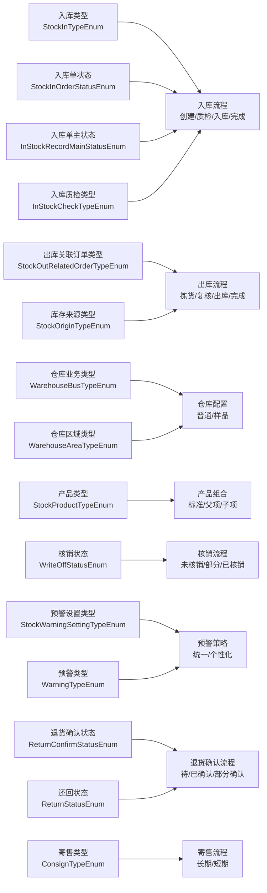
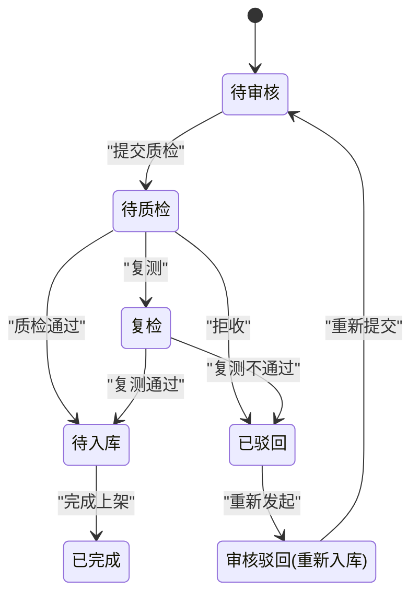
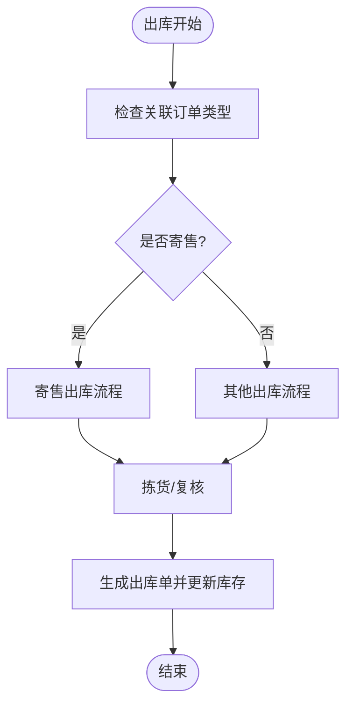
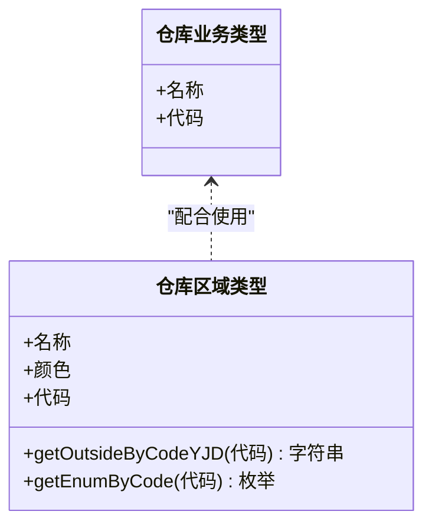
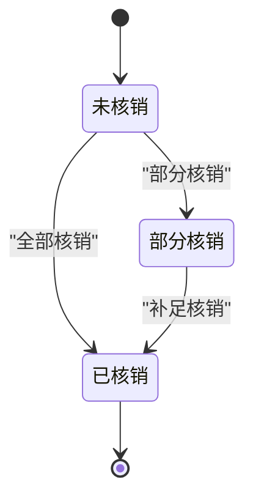
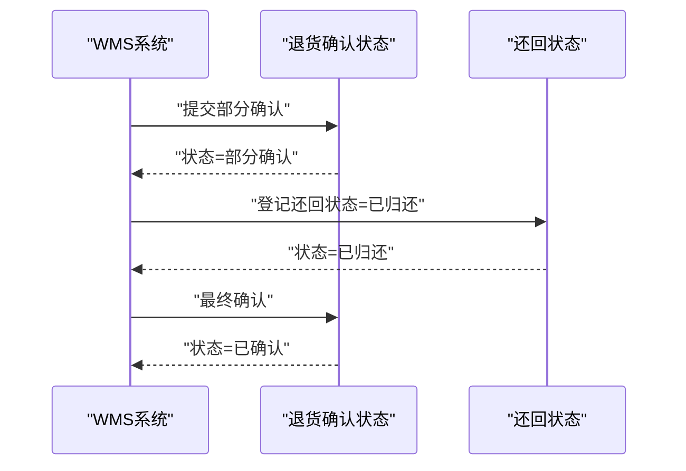
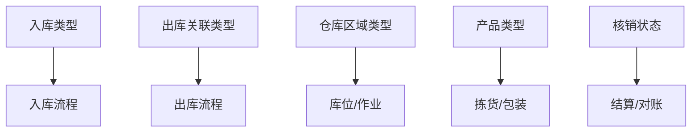

# 业务规则模型

<cite>
**本文引用的文件**
- [StockInTypeEnum.java](file://guoke-deepexi-storage-center-api/src/main/java/com/deepexi/api/storage/enums/in/StockInTypeEnum.java)
- [StockInOrderStatusEnum.java](file://guoke-deepexi-storage-center-api/src/main/java/com/deepexi/api/storage/enums/in/StockInOrderStatusEnum.java)
- [InStockRecordMainStatusEnum.java](file://guoke-deepexi-storage-center-api/src/main/java/com/deepexi/api/storage/enums/in/InStockRecordMainStatusEnum.java)
- [InStockCheckTypeEnum.java](file://guoke-deepexi-storage-center-api/src/main/java/com/deepexi/api/storage/enums/in/InStockCheckTypeEnum.java)
- [StockOutRelatedOrderTypeEnum.java](file://guoke-deepexi-storage-center-api/src/main/java/com/deepexi/api/storage/enums/StockOutRelatedOrderTypeEnum.java)
- [StockOriginTypeEnum.java](file://guoke-deepexi-storage-center-api/src/main/java/com/deepexi/api/storage/enums/StockOriginTypeEnum.java)
- [StockLogStatusEnum.java](file://guoke-deepexi-storage-center-api/src/main/java/com/deepexi/api/storage/enums/StockLogStatusEnum.java)
- [WarehouseBusTypeEnum.java](file://guoke-deepexi-storage-center-api/src/main/java/com/deepexi/api/storage/enums/WarehouseBusTypeEnum.java)
- [WarehouseAreaTypeEnum.java](file://guoke-deepexi-storage-center-api/src/main/java/com/deepexi/api/storage/enums/WarehouseAreaTypeEnum.java)
- [StockProductTypeEnum.java](file://guoke-deepexi-storage-center-api/src/main/java/com/deepexi/api/storage/enums/StockProductTypeEnum.java)
- [ReturnStatusEnum.java](file://guoke-deepexi-storage-center-api/src/main/java/com/deepexi/api/storage/enums/returnConfirm/ReturnStatusEnum.java)
- [ReturnConfirmStatusEnum.java](file://guoke-deepexi-storage-center-api/src/main/java/com/deepexi/api/storage/enums/returnConfirm/ReturnConfirmStatusEnum.java)
- [StockWarningSettingTypeEnum.java](file://guoke-deepexi-storage-center-api/src/main/java/com/deepexi/api/storage/enums/StockWarningSettingTypeEnum.java)
- [WarningTypeEnum.java](file://guoke-deepexi-storage-center-api/src/main/java/com/deepexi/api/storage/enums/WarningTypeEnum.java)
- [WriteOffStatusEnum.java](file://guoke-deepexi-storage-center-api/src/main/java/com/deepexi/api/storage/enums/WriteOffStatusEnum.java)
- [ConsignTypeEnum.java](file://guoke-deepexi-storage-center-api/src/main/java/com/deepexi/api/storage/enums/ConsignTypeEnum.java)
</cite>

## 目录
1. [引言](#引言)
2. [项目结构](#项目结构)
3. [核心组件](#核心组件)
4. [架构总览](#架构总览)
5. [详细组件分析](#详细组件分析)
6. [依赖分析](#依赖分析)
7. [性能考虑](#性能考虑)
8. [故障排查指南](#故障排查指南)
9. [结论](#结论)
10. [附录](#附录)

## 引言
本文件面向国科恒泰仓储管理系统，聚焦于业务规则模型中的“业务枚举”体系，系统性梳理并解释以下内容：
- 各类业务枚举的定义与业务含义
- 库存操作类型、出入库状态、仓库类型等关键业务规则
- 业务规则的验证逻辑与执行顺序
- 状态机与流程图（基于代码行为抽象）
- 扩展性与定制化支持
- 版本管理与兼容性处理建议

## 项目结构
本项目的业务规则模型主要分布在 API 层的枚举目录中，按功能域划分清晰：入库(in)、出库(out)、退货确认(returnConfirm)、通用仓储(common)等。这些枚举作为系统内各模块间契约的基础数据结构，贯穿于订单、库存、质检、预警、核销、寄售等多个业务环节。

```mermaid
graph TB
subgraph "API 枚举层"
A["in 包<br/>入库相关枚举"]
B["out 包<br/>出库相关枚举"]
C["returnConfirm 包<br/>退货确认相关枚举"]
D["common 包<br/>通用仓储枚举"]
end
A --> A1["StockInTypeEnum<br/>入库通知单类型"]
A --> A2["StockInOrderStatusEnum<br/>入库通知单状态"]
A --> A3["InStockRecordMainStatusEnum<br/>入库单主状态"]
A --> A4["InStockCheckTypeEnum<br/>入库质检结果类型"]
D --> D1["StockOutRelatedOrderTypeEnum<br/>出库关联订单类型"]
D --> D2["StockOriginTypeEnum<br/>库存来源类型"]
D --> D3["StockLogStatusEnum<br/>库存日志状态"]
D --> D4["WarehouseBusTypeEnum<br/>仓库业务类型"]
D --> D5["WarehouseAreaTypeEnum<br/>仓库区域类型"]
D --> D6["StockProductTypeEnum<br/>产品类型"]
D --> D7["StockWarningSettingTypeEnum<br/>预警设置类型"]
D --> D8["WarningTypeEnum<br/>预警类型"]
D --> D9["WriteOffStatusEnum<br/>核销状态"]
D --> D10["ConsignTypeEnum<br/>寄售类型"]
```

图表来源
- [StockInTypeEnum.java:1-54](file://guoke-deepexi-storage-center-api/src/main/java/com/deepexi/api/storage/enums/in/StockInTypeEnum.java#L1-L54)
- [StockInOrderStatusEnum.java:1-41](file://guoke-deepexi-storage-center-api/src/main/java/com/deepexi/api/storage/enums/in/StockInOrderStatusEnum.java#L1-L41)
- [InStockRecordMainStatusEnum.java:1-36](file://guoke-deepexi-storage-center-api/src/main/java/com/deepexi/api/storage/enums/in/InStockRecordMainStatusEnum.java#L1-L36)
- [InStockCheckTypeEnum.java:1-25](file://guoke-deepexi-storage-center-api/src/main/java/com/deepexi/api/storage/enums/in/InStockCheckTypeEnum.java#L1-L25)
- [StockOutRelatedOrderTypeEnum.java:1-43](file://guoke-deepexi-storage-center-api/src/main/java/com/deepexi/api/storage/enums/StockOutRelatedOrderTypeEnum.java#L1-L43)
- [StockOriginTypeEnum.java:1-20](file://guoke-deepexi-storage-center-api/src/main/java/com/deepexi/api/storage/enums/StockOriginTypeEnum.java#L1-L20)
- [StockLogStatusEnum.java:1-23](file://guoke-deepexi-storage-center-api/src/main/java/com/deepexi/api/storage/enums/StockLogStatusEnum.java#L1-L23)
- [WarehouseBusTypeEnum.java:1-20](file://guoke-deepexi-storage-center-api/src/main/java/com/deepexi/api/storage/enums/WarehouseBusTypeEnum.java#L1-L20)
- [WarehouseAreaTypeEnum.java:1-69](file://guoke-deepexi-storage-center-api/src/main/java/com/deepexi/api/storage/enums/WarehouseAreaTypeEnum.java#L1-L69)
- [StockProductTypeEnum.java:1-23](file://guoke-deepexi-storage-center-api/src/main/java/com/deepexi/api/storage/enums/StockProductTypeEnum.java#L1-L23)
- [StockWarningSettingTypeEnum.java:1-17](file://guoke-deepexi-storage-center-api/src/main/java/com/deepexi/api/storage/enums/StockWarningSettingTypeEnum.java#L1-L17)
- [WarningTypeEnum.java:1-33](file://guoke-deepexi-storage-center-api/src/main/java/com/deepexi/api/storage/enums/WarningTypeEnum.java#L1-L33)
- [WriteOffStatusEnum.java:1-24](file://guoke-deepexi-storage-center-api/src/main/java/com/deepexi/api/storage/enums/WriteOffStatusEnum.java#L1-L24)
- [ConsignTypeEnum.java:1-34](file://guoke-deepexi-storage-center-api/src/main/java/com/deepexi/api/storage/enums/ConsignTypeEnum.java#L1-L34)

章节来源
- [StockInTypeEnum.java:1-54](file://guoke-deepexi-storage-center-api/src/main/java/com/deepexi/api/storage/enums/in/StockInTypeEnum.java#L1-L54)
- [StockInOrderStatusEnum.java:1-41](file://guoke-deepexi-storage-center-api/src/main/java/com/deepexi/api/storage/enums/in/StockInOrderStatusEnum.java#L1-L41)
- [InStockRecordMainStatusEnum.java:1-36](file://guoke-deepexi-storage-center-api/src/main/java/com/deepexi/api/storage/enums/in/InStockRecordMainStatusEnum.java#L1-L36)
- [InStockCheckTypeEnum.java:1-25](file://guoke-deepexi-storage-center-api/src/main/java/com/deepexi/api/storage/enums/in/InStockCheckTypeEnum.java#L1-L25)
- [StockOutRelatedOrderTypeEnum.java:1-43](file://guoke-deepexi-storage-center-api/src/main/java/com/deepexi/api/storage/enums/StockOutRelatedOrderTypeEnum.java#L1-L43)
- [StockOriginTypeEnum.java:1-20](file://guoke-deepexi-storage-center-api/src/main/java/com/deepexi/api/storage/enums/StockOriginTypeEnum.java#L1-L20)
- [StockLogStatusEnum.java:1-23](file://guoke-deepexi-storage-center-api/src/main/java/com/deepexi/api/storage/enums/StockLogStatusEnum.java#L1-L23)
- [WarehouseBusTypeEnum.java:1-20](file://guoke-deepexi-storage-center-api/src/main/java/com/deepexi/api/storage/enums/WarehouseBusTypeEnum.java#L1-L20)
- [WarehouseAreaTypeEnum.java:1-69](file://guoke-deepexi-storage-center-api/src/main/java/com/deepexi/api/storage/enums/WarehouseAreaTypeEnum.java#L1-L69)
- [StockProductTypeEnum.java:1-23](file://guoke-deepexi-storage-center-api/src/main/java/com/deepexi/api/storage/enums/StockProductTypeEnum.java#L1-L23)
- [StockWarningSettingTypeEnum.java:1-17](file://guoke-deepexi-storage-center-api/src/main/java/com/deepexi/api/storage/enums/StockWarningSettingTypeEnum.java#L1-L17)
- [WarningTypeEnum.java:1-33](file://guoke-deepexi-storage-center-api/src/main/java/com/deepexi/api/storage/enums/WarningTypeEnum.java#L1-L33)
- [WriteOffStatusEnum.java:1-24](file://guoke-deepexi-storage-center-api/src/main/java/com/deepexi/api/storage/enums/WriteOffStatusEnum.java#L1-L24)
- [ConsignTypeEnum.java:1-34](file://guoke-deepexi-storage-center-api/src/main/java/com/deepexi/api/storage/enums/ConsignTypeEnum.java#L1-L34)

## 核心组件
本节对关键业务枚举进行分类与要点说明，帮助快速理解系统中的业务规则边界与流转条件。

- 入库相关
  - 入库通知单类型：用于标识入库通知单的业务来源或形态，如采购入库、销售退回入库、其它入库、冲红入库、样品入库、1+2模式入库、T3入库、拒收入库等。
  - 入库通知单状态：覆盖从创建到完成的全生命周期状态，包括待审核、待质检、复检、待入库、待审核、已完成、已驳回等。
  - 入库单主状态：入库单主表状态，包括待审核、审核通过、审核驳回、审核驳回(重新入库)等。
  - 入库质检结果类型：入库质检的处置动作，如入库、塑封、封存、换盒、报废、清包灭、复测、拒收等。

- 出库相关
  - 出库关联订单类型：描述出库单所关联的主要订单类型，如寄售、批发、跟台、补货、其他等。
  - 库存来源类型：区分库存变动来源于“出库”还是“入库”，便于统计与对账。

- 仓库与区域
  - 仓库业务类型：区分普通仓库与样品仓库。
  - 仓库区域类型：以颜色与区域名称标识不同作业区，如合格品区、待验区、不合格品区、发货区、退货区、召回区，并提供与外部系统的映射方法。

- 产品与核销
  - 产品类型：标准产品、组套父项、组套子项，用于区分产品组合关系。
  - 核销状态：全部、未核销、部分核销、已核销，用于核销流程控制。

- 预警与确认
  - 预警设置类型：仓库统一设置或个性化设置。
  - 预警类型：效期预警、库龄预警。
  - 退货确认状态：待确认、已确认、已出库(第二次关联出库)、部分确认。
  - 还回状态：已消耗、已归还、未归还。
  - 寄售类型：长期、短期。

- 日志与来源
  - 库存日志状态：锁定、已消耗、已取消，用于库存占用与消耗追踪。

章节来源
- [StockInTypeEnum.java:1-54](file://guoke-deepexi-storage-center-api/src/main/java/com/deepexi/api/storage/enums/in/StockInTypeEnum.java#L1-L54)
- [StockInOrderStatusEnum.java:1-41](file://guoke-deepexi-storage-center-api/src/main/java/com/deepexi/api/storage/enums/in/StockInOrderStatusEnum.java#L1-L41)
- [InStockRecordMainStatusEnum.java:1-36](file://guoke-deepexi-storage-center-api/src/main/java/com/deepexi/api/storage/enums/in/InStockRecordMainStatusEnum.java#L1-L36)
- [InStockCheckTypeEnum.java:1-25](file://guoke-deepexi-storage-center-api/src/main/java/com/deepexi/api/storage/enums/in/InStockCheckTypeEnum.java#L1-L25)
- [StockOutRelatedOrderTypeEnum.java:1-43](file://guoke-deepexi-storage-center-api/src/main/java/com/deepexi/api/storage/enums/StockOutRelatedOrderTypeEnum.java#L1-L43)
- [StockOriginTypeEnum.java:1-20](file://guoke-deepexi-storage-center-api/src/main/java/com/deepexi/api/storage/enums/StockOriginTypeEnum.java#L1-L20)
- [StockLogStatusEnum.java:1-23](file://guoke-deepexi-storage-center-api/src/main/java/com/deepexi/api/storage/enums/StockLogStatusEnum.java#L1-L23)
- [WarehouseBusTypeEnum.java:1-20](file://guoke-deepexi-storage-center-api/src/main/java/com/deepexi/api/storage/enums/WarehouseBusTypeEnum.java#L1-L20)
- [WarehouseAreaTypeEnum.java:1-69](file://guoke-deepexi-storage-center-api/src/main/java/com/deepexi/api/storage/enums/WarehouseAreaTypeEnum.java#L1-L69)
- [StockProductTypeEnum.java:1-23](file://guoke-deepexi-storage-center-api/src/main/java/com/deepexi/api/storage/enums/StockProductTypeEnum.java#L1-L23)
- [StockWarningSettingTypeEnum.java:1-17](file://guoke-deepexi-storage-center-api/src/main/java/com/deepexi/api/storage/enums/StockWarningSettingTypeEnum.java#L1-L17)
- [WarningTypeEnum.java:1-33](file://guoke-deepexi-storage-center-api/src/main/java/com/deepexi/api/storage/enums/WarningTypeEnum.java#L1-L33)
- [WriteOffStatusEnum.java:1-24](file://guoke-deepexi-storage-center-api/src/main/java/com/deepexi/api/storage/enums/WriteOffStatusEnum.java#L1-L24)
- [ReturnStatusEnum.java:1-21](file://guoke-deepexi-storage-center-api/src/main/java/com/deepexi/api/storage/enums/returnConfirm/ReturnStatusEnum.java#L1-L21)
- [ReturnConfirmStatusEnum.java:1-22](file://guoke-deepexi-storage-center-api/src/main/java/com/deepexi/api/storage/enums/returnConfirm/ReturnConfirmStatusEnum.java#L1-L22)
- [ConsignTypeEnum.java:1-34](file://guoke-deepexi-storage-center-api/src/main/java/com/deepexi/api/storage/enums/ConsignTypeEnum.java#L1-L34)

## 架构总览
业务规则模型在系统中的作用可概括为：
- 统一语义：通过枚举定义明确的业务含义，避免字符串魔法数与歧义。
- 流程约束：以状态枚举约束业务流程的合法转换路径。
- 外部集成：通过映射方法（如仓库区域对外编码）对接第三方系统。
- 可扩展：新增枚举值需遵循命名规范与兼容策略，确保向后兼容。

图表来源
- [StockInTypeEnum.java:1-54](file://guoke-deepexi-storage-center-api/src/main/java/com/deepexi/api/storage/enums/in/StockInTypeEnum.java#L1-L54)
- [StockInOrderStatusEnum.java:1-41](file://guoke-deepexi-storage-center-api/src/main/java/com/deepexi/api/storage/enums/in/StockInOrderStatusEnum.java#L1-L41)
- [InStockRecordMainStatusEnum.java:1-36](file://guoke-deepexi-storage-center-api/src/main/java/com/deepexi/api/storage/enums/in/InStockRecordMainStatusEnum.java#L1-L36)
- [InStockCheckTypeEnum.java:1-25](file://guoke-deepexi-storage-center-api/src/main/java/com/deepexi/api/storage/enums/in/InStockCheckTypeEnum.java#L1-L25)
- [StockOutRelatedOrderTypeEnum.java:1-43](file://guoke-deepexi-storage-center-api/src/main/java/com/deepexi/api/storage/enums/StockOutRelatedOrderTypeEnum.java#L1-L43)
- [StockOriginTypeEnum.java:1-20](file://guoke-deepexi-storage-center-api/src/main/java/com/deepexi/api/storage/enums/StockOriginTypeEnum.java#L1-L20)
- [WarehouseBusTypeEnum.java:1-20](file://guoke-deepexi-storage-center-api/src/main/java/com/deepexi/api/storage/enums/WarehouseBusTypeEnum.java#L1-L20)
- [WarehouseAreaTypeEnum.java:1-69](file://guoke-deepexi-storage-center-api/src/main/java/com/deepexi/api/storage/enums/WarehouseAreaTypeEnum.java#L1-L69)
- [StockProductTypeEnum.java:1-23](file://guoke-deepexi-storage-center-api/src/main/java/com/deepexi/api/storage/enums/StockProductTypeEnum.java#L1-L23)
- [WriteOffStatusEnum.java:1-24](file://guoke-deepexi-storage-center-api/src/main/java/com/deepexi/api/storage/enums/WriteOffStatusEnum.java#L1-L24)
- [StockWarningSettingTypeEnum.java:1-17](file://guoke-deepexi-storage-center-api/src/main/java/com/deepexi/api/storage/enums/StockWarningSettingTypeEnum.java#L1-L17)
- [WarningTypeEnum.java:1-33](file://guoke-deepexi-storage-center-api/src/main/java/com/deepexi/api/storage/enums/WarningTypeEnum.java#L1-L33)
- [ReturnConfirmStatusEnum.java:1-22](file://guoke-deepexi-storage-center-api/src/main/java/com/deepexi/api/storage/enums/returnConfirm/ReturnConfirmStatusEnum.java#L1-L22)
- [ReturnStatusEnum.java:1-21](file://guoke-deepexi-storage-center-api/src/main/java/com/deepexi/api/storage/enums/returnConfirm/ReturnStatusEnum.java#L1-L21)
- [ConsignTypeEnum.java:1-34](file://guoke-deepexi-storage-center-api/src/main/java/com/deepexi/api/storage/enums/ConsignTypeEnum.java#L1-L34)

## 详细组件分析

### 入库业务规则
- 入库通知单类型（StockInTypeEnum）
  - 业务含义：标识入库通知单的业务来源或形态，支撑不同业务场景下的入库流程差异。
  - 使用场景：创建入库通知单时选择类型；与财务、采购、销售等系统对接时作为识别字段。
  - 关键点：提供按 code 获取枚举与名称的方法，便于前端展示与后端匹配。

- 入库通知单状态（StockInOrderStatusEnum）
  - 业务含义：覆盖从创建到完成的全生命周期状态，含待审核、待质检、复检、待入库、待审核、已完成、已驳回等。
  - 使用场景：驱动工作流引擎或前端状态展示；作为审批与质检节点的触发条件。
  - 关键点：状态码与名称一一对应，提供按 code 查询名称的工具方法。

- 入库单主状态（InStockRecordMainStatusEnum）
  - 业务含义：入库单主表状态，包括待审核、审核通过、审核驳回、审核驳回(重新入库)等。
  - 使用场景：入库单主表状态变更，决定是否允许生成明细与执行入库上架。
  - 关键点：提供按 value 查询名称的工具方法，便于日志与报表展示。

- 入库质检结果类型（InStockCheckTypeEnum）
  - 业务含义：入库质检的处置动作，如入库、塑封、封存、换盒、报废、清包灭、复测、拒收等。
  - 使用场景：质检环节完成后，根据结果类型决定后续流程（如直接入库、隔离、报废等）。
  - 关键点：名称即中文描述，便于直接展示。

图表来源
- [StockInOrderStatusEnum.java:1-41](file://guoke-deepexi-storage-center-api/src/main/java/com/deepexi/api/storage/enums/in/StockInOrderStatusEnum.java#L1-L41)
- [InStockRecordMainStatusEnum.java:1-36](file://guoke-deepexi-storage-center-api/src/main/java/com/deepexi/api/storage/enums/in/InStockRecordMainStatusEnum.java#L1-L36)
- [InStockCheckTypeEnum.java:1-25](file://guoke-deepexi-storage-center-api/src/main/java/com/deepexi/api/storage/enums/in/InStockCheckTypeEnum.java#L1-L25)

章节来源
- [StockInTypeEnum.java:1-54](file://guoke-deepexi-storage-center-api/src/main/java/com/deepexi/api/storage/enums/in/StockInTypeEnum.java#L1-L54)
- [StockInOrderStatusEnum.java:1-41](file://guoke-deepexi-storage-center-api/src/main/java/com/deepexi/api/storage/enums/in/StockInOrderStatusEnum.java#L1-L41)
- [InStockRecordMainStatusEnum.java:1-36](file://guoke-deepexi-storage-center-api/src/main/java/com/deepexi/api/storage/enums/in/InStockRecordMainStatusEnum.java#L1-L36)
- [InStockCheckTypeEnum.java:1-25](file://guoke-deepexi-storage-center-api/src/main/java/com/deepexi/api/storage/enums/in/InStockCheckTypeEnum.java#L1-L25)

### 出库与关联订单规则
- 出库关联订单类型（StockOutRelatedOrderTypeEnum）
  - 业务含义：描述出库单所关联的主要订单类型，如寄售、批发、跟台、补货、其他等。
  - 使用场景：出库流程中区分不同业务来源，影响拣货策略与复核要求。
  - 关键点：提供按 value 获取枚举的方法，便于系统内部匹配。

- 库存来源类型（StockOriginTypeEnum）
  - 业务含义：区分库存变动来源于“出库”还是“入库”，便于统计与对账。
  - 使用场景：库存流水、报表、对账单的数据来源标记。
  - 关键点：简洁明了的双值枚举，便于条件判断。

图表来源
- [StockOutRelatedOrderTypeEnum.java:1-43](file://guoke-deepexi-storage-center-api/src/main/java/com/deepexi/api/storage/enums/StockOutRelatedOrderTypeEnum.java#L1-L43)
- [StockOriginTypeEnum.java:1-20](file://guoke-deepexi-storage-center-api/src/main/java/com/deepexi/api/storage/enums/StockOriginTypeEnum.java#L1-L20)

章节来源
- [StockOutRelatedOrderTypeEnum.java:1-43](file://guoke-deepexi-storage-center-api/src/main/java/com/deepexi/api/storage/enums/StockOutRelatedOrderTypeEnum.java#L1-L43)
- [StockOriginTypeEnum.java:1-20](file://guoke-deepexi-storage-center-api/src/main/java/com/deepexi/api/storage/enums/StockOriginTypeEnum.java#L1-L20)

### 仓库与区域规则
- 仓库业务类型（WarehouseBusTypeEnum）
  - 业务含义：区分普通仓库与样品仓库，用于权限与流程差异化控制。
  - 使用场景：权限校验、作业指导、WMS对接。
  - 关键点：简单枚举，便于条件分支。

- 仓库区域类型（WarehouseAreaTypeEnum）
  - 业务含义：以颜色与区域名称标识不同作业区，如合格品区、待验区、不合格品区、发货区、退货区、召回区。
  - 使用场景：库位分配、作业指引、可视化看板。
  - 关键点：提供与外部系统的映射方法（如 YJD 外部编码），便于集成。

图表来源
- [WarehouseBusTypeEnum.java:1-20](file://guoke-deepexi-storage-center-api/src/main/java/com/deepexi/api/storage/enums/WarehouseBusTypeEnum.java#L1-L20)
- [WarehouseAreaTypeEnum.java:1-69](file://guoke-deepexi-storage-center-api/src/main/java/com/deepexi/api/storage/enums/WarehouseAreaTypeEnum.java#L1-L69)

章节来源
- [WarehouseBusTypeEnum.java:1-20](file://guoke-deepexi-storage-center-api/src/main/java/com/deepexi/api/storage/enums/WarehouseBusTypeEnum.java#L1-L20)
- [WarehouseAreaTypeEnum.java:1-69](file://guoke-deepexi-storage-center-api/src/main/java/com/deepexi/api/storage/enums/WarehouseAreaTypeEnum.java#L1-L69)

### 产品与核销规则
- 产品类型（StockProductTypeEnum）
  - 业务含义：标准产品、组套父项、组套子项，用于区分产品组合关系。
  - 使用场景：拣货策略、包装规则、价格计算。
  - 关键点：代码与名称分离，便于系统内部与展示层使用。

- 核销状态（WriteOffStatusEnum）
  - 业务含义：全部、未核销、部分核销、已核销，用于核销流程控制。
  - 使用场景：结算、对账、财务入账。
  - 关键点：数值型状态便于排序与比较。

图表来源
- [StockProductTypeEnum.java:1-23](file://guoke-deepexi-storage-center-api/src/main/java/com/deepexi/api/storage/enums/StockProductTypeEnum.java#L1-L23)
- [WriteOffStatusEnum.java:1-24](file://guoke-deepexi-storage-center-api/src/main/java/com/deepexi/api/storage/enums/WriteOffStatusEnum.java#L1-L24)

章节来源
- [StockProductTypeEnum.java:1-23](file://guoke-deepexi-storage-center-api/src/main/java/com/deepexi/api/storage/enums/StockProductTypeEnum.java#L1-L23)
- [WriteOffStatusEnum.java:1-24](file://guoke-deepexi-storage-center-api/src/main/java/com/deepexi/api/storage/enums/WriteOffStatusEnum.java#L1-L24)

### 预警与确认规则
- 预警设置类型（StockWarningSettingTypeEnum）
  - 业务含义：仓库统一设置或个性化设置，决定预警策略的优先级。
  - 使用场景：预警策略下发与覆盖。
  - 关键点：数值型代码便于策略合并。

- 预警类型（WarningTypeEnum）
  - 业务含义：效期预警、库龄预警，区分不同预警维度。
  - 使用场景：生成预警任务与提醒。
  - 关键点：提供按 value 查询名称的工具方法。

- 退货确认状态（ReturnConfirmStatusEnum）
  - 业务含义：待确认、已确认、已出库(第二次关联出库)、部分确认。
  - 使用场景：WMS 分批确认消耗的流程控制。
  - 关键点：数值型 code 与中文描述并存，便于前端展示。

- 还回状态（ReturnStatusEnum）
  - 业务含义：已消耗、已归还、未归还。
  - 使用场景：消耗还回流程的状态标记。
  - 关键点：整型 code 便于排序与筛选。

- 寄售类型（ConsignTypeEnum）
  - 业务含义：长期、短期，用于寄售业务的期限管理。
  - 使用场景：寄售协议与到期提醒。
  - 关键点：提供按 value 获取名称的工具方法，默认返回长期。

图表来源
- [ReturnConfirmStatusEnum.java:1-22](file://guoke-deepexi-storage-center-api/src/main/java/com/deepexi/api/storage/enums/returnConfirm/ReturnConfirmStatusEnum.java#L1-L22)
- [ReturnStatusEnum.java:1-21](file://guoke-deepexi-storage-center-api/src/main/java/com/deepexi/api/storage/enums/returnConfirm/ReturnStatusEnum.java#L1-L21)
- [ConsignTypeEnum.java:1-34](file://guoke-deepexi-storage-center-api/src/main/java/com/deepexi/api/storage/enums/ConsignTypeEnum.java#L1-L34)

章节来源
- [StockWarningSettingTypeEnum.java:1-17](file://guoke-deepexi-storage-center-api/src/main/java/com/deepexi/api/storage/enums/StockWarningSettingTypeEnum.java#L1-L17)
- [WarningTypeEnum.java:1-33](file://guoke-deepexi-storage-center-api/src/main/java/com/deepexi/api/storage/enums/WarningTypeEnum.java#L1-L33)
- [ReturnConfirmStatusEnum.java:1-22](file://guoke-deepexi-storage-center-api/src/main/java/com/deepexi/api/storage/enums/returnConfirm/ReturnConfirmStatusEnum.java#L1-L22)
- [ReturnStatusEnum.java:1-21](file://guoke-deepexi-storage-center-api/src/main/java/com/deepexi/api/storage/enums/returnConfirm/ReturnStatusEnum.java#L1-L21)
- [ConsignTypeEnum.java:1-34](file://guoke-deepexi-storage-center-api/src/main/java/com/deepexi/api/storage/enums/ConsignTypeEnum.java#L1-L34)

### 日志与来源规则
- 库存日志状态（StockLogStatusEnum）
  - 业务含义：锁定、已消耗、已取消，用于库存占用与消耗追踪。
  - 使用场景：库存冻结、消耗核销、异常处理。
  - 关键点：数值型状态便于排序与比较。

章节来源
- [StockLogStatusEnum.java:1-23](file://guoke-deepexi-storage-center-api/src/main/java/com/deepexi/api/storage/enums/StockLogStatusEnum.java#L1-L23)

## 依赖分析
- 内聚性：各枚举按业务域划分，内聚度高，职责单一。
- 耦合性：枚举之间无直接依赖，仅通过业务语义间接耦合（如“来源类型”与“出入库”）。
- 外部依赖：仓库区域类型提供外部系统映射方法，体现与第三方系统的集成接口。
- 可能的循环依赖：当前枚举间无循环导入风险。

图表来源
- [StockInTypeEnum.java:1-54](file://guoke-deepexi-storage-center-api/src/main/java/com/deepexi/api/storage/enums/in/StockInTypeEnum.java#L1-L54)
- [StockOutRelatedOrderTypeEnum.java:1-43](file://guoke-deepexi-storage-center-api/src/main/java/com/deepexi/api/storage/enums/StockOutRelatedOrderTypeEnum.java#L1-L43)
- [WarehouseAreaTypeEnum.java:1-69](file://guoke-deepexi-storage-center-api/src/main/java/com/deepexi/api/storage/enums/WarehouseAreaTypeEnum.java#L1-L69)
- [StockProductTypeEnum.java:1-23](file://guoke-deepexi-storage-center-api/src/main/java/com/deepexi/api/storage/enums/StockProductTypeEnum.java#L1-L23)
- [WriteOffStatusEnum.java:1-24](file://guoke-deepexi-storage-center-api/src/main/java/com/deepexi/api/storage/enums/WriteOffStatusEnum.java#L1-L24)

## 性能考虑
- 枚举查询：多数枚举提供按 code/value 获取名称或枚举的方法，时间复杂度为 O(n)（n 为枚举数量）。由于枚举规模较小，通常可忽略。
- 建议：若频繁按 code/value 查询，可在服务层引入缓存（如 Map 缓存）以降低重复遍历成本。

## 故障排查指南
- 状态不一致：当发现状态流转异常，应检查对应状态枚举的定义与业务流程约束，确认是否存在非法状态跳转。
- 类型不匹配：入库/出库类型不正确会导致流程错误，应核对类型枚举与调用方传参。
- 外部映射失败：仓库区域类型提供外部映射方法，若对接第三方系统失败，应检查映射逻辑与外部编码规则。
- 核销状态异常：核销状态变更需严格遵循“未核销→部分核销→已核销”的顺序，异常状态需回溯核销日志。

## 结论
本业务规则模型通过清晰的枚举定义与合理的业务语义，为入库、出库、退货确认、核销、预警、寄售等核心流程提供了稳定且可扩展的规则基础。建议在后续迭代中：
- 明确新增枚举值的审批与兼容策略
- 对高频查询的枚举增加缓存
- 在接口层统一暴露枚举名称与代码，减少业务层硬编码

## 附录
- 版本管理与兼容性建议
  - 新增枚举值：必须提供默认值与兼容方法，避免破坏既有逻辑。
  - 枚举重命名/删除：禁止破坏性变更；如确需变更，应提供迁移脚本与过渡期策略。
  - 外部映射：对外部编码的映射方法应保持向后兼容，新增映射需标注版本。
  - 文档同步：每次变更需同步更新业务规则文档与接口文档。