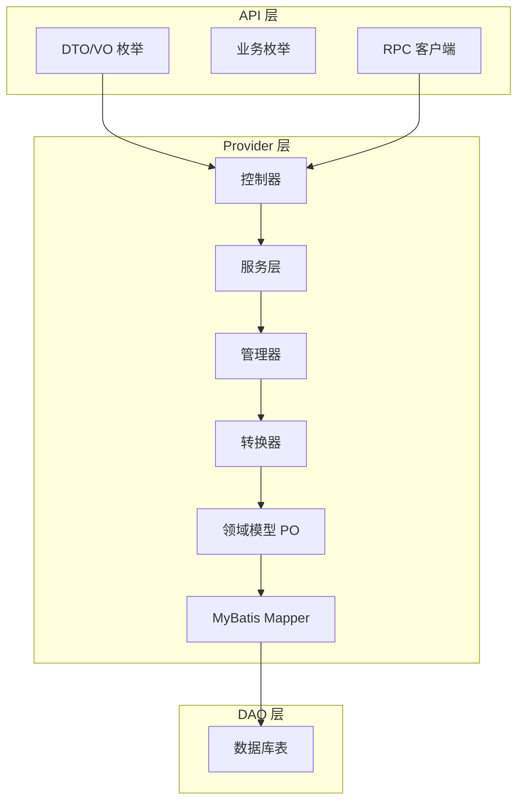
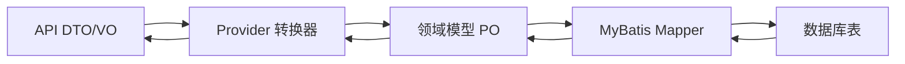
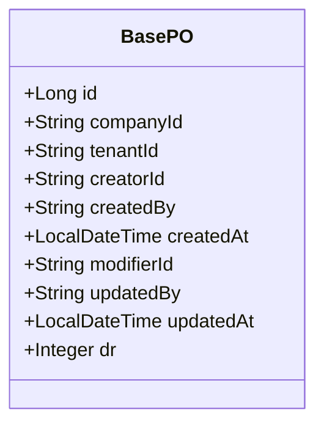
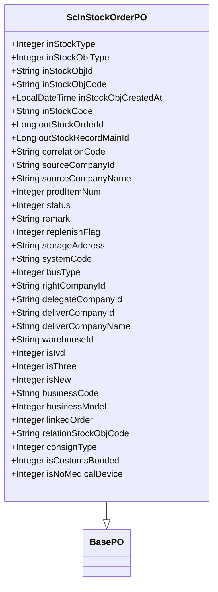
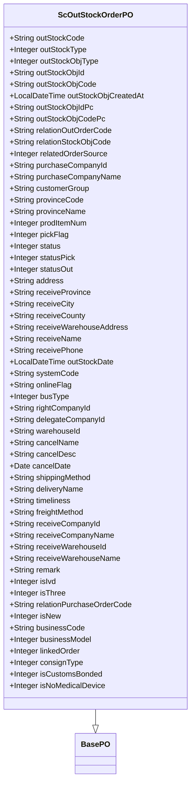
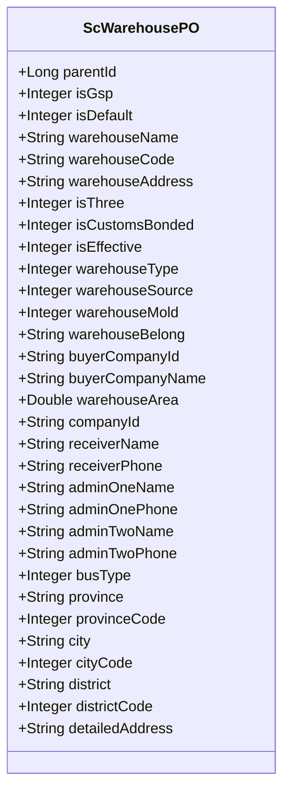
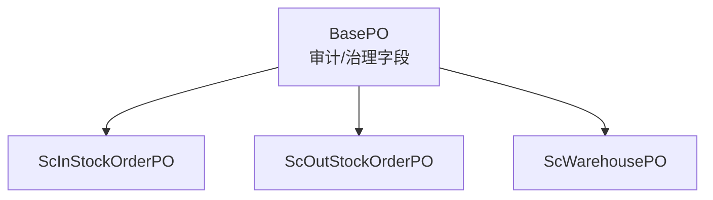

# 字段定义规范

<cite>
**本文引用的文件**
- [BasePO.java](file://guoke-deepexi-storage-center-provider/src/main/java/com/ deepexi/storage/model/BasePO.java)
- [ScInStockOrderPO.java](file://guoke-deepexi-storage-center-provider/src/main/java/com/ deepexi/storage/model/ScInStockOrderPO.java)
- [ScOutStockOrderPO.java](file://guoke-deepexi-storage-center-provider/src/main/java/com/ deepexi/storage/model/ScOutStockOrderPO.java)
- [ScWarehousePO.java](file://guoke-deepexi-storage-center-provider/src/main/java/com/ deepexi/storage/model/ScWarehousePO.java)
</cite>

## 目录
1. [引言](#引言)
2. [项目结构](#项目结构)
3. [核心组件](#核心组件)
4. [架构总览](#架构总览)
5. [详细组件分析](#详细组件分析)
6. [依赖关系分析](#依赖关系分析)
7. [性能考量](#性能考量)
8. [故障排查指南](#故障排查指南)
9. [结论](#结论)
10. [附录](#附录)

## 引言
本规范面向国科恒泰仓储管理系统，旨在统一与规范实体类字段的定义，明确字段的业务含义、数据类型、取值范围、默认值与空值处理策略、国际化与本地化规则、敏感数据保护与加密存储策略，以及版本兼容性与迁移规则。通过对基础PO与关键业务PO的字段梳理，形成可执行、可追溯、可演进的字段定义标准。

## 项目结构
系统采用分层+领域模型的组织方式：
- API 层：提供对外 DTO、枚举与 RPC 客户端，用于接口契约与数据传输。
- Provider 层：实现业务逻辑，包含控制器、服务、管理器、转换器、持久层 Mapper 与领域模型 PO。
- DAO 层：MyBatis Mapper 映射数据库表，PO 对应真实表结构。

[本图为概念性结构示意，不直接映射具体源码文件，故无“图示来源”]

## 核心组件
本节聚焦于仓储系统中的基础字段与关键业务实体字段，确保字段定义的一致性与可维护性。

- 基础字段（所有持久化实体共享）
  - id：主键，Long 类型，数据库自增。
  - companyId：所属公司 ID，String，租户上下文注入。
  - tenantId：租户 ID，String，默认插入时填充。
  - creatorId/createdBy：创建人 ID/名称，String，默认插入时填充。
  - createdAt：创建时间，LocalDateTime，默认插入时填充。
  - modifierId/updatedBy：修改人 ID/名称，String，默认插入/更新时填充。
  - updatedAt：修改时间，LocalDateTime，默认插入/更新时填充。
  - dr：逻辑删除标志，Integer，0 表示未删，1 表示已删，默认 0。

- 入库通知单（ScInStockOrderPO）
  - inStockType：入库类型，Integer，参考入库类型枚举。
  - inStockObjType：入库对象类型，Integer，参考入库对象类型枚举。
  - inStockObjId/inStockObjCode/inStockObjCreatedAt：上游单据关联信息与创建时间。
  - inStockCode：入库通知单编号。
  - outStockOrderId/outStockRecordMainId：关联上游出库通知单与出库主单。
  - correlationCode：外部关联单号。
  - sourceCompanyId/sourceCompanyName：供应商/采购商信息。
  - prodItemNum：品规数。
  - status：入库单状态，参考入库单状态枚举。
  - remark：备注。
  - replenishFlag：是否补货，0 否，1 是。
  - storageAddress：仓库地址。
  - systemCode：流程系统编码。
  - busType：业务类型。
  - rightCompanyId/delegateCompanyId：物权方/委托方。
  - deliverCompanyId/deliverCompanyName：发货方公司信息。
  - warehouseId：仓库 ID。
  - isIvd/isThree：是否冷链、是否三方。
  - isNew：新老数据标识。
  - businessCode/businessModel：业务线与业务模型。
  - linkedOrder：联台标识。
  - relationStockObjCode：关联外部出库通知单编号。
  - consignType：寄售类型，0 长期，1 短期。
  - isCustomsBonded：是否保税业务。
  - isNoMedicalDevice：是否非医疗器械业务。

- 出库通知单（ScOutStockOrderPO）
  - outStockCode：出库单编号。
  - outStockType：出库大类，参考出库类型枚举。
  - outStockObjType：出库对象类型，参考出库对象类型枚举。
  - outStockObjId/outStockObjCode/outStockObjCreatedAt：上游单据关联信息与创建时间。
  - outStockObjIdPc/outStockObjCodePc：采购方端显示的关联单编码。
  - relationOutOrderCode/relationStockObjCode：关联外部出库通知单号与外部系统订单号。
  - relatedOrderSource：关联订单来源。
  - purchaseCompanyId/purchaseCompanyName/customerGroup/provinceCode/provinceName：采购商信息与下单区域。
  - prodItemNum：品规数。
  - pickFlag：拣货单生成标记。
  - status/statusPick/statusOut：出库单状态、拣货状态、出库状态。
  - address/receiveProvince/receiveCity/receiveCounty/receiveWarehouseAddress：收货地址。
  - receiveName/receivePhone：收货人与联系电话。
  - outStockDate：出库时间。
  - systemCode：系统流程编码。
  - onlineFlag：联机标识。
  - busType：盘点业务类型。
  - rightCompanyId/delegateCompanyId：货主/委托方。
  - warehouseId：出库仓库 ID。
  - cancelName/cancelDesc/cancelDate：作废人、原因与时间。
  - shippingMethod/deliveryName/timeliness/freightMethod：承运方式、承运商、时效类型、运费承担方。
  - receiveCompanyId/receiveCompanyName/receiveWarehouseId/receiveWarehouseName：收货方与收货仓。
  - remark：备注。
  - isIvd/isThree：是否冷链、是否三方。
  - relationPurchaseOrderCode：外部关联原始采购单号。
  - isNew：新老数据标识。
  - businessCode/businessModel：业务线与业务模型。
  - linkedOrder：联台单标识。
  - consignType：寄售类型。
  - isCustomsBonded：是否保税业务。
  - isNoMedicalDevice：是否非医疗器械业务。

- 仓库（ScWarehousePO）
  - parentId：父仓库 ID。
  - isGsp：是否符合 GSP 规范，1 符合，0 不符合。
  - isDefault：默认仓库，0 否，1 是。
  - warehouseName/warehouseCode：仓库名称与编码。
  - warehouseAddress：仓库地址。
  - isThree：三方仓标识，0 否，1 是。
  - isCustomsBonded：保税仓标识，0 否，1 是。
  - isEffective：是否有效，0 停用，1 启用。
  - warehouseType：仓库类型（温度类型），参考仓库类型枚举。
  - warehouseSource：仓库来源（仓库属性），参考仓库来源枚举。
  - warehouseMold：虚拟仓类型，参考仓库模态枚举。
  - warehouseBelong：仓库所属（取自上下文）。
  - buyerCompanyId/buyerCompanyName：仓库所属公司信息。
  - warehouseArea：仓库面积，Double。
  - companyId：所属公司 ID（取自上下文）。
  - receiverName/receiverPhone：收货人与联系方式。
  - adminOneName/adminOnePhone/adminTwoName/adminTwoPhone：管理员信息。
  - busType：业务类型，如样品。
  - province/city/district/provinceCode/cityCode/districtCode：省市区与编码。
  - detailedAddress：详细地址。

**章节来源**
- [BasePO.java:1-80](file://guoke-deepexi-storage-center-provider/src/main/java/com/ deepexi/storage/model/BasePO.java#L1-L80)
- [ScInStockOrderPO.java:1-192](file://guoke-deepexi-storage-center-provider/src/main/java/com/ deepexi/storage/model/ScInStockOrderPO.java#L1-L192)
- [ScOutStockOrderPO.java:1-317](file://guoke-deepexi-storage-center-provider/src/main/java/com/ deepexi/storage/model/ScOutStockOrderPO.java#L1-L317)
- [ScWarehousePO.java:1-183](file://guoke-deepexi-storage-center-provider/src/main/java/com/ deepexi/storage/model/ScWarehousePO.java#L1-L183)

## 架构总览
字段定义贯穿 API、Provider、DAO 三层，遵循以下原则：
- 字段命名与业务语义一致，避免歧义。
- 数据类型与数据库列类型匹配，长度与精度按需设置。
- 取值范围通过枚举或校验规则约束，避免脏数据。
- 默认值与空值策略统一，保证查询与统计一致性。
- 国际化与本地化通过枚举值与描述字段体现，必要时扩展多语言表。
- 敏感字段进行脱敏与加密存储，遵循最小暴露原则。
- 版本兼容与迁移通过字段演进策略与向后兼容设计保障。

[本图为概念性流程示意，不直接映射具体源码文件，故无“图示来源”]

## 详细组件分析

### 基础字段（BasePO）分析
- 设计要点
  - 使用 MyBatis-Plus 注解统一管理字段映射与自动填充。
  - 逻辑删除字段 dr 统一处理软删除。
  - 所有实体继承 BasePO，确保审计与治理字段的一致性。

**图示来源**
- [BasePO.java:1-80](file://guoke-deepexi-storage-center-provider/src/main/java/com/ deepexi/storage/model/BasePO.java#L1-L80)

**章节来源**
- [BasePO.java:1-80](file://guoke-deepexi-storage-center-provider/src/main/java/com/ deepexi/storage/model/BasePO.java#L1-L80)

### 入库通知单（ScInStockOrderPO）字段分析
- 字段覆盖范围
  - 单据基本信息：inStockCode、inStockType、inStockObjType、status。
  - 关联信息：inStockObjId、inStockObjCode、inStockObjCreatedAt、correlationCode。
  - 供应链信息：sourceCompanyId、sourceCompanyName、deliverCompanyId、deliverCompanyName、rightCompanyId、delegateCompanyId。
  - 仓库与业务：warehouseId、isIvd、isThree、isNew、businessCode、businessModel、linkedOrder、consignType、isCustomsBonded、isNoMedicalDevice。
  - 统计与描述：prodItemNum、remark、replenishFlag、storageAddress、systemCode、busType、relationStockObjCode。

**图示来源**
- [ScInStockOrderPO.java:1-192](file://guoke-deepexi-storage-center-provider/src/main/java/com/ deepexi/storage/model/ScInStockOrderPO.java#L1-L192)
- [BasePO.java:1-80](file://guoke-deepexi-storage-center-provider/src/main/java/com/ deepexi/storage/model/BasePO.java#L1-L80)

**章节来源**
- [ScInStockOrderPO.java:1-192](file://guoke-deepexi-storage-center-provider/src/main/java/com/ deepexi/storage/model/ScInStockOrderPO.java#L1-L192)

### 出库通知单（ScOutStockOrderPO）字段分析
- 字段覆盖范围
  - 单据与状态：outStockCode、outStockType、outStockObjType、status、statusPick、statusOut、pickFlag。
  - 关联信息：outStockObjId、outStockObjCode、outStockObjCreatedAt、outStockObjIdPc、outStockObjCodePc、relationOutOrderCode、relationStockObjCode、relatedOrderSource。
  - 采购商与区域：purchaseCompanyId、purchaseCompanyName、customerGroup、provinceCode、provinceName。
  - 收货信息：address、receiveProvince、receiveCity、receiveCounty、receiveWarehouseAddress、receiveName、receivePhone。
  - 业务与物流：outStockDate、systemCode、onlineFlag、busType、rightCompanyId、delegateCompanyId、warehouseId、shippingMethod、deliveryName、timeliness、freightMethod、receiveCompanyId、receiveCompanyName、receiveWarehouseId、receiveWarehouseName。
  - 作废信息：cancelName、cancelDesc、cancelDate。
  - 业务标识：isIvd、isThree、relationPurchaseOrderCode、isNew、businessCode、businessModel、linkedOrder、consignType、isCustomsBonded、isNoMedicalDevice。

**图示来源**
- [ScOutStockOrderPO.java:1-317](file://guoke-deepexi-storage-center-provider/src/main/java/com/ deepexi/storage/model/ScOutStockOrderPO.java#L1-L317)
- [BasePO.java:1-80](file://guoke-deepexi-storage-center-provider/src/main/java/com/ deepexi/storage/model/BasePO.java#L1-L80)

**章节来源**
- [ScOutStockOrderPO.java:1-317](file://guoke-deepexi-storage-center-provider/src/main/java/com/ deepexi/storage/model/ScOutStockOrderPO.java#L1-L317)

### 仓库（ScWarehousePO）字段分析
- 字段覆盖范围
  - 组织与归属：parentId、companyId、buyerCompanyId、buyerCompanyName、warehouseBelong。
  - 基础信息：warehouseName、warehouseCode、warehouseAddress、warehouseArea。
  - 业务标识：isGsp、isDefault、isThree、isCustomsBonded、isEffective、warehouseType、warehouseSource、warehouseMold、busType。
  - 地址与联系：province、city、district、provinceCode、cityCode、districtCode、detailedAddress、receiverName、receiverPhone、adminOneName、adminOnePhone、adminTwoName、adminTwoPhone。

**图示来源**
- [ScWarehousePO.java:1-183](file://guoke-deepexi-storage-center-provider/src/main/java/com/ deepexi/storage/model/ScWarehousePO.java#L1-L183)

**章节来源**
- [ScWarehousePO.java:1-183](file://guoke-deepexi-storage-center-provider/src/main/java/com/ deepexi/storage/model/ScWarehousePO.java#L1-L183)

## 依赖关系分析
- 继承关系
  - ScInStockOrderPO、ScOutStockOrderPO、ScWarehousePO 均继承 BasePO，复用审计与治理字段。
- 枚举依赖
  - 入库/出库类型、对象类型、状态、仓库类型/来源/模态等通过枚举约束取值范围。
- 数据库映射
  - MyBatis-Plus 注解负责字段与表列的映射及自动填充策略。

**图示来源**
- [BasePO.java:1-80](file://guoke-deepexi-storage-center-provider/src/main/java/com/ deepexi/storage/model/BasePO.java#L1-L80)
- [ScInStockOrderPO.java:1-192](file://guoke-deepexi-storage-center-provider/src/main/java/com/ deepexi/storage/model/ScInStockOrderPO.java#L1-L192)
- [ScOutStockOrderPO.java:1-317](file://guoke-deepexi-storage-center-provider/src/main/java/com/ deepexi/storage/model/ScOutStockOrderPO.java#L1-L317)
- [ScWarehousePO.java:1-183](file://guoke-deepexi-storage-center-provider/src/main/java/com/ deepexi/storage/model/ScWarehousePO.java#L1-L183)

**章节来源**
- [BasePO.java:1-80](file://guoke-deepexi-storage-center-provider/src/main/java/com/ deepexi/storage/model/BasePO.java#L1-L80)
- [ScInStockOrderPO.java:1-192](file://guoke-deepexi-storage-center-provider/src/main/java/com/ deepexi/storage/model/ScInStockOrderPO.java#L1-L192)
- [ScOutStockOrderPO.java:1-317](file://guoke-deepexi-storage-center-provider/src/main/java/com/ deepexi/storage/model/ScOutStockOrderPO.java#L1-L317)
- [ScWarehousePO.java:1-183](file://guoke-deepexi-storage-center-provider/src/main/java/com/ deepexi/storage/model/ScWarehousePO.java#L1-L183)

## 性能考量
- 字段选择与索引
  - 高频查询字段（如单据编号、状态、时间范围）建议建立合适索引以提升查询效率。
- 分页与排序
  - 列表查询建议基于时间与主键复合排序，避免全表扫描。
- 写入路径
  - 自动填充字段（创建/更新时间、创建者）减少业务层重复赋值，降低写入错误概率。
- 缓存策略
  - 常用枚举值与静态配置建议缓存，减少数据库访问。

[本节为通用性能建议，不直接分析具体源码文件，故无“章节来源”]

## 故障排查指南
- 常见问题定位
  - 逻辑删除导致数据不可见：检查 dr 字段取值与查询过滤条件。
  - 时间字段异常：核对 createdAt/updatedAt 的自动填充策略与时区设置。
  - 关联字段为空：确认上游单据编号与对象类型是否正确传递。
- 排查步骤
  - 核对枚举取值范围与业务状态流转。
  - 检查仓库有效性与业务标识（如 isEffective、isCustomsBonded）。
  - 校验必填字段与默认值策略，避免空指针或统计偏差。

**章节来源**
- [BasePO.java:1-80](file://guoke-deepexi-storage-center-provider/src/main/java/com/ deepexi/storage/model/BasePO.java#L1-L80)
- [ScInStockOrderPO.java:1-192](file://guoke-deepexi-storage-center-provider/src/main/java/com/ deepexi/storage/model/ScInStockOrderPO.java#L1-L192)
- [ScOutStockOrderPO.java:1-317](file://guoke-deepexi-storage-center-provider/src/main/java/com/ deepexi/storage/model/ScOutStockOrderPO.java#L1-L317)
- [ScWarehousePO.java:1-183](file://guoke-deepexi-storage-center-provider/src/main/java/com/ deepexi/storage/model/ScWarehousePO.java#L1-L183)

## 结论
通过统一的基础字段规范与关键业务实体字段定义，系统实现了字段层面的可读性、一致性与可维护性。配合枚举约束、自动填充与逻辑删除策略，能够有效降低数据风险并提升查询与统计性能。后续版本演进应遵循向后兼容与平滑迁移原则，确保字段变更不影响现有业务运行。

## 附录

### 字段定义规范模板
- 字段名：字段的英文标识，统一使用小驼峰命名。
- 中文名：字段的中文释义，便于业务理解。
- 数据类型：Java 类型与数据库列类型对应关系。
- 取值范围：枚举值或业务规则约束。
- 默认值：数据库默认值或程序默认值。
- 空值策略：允许空值、必填或默认占位。
- 业务含义：字段在业务场景中的作用与影响。
- 约束条件：唯一性、非负、长度限制等。
- 国际化与本地化：是否需要多语言支持与本地化展示。
- 加密与敏感：是否涉及敏感数据，是否需要加密存储。
- 版本兼容与迁移：字段新增、重命名、删除的迁移策略与兼容方案。

[本节为规范模板说明，不直接分析具体源码文件，故无“章节来源”]