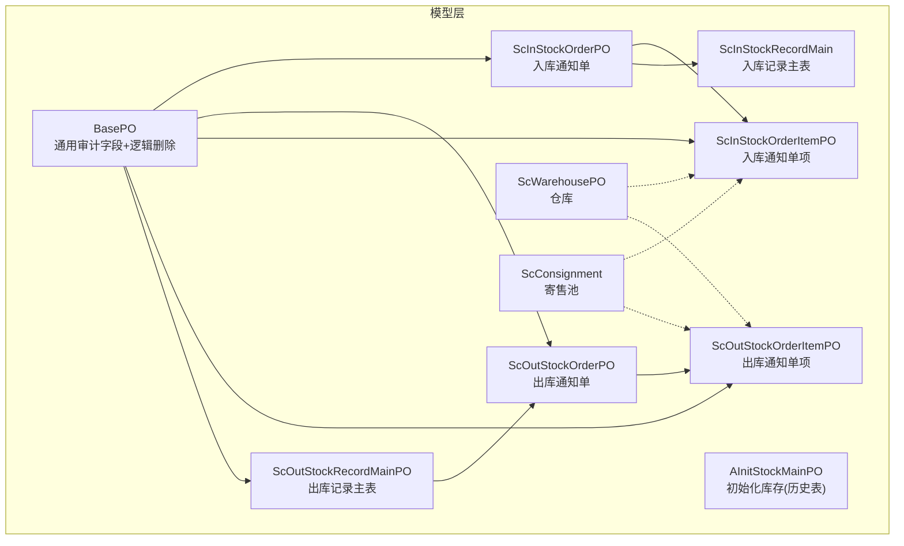
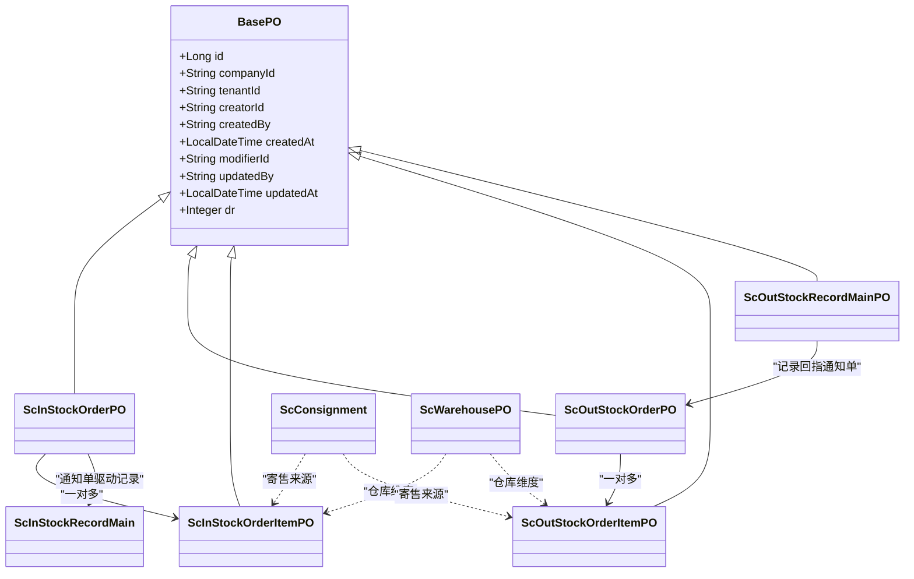
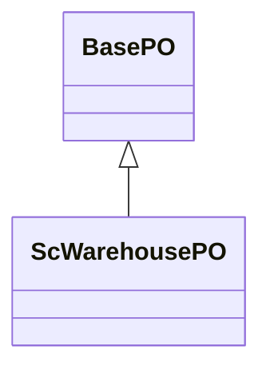
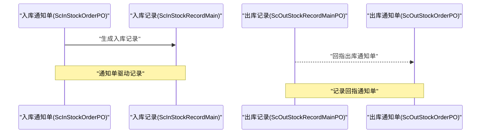
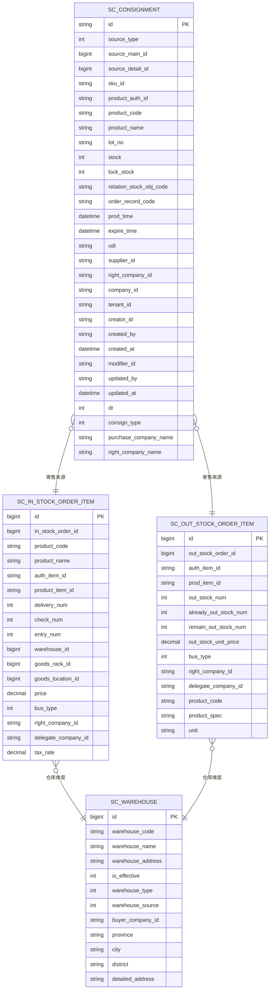
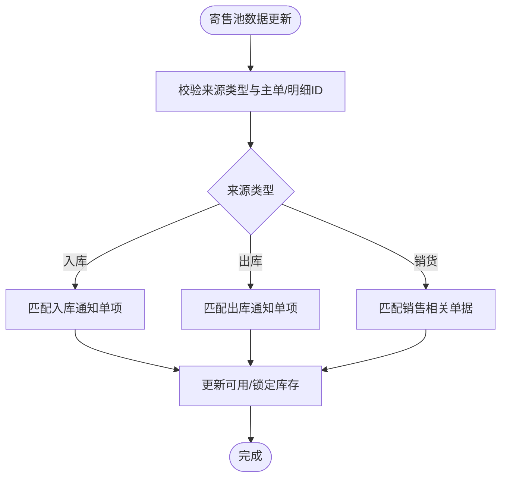
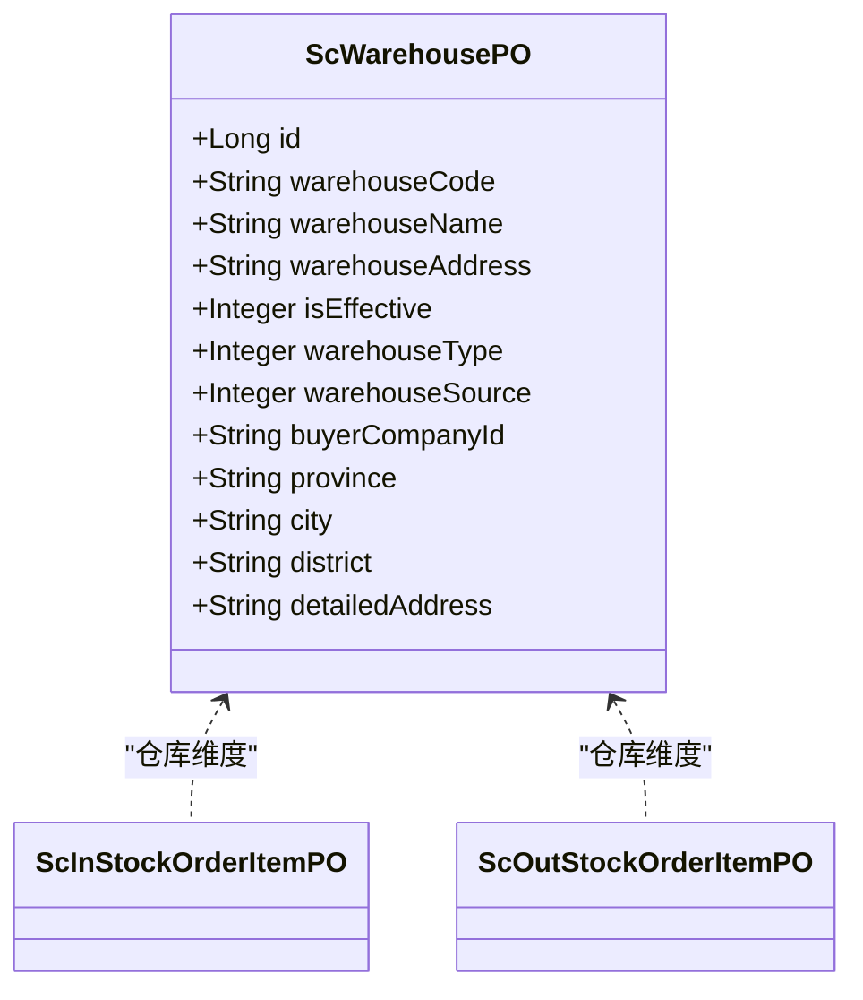
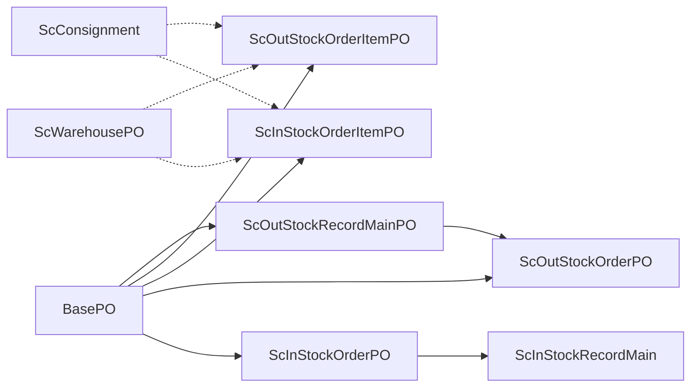

# 实体关系设计

<cite>
**本文档引用的文件**
- [BasePO.java](file://guoke-deepexi-storage-center-provider/src/main/java/com/deepexi/storage/model/BasePO.java)
- [ScInStockOrderPO.java](file://guoke-deepexi-storage-center-provider/src/main/java/com/deepexi/storage/model/ScInStockOrderPO.java)
- [ScOutStockOrderPO.java](file://guoke-deepexi-storage-center-provider/src/main/java/com/deepexi/storage/model/ScOutStockOrderPO.java)
- [ScInStockRecordMain.java](file://guoke-deepexi-storage-center-provider/src/main/java/com/deepexi/storage/model/ScInStockRecordMain.java)
- [ScOutStockRecordMainPO.java](file://guoke-deepexi-storage-center-provider/src/main/java/com/deepexi/storage/model/ScOutStockRecordMainPO.java)
- [ScInStockOrderItemPO.java](file://guoke-deepexi-storage-center-provider/src/main/java/com/deepexi/storage/model/ScInStockOrderItemPO.java)
- [ScOutStockOrderItemPO.java](file://guoke-deepexi-storage-center-provider/src/main/java/com/deepexi/storage/model/ScOutStockOrderItemPO.java)
- [ScConsignment.java](file://guoke-deepexi-storage-center-provider/src/main/java/com/deepexi/storage/model/ScConsignment.java)
- [ScWarehousePO.java](file://guoke-deepexi-storage-center-provider/src/main/java/com/deepexi/storage/model/ScWarehousePO.java)
- [AInitStockMainPO.java](file://guoke-deepexi-storage-center-provider/src/main/java/com/deepexi/storage/model/AInitStockMainPO.java)
</cite>

## 目录
1. [引言](#引言)
2. [项目结构](#项目结构)
3. [核心组件](#核心组件)
4. [架构总览](#架构总览)
5. [详细组件分析](#详细组件分析)
6. [依赖分析](#依赖分析)
7. [性能考虑](#性能考虑)
8. [故障排查指南](#故障排查指南)
9. [结论](#结论)
10. [附录](#附录)

## 引言
本设计文档聚焦于国科恒泰仓储管理系统中的核心实体关系，围绕入库与出库主子单、订单与记录、寄售池、仓库等关键领域，系统梳理实体类的继承关系、关联关系与聚合关系，明确导航属性与反向引用，给出实体生命周期管理与级联操作规则，并总结实体验证与约束条件，帮助开发者与产品人员快速理解并高效扩展系统。

## 项目结构
仓储系统采用“模型层”集中定义PO/DTO/VO与枚举，结合MyBatis-Plus注解实现ORM映射。核心实体以BasePO为通用基类，提供统一的审计字段与逻辑删除；部分仓储实体继承SuperEntity，体现更丰富的业务上下文能力。

**图表来源**
- [BasePO.java:19-79](file://guoke-deepexi-storage-center-provider/src/main/java/com/deepexi/storage/model/BasePO.java#L19-L79)
- [ScInStockOrderPO.java:18-191](file://guoke-deepexi-storage-center-provider/src/main/java/com/deepexi/storage/model/ScInStockOrderPO.java#L18-L191)
- [ScOutStockOrderPO.java:19-316](file://guoke-deepexi-storage-center-provider/src/main/java/com/deepexi/storage/model/ScOutStockOrderPO.java#L19-L316)
- [ScInStockRecordMain.java:24-267](file://guoke-deepexi-storage-center-provider/src/main/java/com/deepexi/storage/model/ScInStockRecordMain.java#L24-L267)
- [ScOutStockRecordMainPO.java:18-211](file://guoke-deepexi-storage-center-provider/src/main/java/com/deepexi/storage/model/ScOutStockRecordMainPO.java#L18-L211)
- [ScInStockOrderItemPO.java:14-119](file://guoke-deepexi-storage-center-provider/src/main/java/com/deepexi/storage/model/ScInStockOrderItemPO.java#L14-L119)
- [ScOutStockOrderItemPO.java:14-108](file://guoke-deepexi-storage-center-provider/src/main/java/com/deepexi/storage/model/ScOutStockOrderItemPO.java#L14-L108)
- [ScConsignment.java:19-324](file://guoke-deepexi-storage-center-provider/src/main/java/com/deepexi/storage/model/ScConsignment.java#L19-L324)
- [ScWarehousePO.java:19-183](file://guoke-deepexi-storage-center-provider/src/main/java/com/deepexi/storage/model/ScWarehousePO.java#L19-L183)
- [AInitStockMainPO.java:14-61](file://guoke-deepexi-storage-center-provider/src/main/java/com/deepexi/storage/model/AInitStockMainPO.java#L14-L61)

**章节来源**
- [BasePO.java:19-79](file://guoke-deepexi-storage-center-provider/src/main/java/com/deepexi/storage/model/BasePO.java#L19-L79)
- [ScWarehousePO.java:19-183](file://guoke-deepexi-storage-center-provider/src/main/java/com/deepexi/storage/model/ScWarehousePO.java#L19-L183)

## 核心组件
- BasePO：所有仓储相关实体的通用基类，提供统一的主键、租户、创建/更新信息与逻辑删除字段，确保审计一致性与软删除策略。
- ScInStockOrderPO / ScOutStockOrderPO：入库/出库通知单，承载业务类型、来源单据、状态、仓库与公司维度等关键信息。
- ScInStockRecordMain / ScOutStockRecordMainPO：入库/出库记录主表，记录实际收货、验收、审核与金额核销等环节信息。
- ScInStockOrderItemPO / ScOutStockOrderItemPO：入库/出库通知单项，承载SKU、数量、单价、税率、货主/委托方等明细信息。
- ScConsignment：寄售池，记录寄售来源、产品属性、批次/序列/UDI、可用/锁定库存与业务关联单号。
- ScWarehousePO：仓库实体，包含仓库类型、来源、是否有效、地理信息与管理员等属性。
- AInitStockMainPO：历史初始化库存主表，用于兼容旧数据。

上述组件通过继承与关联形成清晰的仓储业务闭环：通知单驱动记录单，记录单驱动明细项，仓库与寄售池作为支撑性实体参与库存流转。

**章节来源**
- [BasePO.java:19-79](file://guoke-deepexi-storage-center-provider/src/main/java/com/deepexi/storage/model/BasePO.java#L19-L79)
- [ScInStockOrderPO.java:18-191](file://guoke-deepexi-storage-center-provider/src/main/java/com/deepexi/storage/model/ScInStockOrderPO.java#L18-L191)
- [ScOutStockOrderPO.java:19-316](file://guoke-deepexi-storage-center-provider/src/main/java/com/deepexi/storage/model/ScOutStockOrderPO.java#L19-L316)
- [ScInStockRecordMain.java:24-267](file://guoke-deepexi-storage-center-provider/src/main/java/com/deepexi/storage/model/ScInStockRecordMain.java#L24-L267)
- [ScOutStockRecordMainPO.java:18-211](file://guoke-deepexi-storage-center-provider/src/main/java/com/deepexi/storage/model/ScOutStockRecordMainPO.java#L18-L211)
- [ScInStockOrderItemPO.java:14-119](file://guoke-deepexi-storage-center-provider/src/main/java/com/deepexi/storage/model/ScInStockOrderItemPO.java#L14-L119)
- [ScOutStockOrderItemPO.java:14-108](file://guoke-deepexi-storage-center-provider/src/main/java/com/deepexi/storage/model/ScOutStockOrderItemPO.java#L14-L108)
- [ScConsignment.java:19-324](file://guoke-deepexi-storage-center-provider/src/main/java/com/deepexi/storage/model/ScConsignment.java#L19-L324)
- [ScWarehousePO.java:19-183](file://guoke-deepexi-storage-center-provider/src/main/java/com/deepexi/storage/model/ScWarehousePO.java#L19-L183)
- [AInitStockMainPO.java:14-61](file://guoke-deepexi-storage-center-provider/src/main/java/com/deepexi/storage/model/AInitStockMainPO.java#L14-L61)

## 架构总览
下图展示仓储核心实体的类关系与继承层次，突出BasePO与SuperEntity（仓库实体继承）的基类设计理念，以及订单、记录、明细、寄售与仓库之间的关联关系。

**图表来源**
- [BasePO.java:19-79](file://guoke-deepexi-storage-center-provider/src/main/java/com/deepexi/storage/model/BasePO.java#L19-L79)
- [ScInStockOrderPO.java:18-191](file://guoke-deepexi-storage-center-provider/src/main/java/com/deepexi/storage/model/ScInStockOrderPO.java#L18-L191)
- [ScOutStockOrderPO.java:19-316](file://guoke-deepexi-storage-center-provider/src/main/java/com/deepexi/storage/model/ScOutStockOrderPO.java#L19-L316)
- [ScInStockRecordMain.java:24-267](file://guoke-deepexi-storage-center-provider/src/main/java/com/deepexi/storage/model/ScInStockRecordMain.java#L24-L267)
- [ScOutStockRecordMainPO.java:18-211](file://guoke-deepexi-storage-center-provider/src/main/java/com/deepexi/storage/model/ScOutStockRecordMainPO.java#L18-L211)
- [ScInStockOrderItemPO.java:14-119](file://guoke-deepexi-storage-center-provider/src/main/java/com/deepexi/storage/model/ScInStockOrderItemPO.java#L14-L119)
- [ScOutStockOrderItemPO.java:14-108](file://guoke-deepexi-storage-center-provider/src/main/java/com/deepexi/storage/model/ScOutStockOrderItemPO.java#L14-L108)
- [ScConsignment.java:19-324](file://guoke-deepexi-storage-center-provider/src/main/java/com/deepexi/storage/model/ScConsignment.java#L19-L324)
- [ScWarehousePO.java:19-183](file://guoke-deepexi-storage-center-provider/src/main/java/com/deepexi/storage/model/ScWarehousePO.java#L19-L183)

## 详细组件分析

### 继承关系与基类设计
- BasePO：提供统一的审计字段（创建/更新人、时间）与逻辑删除dr字段，确保所有实体具备一致的生命周期管理能力。
- ScWarehousePO：继承SuperEntity（仓库实体特有的业务上下文），在此基础上叠加仓库维度属性，体现“仓储专用”的扩展能力。

**图表来源**
- [BasePO.java:19-79](file://guoke-deepexi-storage-center-provider/src/main/java/com/deepexi/storage/model/BasePO.java#L19-L79)
- [ScWarehousePO.java:19-183](file://guoke-deepexi-storage-center-provider/src/main/java/com/deepexi/storage/model/ScWarehousePO.java#L19-L183)

**章节来源**
- [BasePO.java:19-79](file://guoke-deepexi-storage-center-provider/src/main/java/com/deepexi/storage/model/BasePO.java#L19-L79)
- [ScWarehousePO.java:19-183](file://guoke-deepexi-storage-center-provider/src/main/java/com/deepexi/storage/model/ScWarehousePO.java#L19-L183)

### 订单与记录的关联关系
- 入库通知单与入库记录：通知单驱动记录生成，记录主表记录收货、验收、审核与金额核销等关键节点。
- 出库记录与出库通知单：记录主表回指通知单，形成双向可追溯。

**图表来源**
- [ScInStockOrderPO.java:18-191](file://guoke-deepexi-storage-center-provider/src/main/java/com/deepexi/storage/model/ScInStockOrderPO.java#L18-L191)
- [ScInStockRecordMain.java:24-267](file://guoke-deepexi-storage-center-provider/src/main/java/com/deepexi/storage/model/ScInStockRecordMain.java#L24-L267)
- [ScOutStockRecordMainPO.java:18-211](file://guoke-deepexi-storage-center-provider/src/main/java/com/deepexi/storage/model/ScOutStockRecordMainPO.java#L18-L211)
- [ScOutStockOrderPO.java:19-316](file://guoke-deepexi-storage-center-provider/src/main/java/com/deepexi/storage/model/ScOutStockOrderPO.java#L19-L316)

**章节来源**
- [ScInStockOrderPO.java:18-191](file://guoke-deepexi-storage-center-provider/src/main/java/com/deepexi/storage/model/ScInStockOrderPO.java#L18-L191)
- [ScInStockRecordMain.java:24-267](file://guoke-deepexi-storage-center-provider/src/main/java/com/deepexi/storage/model/ScInStockRecordMain.java#L24-L267)
- [ScOutStockRecordMainPO.java:18-211](file://guoke-deepexi-storage-center-provider/src/main/java/com/deepexi/storage/model/ScOutStockRecordMainPO.java#L18-L211)
- [ScOutStockOrderPO.java:19-316](file://guoke-deepexi-storage-center-provider/src/main/java/com/deepexi/storage/model/ScOutStockOrderPO.java#L19-L316)

### 明细项与仓库、寄售的关系
- 入库/出库通知单项：承载SKU、数量、单价、税率、货主/委托方等，同时记录仓库维度（仓库ID、货架ID、货位ID）。
- 寄售池：记录寄售来源（来源类型、主单/明细ID）、产品属性（SKU、授权产品ID、注册证号等）、批次/序列/UDI、可用/锁定库存与业务关联单号。

**图表来源**
- [ScInStockOrderItemPO.java:14-119](file://guoke-deepexi-storage-center-provider/src/main/java/com/deepexi/storage/model/ScInStockOrderItemPO.java#L14-L119)
- [ScOutStockOrderItemPO.java:14-108](file://guoke-deepexi-storage-center-provider/src/main/java/com/deepexi/storage/model/ScOutStockOrderItemPO.java#L14-L108)
- [ScConsignment.java:19-324](file://guoke-deepexi-storage-center-provider/src/main/java/com/deepexi/storage/model/ScConsignment.java#L19-L324)
- [ScWarehousePO.java:19-183](file://guoke-deepexi-storage-center-provider/src/main/java/com/deepexi/storage/model/ScWarehousePO.java#L19-L183)

**章节来源**
- [ScInStockOrderItemPO.java:14-119](file://guoke-deepexi-storage-center-provider/src/main/java/com/deepexi/storage/model/ScInStockOrderItemPO.java#L14-L119)
- [ScOutStockOrderItemPO.java:14-108](file://guoke-deepexi-storage-center-provider/src/main/java/com/deepexi/storage/model/ScOutStockOrderItemPO.java#L14-L108)
- [ScConsignment.java:19-324](file://guoke-deepexi-storage-center-provider/src/main/java/com/deepexi/storage/model/ScConsignment.java#L19-L324)
- [ScWarehousePO.java:19-183](file://guoke-deepexi-storage-center-provider/src/main/java/com/deepexi/storage/model/ScWarehousePO.java#L19-L183)

### 寄售池与业务单据的导航属性
- 寄售池记录来源类型（出库/入库/销货）、来源主单与明细ID、产品属性、批次/序列/UDI、可用/锁定库存与业务关联单号，便于对账与溯源。
- 寄售池与入库/出库通知单项建立弱耦合关联，通过业务单据号与明细ID进行匹配，避免强外键约束带来的复杂级联。

**图表来源**
- [ScConsignment.java:19-324](file://guoke-deepexi-storage-center-provider/src/main/java/com/deepexi/storage/model/ScConsignment.java#L19-L324)
- [ScInStockOrderItemPO.java:14-119](file://guoke-deepexi-storage-center-provider/src/main/java/com/deepexi/storage/model/ScInStockOrderItemPO.java#L14-L119)
- [ScOutStockOrderItemPO.java:14-108](file://guoke-deepexi-storage-center-provider/src/main/java/com/deepexi/storage/model/ScOutStockOrderItemPO.java#L14-L108)

**章节来源**
- [ScConsignment.java:19-324](file://guoke-deepexi-storage-center-provider/src/main/java/com/deepexi/storage/model/ScConsignment.java#L19-L324)
- [ScInStockOrderItemPO.java:14-119](file://guoke-deepexi-storage-center-provider/src/main/java/com/deepexi/storage/model/ScInStockOrderItemPO.java#L14-L119)
- [ScOutStockOrderItemPO.java:14-108](file://guoke-deepexi-storage-center-provider/src/main/java/com/deepexi/storage/model/ScOutStockOrderItemPO.java#L14-L108)

### 仓库维度与库存定位
- 仓库实体包含仓库类型、来源、是否有效、地理信息与管理员等属性，为入库/出库明细项提供仓库维度支撑。
- 入库/出库通知单项中包含仓库ID、货架ID、货位ID，形成“仓库-货架-货位”的三级定位，便于库存精细化管理。

**图表来源**
- [ScWarehousePO.java:19-183](file://guoke-deepexi-storage-center-provider/src/main/java/com/deepexi/storage/model/ScWarehousePO.java#L19-L183)
- [ScInStockOrderItemPO.java:14-119](file://guoke-deepexi-storage-center-provider/src/main/java/com/deepexi/storage/model/ScInStockOrderItemPO.java#L14-L119)
- [ScOutStockOrderItemPO.java:14-108](file://guoke-deepexi-storage-center-provider/src/main/java/com/deepexi/storage/model/ScOutStockOrderItemPO.java#L14-L108)

**章节来源**
- [ScWarehousePO.java:19-183](file://guoke-deepexi-storage-center-provider/src/main/java/com/deepexi/storage/model/ScWarehousePO.java#L19-L183)
- [ScInStockOrderItemPO.java:14-119](file://guoke-deepexi-storage-center-provider/src/main/java/com/deepexi/storage/model/ScInStockOrderItemPO.java#L14-L119)
- [ScOutStockOrderItemPO.java:14-108](file://guoke-deepexi-storage-center-provider/src/main/java/com/deepexi/storage/model/ScOutStockOrderItemPO.java#L14-L108)

## 依赖分析
- 继承依赖：多数仓储实体继承BasePO，统一审计与逻辑删除；仓库实体继承SuperEntity，增强业务上下文。
- 关联依赖：通知单与记录单之间存在强关联；记录单与通知单之间存在回指；明细项与仓库、寄售池之间为弱耦合关联。
- 外键约束：系统通过业务单据号与明细ID进行关联，避免强外键带来的复杂级联，提升扩展性与维护性。

**图表来源**
- [BasePO.java:19-79](file://guoke-deepexi-storage-center-provider/src/main/java/com/deepexi/storage/model/BasePO.java#L19-L79)
- [ScInStockOrderPO.java:18-191](file://guoke-deepexi-storage-center-provider/src/main/java/com/deepexi/storage/model/ScInStockOrderPO.java#L18-L191)
- [ScOutStockOrderPO.java:19-316](file://guoke-deepexi-storage-center-provider/src/main/java/com/deepexi/storage/model/ScOutStockOrderPO.java#L19-L316)
- [ScInStockRecordMain.java:24-267](file://guoke-deepexi-storage-center-provider/src/main/java/com/deepexi/storage/model/ScInStockRecordMain.java#L24-L267)
- [ScOutStockRecordMainPO.java:18-211](file://guoke-deepexi-storage-center-provider/src/main/java/com/deepexi/storage/model/ScOutStockRecordMainPO.java#L18-L211)
- [ScInStockOrderItemPO.java:14-119](file://guoke-deepexi-storage-center-provider/src/main/java/com/deepexi/storage/model/ScInStockOrderItemPO.java#L14-L119)
- [ScOutStockOrderItemPO.java:14-108](file://guoke-deepexi-storage-center-provider/src/main/java/com/deepexi/storage/model/ScOutStockOrderItemPO.java#L14-L108)
- [ScConsignment.java:19-324](file://guoke-deepexi-storage-center-provider/src/main/java/com/deepexi/storage/model/ScConsignment.java#L19-L324)
- [ScWarehousePO.java:19-183](file://guoke-deepexi-storage-center-provider/src/main/java/com/deepexi/storage/model/ScWarehousePO.java#L19-L183)

**章节来源**
- [BasePO.java:19-79](file://guoke-deepexi-storage-center-provider/src/main/java/com/deepexi/storage/model/BasePO.java#L19-L79)
- [ScWarehousePO.java:19-183](file://guoke-deepexi-storage-center-provider/src/main/java/com/deepexi/storage/model/ScWarehousePO.java#L19-L183)

## 性能考虑
- 字段填充与逻辑删除：通过MyBatis-Plus注解自动填充租户、创建/更新信息，并使用逻辑删除减少全表扫描与数据迁移成本。
- 寄售池弱关联：通过业务单据号与明细ID进行匹配，避免强外键带来的写放大与级联锁竞争。
- 仓库维度：明细项仅保留仓库/货架/货位ID，不冗余完整路径，降低存储与更新成本。
- 历史兼容：AInitStockMainPO用于历史初始化库存，隔离旧数据与新业务流，避免查询路径复杂化。

[本节为通用指导，无需列出具体文件来源]

## 故障排查指南
- 审计字段缺失：检查实体是否继承BasePO，确认租户、创建/更新人与时间字段是否正确填充。
- 逻辑删除误删：确认dr字段与逻辑删除注解配置，避免误删导致数据不可恢复。
- 寄售池不一致：核对来源类型、主单/明细ID与业务单据号，确保匹配规则一致。
- 仓库维度错误：核对明细项仓库/货架/货位ID，确保与仓库实体一致且有效。

**章节来源**
- [BasePO.java:19-79](file://guoke-deepexi-storage-center-provider/src/main/java/com/deepexi/storage/model/BasePO.java#L19-L79)
- [ScConsignment.java:19-324](file://guoke-deepexi-storage-center-provider/src/main/java/com/deepexi/storage/model/ScConsignment.java#L19-L324)
- [ScWarehousePO.java:19-183](file://guoke-deepexi-storage-center-provider/src/main/java/com/deepexi/storage/model/ScWarehousePO.java#L19-L183)

## 结论
本设计文档基于仓储系统核心实体，明确了继承关系、关联关系与聚合关系，梳理了导航属性与反向引用，给出了生命周期管理与级联规则，并总结了验证与约束要点。通过统一基类、弱关联与仓库维度设计，系统在保证扩展性的同时兼顾性能与可维护性。

[本节为总结性内容，无需列出具体文件来源]

## 附录
- 历史兼容表：AInitStockMainPO用于历史初始化库存，建议在迁移与对账时单独处理。
- 枚举与状态：通知单与记录单的状态枚举需在业务层统一管理，避免跨模块状态不一致。

**章节来源**
- [AInitStockMainPO.java:14-61](file://guoke-deepexi-storage-center-provider/src/main/java/com/deepexi/storage/model/AInitStockMainPO.java#L14-L61)