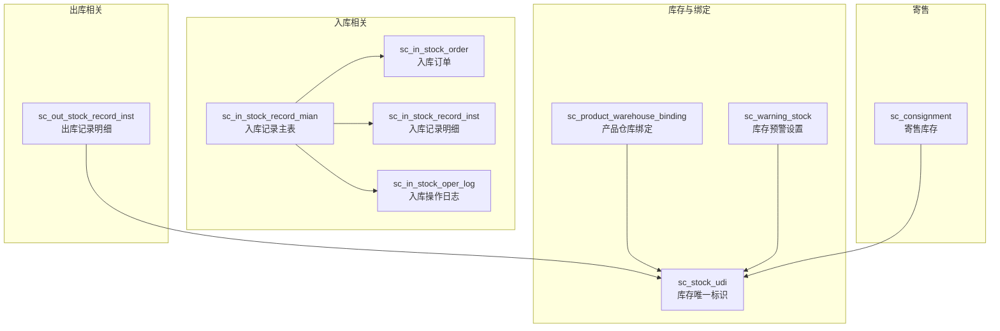
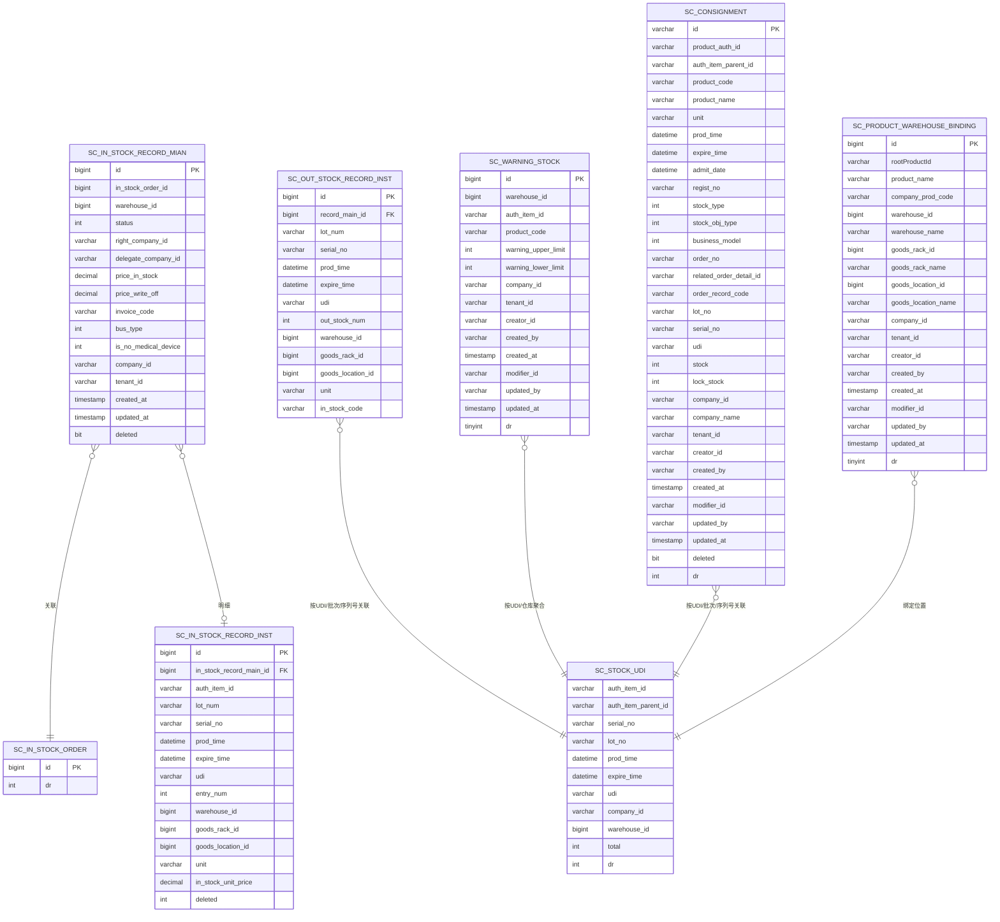
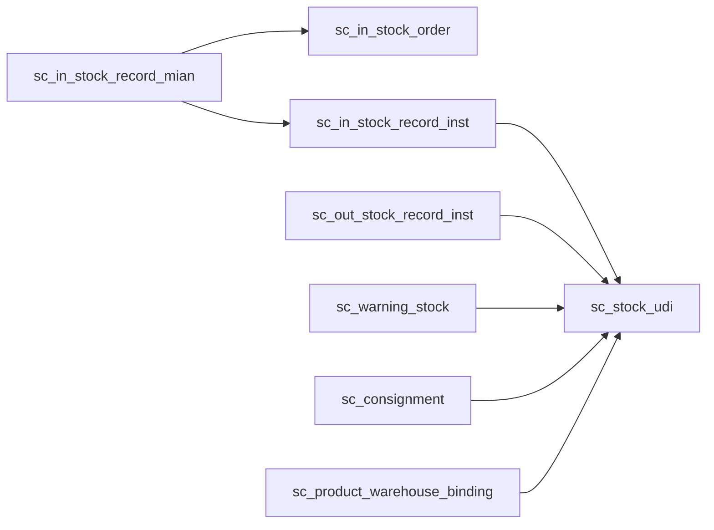

# 数据库表结构

<cite>
**本文引用的文件**
- [ScInStockRecordMainMapper.xml](file://guoke-deepexi-storage-center-provider/src/main/resources/mapper/stockin/ScInStockRecordMainMapper.xml)
- [ScOutStockRecordMapper.xml](file://guoke-deepexi-storage-center-provider/src/main/resources/mapper/stockout/ScOutStockRecordMapper.xml)
- [ScProductWarehouseBindingMapper.xml](file://guoke-deepexi-storage-center-provider/src/main/resources/mapper/ScProductWarehouseBindingMapper.xml)
- [ScWarningStockMapper.xml](file://guoke-deepexi-storage-center-provider/src/main/resources/mapper/ScWarningStockMapper.xml)
- [ScConsignmentMapper.xml](file://guoke-deepexi-storage-center-provider/src/main/resources/mapper/ScConsignmentMapper.xml)
</cite>

## 目录
1. [简介](#简介)
2. [项目结构](#项目结构)
3. [核心组件](#核心组件)
4. [架构总览](#架构总览)
5. [详细组件分析](#详细组件分析)
6. [依赖分析](#依赖分析)
7. [性能考虑](#性能考虑)
8. [故障排查指南](#故障排查指南)
9. [结论](#结论)
10. [附录](#附录)

## 简介
本文件面向国科恒泰仓储管理系统，基于仓库中现有的 MyBatis Mapper 映射文件，系统化梳理与仓储业务密切相关的数据库表结构设计，覆盖字段定义、主键/外键、索引与约束、表间关联与参照完整性、DDL 脚本要点、分区与存储引擎建议、统计信息与性能优化策略。本文所有技术结论均来源于实际 Mapper 文件中的 SQL 与映射配置。

## 项目结构
围绕仓储核心业务，本项目通过 MyBatis Mapper XML 将 Java POJO 与数据库表进行映射，并在 SQL 中体现表结构、字段、连接关系与过滤条件。以下图示展示与本文相关的 Mapper 与对应业务表的关系：

图表来源
- [ScInStockRecordMainMapper.xml:59-137](file://guoke-deepexi-storage-center-provider/src/main/resources/mapper/stockin/ScInStockRecordMainMapper.xml#L59-L137)
- [ScInStockRecordMainMapper.xml:164-171](file://guoke-deepexi-storage-center-provider/src/main/resources/mapper/stockin/ScInStockRecordMainMapper.xml#L164-L171)
- [ScOutStockRecordMapper.xml:4-21](file://guoke-deepexi-storage-center-provider/src/main/resources/mapper/stockout/ScOutStockRecordMapper.xml#L4-L21)
- [ScWarningStockMapper.xml:126-161](file://guoke-deepexi-storage-center-provider/src/main/resources/mapper/ScWarningStockMapper.xml#L126-L161)
- [ScConsignmentMapper.xml:283-311](file://guoke-deepexi-storage-center-provider/src/main/resources/mapper/ScConsignmentMapper.xml#L283-L311)

章节来源
- [ScInStockRecordMainMapper.xml:1-307](file://guoke-deepexi-storage-center-provider/src/main/resources/mapper/stockin/ScInStockRecordMainMapper.xml#L1-L307)
- [ScOutStockRecordMapper.xml:1-23](file://guoke-deepexi-storage-center-provider/src/main/resources/mapper/stockout/ScOutStockRecordMapper.xml#L1-L23)
- [ScProductWarehouseBindingMapper.xml:1-51](file://guoke-deepexi-storage-center-provider/src/main/resources/mapper/ScProductWarehouseBindingMapper.xml#L1-L51)
- [ScWarningStockMapper.xml:1-162](file://guoke-deepexi-storage-center-provider/src/main/resources/mapper/ScWarningStockMapper.xml#L1-L162)
- [ScConsignmentMapper.xml:1-390](file://guoke-deepexi-storage-center-provider/src/main/resources/mapper/ScConsignmentMapper.xml#L1-L390)

## 核心组件
本节从 Mapper XML 中提取核心业务表的结构与约束，形成可直接用于数据库设计与迁移的参考。

- 入库记录主表（sc_in_stock_record_mian）
  - 主键：id（BIGINT）
  - 关联字段：in_stock_order_id（BIGINT），指向入库订单；warehouse_id（BIGINT），指向仓库
  - 审核与状态：audit_user_id/name，audit_date；status（INTEGER）
  - 业务标识：relation_out_stock_obj_code、relation_in_record_code、relation_out_record_code、relation_out_record_date
  - 权属与委托：right_company_id、delegate_company_id
  - 价格与发票：price_in_stock、price_write_off、invoice_code
  - 业务类型：bus_type（INTEGER）、is_no_medical_device（INTEGER）
  - 多租户与审计：company_id、tenant_id、creator_id/created_by/created_at、modifier_id/updated_by/updated_at、deleted（BIT）
  - 约束与过滤：deleted=0；与 sc_in_stock_order 的 dr=0 连接
  - 字段来源参考：[ScInStockRecordMainMapper.xml:4-40](file://guoke-deepexi-storage-center-provider/src/main/resources/mapper/stockin/ScInStockRecordMainMapper.xml#L4-L40)，[ScInStockRecordMainMapper.xml:59-137](file://guoke-deepexi-storage-center-provider/src/main/resources/mapper/stockin/ScInStockRecordMainMapper.xml#L59-L137)

- 入库记录明细（sc_in_stock_record_inst）
  - 主键：id（BIGINT）
  - 关联字段：in_stock_record_main_id（BIGINT），指向主表
  - 库存属性：lot_num、serial_no、prod_time、expire_time、udi、entry_num、warehouse_id、goods_rack_id、goods_location_id、related_order_detail_id
  - 价格与单位：in_stock_unit_price、unit
  - 审计与删除：deleted（BIT）、auth_item_id
  - 字段来源参考：[ScInStockRecordMainMapper.xml:164-167](file://guoke-deepexi-storage-center-provider/src/main/resources/mapper/stockin/ScInStockRecordMainMapper.xml#L164-L167)

- 出库记录明细（sc_out_stock_record_inst）
  - 主键：id（BIGINT）
  - 关联字段：record_main_id（BIGINT），指向出库主表
  - 库存属性：lot_num、serial_no、prod_time、expire_time、udi、out_stock_num、warehouse_id、goods_rack_id、goods_location_id、unit、in_stock_code
  - 字段来源参考：[ScOutStockRecordMapper.xml:4-21](file://guoke-deepexi-storage-center-provider/src/main/resources/mapper/stockout/ScOutStockRecordMapper.xml#L4-L21)

- 寄售库存（sc_consignment）
  - 主键：id（VARCHAR）
  - 产品与规格：sku_id、product_auth_id、auth_item_parent_id、product_code、product_name、spec、model、unit
  - 生产与有效期：prod_time、expire_time、admit_date、regist_no
  - 业务维度：stock_type、stock_obj_type、business_model、relation_stock_obj_code、relation_record_detail_id、order_no、related_order_detail_id、order_record_code、lot_no、serial_no、udi、stock、supplier_id、right_company_id/right_company_name、purchase_company_name、lock_stock
  - 多租户与审计：company_id、company_name、tenant_id、creator_id/created_by/created_at、modifier_id/updated_by/updated_at、deleted（BIT）、dr（INTEGER）
  - 字段来源参考：[ScConsignmentMapper.xml:4-51](file://guoke-deepexi-storage-center-provider/src/main/resources/mapper/ScConsignmentMapper.xml#L4-L51)

- 产品仓库绑定（sc_product_warehouse_binding）
  - 主键：id（BIGINT）
  - 绑定属性：rootProductId、product_name、company_prod_code、warehouse_id/warehouse_name、goods_rack_id/goods_rack_name、goods_location_id/goods_location_name
  - 多租户与审计：company_id、tenant_id、creator_id/created_by/created_at、modifier_id/updated_by/updated_at、dr（TINYINT）
  - 字段来源参考：[ScProductWarehouseBindingMapper.xml:6-27](file://guoke-deepexi-storage-center-provider/src/main/resources/mapper/ScProductWarehouseBindingMapper.xml#L6-L27)

- 库存预警设置（sc_warning_stock）
  - 主键：id（BIGINT）
  - 预警属性：warehouse_id、auth_item_id、product_code、warning_upper_limit、warning_lower_limit
  - 多租户与审计：company_id、tenant_id、creator_id/created_by/created_at、modifier_id/updated_by/updated_at、dr（TINYINT）
  - 字段来源参考：[ScWarningStockMapper.xml:4-22](file://guoke-deepexi-storage-center-provider/src/main/resources/mapper/ScWarningStockMapper.xml#L4-L22)

- 库存唯一标识（sc_stock_udi）
  - 作为库存明细与寄售的关联键，用于按 UDI/批次/序列号等维度聚合与匹配
  - 字段来源参考：[ScWarningStockMapper.xml:133](file://guoke-deepexi-storage-center-provider/src/main/resources/mapper/ScWarningStockMapper.xml#L133)，[ScConsignmentMapper.xml:283-284](file://guoke-deepexi-storage-center-provider/src/main/resources/mapper/ScConsignmentMapper.xml#L283-L284)

章节来源
- [ScInStockRecordMainMapper.xml:4-40](file://guoke-deepexi-storage-center-provider/src/main/resources/mapper/stockin/ScInStockRecordMainMapper.xml#L4-L40)
- [ScInStockRecordMainMapper.xml:59-137](file://guoke-deepexi-storage-center-provider/src/main/resources/mapper/stockin/ScInStockRecordMainMapper.xml#L59-L137)
- [ScInStockRecordMainMapper.xml:164-167](file://guoke-deepexi-storage-center-provider/src/main/resources/mapper/stockin/ScInStockRecordMainMapper.xml#L164-L167)
- [ScOutStockRecordMapper.xml:4-21](file://guoke-deepexi-storage-center-provider/src/main/resources/mapper/stockout/ScOutStockRecordMapper.xml#L4-L21)
- [ScConsignmentMapper.xml:4-51](file://guoke-deepexi-storage-center-provider/src/main/resources/mapper/ScConsignmentMapper.xml#L4-L51)
- [ScProductWarehouseBindingMapper.xml:6-27](file://guoke-deepexi-storage-center-provider/src/main/resources/mapper/ScProductWarehouseBindingMapper.xml#L6-L27)
- [ScWarningStockMapper.xml:4-22](file://guoke-deepexi-storage-center-provider/src/main/resources/mapper/ScWarningStockMapper.xml#L4-L22)

## 架构总览
下图展示仓储核心表之间的逻辑关系与参照完整性约束意图（以 Mapper 中的 JOIN 与过滤条件为依据）：

图表来源
- [ScInStockRecordMainMapper.xml:59-137](file://guoke-deepexi-storage-center-provider/src/main/resources/mapper/stockin/ScInStockRecordMainMapper.xml#L59-L137)
- [ScInStockRecordMainMapper.xml:164-167](file://guoke-deepexi-storage-center-provider/src/main/resources/mapper/stockin/ScInStockRecordMainMapper.xml#L164-L167)
- [ScOutStockRecordMapper.xml:4-21](file://guoke-deepexi-storage-center-provider/src/main/resources/mapper/stockout/ScOutStockRecordMapper.xml#L4-L21)
- [ScWarningStockMapper.xml:133](file://guoke-deepexi-storage-center-provider/src/main/resources/mapper/ScWarningStockMapper.xml#L133)
- [ScConsignmentMapper.xml:283-284](file://guoke-deepexi-storage-center-provider/src/main/resources/mapper/ScConsignmentMapper.xml#L283-L284)

## 详细组件分析

### 入库记录主表（sc_in_stock_record_mian）
- 设计要点
  - 主键：id（BIGINT）
  - 审核与状态：audit_user_id/name/audit_date；status（INTEGER）
  - 业务标识：relation_* 系列字段用于关联出库/外部对象
  - 权属与委托：right_company_id、delegate_company_id
  - 价格与发票：price_in_stock、price_write_off、invoice_code
  - 业务类型：bus_type、is_no_medical_device
  - 多租户与审计：company_id、tenant_id、creator_id/created_by/created_at、modifier_id/updated_by/updated_at、deleted（BIT）
- 参照完整性
  - 与 sc_in_stock_order 通过 in_stock_order_id 关联，查询时要求 b.dr=0
  - 与 sc_in_stock_record_inst 通过主键/外键关联，查询时要求 inst.deleted=0
- 索引与约束
  - 建议对 in_stock_order_id、warehouse_id、company_id、created_at、updated_at、deleted 进行索引优化
  - 建议对 relation_* 字段建立组合索引以支持常见过滤
- DDL 脚本要点
  - 主键：id（BIGINT AUTO_INCREMENT 或应用侧生成）
  - 审核与状态：audit_user_id、audit_user_name、audit_date、status
  - 业务标识：relation_out_stock_obj_code、relation_in_record_code、relation_out_record_code、relation_out_record_date
  - 权属与委托：right_company_id、delegate_company_id
  - 价格与发票：price_in_stock、price_write_off、invoice_code
  - 业务类型：bus_type、is_no_medical_device
  - 多租户与审计：company_id、tenant_id、creator_id/created_by/created_at、modifier_id/updated_by/updated_at、deleted
- 性能建议
  - 按公司/仓库/状态/时间范围的查询较多，建议在 company_id、warehouse_id、status、created_at 上建立复合索引
  - 对 relation_* 字段的组合查询建议建立联合索引

章节来源
- [ScInStockRecordMainMapper.xml:4-40](file://guoke-deepexi-storage-center-provider/src/main/resources/mapper/stockin/ScInStockRecordMainMapper.xml#L4-L40)
- [ScInStockRecordMainMapper.xml:59-137](file://guoke-deepexi-storage-center-provider/src/main/resources/mapper/stockin/ScInStockRecordMainMapper.xml#L59-L137)
- [ScInStockRecordMainMapper.xml:164-167](file://guoke-deepexi-storage-center-provider/src/main/resources/mapper/stockin/ScInStockRecordMainMapper.xml#L164-L167)

### 入库记录明细（sc_in_stock_record_inst）
- 设计要点
  - 主键：id（BIGINT）
  - 关联字段：in_stock_record_main_id（BIGINT）
  - 库存属性：lot_num、serial_no、prod_time、expire_time、udi、entry_num、warehouse_id、goods_rack_id、goods_location_id、related_order_detail_id
  - 价格与单位：in_stock_unit_price、unit
  - 审计与删除：deleted（BIT）、auth_item_id
- 参照完整性
  - 与 sc_in_stock_record_mian 通过 in_stock_record_main_id 关联，查询时要求 deleted=0
- 索引与约束
  - 建议对 in_stock_record_main_id、auth_item_id、warehouse_id、lot_num、serial_no、udi、prod_time、expire_time 建立索引
- DDL 脚本要点
  - 主键：id（BIGINT）
  - 外键：in_stock_record_main_id（REFERENCES sc_in_stock_record_mian(id)）
  - 库存属性：lot_num、serial_no、prod_time、expire_time、udi、entry_num、warehouse_id、goods_rack_id、goods_location_id、related_order_detail_id
  - 价格与单位：in_stock_unit_price、unit
  - 审计与删除：deleted、auth_item_id
- 性能建议
  - 按 UDI/批次/序列号的查询频繁，建议在 udi、lot_num、serial_no、prod_time、expire_time 上建立联合索引

章节来源
- [ScInStockRecordMainMapper.xml:164-167](file://guoke-deepexi-storage-center-provider/src/main/resources/mapper/stockin/ScInStockRecordMainMapper.xml#L164-L167)

### 出库记录明细（sc_out_stock_record_inst）
- 设计要点
  - 主键：id（BIGINT）
  - 关联字段：record_main_id（BIGINT）
  - 库存属性：lot_num、serial_no、prod_time、expire_time、udi、out_stock_num、warehouse_id、goods_rack_id、goods_location_id、unit、in_stock_code
- 参照完整性
  - 与 sc_stock_udi 通过 UDI/批次/序列号等维度关联，查询时要求 udi 等字段匹配
- 索引与约束
  - 建议对 record_main_id、warehouse_id、goods_rack_id、goods_location_id、udi、lot_num、serial_no、prod_time、expire_time 建立索引
- DDL 脚本要点
  - 主键：id（BIGINT）
  - 外键：record_main_id（REFERENCES 出库主表）
  - 库存属性：lot_num、serial_no、prod_time、expire_time、udi、out_stock_num、warehouse_id、goods_rack_id、goods_location_id、unit、in_stock_code
- 性能建议
  - 按仓库/货位/UDI 的查询较多，建议在 warehouse_id、goods_rack_id、goods_location_id、udi、lot_num、serial_no 上建立联合索引

章节来源
- [ScOutStockRecordMapper.xml:4-21](file://guoke-deepexi-storage-center-provider/src/main/resources/mapper/stockout/ScOutStockRecordMapper.xml#L4-L21)

### 寄售库存（sc_consignment）
- 设计要点
  - 主键：id（VARCHAR）
  - 产品与规格：sku_id、product_auth_id、auth_item_parent_id、product_code、product_name、spec、model、unit
  - 生产与有效期：prod_time、expire_time、admit_date、regist_no
  - 业务维度：stock_type、stock_obj_type、business_model、relation_stock_obj_code、relation_record_detail_id、order_no、related_order_detail_id、order_record_code、lot_no、serial_no、udi、stock、supplier_id、right_company_id/right_company_name、purchase_company_name、lock_stock
  - 多租户与审计：company_id、company_name、tenant_id、creator_id/created_by/created_at、modifier_id/updated_by/updated_at、deleted（BIT）、dr（INTEGER）
- 参照完整性
  - 与 sc_stock_udi 通过 UDI/批次/序列号等维度关联，查询时要求 dr=0
- 索引与约束
  - 建议对 product_auth_id、auth_item_parent_id、udi、lot_no、serial_no、prod_time、expire_time、company_id、right_company_id、stock_type、stock_obj_type 建立联合索引
- DDL 脚本要点
  - 主键：id（VARCHAR）
  - 产品与规格：product_auth_id、auth_item_parent_id、product_code、product_name、unit、spec、model
  - 生产与有效期：prod_time、expire_time、admit_date、regist_no
  - 业务维度：stock_type、stock_obj_type、business_model、relation_stock_obj_code、relation_record_detail_id、order_no、related_order_detail_id、order_record_code、lot_no、serial_no、udi、stock、lock_stock、supplier_id、right_company_id、purchase_company_name
  - 多租户与审计：company_id、company_name、tenant_id、creator_id、created_by、created_at、modifier_id、updated_by、updated_at、deleted、dr
- 性能建议
  - 按公司/物权方/产品/批次/序列号的查询较多，建议在 company_id、right_company_id、product_auth_id、udi、lot_no、serial_no、stock_type、stock_obj_type 上建立联合索引

章节来源
- [ScConsignmentMapper.xml:4-51](file://guoke-deepexi-storage-center-provider/src/main/resources/mapper/ScConsignmentMapper.xml#L4-L51)
- [ScConsignmentMapper.xml:283-284](file://guoke-deepexi-storage-center-provider/src/main/resources/mapper/ScConsignmentMapper.xml#L283-L284)

### 产品仓库绑定（sc_product_warehouse_binding）
- 设计要点
  - 主键：id（BIGINT）
  - 绑定属性：rootProductId、product_name、company_prod_code、warehouse_id/warehouse_name、goods_rack_id/goods_rack_name、goods_location_id/goods_location_name
  - 多租户与审计：company_id、tenant_id、creator_id/created_by/created_at、modifier_id/updated_by/updated_at、dr（TINYINT）
- 参照完整性
  - 与 sc_stock_udi 通过绑定位置关联，用于定位库存所在仓库/货架/货位
- 索引与约束
  - 建议对 rootProductId、warehouse_id、goods_rack_id、goods_location_id、company_id 建立联合索引
- DDL 脚本要点
  - 主键：id（BIGINT）
  - 绑定属性：rootProductId、product_name、company_prod_code、warehouse_id、warehouse_name、goods_rack_id、goods_rack_name、goods_location_id、goods_location_name
  - 多租户与审计：company_id、tenant_id、creator_id、created_by、created_at、modifier_id、updated_by、updated_at、dr
- 性能建议
  - 按产品/仓库/货位的查询较多，建议在 rootProductId、warehouse_id、goods_rack_id、goods_location_id 上建立联合索引

章节来源
- [ScProductWarehouseBindingMapper.xml:6-27](file://guoke-deepexi-storage-center-provider/src/main/resources/mapper/ScProductWarehouseBindingMapper.xml#L6-L27)

### 库存预警设置（sc_warning_stock）
- 设计要点
  - 主键：id（BIGINT）
  - 预警属性：warehouse_id、auth_item_id、product_code、warning_upper_limit、warning_lower_limit
  - 多租户与审计：company_id、tenant_id、creator_id/created_by/created_at、modifier_id/updated_by/updated_at、dr（TINYINT）
- 参照完整性
  - 与 sc_stock_udi 通过 auth_item_id、warehouse_id 聚合统计并进行上下限比较
- 索引与约束
  - 建议对 warehouse_id、auth_item_id、company_id 建立联合索引
- DDL 脚本要点
  - 主键：id（BIGINT）
  - 预警属性：warehouse_id、auth_item_id、product_code、warning_upper_limit、warning_lower_limit
  - 多租户与审计：company_id、tenant_id、creator_id、created_by、created_at、modifier_id、updated_by、updated_at、dr
- 性能建议
  - 按公司/仓库/产品的预警查询较多，建议在 company_id、warehouse_id、auth_item_id 上建立联合索引

章节来源
- [ScWarningStockMapper.xml:4-22](file://guoke-deepexi-storage-center-provider/src/main/resources/mapper/ScWarningStockMapper.xml#L4-L22)
- [ScWarningStockMapper.xml:133](file://guoke-deepexi-storage-center-provider/src/main/resources/mapper/ScWarningStockMapper.xml#L133)

## 依赖分析
- 表间依赖关系
  - sc_in_stock_record_mian → sc_in_stock_order（通过 in_stock_order_id）
  - sc_in_stock_record_mian → sc_in_stock_record_inst（一对多）
  - sc_out_stock_record_inst → sc_stock_udi（按 UDI/批次/序列号关联）
  - sc_warning_stock → sc_stock_udi（按 UDI/仓库聚合）
  - sc_consignment → sc_stock_udi（按 UDI/批次/序列号关联）
  - sc_product_warehouse_binding → sc_stock_udi（绑定位置）
- 查询依赖
  - Mapper 中大量 LEFT JOIN/INNER JOIN 体现表间依赖
  - 删除/作废标志（deleted、dr）贯穿多个表，作为软删除与过滤条件

图表来源
- [ScInStockRecordMainMapper.xml:59-137](file://guoke-deepexi-storage-center-provider/src/main/resources/mapper/stockin/ScInStockRecordMainMapper.xml#L59-L137)
- [ScInStockRecordMainMapper.xml:164-167](file://guoke-deepexi-storage-center-provider/src/main/resources/mapper/stockin/ScInStockRecordMainMapper.xml#L164-L167)
- [ScOutStockRecordMapper.xml:4-21](file://guoke-deepexi-storage-center-provider/src/main/resources/mapper/stockout/ScOutStockRecordMapper.xml#L4-L21)
- [ScWarningStockMapper.xml:133](file://guoke-deepexi-storage-center-provider/src/main/resources/mapper/ScWarningStockMapper.xml#L133)
- [ScConsignmentMapper.xml:283-284](file://guoke-deepexi-storage-center-provider/src/main/resources/mapper/ScConsignmentMapper.xml#L283-L284)

章节来源
- [ScInStockRecordMainMapper.xml:59-137](file://guoke-deepexi-storage-center-provider/src/main/resources/mapper/stockin/ScInStockRecordMainMapper.xml#L59-L137)
- [ScOutStockRecordMapper.xml:4-21](file://guoke-deepexi-storage-center-provider/src/main/resources/mapper/stockout/ScOutStockRecordMapper.xml#L4-L21)
- [ScWarningStockMapper.xml:133](file://guoke-deepexi-storage-center-provider/src/main/resources/mapper/ScWarningStockMapper.xml#L133)
- [ScConsignmentMapper.xml:283-284](file://guoke-deepexi-storage-center-provider/src/main/resources/mapper/ScConsignmentMapper.xml#L283-L284)

## 性能考虑
- 索引策略
  - 主表（sc_in_stock_record_mian）：按 company_id、warehouse_id、status、created_at、updated_at 建立复合索引
  - 明细表（sc_in_stock_record_inst）：按 in_stock_record_main_id、auth_item_id、udi、lot_num、serial_no 建立复合索引
  - 出库明细（sc_out_stock_record_inst）：按 warehouse_id、goods_rack_id、goods_location_id、udi、lot_num、serial_no 建立复合索引
  - 寄售（sc_consignment）：按 company_id、right_company_id、product_auth_id、udi、lot_no、serial_no、stock_type、stock_obj_type 建立复合索引
  - 绑定（sc_product_warehouse_binding）：按 rootProductId、warehouse_id、goods_rack_id、goods_location_id 建立复合索引
  - 预警（sc_warning_stock）：按 company_id、warehouse_id、auth_item_id 建立复合索引
- 分区策略
  - 建议按时间字段（如 created_at、updated_at）对主表与明细表进行月度或季度分区，以提升归档与清理效率
  - 对高频查询字段（warehouse_id、company_id）可考虑组合分区
- 存储引擎与字符集
  - 建议采用 InnoDB 引擎，支持事务与外键约束
  - 字符集统一使用 utf8mb4，排序规则使用 utf8mb4_general_ci
- 统计信息与维护
  - 定期更新表统计信息，确保执行计划稳定
  - 对热点表进行定期归档与压缩，减少碎片

## 故障排查指南
- 常见问题
  - 订单/记录未显示：检查 deleted=0 与 dr=0 条件是否生效
  - UDI/批次/序列号不匹配：核对 sc_stock_udi 与明细表字段一致性
  - 预警结果异常：确认 sc_warning_stock 的上下限与 sc_stock_udi 的聚合逻辑
- 排查步骤
  - 使用 Mapper 中的查询 SQL 片段进行验证，逐步添加过滤条件
  - 检查 JOIN 条件与字段类型是否一致
  - 核对软删除字段（deleted、dr）与业务状态（status）

章节来源
- [ScInStockRecordMainMapper.xml:59-137](file://guoke-deepexi-storage-center-provider/src/main/resources/mapper/stockin/ScInStockRecordMainMapper.xml#L59-L137)
- [ScInStockRecordMainMapper.xml:164-167](file://guoke-deepexi-storage-center-provider/src/main/resources/mapper/stockin/ScInStockRecordMainMapper.xml#L164-L167)
- [ScWarningStockMapper.xml:133](file://guoke-deepexi-storage-center-provider/src/main/resources/mapper/ScWarningStockMapper.xml#L133)
- [ScConsignmentMapper.xml:283-284](file://guoke-deepexi-storage-center-provider/src/main/resources/mapper/ScConsignmentMapper.xml#L283-L284)

## 结论
本文基于现有 Mapper XML 提炼了仓储核心表的结构设计与业务约束，明确了主键、外键、索引与约束、表间关联与参照完整性，并给出了 DDL 脚本要点、分区与存储引擎建议以及性能优化策略。建议在数据库层面落实复合索引与分区策略，配合定期统计信息维护，保障系统在高并发与大数据量下的稳定性与性能。

## 附录
- DDL 脚本要点（示意）
  - 主键与自增/非自增：根据业务选择 BIGINT 自增或应用侧生成
  - 审核与状态：audit_user_id/name/audit_date、status
  - 业务标识：relation_* 系列字段
  - 权属与委托：right_company_id、delegate_company_id
  - 价格与发票：price_in_stock、price_write_off、invoice_code
  - 业务类型：bus_type、is_no_medical_device
  - 多租户与审计：company_id、tenant_id、creator_id/created_by/created_at、modifier_id/updated_by/updated_at、deleted/dr
- 索引与分区建议（示意）
  - 主表：company_id、warehouse_id、status、created_at、updated_at
  - 明细表：in_stock_record_main_id、auth_item_id、udi、lot_num、serial_no
  - 出库明细：warehouse_id、goods_rack_id、goods_location_id、udi、lot_num、serial_no
  - 寄售：company_id、right_company_id、product_auth_id、udi、lot_no、serial_no、stock_type、stock_obj_type
  - 绑定：rootProductId、warehouse_id、goods_rack_id、goods_location_id
  - 预警：company_id、warehouse_id、auth_item_id
  - 分区：按时间字段（created_at、updated_at）进行月/季分区