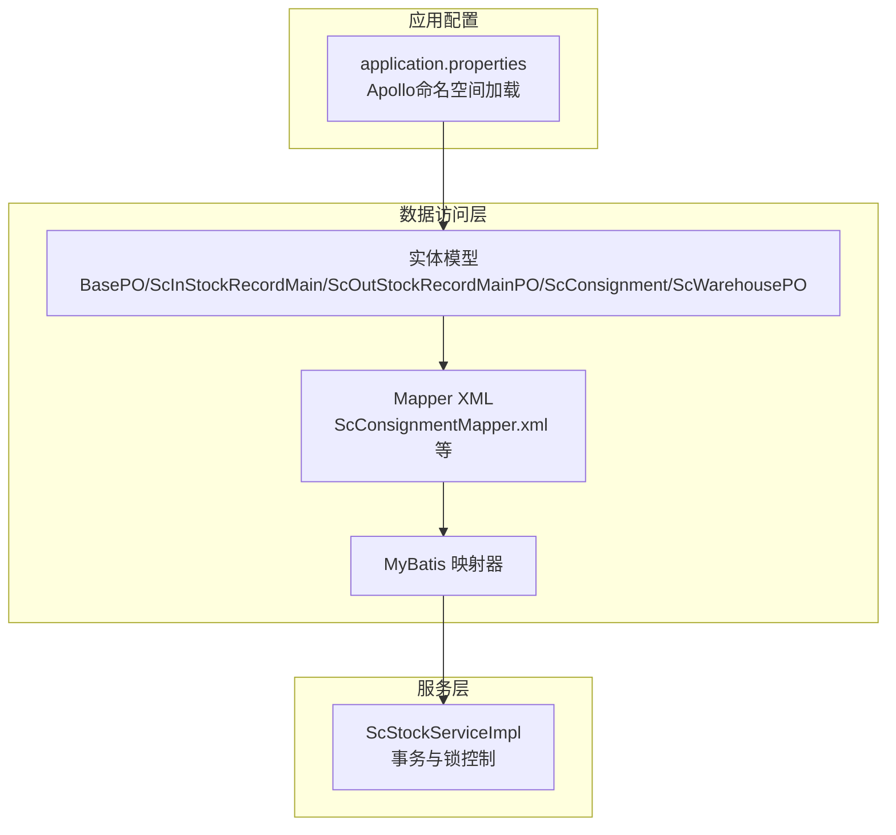
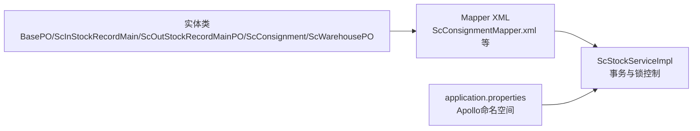

# 数据模型

<cite>
**本文引用的文件**
- [application.properties](file://guoke-deepexi-storage-center-provider/src/main/resources/application.properties)
- [BasePO.java](file://guoke-deepexi-storage-center-provider/src/main/java/com/ deepexi/storage/model/BasePO.java)
- [ScInStockRecordMain.java](file://guoke-deepexi-storage-center-provider/src/main/java/com/ deepexi/storage/model/ScInStockRecordMain.java)
- [ScOutStockRecordMainPO.java](file://guoke-deepexi-storage-center-provider/src/main/java/com/ deepexi/storage/model/ScOutStockRecordMainPO.java)
- [ScConsignment.java](file://guoke-deepexi-storage-center-provider/src/main/java/com/ deepexi/storage/model/ScConsignment.java)
- [ScWarehousePO.java](file://guoke-deepexi-storage-center-provider/src/main/java/com/ deepexi/storage/model/ScWarehousePO.java)
- [ScConsignmentMapper.xml](file://guoke-deepexi-storage-center-provider/src/main/resources/mapper/ScConsignmentMapper.xml)
- [ScCompanyLogisticsConfigMapper.xml](file://guoke-deepexi-storage-center-provider/src/main/resources/mapper/logistics/ScCompanyLogisticsConfigMapper.xml)
- [ScStockChangeCollectMapper.xml](file://guoke-deepexi-storage-center-provider/src/main/resources/mapper/stock/ScStockChangeCollectMapper.xml)
- [ScStockServiceImpl.java](file://guoke-deepexi-storage-center-provider/src/main/java/com/ deepexi/storage/service/impl/ScStockServiceImpl.java)
</cite>

## 目录
1. [简介](#简介)
2. [项目结构](#项目结构)
3. [核心组件](#核心组件)
4. [架构总览](#架构总览)
5. [详细组件分析](#详细组件分析)
6. [依赖分析](#依赖分析)
7. [性能考虑](#性能考虑)
8. [故障排查指南](#故障排查指南)
9. [结论](#结论)
10. [附录](#附录)

## 简介
本文件为“国科恒泰仓储管理系统”的数据模型文档，聚焦于仓储业务中的核心实体与关系，覆盖字段定义、数据类型、主键/外键、索引与约束、数据验证与业务规则、数据库模式图、示例数据、数据访问模式、缓存策略与性能考量、数据生命周期与归档策略、数据迁移路径与版本管理、以及数据安全与隐私要求。文档以MyBatis实体类与Mapper XML为依据，结合通用基类与服务层实现，形成可落地的数据设计说明。

## 项目结构
系统采用分层架构，仓储相关的实体集中在provider模块的model与mapper目录中，配置通过Apollo多命名空间加载，MyBatis作为ORM框架，Mapper XML定义SQL与结果映射。

图表来源
- [application.properties:1-6](file://guoke-deepexi-storage-center-provider/src/main/resources/application.properties#L1-L6)
- [BasePO.java:1-80](file://guoke-deepexi-storage-center-provider/src/main/java/com/deepexi/storage/model/BasePO.java#L1-L80)
- [ScConsignmentMapper.xml:1-390](file://guoke-deepexi-storage-center-provider/src/main/resources/mapper/ScConsignmentMapper.xml#L1-L390)
- [ScStockServiceImpl.java:3391-3443](file://guoke-deepexi-storage-center-provider/src/main/java/com/deepexi/storage/service/impl/ScStockServiceImpl.java#L3391-L3443)

章节来源
- [application.properties:1-6](file://guoke-deepexi-storage-center-provider/src/main/resources/application.properties#L1-L6)

## 核心组件
本节梳理仓储系统的关键实体及其职责与字段要点，并给出统一的主键/逻辑删除约定。

- BasePO（通用基类）
  - 主键：Long id
  - 多租户：String tenantId
  - 审计字段：creator_id/created_by/created_at、modifier_id/updated_by/updated_at
  - 逻辑删除：Integer dr（0未删，1已删）

- 入库单主表 ScInStockRecordMain
  - 主键：Long id
  - 关联单据：in_stock_order_id、out_stock_order_id、relate_out_record_main_id
  - 仓库与品规：warehouse_id、prod_item_num
  - 收货/验收：receive_name/receive_date、check_name/check_date
  - 审核：status、audit_user_id/audit_user_name/audit_date
  - 外部关联：relation_out_stock_obj_code、relation_in_record_code、relation_out_record_code、relation_out_record_date
  - 金额：price_in_stock、price_write_off
  - 业务标识：bus_type、is_no_medical_device、right_company_id、delegate_company_id
  - 审计与逻辑删除：company_id、tenant_id、creator_id/created_by/created_at、modifier_id/updated_by/updated_at、deleted

- 出库单主表 ScOutStockRecordMainPO
  - 主键：继承BasePO
  - 关联单据：outStockId、inStockOrderId、outStockCode、recordMainCode、outStockObjId/outStockObjCode/outStockObjCodePc
  - 仓库与品规：warehouseId、prodItemNum
  - 审核与状态：status、auditUserId/auditUserName/auditDate
  - 收货信息：address、receiveName、receivePhone、receiveProvince/receiveCity/receiveCounty、receiveWarehouseAddress
  - 时间：outStockDate、relationOutRecordDate
  - 金额：priceOutStock、priceWriteOff
  - 外部关联：relationOutStockObjCode、relationOutRecordCode、thirdSendOutCode
  - 业务标识：outStockType/outStockObjType、isNoMedicalDevice、busType、onlineFlag
  - 物权/委托：rightCompanyId、delegateCompanyId

- 寄售池 ScConsignment
  - 主键：String id（输入型）
  - 来源与对象：source_type/source_main_id/source_detail_id、stock_type/stock_obj_type、business_model
  - 产品信息：sku_id/product_auth_id/auth_item_parent_id、product_code/product_name/spec/model/unit
  - 有效期：prod_time、expire_time、admit_date、regist_no
  - 单据与批号：order_no/related_order_detail_id/order_record_code、lot_no/serial_no/udi
  - 库存：stock、lock_stock
  - 公司与租户：supplier_id/right_company_id/company_id/company_name、tenant_id
  - 审计与逻辑删除：creator_id/created_by/created_at、modifier_id/updated_by/updated_at、deleted/dr
  - 寄售类型：consign_type、purchase_company_name、right_company_name

- 仓库 ScWarehousePO
  - 主键：Long id
  - 组织与属性：parentId、isGsp、isDefault、warehouseName/warehouseCode、warehouseAddress
  - 三方/保税：isThree、isCustomsBonded
  - 有效性：isEffective
  - 类型与来源：warehouseType、warehouseSource、warehouseMold
  - 所属公司：buyerCompanyId/buyerCompanyName、warehouseBelong、companyId
  - 地址与联系人：province/city/district/provinceCode/cityCode/districtCode、detailedAddress、receiverName/receiverPhone、adminOne/adminTwo
  - 业务类型：busType
  - 审计字段：继承SuperEntity

章节来源
- [BasePO.java:1-80](file://guoke-deepexi-storage-center-provider/src/main/java/com/deepexi/storage/model/BasePO.java#L1-L80)
- [ScInStockRecordMain.java:1-267](file://guoke-deepexi-storage-center-provider/src/main/java/com/deepexi/storage/model/ScInStockRecordMain.java#L1-L267)
- [ScOutStockRecordMainPO.java:1-211](file://guoke-deepexi/storage/model/ScOutStockRecordMainPO.java#L1-L211)
- [ScConsignment.java:1-324](file://guoke-deepexi-storage-center-provider/src/main/java/com/deepexi/storage/model/ScConsignment.java#L1-L324)
- [ScWarehousePO.java:1-183](file://guoke-deepexi-storage-center-provider/src/main/java/com/deepexi/storage/model/ScWarehousePO.java#L1-L183)

## 架构总览
仓储数据模型围绕“单据主从”与“库存与寄售”两大主线展开，单据主表承载业务流程与金额信息，从表承载明细与批次信息；寄售池作为跨公司/跨单据的库存聚合载体，支持按产品维度与批号/序列号/UDI聚合统计。

```mermaid
erDiagram
SC_IN_STOCK_RECORD_MAIN {
long id PK
long in_stock_order_id
long out_stock_order_id
long relate_out_record_main_id
long warehouse_id
int prod_item_num
string in_stock_record_code
string relation_out_stock_obj_code
string relation_in_record_code
string relation_out_record_code
datetime relation_out_record_date
decimal price_in_stock
decimal price_write_off
int status
string audit_user_id
string audit_user_name
date audit_date
string right_company_id
string delegate_company_id
int bus_type
int is_no_medical_device
string company_id
string tenant_id
string creator_id
string created_by
datetime created_at
string modifier_id
string updated_by
datetime updated_at
boolean deleted
}
SC_OUT_STOCK_RECORD_MAIN {
long id PK
long out_stock_id
long in_stock_order_id
string out_stock_code
string record_main_code
string out_stock_obj_id
string out_stock_obj_code
string out_stock_obj_code_pc
long warehouse_id
int out_stock_type
int out_stock_obj_type
int prod_item_num
int status
string audit_user_id
string audit_user_name
datetime audit_date
string receive_name
string receive_phone
string address
string receive_province
string receive_city
string receive_county
string receive_warehouse_address
string relation_out_stock_obj_code
string relation_out_record_code
datetime relation_out_record_date
decimal price_out_stock
decimal price_write_off
string right_company_id
string delegate_company_id
string third_send_out_code
int is_no_medical_device
int bus_type
int online_flag
}
SC_CONSIGNMENT {
string id PK
int source_type
long source_main_id
long source_detail_id
string sku_id
string product_auth_id
string auth_item_parent_id
string product_code
string product_name
string spec
string model
string unit
datetime prod_time
datetime expire_time
datetime admit_date
string regist_no
int stock_type
int stock_obj_type
int business_model
string relation_stock_obj_code
string relation_record_detail_id
string order_no
string related_order_detail_id
string order_record_code
string lot_no
string serial_no
string udi
int stock
int lock_stock
string supplier_id
string right_company_id
string company_id
string company_name
string tenant_id
string creator_id
string created_by
datetime created_at
string modifier_id
string updated_by
datetime updated_at
boolean deleted
int dr
}
SC_WAREHOUSE {
long id PK
long parent_id
int is_gsp
int is_default
string warehouse_name
string warehouse_code
string warehouse_address
int is_three
int is_customs_bonded
int is_effective
int warehouse_type
int warehouse_source
int warehouse_mold
string buyer_company_id
string buyer_company_name
string warehouse_belong
string company_id
double warehouse_area
string province
int province_code
string city
int city_code
string district
int district_code
string detailed_address
string receiver_name
string receiver_phone
string admin_one_name
string admin_one_phone
string admin_two_name
string admin_two_phone
int bus_type
}
SC_IN_STOCK_RECORD_MAIN }o--|| SC_OUT_STOCK_RECORD_MAIN : "关联出库单"
SC_CONSIGNMENT }o--|| SC_IN_STOCK_RECORD_MAIN : "来源明细/单据"
SC_CONSIGNMENT }o--|| SC_OUT_STOCK_RECORD_MAIN : "来源明细/单据"
SC_IN_STOCK_RECORD_MAIN }o--|| SC_WAREHOUSE : "入库仓"
SC_OUT_STOCK_RECORD_MAIN }o--|| SC_WAREHOUSE : "出库仓"
```

图表来源
- [ScInStockRecordMain.java:24-267](file://guoke-deepexi-storage-center-provider/src/main/java/com/deepexi/storage/model/ScInStockRecordMain.java#L24-L267)
- [ScOutStockRecordMainPO.java:18-211](file://guoke-deepexi-storage-center-provider/src/main/java/com/deepexi/storage/model/ScOutStockRecordMainPO.java#L18-L211)
- [ScConsignment.java:19-324](file://guoke-deepexi-storage-center-provider/src/main/java/com/deepexi/storage/model/ScConsignment.java#L19-L324)
- [ScWarehousePO.java:19-183](file://guoke-deepexi-storage-center-provider/src/main/java/com/deepexi/storage/model/ScWarehousePO.java#L19-L183)

## 详细组件分析

### 实体字段与数据类型
- 主键与自增
  - BasePO.id：Long（数据库通常自增）
  - ScWarehousePO.id：Long（数据库通常自增）
- 字段类型映射
  - 数值：Integer/Long/BigDecimal（金额、数量、类型枚举）
  - 时间：LocalDateTime/Date/Timestamp（创建/更新/业务时间）
  - 文本：String（编码、名称、批号、序列号、UDI、外部单号）
- 逻辑删除
  - BasePO.dr：Integer（0未删，1已删）
  - ScConsignment.deleted/dr：Boolean/Integer（0未删，1已删）

章节来源
- [BasePO.java:23-77](file://guoke-deepexi-storage-center-provider/src/main/java/com/deepexi/storage/model/BasePO.java#L23-L77)
- [ScConsignment.java:274-283](file://guoke-deepexi-storage-center-provider/src/main/java/com/deepexi/storage/model/ScConsignment.java#L274-L283)

### 关系与约束
- 单据主从关系
  - 入库单主表与出库单主表通过关联字段建立业务关联（如relation_out_record_code等）
  - 寄售池记录来源于入库/出库/销货等单据来源，具备source_type/source_main_id/source_detail_id
- 外键约束
  - 仓库与单据：warehouse_id 引用 sc_warehouse.id
  - 产品与寄售：product_auth_id、auth_item_parent_id 用于产品维度聚合
- 逻辑删除
  - 多数实体使用 dr/deleted 进行软删除，查询默认过滤 dr=0 或 deleted=false

章节来源
- [ScInStockRecordMain.java:36-57](file://guoke-deepexi-storage-center-provider/src/main/java/com/deepexi/storage/model/ScInStockRecordMain.java#L36-L57)
- [ScOutStockRecordMainPO.java:25-50](file://guoke-deepexi-storage-center-provider/src/main/java/com/deepexi/storage/model/ScOutStockRecordMainPO.java#L25-L50)
- [ScConsignment.java:22-42](file://guoke-deepexi-storage-center-provider/src/main/java/com/deepexi/storage/model/ScConsignment.java#L22-L42)

### 数据验证与业务规则
- 审核流程
  - 入库单/出库单均包含状态字段与审核节点信息（status、audit_user_*、audit_date），体现审批流
- 金额与核销
  - 入库/出库单提供金额字段与核销金额字段，支持财务对账
- 业务类型
  - bus_type/is_no_medical_device/business_model 等字段用于区分业务场景与合规要求
- 寄售聚合
  - Mapper中对寄售池按产品、批号、序列号、UDI、有效期等进行GROUP BY聚合，HAVING过滤库存>0

章节来源
- [ScInStockRecordMain.java:104-127](file://guoke-deepexi-storage-center-provider/src/main/java/com/deepexi/storage/model/ScInStockRecordMain.java#L104-L127)
- [ScOutStockRecordMainPO.java:76-90](file://guoke-deepexi-storage-center-provider/src/main/java/com/deepexi/storage/model/ScOutStockRecordMainPO.java#L76-L90)
- [ScConsignmentMapper.xml:59-151](file://guoke-deepexi-storage-center-provider/src/main/resources/mapper/ScConsignmentMapper.xml#L59-L151)

### 数据访问模式
- MyBatis映射
  - Mapper XML定义SQL、参数传递与结果映射，常见操作包括分页查询、批量插入、条件聚合
- 事务与锁
  - 服务层通过事务同步器与分布式锁保障并发一致性，按产品ID排序生成锁键，避免死锁

章节来源
- [ScConsignmentMapper.xml:1-390](file://guoke-deepexi-storage-center-provider/src/main/resources/mapper/ScConsignmentMapper.xml#L1-L390)
- [ScStockServiceImpl.java:3391-3415](file://guoke-deepexi-storage-center-provider/src/main/java/com/deepexi/storage/service/impl/ScStockServiceImpl.java#L3391-L3415)

### 缓存策略与性能
- 查询缓存
  - 对高频查询（如寄售聚合、物流配置）建议引入Redis缓存，减少数据库压力
- 写入优化
  - 批量插入使用foreach循环，提升写入吞吐
- 分页与过滤
  - Mapper中广泛使用条件片段与having子句，建议配合索引优化

章节来源
- [ScCompanyLogisticsConfigMapper.xml:10-39](file://guoke-deepexi-storage-center-provider/src/main/resources/mapper/logistics/ScCompanyLogisticsConfigMapper.xml#L10-L39)
- [ScStockChangeCollectMapper.xml:41-48](file://guoke-deepexi-storage-center-provider/src/main/resources/mapper/stock/ScStockChangeCollectMapper.xml#L41-L48)

### 示例数据
以下为典型实体的示例数据结构（字段名与类型对应上述定义）：
- 入库单主表
  - 字段：id、in_stock_order_id、out_stock_order_id、relate_out_record_main_id、warehouse_id、prod_item_num、in_stock_record_code、relation_*、price_in_stock、price_write_off、status、audit_user_*、right_company_id、delegate_company_id、bus_type、is_no_medical_device、company_id、tenant_id、审计字段、deleted
- 出库单主表
  - 字段：id、out_stock_id、inStockOrderId、out_stock_code、record_main_code、out_stock_obj_*、warehouse_id、out_stock_type、out_stock_obj_type、prod_item_num、status、audit_user_*、receive_*、address、relation_*、price_out_stock、price_write_off、right_company_id、delegate_company_id、third_send_out_code、is_no_medical_device、bus_type、online_flag
- 寄售池
  - 字段：id、source_type、source_main_id、source_detail_id、sku_id、product_auth_id、auth_item_parent_id、product_code、product_name、spec、model、unit、prod_time、expire_time、admit_date、regist_no、stock_type、stock_obj_type、business_model、relation_stock_obj_code、relation_record_detail_id、order_no、related_order_detail_id、order_record_code、lot_no、serial_no、udi、stock、lock_stock、supplier_id、right_company_id、company_id、company_name、tenant_id、审计字段、deleted、dr
- 仓库
  - 字段：id、parent_id、isGsp、isDefault、warehouseName、warehouseCode、warehouseAddress、isThree、isCustomsBonded、isEffective、warehouseType、warehouseSource、warehouseMold、buyerCompanyId、buyerCompanyName、warehouseBelong、companyId、warehouseArea、province、provinceCode、city、cityCode、district、districtCode、detailedAddress、receiverName、receiverPhone、adminOne_*、adminTwo_*、busType、审计字段

章节来源
- [ScInStockRecordMain.java:24-267](file://guoke-deepexi-storage-center-provider/src/main/java/com/deepexi/storage/model/ScInStockRecordMain.java#L24-L267)
- [ScOutStockRecordMainPO.java:18-211](file://guoke-deepexi-storage-center-provider/src/main/java/com/deepexi/storage/model/ScOutStockRecordMainPO.java#L18-L211)
- [ScConsignment.java:19-324](file://guoke-deepexi-storage-center-provider/src/main/java/com/deepexi/storage/model/ScConsignment.java#L19-L324)
- [ScWarehousePO.java:19-183](file://guoke-deepexi-storage-center-provider/src/main/java/com/deepexi/storage/model/ScWarehousePO.java#L19-L183)

### 数据生命周期、保留与归档
- 逻辑删除
  - dr/deleted=1表示软删除，数据仍保留在历史记录中，便于审计与追溯
- 保留策略
  - 建议按单据类型与年份设置保留期限（如入库/出库单据保留3-5年），到期后归档至历史库或压缩存储
- 归档规则
  - 对已结清且无争议的单据，可定期归档至只读历史表，降低在线库负载
- 审计日志
  - 审计字段（created_at/updated_at/created_by/updated_by）用于追踪变更轨迹

章节来源
- [BasePO.java:76-77](file://guoke-deepexi-storage-center-provider/src/main/java/com/deepexi/storage/model/BasePO.java#L76-L77)
- [ScConsignment.java:274-283](file://guoke-deepexi-storage-center-provider/src/main/java/com/deepexi/storage/model/ScConsignment.java#L274-L283)

### 数据迁移路径与版本管理
- 迁移路径
  - 新增字段：通过Mapper XML与实体类同步扩展，保持默认值与兼容性
  - 表结构调整：优先使用ALTER TABLE添加列，避免重建表；必要时通过离线迁移与双写校验
- 版本管理
  - 通过Git分支与标签管理实体与Mapper变更；每次发布前冻结DDL变更，统一执行

章节来源
- [ScStockChangeCollectMapper.xml:28-48](file://guoke-deepexi-storage-center-provider/src/main/resources/mapper/stock/ScStockChangeCollectMapper.xml#L28-L48)

### 数据安全与隐私
- 多租户隔离
  - tenant_id贯穿各实体，确保数据按租户隔离
- 敏感字段保护
  - 批号、序列号、UDI、外部单号等敏感信息需遵循最小可见原则，仅在必要接口暴露
- 访问控制
  - 结合鉴权中心与角色权限，限制对仓储数据的读写范围

章节来源
- [BasePO.java:34-53](file://guoke-deepexi-storage-center-provider/src/main/java/com/deepexi/storage/model/BasePO.java#L34-L53)
- [ScConsignment.java:232-251](file://guoke-deepexi-storage-center-provider/src/main/java/com/deepexi/storage/model/ScConsignment.java#L232-L251)

## 依赖分析
仓储数据模型依赖MyBatis ORM与Mapper XML，服务层通过事务与分布式锁保障一致性，配置通过Apollo命名空间加载。

图表来源
- [application.properties:1-6](file://guoke-deepexi-storage-center-provider/src/main/resources/application.properties#L1-L6)
- [ScConsignmentMapper.xml:1-390](file://guoke-deepexi-storage-center-provider/src/main/resources/mapper/ScConsignmentMapper.xml#L1-L390)
- [ScStockServiceImpl.java:3391-3415](file://guoke-deepexi-storage-center-provider/src/main/java/com/deepexi/storage/service/impl/ScStockServiceImpl.java#L3391-L3415)

章节来源
- [application.properties:1-6](file://guoke-deepexi-storage-center-provider/src/main/resources/application.properties#L1-L6)

## 性能考虑
- 索引建议
  - 常用查询字段：warehouse_id、product_auth_id、auth_item_parent_id、lot_no、serial_no、udi、relation_*、company_id、right_company_id、tenant_id
- 聚合查询
  - 寄售聚合使用GROUP BY与HAVING，建议为聚合字段建立复合索引
- 批量写入
  - 使用foreach批量插入，减少网络往返
- 事务与锁
  - 服务层按产品ID排序生成锁键，避免死锁；事务完成后释放锁

章节来源
- [ScConsignmentMapper.xml:59-151](file://guoke-deepexi-storage-center-provider/src/main/resources/mapper/ScConsignmentMapper.xml#L59-L151)
- [ScStockServiceImpl.java:3410-3415](file://guoke-deepexi-storage-center-provider/src/main/java/com/deepexi/storage/service/impl/ScStockServiceImpl.java#L3410-L3415)

## 故障排查指南
- 常见问题
  - 查询不到数据：检查dr/deleted过滤条件与tenant_id隔离
  - 寄售聚合为0：确认GROUP BY字段与批号/序列号/UDI匹配
  - 并发写入冲突：检查分布式锁键生成与事务提交顺序
- 排查步骤
  - 核对Mapper SQL与实体字段映射
  - 检查事务同步器与锁释放逻辑
  - 校验Apollo配置与命名空间加载

章节来源
- [ScConsignmentMapper.xml:152-202](file://guoke-deepexi-storage-center-provider/src/main/resources/mapper/ScConsignmentMapper.xml#L152-L202)
- [ScStockServiceImpl.java:3391-3407](file://guoke-deepexi-storage-center-provider/src/main/java/com/deepexi/storage/service/impl/ScStockServiceImpl.java#L3391-L3407)

## 结论
本数据模型以单据主从与寄售聚合为核心，结合逻辑删除与多租户隔离，满足仓储业务的完整性与可追溯性需求。通过合理的索引、批量写入与分布式锁策略，可在保证一致性的同时提升性能。建议在生产环境中配套缓存、归档与审计机制，持续优化查询与写入路径。

## 附录
- 配置参考
  - Apollo命名空间：application、m-datasource、m-mybatis、m-common、m-nacos、m-redis、m-prometheus、xxl-job、m-rabbitmq、m-elasticsearch
- 参考实现
  - Mapper XML：ScConsignmentMapper.xml、ScCompanyLogisticsConfigMapper.xml、ScStockChangeCollectMapper.xml
  - 服务实现：ScStockServiceImpl（事务与锁）

章节来源
- [application.properties:1-6](file://guoke-deepexi-storage-center-provider/src/main/resources/application.properties#L1-L6)
- [ScConsignmentMapper.xml:1-390](file://guoke-deepexi-storage-center-provider/src/main/resources/mapper/ScConsignmentMapper.xml#L1-L390)
- [ScCompanyLogisticsConfigMapper.xml:1-39](file://guoke-deepexi-storage-center-provider/src/main/resources/mapper/logistics/ScCompanyLogisticsConfigMapper.xml#L1-L39)
- [ScStockChangeCollectMapper.xml:1-48](file://guoke-deepexi-storage-center-provider/src/main/resources/mapper/stock/ScStockChangeCollectMapper.xml#L1-L48)
- [ScStockServiceImpl.java:3391-3443](file://guoke-deepexi-storage-center-provider/src/main/java/com/deepexi/storage/service/impl/ScStockServiceImpl.java#L3391-L3443)