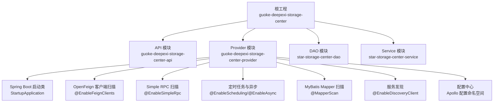
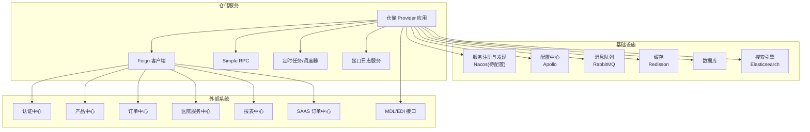
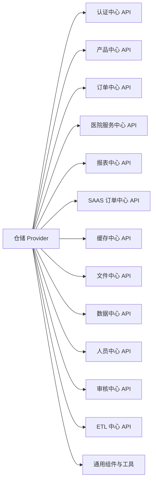

# 微服务架构设计

<cite>
**本文引用的文件**
- [README.md](file://README.md)
- [pom.xml](file://pom.xml)
- [guoke-deepexi-storage-center-api/pom.xml](file://guoke-deepexi-storage-center-api/pom.xml)
- [guoke-deepexi-storage-center-provider/pom.xml](file://guoke-deepexi-storage-center-provider/pom.xml)
- [StartupApplication.java](file://guoke-deepexi-storage-center-provider/src/main/java/com/ deepexi/storage/StartupApplication.java)
- [application.properties](file://guoke-deepexi-storage-center-provider/src/main/resources/application.properties)
- [ScInterfaceLogService.java](file://guoke-deepexi-storage-center-provider/src/main/java/com/deepexi/storage/service/ScInterfaceLogService.java)
- [ScInterfaceLogServiceImpl.java](file://guoke-deepexi-storage-center-provider/src/main/java/com/deepexi/storage/service/impl/ScInterfaceLogServiceImpl.java)
- [GetStockMDLHandler.java](file://guoke-deepexi-storage-center-provider/src/main/java/com/deepexi/storage/scheduled/GetStockMDLHandler.java)
</cite>

## 目录
1. [引言](#引言)
2. [项目结构](#项目结构)
3. [核心组件](#核心组件)
4. [架构总览](#架构总览)
5. [详细组件分析](#详细组件分析)
6. [依赖分析](#依赖分析)
7. [性能考虑](#性能考虑)
8. [故障排查指南](#故障排查指南)
9. [结论](#结论)
10. [附录](#附录)

## 引言
本设计文档面向国科恒泰仓储管理系统，基于现有代码库梳理其微服务化现状与可演进方向，明确服务拆分策略、服务边界、模块化理念，以及服务发现、配置中心、消息队列、定时任务等基础设施的设计要点。文档同时给出服务间通信方式（REST/Feign、RPC）、分布式事务与异步处理建议，并提供部署拓扑与依赖关系图示。

## 项目结构
该仓库采用多模块聚合工程组织，包含仓储 API 模块、仓储 Provider 实例、DAO 与 Service 公共模块。Provider 模块是实际运行的服务端应用，负责业务逻辑、数据访问、对外接口与内部集成。

图表来源
- [pom.xml:21-26](file://pom.xml#L21-L26)
- [guoke-deepexi-storage-center-provider/pom.xml:15-394](file://guoke-deepexi-storage-center-provider/pom.xml#L15-L394)
- [guoke-deepexi-storage-center-api/pom.xml:14-63](file://guoke-deepexi-storage-center-api/pom.xml#L14-L63)
- [StartupApplication.java:19-27](file://guoke-deepexi-storage-center-provider/src/main/java/com/deepexi/storage/StartupApplication.java#L19-L27)
- [application.properties:1-6](file://guoke-deepexi-storage-center-provider/src/main/resources/application.properties#L1-L6)

章节来源
- [pom.xml:21-26](file://pom.xml#L21-L26)
- [guoke-deepexi-storage-center-provider/pom.xml:15-394](file://guoke-deepexi-storage-center-provider/pom.xml#L15-L394)
- [guoke-deepexi-storage-center-api/pom.xml:14-63](file://guoke-deepexi-storage-center-api/pom.xml#L14-L63)
- [StartupApplication.java:19-27](file://guoke-deepexi-storage-center-provider/src/main/java/com/deepexi/storage/StartupApplication.java#L19-L27)
- [application.properties:1-6](file://guoke-deepexi-storage-center-provider/src/main/resources/application.properties#L1-L6)

## 核心组件
- 启动与装配
  - 应用入口通过 Spring Boot 启动，启用服务发现、Feign 客户端、RPC、定时任务、异步、事务管理、MyBatis Mapper 扫描与 Swak 扫描。
- 配置中心
  - 通过 Apollo 启动配置，启用命名空间列表，覆盖数据库、MyBatis、通用、Nacos、Redis、Prometheus、XXL-Job、RabbitMQ、Elasticsearch 等。
- 外部接口与集成
  - 通过 Feign 客户端对接多个中心（认证、报表、产品、订单、医院、SAAS 等），并具备接口日志记录能力。
- 消息与定时任务
  - 引入 AMQP 依赖，支持 RabbitMQ；提供 XXL-Job 与自定义调度器，具备定时拉取外部库存的任务实现。
- 数据访问
  - 使用 MyBatis Plus 与 Mapper 接口，结合 Redisson 提供分布式能力。

章节来源
- [StartupApplication.java:19-27](file://guoke-deepexi-storage-center-provider/src/main/java/com/deepexi/storage/StartupApplication.java#L19-L27)
- [application.properties:1-6](file://guoke-deepexi-storage-center-provider/src/main/resources/application.properties#L1-L6)
- [guoke-deepexi-storage-center-provider/pom.xml:97-11](file://guoke-deepexi-storage-center-provider/pom.xml#L97-L11)
- [ScInterfaceLogService.java:6-19](file://guoke-deepexi-storage-center-provider/src/main/java/com/deepexi/storage/service/ScInterfaceLogService.java#L6-L19)
- [ScInterfaceLogServiceImpl.java:11-29](file://guoke-deepexi-storage-center-provider/src/main/java/com/deepexi/storage/service/impl/ScInterfaceLogServiceImpl.java#L11-L29)
- [GetStockMDLHandler.java:34-62](file://guoke-deepexi-storage-center-provider/src/main/java/com/deepexi/storage/scheduled/GetStockMDLHandler.java#L34-L62)

## 架构总览
下图展示仓储服务在微服务体系中的位置与周边依赖，包括服务发现、配置中心、消息中间件、定时任务与外部系统对接。

图表来源
- [StartupApplication.java:19-27](file://guoke-deepexi-storage-center-provider/src/main/java/com/deepexi/storage/StartupApplication.java#L19-L27)
- [application.properties:1-6](file://guoke-deepexi-storage-center-provider/src/main/resources/application.properties#L1-L6)
- [guoke-deepexi-storage-center-provider/pom.xml:97-11](file://guoke-deepexi-storage-center-provider/pom.xml#L97-L11)
- [ScInterfaceLogService.java:6-19](file://guoke-deepexi-storage-center-provider/src/main/java/com/deepexi/storage/service/ScInterfaceLogService.java#L6-L19)
- [ScInterfaceLogServiceImpl.java:11-29](file://guoke-deepexi-storage-center-provider/src/main/java/com/deepexi/storage/service/impl/ScInterfaceLogServiceImpl.java#L11-L29)
- [GetStockMDLHandler.java:34-62](file://guoke-deepexi-storage-center-provider/src/main/java/com/deepexi/storage/scheduled/GetStockMDLHandler.java#L34-L62)

## 详细组件分析

### 组件一：服务发现与注册
- 能力体现
  - 启动类启用服务发现注解，表明应用具备向注册中心注册与发现的能力。
- 设计建议
  - 明确注册中心地址与命名空间，设置健康检查与元数据标签，确保多实例弹性伸缩与故障剔除。
- 关键路径
  - [StartupApplication.java:20-20](file://guoke-deepexi-storage-center-provider/src/main/java/com/deepexi/storage/StartupApplication.java#L20-L20)

章节来源
- [StartupApplication.java:20-20](file://guoke-deepexi-storage-center-provider/src/main/java/com/deepexi/storage/StartupApplication.java#L20-L20)

### 组件二：配置中心集成（Apollo）
- 能力体现
  - 启动时加载多个命名空间，覆盖数据库、缓存、监控、定时任务、消息队列、搜索等配置。
- 设计建议
  - 将敏感配置与环境相关配置集中管理，支持灰度发布与动态刷新。
- 关键路径
  - [application.properties:2-5](file://guoke-deepexi-storage-center-provider/src/main/resources/application.properties#L2-L5)

章节来源
- [application.properties:2-5](file://guoke-deepexi-storage-center-provider/src/main/resources/application.properties#L2-L5)

### 组件三：服务间通信（Feign 与 RPC）
- Feign 客户端
  - 启用 Feign 扫描，自动注入客户端接口，统一外部系统对接风格。
  - 依赖中包含认证、报表、产品、订单、医院、SAAS 等中心 API，体现跨域集成。
- RPC
  - 启用 Simple RPC 扫描，便于内部或跨服务的高性能调用。
- 设计建议
  - 对外统一使用 Feign，对内可按场景选择 RPC；为每个客户端配置超时、重试、熔断与隔离策略。
- 关键路径
  - [StartupApplication.java:21-21](file://guoke-deepexi-storage-center-provider/src/main/java/com/deepexi/storage/StartupApplication.java#L21-L21)
  - [guoke-deepexi-storage-center-provider/pom.xml:20-49](file://guoke-deepexi-storage-center-provider/pom.xml#L20-L49)

章节来源
- [StartupApplication.java:21-21](file://guoke-deepexi-storage-center-provider/src/main/java/com/deepexi/storage/StartupApplication.java#L21-L21)
- [guoke-deepexi-storage-center-provider/pom.xml:20-49](file://guoke-deepexi-storage-center-provider/pom.xml#L20-L49)

### 组件四：消息队列与异步处理
- 能力体现
  - 引入 AMQP 依赖，具备与 RabbitMQ 集成的基础能力。
  - 存在定时任务与调度器，支持周期性任务执行。
- 设计建议
  - 明确消息模型与 Topic/Exchange/Binding 规则；对关键流程采用可靠投递与幂等消费；对长耗时任务采用异步化与补偿机制。
- 关键路径
  - [guoke-deepexi-storage-center-provider/pom.xml:97-98](file://guoke-deepexi-storage-center-provider/pom.xml#L97-L98)
  - [GetStockMDLHandler.java:34-62](file://guoke-deepexi-storage-center-provider/src/main/java/com/deepexi/storage/scheduled/GetStockMDLHandler.java#L34-L62)

章节来源
- [guoke-deepexi-storage-center-provider/pom.xml:97-98](file://guoke-deepexi-storage-center-provider/pom.xml#L97-L98)
- [GetStockMDLHandler.java:34-62](file://guoke-deepexi-storage-center-provider/src/main/java/com/deepexi/storage/scheduled/GetStockMDLHandler.java#L34-L62)

### 组件五：接口日志与可观测性
- 能力体现
  - 提供接口日志服务接口与实现，统一记录请求/响应与业务标识。
- 设计建议
  - 将日志写入集中式存储或链路追踪系统，配合 Prometheus/Grafana 做指标监控。
- 关键路径
  - [ScInterfaceLogService.java:6-19](file://guoke-deepexi-storage-center-provider/src/main/java/com/deepexi/storage/service/ScInterfaceLogService.java#L6-L19)
  - [ScInterfaceLogServiceImpl.java:11-29](file://guoke-deepexi-storage-center-provider/src/main/java/com/deepexi/storage/service/impl/ScInterfaceLogServiceImpl.java#L11-L29)

章节来源
- [ScInterfaceLogService.java:6-19](file://guoke-deepexi-storage-center-provider/src/main/java/com/deepexi/storage/service/ScInterfaceLogService.java#L6-L19)
- [ScInterfaceLogServiceImpl.java:11-29](file://guoke-deepexi-storage-center-provider/src/main/java/com/deepexi/storage/service/impl/ScInterfaceLogServiceImpl.java#L11-L29)

### 组件六：定时任务与外部系统对接
- 能力体现
  - 提供定时任务处理器，演示从接口中心调用外部系统（如 MDL/EDI）并回调本地接口。
- 设计建议
  - 对定时任务进行去重、限流与失败重试；对外部系统调用增加熔断与降级策略。
- 关键路径
  - [GetStockMDLHandler.java:34-62](file://guoke-deepexi-storage-center-provider/src/main/java/com/deepexi/storage/scheduled/GetStockMDLHandler.java#L34-L62)

章节来源
- [GetStockMDLHandler.java:34-62](file://guoke-deepexi-storage-center-provider/src/main/java/com/deepexi/storage/scheduled/GetStockMDLHandler.java#L34-L62)

### 组件七：数据访问与缓存
- 能力体现
  - 使用 MyBatis Plus 与 Mapper 接口；引入 Redisson 支持分布式锁与缓存。
- 设计建议
  - 对热点数据做缓存，对写操作采用最终一致性策略；对复杂查询使用索引优化。
- 关键路径
  - [guoke-deepexi-storage-center-provider/pom.xml:173-176](file://guoke-deepexi-storage-center-provider/pom.xml#L173-L176)

章节来源
- [guoke-deepexi-storage-center-provider/pom.xml:173-176](file://guoke-deepexi-storage-center-provider/pom.xml#L173-L176)

## 依赖分析
仓储 Provider 模块对多个中心与公共组件存在依赖，形成“仓储服务”为中心的辐射型依赖网络。

图表来源
- [guoke-deepexi-storage-center-provider/pom.xml:16-394](file://guoke-deepexi-storage-center-provider/pom.xml#L16-L394)

章节来源
- [guoke-deepexi-storage-center-provider/pom.xml:16-394](file://guoke-deepexi-storage-center-provider/pom.xml#L16-L394)

## 性能考虑
- 服务发现与注册
  - 合理设置实例心跳与健康检查阈值，避免误剔除与雪崩效应。
- 配置中心
  - 对高频读取的配置进行本地缓存与批量刷新，降低 AP 轮询压力。
- 通信与限流
  - Feign/RPC 层面配置超时、重试与熔断；对下游限流与排队，防止级联故障。
- 缓存与数据库
  - 热点数据走缓存，冷数据走数据库；写操作采用异步落库与幂等保障。
- 消息队列
  - 分区与消费者组合理规划，避免单点瓶颈；对死信与重试进行治理。
- 定时任务
  - 任务去重、分片与抖动控制，避免重复执行与资源争抢。

## 故障排查指南
- 服务无法注册/发现
  - 检查注册中心地址与命名空间配置，确认服务名与实例健康状态。
- 配置不生效
  - 核对 Apollo 命名空间是否正确加载，关注配置合并与优先级。
- 外部接口调用失败
  - 查看接口日志服务记录，定位请求/响应异常；结合熔断与重试策略。
- 消息积压/丢失
  - 检查队列/交换机绑定、消费者并发与 ACK 策略；对死信队列进行治理。
- 定时任务异常
  - 核对任务去重与幂等实现，查看调度器日志与重试次数。

章节来源
- [ScInterfaceLogService.java:6-19](file://guoke-deepexi-storage-center-provider/src/main/java/com/deepexi/storage/service/ScInterfaceLogService.java#L6-L19)
- [ScInterfaceLogServiceImpl.java:11-29](file://guoke-deepexi-storage-center-provider/src/main/java/com/deepexi/storage/service/impl/ScInterfaceLogServiceImpl.java#L11-L29)
- [GetStockMDLHandler.java:34-62](file://guoke-deepexi-storage-center-provider/src/main/java/com/deepexi/storage/scheduled/GetStockMDLHandler.java#L34-L62)

## 结论
当前代码库已具备微服务化的基础能力：服务发现、配置中心、Feign/RPC、消息队列与定时任务。建议在此基础上完善网关路由、全链路监控、分布式事务与异步编排，以支撑更复杂的仓储业务场景与高可用要求。

## 附录
- 项目背景与用途
  - 仓库中包含 JSON 示例数据，表明系统与物流/仓储/订单等业务密切相关，适合构建围绕仓储为核心的微服务体系。
- 参考路径
  - [README.md:1-92](file://README.md#L1-L92)

章节来源
- [README.md:1-92](file://README.md#L1-L92)