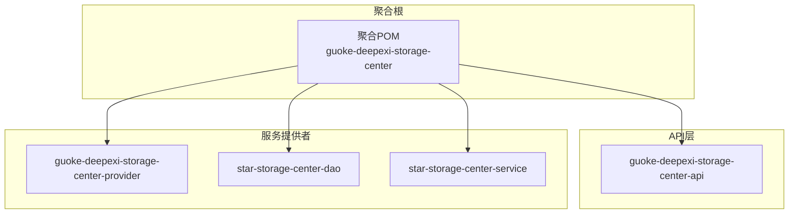
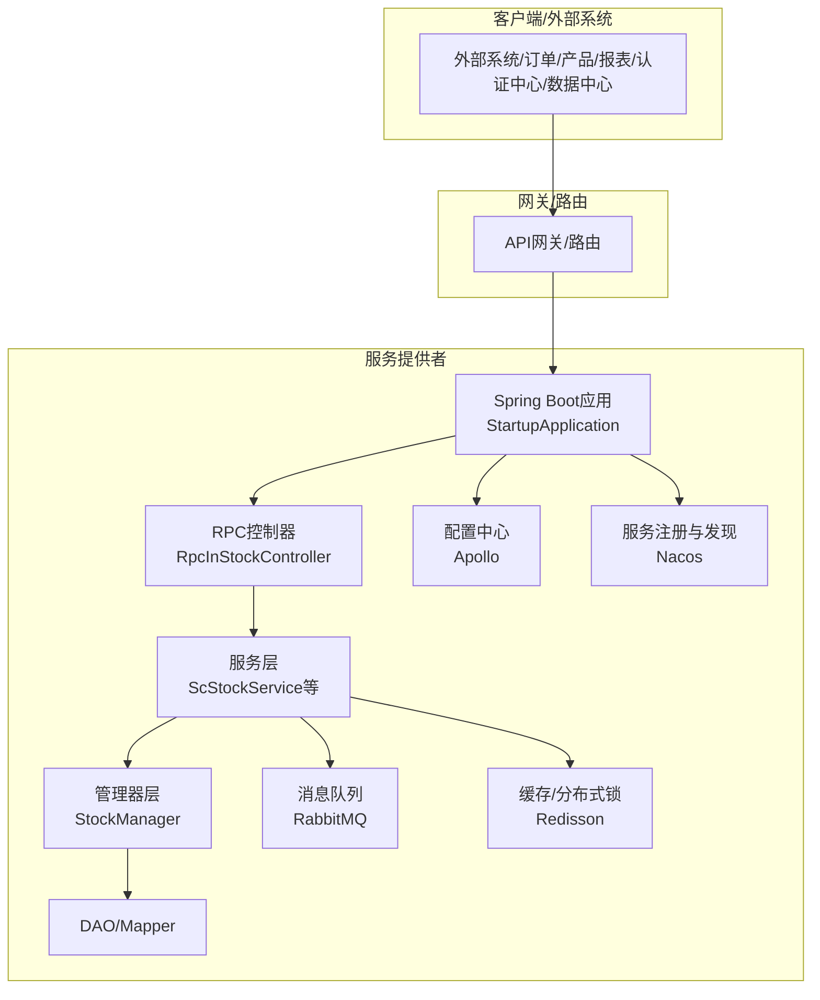
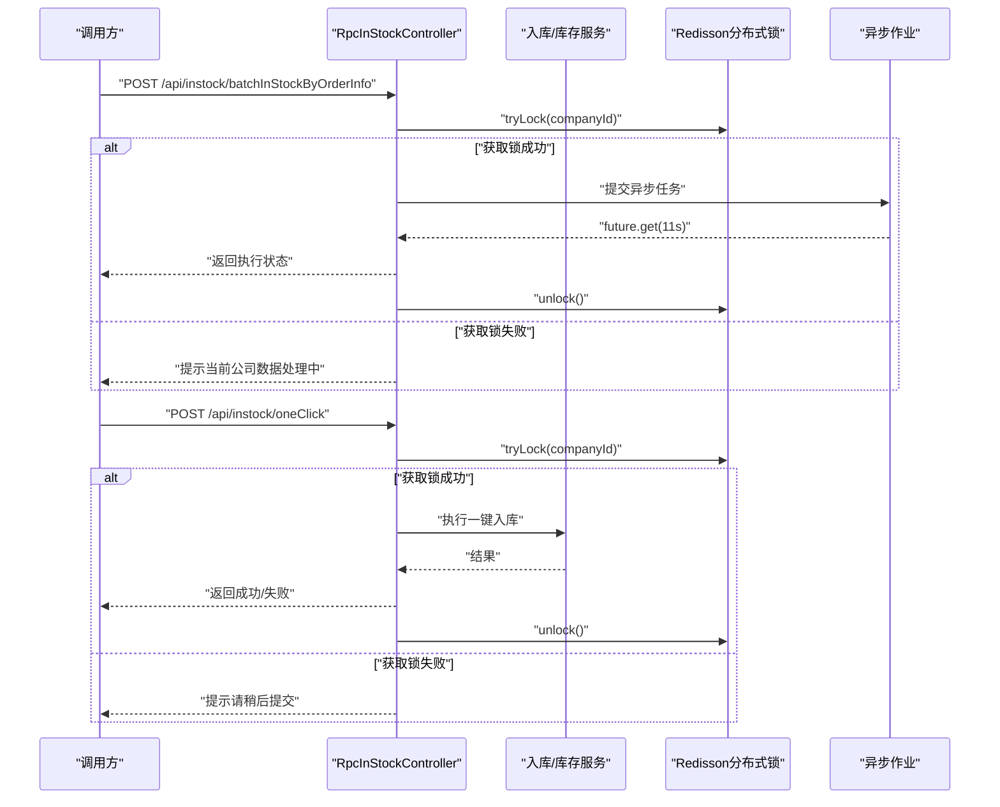
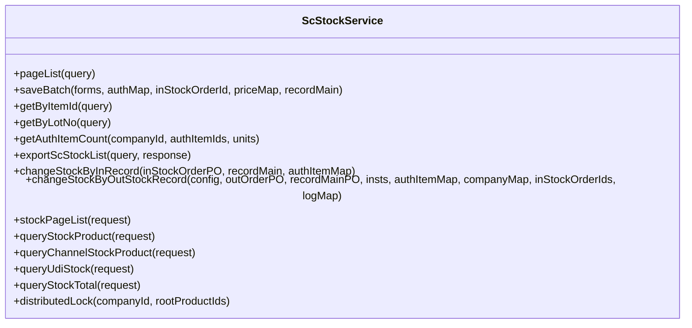
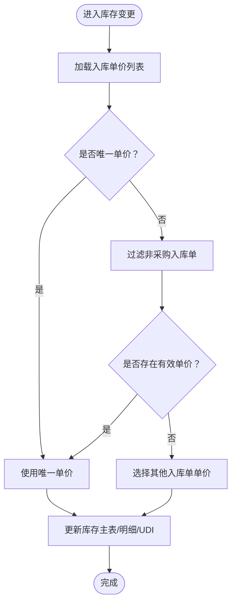
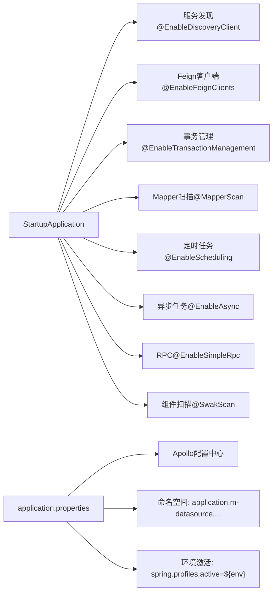
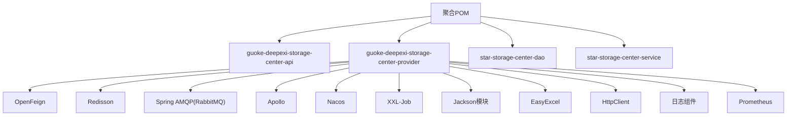

# 架构设计

<cite>
**本文引用的文件**   
- [README.md](file://README.md)
- [pom.xml](file://pom.xml)
- [application.properties](file://guoke-deepexi-storage-center-provider/src/main/resources/application.properties)
- [StartupApplication.java](file://guoke-deepexi-storage-center-provider/src/main/java/com/deepexi/storage/StartupApplication.java)
- [RpcInStockController.java](file://guoke-deepexi-storage-center-provider/src/main/java/com/deepexi/storage/controller/rpc/RpcInStockController.java)
- [ScStockService.java](file://guoke-deepexi-storage-center-provider/src/main/java/com/deepexi/storage/service/ScStockService.java)
- [StockManager.java](file://guoke-deepexi-storage-center-provider/src/main/java/com/deepexi/storage/manager/StockManager.java)
- [guoke-deepexi-storage-center-api/pom.xml](file://guoke-deepexi-storage-center-api/pom.xml)
- [guoke-deepexi-storage-center-provider/pom.xml](file://guoke-deepexi-storage-center-provider/pom.xml)
</cite>

## 目录
1. [引言](#引言)
2. [项目结构](#项目结构)
3. [核心组件](#核心组件)
4. [架构总览](#架构总览)
5. [详细组件分析](#详细组件分析)
6. [依赖分析](#依赖分析)
7. [性能考虑](#性能考虑)
8. [故障排查指南](#故障排查指南)
9. [结论](#结论)
10. [附录](#附录)

## 引言
本文件面向国科恒泰仓储管理系统，提供从高层设计到实现细节的完整架构文档。系统采用微服务与模块化分层架构，围绕仓储核心业务（入库、出库、库存、库存预警、渠道库存、温控、调拨、EDIB2B对接等）构建，具备完善的接口抽象、分布式锁控制、异步作业与定时任务、多租户与多公司隔离能力，并通过统一配置中心、服务注册与发现、消息队列、缓存与监控等基础设施支撑高可用与可扩展性。

## 项目结构
项目采用 Maven 多模块聚合结构，主要模块如下：
- guoke-deepexi-storage-center-api：对外 DTO、枚举与 RPC 客户端定义，供其他模块与外部系统调用。
- guoke-deepexi-storage-center-provider：核心业务服务提供者，包含 Spring Boot 启动入口、控制器、服务、管理器、持久层与配置。
- star-storage-center-dao：DAO 层与 MyBatis Mapper 定义。
- star-storage-center-service：领域服务与业务编排层。

**图表来源**
- [pom.xml:21-26](file://pom.xml#L21-L26)

**章节来源**
- [pom.xml:1-68](file://pom.xml#L1-L68)

## 核心组件
- 启动与容器
  - Spring Boot 启动类启用服务发现、Feign 客户端、事务管理、MyBatis Mapper 扫描、定时任务与异步任务、RPC 能力与组件扫描。
- 控制器层
  - RPC 入库控制器集中暴露入库相关 RPC 接口，负责请求校验、分布式锁控制、异步任务提交、接口日志记录与响应封装。
- 服务层
  - 库存服务接口定义了库存查询、变更、导出、样品管理、渠道库存、价格与数量查询、红冲入库、调拨出库、物权变更等能力。
- 管理器层
  - 库存管理器承担库存计算、价格处理、出库相关库存同步与校验等职责，协调 Mapper 与服务层。
- 配置与运行
  - 应用通过 Apollo 配置中心加载命名空间，支持多环境激活与 Bean 定义覆盖。

**章节来源**
- [StartupApplication.java:14-27](file://guoke-deepexi-storage-center-provider/src/main/java/com/deepexi/storage/StartupApplication.java#L14-L27)
- [RpcInStockController.java:51-55](file://guoke-deepexi-storage-center-provider/src/main/java/com/deepexi/storage/controller/rpc/RpcInStockController.java#L51-L55)
- [ScStockService.java:44-297](file://guoke-deepexi-storage-center-provider/src/main/java/com/deepexi/storage/service/ScStockService.java#L44-L297)
- [StockManager.java:27-352](file://guoke-deepexi-storage-center-provider/src/main/java/com/deepexi/storage/manager/StockManager.java#L27-L352)
- [application.properties:1-6](file://guoke-deepexi-storage-center-provider/src/main/resources/application.properties#L1-L6)

## 架构总览
系统采用微服务与分层架构，结合 RPC 接口与 Feign 客户端实现跨模块与跨系统通信；通过 Redisson 实现分布式锁，保障并发一致性；通过 RabbitMQ、定时任务与异步作业实现削峰与解耦；通过 Apollo 配置中心与 Nacos 注册中心实现配置与服务治理。

**图表来源**
- [StartupApplication.java:19-27](file://guoke-deepexi-storage-center-provider/src/main/java/com/deepexi/storage/StartupApplication.java#L19-L27)
- [application.properties:1-6](file://guoke-deepexi-storage-center-provider/src/main/resources/application.properties#L1-L6)
- [RpcInStockController.java:51-55](file://guoke-deepexi-storage-center-provider/src/main/java/com/deepexi/storage/controller/rpc/RpcInStockController.java#L51-L55)

## 详细组件分析

### 组件A：RPC 入库控制器
- 职责
  - 提供入库通知单、入库单、一键入库、外部入库、扫码导入、验收/复核记录、欠货记录、渠道库存明细等 RPC 接口。
  - 使用 Redisson 分布式锁保护关键业务（如一键入库、按公司维度锁），避免并发冲突。
  - 异步执行批量一键入库，主线程等待异步结果并返回状态。
  - 记录接口日志，统一响应封装。
- 关键流程
  - 一键入库：获取分布式锁，执行业务，解锁。
  - 批量一键入库：在异步线程获取锁并执行，主线程等待最多约 11 秒，返回执行状态。
  - 外部入库：按应用+公司+通知单号组合锁，防止重复处理。
- 错误处理
  - 参数校验失败、业务异常、超时、线程中断均转换为统一响应并记录日志。

**图表来源**
- [RpcInStockController.java:360-460](file://guoke-deepexi-storage-center-provider/src/main/java/com/deepexi/storage/controller/rpc/RpcInStockController.java#L360-L460)

**章节来源**
- [RpcInStockController.java:51-55](file://guoke-deepexi-storage-center-provider/src/main/java/com/deepexi/storage/controller/rpc/RpcInStockController.java#L51-L55)
- [RpcInStockController.java:261-280](file://guoke-deepexi-storage-center-provider/src/main/java/com/deepexi/storage/controller/rpc/RpcInStockController.java#L261-L280)
- [RpcInStockController.java:406-460](file://guoke-deepexi-storage-center-provider/src/main/java/com/deepexi/storage/controller/rpc/RpcInStockController.java#L406-L460)
- [RpcInStockController.java:473-494](file://guoke-deepexi-storage-center-provider/src/main/java/com/deepexi/storage/controller/rpc/RpcInStockController.java#L473-L494)

### 组件B：库存服务接口
- 职责
  - 定义库存查询、导出、变更、样品管理、渠道库存、价格/数量查询、红冲入库、调拨出库、物权变更、分布式锁等能力。
  - 支持按公司、仓库、授权产品、批号/UDI 等多维查询与统计。
- 复杂度与性能
  - 查询与导出接口基于分页组件，复杂查询建议配合索引与缓存优化。
  - 分布式锁用于并发场景下的库存变更一致性。

**图表来源**
- [ScStockService.java:44-297](file://guoke-deepexi-storage-center-provider/src/main/java/com/deepexi/storage/service/ScStockService.java#L44-L297)

**章节来源**
- [ScStockService.java:44-297](file://guoke-deepexi-storage-center-provider/src/main/java/com/deepexi/storage/service/ScStockService.java#L44-L297)

### 组件C：库存管理器
- 职责
  - 承担库存计算、价格处理（多入库单单价选择）、出库相关库存同步与校验等。
  - 协调 Mapper 与服务层，保证库存主表、明细表、UDI 表的一致性更新。
- 并发与一致性
  - 结合服务层分布式锁与 Redisson，避免并发扣减导致的超卖或死锁。

**图表来源**
- [StockManager.java:44-71](file://guoke-deepexi-storage-center-provider/src/main/java/com/deepexi/storage/manager/StockManager.java#L44-L71)

**章节来源**
- [StockManager.java:27-352](file://guoke-deepexi-storage-center-provider/src/main/java/com/deepexi/storage/manager/StockManager.java#L27-L352)

### 组件D：启动与运行环境
- 启动注解
  - 开启服务发现、Feign 客户端、事务管理、MyBatis Mapper 扫描、定时与异步任务、RPC 能力与组件扫描。
- 运行配置
  - Apollo 配置中心启用与命名空间加载，支持多环境激活与 Bean 覆盖。

**图表来源**
- [StartupApplication.java:19-27](file://guoke-deepexi-storage-center-provider/src/main/java/com/deepexi/storage/StartupApplication.java#L19-L27)
- [application.properties:1-6](file://guoke-deepexi-storage-center-provider/src/main/resources/application.properties#L1-L6)

**章节来源**
- [StartupApplication.java:14-27](file://guoke-deepexi-storage-center-provider/src/main/java/com/deepexi/storage/StartupApplication.java#L14-L27)
- [application.properties:1-6](file://guoke-deepexi-storage-center-provider/src/main/resources/application.properties#L1-L6)

## 依赖分析
- 模块依赖
  - provider 依赖 api、dao、service 以及各类公共组件与第三方 SDK。
  - api 模块依赖 Swagger、OpenFeign、通用优化组件与各中心 API。
- 第三方与中间件
  - 配置：Apollo、Nacos
  - 缓存与分布式锁：Redisson
  - 消息：Spring AMQP（RabbitMQ）
  - 定时任务：XXL-Job（命名空间中声明）
  - 日志与监控：日志组件、Prometheus 命名空间
  - 安全与认证：认证中心 API
  - 文件与报表：EasyExcel、Hutool
  - HTTP 客户端：Apache HttpClient
  - JSON：Jackson 模块

**图表来源**
- [guoke-deepexi-storage-center-api/pom.xml:14-63](file://guoke-deepexi-storage-center-api/pom.xml#L14-L63)
- [guoke-deepexi-storage-center-provider/pom.xml:15-394](file://guoke-deepexi-storage-center-provider/pom.xml#L15-L394)

**章节来源**
- [guoke-deepexi-storage-center-api/pom.xml:14-63](file://guoke-deepexi-storage-center-api/pom.xml#L14-L63)
- [guoke-deepexi-storage-center-provider/pom.xml:15-394](file://guoke-deepexi-storage-center-provider/pom.xml#L15-L394)

## 性能考虑
- 并发控制
  - 使用 Redisson 分布式锁对关键业务（一键入库、外部入库、按公司维度）加锁，避免并发写导致的数据不一致。
- 异步化
  - 批量一键入库通过异步线程执行，主线程快速返回，降低请求等待时间。
- 查询与导出
  - 分页查询与导出接口建议配合数据库索引与缓存策略，减少慢查询风险。
- 中间件
  - 消息队列用于削峰填谷，定时任务与 XXL-Job 用于周期性任务编排。
- 配置与监控
  - Apollo 动态配置与 Prometheus 监控指标有助于运行期性能调优与问题定位。

## 故障排查指南
- 常见问题
  - 分布式锁未释放：检查业务异常分支是否遗漏解锁，或使用 tryLock + finally 解锁。
  - 异步任务超时：确认异步线程执行耗时与等待时间设置，必要时调整超时阈值。
  - 接口日志缺失：确认接口日志记录与命名空间配置是否生效。
- 定位手段
  - 查看统一响应封装与异常日志输出。
  - 检查 Apollo 命名空间与环境变量是否正确加载。
  - 使用 Prometheus 指标与日志检索定位热点接口与慢查询。

**章节来源**
- [RpcInStockController.java:261-280](file://guoke-deepexi-storage-center-provider/src/main/java/com/deepexi/storage/controller/rpc/RpcInStockController.java#L261-L280)
- [RpcInStockController.java:406-460](file://guoke-deepexi-storage-center-provider/src/main/java/com/deepexi/storage/controller/rpc/RpcInStockController.java#L406-L460)
- [application.properties:1-6](file://guoke-deepexi-storage-center-provider/src/main/resources/application.properties#L1-L6)

## 结论
本系统通过清晰的模块划分与分层设计，结合分布式锁、异步化与定时任务等手段，在保证高并发一致性的同时提升了吞吐与可维护性。借助 Apollo、Nacos、RabbitMQ、Redisson、Prometheus 等基础设施，系统具备良好的可扩展性与可观测性。后续可在查询性能、缓存策略与跨系统对接标准化方面持续优化。

## 附录
- 技术栈与版本要点
  - Java 8（编译与目标）
  - Spring Boot、Spring Cloud、OpenFeign
  - MyBatis、Mapper 扫描
  - Redisson（分布式锁）
  - RabbitMQ（消息）
  - Apollo（配置中心）
  - XXL-Job（定时任务）
  - Jackson（JSON）
  - EasyExcel、Hutool
  - Swagger（API 文档）

**章节来源**
- [pom.xml:40-64](file://pom.xml#L40-L64)
- [guoke-deepexi-storage-center-provider/pom.xml:398-420](file://guoke-deepexi-storage-center-provider/pom.xml#L398-L420)
- [guoke-deepexi-storage-center-api/pom.xml:14-63](file://guoke-deepexi-storage-center-api/pom.xml#L14-L63)