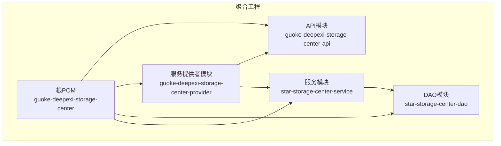
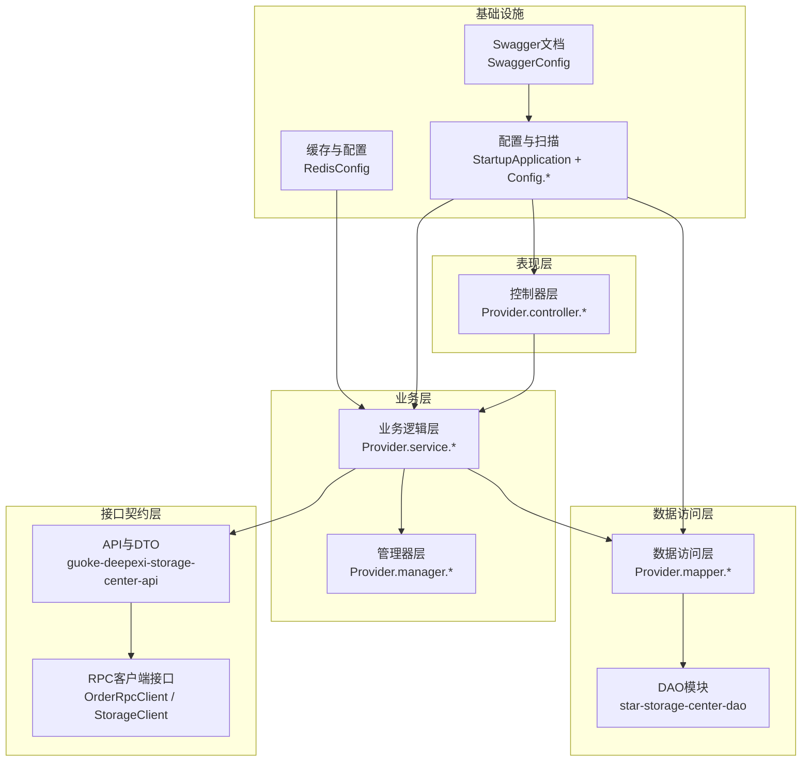
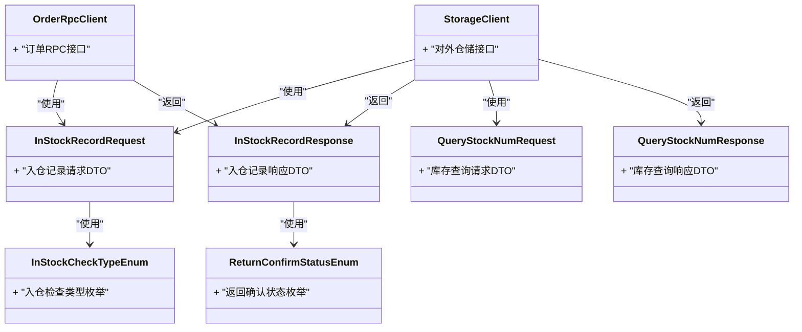
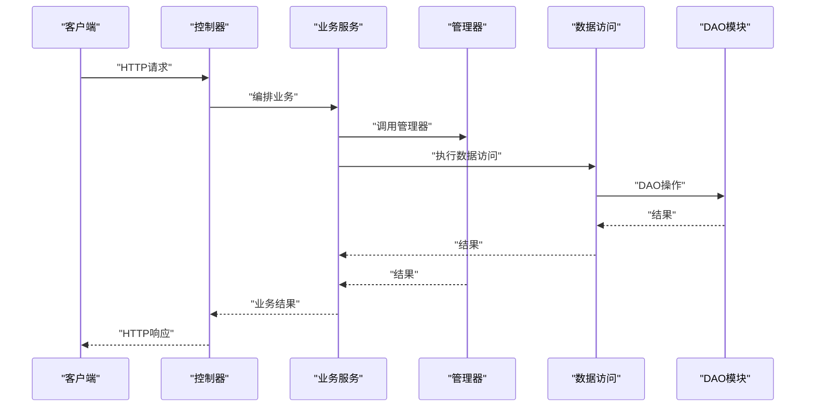
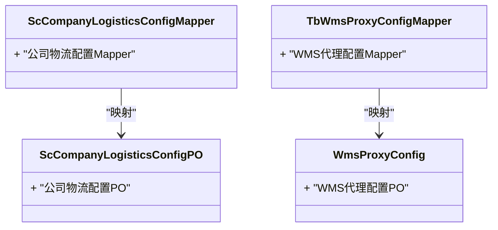
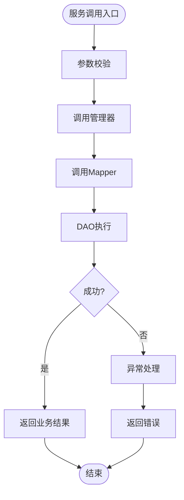
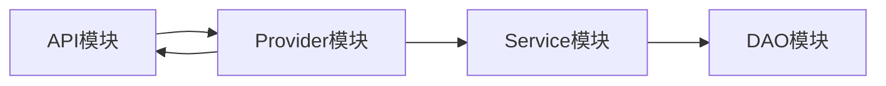

# 模块设计架构

<cite>
**本文档引用的文件**
- [根POM](file://pom.xml)
- [API模块POM](file://guoke-deepexi-storage-center-api/pom.xml)
- [Provider模块POM](file://guoke-deepexi-storage-center-provider/pom.xml)
- [DAO模块POM](file://star-storage-center-dao/pom.xml)
- [Service模块POM](file://star-storage-center-service/pom.xml)
- [启动类](file://guoke-deepexi-storage-center-provider/src/main/java/com/ deepexi/storage/StartupApplication.java)
- [应用配置](file://guoke-deepexi-storage-center-provider/src/main/resources/application.properties)
- [Web MVC配置](file://guoke-deepexi-storage-center-provider/src/main/java/com/deepexi/storage/common/config/MvcConfig.java)
- [Swagger配置](file://guoke-deepexi-storage-center-provider/src/main/java/com/deepexi/storage/common/config/SwaggerConfig.java)
- [Redis配置](file://guoke-deepexi-storage-center-provider/src/main/java/com/deepexi/storage/common/config/RedisConfig.java)
- [仓储客户端接口](file://guoke-deepexi-storage-center-api/src/main/java/com/deepexi/api/storage/StorageClient.java)
- [订单RPC客户端接口](file://guoke-deepexi-storage-center-api/src/main/java/com/deepexi/api/storage/OrderRpcClient.java)
- [入仓检查类型响应](file://guoke-deepexi-storage-center-api/src/main/java/com/deepexi/api/storage/dto/check/InStockCheckTypeResponse.java)
- [关闭订单检查请求](file://guoke-deepexi-storage-center-api/src/main/java/com/deepexi/api/storage/dto/closeorder/CheckCloseOrderRequest.java)
- [关闭订单检查响应](file://guoke-deepexi/storage/dto/closeorder/CheckCloseOrderResponse.java)
- [委托出库请求](file://guoke-deepexi-storage-center-api/src/main/java/com/deepexi/api/storage/dto/consignment/ConsignmentRequest.java)
- [委托出库响应](file://guoke-deepexi-storage-center-api/src/main/java/com/deepexi/api/storage/dto/consignment/ConsignmentRespond.java)
- [消费退回保存请求](file://guoke-deepexi-storage-center-api/src/main/java/com/deepexi/api/storage/dto/consumeback/ConsumeBackSaveRequest.java)
- [入仓相关性分页请求](file://guoke-deepexi-storage-center-api/src/main/java/com/deepexi/api/storage/dto/correlation/InStockCorrelationPageRequest.java)
- [入仓相关性分页响应](file://guoke-deepexi-storage-center-api/src/main/java/com/deepexi/api/storage/dto/correlation/InStockCorrelationPageResponse.java)
- [出库物流请求](file://guoke-deepexi-storage-center-api/src/main/java/com/deepexi/api/storage/dto/logistics/OutStockRecordLogisticsRequest.java)
- [出库物流响应](file://guoke-deepexi-storage-center-api/src/main/java/com/deepexi/api/storage/dto/logistics/OutStockRecordLogisticsResponse.java)
- [入仓记录请求](file://guoke-deepexi-storage-center-api/src/main/java/com/deepexi/api/storage/dto/in/InStockRecordRequest.java)
- [入仓记录响应](file://guoke-deepexi-storage-center-api/src/main/java/com/deepexi/api/storage/dto/in/InStockRecordResponse.java)
- [初始化库存主表查询请求](file://guoke-deepexi-storage-center-api/src/main/java/com/deepexi/api/storage/dto/initstock/QueryInitStockMainRequest.java)
- [初始化库存主表查询响应](file://guoke-deepexi-storage-center-api/src/main/java/com/deepexi/api/storage/dto/initstock/QueryInitStockMainResponse.java)
- [拣货查询请求](file://guoke-deepexi-storage-center-api/src/main/java/com/deepexi/api/storage/dto/pick/QueryPickDetailRequest.java)
- [拣货查询响应](file://guoke-deepexi-storage-center-api/src/main/java/com/deepexi/api/storage/dto/pick/QueryPickDetailResponse.java)
- [产品查询请求](file://guoke-deepexi-storage-center-api/src/main/java/com/deepexi/api/storage/dto/product/QueryProductRequest.java)
- [产品查询响应](file://guoke-deepexi-storage-center-api/src/main/java/com/deepexi/api/storage/dto/product/QueryProductResponse.java)
- [库存查询请求](file://guoke-deepexi-storage-center-api/src/main/java/com/deepexi/api/storage/dto/stock/QueryStockNumRequest.java)
- [库存查询响应](file://guoke-deepexi-storage-center-api/src/main/java/com/deepexi/api/storage/dto/stock/QueryStockNumResponse.java)
- [调拨主表查询请求](file://guoke-deepexi-storage-center-api/src/main/java/com/deepexi/api/storage/dto/transfer/QueryStockTransferMainRequest.java)
- [调拨主表查询响应](file://guoke-deepexi-storage-center-api/src/main/java/com/deepexi/api/storage/dto/transfer/QueryStockTransferMainRespond.java)
- [仓库映射请求](file://guoke-deepexi-storage-center-api/src/main/java/com/deepexi/api/storage/dto/warehouse/WarehouseMappingRequest.java)
- [仓库映射响应](file://guoke-deepexi-storage-center-api/src/main/java/com/deepexi/api/storage/dto/warehouse/WarehouseMappingResponse.java)
- [入仓检查枚举](file://guoke-deepexi-storage-center-api/src/main/java/com/deepexi/api/storage/enums/in/InStockCheckTypeEnum.java)
- [出库枚举](file://guoke-deepexi-storage-center-api/src/main/java/com/deepexi/api/storage/enums/out/OutStockEnum.java)
- [返回确认状态枚举](file://guoke-deepexi-storage-center-api/src/main/java/com/deepexi/api/storage/enums/returnConfirm/ReturnConfirmStatusEnum.java)
- [仓储常量](file://guoke-deepexi-storage-center-provider/src/main/java/com/deepexi/storage/constans/StorageConstant.java)
- [仓储Redis常量](file://guoke-deepexi-storage-center-provider/src/main/java/com/deepexi/storage/constans/StorageRedisConstant.java)
- [公司代码常量](file://guoke-deepexi-storage-center-provider/src/main/java/com/deepexi/storage/constans/CompanyCodeConstans.java)
- [接口业务常量](file://guoke-deepexi-storage-center-provider/src/main/java/com/deepexi/storage/constans/InterfaceBusinessConstans.java)
- [接口收发常量](file://guoke-deepexi-storage-center-provider/src/main/java/com/deepexi/storage/constans/InterfaceSendOrReceiveConstans.java)
- [U8数据状态常量](file://guoke-deepexi-storage-center-provider/src/main/java/com/deepexi/storage/constans/U8DataStatus.java)
- [入仓处理管道](file://guoke-deepexi-storage-center-provider/src/main/java/com/deepexi/storage/handler/in/pipe/InLoadConfigPipe.java)
- [出仓处理管道](file://guoke-deepexi-storage-center-provider/src/main/java/com/deepexi/storage/handler/out/pipe/OutLoadConfigPipe.java)
- [配置管理器](file://guoke-deepexi-storage-center-provider/src/main/java/com/deepexi/storage/manager/ConfigManager.java)
- [公司物流配置服务](file://guoke-deepexi-storage-center-provider/src/main/java/com/deepexi/storage/service/ScCompanyLogisticsConfigService.java)
- [WMS代理配置服务](file://guoke-deepexi-storage-center-provider/src/main/java/com/deepexi/storage/service/TbWmsProxyConfigService.java)
- [公司物流配置服务实现](file://guoke-deepexi-storage-center-provider/src/main/java/com/deepexi/storage/service/impl/ScCompanyLogisticsConfigServiceImpl.java)
- [WMS代理配置服务实现](file://guoke-deepexi-storage-center-provider/src/main/java/com/deepexi/storage/service/impl/TbWmsProxyConfigServiceImpl.java)
- [公司物流配置映射](file://guoke-deepexi-storage-center-provider/src/main/java/com/deepexi/storage/mapper/logistics/ScCompanyLogisticsConfigMapper.java)
- [WMS代理配置映射](file://guoke-deepexi-storage-center-provider/src/main/java/com/deepexi/storage/mapper/TbWmsProxyConfigMapper.java)
- [公司物流配置PO](file://guoke-deepexi-storage-center-provider/src/main/java/com/deepexi/storage/model/ScCompanyLogisticsConfigPO.java)
- [WMS代理配置PO](file://guoke-deepexi-storage-center-provider/src/main/java/com/deepexi/storage/model/WmsProxyConfig.java)
</cite>

## 目录
1. [引言](#引言)
2. [项目结构](#项目结构)
3. [核心组件](#核心组件)
4. [架构总览](#架构总览)
5. [详细组件分析](#详细组件分析)
6. [依赖分析](#依赖分析)
7. [性能考虑](#性能考虑)
8. [故障排查指南](#故障排查指南)
9. [结论](#结论)
10. [附录](#附录)

## 引言
本架构文档面向国科恒泰仓储管理系统，系统采用多模块分层设计，围绕API接口模块、服务提供者模块、DAO数据访问模块与服务模块进行组织。目标是明确各模块职责边界、依赖关系与接口定义，阐述控制器层、业务逻辑层、数据访问层的分层架构，以及模块间的依赖注入、接口抽象与实现分离原则；同时提供模块架构图与包结构示意，覆盖模块化测试策略与独立部署能力。

## 项目结构
系统以Maven聚合工程形式组织，包含四个核心模块：
- guoke-deepexi-storage-center-api：对外API与DTO定义，统一契约与接口抽象
- guoke-deepexi-storage-center-provider：服务提供者，包含控制器、业务服务、数据访问与配置
- star-storage-center-dao：数据访问层（MyBatis Plus + PageHelper）
- star-storage-center-service：服务封装层（对DAO的进一步封装与事务控制）

图表来源
- [根POM:21-26](file://pom.xml#L21-L26)
- [API模块POM:1-88](file://guoke-deepexi-storage-center-api/pom.xml#L1-L88)
- [Provider模块POM:1-422](file://guoke-deepexi-storage-center-provider/pom.xml#L1-L422)
- [DAO模块POM:1-36](file://star-storage-center-dao/pom.xml#L1-L36)
- [Service模块POM:1-32](file://star-storage-center-service/pom.xml#L1-L32)

章节来源
- [根POM:21-26](file://pom.xml#L21-L26)
- [API模块POM:1-88](file://guoke-deepexi-storage-center-api/pom.xml#L1-L88)
- [Provider模块POM:1-422](file://guoke-deepexi-storage-center-provider/pom.xml#L1-L422)
- [DAO模块POM:1-36](file://star-storage-center-dao/pom.xml#L1-L36)
- [Service模块POM:1-32](file://star-storage-center-service/pom.xml#L1-L32)

## 核心组件
- API接口模块（guoke-deepexi-storage-center-api）
  - 职责：定义仓储领域对外API、DTO、枚举与RPC客户端接口，作为跨系统集成的契约层
  - 关键点：通过OpenFeign依赖与外部中心对接，统一数据结构与状态枚举
- 服务提供者模块（guoke-deepexi-storage-center-provider）
  - 职责：承载业务控制器、业务服务、数据访问、配置与调度等运行时能力
  - 关键点：启动类启用服务发现、Feign、事务、MyBatis Mapper扫描、定时任务与RPC
- DAO模块（star-storage-center-dao）
  - 职责：基于MyBatis Plus与PageHelper的数据持久化能力
- 服务模块（star-storage-center-service）
  - 职责：对DAO进行二次封装，提供带事务与业务语义的服务方法

章节来源
- [API模块POM:14-62](file://guoke-deepexi-storage-center-api/pom.xml#L14-L62)
- [Provider模块POM:15-394](file://guoke-deepexi-storage-center-provider/pom.xml#L15-L394)
- [DAO模块POM:13-24](file://star-storage-center-dao/pom.xml#L13-L24)
- [Service模块POM:14-19](file://star-storage-center-service/pom.xml#L14-L19)
- [启动类:14-28](file://guoke-deepexi-storage-center-provider/src/main/java/com/deepexi/storage/StartupApplication.java#L14-L28)

## 架构总览
系统采用分层架构与模块化设计，结合微服务特性，形成清晰的职责边界与依赖方向：

图表来源
- [启动类:14-28](file://guoke-deepexi-storage-center-provider/src/main/java/com/deepexi/storage/StartupApplication.java#L14-L28)
- [Swagger配置:17-29](file://guoke-deepexi-storage-center-provider/src/main/java/com/deepexi/storage/common/config/SwaggerConfig.java#L17-L29)
- [Redis配置:21-79](file://guoke-deepexi-storage-center-provider/src/main/java/com/deepexi/storage/common/config/RedisConfig.java#L21-L79)
- [仓储客户端接口](file://guoke-deepexi-storage-center-api/src/main/java/com/deepexi/api/storage/StorageClient.java)
- [订单RPC客户端接口](file://guoke-deepexi-storage-center-api/src/main/java/com/deepexi/api/storage/OrderRpcClient.java)

## 详细组件分析

### API接口模块设计
- 设计理念
  - 纯契约与数据传输对象定义，不包含业务实现
  - 通过OpenFeign依赖与外部中心交互，统一请求/响应结构
  - 使用枚举规范状态与类型，确保跨模块一致性
- 职责边界
  - 对外API定义：如入仓、出仓、库存、产品、调拨、物流、警告等
  - DTO与枚举：承载业务数据结构与状态枚举
  - RPC客户端接口：声明远程调用契约
- 依赖关系
  - 依赖通用优化库、Swagger注解、Feign等
  - 依赖产品中心、接口中心等外部API模块
- 接口抽象与实现分离
  - API模块仅定义接口与DTO，具体实现由Provider模块提供
- 独立部署能力
  - 可单独发布供其他模块或外部系统引用

图表来源
- [仓储客户端接口](file://guoke-deepexi-storage-center-api/src/main/java/com/deepexi/api/storage/StorageClient.java)
- [订单RPC客户端接口](file://guoke-deepexi-storage-center-api/src/main/java/com/deepexi/api/storage/OrderRpcClient.java)
- [入仓记录请求](file://guoke-deepexi-storage-center-api/src/main/java/com/deepexi/api/storage/dto/in/InStockRecordRequest.java)
- [入仓记录响应](file://guoke-deepexi-storage-center-api/src/main/java/com/deepexi/api/storage/dto/in/InStockRecordResponse.java)
- [库存查询请求](file://guoke-deepexi-storage-center-api/src/main/java/com/deepexi/api/storage/dto/stock/QueryStockNumRequest.java)
- [库存查询响应](file://guoke-deepexi-storage-center-api/src/main/java/com/deepexi/api/storage/dto/stock/QueryStockNumResponse.java)
- [入仓检查枚举](file://guoke-deepexi-storage-center-api/src/main/java/com/deepexi/api/storage/enums/in/InStockCheckTypeEnum.java)
- [返回确认状态枚举](file://guoke-deepexi-storage-center-api/src/main/java/com/deepexi/api/storage/enums/returnConfirm/ReturnConfirmStatusEnum.java)

章节来源
- [API模块POM:14-62](file://guoke-deepexi-storage-center-api/pom.xml#L14-L62)
- [入仓记录请求](file://guoke-deepexi-storage-center-api/src/main/java/com/deepexi/api/storage/dto/in/InStockRecordRequest.java)
- [入仓记录响应](file://guoke-deepexi-storage-center-api/src/main/java/com/deepexi/api/storage/dto/in/InStockRecordResponse.java)
- [库存查询请求](file://guoke-deepexi-storage-center-api/src/main/java/com/deepexi/api/storage/dto/stock/QueryStockNumRequest.java)
- [库存查询响应](file://guoke-deepexi-storage-center-api/src/main/java/com/deepexi/api/storage/dto/stock/QueryStockNumResponse.java)
- [入仓检查枚举](file://guoke-deepexi-storage-center-api/src/main/java/com/deepexi/api/storage/enums/in/InStockCheckTypeEnum.java)
- [返回确认状态枚举](file://guoke-deepexi-storage-center-api/src/main/java/com/deepexi/api/storage/enums/returnConfirm/ReturnConfirmStatusEnum.java)

### 服务提供者模块设计
- 设计理念
  - 启动类启用服务发现、Feign、事务、定时任务、RPC与MyBatis Mapper扫描
  - 通过配置类提供Web、Swagger、Redis等基础设施支持
  - 业务层通过管理器与数据访问层协作完成业务流程
- 职责边界
  - 控制器层：接收HTTP请求，编排业务流程
  - 业务逻辑层：封装业务规则与流程编排
  - 数据访问层：通过Mapper与DAO交互数据库
  - 管理器层：封装跨服务调用与配置管理
- 依赖关系
  - 依赖API模块（DTO与接口）、外部中心API、缓存与消息队列等
  - 通过Service模块间接依赖DAO模块
- 接口抽象与实现分离
  - API模块定义接口，Provider模块实现并暴露REST/Feign接口
- 独立部署能力
  - Provider模块可独立打包运行，具备完整的运行时依赖

图表来源
- [启动类:14-28](file://guoke-deepexi-storage-center-provider/src/main/java/com/deepexi/storage/StartupApplication.java#L14-L28)
- [配置管理器](file://guoke-deepexi-storage-center-provider/src/main/java/com/deepexi/storage/manager/ConfigManager.java)
- [公司物流配置服务实现](file://guoke-deepexi-storage-center-provider/src/main/java/com/deepexi/storage/service/impl/ScCompanyLogisticsConfigServiceImpl.java)
- [WMS代理配置服务实现](file://guoke-deepexi-storage-center-provider/src/main/java/com/deepexi/storage/service/impl/TbWmsProxyConfigServiceImpl.java)

章节来源
- [Provider模块POM:15-394](file://guoke-deepexi-storage-center-provider/pom.xml#L15-L394)
- [启动类:14-28](file://guoke-deepexi-storage-center-provider/src/main/java/com/deepexi/storage/StartupApplication.java#L14-L28)
- [Web MVC配置:13-57](file://guoke-deepexi-storage-center-provider/src/main/java/com/deepexi/storage/common/config/MvcConfig.java#L13-L57)
- [Swagger配置:17-44](file://guoke-deepexi-storage-center-provider/src/main/java/com/deepexi/storage/common/config/SwaggerConfig.java#L17-L44)
- [Redis配置:21-79](file://guoke-deepexi-storage-center-provider/src/main/java/com/deepexi/storage/common/config/RedisConfig.java#L21-L79)

### DAO数据访问模块设计
- 设计理念
  - 基于MyBatis Plus与PageHelper提供通用CRUD与分页能力
  - 通过Service模块向上提供带业务语义的服务方法
- 职责边界
  - Mapper接口：定义SQL映射与查询方法
  - PO模型：与数据库表结构对应的数据模型
- 依赖关系
  - 依赖MyBatis Plus与PageHelper
  - 被Service模块依赖
- 接口抽象与实现分离
  - Mapper接口与PO模型定义数据访问契约，实现由MyBatis Plus生成

图表来源
- [公司物流配置映射](file://guoke-deepexi-storage-center-provider/src/main/java/com/deepexi/storage/mapper/logistics/ScCompanyLogisticsConfigMapper.java)
- [WMS代理配置映射](file://guoke-deepexi-storage-center-provider/src/main/java/com/deepexi/storage/mapper/TbWmsProxyConfigMapper.java)
- [公司物流配置PO](file://guoke-deepexi-storage-center-provider/src/main/java/com/deepexi/storage/model/ScCompanyLogisticsConfigPO.java)
- [WMS代理配置PO](file://guoke-deepexi-storage-center-provider/src/main/java/com/deepexi/storage/model/WmsProxyConfig.java)

章节来源
- [DAO模块POM:13-24](file://star-storage-center-dao/pom.xml#L13-L24)
- [Service模块POM:14-19](file://star-storage-center-service/pom.xml#L14-L19)
- [公司物流配置映射](file://guoke-deepexi-storage-center-provider/src/main/java/com/deepexi/storage/mapper/logistics/ScCompanyLogisticsConfigMapper.java)
- [WMS代理配置映射](file://guoke-deepexi-storage-center-provider/src/main/java/com/deepexi/storage/mapper/TbWmsProxyConfigMapper.java)
- [公司物流配置PO](file://guoke-deepexi-storage-center-provider/src/main/java/com/deepexi/storage/model/ScCompanyLogisticsConfigPO.java)
- [WMS代理配置PO](file://guoke-deepexi-storage-center-provider/src/main/java/com/deepexi/storage/model/WmsProxyConfig.java)

### 服务模块设计
- 设计理念
  - 在DAO之上封装业务服务，提供带事务与业务语义的方法
  - 通过管理器协调跨服务调用与配置
- 职责边界
  - 服务接口与实现：定义并实现业务方法
  - 管理器：封装跨模块调用与配置读取
- 依赖关系
  - 依赖DAO模块
  - 被Provider模块的控制器与业务层调用

图表来源
- [配置管理器](file://guoke-deepexi-storage-center-provider/src/main/java/com/deepexi/storage/manager/ConfigManager.java)
- [公司物流配置服务](file://guoke-deepexi-storage-center-provider/src/main/java/com/deepexi/storage/service/ScCompanyLogisticsConfigService.java)
- [WMS代理配置服务](file://guoke-deepexi-storage-center-provider/src/main/java/com/deepexi/storage/service/TbWmsProxyConfigService.java)
- [公司物流配置服务实现](file://guoke-deepexi-storage-center-provider/src/main/java/com/deepexi/storage/service/impl/ScCompanyLogisticsConfigServiceImpl.java)
- [WMS代理配置服务实现](file://guoke-deepexi-storage-center-provider/src/main/java/com/deepexi/storage/service/impl/TbWmsProxyConfigServiceImpl.java)

章节来源
- [Service模块POM:14-19](file://star-storage-center-service/pom.xml#L14-L19)
- [配置管理器](file://guoke-deepexi-storage-center-provider/src/main/java/com/deepexi/storage/manager/ConfigManager.java)
- [公司物流配置服务](file://guoke-deepexi-storage-center-provider/src/main/java/com/deepexi/storage/service/ScCompanyLogisticsConfigService.java)
- [WMS代理配置服务](file://guoke-deepexi-storage-center-provider/src/main/java/com/deepexi/storage/service/TbWmsProxyConfigService.java)
- [公司物流配置服务实现](file://guoke-deepexi-storage-center-provider/src/main/java/com/deepexi/storage/service/impl/ScCompanyLogisticsConfigServiceImpl.java)
- [WMS代理配置服务实现](file://guoke-deepexi-storage-center-provider/src/main/java/com/deepexi/storage/service/impl/TbWmsProxyConfigServiceImpl.java)

### 分层架构与依赖注入
- 分层架构
  - 控制器层：接收请求，编排业务
  - 业务逻辑层：封装业务规则与流程
  - 数据访问层：Mapper与DAO
- 依赖注入与装配
  - 启动类通过注解启用组件扫描与装配
  - Swagger、Redis等配置类提供Bean定义
- 接口抽象与实现分离
  - API模块定义接口与DTO，Provider模块实现并暴露接口

章节来源
- [启动类:14-28](file://guoke-deepexi-storage-center-provider/src/main/java/com/deepexi/storage/StartupApplication.java#L14-L28)
- [Swagger配置:17-44](file://guoke-deepexi-storage-center-provider/src/main/java/com/deepexi/storage/common/config/SwaggerConfig.java#L17-L44)
- [Redis配置:21-79](file://guoke-deepexi-storage-center-provider/src/main/java/com/deepexi/storage/common/config/RedisConfig.java#L21-L79)

## 依赖分析
- 模块间依赖
  - Provider依赖API、Service与DAO
  - Service依赖DAO
  - API不依赖其他模块，保持纯契约
- 外部依赖
  - Feign、MyBatis Plus、PageHelper、Redis、定时任务等
- 循环依赖规避
  - 严格单向依赖：API → Provider → Service → DAO

图表来源
- [根POM:21-26](file://pom.xml#L21-L26)
- [Provider模块POM:372-376](file://guoke-deepexi-storage-center-provider/pom.xml#L372-L376)
- [Service模块POM:14-19](file://star-storage-center-service/pom.xml#L14-L19)
- [DAO模块POM:13-24](file://star-storage-center-dao/pom.xml#L13-L24)

章节来源
- [根POM:21-26](file://pom.xml#L21-L26)
- [Provider模块POM:15-394](file://guoke-deepexi-storage-center-provider/pom.xml#L15-L394)
- [Service模块POM:14-19](file://star-storage-center-service/pom.xml#L14-L19)
- [DAO模块POM:13-24](file://star-storage-center-dao/pom.xml#L13-L24)

## 性能考虑
- 缓存策略
  - 通过Redis配置提供缓存服务，结合缓存工厂与输入管理器
- 分页与查询
  - DAO层使用PageHelper，避免一次性加载大量数据
- 并发与异步
  - 启用异步与定时任务，合理拆分耗时操作
- 依赖与网络
  - Feign调用需关注超时与重试策略，避免阻塞

章节来源
- [Redis配置:21-79](file://guoke-deepexi-storage-center-provider/src/main/java/com/deepexi/storage/common/config/RedisConfig.java#L21-L79)
- [DAO模块POM:13-24](file://star-storage-center-dao/pom.xml#L13-L24)
- [启动类:19-27](file://guoke-deepexi-storage-center-provider/src/main/java/com/deepexi/storage/StartupApplication.java#L19-L27)

## 故障排查指南
- 启动与配置
  - 检查应用配置中的Apollo命名空间与激活环境
  - 确认Swagger在目标环境可见性
- 缓存问题
  - 校验Redis连接参数与序列化配置
- 数据访问
  - 检查Mapper扫描路径与事务配置
- 运行时异常
  - 结合管理器与服务实现定位业务异常点

章节来源
- [应用配置:1-6](file://guoke-deepexi-storage-center-provider/src/main/resources/application.properties#L1-L6)
- [Swagger配置:17-44](file://guoke-deepexi-storage-center-provider/src/main/java/com/deepexi/storage/common/config/SwaggerConfig.java#L17-L44)
- [Redis配置:21-79](file://guoke-deepexi-storage-center-provider/src/main/java/com/deepexi/storage/common/config/RedisConfig.java#L21-L79)
- [启动类:14-28](file://guoke-deepexi-storage-center-provider/src/main/java/com/deepexi/storage/StartupApplication.java#L14-L28)

## 结论
本架构通过API模块、Provider模块、Service模块与DAO模块的清晰分层与职责分离，实现了接口抽象与实现分离、依赖单向流动与模块独立部署能力。配合Feign、MyBatis Plus、PageHelper、Redis与定时任务等基础设施，满足仓储管理系统的高内聚、低耦合与可扩展需求。

## 附录
- 包结构示意（概念性）
  - API模块：com.deepexi.api.storage.*（DTO、枚举、RPC接口）
  - Provider模块：com.deepexi.storage.*（controller、service、mapper、manager、config、model等）
  - Service模块：对DAO的封装与事务控制
  - DAO模块：Mapper与PO模型