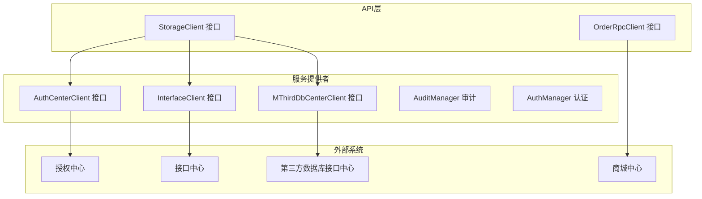
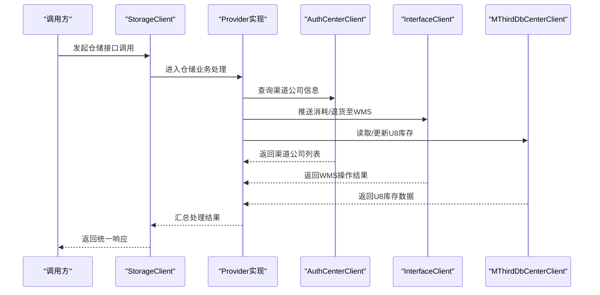
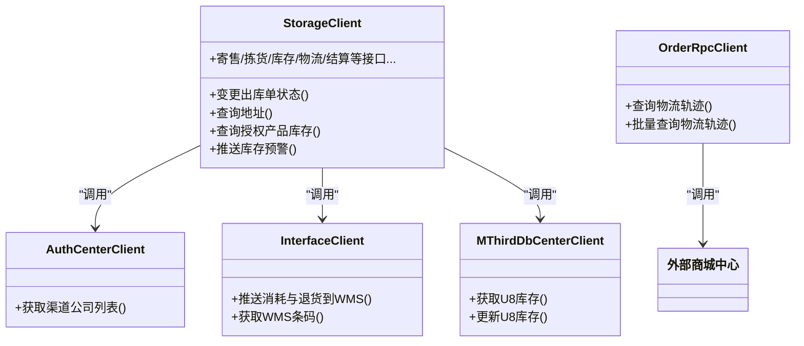
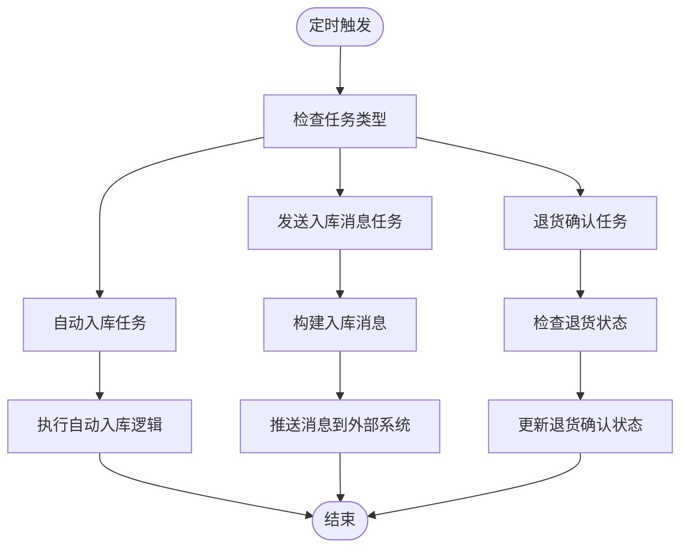
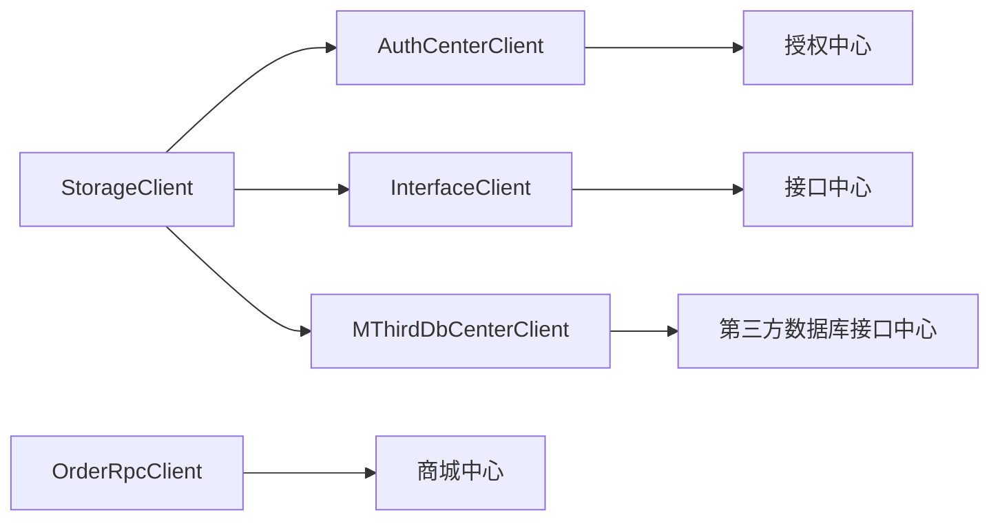

# 集成模式设计

<cite>
**本文引用的文件**
- [StorageClient.java](file://guoke-deepexi-storage-center-api/src/main/java/com/ deepexi/api/storage/StorageClient.java)
- [OrderRpcClient.java](file://guoke-deepexi-storage-center-api/src/main/java/com/ deepexi/api/storage/OrderRpcClient.java)
- [AuthCenterClient.java](file://guoke-deepexi-storage-center-provider/src/main/java/com/deepexi/storage/feign/AuthCenterClient.java)
- [InterfaceClient.java](file://guoke-deepexi-storage-center-provider/src/main/java/com/deepexi/storage/feign/InterfaceClient.java)
- [MThirdDbCenterClient.java](file://guoke-deepexi-storage-center-provider/src/main/java/com/deepexi/storage/feign/MThirdDbCenterClient.java)
- [AutoInStockJobExecutor.java](file://guoke-deepexi-storage-center-provider/src/main/java/com/deepexi/storage/job/in/AutoInStockJobExecutor.java)
- [SendInStockMessageJobExecutor.java](file://guoke-deepexi-storage-center-provider/src/main/java/com/deepexi/storage/job/in/SendInStockMessageJobExecutor.java)
- [ReturnConfirmJobExecutor.java](file://guoke-deepexi-storage-center-provider/src/main/java/com/deepexi/storage/job/in/ReturnConfirmJobExecutor.java)
- [AutoInStockParam.java](file://guoke-deepexi-storage-center-provider/src/main/java/com/deepexi/storage/job/in/AutoInStockParam.java)
- [SendInStockMessageParam.java](file://guoke-deepexi-storage-center-provider/src/main/java/com/deepexi/storage/job/in/SendInStockMessageParam.java)
- [ReturnConfirmParam.java](file://guoke-deepexi-storage-center-provider/src/main/java/com/deepexi/storage/job/in/ReturnConfirmParam.java)
- [AuditManager.java](file://guoke-deepexi-storage-center-provider/src/main/java/com/deepexi/storage/manager/AuditManager.java)
- [AuthManager.java](file://guoke-deepexi-storage-center-provider/src/main/java/com/deepexi/storage/manager/AuthManager.java)
- [application.properties](file://guoke-deepexi-storage-center-provider/src/main/resources/application.properties)
</cite>

## 目录
1. [引言](#引言)
2. [项目结构](#项目结构)
3. [核心组件](#核心组件)
4. [架构总览](#架构总览)
5. [详细组件分析](#详细组件分析)
6. [依赖分析](#依赖分析)
7. [性能考虑](#性能考虑)
8. [故障排查指南](#故障排查指南)
9. [结论](#结论)
10. [附录](#附录)

## 引言
本设计文档面向国科恒泰仓储管理系统在集成模式下的整体架构与外部系统对接策略，重点覆盖以下方面：
- 与WMS系统集成、ERP系统对接、第三方平台连接的策略与接口代理设计
- Feign客户端的使用模式、远程调用机制与接口契约
- 定时任务调度、消息推送与回调处理机制
- 集成接口的版本管理、错误重试与熔断降级策略
- 集成架构图与接口契约定义
- 安全认证、数据加密与审计日志等集成安全措施

## 项目结构
系统采用分层与模块化组织，核心由“API接口定义”和“服务提供者实现”两部分组成：
- API层：统一对外暴露RPC/HTTP接口契约，便于消费端以Feign客户端进行远程调用
- Provider层：实现具体业务逻辑，并通过Feign客户端调用授权中心、接口中心、第三方数据库接口中心等外部系统

图表来源
- [StorageClient.java:105-107](file://guoke-deepexi-storage-center-api/src/main/java/com/deepexi/api/storage/StorageClient.java#L105-L107)
- [OrderRpcClient.java:19-21](file://guoke-deepexi-storage-center-api/src/main/java/com/deepexi/api/storage/OrderRpcClient.java#L19-L21)
- [AuthCenterClient.java:15-17](file://guoke-deepexi-storage-center-provider/src/main/java/com/deepexi/storage/feign/AuthCenterClient.java#L15-L17)
- [InterfaceClient.java:16-18](file://guoke-deepexi-storage-center-provider/src/main/java/com/deepexi/storage/feign/InterfaceClient.java#L16-L18)
- [MThirdDbCenterClient.java:19-21](file://guoke-deepexi-storage-center-provider/src/main/java/com/deepexi/storage/feign/MThirdDbCenterClient.java#L19-L21)

章节来源
- [StorageClient.java:105-107](file://guoke-deepexi-storage-center-api/src/main/java/com/deepexi/api/storage/StorageClient.java#L105-L107)
- [OrderRpcClient.java:19-21](file://guoke-deepexi-storage-center-api/src/main/java/com/deepexi/api/storage/OrderRpcClient.java#L19-L21)
- [AuthCenterClient.java:15-17](file://guoke-deepexi-storage-center-provider/src/main/java/com/deepexi/storage/feign/AuthCenterClient.java#L15-L17)
- [InterfaceClient.java:16-18](file://guoke-deepexi-storage-center-provider/src/main/java/com/deepexi/storage/feign/InterfaceClient.java#L16-L18)
- [MThirdDbCenterClient.java:19-21](file://guoke-deepexi-storage-center-provider/src/main/java/com/deepexi/storage/feign/MThirdDbCenterClient.java#L19-L21)

## 核心组件
- StorageClient：仓储系统对外统一RPC/HTTP接口契约，涵盖出入库、库存、寄售、拣货、预警、物流、结算等能力，并包含与WMS、ERP、OMS等系统的对接入口
- OrderRpcClient：面向商城中心的物流轨迹查询RPC接口
- AuthCenterClient：调用授权中心获取渠道公司信息
- InterfaceClient：对接接口中心，负责推送消耗与退货到WMS、获取WMS条码等
- MThirdDbCenterClient：对接第三方数据库接口中心，用于U8库存数据的读取与更新

章节来源
- [StorageClient.java:105-107](file://guoke-deepexi-storage-center-api/src/main/java/com/deepexi/api/storage/StorageClient.java#L105-L107)
- [OrderRpcClient.java:19-21](file://guoke-deepexi-storage-center-api/src/main/java/com/deepexi/api/storage/OrderRpcClient.java#L19-L21)
- [AuthCenterClient.java:15-17](file://guoke-deepexi-storage-center-provider/src/main/java/com/deepexi/storage/feign/AuthCenterClient.java#L15-L17)
- [InterfaceClient.java:16-18](file://guoke-deepexi-storage-center-provider/src/main/java/com/deepexi/storage/feign/InterfaceClient.java#L16-L18)
- [MThirdDbCenterClient.java:19-21](file://guoke-deepexi-storage-center-provider/src/main/java/com/deepexi/storage/feign/MThirdDbCenterClient.java#L19-L21)

## 架构总览
系统通过Feign客户端实现对多个外部系统的统一接入，形成“仓储系统内部服务”与“外部系统”的解耦。接口契约在API层集中定义，Provider层负责实现与外部系统的交互。

图表来源
- [StorageClient.java:105-107](file://guoke-deepexi-storage-center-api/src/main/java/com/deepexi/api/storage/StorageClient.java#L105-L107)
- [AuthCenterClient.java:15-17](file://guoke-deepexi-storage-center-provider/src/main/java/com/deepexi/storage/feign/AuthCenterClient.java#L15-L17)
- [InterfaceClient.java:16-18](file://guoke-deepexi-storage-center-provider/src/main/java/com/deepexi/storage/feign/InterfaceClient.java#L16-L18)
- [MThirdDbCenterClient.java:19-21](file://guoke-deepexi-storage-center-provider/src/main/java/com/deepexi/storage/feign/MThirdDbCenterClient.java#L19-L21)

## 详细组件分析

### Feign客户端与远程调用机制
- 接口代理：各Feign客户端通过注解声明远程服务名与请求路径，运行时由Spring Cloud OpenFeign自动生成代理实现
- 参数绑定：支持路径变量、查询参数、请求体等多种绑定方式；复杂参数建议封装为DTO
- 响应封装：统一返回包装类，便于错误传播与版本兼容

图表来源
- [StorageClient.java:105-107](file://guoke-deepexi-storage-center-api/src/main/java/com/deepexi/api/storage/StorageClient.java#L105-L107)
- [OrderRpcClient.java:19-21](file://guoke-deepexi-storage-center-api/src/main/java/com/deepexi/api/storage/OrderRpcClient.java#L19-L21)
- [AuthCenterClient.java:15-17](file://guoke-deepexi-storage-center-provider/src/main/java/com/deepexi/storage/feign/AuthCenterClient.java#L15-L17)
- [InterfaceClient.java:16-18](file://guoke-deepexi-storage-center-provider/src/main/java/com/deepexi/storage/feign/InterfaceClient.java#L16-L18)
- [MThirdDbCenterClient.java:19-21](file://guoke-deepexi-storage-center-provider/src/main/java/com/deepexi/storage/feign/MThirdDbCenterClient.java#L19-L21)

章节来源
- [StorageClient.java:105-107](file://guoke-deepexi-storage-center-api/src/main/java/com/deepexi/api/storage/StorageClient.java#L105-L107)
- [OrderRpcClient.java:19-21](file://guoke-deepexi-storage-center-api/src/main/java/com/deepexi/api/storage/OrderRpcClient.java#L19-L21)
- [AuthCenterClient.java:15-17](file://guoke-deepexi-storage-center-provider/src/main/java/com/deepexi/storage/feign/AuthCenterClient.java#L15-L17)
- [InterfaceClient.java:16-18](file://guoke-deepexi-storage-center-provider/src/main/java/com/deepexi/storage/feign/InterfaceClient.java#L16-L18)
- [MThirdDbCenterClient.java:19-21](file://guoke-deepexi-storage-center-provider/src/main/java/com/deepexi/storage/feign/MThirdDbCenterClient.java#L19-L21)

### 定时任务调度与消息推送
系统通过作业执行器实现定时任务与消息推送：
- 自动入库任务：按配置周期自动执行入库相关流程
- 发送入库消息任务：按计划向外部系统推送入库通知
- 退货确认任务：定期检查并处理退货确认流程

图表来源
- [AutoInStockJobExecutor.java](file://guoke-deepexi-storage-center-provider/src/main/java/com/deepexi/storage/job/in/AutoInStockJobExecutor.java)
- [SendInStockMessageJobExecutor.java](file://guoke-deepexi-storage-center-provider/src/main/java/com/deepexi/storage/job/in/SendInStockMessageJobExecutor.java)
- [ReturnConfirmJobExecutor.java](file://guoke-deepexi-storage-center-provider/src/main/java/com/deepexi/storage/job/in/ReturnConfirmJobExecutor.java)

章节来源
- [AutoInStockJobExecutor.java](file://guoke-deepexi-storage-center-provider/src/main/java/com/deepexi/storage/job/in/AutoInStockJobExecutor.java)
- [SendInStockMessageJobExecutor.java](file://guoke-deepexi-storage-center-provider/src/main/java/com/deepexi/storage/job/in/SendInStockMessageJobExecutor.java)
- [ReturnConfirmJobExecutor.java](file://guoke-deepexi-storage-center-provider/src/main/java/com/deepexi/storage/job/in/ReturnConfirmJobExecutor.java)
- [AutoInStockParam.java](file://guoke-deepexi-storage-center-provider/src/main/java/com/deepexi/storage/job/in/AutoInStockParam.java)
- [SendInStockMessageParam.java](file://guoke-deepexi-storage-center-provider/src/main/java/com/deepexi/storage/job/in/SendInStockMessageParam.java)
- [ReturnConfirmParam.java](file://guoke-deepexi-storage-center-provider/src/main/java/com/deepexi/storage/job/in/ReturnConfirmParam.java)

### 回调处理机制
- WMS回调：通过接口中心推送消耗与退货到WMS，WMS侧可能异步回调结果
- 商城物流轨迹：通过OrderRpcClient查询物流轨迹，支持单个与批量查询
- 外部系统状态同步：通过定时任务轮询或回调机制同步外部系统状态

章节来源
- [InterfaceClient.java:20-21](file://guoke-deepexi-storage-center-provider/src/main/java/com/deepexi/storage/feign/InterfaceClient.java#L20-L21)
- [OrderRpcClient.java:23-32](file://guoke-deepexi-storage-center-api/src/main/java/com/deepexi/api/storage/OrderRpcClient.java#L23-L32)

### 接口契约定义
- 仓储系统对外接口：集中在StorageClient中，涵盖出入库、库存、寄售、拣货、预警、物流、结算等
- 外部系统接口：通过Feign客户端定义，如授权中心、接口中心、第三方数据库接口中心、商城中心

章节来源
- [StorageClient.java:105-107](file://guoke-deepexi-storage-center-api/src/main/java/com/deepexi/api/storage/StorageClient.java#L105-L107)
- [AuthCenterClient.java:15-17](file://guoke-deepexi-storage-center-provider/src/main/java/com/deepexi/storage/feign/AuthCenterClient.java#L15-L17)
- [InterfaceClient.java:16-18](file://guoke-deepexi-storage-center-provider/src/main/java/com/deepexi/storage/feign/InterfaceClient.java#L16-L18)
- [MThirdDbCenterClient.java:19-21](file://guoke-deepexi-storage-center-provider/src/main/java/com/deepexi/storage/feign/MThirdDbCenterClient.java#L19-L21)
- [OrderRpcClient.java:19-21](file://guoke-deepexi-storage-center-api/src/main/java/com/deepexi/api/storage/OrderRpcClient.java#L19-L21)

### 版本管理、错误重试与熔断降级
- 版本管理：接口路径中包含版本前缀（如/api/v1、/rpc/v1），便于后续演进与灰度发布
- 错误重试：建议在Feign客户端层面结合重试机制（如超时与异常重试策略）
- 熔断降级：建议引入断路器（如Hystrix/Sentinel）在外部系统不稳定时快速失败并返回降级结果

章节来源
- [StorageClient.java:105-107](file://guoke-deepexi-storage-center-api/src/main/java/com/deepexi/api/storage/StorageClient.java#L105-L107)
- [InterfaceClient.java:16-18](file://guoke-deepexi-storage-center-provider/src/main/java/com/deepexi/storage/feign/InterfaceClient.java#L16-L18)

### 安全认证、数据加密与审计日志
- 安全认证：通过AuthManager与授权中心交互，确保访问控制与鉴权
- 数据加密：建议在传输层启用TLS，在存储层对敏感字段进行加密
- 审计日志：通过AuditManager记录关键操作日志，便于追踪与合规审计

章节来源
- [AuthManager.java](file://guoke-deepexi-storage-center-provider/src/main/java/com/deepexi/storage/manager/AuthManager.java)
- [AuditManager.java](file://guoke-deepexi-storage-center-provider/src/main/java/com/deepexi/storage/manager/AuditManager.java)

## 依赖分析
- 内聚性：各Feign客户端职责清晰，分别对接不同外部系统
- 耦合度：通过统一的接口契约降低对具体实现的耦合
- 外部依赖：授权中心、接口中心、第三方数据库接口中心、商城中心

图表来源
- [StorageClient.java:105-107](file://guoke-deepexi-storage-center-api/src/main/java/com/deepexi/api/storage/StorageClient.java#L105-L107)
- [AuthCenterClient.java:15-17](file://guoke-deepexi-storage-center-provider/src/main/java/com/deepexi/storage/feign/AuthCenterClient.java#L15-L17)
- [InterfaceClient.java:16-18](file://guoke-deepexi-storage-center-provider/src/main/java/com/deepexi/storage/feign/InterfaceClient.java#L16-L18)
- [MThirdDbCenterClient.java:19-21](file://guoke-deepexi-storage-center-provider/src/main/java/com/deepexi/storage/feign/MThirdDbCenterClient.java#L19-L21)
- [OrderRpcClient.java:19-21](file://guoke-deepexi-storage-center-api/src/main/java/com/deepexi/api/storage/OrderRpcClient.java#L19-L21)

章节来源
- [application.properties](file://guoke-deepexi-storage-center-provider/src/main/resources/application.properties)

## 性能考虑
- 连接池与超时：合理设置Feign连接池大小与超时时间，避免阻塞
- 缓存策略：对频繁查询的静态数据（如渠道公司、物流信息）进行缓存
- 并发控制：对高并发场景下的外部调用增加限流与隔离
- 监控与告警：对调用延迟、错误率与熔断事件进行监控

## 故障排查指南
- 接口调用失败：检查Feign客户端配置、目标服务可用性与网络连通性
- 认证失败：核对授权中心返回的令牌与权限范围
- 数据不一致：检查定时任务执行情况与回调处理逻辑
- 日志审计：通过审计日志定位问题发生的时间点与操作人

章节来源
- [AuditManager.java](file://guoke-deepexi-storage-center-provider/src/main/java/com/deepexi/storage/manager/AuditManager.java)
- [AuthManager.java](file://guoke-deepexi-storage-center-provider/src/main/java/com/deepexi/storage/manager/AuthManager.java)

## 结论
本集成模式设计通过Feign客户端与统一接口契约，实现了仓储系统与授权中心、接口中心、第三方数据库接口中心及商城中心的高效集成。配合定时任务与消息推送机制，满足了WMS、ERP与第三方平台的对接需求。建议在生产环境中完善版本管理、错误重试与熔断降级策略，并强化安全认证、数据加密与审计日志体系，以保障系统的稳定性与安全性。

## 附录
- 接口路径示例：/api/v1/storage/rpc/address/getByBsAddress、/rpc/v1/stockLock/lock、/rpc/v1/esb-wms/pushConsumeAndReturn2Wms
- 关键DTO：BaseRequestDto、BaseResponseDto、Payload等，用于统一请求与响应格式