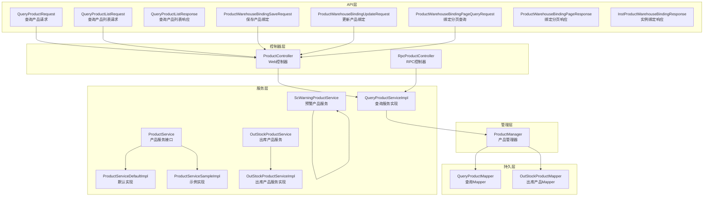
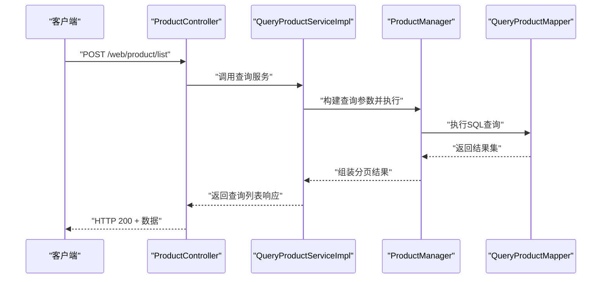
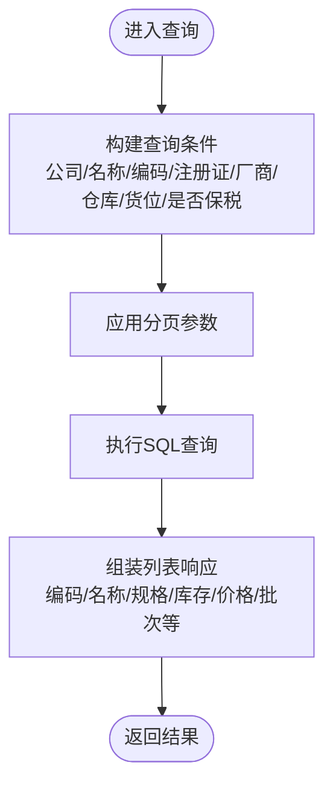
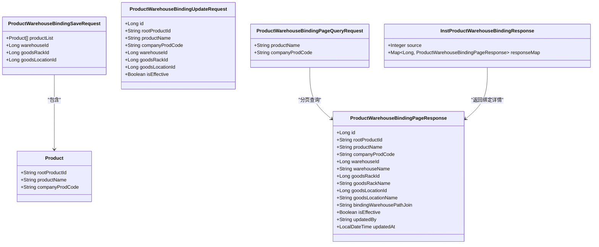
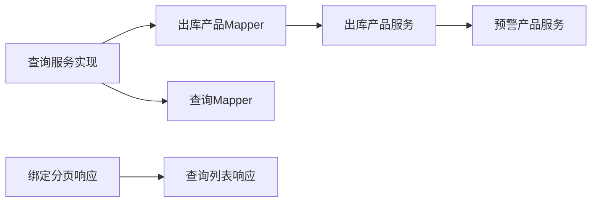
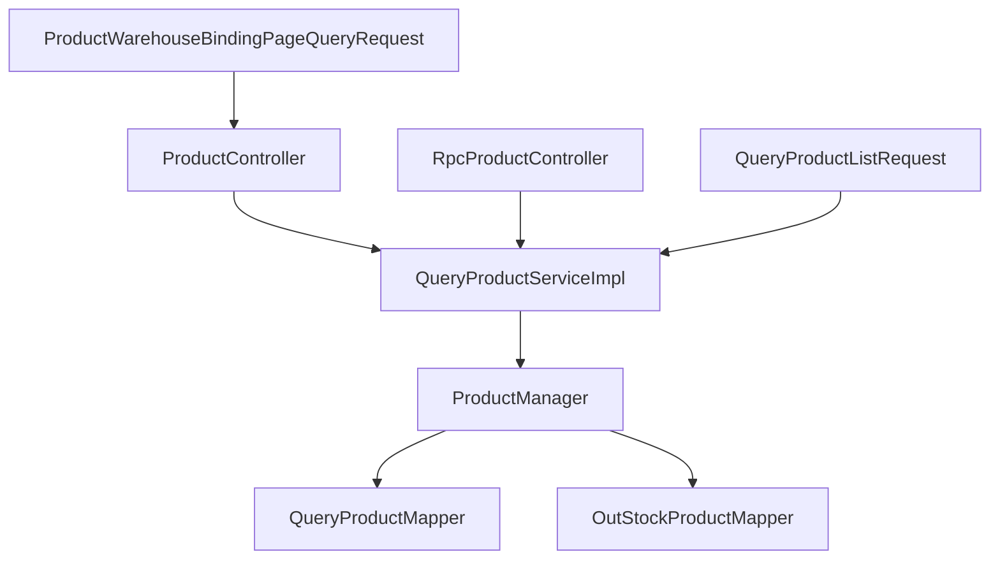

# 产品管理模块

<cite>
**本文引用的文件**
- [QueryProductRequest.java](file://guoke-deepexi-storage-center-api/src/main/java/com/deepexi/api/storage/dto/product/QueryProductRequest.java)
- [QueryProductResponse.java](file://guoke-deepexi-storage-center-api/src/main/java/com/deepexi/api/storage/dto/product/QueryProductResponse.java)
- [QueryProductListRequest.java](file://guoke-deepexi-storage-center-api/src/main/java/com/deepexi/api/storage/dto/product/QueryProductListRequest.java)
- [QueryProductListResponse.java](file://guoke-deepexi-storage-center-api/src/main/java/com/deepexi/api/storage/dto/product/QueryProductListResponse.java)
- [ProductWarehouseBindingSaveRequest.java](file://guoke-deepexi-storage-center-api/src/main/java/com/deepexi/api/storage/dto/productwarehousebinding/ProductWarehouseBindingSaveRequest.java)
- [ProductWarehouseBindingUpdateRequest.java](file://guoke-deepexi-storage-center-api/src/main/java/com/deepexi/api/storage/dto/productwarehousebinding/ProductWarehouseBindingUpdateRequest.java)
- [ProductWarehouseBindingPageQueryRequest.java](file://guoke-deepexi-storage-center-api/src/main/java/com/deepexi/api/storage/dto/productwarehousebinding/ProductWarehouseBindingPageQueryRequest.java)
- [ProductWarehouseBindingPageResponse.java](file://guoke-deepexi-storage-center-api/src/main/java/com/deepexi/api/storage/dto/productwarehousebinding/ProductWarehouseBindingPageResponse.java)
- [InstProductWarehouseBindingResponse.java](file://guoke-deepexi-storage-center-api/src/main/java/com/deepexi/api/storage/dto/productwarehousebinding/InstProductWarehouseBindingResponse.java)
- [ProductController.java](file://guoke-deepexi-storage-center-provider/src/main/java/com/deepexi/storage/controller/web/ProductController.java)
- [RpcProductController.java](file://guoke-deepexi-storage-center-provider/src/main/java/com/deepexi/storage/controller/rpc/RpcProductController.java)
- [QueryProductServiceImpl.java](file://guoke-deepexi-storage-center-provider/src/main/java/com/deepexi/storage/service/impl/QueryProductServiceImpl.java)
- [ProductManager.java](file://guoke-deepexi-storage-center-provider/src/main/java/com/deepexi/storage/manager/ProductManager.java)
- [QueryProductMapper.java](file://guoke-deepexi-storage-center-provider/src/main/java/com/deepexi/storage/mapper/QueryProductMapper.java)
- [OutStockProductMapper.java](file://guoke-deepexi-storage-center-provider/src/main/java/com/deepexi/storage/mapper/OutStockProductMapper.java)
- [OutStockProductService.java](file://guoke-deepexi-storage-center-provider/src/main/java/com/deepexi/storage/service/OutStockProductService.java)
- [OutStockProductServiceImpl.java](file://guoke-deepexi-storage-center-provider/src/main/java/com/deepexi/storage/service/impl/OutStockProductServiceImpl.java)
- [ScWarningProductService.java](file://guoke-deepexi-storage-center-provider/src/main/java/com/deepexi/storage/service/ScWarningProductService.java)
- [ScWarningProductServiceImpl.java](file://guoke-deepexi-storage-center-provider/src/main/java/com/deepexi/storage/service/impl/ScWarningProductServiceImpl.java)
- [ProductService.java](file://guoke-deepexi-storage-center-provider/src/main/java/com/deepexi/storage/service/product/ProductService.java)
- [ProductServiceDefaultImpl.java](file://guoke-deepexi-storage-center-provider/src/main/java/com/deepexi/storage/service/product/ProductServiceDefaultImpl.java)
- [ProductServiceSampleImpl.java](file://guoke-deepexi-storage-center-provider/src/main/java/com/deepexi/storage/service/product/ProductServiceSampleImpl.java)
- [StorageRedisConstant.java](file://guoke-deepexi-storage-center-provider/src/main/java/com/deepexi/storage/constans/StorageRedisConstant.java)
- [BaseQuery.java](file://guoke-deepexi-storage-center-api/src/main/java/com/deepexi/common/base/query/BaseQuery.java)
</cite>

## 目录
1. [引言](#引言)
2. [项目结构](#项目结构)
3. [核心组件](#核心组件)
4. [架构总览](#架构总览)
5. [详细组件分析](#详细组件分析)
6. [依赖分析](#依赖分析)
7. [性能考虑](#性能考虑)
8. [故障排查指南](#故障排查指南)
9. [结论](#结论)
10. [附录](#附录)

## 引言
本文件面向国科恒泰仓储管理系统中的“产品管理模块”，系统性梳理产品信息管理、产品绑定、价格管理、查询接口设计、API定义、与库存/订单/仓库模块的数据关联、导入导出与批量操作、数据验证机制、配置项以及缓存与性能优化策略。文档以仓库中心Provider侧的服务与Mapper层为核心，结合API侧的DTO进行说明，帮助开发者与实施人员快速理解并正确使用产品管理能力。

## 项目结构
产品管理模块主要由以下层次构成：
- API层（DTO）：定义查询、绑定、分页等请求/响应对象，统一对外契约。
- 控制器层（Controller）：Web与RPC控制器分别暴露REST与内部RPC接口。
- 服务层（Service）：封装业务逻辑，包含默认实现与示例实现，便于扩展。
- 管理层（Manager）：协调服务与持久层，处理事务与校验。
- 持久层（Mapper）：SQL映射与数据库交互。
- 常量与基础类：如分页基类、Redis键常量等。

图表来源
- [ProductController.java](file://guoke-deepexi-storage-center-provider/src/main/java/com/deepexi/storage/controller/web/ProductController.java)
- [RpcProductController.java](file://guoke-deepexi-storage-center-provider/src/main/java/com/deepexi/storage/controller/rpc/RpcProductController.java)
- [QueryProductServiceImpl.java](file://guoke-deepexi-storage-center-provider/src/main/java/com/deepexi/storage/service/impl/QueryProductServiceImpl.java)
- [ProductManager.java](file://guoke-deepexi-storage-center-provider/src/main/java/com/deepexi/storage/manager/ProductManager.java)
- [QueryProductMapper.java](file://guoke-deepexi-storage-center-provider/src/main/java/com/deepexi/storage/mapper/QueryProductMapper.java)
- [OutStockProductMapper.java](file://guoke-deepexi-storage-center-provider/src/main/java/com/deepexi/storage/mapper/OutStockProductMapper.java)
- [ProductService.java](file://guoke-deepexi-storage-center-provider/src/main/java/com/deepexi/storage/service/product/ProductService.java)
- [ProductServiceDefaultImpl.java](file://guoke-deepexi-storage-center-provider/src/main/java/com/deepexi/storage/service/product/ProductServiceDefaultImpl.java)
- [ProductServiceSampleImpl.java](file://guoke-deepexi-storage-center-provider/src/main/java/com/deepexi/storage/service/product/ProductServiceSampleImpl.java)
- [OutStockProductService.java](file://guoke-deepexi-storage-center-provider/src/main/java/com/deepexi/storage/service/OutStockProductService.java)
- [OutStockProductServiceImpl.java](file://guoke-deepexi-storage-center-provider/src/main/java/com/deepexi/storage/service/impl/OutStockProductServiceImpl.java)
- [ScWarningProductService.java](file://guoke-deepexi-storage-center-provider/src/main/java/com/deepexi/storage/service/ScWarningProductService.java)

章节来源
- [ProductController.java](file://guoke-deepexi-storage-center-provider/src/main/java/com/deepexi/storage/controller/web/ProductController.java)
- [RpcProductController.java](file://guoke-deepexi-storage-center-provider/src/main/java/com/deepexi/storage/controller/rpc/RpcProductController.java)
- [QueryProductServiceImpl.java](file://guoke-deepexi-storage-center-provider/src/main/java/com/deepexi/storage/service/impl/QueryProductServiceImpl.java)
- [ProductManager.java](file://guoke-deepexi-storage-center-provider/src/main/java/com/deepexi/storage/manager/ProductManager.java)
- [QueryProductMapper.java](file://guoke-deepexi-storage-center-provider/src/main/java/com/deepexi/storage/mapper/QueryProductMapper.java)
- [OutStockProductMapper.java](file://guoke-deepexi-storage-center-provider/src/main/java/com/deepexi/storage/mapper/OutStockProductMapper.java)
- [ProductService.java](file://guoke-deepexi-storage-center-provider/src/main/java/com/deepexi/storage/service/product/ProductService.java)
- [ProductServiceDefaultImpl.java](file://guoke-deepexi-storage-center-provider/src/main/java/com/deepexi/storage/service/product/ProductServiceDefaultImpl.java)
- [ProductServiceSampleImpl.java](file://guoke-deepexi-storage-center-provider/src/main/java/com/deepexi/storage/service/product/ProductServiceSampleImpl.java)
- [OutStockProductService.java](file://guoke-deepexi-storage-center-provider/src/main/java/com/deepexi/storage/service/OutStockProductService.java)
- [OutStockProductServiceImpl.java](file://guoke-deepexi-storage-center-provider/src/main/java/com/deepexi/storage/service/impl/OutStockProductServiceImpl.java)
- [ScWarningProductService.java](file://guoke-deepexi-storage-center-provider/src/main/java/com/deepexi/storage/service/ScWarningProductService.java)

## 核心组件
- 产品查询接口
  - 单品查询：按公司、批号、序列号、UDI等条件查询产品信息。
  - 列表查询：支持按公司、产品名称、编码、注册证号、厂商、仓库/货位等多维过滤，继承分页基类。
- 产品绑定
  - 支持批量保存产品与仓库/货架/货位的绑定关系，支持更新绑定状态与定位信息。
  - 提供分页查询绑定记录，返回仓库路径拼接字段与更新信息。
- 价格管理
  - 列表响应中包含模板价格字段，用于展示或参与后续定价流程。
- 服务与实现
  - 查询服务实现负责调用Mapper执行SQL并组装结果。
  - 产品服务接口提供默认与示例实现，便于按业务场景切换。
- 数据关联
  - 出库产品服务与出库Mapper用于与订单/出库流程联动。
  - 预警产品服务用于库存安全阈值相关的联动。

章节来源
- [QueryProductRequest.java](file://guoke-deepexi-storage-center-api/src/main/java/com/deepexi/api/storage/dto/product/QueryProductRequest.java)
- [QueryProductResponse.java](file://guoke-deepexi-storage-center-api/src/main/java/com/deepexi/api/storage/dto/product/QueryProductResponse.java)
- [QueryProductListRequest.java](file://guoke-deepexi-storage-center-api/src/main/java/com/deepexi/api/storage/dto/product/QueryProductListRequest.java)
- [QueryProductListResponse.java](file://guoke-deepexi-storage-center-api/src/main/java/com/deepexi/api/storage/dto/product/QueryProductListResponse.java)
- [ProductWarehouseBindingSaveRequest.java](file://guoke-deepexi-storage-center-api/src/main/java/com/deepexi/api/storage/dto/productwarehousebinding/ProductWarehouseBindingSaveRequest.java)
- [ProductWarehouseBindingUpdateRequest.java](file://guoke-deepexi-storage-center-api/src/main/java/com/deepexi/api/storage/dto/productwarehousebinding/ProductWarehouseBindingUpdateRequest.java)
- [ProductWarehouseBindingPageQueryRequest.java](file://guoke-deepexi-storage-center-api/src/main/java/com/deepexi/api/storage/dto/productwarehousebinding/ProductWarehouseBindingPageQueryRequest.java)
- [ProductWarehouseBindingPageResponse.java](file://guoke-deepexi-storage-center-api/src/main/java/com/deepexi/api/storage/dto/productwarehousebinding/ProductWarehouseBindingPageResponse.java)
- [InstProductWarehouseBindingResponse.java](file://guoke-deepexi-storage-center-api/src/main/java/com/deepexi/api/storage/dto/productwarehousebinding/InstProductWarehouseBindingResponse.java)
- [QueryProductServiceImpl.java](file://guoke-deepexi-storage-center-provider/src/main/java/com/deepexi/storage/service/impl/QueryProductServiceImpl.java)
- [ProductService.java](file://guoke-deepexi-storage-center-provider/src/main/java/com/deepexi/storage/service/product/ProductService.java)
- [ProductServiceDefaultImpl.java](file://guoke-deepexi-storage-center-provider/src/main/java/com/deepexi/storage/service/product/ProductServiceDefaultImpl.java)
- [ProductServiceSampleImpl.java](file://guoke-deepexi-storage-center-provider/src/main/java/com/deepexi/storage/service/product/ProductServiceSampleImpl.java)
- [OutStockProductService.java](file://guoke-deepexi-storage-center-provider/src/main/java/com/deepexi/storage/service/OutStockProductService.java)
- [OutStockProductServiceImpl.java](file://guoke-deepexi-storage-center-provider/src/main/java/com/deepexi/storage/service/impl/OutStockProductServiceImpl.java)
- [ScWarningProductService.java](file://guoke-deepexi-storage-center-provider/src/main/java/com/deepexi/storage/service/ScWarningProductService.java)

## 架构总览
产品管理模块遵循典型的分层架构，API DTO作为契约，控制器接收请求并委派给服务层，服务层通过管理器协调Mapper访问数据库，最终返回响应。

图表来源
- [ProductController.java](file://guoke-deepexi-storage-center-provider/src/main/java/com/deepexi/storage/controller/web/ProductController.java)
- [QueryProductServiceImpl.java](file://guoke-deepexi-storage-center-provider/src/main/java/com/deepexi/storage/service/impl/QueryProductServiceImpl.java)
- [ProductManager.java](file://guoke-deepexi-storage-center-provider/src/main/java/com/deepexi/storage/manager/ProductManager.java)
- [QueryProductMapper.java](file://guoke-deepexi-storage-center-provider/src/main/java/com/deepexi/storage/mapper/QueryProductMapper.java)

## 详细组件分析

### 产品查询接口
- 单品查询
  - 请求体包含公司标识、批号、序列号、UDI等字段，用于唯一或准唯一定位产品。
  - 响应体包含生产日期、失效日期、批号、序列号、UDI等关键信息。
- 列表查询
  - 继承分页基类，支持公司ID、产品名称、产品编码、注册证号、厂商、仓库/货位、是否保税等条件过滤。
  - 响应体包含授权ID、平台编码、产品编码/名称/规格/型号、最小单位、供应商/厂商名称、注册证信息、管理分类、UDI/序列号/批号、公司ID、库存总数、模板价格、生产/失效日期、入库单信息等。
- 设计要点
  - 多维过滤与分页结合，满足复杂检索场景。
  - 响应字段覆盖库存、价格、批次等关键业务要素，便于上层直接消费。

图表来源
- [QueryProductListRequest.java](file://guoke-deepexi-storage-center-api/src/main/java/com/deepexi/api/storage/dto/product/QueryProductListRequest.java)
- [QueryProductListResponse.java](file://guoke-deepexi-storage-center-api/src/main/java/com/deepexi/api/storage/dto/product/QueryProductListResponse.java)
- [BaseQuery.java](file://guoke-deepexi-storage-center-api/src/main/java/com/deepexi/common/base/query/BaseQuery.java)

章节来源
- [QueryProductRequest.java](file://guoke-deepexi-storage-center-api/src/main/java/com/deepexi/api/storage/dto/product/QueryProductRequest.java)
- [QueryProductResponse.java](file://guoke-deepexi-storage-center-api/src/main/java/com/deepexi/api/storage/dto/product/QueryProductResponse.java)
- [QueryProductListRequest.java](file://guoke-deepexi-storage-center-api/src/main/java/com/deepexi/api/storage/dto/product/QueryProductListRequest.java)
- [QueryProductListResponse.java](file://guoke-deepexi-storage-center-api/src/main/java/com/deepexi/api/storage/dto/product/QueryProductListResponse.java)
- [BaseQuery.java](file://guoke-deepexi-storage-center-api/src/main/java/com/deepexi/common/base/query/BaseQuery.java)

### 产品绑定管理
- 批量保存
  - 接收产品列表（根产品ID、产品名称、公司产品编码）、仓库ID、货架ID、货位ID。
  - 校验必填字段，确保产品列表非空且每条记录完整。
- 更新绑定
  - 支持更新根产品ID、产品名称、公司产品编码、仓库/货架/货位ID及状态（启用/停用）。
- 分页查询
  - 支持按产品名称/编码分页查询绑定记录，返回仓库路径拼接、状态、更新人与时间等。
- 实例绑定响应
  - 返回仓库来源与绑定信息映射，便于多源聚合展示。

图表来源
- [ProductWarehouseBindingSaveRequest.java](file://guoke-deepexi-storage-center-api/src/main/java/com/deepexi/api/storage/dto/productwarehousebinding/ProductWarehouseBindingSaveRequest.java)
- [ProductWarehouseBindingUpdateRequest.java](file://guoke-deepexi-storage-center-api/src/main/java/com/deepexi/api/storage/dto/productwarehousebinding/ProductWarehouseBindingUpdateRequest.java)
- [ProductWarehouseBindingPageQueryRequest.java](file://guoke-deepexi-storage-center-api/src/main/java/com/deepexi/api/storage/dto/productwarehousebinding/ProductWarehouseBindingPageQueryRequest.java)
- [ProductWarehouseBindingPageResponse.java](file://guoke-deepexi-storage-center-api/src/main/java/com/deepexi/api/storage/dto/productwarehousebinding/ProductWarehouseBindingPageResponse.java)
- [InstProductWarehouseBindingResponse.java](file://guoke-deepexi-storage-center-api/src/main/java/com/deepexi/api/storage/dto/productwarehousebinding/InstProductWarehouseBindingResponse.java)

章节来源
- [ProductWarehouseBindingSaveRequest.java](file://guoke-deepexi-storage-center-api/src/main/java/com/deepexi/api/storage/dto/productwarehousebinding/ProductWarehouseBindingSaveRequest.java)
- [ProductWarehouseBindingUpdateRequest.java](file://guoke-deepexi-storage-center-api/src/main/java/com/deepexi/api/storage/dto/productwarehousebinding/ProductWarehouseBindingUpdateRequest.java)
- [ProductWarehouseBindingPageQueryRequest.java](file://guoke-deepexi-storage-center-api/src/main/java/com/deepexi/api/storage/dto/productwarehousebinding/ProductWarehouseBindingPageQueryRequest.java)
- [ProductWarehouseBindingPageResponse.java](file://guoke-deepexi-storage-center-api/src/main/java/com/deepexi/api/storage/dto/productwarehousebinding/ProductWarehouseBindingPageResponse.java)
- [InstProductWarehouseBindingResponse.java](file://guoke-deepexi-storage-center-api/src/main/java/com/deepexi/api/storage/dto/productwarehousebinding/InstProductWarehouseBindingResponse.java)

### 价格管理
- 列表响应包含模板价格字段，可用于展示或参与后续定价流程。
- 价格变更可通过库存相关流程触发，具体实现位于库存模块（如变更价格相关Mapper/Service），产品模块提供查询与展示。

章节来源
- [QueryProductListResponse.java](file://guoke-deepexi-storage-center-api/src/main/java/com/deepexi/api/storage/dto/product/QueryProductListResponse.java)

### 与库存/订单/仓库的数据关联
- 出库产品服务与Mapper
  - 用于与出库/拣货/订单匹配等场景，保障产品在出库环节的可用性与一致性。
- 预警产品服务
  - 与库存安全阈值联动，触发预警与补货建议。
- 仓库绑定
  - 将产品与仓库/货架/货位绑定，明确物理存储位置，支撑库存盘点与作业调度。

图表来源
- [QueryProductServiceImpl.java](file://guoke-deepexi-storage-center-provider/src/main/java/com/deepexi/storage/service/impl/QueryProductServiceImpl.java)
- [OutStockProductMapper.java](file://guoke-deepexi-storage-center-provider/src/main/java/com/deepexi/storage/mapper/OutStockProductMapper.java)
- [OutStockProductService.java](file://guoke-deepexi-storage-center-provider/src/main/java/com/deepexi/storage/service/OutStockProductService.java)
- [ScWarningProductService.java](file://guoke-deepexi-storage-center-provider/src/main/java/com/deepexi/storage/service/ScWarningProductService.java)
- [ProductWarehouseBindingPageResponse.java](file://guoke-deepexi-storage-center-api/src/main/java/com/deepexi/api/storage/dto/productwarehousebinding/ProductWarehouseBindingPageResponse.java)
- [QueryProductListResponse.java](file://guoke-deepexi-storage-center-api/src/main/java/com/deepexi/api/storage/dto/product/QueryProductListResponse.java)

章节来源
- [OutStockProductService.java](file://guoke-deepexi-storage-center-provider/src/main/java/com/deepexi/storage/service/OutStockProductService.java)
- [OutStockProductServiceImpl.java](file://guoke-deepexi-storage-center-provider/src/main/java/com/deepexi/storage/service/impl/OutStockProductServiceImpl.java)
- [OutStockProductMapper.java](file://guoke-deepexi-storage-center-provider/src/main/java/com/deepexi/storage/mapper/OutStockProductMapper.java)
- [ScWarningProductService.java](file://guoke-deepexi-storage-center-provider/src/main/java/com/deepexi/storage/service/ScWarningProductService.java)

### API接口文档
- Web控制器
  - 路径：/web/product/*
  - 功能：提供产品查询、绑定管理等Web接口。
- RPC控制器
  - 路径：/rpc/product/*
  - 功能：提供内部RPC接口，供下游系统调用。
- 关键接口
  - 查询产品列表：接收分页与多维过滤参数，返回产品清单与库存/价格/批次等信息。
  - 保存产品绑定：接收产品列表与仓库/货架/货位信息，批量建立绑定关系。
  - 更新产品绑定：支持更新绑定状态与定位信息。
  - 分页查询绑定：按产品名称/编码分页查询绑定记录。

章节来源
- [ProductController.java](file://guoke-deepexi-storage-center-provider/src/main/java/com/deepexi/storage/controller/web/ProductController.java)
- [RpcProductController.java](file://guoke-deepexi-storage-center-provider/src/main/java/com/deepexi/storage/controller/rpc/RpcProductController.java)
- [QueryProductListRequest.java](file://guoke-deepexi-storage-center-api/src/main/java/com/deepexi/api/storage/dto/product/QueryProductListRequest.java)
- [QueryProductListResponse.java](file://guoke-deepexi-storage-center-api/src/main/java/com/deepexi/api/storage/dto/product/QueryProductListResponse.java)
- [ProductWarehouseBindingSaveRequest.java](file://guoke-deepexi-storage-center-api/src/main/java/com/deepexi/api/storage/dto/productwarehousebinding/ProductWarehouseBindingSaveRequest.java)
- [ProductWarehouseBindingUpdateRequest.java](file://guoke-deepexi-storage-center-api/src/main/java/com/deepexi/api/storage/dto/productwarehousebinding/ProductWarehouseBindingUpdateRequest.java)
- [ProductWarehouseBindingPageQueryRequest.java](file://guoke-deepexi-storage-center-api/src/main/java/com/deepexi/api/storage/dto/productwarehousebinding/ProductWarehouseBindingPageQueryRequest.java)

### 数据模型与属性管理
- 产品查询模型
  - 单品查询：公司ID、批号、序列号、UDI。
  - 列表查询：公司ID、产品名称、编码、注册证号、厂商、仓库/货位、是否保税等。
- 绑定模型
  - 保存：产品列表（根产品ID、产品名称、公司产品编码）、仓库ID、货架ID、货位ID。
  - 更新：绑定ID、根产品ID、产品名称、公司产品编码、仓库/货架/货位ID、状态。
  - 分页：产品名称/编码过滤，返回仓库路径拼接与更新信息。
- 属性字段
  - 产品编码/名称/规格/型号/单位、供应商/厂商、注册证、管理分类、UDI/序列号/批号、公司ID、库存总数、模板价格、生产/失效日期、入库单信息等。

章节来源
- [QueryProductRequest.java](file://guoke-deepexi-storage-center-api/src/main/java/com/deepexi/api/storage/dto/product/QueryProductRequest.java)
- [QueryProductListRequest.java](file://guoke-deepexi-storage-center-api/src/main/java/com/deepexi/api/storage/dto/product/QueryProductListRequest.java)
- [QueryProductListResponse.java](file://guoke-deepexi-storage-center-api/src/main/java/com/deepexi/api/storage/dto/product/QueryProductListResponse.java)
- [ProductWarehouseBindingSaveRequest.java](file://guoke-deepexi-storage-center-api/src/main/java/com/deepexi/api/storage/dto/productwarehousebinding/ProductWarehouseBindingSaveRequest.java)
- [ProductWarehouseBindingUpdateRequest.java](file://guoke-deepexi-storage-center-api/src/main/java/com/deepexi/api/storage/dto/productwarehousebinding/ProductWarehouseBindingUpdateRequest.java)
- [ProductWarehouseBindingPageResponse.java](file://guoke-deepexi-storage-center-api/src/main/java/com/deepexi/api/storage/dto/productwarehousebinding/ProductWarehouseBindingPageResponse.java)

### 导入导出、批量操作与数据验证
- 批量保存绑定
  - 通过保存请求的“产品列表”字段实现批量绑定，后端对必填字段进行校验。
- 分页查询与导出
  - 列表查询支持分页，可基于查询结果进行导出（具体导出实现位于通用Excel工具与文件管理器，不在本文详述）。
- 数据验证
  - 使用注解对必填字段进行校验，如非空、非空白等，确保输入数据质量。

章节来源
- [ProductWarehouseBindingSaveRequest.java](file://guoke-deepexi-storage-center-api/src/main/java/com/deepexi/api/storage/dto/productwarehousebinding/ProductWarehouseBindingSaveRequest.java)
- [ProductWarehouseBindingPageQueryRequest.java](file://guoke-deepexi-storage-center-api/src/main/java/com/deepexi/api/storage/dto/productwarehousebinding/ProductWarehouseBindingPageQueryRequest.java)

### 配置选项与业务适配
- 产品服务接口
  - 默认实现与示例实现分离，便于按行业与业务场景切换。
- 绑定状态
  - 支持启用/停用状态控制，便于灵活管理产品与存储位置的关联关系。

章节来源
- [ProductService.java](file://guoke-deepexi-storage-center-provider/src/main/java/com/deepexi/storage/service/product/ProductService.java)
- [ProductServiceDefaultImpl.java](file://guoke-deepexi-storage-center-provider/src/main/java/com/deepexi/storage/service/product/ProductServiceDefaultImpl.java)
- [ProductServiceSampleImpl.java](file://guoke-deepexi-storage-center-provider/src/main/java/com/deepexi/storage/service/product/ProductServiceSampleImpl.java)
- [ProductWarehouseBindingUpdateRequest.java](file://guoke-deepexi-storage-center-api/src/main/java/com/deepexi/api/storage/dto/productwarehousebinding/ProductWarehouseBindingUpdateRequest.java)

### 缓存策略与性能优化
- Redis键常量
  - 使用统一的Redis键前缀与命名规范，便于集中管理与清理。
- 查询缓存
  - 对高频查询（如产品基础信息、绑定关系）可采用缓存策略，减少数据库压力。
- 分页与索引
  - 列表查询使用分页参数，配合数据库索引提升查询性能。
- 并发与事务
  - 绑定更新与库存变更需在事务内完成，避免数据不一致。

章节来源
- [StorageRedisConstant.java](file://guoke-deepexi-storage-center-provider/src/main/java/com/deepexi/storage/constans/StorageRedisConstant.java)
- [QueryProductListRequest.java](file://guoke-deepexi-storage-center-api/src/main/java/com/deepexi/api/storage/dto/product/QueryProductListRequest.java)

## 依赖分析
- 组件耦合
  - 控制器依赖服务实现；服务通过管理器访问Mapper；Mapper依赖数据库。
- 外部依赖
  - 分页基类提供统一的分页参数；Swagger注解用于接口文档生成。
- 循环依赖
  - 当前结构未见循环依赖迹象，职责清晰。

图表来源
- [ProductController.java](file://guoke-deepexi-storage-center-provider/src/main/java/com/deepexi/storage/controller/web/ProductController.java)
- [RpcProductController.java](file://guoke-deepexi-storage-center-provider/src/main/java/com/deepexi/storage/controller/rpc/RpcProductController.java)
- [QueryProductServiceImpl.java](file://guoke-deepexi-storage-center-provider/src/main/java/com/deepexi/storage/service/impl/QueryProductServiceImpl.java)
- [ProductManager.java](file://guoke-deepexi-storage-center-provider/src/main/java/com/deepexi/storage/manager/ProductManager.java)
- [QueryProductMapper.java](file://guoke-deepexi-storage-center-provider/src/main/java/com/deepexi/storage/mapper/QueryProductMapper.java)
- [OutStockProductMapper.java](file://guoke-deepexi-storage-center-provider/src/main/java/com/deepexi/storage/mapper/OutStockProductMapper.java)
- [QueryProductListRequest.java](file://guoke-deepexi-storage-center-api/src/main/java/com/deepexi/api/storage/dto/product/QueryProductListRequest.java)
- [ProductWarehouseBindingPageQueryRequest.java](file://guoke-deepexi-storage-center-api/src/main/java/com/deepexi/api/storage/dto/productwarehousebinding/ProductWarehouseBindingPageQueryRequest.java)

章节来源
- [ProductController.java](file://guoke-deepexi-storage-center-provider/src/main/java/com/deepexi/storage/controller/web/ProductController.java)
- [RpcProductController.java](file://guoke-deepexi-storage-center-provider/src/main/java/com/deepexi/storage/controller/rpc/RpcProductController.java)
- [QueryProductServiceImpl.java](file://guoke-deepexi-storage-center-provider/src/main/java/com/deepexi/storage/service/impl/QueryProductServiceImpl.java)
- [ProductManager.java](file://guoke-deepexi-storage-center-provider/src/main/java/com/deepexi/storage/manager/ProductManager.java)
- [QueryProductMapper.java](file://guoke-deepexi-storage-center-provider/src/main/java/com/deepexi/storage/mapper/QueryProductMapper.java)
- [OutStockProductMapper.java](file://guoke-deepexi-storage-center-provider/src/main/java/com/deepexi/storage/mapper/OutStockProductMapper.java)
- [QueryProductListRequest.java](file://guoke-deepexi-storage-center-api/src/main/java/com/deepexi/api/storage/dto/product/QueryProductListRequest.java)
- [ProductWarehouseBindingPageQueryRequest.java](file://guoke-deepexi-storage-center-api/src/main/java/com/deepexi/api/storage/dto/productwarehousebinding/ProductWarehouseBindingPageQueryRequest.java)

## 性能考虑
- 查询性能
  - 合理使用分页参数，避免一次性加载大量数据。
  - 在高频查询字段上建立数据库索引（如产品编码、公司ID、仓库ID等）。
- 缓存策略
  - 对只读或低频变更的数据采用缓存，设置合理的TTL与失效策略。
- 并发控制
  - 绑定更新与库存变更使用事务，避免并发写导致的数据不一致。
- 导入导出
  - 批量导入时采用分批提交与错误隔离，保证整体导入成功率。

## 故障排查指南
- 参数校验失败
  - 检查必填字段是否为空或格式不正确，参考各请求DTO的校验注解。
- 查询结果异常
  - 确认过滤条件是否合理，检查分页参数与排序字段。
- 绑定失败
  - 核对产品列表与仓库/货架/货位ID是否有效，确认状态字段是否正确。
- 缓存问题
  - 清理相关Redis键，检查TTL与命名空间是否正确。

章节来源
- [ProductWarehouseBindingSaveRequest.java](file://guoke-deepexi-storage-center-api/src/main/java/com/deepexi/api/storage/dto/productwarehousebinding/ProductWarehouseBindingSaveRequest.java)
- [ProductWarehouseBindingUpdateRequest.java](file://guoke-deepexi-storage-center-api/src/main/java/com/deepexi/api/storage/dto/productwarehousebinding/ProductWarehouseBindingUpdateRequest.java)
- [QueryProductListRequest.java](file://guoke-deepexi-storage-center-api/src/main/java/com/deepexi/api/storage/dto/product/QueryProductListRequest.java)

## 结论
产品管理模块通过清晰的分层架构与完善的DTO契约，实现了产品信息管理、产品绑定与价格展示等核心能力。结合库存/订单/仓库模块的数据关联，能够满足多行业与多业务场景下的产品管理需求。通过分页、缓存与事务等手段，兼顾了性能与一致性。建议在实际部署中完善索引、缓存与监控，持续优化查询与导入导出体验。

## 附录
- 常用术语
  - 根产品：平台层面的唯一产品标识。
  - 绑定：产品与仓库/货架/货位的映射关系。
  - 模板价格：用于展示或参与定价流程的参考价格。
- 参考文件
  - 控制器与服务实现文件路径已在各章节中给出，便于进一步查阅。