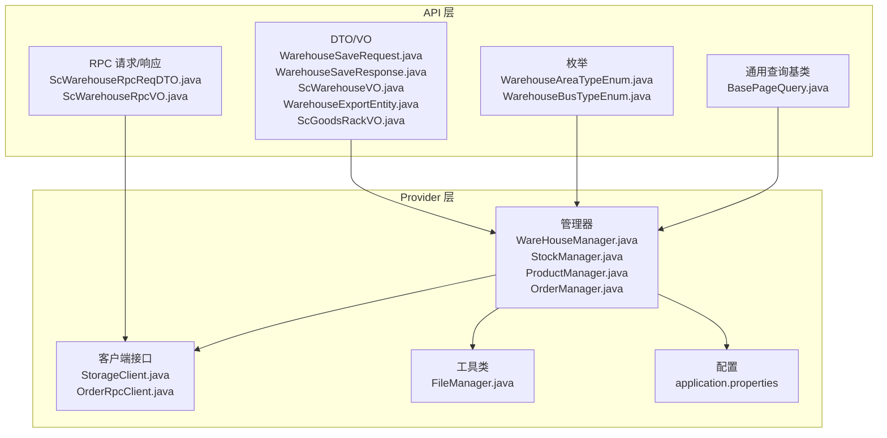
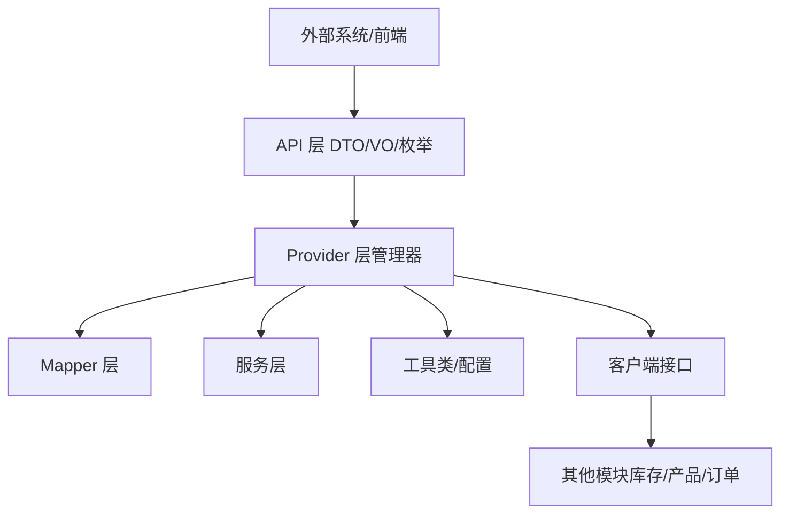
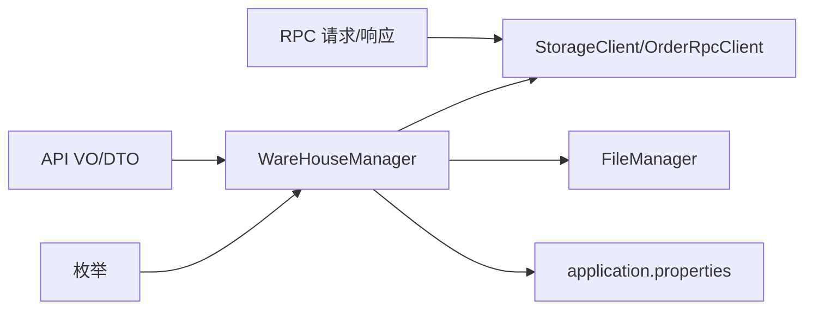
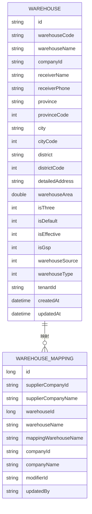

# 仓库管理模块

<cite>
**本文引用的文件**
- [WarehouseSaveRequest.java](file://guoke-deepexi-storage-center-api/src/main/java/com/deepexi/api/storage/dto/warehouse/WarehouseSaveRequest.java)
- [WarehouseSaveResponse.java](file://guoke-deepexi-storage-center-api/src/main/java/com/deepexi/api/storage/dto/warehouse/WarehouseSaveResponse.java)
- [ScWarehouseVO.java](file://guoke-deepexi-storage-center-api/src/main/java/com/deepexi/api/storage/dto/warehouse/ScWarehouseVO.java)
- [WarehouseExportEntity.java](file://guoke-deepexi-storage-center-api/src/main/java/com/deepexi/api/storage/dto/warehouse/WarehouseExportEntity.java)
- [WarehouseAreaTypeEnum.java](file://guoke-deepexi-storage-center-api/src/main/java/com/deepexi/api/storage/enums/WarehouseAreaTypeEnum.java)
- [WarehouseBusTypeEnum.java](file://guoke-deepexi-storage-center-api/src/main/java/com/deepexi/api/storage/enums/WarehouseBusTypeEnum.java)
- [QueryWarehouseMappingRequest.java](file://guoke-deepexi-storage-center-api/src/main/java/com/deepexi/api/storage/pojo/dto/warehouse/QueryWarehouseMappingRequest.java)
- [SaveWarehouseMappingRequest.java](file://guoke-deepexi-storage-center-api/src/main/java/com/deepexi/api/storage/pojo/dto/warehouse/SaveWarehouseMappingRequest.java)
- [WarehouseInfoResponse.java](file://guoke-deepexi-storage-center-api/src/main/java/com/deepexi/api/storage/dto/WarehouseInfoResponse.java)
- [WarehouseMappingResponse.java](file://guoke-deepexi-storage-center-api/src/main/java/com/deepexi/api/storage/dto/WarehouseMappingResponse.java)
- [ScGoodsRackVO.java](file://guoke-deepexi-storage-center-api/src/main/java/com/deepexi/api/storage/dto/warehouse/ScGoodsRackVO.java)
- [ScWarehouseRpcReqDTO.java](file://guoke-deepexi-storage-center-api/src/main/java/com/deepexi/api/storage/pojo/dto/stock/req/ScWarehouseRpcReqDTO.java)
- [ScWarehouseRpcVO.java](file://guoke-deepexi-storage-center-api/src/main/java/com/deepexi/api/storage/pojo/dto/stock/res/ScWarehouseRpcVO.java)
- [StorageClient.java](file://guoke-deepexi-storage-center-api/src/main/java/com/deepexi/api/StorageClient.java)
- [OrderRpcClient.java](file://guoke-deepexi-storage-center-api/src/main/java/com/deepexi/api/OrderRpcClient.java)
- [WareHouseManager.java](file://guoke-deepexi-storage-center-provider/src/main/java/com/deepexi/storage/manager/WareHouseManager.java)
- [StockManager.java](file://guoke-deepexi-storage-center-provider/src/main/java/com/deepexi/storage/manager/StockManager.java)
- [ProductManager.java](file://guoke-deepexi-storage-center-provider/src/main/java/com/deepexi/storage/manager/ProductManager.java)
- [OrderManager.java](file://guoke-deepexi-storage-center-provider/src/main/java/com/deepexi/storage/manager/OrderManager.java)
- [FileManager.java](file://guoke-deepexi-storage-center-provider/src/main/java/com/deepexi/storage/common/util/FileManager.java)
- [BasePageQuery.java](file://guoke-deepexi-storage-center-api/src/main/java/com/deepexi/api/storage/pojo/dto/common/BasePageQuery.java)
- [application.properties](file://guoke-deepexi-storage-center-provider/src/main/resources/application.properties)
</cite>

## 目录
1. [简介](#简介)
2. [项目结构](#项目结构)
3. [核心组件](#核心组件)
4. [架构总览](#架构总览)
5. [详细组件分析](#详细组件分析)
6. [依赖分析](#依赖分析)
7. [性能考虑](#性能考虑)
8. [故障排查指南](#故障排查指南)
9. [结论](#结论)
10. [附录](#附录)

## 简介
本文件面向国科恒泰仓储管理系统中的“仓库管理模块”，围绕仓库配置、货架管理、区域管理等核心能力，系统化阐述数据模型、业务规则、API 接口、数据导入导出、批量配置与校验机制、扩展点（多仓库、多货主）、以及权限与安全控制要点。文档同时梳理仓库与产品、库存、订单等模块的关联关系与数据交互方式，帮助开发者与运维人员快速理解并高效使用该模块。

## 项目结构
仓库管理模块位于 API 层与 Provider 层中，分别定义了对外 DTO、枚举、RPC 请求/响应与内部管理器、服务层、Mapper 层等。API 层提供仓库相关的请求/响应对象与枚举，Provider 层提供仓库管理的业务实现与数据访问。

图表来源
- [WarehouseSaveRequest.java:1-61](file://guoke-deepexi-storage-center-api/src/main/java/com/deepexi/api/storage/dto/warehouse/WarehouseSaveRequest.java#L1-L61)
- [ScWarehouseVO.java:1-205](file://guoke-deepexi-storage-center-api/src/main/java/com/deepexi/api/storage/dto/warehouse/ScWarehouseVO.java#L1-L205)
- [WarehouseAreaTypeEnum.java:1-69](file://guoke-deepexi-storage-center-api/src/main/java/com/deepexi/api/storage/enums/WarehouseAreaTypeEnum.java#L1-L69)
- [WarehouseBusTypeEnum.java:1-20](file://guoke-deepexi-storage-center-api/src/main/java/com/deepexi/api/storage/enums/WarehouseBusTypeEnum.java#L1-L20)
- [ScWarehouseRpcReqDTO.java](file://guoke-deepexi-storage-center-api/src/main/java/com/deepexi/api/storage/pojo/dto/stock/req/ScWarehouseRpcReqDTO.java)
- [ScWarehouseRpcVO.java](file://guoke-deepexi-storage-center-api/src/main/java/com/deepexi/api/storage/pojo/dto/stock/res/ScWarehouseRpcVO.java)
- [BasePageQuery.java](file://guoke-deepexi-storage-center-api/src/main/java/com/deepexi/api/storage/pojo/dto/common/BasePageQuery.java)
- [WareHouseManager.java](file://guoke-deepexi-storage-center-provider/src/main/java/com/deepexi/storage/manager/WareHouseManager.java)
- [StockManager.java](file://guoke-deepexi-storage-center-provider/src/main/java/com/deepexi/storage/manager/StockManager.java)
- [ProductManager.java](file://guoke-deepexi-storage-center-provider/src/main/java/com/deepexi/storage/manager/ProductManager.java)
- [OrderManager.java](file://guoke-deepexi-storage-center-provider/src/main/java/com/deepexi/storage/manager/OrderManager.java)
- [StorageClient.java](file://guoke-deepexi-storage-center-api/src/main/java/com/deepexi/api/StorageClient.java)
- [OrderRpcClient.java](file://guoke-deepexi-storage-center-api/src/main/java/com/deepexi/api/OrderRpcClient.java)
- [FileManager.java](file://guoke-deepexi-storage-center-provider/src/main/java/com/deepexi/storage/common/util/FileManager.java)
- [application.properties](file://guoke-deepexi-storage-center-provider/src/main/resources/application.properties)

章节来源
- [WarehouseSaveRequest.java:1-61](file://guoke-deepexi-storage-center-api/src/main/java/com/deepexi/api/storage/dto/warehouse/WarehouseSaveRequest.java#L1-L61)
- [ScWarehouseVO.java:1-205](file://guoke-deepexi-storage-center-api/src/main/java/com/deepexi/api/storage/dto/warehouse/ScWarehouseVO.java#L1-L205)
- [WarehouseAreaTypeEnum.java:1-69](file://guoke-deepexi-storage-center-api/src/main/java/com/deepexi/api/storage/enums/WarehouseAreaTypeEnum.java#L1-L69)
- [WarehouseBusTypeEnum.java:1-20](file://guoke-deepexi-storage-center-api/src/main/java/com/deepexi/api/storage/enums/WarehouseBusTypeEnum.java#L1-L20)
- [ScWarehouseRpcReqDTO.java](file://guoke-deepexi-storage-center-api/src/main/java/com/deepexi/api/storage/pojo/dto/stock/req/ScWarehouseRpcReqDTO.java)
- [ScWarehouseRpcVO.java](file://guoke-deepexi-storage-center-api/src/main/java/com/deepexi/api/storage/pojo/dto/stock/res/ScWarehouseRpcVO.java)
- [BasePageQuery.java](file://guoke-deepexi-storage-center-api/src/main/java/com/deepexi/api/storage/pojo/dto/common/BasePageQuery.java)
- [WareHouseManager.java](file://guoke-deepexi-storage-center-provider/src/main/java/com/deepexi/storage/manager/WareHouseManager.java)
- [StockManager.java](file://guoke-deepexi-storage-center-provider/src/main/java/com/deepexi/storage/manager/StockManager.java)
- [ProductManager.java](file://guoke-deepexi-storage-center-provider/src/main/java/com/deepexi/storage/manager/ProductManager.java)
- [OrderManager.java](file://guoke-deepexi-storage-center-provider/src/main/java/com/deepexi/storage/manager/OrderManager.java)
- [StorageClient.java](file://guoke-deepexi-storage-center-api/src/main/java/com/deepexi/api/StorageClient.java)
- [OrderRpcClient.java](file://guoke-deepexi-storage-center-api/src/main/java/com/deepexi/api/OrderRpcClient.java)
- [FileManager.java](file://guoke-deepexi-storage-center-provider/src/main/java/com/deepexi/storage/common/util/FileManager.java)
- [application.properties](file://guoke-deepexi-storage-center-provider/src/main/resources/application.properties)

## 核心组件
- 仓库配置与基本信息：通过仓库保存请求对象与仓库 VO 对象承载仓库基础信息、地址、联系人、管理员、面积、是否三方仓、是否默认仓、是否有效等字段。
- 仓库区域类型：通过区域枚举定义不同颜色与用途的存储区域（如合格品区、待验区、不合格品区、发货区、退货区、召回区）。
- 仓库业务类型：通过业务类型枚举区分普通仓库与样品仓库。
- 仓库 RPC 接口：通过 RPC 请求/响应对象与客户端接口进行跨模块调用。
- 仓库映射与查询：通过仓库映射的查询与保存请求对象，支持供应商与仓库的映射关系维护与查询。
- 数据导出实体：通过导出实体定义仓库导出字段与顺序。

章节来源
- [WarehouseSaveRequest.java:1-61](file://guoke-deepexi-storage-center-api/src/main/java/com/deepexi/api/storage/dto/warehouse/WarehouseSaveRequest.java#L1-L61)
- [ScWarehouseVO.java:1-205](file://guoke-deepexi-storage-center-api/src/main/java/com/deepexi/api/storage/dto/warehouse/ScWarehouseVO.java#L1-L205)
- [WarehouseAreaTypeEnum.java:1-69](file://guoke-deepexi-storage-center-api/src/main/java/com/deepexi/api/storage/enums/WarehouseAreaTypeEnum.java#L1-L69)
- [WarehouseBusTypeEnum.java:1-20](file://guoke-deepexi-storage-center-api/src/main/java/com/deepexi/api/storage/enums/WarehouseBusTypeEnum.java#L1-L20)
- [ScWarehouseRpcReqDTO.java](file://guoke-deepexi-storage-center-api/src/main/java/com/deepexi/api/storage/pojo/dto/stock/req/ScWarehouseRpcReqDTO.java)
- [ScWarehouseRpcVO.java](file://guoke-deepexi-storage-center-api/src/main/java/com/deepexi/api/storage/pojo/dto/stock/res/ScWarehouseRpcVO.java)
- [QueryWarehouseMappingRequest.java:1-39](file://guoke-deepexi-storage-center-api/src/main/java/com/deepexi/api/storage/pojo/dto/warehouse/QueryWarehouseMappingRequest.java#L1-L39)
- [SaveWarehouseMappingRequest.java:1-58](file://guoke-deepexi-storage-center-api/src/main/java/com/deepexi/api/storage/pojo/dto/warehouse/SaveWarehouseMappingRequest.java#L1-L58)
- [WarehouseExportEntity.java:1-55](file://guoke-deepexi-storage-center-api/src/main/java/com/deepexi/api/storage/dto/warehouse/WarehouseExportEntity.java#L1-L55)

## 架构总览
仓库管理模块采用分层架构，API 层负责对外 DTO/VO 与枚举，Provider 层负责业务实现与数据访问，客户端接口负责跨模块通信。

图表来源
- [WareHouseManager.java](file://guoke-deepexi-storage-center-provider/src/main/java/com/deepexi/storage/manager/WareHouseManager.java)
- [StockManager.java](file://guoke-deepexi-storage-center-provider/src/main/java/com/deepexi/storage/manager/StockManager.java)
- [ProductManager.java](file://guoke-deepexi-storage-center-provider/src/main/java/com/deepexi/storage/manager/ProductManager.java)
- [OrderManager.java](file://guoke-deepexi-storage-center-provider/src/main/java/com/deepexi/storage/manager/OrderManager.java)
- [StorageClient.java](file://guoke-deepexi-storage-center-api/src/main/java/com/deepexi/api/StorageClient.java)
- [OrderRpcClient.java](file://guoke-deepexi-storage-center-api/src/main/java/com/deepexi/api/OrderRpcClient.java)

## 详细组件分析

### 仓库数据模型与字段说明
- 仓库基本信息：仓库名称、仓库编码、所属公司、联系人、电话、地址（省市区、详细地址）、面积、管理员、是否三方仓、是否默认仓、是否有效、GSP 符合性、仓库来源、仓库类型、仓库属性、租户标识、创建/更新信息等。
- 仓库映射：供应商公司 ID/名称、仓库 ID/名称、映射仓库名称、公司 ID/名称、更新人 ID/名称等。
- 导出字段：仓库编码、名称、仓库属性、所属公司、仓库地址、联系人、电话、管理员、管理员电话、温度类型、面积、三方仓、默认仓、状态等。

章节来源
- [ScWarehouseVO.java:1-205](file://guoke-deepexi-storage-center-api/src/main/java/com/deepexi/api/storage/dto/warehouse/ScWarehouseVO.java#L1-L205)
- [SaveWarehouseMappingRequest.java:1-58](file://guoke-deepexi-storage-center-api/src/main/java/com/deepexi/api/storage/pojo/dto/warehouse/SaveWarehouseMappingRequest.java#L1-L58)
- [WarehouseExportEntity.java:1-55](file://guoke-deepexi-storage-center-api/src/main/java/com/deepexi/api/storage/dto/warehouse/WarehouseExportEntity.java#L1-L55)

### 仓库区域管理与业务规则
- 区域类型枚举定义了多种存储区域及其颜色与代码，支持根据代码获取外部标识码（如 Q/D/N/S/R 等），用于与外部系统对接或打印标签。
- 业务规则建议：
  - 合格品区：仅允许合格产品入库与出库。
  - 待验区：所有到货产品先入待验区，经检验后转入合格或不合格区。
  - 不合格品区：仅允许不合格产品存放，禁止出库。
  - 发货区：仅允许已复核完成的订单产品进入，避免错发。
  - 退货区/召回区：退货与召回产品单独分区管理，便于追溯与处理。

章节来源
- [WarehouseAreaTypeEnum.java:1-69](file://guoke-deepexi-storage-center-api/src/main/java/com/deepexi/api/storage/enums/WarehouseAreaTypeEnum.java#L1-L69)

### 仓库配置参数与设置方法
- 仓库类型：自有库、商业分库、医院寄售等属性通过 VO 中的仓库类型与属性字段体现。
- 仓库属性：仓库来源、仓库属性、是否三方仓、是否默认仓、是否有效、GSP 符合性等。
- 业务规则：通过业务类型枚举区分普通仓库与样品仓库；通过区域类型枚举约束不同区域的业务行为。
- 设置建议：
  - 仓库属性与来源需与财务/合同系统保持一致。
  - 默认仓用于订单拣货优先级，应谨慎设置。
  - 三方仓需与第三方平台对接，确保数据同步。

章节来源
- [ScWarehouseVO.java:1-205](file://guoke-deepexi-storage-center-api/src/main/java/com/deepexi/api/storage/dto/warehouse/ScWarehouseVO.java#L1-L205)
- [WarehouseBusTypeEnum.java:1-20](file://guoke-deepexi-storage-center-api/src/main/java/com/deepexi/api/storage/enums/WarehouseBusTypeEnum.java#L1-L20)

### 货架与货位管理
- 货架视图对象包含货架列表，用于展示仓库内的货架布局与货位分配情况。
- 建议：
  - 货架编号唯一且可读性强，便于人工与系统识别。
  - 货位按 ABC 分类策略管理，结合产品特性（温控、禁配等）进行分区。

章节来源
- [ScGoodsRackVO.java](file://guoke-deepexi-storage-center-api/src/main/java/com/depexi/api/storage/dto/warehouse/ScGoodsRackVO.java)

### 仓库与产品、库存、订单的关联关系
- 仓库与产品：通过产品仓库绑定关系，确定产品可在哪些仓库存储与销售。
- 仓库与库存：库存以仓库+产品维度进行统计与管理，支持按仓库维度汇总可用量、锁定量、预警等。
- 仓库与订单：订单出库时依据仓库默认仓、拣货策略与区域状态进行拣货与复核。

章节来源
- [ProductManager.java](file://guoke-deepexi-storage-center-provider/src/main/java/com/depexi/storage/manager/ProductManager.java)
- [StockManager.java](file://guoke-deepexi-storage-center-provider/src/main/java/com/depexi/storage/manager/StockManager.java)
- [OrderManager.java](file://guoke-deepexi-storage-center-provider/src/main/java/com/depexi/storage/manager/OrderManager.java)

### 数据导入导出与批量配置
- 导出：通过导出实体定义导出字段与排序，支持 Excel 导出仓库清单。
- 批量配置：可通过映射请求对象批量维护供应商与仓库的映射关系，结合分页查询进行批量导入/更新。
- 数据验证：仓库保存请求对象对必填字段进行校验（如所属公司、仓库名称、仓库编码、联系人、电话、地址等）。

章节来源
- [WarehouseExportEntity.java:1-55](file://guoke-deepexi-storage-center-api/src/main/java/com/depexi/api/storage/dto/warehouse/WarehouseExportEntity.java#L1-L55)
- [SaveWarehouseMappingRequest.java:1-58](file://guoke-deepexi-storage-center-api/src/main/java/com/depexi/api/storage/pojo/dto/warehouse/SaveWarehouseMappingRequest.java#L1-L58)
- [QueryWarehouseMappingRequest.java:1-39](file://guoke-deepexi-storage-center-api/src/main/java/com/depexi/api/storage/pojo/dto/warehouse/QueryWarehouseMappingRequest.java#L1-L39)
- [WarehouseSaveRequest.java:1-61](file://guoke-deepexi-storage-center-api/src/main/java/com/depexi/api/storage/dto/warehouse/WarehouseSaveRequest.java#L1-L61)

### 扩展点与多仓库/多货主支持
- 多仓库：通过仓库 VO 的子仓库列表与货架列表，支持主仓库与子仓库的层级组织。
- 多货主：通过仓库映射对象支持供应商与仓库的映射关系，实现多货主下的仓库共享与隔离。
- 租户隔离：仓库 VO 提供租户标识字段，支持多租户环境下的数据隔离。

章节来源
- [ScWarehouseVO.java:1-205](file://guoke-deepexi-storage-center-api/src/main/java/com/depexi/api/storage/dto/warehouse/ScWarehouseVO.java#L1-L205)
- [SaveWarehouseMappingRequest.java:1-58](file://guoke-deepexi-storage-center-api/src/main/java/com/depexi/api/storage/pojo/dto/warehouse/SaveWarehouseMappingRequest.java#L1-L58)

### 权限控制与安全机制
- 认证与授权：通过客户端接口与统一鉴权中心对接，确保仓库相关操作具备合法权限。
- 数据隔离：基于租户标识与公司标识进行数据过滤，防止越权访问。
- 操作审计：仓库创建/修改/删除记录包含创建人、修改人、时间戳等字段，便于审计追踪。

章节来源
- [StorageClient.java](file://guoke-deepexi-storage-center-api/src/main/java/com/depexi/api/StorageClient.java)
- [ScWarehouseVO.java:1-205](file://guoke-deepexi-storage-center-api/src/main/java/com/depexi/api/storage/dto/warehouse/ScWarehouseVO.java#L1-L205)

## 依赖分析
仓库管理模块的依赖关系如下：

图表来源
- [ScWarehouseVO.java:1-205](file://guoke-deepexi-storage-center-api/src/main/java/com/depexi/api/storage/dto/warehouse/ScWarehouseVO.java#L1-L205)
- [WarehouseAreaTypeEnum.java:1-69](file://guoke-deepexi-storage-center-api/src/main/java/com/depexi/api/storage/enums/WarehouseAreaTypeEnum.java#L1-L69)
- [StorageClient.java](file://guoke-deepexi-storage-center-api/src/main/java/com/depexi/api/StorageClient.java)
- [OrderRpcClient.java](file://guoke-deepexi-storage-center-api/src/main/java/com/depexi/api/OrderRpcClient.java)
- [WareHouseManager.java](file://guoke-deepexi-storage-center-provider/src/main/java/com/depexi/storage/manager/WareHouseManager.java)
- [FileManager.java](file://guoke-deepexi-storage-center-provider/src/main/java/com/depexi/storage/common/util/FileManager.java)
- [application.properties](file://guoke-deepexi-storage-center-provider/src/main/resources/application.properties)

章节来源
- [ScWarehouseVO.java:1-205](file://guoke-deepexi-storage-center-api/src/main/java/com/depexi/api/storage/dto/warehouse/ScWarehouseVO.java#L1-L205)
- [WarehouseAreaTypeEnum.java:1-69](file://guoke-deepexi-storage-center-api/src/main/java/com/depexi/api/storage/enums/WarehouseAreaTypeEnum.java#L1-L69)
- [StorageClient.java](file://guoke-deepexi-storage-center-api/src/main/java/com/depexi/api/StorageClient.java)
- [OrderRpcClient.java](file://guoke-deepexi-storage-center-api/src/main/java/com/depexi/api/OrderRpcClient.java)
- [WareHouseManager.java](file://guoke-deepexi-storage-center-provider/src/main/java/com/depexi/storage/manager/WareHouseManager.java)
- [FileManager.java](file://guoke-deepexi-storage-center-provider/src/main/java/com/depexi/storage/common/util/FileManager.java)
- [application.properties](file://guoke-deepexi-storage-center-provider/src/main/resources/application.properties)

## 性能考虑
- 查询优化：仓库列表查询建议使用分页查询基类，避免一次性加载过多数据。
- 导出优化：导出实体字段明确，建议按需导出，避免冗余列导致内存压力。
- 缓存策略：对于常用配置（如仓库类型、区域类型）可引入缓存，减少重复查询。
- 并发控制：仓库保存/更新涉及幂等性与并发写入，建议引入分布式锁或版本号控制。

## 故障排查指南
- 仓库保存失败：检查必填字段是否为空，特别是所属公司、仓库名称、仓库编码、联系人、电话、地址等。
- 导出异常：确认导出字段与模板匹配，检查文件生成与下载路径。
- 映射不生效：核对供应商公司 ID/名称、仓库 ID/名称与映射仓库名称是否正确，确认更新人与更新时间范围。
- RPC 调用失败：检查客户端接口配置与鉴权信息，确认目标模块服务可用性。

章节来源
- [WarehouseSaveRequest.java:1-61](file://guoke-deepexi-storage-center-api/src/main/java/com/depexi/api/storage/dto/warehouse/WarehouseSaveRequest.java#L1-L61)
- [WarehouseExportEntity.java:1-55](file://guoke-deepexi-storage-center-api/src/main/java/com/depexi/api/storage/dto/warehouse/WarehouseExportEntity.java#L1-L55)
- [SaveWarehouseMappingRequest.java:1-58](file://guoke-deepexi-storage-center-api/src/main/java/com/depexi/api/storage/pojo/dto/warehouse/SaveWarehouseMappingRequest.java#L1-L58)
- [StorageClient.java](file://guoke-deepexi-storage-center-api/src/main/java/com/depexi/api/StorageClient.java)

## 结论
仓库管理模块通过清晰的数据模型、完善的枚举体系与 RPC 接口，实现了仓库配置、货架与区域管理、映射与导出等功能。结合产品、库存、订单模块，形成完整的仓储业务闭环。建议在实际部署中关注多仓库/多货主场景下的数据隔离与权限控制，并通过分页查询、导出优化与缓存策略提升性能与稳定性。

## 附录

### API 接口定义（仓库）
- 新增仓库
  - 请求对象：[WarehouseSaveRequest.java:1-61](file://guoke-deepexi-storage-center-api/src/main/java/com/depexi/api/storage/dto/warehouse/WarehouseSaveRequest.java#L1-L61)
  - 响应对象：[WarehouseSaveResponse.java:1-28](file://guoke-deepexi-storage-center-api/src/main/java/com/depexi/api/storage/dto/warehouse/WarehouseSaveResponse.java#L1-L28)
  - 说明：必填字段包括所属公司、仓库名称、仓库编码、联系人、电话、地址等；返回仓库 ID/编码/名称。
- 查询仓库
  - 请求对象：[BasePageQuery.java](file://guoke-deepexi-storage-center-api/src/main/java/com/depexi/api/storage/pojo/dto/common/BasePageQuery.java)
  - 响应对象：仓库 VO 列表（见下文）
  - 说明：支持分页查询，结合仓库名称、公司等条件筛选。
- 更新仓库
  - 请求对象：仓库 VO（见仓库详情）
  - 说明：支持修改仓库属性、地址、联系人、管理员、面积、状态等。
- 删除仓库
  - 说明：需确保仓库下无库存与未完结订单，否则拒绝删除。
- 仓库详情
  - 响应对象：[ScWarehouseVO.java:1-205](file://guoke-deepexi-storage-center-api/src/main/java/com/depexi/api/storage/dto/warehouse/ScWarehouseVO.java#L1-L205)
  - 说明：包含仓库基本信息、区域类型、货架列表、映射关系等。

章节来源
- [WarehouseSaveRequest.java:1-61](file://guoke-deepexi-storage-center-api/src/main/java/com/depexi/api/storage/dto/warehouse/WarehouseSaveRequest.java#L1-L61)
- [WarehouseSaveResponse.java:1-28](file://guoke-deepexi-storage-center-api/src/main/java/com/depexi/api/storage/dto/warehouse/WarehouseSaveResponse.java#L1-L28)
- [BasePageQuery.java](file://guoke-deepexi-storage-center-api/src/main/java/com/depexi/api/storage/pojo/dto/common/BasePageQuery.java)
- [ScWarehouseVO.java:1-205](file://guoke-deepexi-storage-center-api/src/main/java/com/depexi/api/storage/dto/warehouse/ScWarehouseVO.java#L1-L205)

### API 接口定义（仓库映射）
- 保存仓库映射
  - 请求对象：[SaveWarehouseMappingRequest.java:1-58](file://guoke-deepexi-storage-center-api/src/main/java/com/depexi/api/storage/pojo/dto/warehouse/SaveWarehouseMappingRequest.java#L1-L58)
  - 说明：支持供应商与仓库的映射关系维护。
- 查询仓库映射
  - 请求对象：[QueryWarehouseMappingRequest.java:1-39](file://guoke-deepexi-storage-center-api/src/main/java/com/depexi/api/storage/pojo/dto/warehouse/QueryWarehouseMappingRequest.java#L1-L39)
  - 说明：支持按供应商、仓库名称、更新时间等条件查询。

章节来源
- [SaveWarehouseMappingRequest.java:1-58](file://guoke-deepexi-storage-center-api/src/main/java/com/depexi/api/storage/pojo/dto/warehouse/SaveWarehouseMappingRequest.java#L1-L58)
- [QueryWarehouseMappingRequest.java:1-39](file://guoke-deepexi-storage-center-api/src/main/java/com/depexi/api/storage/pojo/dto/warehouse/QueryWarehouseMappingRequest.java#L1-L39)

### API 接口定义（RPC）
- 仓库 RPC 请求
  - 请求对象：[ScWarehouseRpcReqDTO.java](file://guoke-deepexi-storage-center-api/src/main/java/com/depexi/api/storage/pojo/dto/stock/req/ScWarehouseRpcReqDTO.java)
  - 说明：用于跨模块传递仓库相关信息。
- 仓库 RPC 响应
  - 响应对象：[ScWarehouseRpcVO.java](file://guoke-deepexi-storage-center-api/src/main/java/com/depexi/api/storage/pojo/dto/stock/res/ScWarehouseRpcVO.java)
  - 说明：用于接收仓库 RPC 返回结果。

章节来源
- [ScWarehouseRpcReqDTO.java](file://guoke-deepexi-storage-center-api/src/main/java/com/depexi/api/storage/pojo/dto/stock/req/ScWarehouseRpcReqDTO.java)
- [ScWarehouseRpcVO.java](file://guoke-deepexi-storage-center-api/src/main/java/com/depexi/api/storage/pojo/dto/stock/res/ScWarehouseRpcVO.java)

### 数据模型关系图

图表来源
- [ScWarehouseVO.java:1-205](file://guoke-deepexi-storage-center-api/src/main/java/com/depexi/api/storage/dto/warehouse/ScWarehouseVO.java#L1-L205)
- [SaveWarehouseMappingRequest.java:1-58](file://guoke-deepexi-storage-center-api/src/main/java/com/depexi/api/storage/pojo/dto/warehouse/SaveWarehouseMappingRequest.java#L1-L58)