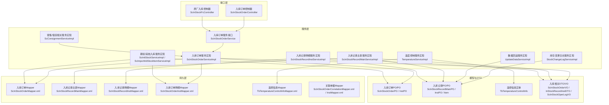
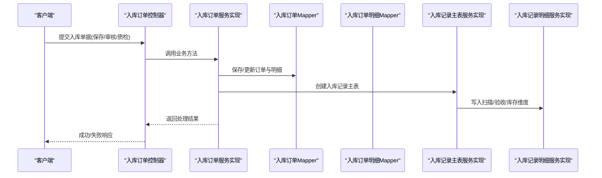
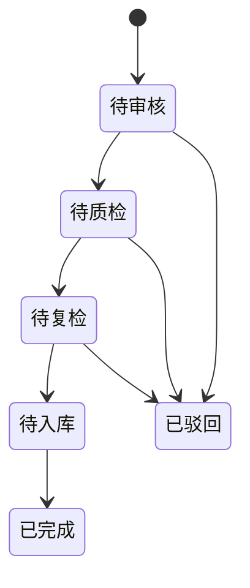
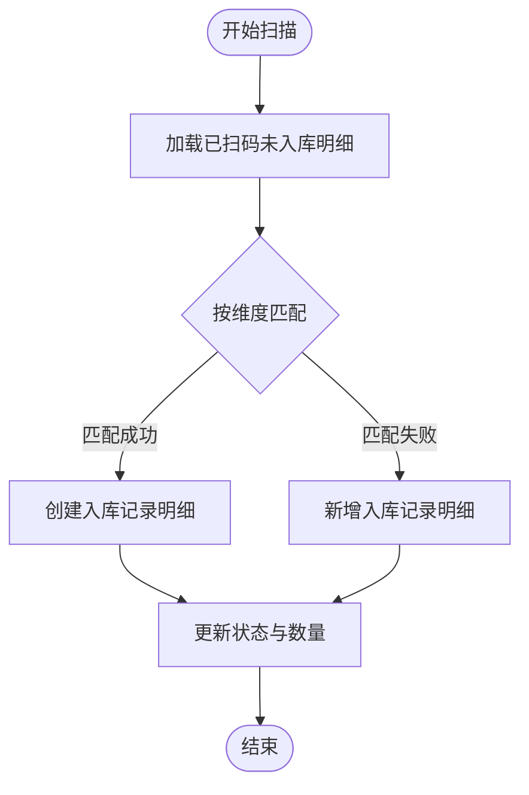
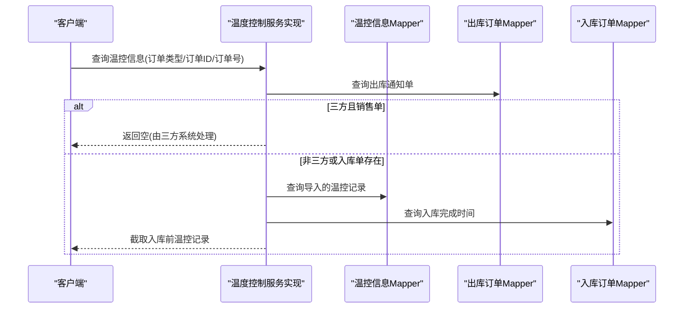

# 入库管理模块

<cite>
**本文引用的文件**   
- [ScInStockOrderController.java](file://guoke-deepexi-storage-center-provider/src/main/java/com/ deepexi/storage/controller/web/ScInStockOrderController.java)
- [ScInStockFcController.java](file://guoke-deepexi-storage-center-provider/src/main/java/com/ deepexi/storage/controller/web/ScInStockFcController.java)
- [ScInStockOrderService.java](file://guoke-deepexi-storage-center-provider/src/main/java/com/ deepexi/storage/service/ScInStockOrderService.java)
- [ScInStockOrderServiceImpl.java](file://guoke-deepexi-storage-center-provider/src/main/java/com/ deepexi/storage/service/impl/ScInStockOrderServiceImpl.java)
- [ScInStockRecordMainServiceImpl.java](file://guoke-deepexi-storage-center-provider/src/main/java/com/ deepexi/storage/service/impl/ScInStockRecordMainServiceImpl.java)
- [ScInStockRecordInstServiceImpl.java](file://guoke-deepexi-storage-center-provider/src/main/java/com/ deepexi/storage/service/impl/ScInStockRecordInstServiceImpl.java)
- [ScInitStockServiceImpl.java](file://guoke-deepexi-storage-center-provider/src/main/java/com/ deepexi/storage/service/impl/ScInitStockServiceImpl.java)
- [ScImportInitStockItemServiceImpl.java](file://guoke-deepexi-storage-center-provider/src/main/java/com/ deepexi/storage/service/impl/ScImportInitStockItemServiceImpl.java)
- [TemperatureServiceImpl.java](file://guoke-deepexi-storage-center-provider/src/main/java/com/ deepexi/storage/service/impl/TemperatureServiceImpl.java)
- [TbTemperatureControlInfoMapper.xml](file://guoke-deepexi-storage-center-provider/src/main/resources/mapper/TbTemperatureControlInfoMapper.xml)
- [StockInTypeEnum.java](file://guoke-deepexi-storage-center-api/src/main/java/com/deepexi/api/storage/enums/in/StockInTypeEnum.java)
- [StockInObjTypeEnum.java](file://guoke-deepexi-storage-center-api/src/main/java/com/deepexi/api/storage/enums/in/StockInObjTypeEnum.java)
- [StockInOrderStatusEnum.java](file://guoke-deepexi-storage-center-api/src/main/java/com/deepexi/api/storage/enums/in/StockInOrderStatusEnum.java)
- [InStockRecordInstDTO.java](file://guoke-deepexi-storage-center-api/src/main/java/com/deepexi/api/storage/dto/InStockRecordInstDTO.java)
- [ScInStockOrderQuery.java](file://guoke-deepexi-storage-center-provider/src/main/java/com/ deepexi/storage/pojo/query/stockin/ScInStockOrderQuery.java)
- [ScWarehouseEntryQuery.java](file://guoke-deepexi-storage-center-provider/src/main/java/com/ deepexi/storage/pojo/query/storage/ScWarehouseEntryQuery.java)
- [ScInStockOperLogVO.java](file://guoke-deepexi-storage-center-provider/src/main/java/com/ deepexi/storage/pojo/vo/stockin/ScInStockOperLogVO.java)
- [ScInStockOrderVO.java](file://guoke-deepexi-storage-center-provider/src/main/java/com/ deepexi/storage/pojo/vo/stockin/ScInStockOrderVO.java)
- [StockRecordMianQuery.java](file://guoke-deepexi-storage-center-provider/src/main/java/com/ deepexi/storage/pojo/query/stockin/StockRecordMianQuery.java)
- [ScConsignmentServiceImpl.java](file://guoke-deepexi-storage-center-provider/src/main/java/com/ deepexi/storage/service/impl/ScConsignmentServiceImpl.java)
- [StockChangeLogServiceImpl.java](file://guoke-deepexi-storage-center-provider/src/main/java/com/ deepexi/storage/service/impl/StockChangeLogServiceImpl.java)
- [UpdateDataServiceImpl.java](file://guoke-deepexi-storage-center-provider/src/main/java/com/ deepexi/storage/service/impl/UpdateDataServiceImpl.java)
- [ScInStockOrderMapper.xml](file://guoke-deepexi-storage-center-provider/src/main/resources/mapper/stockin/ScInStockOrderMapper.xml)
- [ScInStockRecordInstMapper.xml](file://guoke-deepexi-storage-center-provider/src/main/resources/mapper/stockin/ScInStockRecordInstMapper.xml)
- [ScInStockRecordMainMapper.xml](file://guoke-deepexi-storage-center-provider/src/main/resources/mapper/stockin/ScInStockRecordMainMapper.xml)
- [ScInStockOrderInstMapper.xml](file://guoke-deepexi-storage-center-provider/src/main/resources/mapper/stockin/ScInStockOrderInstMapper.xml)
- [ScInStockRecordItemMapper.xml](file://guoke-deepexi-storage-center-provider/src/main/resources/mapper/stockin/ScInStockRecordItemMapper.xml)
- [ScInStockRecordMainPO.java](file://guoke-deepexi-storage-center-provider/src/main/java/com/ deepexi/storage/model/ScInStockRecordMainPO.java)
- [ScInStockRecordInstPO.java](file://guoke-deepexi/storage/model/ScInStockRecordInstPO.java)
- [ScInStockOrderPO.java](file://guoke-deepexi-storage-center-provider/src/main/java/com/ deepexi/storage/model/ScInStockOrderPO.java)
- [ScInStockOrderInstPO.java](file://guoke-deepexi-storage-center-provider/src/main/java/com/ deepexi/storage/model/ScInStockOrderInstPO.java)
- [ScInStockRecordItem.java](file://guoke-deepexi-storage-center-provider/src/main/java/com/ deepexi/storage/model/ScInStockRecordItem.java)
- [ScInStockOperLogPO.java](file://guoke-deepexi-storage-center-provider/src/main/java/com/ deepexi/storage/model/ScInStockOperLogPO.java)
- [ScInStockRecordInst.java](file://guoke-deepexi-storage-center-provider/src/main/java/com/ deepexi/storage/model/ScInStockRecordInst.java)
- [ScInStockRecordInstDTO.java](file://guoke-deepexi-storage-center-api/src/main/java/com/deepexi/api/storage/dto/InStockRecordInstDTO.java)
- [ScInStockOrderForm.java](file://guoke-deepexi-storage-center-provider/src/main/java/com/ deepexi/storage/pojo/form/stockin/ScInStockOrderForm.java)
- [ScInStockReviewForm.java](file://guoke-deepexi-storage-center-provider/src/main/java/com/ deepexi/storage/pojo/form/stockin/ScInStockReviewForm.java)
- [orderPurchaseQuery.java](file://guoke-deepexi-storage-center-provider/src/main/java/com/ deepexi/storage/pojo/query/stockin/orderPurchaseQuery.java)
- [OrderPurchaseVO.java](file://guoke-deepexi-storage-center-provider/src/main/java/com/ deepexi/storage/pojo/vo/stockin/OrderPurchaseVO.java)
- [ScOutHistoryInfoVO.java](file://guoke-deepexi-storage-center-provider/src/main/java/com/ deepexi/storage/pojo/vo/stockout/sale/ScOutHistoryInfoVO.java)
- [ScInStockFcItemForm.java](file://guoke-deepexi-storage-center-provider/src/main/java/com/ deepexi/storage/pojo/form/stockin/ScInStockFcItemForm.java)
- [ScInStockFcVO.java](file://guoke-deepexi-storage-center-provider/src/main/java/com/ deepexi/storage/pojo/vo/stockin/ScInStockFcVO.java)
- [ScInStockOrderCorrelationInstPO.java](file://guoke-deepexi-storage-center-provider/src/main/java/com/ deepexi/storage/model/ScInStockOrderCorrelationInstPO.java)
- [ScInStockOrderCorrelationInstMapper.xml](file://guoke-deepexi-storage-center-provider/src/main/resources/mapper/stockin/ScInStockOrderCorrelationInstMapper.xml)
- [ScInStockOrderCorrelationMapper.xml](file://guoke-deepexi-storage-center-provider/src/main/resources/mapper/stockin/ScInStockOrderCorrelationMapper.xml)
- [ScInStockOrderCorrelationPO.java](file://guoke-deepexi-storage-center-provider/src/main/java/com/ deepexi/storage/model/ScInStockOrderCorrelationPO.java)
- [ScInStockOrderCorrelationInst.java](file://guoke-deepexi-storage-center-provider/src/main/java/com/ deepexi/storage/model/ScInStockOrderCorrelationInst.java)
- [ScInStockOrderCorrelationInstDTO.java](file://guoke-deepexi-storage-center-api/src/main/java/com/deepexi/api/storage/dto/ScInStockOrderCorrelationInstDTO.java)
- [ScInStockOrderCorrelationInstResponse.java](file://guoke-deepexi-storage-center-api/src/main/java/com/deepexi/api/storage/dto/ScInStockOrderCorrelationInstResponse.java)
- [ScInStockOrderCorrelationInstPageResponse.java](file://guoke-deepexi-storage-center-api/src/main/java/com/deepexi/api/storage/dto/ScInStockOrderCorrelationInstPageResponse.java)
- [ScInStockOrderCorrelationPageRequest.java](file://guoke-deepexi-storage-center-api/src/main/java/com/deepexi/api/storage/dto/ScInStockOrderCorrelationPageRequest.java)
- [ScInStockOrderCorrelationPageResponse.java](file://guoke-deepexi-storage-center-api/src/main/java/com/deepexi/api/storage/dto/ScInStockOrderCorrelationPageResponse.java)
- [ScInStockOrderCorrelationUpdateStatusRequest.java](file://guoke-deepexi-storage-center-api/src/main/java/com/deepexi/api/storage/dto/ScInStockOrderCorrelationUpdateStatusRequest.java)
- [ScInStockOrderCorrelationDetailResponse.java](file://guoke-deepexi-storage-center-api/src/main/java/com/deepexi/api/storage/dto/ScInStockOrderCorrelationDetailResponse.java)
- [ScInStockOrderCorrelationInstPageResponse.java](file://guoke-deepexi-storage-center-api/src/main/java/com/deepexi/api/storage/dto/ScInStockOrderCorrelationInstPageResponse.java)
- [ScInStockOrderCorrelationInstPageRequest.java](file://guoke-deepexi-storage-center-api/src/main/java/com/deepexi/api/storage/dto/ScInStockOrderCorrelationInstPageRequest.java)
- [ScInStockOrderCorrelationInstResponse.java](file://guoke-deepexi-storage-center-api/src/main/java/com/deepexi/api/storage/dto/ScInStockOrderCorrelationInstResponse.java)
- [ScInStockOrderCorrelationInstDTO.java](file://guoke-deepexi-storage-center-api/src/main/java/com/deepexi/api/storage/dto/ScInStockOrderCorrelationInstDTO.java)
- [ScInStockOrderCorrelationInstPageResponse.java](file://guoke-deepexi-storage-center-api/src/main/java/com/deepexi/api/storage/dto/ScInStockOrderCorrelationInstPageResponse.java)
- [ScInStockOrderCorrelationInstPageRequest.java](file://guoke-deepexi-storage-center-api/src/main/java/com/deepexi/api/storage/dto/ScInStockOrderCorrelationInstPageRequest.java)
- [ScInStockOrderCorrelationInstResponse.java](file://guoke-deepexi-storage-center-api/src/main/java/com/deepexi/api/storage/dto/ScInStockOrderCorrelationInstResponse.java)
- [ScInStockOrderCorrelationInstDTO.java](file://guoke-deepexi-storage-center-api/src/main/java/com/deepexi/api/storage/dto/ScInStockOrderCorrelationInstDTO.java)
- [ScInStockOrderCorrelationInstPageResponse.java](file://guoke-deepexi-storage-center-api/src/main/java/com/deepexi/api/storage/dto/ScInStockOrderCorrelationInstPageResponse.java)
- [ScInStockOrderCorrelationInstPageRequest.java](file://guoke-deepexi-storage-center-api/src/main/java/com/deepexi/api/storage/dto/ScInStockOrderCorrelationInstPageRequest.java)
- [ScInStockOrderCorrelationInstResponse.java](file://guoke-deepexi-storage-center-api/src/main/java/com/deepexi/api/storage/dto/ScInStockOrderCorrelationInstResponse.java)
- [ScInStockOrderCorrelationInstDTO.java](file://guoke-deepexi-storage-center-api/src/main/java/com/deepexi/api/storage/dto/ScInStockOrderCorrelationInstDTO.java)
- [ScInStockOrderCorrelationInstPageResponse.java](file://guoke-deepexi-storage-center-api/src/main/java/com/deepexi/api/storage/dto/ScInStockOrderCorrelationInstPageResponse.java)
- [ScInStockOrderCorrelationInstPageRequest.java](file://guoke-deepexi-storage-center-api/src/main/java/com/deepexi/api/storage/dto/ScInStockOrderCorrelationInstPageRequest.java)
- [ScInStockOrderCorrelationInstResponse.java](file://guoke-deepexi-storage-center-api/src/main/java/com/deepexi/api/storage/dto/ScInStockOrderCorrelationInstResponse.java)
- [ScInStockOrderCorrelationInstDTO.java](file://guoke-deepexi-storage-center-api/src/main/java/com/deepexi/api/storage/dto/ScInStockOrderCorrelationInstDTO.java)
- [ScInStockOrderCorrelationInstPageResponse.java](file://guoke-deepexi-storage-center-api/src/main/java/com/deepexi/api/storage/dto/ScInStockOrderCorrelationInstPageResponse.java)
- [ScInStockOrderCorrelationInstPageRequest.java](file://guoke-deepexi-storage-center-api/src/main/java/com/deepexi/api/storage/dto/ScInStockOrderCorrelationInstPageRequest.java)
- [ScInStockOrderCorrelationInstResponse.java](file://guoke-deepexi-storage-center-api/src/main/java/com/deepexi/api/storage/dto/ScInStockOrderCorrelationInstResponse.java)
- [ScInStockOrderCorrelationInstDTO.java](file://guoke-deepexi-storage-center-api/src/main/java/com/deepexi/api/storage/dto/ScInStockOrderCorrelationInstDTO.java)
- [ScInStockOrderCorrelationInstPageResponse.java](file://guoke-deepexi-storage-center-api/src/main/java/com/deepexi/api/storage/dto/ScInStockOrderCorrelationInstPageResponse.java)
- [ScInStockOrderCorrelationInstPageRequest.java](file://guoke-deepexi-storage-center-api/src/main/java/com/deepexi/api/storage/dto/ScInStockOrderCorrelationInstPageRequest.java)
- [ScInStockOrderCorrelationInstResponse.java](file://guoke-deepexi-storage-center-api/src/main/java/com/deepexi/api/storage/dto/ScInStockOrderCorrelationInstResponse.java)
- [ScInStockOrderCorrelationInstDTO.java](file://guoke-deepexi-storage-center-api/src/main/java/com/deepexi/api/storage/dto/ScInStockOrderCorrelationInstDTO.java)
- [ScInStockOrderCorrelationInstPageResponse.java](file://guoke-deepexi-storage-center-api/src......)
</cite>

## 目录
1. [简介](#简介)
2. [项目结构](#项目结构)
3. [核心组件](#核心组件)
4. [架构总览](#架构总览)
5. [详细组件分析](#详细组件分析)
6. [依赖关系分析](#依赖关系分析)
7. [性能考量](#性能考量)
8. [故障排查指南](#故障排查指南)
9. [结论](#结论)
10. [附录](#附录)

## 简介
本文件面向国科恒泰仓储管理系统“入库管理模块”，系统性梳理并说明入库业务的多类型流程与技术实现，覆盖采购入库、退货入库、调拨入库、其他入库等场景；阐述入库单据从创建、审核、执行到关闭的全生命周期；详解入库扫描、商品验收、批次管理、温度控制等关键能力；给出API接口清单与规范；解释数据验证、库存更新与日志记录机制；提供异常处理、重复入库检测与数据一致性保障方案，并说明可配置项与扩展点。

## 项目结构
入库管理模块由“接口层-服务层-持久层”三层构成，围绕入库订单、入库记录、库存维度与温控数据展开，同时集成其他入库类型与寄售/借货等特殊场景。



图表来源
- [ScInStockOrderController.java:36-160](file://guoke-deepexi-storage-center-provider/src/main/java/com/deepexi/storage/controller/web/ScInStockOrderController.java#L36-L160)
- [ScInStockFcController.java:32-67](file://guoke-deepexi-storage-center-provider/src/main/java/com/deepexi/storage/controller/web/ScInStockFcController.java#L32-L67)
- [ScInStockOrderService.java:111-157](file://guoke-deepexi-storage-center-provider/src/main/java/com/deepexi/storage/service/ScInStockOrderService.java#L111-L157)
- [ScInStockOrderServiceImpl.java:3226-3250](file://guoke-deepexi-storage-center-provider/src/main/java/com/deepexi/storage/service/impl/ScInStockOrderServiceImpl.java#L3226-L3250)
- [ScInStockRecordMainServiceImpl.java:310-329](file://guoke-deepexi-storage-center-provider/src/main/java/com/deepexi/storage/service/impl/ScInStockRecordMainServiceImpl.java#L310-L329)
- [ScInStockRecordInstServiceImpl.java:194-211](file://guoke-deepexi-storage-center-provider/src/main/java/com/deepexi/storage/service/impl/ScInStockRecordInstServiceImpl.java#L194-L211)
- [ScInitStockServiceImpl.java:116-160](file://guoke-deepexi-storage-center-provider/src/main/java/com/deepexi/storage/service/impl/ScInitStockServiceImpl.java#L116-L160)
- [ScImportInitStockItemServiceImpl.java:128-202](file://guoke-deepexi-storage-center-provider/src/main/java/com/deepexi/storage/service/impl/ScImportInitStockItemServiceImpl.java#L128-L202)
- [TemperatureServiceImpl.java:78-168](file://guoke-deepexi-storage-center-provider/src/main/java/com/deepexi/storage/service/impl/TemperatureServiceImpl.java#L78-L168)
- [ScConsignmentServiceImpl.java:948-965](file://guoke-deepexi-storage-center-provider/src/main/java/com/deepexi/storage/service/impl/ScConsignmentServiceImpl.java#L948-L965)
- [StockChangeLogServiceImpl.java:74-94](file://guoke-deepexi-storage-center-provider/src/main/java/com/deepexi/storage/service/impl/StockChangeLogServiceImpl.java#L74-L94)
- [UpdateDataServiceImpl.java:746-766](file://guoke-deepexi-storage-center-provider/src/main/java/com/deepexi/storage/service/impl/UpdateDataServiceImpl.java#L746-L766)
- [ScInStockOrderMapper.xml](file://guoke-deepexi-storage-center-provider/src/main/resources/mapper/stockin/ScInStockOrderMapper.xml)
- [ScInStockRecordMainMapper.xml](file://guoke-deepexi-storage-center-provider/src/main/resources/mapper/stockin/ScInStockRecordMainMapper.xml)
- [ScInStockRecordInstMapper.xml](file://guoke-deepexi-storage-center-provider/src/main/resources/mapper/stockin/ScInStockRecordInstMapper.xml)
- [ScInStockOrderInstMapper.xml](file://guoke-deepexi-storage-center-provider/src/main/resources/mapper/stockin/ScInStockOrderInstMapper.xml)
- [TbTemperatureControlInfoMapper.xml:1-19](file://guoke-deepexi-storage-center-provider/src/main/resources/mapper/TbTemperatureControlInfoMapper.xml#L1-L19)

章节来源
- [ScInStockOrderController.java:36-160](file://guoke-deepexi-storage-center-provider/src/main/java/com/deepexi/storage/controller/web/ScInStockOrderController.java#L36-L160)
- [ScInStockFcController.java:32-67](file://guoke-deepexi-storage-center-provider/src/main/java/com/deepexi/storage/controller/web/ScInStockFcController.java#L32-L67)

## 核心组件
- 入库订单控制器：提供入库订单的分页查询、保存、质检、复检、审核、按订单查询等接口。
- 入库订单服务：定义入库单据生命周期管理、统计、状态更新、红冲等核心方法。
- 入库记录服务：负责入库扫描、明细匹配、库存维度写入、状态推进与日志记录。
- 期初/其他入库：支持期初入库与“其他入库”的批量导入与校验、保存与执行。
- 温度控制：支持销售/采购单据的温控数据查询与导入，满足冷链运输监管要求。
- 关联单据：支持入库通知单与出库/其他单据的关联与状态联动。
- 数据一致性：通过分布式锁、库存维度校验、回滚逻辑与操作日志保障一致性。

章节来源
- [ScInStockOrderController.java:44-157](file://guoke-deepexi-storage-center-provider/src/main/java/com/deepexi/storage/controller/web/ScInStockOrderController.java#L44-L157)
- [ScInStockOrderService.java:111-157](file://guoke-deepexi-storage-center-provider/src/main/java/com/deepexi/storage/service/ScInStockOrderService.java#L111-L157)
- [ScInStockOrderServiceImpl.java:3226-3250](file://guoke-deepexi-storage-center-provider/src/main/java/com/deepexi/storage/service/impl/ScInStockOrderServiceImpl.java#L3226-L3250)
- [ScInStockRecordMainServiceImpl.java:310-329](file://guoke-deepexi-storage-center-provider/src/main/java/com/deepexi/storage/service/impl/ScInStockRecordMainServiceImpl.java#L310-L329)
- [ScInStockRecordInstServiceImpl.java:194-211](file://guoke-deepexi-storage-center-provider/src/main/java/com/deepexi/storage/service/impl/ScInStockRecordInstServiceImpl.java#L194-L211)
- [ScInitStockServiceImpl.java:116-160](file://guoke-deepexi-storage-center-provider/src/main/java/com/deepexi/storage/service/impl/ScInitStockServiceImpl.java#L116-L160)
- [ScImportInitStockItemServiceImpl.java:128-202](file://guoke-deepexi-storage-center-provider/src/main/java/com/deepexi/storage/service/impl/ScImportInitStockItemServiceImpl.java#L128-L202)
- [TemperatureServiceImpl.java:78-168](file://guoke-deepexi-storage-center-provider/src/main/java/com/deepexi/storage/service/impl/TemperatureServiceImpl.java#L78-L168)

## 架构总览
入库管理采用“控制器-服务-持久层”分层架构，围绕入库订单与入库记录两条主线，结合库存维度与温控数据，形成完整的入库业务闭环。



图表来源
- [ScInStockOrderController.java:57-107](file://guoke-deepexi-storage-center-provider/src/main/java/com/deepexi/storage/controller/web/ScInStockOrderController.java#L57-L107)
- [ScInStockOrderServiceImpl.java:3226-3250](file://guoke-deepexi-storage-center-provider/src/main/java/com/deepexi/storage/service/impl/ScInStockOrderServiceImpl.java#L3226-L3250)
- [ScInStockRecordMainServiceImpl.java:310-329](file://guoke-deepexi-storage-center-provider/src/main/java/com/deepexi/storage/service/impl/ScInStockRecordMainServiceImpl.java#L310-L329)
- [ScInStockRecordInstServiceImpl.java:194-211](file://guoke-deepexi-storage-center-provider/src/main/java/com/deepexi/storage/service/impl/ScInStockRecordInstServiceImpl.java#L194-L211)

## 详细组件分析

### 入库类型与状态
- 入库类型枚举：涵盖采购入库、销售退回入库、其他入库、冲红入库、样品入库、1+2模式入库、T3入库、拒收入库等。
- 入库单类型枚举：区分批发、寄售、其他、退货等大类，用于订单类型识别与出库映射。
- 入库单状态枚举：待审核、待质检、待复检、待入库、已完成、已驳回等，贯穿单据生命周期。

章节来源
- [StockInTypeEnum.java:16-28](file://guoke-deepexi-storage-center-api/src/main/java/com/deepexi/api/storage/enums/in/StockInTypeEnum.java#L16-L28)
- [StockInObjTypeEnum.java:16-45](file://guoke-deepexi-storage-center-api/src/main/java/com/deepexi/api/storage/enums/in/StockInObjTypeEnum.java#L16-L45)
- [StockInOrderStatusEnum.java:14-28](file://guoke-deepexi-storage-center-api/src/main/java/com/deepexi/api/storage/enums/in/StockInOrderStatusEnum.java#L14-L28)

### 入库单据生命周期
- 创建：保存入库订单与明细，生成入库记录主表。
- 质检/复检：支持质检与复检流程推进。
- 审核：通过审核后进入待入库阶段。
- 执行：扫描入库、写入库存维度、更新库存与状态。
- 关闭：完成全部入库后关闭单据。



图表来源
- [StockInOrderStatusEnum.java:19-25](file://guoke-deepexi-storage-center-api/src/main/java/com/deepexi/api/storage/enums/in/StockInOrderStatusEnum.java#L19-L25)

章节来源
- [ScInStockOrderController.java:79-107](file://guoke-deepexi-storage-center-provider/src/main/java/com/deepexi/storage/controller/web/ScInStockOrderController.java#L79-L107)
- [ScInStockOrderServiceImpl.java:3226-3250](file://guoke-deepexi-storage-center-provider/src/main/java/com/deepexi/storage/service/impl/ScInStockOrderServiceImpl.java#L3226-L3250)

### 入库扫描与商品验收
- 扫描入库：根据批次、生产日期、有效期、UDI、序列号、主码等维度匹配已扫码未入库明细，写入入库记录明细。
- 商品验收：支持验收异常数量标记，配合质检流程推进。
- 库存维度：仓库、货架、货位、批号、UDI、序列号、生产日期、有效期等维度写入。



图表来源
- [ScInStockRecordInstServiceImpl.java:194-211](file://guoke-deepexi-storage-center-provider/src/main/java/com/deepexi/storage/service/impl/ScInStockRecordInstServiceImpl.java#L194-L211)
- [InStockRecordInstDTO.java:12-51](file://guoke-deepexi-storage-center-api/src/main/java/com/deepexi/api/storage/dto/InStockRecordInstDTO.java#L12-L51)

章节来源
- [ScInStockRecordInstServiceImpl.java:194-211](file://guoke-deepexi-storage-center-provider/src/main/java/com/deepexi/storage/service/impl/ScInStockRecordInstServiceImpl.java#L194-L211)
- [InStockRecordInstDTO.java:12-51](file://guoke-deepexi-storage-center-api/src/main/java/com/deepexi/api/storage/dto/InStockRecordInstDTO.java#L12-L51)

### 批次管理与温度控制
- 批次管理：入库扫描严格校验批号、生产日期、有效期、UDI、序列号、主码等维度，确保批次一致。
- 温度控制：支持销售/采购单据的温控数据查询与导入，按订单类型与三方/冷链标识筛选数据，入库完成后截取温控记录。



图表来源
- [TemperatureServiceImpl.java:78-168](file://guoke-deepexi-storage-center-provider/src/main/java/com/deepexi/storage/service/impl/TemperatureServiceImpl.java#L78-L168)
- [TbTemperatureControlInfoMapper.xml:1-19](file://guoke-deepexi-storage-center-provider/src/main/resources/mapper/TbTemperatureControlInfoMapper.xml#L1-L19)

章节来源
- [TemperatureServiceImpl.java:78-168](file://guoke-deepexi-storage-center-provider/src/main/java/com/deepexi/storage/service/impl/TemperatureServiceImpl.java#L78-L168)
- [TbTemperatureControlInfoMapper.xml:1-19](file://guoke-deepexi-storage-center-provider/src/main/resources/mapper/TbTemperatureControlInfoMapper.xml#L1-L19)

### 期初入库与其他入库
- 期初入库：导入期初库存数据，校验产品编码、货位、序列号等，保存订单与明细后执行入库。
- 其他入库：支持其他入库类型订单的导入与校验，保存后进入入库流程。

章节来源
- [ScInitStockServiceImpl.java:116-160](file://guoke-deepexi-storage-center-provider/src/main/java/com/deepexi/storage/service/impl/ScInitStockServiceImpl.java#L116-L160)
- [ScImportInitStockItemServiceImpl.java:128-202](file://guoke-deepexi-storage-center-provider/src/main/java/com/deepexi/storage/service/impl/ScImportInitStockItemServiceImpl.java#L128-L202)

### 寄售/借货入库
- 寄售/借货退货入库：根据入库单对象类型判断退货类型，设置回写出库台账方向与来源单据类型，完成退货消单与库存更新。

章节来源
- [ScConsignmentServiceImpl.java:948-965](file://guoke-deepexi-storage-center-provider/src/main/java/com/deepexi/storage/service/impl/ScConsignmentServiceImpl.java#L948-L965)

### 数据验证、库存更新与日志记录
- 数据验证：扫描导入数据校验数量格式、长度限制、必填字段等；期初入库校验产品编码、货位、序列号等。
- 库存更新：写入入库记录明细后，更新库存维度与状态；支持回滚逻辑，确保数量一致。
- 日志记录：记录入库操作日志与库存变更日志，便于审计与追溯。

章节来源
- [ScInStockOrderServiceImpl.java:4291-4482](file://guoke-deepexi-storage-center-provider/src/main/java/com/deepexi/storage/service/impl/ScInStockOrderServiceImpl.java#L4291-L4482)
- [StockChangeLogServiceImpl.java:74-94](file://guoke-deepexi-storage-center-provider/src/main/java/com/deepexi/storage/service/impl/StockChangeLogServiceImpl.java#L74-L94)
- [UpdateDataServiceImpl.java:746-766](file://guoke-deepexi-storage-center-provider/src/main/java/com/deepexi/storage/service/impl/UpdateDataServiceImpl.java#L746-L766)

### API 接口文档

- 入库订单接口
  - 分页查询
    - 方法: POST
    - 路径: /api/v1/stockin/ScInStockOrder/pageList
    - 请求体: ScInStockOrderQuery
    - 响应体: Payload<PageBean<ScInStockOrderVO>>
  - 新建保存
    - 方法: POST
    - 路径: /api/v1/stockin/ScInStockOrder/save
    - 请求体: ScInStockOrderForm
    - 响应体: SinglePayload<Boolean>
  - 入库质检
    - 方法: POST
    - 路径: /api/v1/stockin/ScInStockOrder/check
    - 请求体: ScInStockOrderForm
    - 响应体: Payload<String>
  - 入库复检
    - 方法: POST
    - 路径: /api/v1/stockin/ScInStockOrder/secondCheck
    - 请求体: ScInStockOrderForm
    - 响应体: Payload<String>
  - 审核
    - 方法: PUT
    - 路径: /api/v1/stockin/ScInStockOrder/review/{id}
    - 请求体: ScInStockReviewForm
    - 响应体: Payload<Boolean>
  - 按订单查询
    - 方法: GET
    - 路径: /api/v1/stockin/ScInStockOrder/getByOrderId/{orderId}
    - 响应体: Payload<List<ScInStockOrderVO>>
  - 入库单类型统计
    - 方法: GET
    - 路径: /api/v1/stockin/ScInStockOrder/getInStockOrderTypeCount
    - 参数: type, selfOrOther
    - 响应体: Payload<Map<Integer, Integer>>
  - 根据ID分页查询
    - 方法: POST
    - 路径: /api/v1/stockin/ScInStockOrder/getById
    - 请求体: ScInStockOrderQuery
    - 响应体: Payload<ScInStockOrderVO>
  - 采购入库历史(订单ID)
    - 方法: POST
    - 路径: /api/v1/stockin/ScInStockOrder/orderPurchaseList
    - 请求体: orderPurchaseQuery
    - 响应体: Payload<PageBean<OrderPurchaseVO>>

- 原厂入库订单接口
  - 分页查询
    - 方法: POST
    - 路径: /api/v1/stockin/scInStockFc/pageList
    - 请求体: ScInStockOrderQuery
    - 响应体: Payload<PageBean<ScInStockFcVO>>
  - 根据ID查询
    - 方法: GET
    - 路径: /api/v1/stockin/scInStockFc/getById/{id}
    - 响应体: Payload<ScInStockFcVO>
  - 新建保存
    - 方法: POST
    - 路径: /api/v1/stockin/scInStockFc/save
    - 请求体: List<ScInStockFcItemForm>
    - 响应体: Payload<Boolean>

章节来源
- [ScInStockOrderController.java:44-157](file://guoke-deepexi-storage-center-provider/src/main/java/com/deepexi/storage/controller/web/ScInStockOrderController.java#L44-L157)
- [ScInStockFcController.java:39-63](file://guoke-deepexi-storage-center-provider/src/main/java/com/deepexi/storage/controller/web/ScInStockFcController.java#L39-L63)

## 依赖关系分析

```mermaid
classDiagram
class 入库订单控制器 {
+pageList(query)
+save(form)
+check(form)
+secondCheck(form)
+review(form,id)
+getByOrderId(orderId)
+getInStockOrderTypeCount(type,selfOrOther)
+getByIdPageList(query)
+orderPurchaseList(query)
}
class 入库订单服务接口 {
+pageList(query)
+save(form)
+check(form)
+checkReview(form)
+review(form,id)
+getByOrderId(orderId)
+inStockOrderTypeCount(type,selfOrOther,filter)
+updateInStockOrderStatus(id,status)
+redEntryInStorage(dto)
+orderPurchaseList(query)
}
class 入库订单服务实现 {
+pageList(query)
+save(form)
+check(form)
+checkReview(form)
+review(form,id)
+orderPurchaseList(query)
+addCheckRejectInStockOrder(orderPO)
+checkImportData(...)
}
class 入库记录主表服务实现 {
+xxx
}
class 入库记录明细服务实现 {
+xxx
}
class 期初/其他入库服务实现 {
+xxx
}
class 温度控制服务实现 {
+getTemperatureInfo(query)
+asyncSaveFileData(...)
}
入库订单控制器 --> 入库订单服务接口
入库订单服务接口 <|.. 入库订单服务实现
入库订单服务实现 --> 入库记录主表服务实现
入库订单服务实现 --> 入库记录明细服务实现
入库订单服务实现 --> 期初/其他入库服务实现
入库订单服务实现 --> 温度控制服务实现
```

图表来源
- [ScInStockOrderController.java:36-160](file://guoke-deepexi-storage-center-provider/src/main/java/com/deepexi/storage/controller/web/ScInStockOrderController.java#L36-L160)
- [ScInStockOrderService.java:111-157](file://guoke-deepexi-storage-center-provider/src/main/java/com/deepexi/storage/service/ScInStockOrderService.java#L111-L157)
- [ScInStockOrderServiceImpl.java:3226-3250](file://guoke-deepexi-storage-center-provider/src/main/java/com/deepexi/storage/service/impl/ScInStockOrderServiceImpl.java#L3226-L3250)
- [ScInStockRecordMainServiceImpl.java:310-329](file://guoke-deepexi-storage-center-provider/src/main/java/com/deepexi/storage/service/impl/ScInStockRecordMainServiceImpl.java#L310-L329)
- [ScInStockRecordInstServiceImpl.java:194-211](file://guoke-deepexi-storage-center-provider/src/main/java/com/deepexi/storage/service/impl/ScInStockRecordInstServiceImpl.java#L194-L211)
- [ScInitStockServiceImpl.java:116-160](file://guoke-deepexi-storage-center-provider/src/main/java/com/deepexi/storage/service/impl/ScInitStockServiceImpl.java#L116-L160)
- [ScImportInitStockItemServiceImpl.java:128-202](file://guoke-deepexi-storage-center-provider/src/main/java/com/deepexi/storage/service/impl/ScImportInitStockItemServiceImpl.java#L128-L202)
- [TemperatureServiceImpl.java:78-168](file://guoke-deepexi-storage-center-provider/src/main/java/com/deepexi/storage/service/impl/TemperatureServiceImpl.java#L78-L168)

## 性能考量
- 扫描入库匹配：对已扫码未入库明细进行多维匹配，建议在数据库层面建立索引以优化查找性能。
- 批量导入：期初入库与扫描导入采用异步处理与批量写入，减少事务占用时间。
- 温度控制：查询与导入均支持异步保存，避免阻塞主流程。
- 分布式锁：在质检拒收入库等并发敏感场景使用Redisson分布式锁，防止重复处理。

## 故障排查指南
- 重复入库检测：通过序列号、批号、UDI等维度校验，避免重复入库；若发现重复，需人工确认并调整。
- 数量不一致回滚：当入库数量与库存数量不一致时，系统抛出异常并提示无法回滚，需检查数据一致性。
- 温度数据缺失：若三方或非冷链场景下未采集到温控数据，系统会返回空或从导入数据中截取，需确认采集策略。
- 单据状态异常：若状态推进失败，检查前置流程（质检/审核）是否完成。

章节来源
- [ScInStockOrderServiceImpl.java:4291-4482](file://guoke-deepexi-storage-center-provider/src/main/java/com/deepexi/storage/service/impl/ScInStockOrderServiceImpl.java#L4291-L4482)
- [UpdateDataServiceImpl.java:746-766](file://guoke-deepexi-storage-center-provider/src/main/java/com/deepexi/storage/service/impl/UpdateDataServiceImpl.java#L746-L766)
- [TemperatureServiceImpl.java:144-152](file://guoke-deepexi-storage-center-provider/src/main/java/com/deepexi/storage/service/impl/TemperatureServiceImpl.java#L144-L152)

## 结论
入库管理模块通过清晰的类型划分、严格的生命周期管理、完善的扫描与验收机制、以及温度控制与日志记录，构建了稳定可靠的入库业务体系。结合分布式锁与回滚机制，有效保障了数据一致性与业务连续性。针对不同业务场景提供了灵活的配置与扩展点，便于后续演进与定制。

## 附录
- 关键DTO/VO
  - 入库记录明细DTO：包含仓库、货架、货位、批号、UDI、序列号、生产日期、有效期、入库数量等。
  - 入库单据VO：包含订单详情、备注、产品总数、业务类型、创建人、入库仓名称、入库时间、供应商/采购商名称、委托方/物权方等。
  - 操作日志VO：包含入库单ID、动作类型、操作人、操作时间、操作结果、备注等。
- 关键查询参数
  - 入库订单查询：订单ID、入库关联单编码、入库单编号、供应商/采购商ID/名称、创建时间范围、入库操作员、品规数、状态、备注、公司ID、产品自定义编码、主码、产品名称、明细状态、订单ID、采购商ID、业务类型、创建者ID、委托方ID、源单号等。
  - 仓库入库查询：入库类型、质检时间、质检操作员、入库时间、入库操作员、所属公司ID、租户ID、创建人ID/名称、创建时间、修改人ID/名称、修改时间、是否删除等。

章节来源
- [InStockRecordInstDTO.java:12-51](file://guoke-deepexi-storage-center-api/src/main/java/com/deepexi/api/storage/dto/InStockRecordInstDTO.java#L12-L51)
- [ScInStockOrderVO.java:88-145](file://guoke-deepexi-storage-center-provider/src/main/java/com/deepexi/storage/pojo/vo/stockin/ScInStockOrderVO.java#L88-L145)
- [ScInStockOperLogVO.java:14-55](file://guoke-deepexi-storage-center-provider/src/main/java/com/deepexi/storage/pojo/vo/stockin/ScInStockOperLogVO.java#L14-L55)
- [ScInStockOrderQuery.java:31-132](file://guoke-deepexi-storage-center-provider/src/main/java/com/deepexi/storage/pojo/query/stockin/ScInStockOrderQuery.java#L31-L132)
- [ScWarehouseEntryQuery.java:57-124](file://guoke-deepexi-storage-center-provider/src/main/java/com/deepexi/storage/pojo/query/storage/ScWarehouseEntryQuery.java#L57-L124)