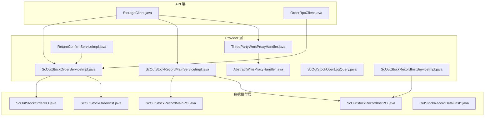
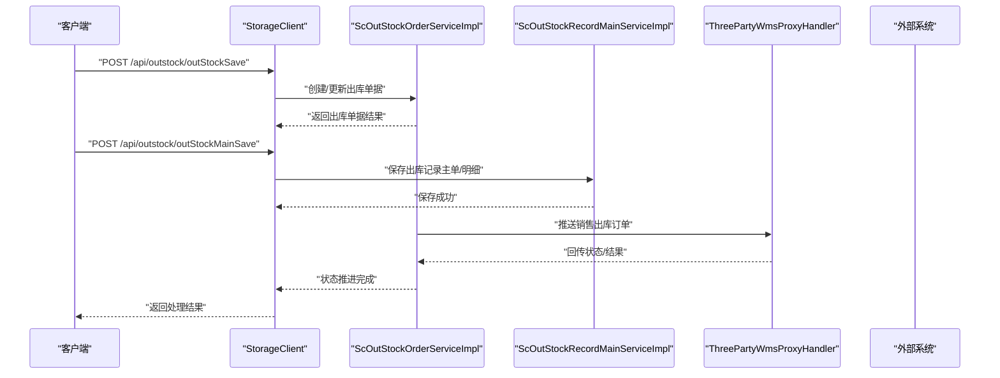
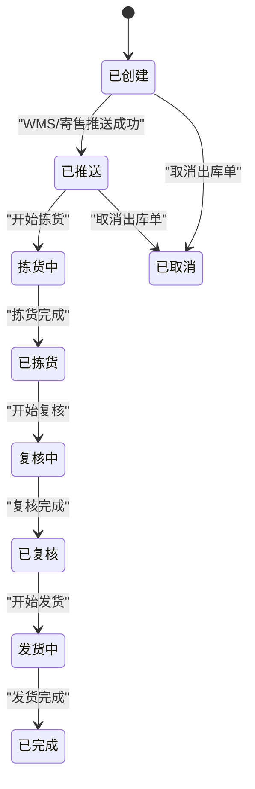
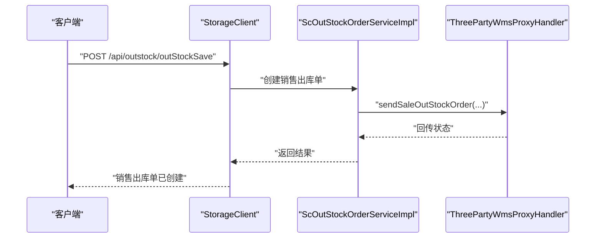
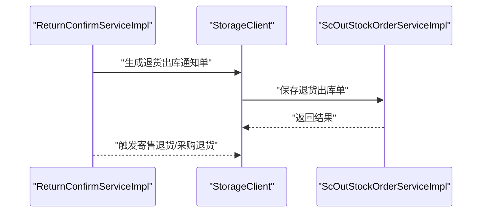
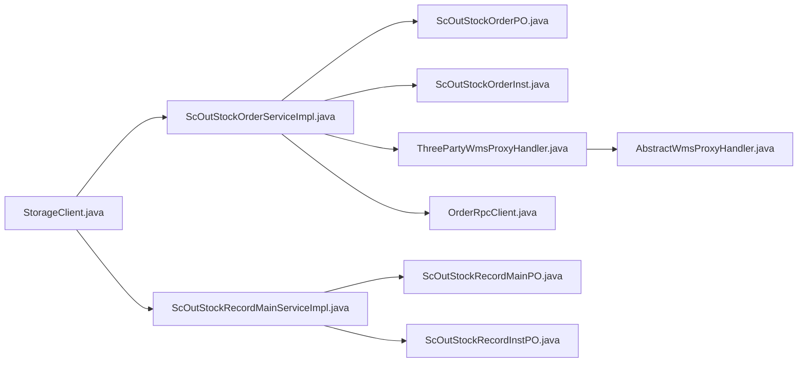

# 出库管理模块

<cite>
**本文引用的文件**
- [StorageClient.java](file://guoke-deepexi-storage-center-api/src/main/java/com/ deepexi/api/storage/StorageClient.java)
- [OrderRpcClient.java](file://guoke-deepexi-storage-center-api/src/main/java/com/ deepexi/api/storage/OrderRpcClient.java)
- [ScOutStockOrderServiceImpl.java](file://guoke-deepexi-storage-center-provider/src/main/java/com/ deepexi/storage/service/impl/ScOutStockOrderServiceImpl.java)
- [ScOutStockRecordMainServiceImpl.java](file://guoke-deepexi-storage-center-provider/src/main/java/com/ deepexi/storage/service/impl/ScOutStockRecordMainServiceImpl.java)
- [ThreePartyWmsProxyHandler.java](file://guoke-deepexi-storage-center-provider/src/main/java/com/ deepexi/storage/service/hanlder/ThreePartyWmsProxyHandler.java)
- [AbstractWmsProxyHandler.java](file://guoke-deepexi-storage-center-provider/src/main/java/com/ deepexi/storage/service/hanlder/AbstractWmsProxyHandler.java)
- [ReturnConfirmServiceImpl.java](file://guoke-deepexi-storage-center-provider/src/main/java/com/ deepexi/storage/service/impl/ReturnConfirmServiceImpl.java)
- [ScOutStockOperLogQuery.java](file://guoke-deepexi-storage-center-provider/src/main/java/com/ deepexi/storage/pojo/query/stockout/ScOutStockOperLogQuery.java)
- [ScOutStockRecordInstServiceImpl.java](file://guoke-deepexi-storage-center-provider/src/main/java/com/ deepexi/storage/service/impl/ScOutStockRecordInstServiceImpl.java)
- [ScOutStockOrderInstServiceImpl.java](file://guoke-deepexi-storage-center-provider/src/main/java/com/ deepexi/storage/service/impl/ScOutStockOrderInstServiceImpl.java)
- [ScOutStockOrderPO.java](file://guoke-deepexi-storage-center-provider/src/main/java/com/ deepexi/storage/model/ScOutStockOrderPO.java)
- [ScOutStockRecordMainPO.java](file://guoke-deepexi-storage-center-provider/src/main/java/com/ deepexi/storage/model/ScOutStockRecordMainPO.java)
- [ScOutStockRecordInstPO.java](file://guoke-deepexi-storage-center-provider/src/main/java/com/ deepexi/storage/model/ScOutStockRecordInstPO.java)
- [OutStockOrderRequest.java](file://guoke-deepexi-storage-center-api/src/main/java/com/ deepexi/api/storage/dto/out/OutStockOrderRequest.java)
- [OutStockOrderResponse.java](file://guoke-deepexi-storage-center-api/src/main/java/com/ deepexi/api/storage/dto/out/OutStockOrderResponse.java)
- [OutStockRecordMainBatchSaveRequest.java](file://guoke-deepexi-storage-center-api/src/main/java/com/ deepexi/api/storage/dto/out/OutStockRecordMainBatchSaveRequest.java)
- [OutStockRecordMainBatchSaveResponse.java](file/OutStockRecordMainBatchSaveResponse.java)
- [OutStockRecordLogisticsRequest.java](file://guoke-deepexi-storage-center-api/src/main/java/com/ deepexi/api/storage/dto/logistics/OutStockRecordLogisticsRequest.java)
- [OutStockRecordLogisticsResponse.java](file://guoke-deepexi-storage-center-api/src/main/java/com/ deepexi/api/storage/dto/logistics/OutStockRecordLogisticsResponse.java)
- [OutStockRecordLogisticsInfoRequest.java](file://guoke-deepexi-storage-center-api/src/main/java/com/ deepexi/api/storage/dto/logistics/OutStockRecordLogisticsInfoRequest.java)
- [OutStockRecordLogisticsInfoResponse.java](file://guoke-deepexi-storage-center-api/src/main/java/com/ deepexi/api/storage/dto/logistics/OutStockRecordLogisticsInfoResponse.java)
- [ScOutRecodeInstDTO.java](file://guoke-deepexi-storage-center-api/src/main/java/com/ deepexi/api/storage/pojo/dto/stockout/res/ScOutRecodeInstDTO.java)
- [ScOutStockRecordMainDTO.java](file://guoke-deepexi-storage-center-api/src/main/java/com/ deepexi/api/storage/dto/out/ScOutStockRecordMainDTO.java)
- [ScOutStockOrderInst.java](file://guoke-deepexi-storage-center-provider/src/main/java/com/ deepexi/storage/model/ScOutStockOrderInst.java)
- [ScOutStockRecordInst.java](file://guoke-deepexi-storage-center-provider/src/main/java/com/ deepexi/storage/model/ScOutStockRecordInst.java)
- [OutStockLogisticsVO.java](file://guoke-deepexi-storage-center-api/src/main/java/com/ deepexi/api/storage/pojo/dto/stock/logistics/OutStockLogisticsVO.java)
- [OutStockRequest.java](file://guoke-deepexi-storage-center-api/src/main/java/com/ deepexi/api/storage/pojo/dto/stockout/oneplustwo/OutStockRequest.java)
- [Oms2StockOut.java](file://guoke-deepexi-storage-center-api/src/main/java/com/ deepexi/api/storage/oms/Oms2StockOut.java)
- [ReturnConsignmentRequest.java](file://guoke-deepexi-storage-center-api/src/main/java/com/ deepexi/api/storage/dto/consignment/ReturnConsignmentRequest.java)
- [ReturnConsignmentItemRequest.java](file://guoke-deepexi-storage-center-api/src/main/java/com/ deepexi/api/storage/dto/consignment/ReturnConsignmentItemRequest.java)
- [ConsignmentLockRequest.java](file://guoke-deepexi-storage-center-api/src/main/java/com/ deepexi/api/storage/dto/lock/ConsignmentLockRequest.java)
- [ConsignmentStockRequest.java](file://guoke-deepexi-storage-center-api/src/main/java/com/ deepexi/api/storage/dto/consignment/ConsignmentStockRequest.java)
- [ConsignmentStockRespond.java](file://guoke-deepexi-storage-center-api/src/main/java/com/ deepexi/api/storage/dto/consignment/ConsignmentStockRespond.java)
- [ConsignmentLockRequest.java](file://guoke-deepexi-storage-center-api/src/main/java/com/ deepexi/api/storage/dto/lock/ConsignmentLockRequest.java)
- [ConsignmentLockInfoRequest.java](file://guoke-deepexi-storage-center-api/src/main/java/com/ deepexi/api/storage/dto/lock/ConsignmentLockInfoRequest.java)
- [ConsignmentLockInfoResponse.java](file://guoke-deepexi-storage-center-api/src/main/java/com/ deepexi/api/storage/dto/lock/ConsignmentLockInfoResponse.java)
- [QueryConsignmentLockInfoRequest.java](file://guoke-deepexi-storage-center-api/src/main/java/com/ deepexi/api/storage/dto/lock/QueryConsignmentLockInfoRequest.java)
- [QueryConsignmentLockInfoResponse.java](file://guoke-deepexi-storage-center-api/src/main/java/com/ deepexi/api/storage/dto/lock/QueryConsignmentLockInfoResponse.java)
- [QueryStockLockInfoRequest.java](file://guoke-deepexi-storage-center-api/src/main/java/com/ deepexi/api/storage/dto/lock/QueryStockLockInfoRequest.java)
- [QueryStockLockInfoResponse.java](file://guoke-deepexi-storage-center-api/src/main/java/com/ deepexi/api/storage/dto/lock/QueryStockLockInfoResponse.java)
- [StockLockLogDTO.java](file://guoke-deepexi-storage-center-api/src/main/java/com/ deepexi/api/storage/dto/stock/StockLockLogDTO.java)
- [StockLockLogItemDTO.java](file://guoke-deepexi-storage-center-api/src/main/java/com/ deepexi/api/storage/dto/stock/StockLockLogItemDTO.java)
- [StockWarningRequest.java](file://guoke-deepexi-storage-center-api/src/main/java/com/ deepexi/api/storage/dto/warning/StockWarningRequest.java)
- [StockWarningResponse.java](file://guoke-deepexi-storage-center-api/src/main/java/com/ deepexi/api/storage/dto/warning/StockWarningResponse.java)
- [TemperatureControlImportExcelRequest.java](file://guoke-deepexi-storage-center-api/src/main/java/com/ deepexi/api/storage/dto/temperature/TemperatureControlImportExcelRequest.java)
- [TemperatureInfoVO.java](file://guoke-deepexi-storage-center-api/src/main/java/com/ deepexi/api/storage/dto/temperature/TemperatureInfoVO.java)
- [TemperatureQuery.java](file://guoke-deepexi-storage-center-api/src/main/java/com/ deepexi/api/storage/dto/temperature/TemperatureQuery.java)
- [TemperatureVO.java](file://guoke-deepexi-storage-center-api/src/main/java/com/ deepexi/api/storage/dto/temperature/TemperatureVO.java)
- [QueryOutStockProductRequest.java](file://guoke-deepexi-storage-center-api/src/main/java/com/ deepexi/api/storage/dto/product/QueryOutStockProductRequest.java)
- [QueryOutStockProductResponse.java](file://guoke-deepexi-storage-center-api/src/main/java/com/ deepexi/api/storage/dto/product/QueryOutStockProductResponse.java)
- [QueryOutStockRecordResponse.java](file://guoke-deepexi-storage-center-api/src/main/java/com/ deepexi/api/storage/dto/out/QueryOutStockRecordResponse.java)
- [OutStockRecordVo.java](file://guoke-deepexi-storage-center-api/src/main/java/com/ deepexi/api/storage/dto/out/OutStockRecordVo.java)
- [OutStockRecordDetailVo.java](file://guoke-deepexi-storage-center-api/src/main/java/com/ deepexi/api/storage/dto/out/OutStockRecordDetailVo.java)
- [OutStockRecordDetailInfoVO.java](file://guoke-deepexi-storage-center-api/src/main/java/com/ deepexi/api/storage/dto/out/OutStockRecordDetailInfoVO.java)
- [OutStockRecordDetailInstPartVO.java](file://guoke-deepexi-storage-center-api/src/main/java/com/ deepexi/api/storage/dto/out/OutStockRecordDetailInstPartVO.java)
- [OutStockRecordDetailInstVO.java](file://guoke-deepexi-storage-center-api/src/main/java/com/ deepexi/api/storage/dto/out/OutStockRecordDetailInstVO.java)
- [OutStockRecordDetailInstPart.java](file://guoke-deepexi-storage-center-provider/src/main/java/com/ deepexi/storage/model/OutStockRecordDetailInstPart.java)
- [OutStockRecordDetailInst.java](file://guoke-deepexi-storage-center-provider/src/main/java/com/ deepexi/storage/model/OutStockRecordDetailInst.java)
- [OutStockRecordDetailInfo.java](file://guoke-deepexi-storage-center-provider/src/main/java/com/ deepexi/storage/model/OutStockRecordDetailInfo.java)
- [OutStockRecordDetailInstPartPO.java](file://guoke-deepexi-storage-center-provider/src/main/java/com/ deepexi/storage/model/OutStockRecordDetailInstPartPO.java)
- [OutStockRecordDetailInstPO.java](file://guoke-deepexi-storage-center-provider/src/main/java/com/ deepexi/storage/model/OutStockRecordDetailInstPO.java)
- [OutStockRecordDetailInfoPO.java](file://guoke-deepexi-storage-center-provider/src/main/java/com/ deepexi/storage/model/OutStockRecordDetailInfoPO.java)
- [OutStockRecordDetailInstPart.java](file://guoke-deepexi-storage-center-provider/src/main/java/com/ deepexi/storage/model/OutStockRecordDetailInstPart.java)
- [OutStockRecordDetailInst.java](file://guoke-deepexi-storage-center-provider/src/main/java/com/ deepexi/storage/model/OutStockRecordDetailInst.java)
- [OutStockRecordDetailInfo.java](file://guoke-deepexi-storage-center-provider/src/main/java/com/ deepexi/storage/model/OutStockRecordDetailInfo.java)
- [OutStockRecordDetailInstPartPO.java](file://guoke-deepexi-storage-center-provider/src/main/java/com/ deepexi/storage/model/OutStockRecordDetailInstPartPO.java)
- [OutStockRecordDetailInstPO.java](file://guoke-deepexi-storage-center-provider/src/main/java/com/ deepexi/storage/model/OutStockRecordDetailInstPO.java)
- [OutStockRecordDetailInfoPO.java](file://guoke-deepexi-storage-center-provider/src/main/java/com/ deepexi/storage/model/OutStockRecordDetailInfoPO.java)
</cite>

## 目录
1. [简介](#简介)
2. [项目结构](#项目结构)
3. [核心组件](#核心组件)
4. [架构总览](#架构总览)
5. [详细组件分析](#详细组件分析)
6. [依赖关系分析](#依赖关系分析)
7. [性能与扩展性](#性能与扩展性)
8. [故障排查指南](#故障排查指南)
9. [结论](#结论)
10. [附录：API 接口规范](#附录api-接口规范)

## 简介
本文件面向国科恒泰仓储管理系统“出库管理模块”，系统化梳理销售出库、退货出库、调拨出库、其他出库等业务类型在系统内的实现路径与数据流转；深入解析出库单据从创建到拣货、复核、发货、完成的全链路；阐述商品拣选算法与库存分配策略、批次出库规则及温度控制要求；给出关键 API 的参数说明与使用示例；解释数据校验、库存扣减与状态变更机制；并提供异常处理、缺货处理与库存预警的解决方案与配置建议。

## 项目结构
出库管理涉及三层：
- API 层：对外暴露 HTTP/RPC 接口，定义请求/响应 DTO 与 RPC 客户端
- Provider 层：业务服务实现、领域模型、持久化映射、作业与代理处理器
- 数据模型层：出库订单、明细、记录、日志、温度与预警等实体

图表来源
- [StorageClient.java](file://guoke-deepexi-storage-center-api/src/main/java/com/ deepexi/api/storage/StorageClient.java)
- [OrderRpcClient.java](file://guoke-deepexi-storage-center-api/src/main/java/com/ deepexi/api/storage/OrderRpcClient.java)
- [ScOutStockOrderServiceImpl.java](file://guoke-deepexi-storage-center-provider/src/main/java/com/ deepexi/storage/service/impl/ScOutStockOrderServiceImpl.java)
- [ScOutStockRecordMainServiceImpl.java](file://guoke-deepexi-storage-center-provider/src/main/java/com/ deepexi/storage/service/impl/ScOutStockRecordMainServiceImpl.java)
- [ThreePartyWmsProxyHandler.java](file://guoke-deepexi-storage-center-provider/src/main/java/com/ deepexi/storage/service/hanlder/ThreePartyWmsProxyHandler.java)
- [AbstractWmsProxyHandler.java](file://guoke-deepexi-storage-center-provider/src/main/java/com/ deepexi/storage/service/hanlder/AbstractWmsProxyHandler.java)
- [ReturnConfirmServiceImpl.java](file://guoke-deepexi-storage-center-provider/src/main/java/com/ deepexi/storage/service/impl/ReturnConfirmServiceImpl.java)
- [ScOutStockOperLogQuery.java](file://guoke-deepexi-storage-center-provider/src/main/java/com/ deepexi/storage/pojo/query/stockout/ScOutStockOperLogQuery.java)
- [ScOutStockRecordInstServiceImpl.java](file://guoke-deepexi-storage-center-provider/src/main/java/com/ deepexi/storage/service/impl/ScOutStockRecordInstServiceImpl.java)
- [ScOutStockOrderPO.java](file://guoke-deepexi-storage-center-provider/src/main/java/com/ deepexi/storage/model/ScOutStockOrderPO.java)
- [ScOutStockRecordMainPO.java](file://guoke-deepexi-storage-center-provider/src/main/java/com/ deepexi/storage/model/ScOutStockRecordMainPO.java)
- [ScOutStockRecordInstPO.java](file://guoke-deepexi-storage-center-provider/src/main/java/com/ deepexi/storage/model/ScOutStockRecordInstPO.java)
- [ScOutStockOrderInst.java](file://guoke-deepexi-storage-center-provider/src/main/java/com/ deepexi/storage/model/ScOutStockOrderInst.java)
- [OutStockRecordDetailInst*.java](file://guoke-deepexi-storage-center-provider/src/main/java/com/ deepexi/storage/model/OutStockRecordDetailInst*.java)

章节来源
- [StorageClient.java](file://guoke-deepexi-storage-center-api/src/main/java/com/ deepexi/api/storage/StorageClient.java)
- [ScOutStockOrderServiceImpl.java](file://guoke-deepexi-storage-center-provider/src/main/java/com/ deepexi/storage/service/impl/ScOutStockOrderServiceImpl.java)

## 核心组件
- 出库单据服务：负责销售出库、退货出库、调拨出库、其他出库的创建、状态推进与 WMS 推送
- 出库记录服务：负责出库主单与明细的批量保存、物流信息登记与状态联动
- 温度控制与库存锁定：提供温度规则查询与导入、库存锁定与解锁、库存预警
- 操作日志与查询：提供出库操作日志查询与过滤
- RPC 客户端：对接 OMS/寄售/三方 WMS 等外部系统

章节来源
- [ScOutStockOrderServiceImpl.java](file://guoke-deepexi-storage-center-provider/src/main/java/com/ deepexi/storage/service/impl/ScOutStockOrderServiceImpl.java)
- [ScOutStockRecordMainServiceImpl.java](file://guoke-deepexi-storage-center-provider/src/main/java/com/ deepexi/storage/service/impl/ScOutStockRecordMainServiceImpl.java)
- [StorageClient.java](file://guoke-deepexi-storage-center-api/src/main/java/com/ deepexi/api/storage/StorageClient.java)
- [OrderRpcClient.java](file://guoke-deepexi-storage-center-api/src/main/java/com/ deepexi/api/storage/OrderRpcClient.java)

## 架构总览
出库管理采用“API 控制器 + 业务服务 + 领域模型 + 外部系统对接”的分层架构。API 层统一入口，Provider 层承载业务编排与规则，模型层承载数据结构，外部系统通过 RPC 或 WMS 代理进行集成。

图表来源
- [StorageClient.java](file://guoke-deepexi-storage-center-api/src/main/java/com/ deepexi/api/storage/StorageClient.java)
- [ScOutStockOrderServiceImpl.java](file://guoke-deepexi-storage-center-provider/src/main/java/com/ deepexi/storage/service/impl/ScOutStockOrderServiceImpl.java)
- [ScOutStockRecordMainServiceImpl.java](file://guoke-deepexi-storage-center-provider/src/main/java/com/ deepexi/storage/service/impl/ScOutStockRecordMainServiceImpl.java)
- [ThreePartyWmsProxyHandler.java](file://guoke-deepexi-storage-center-provider/src/main/java/com/ deepexi/storage/service/hanlder/ThreePartyWmsProxyHandler.java)

## 详细组件分析

### 1) 出库单据生命周期与状态机
- 创建：接收 API 请求，组装单据头与明细，写入订单主表与明细表
- 推送：根据业务类型（销售/退货/调拨/其他）向 WMS 或寄售系统推送
- 状态推进：记录操作日志，推进至拣货、复核、发货、完成等阶段
- 回滚与取消：支持按单号取消出库单，或按记录回滚库存

图表来源
- [ScOutStockOrderServiceImpl.java](file://guoke-deepexi-storage-center-provider/src/main/java/com/ deepexi/storage/service/impl/ScOutStockOrderServiceImpl.java)
- [ScOutStockRecordMainServiceImpl.java](file://guoke-deepexi-storage-center-provider/src/main/java/com/ deepexi/storage/service/impl/ScOutStockRecordMainServiceImpl.java)
- [ScOutStockOperLogQuery.java](file://guoke-deepexi-storage-center-provider/src/main/java/com/ deepexi/storage/pojo/query/stockout/ScOutStockOperLogQuery.java)

章节来源
- [ScOutStockOrderServiceImpl.java](file://guoke-deepexi-storage-center-provider/src/main/java/com/ deepexi/storage/service/impl/ScOutStockOrderServiceImpl.java)
- [ScOutStockOperLogQuery.java](file://guoke-deepexi-storage-center-provider/src/main/java/com/ deepexi/storage/pojo/query/stockout/ScOutStockOperLogQuery.java)

### 2) 销售出库
- 单据创建：接收销售出库请求，填充委托方、受托方、客户、仓库等信息
- 明细拆分：按商品、规格、批次、效期等维度拆分出库明细
- WMS 推送：组装销售出库订单，推送到外部系统
- 状态推进：完成拣货、复核、发货后推进至完成

图表来源
- [StorageClient.java](file://guoke-deepexi-storage-center-api/src/main/java/com/ deepexi/api/storage/StorageClient.java)
- [ScOutStockOrderServiceImpl.java](file://guoke-deepexi-storage-center-provider/src/main/java/com/ deepexi/storage/service/impl/ScOutStockOrderServiceImpl.java)
- [ThreePartyWmsProxyHandler.java](file://guoke-deepexi-storage-center-provider/src/main/java/com/ deepexi/storage/service/hanlder/ThreePartyWmsProxyHandler.java)
- [AbstractWmsProxyHandler.java](file://guoke-deepexi-storage-center-provider/src/main/java/com/ deepexi/storage/service/hanlder/AbstractWmsProxyHandler.java)

章节来源
- [ScOutStockOrderServiceImpl.java](file://guoke-deepexi-storage-center-provider/src/main/java/com/ deepexi/storage/service/impl/ScOutStockOrderServiceImpl.java)
- [ThreePartyWmsProxyHandler.java](file://guoke-deepexi-storage-center-provider/src/main/java/com/ deepexi/storage/service/hanlder/ThreePartyWmsProxyHandler.java)
- [AbstractWmsProxyHandler.java](file://guoke-deepexi-storage-center-provider/src/main/java/com/ deepexi/storage/service/hanlder/AbstractWmsProxyHandler.java)

### 3) 退货出库
- 来源：来自退货确认流程，生成退货出库通知单
- 流程：与销售出库类似，但业务方向相反，WMS 推送时标识退货类型
- 关联：与寄售退货、采购退货等场景联动

图表来源
- [ReturnConfirmServiceImpl.java](file://guoke-deepexi-storage-center-provider/src/main/java/com/ deepexi/storage/service/impl/ReturnConfirmServiceImpl.java)
- [StorageClient.java](file://guoke-deepexi-storage-center-api/src/main/java/com/ deepexi/api/storage/StorageClient.java)
- [ScOutStockOrderServiceImpl.java](file://guoke-deepexi-storage-center-provider/src/main/java/com/ deepexi/storage/service/impl/ScOutStockOrderServiceImpl.java)

章节来源
- [ReturnConfirmServiceImpl.java](file://guoke-deepexi-storage-center-provider/src/main/java/com/ deepexi/storage/service/impl/ReturnConfirmServiceImpl.java)

### 4) 调拨出库
- 场景：同一公司内跨仓调拨
- 实现：通过“其他出库”类型扩展，设置来源仓库与目标仓库，推进状态并登记物流

章节来源
- [StorageClient.java](file://guoke-deepexi-storage-center-api/src/main/java/com/ deepexi/api/storage/StorageClient.java)

### 5) 其他出库
- 场景：盘亏、报损、领用等非销售类出库
- 实现：通过“其他出库”接口提交，支持分页查询与详情查看

章节来源
- [StorageClient.java](file://guoke-deepexi-storage-center-api/src/main/java/com/ deepexi/api/storage/StorageClient.java)

### 6) 商品拣选算法与库存分配策略
- 拣选策略：优先满足订单需求，按批次/效期先进先出（FIFO），结合温度控制要求
- 库存分配：锁定可用库存，避免超分配；支持多仓协同与跨区调拨
- 批次出库：按产品批号、效期、UDI 等维度出库，确保可追溯
- 温度控制：依据温度规则对特定产品实施温控存储与出库限制

章节来源
- [ScOutStockRecordMainServiceImpl.java](file://guoke-deepexi-storage-center-provider/src/main/java/com/ deepexi/storage/service/impl/ScOutStockRecordMainServiceImpl.java)
- [TemperatureControlImportExcelRequest.java](file://guoke-deepexi-storage-center-api/src/main/java/com/ deepexi/api/storage/dto/temperature/TemperatureControlImportExcelRequest.java)
- [TemperatureInfoVO.java](file://guoke-deepexi-storage-center-api/src/main/java/com/ deepexi/api/storage/dto/temperature/TemperatureInfoVO.java)
- [TemperatureQuery.java](file://guoke-deepexi-storage-center-api/src/main/java/com/ deepexi/api/storage/dto/temperature/TemperatureQuery.java)
- [TemperatureVO.java](file://guoke-deepexi-storage-center-api/src/main/java/com/ deepexi/api/storage/dto/temperature/TemperatureVO.java)

### 7) 数据校验、库存扣减与状态变更
- 数据校验：校验订单主体、商品、数量、批次、效期、温度等字段
- 库存扣减：在拣货完成或复核完成时进行实时扣减，支持回滚
- 状态变更：每一步操作均写入操作日志并推进状态机

章节来源
- [ScOutStockRecordMainServiceImpl.java](file://guoke-deepexi-storage-center-provider/src/main/java/com/ deepexi/storage/service/impl/ScOutStockRecordMainServiceImpl.java)
- [ScOutStockOperLogQuery.java](file://guoke-deepexi-storage-center-provider/src/main/java/com/ deepexi/storage/pojo/query/stockout/ScOutStockOperLogQuery.java)

### 8) 异常处理、缺货处理与库存预警
- 缺货处理：当某商品库存不足时，标记缺货并提示可替代方案或自动转待配
- 异常处理：捕获 WMS 推送失败、库存锁定失败、批次不匹配等异常，记录日志并回滚
- 库存预警：基于阈值与安全库存触发预警，支持导出与配置

章节来源
- [StockWarningRequest.java](file://guoke-deepexi-storage-center-api/src/main/java/com/ deepexi/api/storage/dto/warning/StockWarningRequest.java)
- [StockWarningResponse.java](file://guoke-deepexi-storage-center-api/src/main/java/com/ deepexi/api/storage/dto/warning/StockWarningResponse.java)

## 依赖关系分析
- API 层依赖 Provider 层的服务接口
- Provider 层依赖模型层的 PO/DTO 与 Mapper
- 外部系统通过 RPC 或 WMS 代理进行集成
- 温度控制与库存锁定作为横切能力被各业务场景复用

图表来源
- [StorageClient.java](file://guoke-deepexi-storage-center-api/src/main/java/com/ deepexi/api/storage/StorageClient.java)
- [ScOutStockOrderServiceImpl.java](file://guoke-deepexi-storage-center-provider/src/main/java/com/ deepexi/storage/service/impl/ScOutStockOrderServiceImpl.java)
- [ScOutStockRecordMainServiceImpl.java](file://guoke-deepexi-storage-center-provider/src/main/java/com/ deepexi/storage/service/impl/ScOutStockRecordMainServiceImpl.java)
- [ThreePartyWmsProxyHandler.java](file://guoke-deepexi-storage-center-provider/src/main/java/com/ deepexi/storage/service/hanlder/ThreePartyWmsProxyHandler.java)
- [AbstractWmsProxyHandler.java](file://guoke-deepexi-storage-center-provider/src/main/java/com/ deepexi/storage/service/hanlder/AbstractWmsProxyHandler.java)
- [OrderRpcClient.java](file://guoke-deepexi-storage-center-api/src/main/java/com/ deepexi/api/storage/OrderRpcClient.java)
- [ScOutStockOrderPO.java](file://guoke-deepexi-storage-center-provider/src/main/java/com/ deepexi/storage/model/ScOutStockOrderPO.java)
- [ScOutStockOrderInst.java](file://guoke-deepexi-storage-center-provider/src/main/java/com/ deepexi/storage/model/ScOutStockOrderInst.java)
- [ScOutStockRecordMainPO.java](file://guoke-deepexi-storage-center-provider/src/main/java/com/ deepexi/storage/model/ScOutStockRecordMainPO.java)
- [ScOutStockRecordInstPO.java](file://guoke-deepexi-storage-center-provider/src/main/java/com/ deepexi/storage/model/ScOutStockRecordInstPO.java)

## 性能与扩展性
- 批量保存：提供批量保存出库记录的接口，减少网络往返
- 并发控制：库存锁定与扣减需保证幂等与一致性
- 温度控制：对高价值/温控产品单独校验与隔离存储
- 可扩展性：通过抽象 WMS 处理器与 RPC 客户端扩展新对接

## 故障排查指南
- 出库单创建失败：检查请求参数、商品可用性与权限
- WMS 推送失败：查看回传状态与错误日志，重试或人工干预
- 拣货/复核异常：核对批次、效期与温度规则，必要时调整策略
- 库存不一致：比对锁定日志与实际库存，执行差异处理
- 退货出库异常：核对退货确认单与寄售/采购退货流程

章节来源
- [ScOutStockOperLogQuery.java](file://guoke-deepexi-storage-center-provider/src/main/java/com/ deepexi/storage/pojo/query/stockout/ScOutStockOperLogQuery.java)

## 结论
本模块以清晰的职责划分与可扩展的架构支撑多种出库业务场景，通过严格的批次/效期/FIFO 与温度控制规则保障合规与质量，配合完善的日志与预警体系提升运营可靠性。建议在生产环境中结合业务量与硬件资源评估并发与缓存策略，并持续完善异常处理与自动化运维。

## 附录：API 接口规范

### 1) 出库单据相关
- 创建出库单
  - 方法与路径：POST /api/outstock/outStockSave
  - 请求体：OutStockOrderRequest
  - 返回体：BaseResponseDto<OutStockOrderResponse>
  - 用途：创建销售/退货/调拨/其他出库单
  - 参考路径：[StorageClient.java](file://guoke-deepexi-storage-center-api/src/main/java/com/ deepexi/api/storage/StorageClient.java)

- 保存出库记录主单/明细
  - 方法与路径：POST /api/outstock/outStockMainSave
  - 请求体：ScOutStockRecordMainDTO
  - 返回体：BaseResponseDto<Boolean>
  - 用途：批量保存出库记录主单与明细
  - 参考路径：[StorageClient.java](file://guoke-deepexi-storage-center-api/src/main/java/com/ deepexi/api/storage/StorageClient.java)

- 批量保存出库记录
  - 方法与路径：POST /api/outstock/batchSaveOutStockMain
  - 请求体：OutStockRecordMainBatchSaveRequest
  - 返回体：BaseResponseDto<Boolean>
  - 用途：批量保存出库记录主单与明细
  - 参考路径：[StorageClient.java](file://guoke-deepexi-storage-center-api/src/main/java/com/ deepexi/api/storage/StorageClient.java)

- 取消出库单
  - 方法与路径：GET /api/outstock/cancelOutStockOrderByOrderCode/{orderCode}
  - 返回体：BaseResponseDto<Boolean>
  - 用途：按单号取消出库单
  - 参考路径：[StorageClient.java](file://guoke-deepexi-storage-center-api/src/main/java/com/ deepexi/api/storage/StorageClient.java)

- OMS 出库对接
  - 方法与路径：POST /api/outstock/omsOutStock
  - 请求体：Oms2StockOut
  - 返回体：BaseResponseDto<Boolean>
  - 用途：接收 OMS 出库指令并落库
  - 参考路径：[StorageClient.java](file://guoke-deepexi-storage-center-api/src/main/java/com/ deepexi/api/storage/StorageClient.java)

### 2) 出库查询相关
- 查询出库单列表
  - 方法与路径：GET /api/outstock/getOutStockOrderListByOrderCode
  - 参数：orderCode、orderId
  - 返回体：BaseResponseDto<List<OutStockOrderDetailVo>>
  - 用途：按单号/ID 查询出库单详情
  - 参考路径：[StorageClient.java](file://guoke-deepexi-storage-center-api/src/main/java/com/ deepexi/api/storage/StorageClient.java)

- 查询出库记录
  - 方法与路径：GET /api/outstock/getOutStockRecordByOrderCode
  - 参数：orderCode、orderId
  - 返回体：BaseResponseDto<List<QueryOutStockRecordResponse>>
  - 用途：按单号/ID 查询出库记录
  - 参考路径：[StorageClient.java](file://guoke-deepexi-storage-center-api/src/main/java/com/ deepexi/api/storage/StorageClient.java)

- 查询出库记录（按公司）
  - 方法与路径：GET /api/outstock/getOutStockRecordsByCodeAndCompanyId
  - 参数：orderCode、companyId
  - 返回体：BaseResponseDto<List<OutStockRecordVo>>
  - 用途：按单号与公司查询出库记录
  - 参考路径：[StorageClient.java](file://guoke-deepexi-storage-center-api/src/main/java/com/ deepexi/api/storage/StorageClient.java)

- 查询商品可出库列表
  - 方法与路径：GET /api/product/outStock
  - 参数：QueryOutStockProductRequest
  - 返回体：BaseResponseDto<PageBean<QueryOutStockProductResponse>>
  - 用途：查询商品可出库数量与批次
  - 参考路径：[StorageClient.java](file://guoke-deepexi-storage-center-api/src/main/java/com/ deepexi/api/storage/StorageClient.java)

### 3) 物流与轨迹相关
- 登记出库物流信息
  - 方法与路径：POST /api/outstock/logistics/save
  - 请求体：OutStockRecordLogisticsRequest
  - 返回体：BaseResponseDto<Boolean>
  - 用途：登记出库物流信息
  - 参考路径：[StorageClient.java](file://guoke-deepexi-storage-center-api/src/main/java/com/ deepexi/api/storage/StorageClient.java)

- 查询物流信息
  - 方法与路径：POST /api/outstock/logistics/query
  - 请求体：OutStockRecordLogisticsInfoRequest
  - 返回体：BaseResponseDto<List<OutStockRecordLogisticsInfoResponse>>
  - 用途：查询物流信息
  - 参考路径：[StorageClient.java](file://guoke-deepexi-storage-center-api/src/main/java/com/ deepexi/api/storage/StorageClient.java)

- 查询物流轨迹
  - 方法与路径：POST /api/outstock/logistics/track
  - 请求体：BaseRequestDto<String>
  - 返回体：BaseResponseDto<List<OutStockLogisticsVO>>
  - 用途：查询物流轨迹
  - 参考路径：[StorageClient.java](file://guoke-deepexi-storage-center-api/src/main/java/com/ deepexi/api/storage/StorageClient.java)

### 4) 寄售与锁定相关
- 寄售出库锁定
  - 方法与路径：POST /api/consignment/lock
  - 请求体：ConsignmentLockRequest
  - 返回体：BaseResponseDto<Boolean>
  - 用途：锁定寄售出库库存
  - 参考路径：[StorageClient.java](file://guoke-deepexi-storage-center-api/src/main/java/com/ deepexi/api/storage/StorageClient.java)

- 查询寄售锁定信息
  - 方法与路径：GET /api/consignment/lock/query
  - 请求体：QueryConsignmentLockInfoRequest
  - 返回体：BaseResponseDto<QueryConsignmentLockInfoResponse>
  - 用途：查询寄售锁定信息
  - 参考路径：[StorageClient.java](file://guoke-deepexi-storage-center-api/src/main/java/com/ deepexi/api/storage/StorageClient.java)

- 查询库存锁定信息
  - 方法与路径：GET /api/stock/lock/query
  - 请求体：QueryStockLockInfoRequest
  - 返回体：BaseResponseDto<QueryStockLockInfoResponse>
  - 用途：查询库存锁定信息
  - 参考路径：[StorageClient.java](file://guoke-deepexi-storage-center-api/src/main/java/com/ deepexi/api/storage/StorageClient.java)

- 库存锁定日志
  - 请求体：StockLockLogDTO
  - 返回体：BaseResponseDto<List<StockLockLogItemDTO>>
  - 用途：查询库存锁定日志
  - 参考路径：[StorageClient.java](file://guoke-deepexi-storage-center-api/src/main/java/com/ deepexi/api/storage/StorageClient.java)

### 5) 温度控制相关
- 导入温度控制规则
  - 方法与路径：POST /api/temperature/import
  - 请求体：TemperatureControlImportExcelRequest
  - 返回体：BaseResponseDto<Boolean>
  - 用途：导入温度控制规则
  - 参考路径：[StorageClient.java](file://guoke-deepexi-storage-center-api/src/main/java/com/ deepexi/api/storage/StorageClient.java)

- 查询温度控制信息
  - 方法与路径：GET /api/temperature/query
  - 请求体：TemperatureQuery
  - 返回体：BaseResponseDto<List<TemperatureInfoVO>>
  - 用途：查询温度控制信息
  - 参考路径：[StorageClient.java](file://guoke-deepexi-storage-center-api/src/main/java/com/ deepexi/api/storage/StorageClient.java)

### 6) 其他出库相关
- 新增其他出库单
  - 方法与路径：POST /api/otheroutstock/save
  - 请求体：ScOtherTypeOutStockOrderAddForm
  - 返回体：BaseResponseDto<OtherOutStockOrderDetailResponse>
  - 用途：新增其他类型出库单
  - 参考路径：[StorageClient.java](file://guoke-deepexi-storage-center-api/src/main/java/com/ deepexi/api/storage/StorageClient.java)

- 分页查询其他出库单
  - 方法与路径：POST /api/otheroutstock/page
  - 请求体：OtherOutStockOrderPageRequest
  - 返回体：BaseResponseDto<OtherOutStockOrderPageResponse>
  - 用途：分页查询其他出库单
  - 参考路径：[StorageClient.java](file://guoke-deepexi-storage-center-api/src/main/java/com/ deepexi/api/storage/StorageClient.java)

- 完成状态推进
  - 方法与路径：GET /api/outstock/changeToAccomplishStatus
  - 参数：outStockOrderId
  - 返回体：BaseResponseDto<Boolean>
  - 用途：将出库单推进到完成状态
  - 参考路径：[StorageClient.java](file://guoke-deepexi-storage-center-api/src/main/java/com/ deepexi/api/storage/StorageClient.java)

### 7) RPC 接口
- 一加二出库接口
  - 请求体：OutStockRequest
  - 返回体：BaseResponseDto<Boolean>
  - 用途：对接第三方系统的出库请求
  - 参考路径：[OrderRpcClient.java](file://guoke-deepexi-storage-center-api/src/main/java/com/ deepexi/api/storage/OrderRpcClient.java)