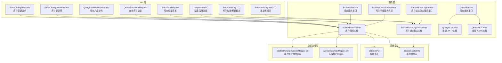
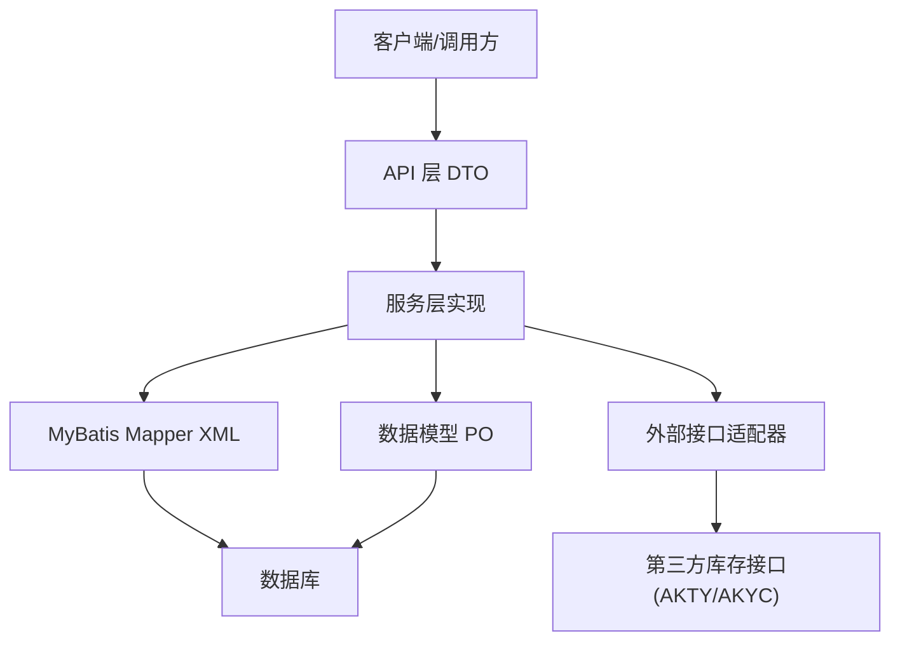
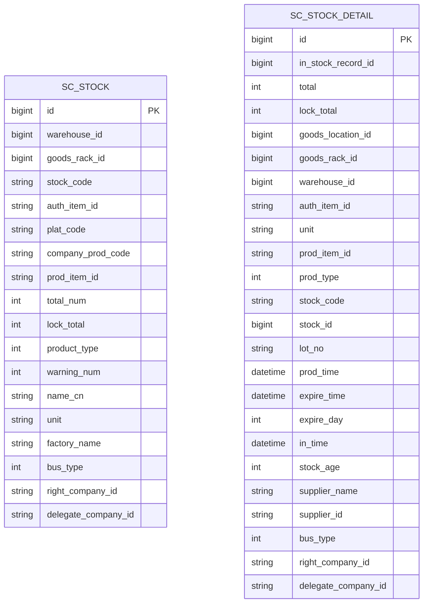
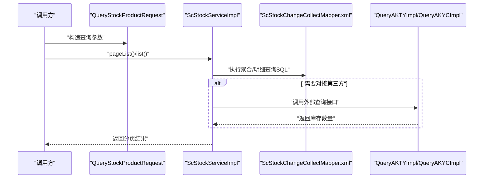
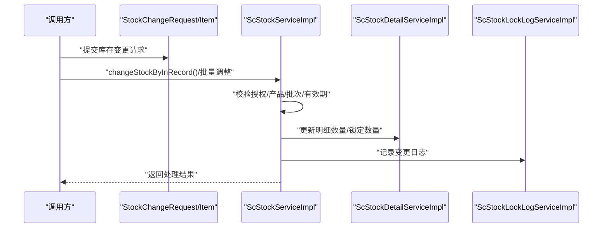
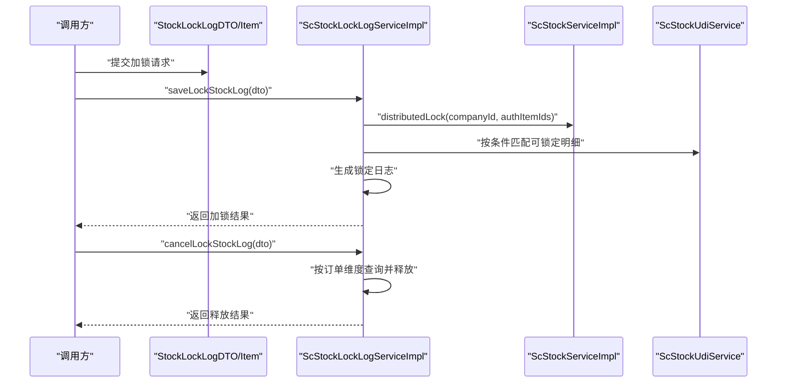
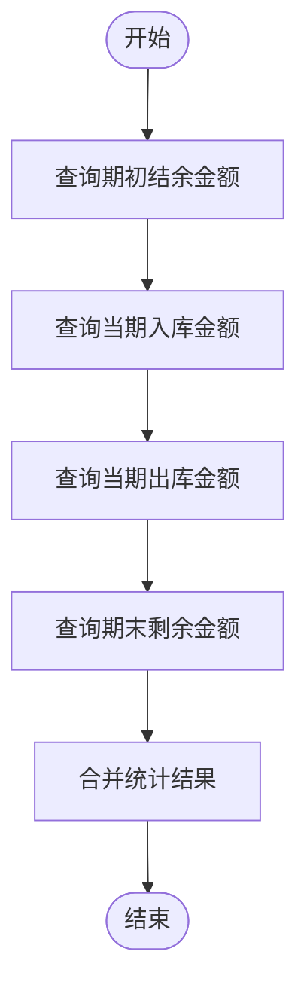
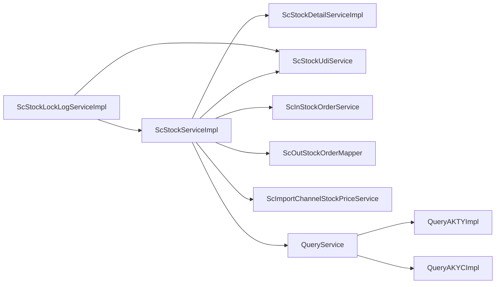

# 库存管理模块

<cite>
**本文引用的文件**
- [ScStockService.java](file://guoke-deepexi-storage-center-provider/src/main/java/com/deepexi/storage/service/ScStockService.java)
- [ScStockServiceImpl.java](file://guoke-deepexi-storage-center-provider/src/main/java/com/deepexi/storage/service/impl/ScStockServiceImpl.java)
- [ScStockLockLogService.java](file://guoke-deepexi-storage-center-provider/src/main/java/com/deepexi/storage/service/ScStockLockLogService.java)
- [ScStockLockLogServiceImpl.java](file://guoke-deepexi-storage-center-provider/src/main/java/com/deepexi/storage/service/impl/ScStockLockLogServiceImpl.java)
- [ScStockPO.java](file://guoke-deepexi-storage-center-provider/src/main/java/com/deepexi/storage/model/ScStockPO.java)
- [ScStockDetailPO.java](file://guoke-deepexi-storage-center-provider/src/main/java/com/deepexi/storage/model/ScStockDetailPO.java)
- [StockChangeRequest.java](file://guoke-deepexi-storage-center-api/src/main/java/com/deepexi/api/storage/dto/stock/StockChangeRequest.java)
- [StockChangeItemRequest.java](file://guoke-deepexi-storage-center-api/src/main/java/com/deepexi/api/storage/dto/stock/StockChangeItemRequest.java)
- [QueryStockProductRequest.java](file://guoke-deepexi-storage-center-api/src/main/java/com/deepexi/api/storage/dto/stock/QueryStockProductRequest.java)
- [QueryStockNumRequest.java](file://guoke-deepexi-storage-center-api/src/main/java/com/deepexi/api/storage/dto/stock/QueryStockNumRequest.java)
- [StockTotalRequest.java](file://guoke-deepexi-storage-center-api/src/main/java/com/deepexi/api/storage/dto/stock/StockTotalRequest.java)
- [StockLockLogDTO.java](file://guoke-deepexi-storage-center-api/src/main/java/com/deepexi/api/storage/dto/stock/StockLockLogDTO.java)
- [StockLockLogItemDTO.java](file://guoke-deepexi-storage-center-api/src/main/java/com/deepexi/api/storage/dto/stock/StockLockLogItemDTO.java)
- [TemperatureVO.java](file://guoke-deepexi-storage-center-api/src/main/java/com/deepexi/api/storage/dto/temperature/TemperatureVO.java)
- [ScStockDetailServiceImpl.java](file://guoke-deepexi-storage-center-provider/src/main/java/com/deepexi/storage/service/impl/ScStockDetailServiceImpl.java)
- [ScStockChangeCollectMapper.xml](file://guoke-deepexi-storage-center-provider/src/main/resources/mapper/stock/ScStockChangeCollectMapper.xml)
- [ScInStockOrderMapper.xml](file://guoke-deepexi-storage-center-provider/src/main/resources/mapper/stockin/ScInStockOrderMapper.xml)
- [QueryService.java](file://guoke-deepexi-storage-center-provider/src/main/java/com/deepexi/storage/service/query/QueryService.java)
- [QueryAKTYImpl.java](file://guoke-deepexi-storage-center-provider/src/main/java/com/deepexi/storage/service/query/QueryAKTYImpl.java)
- [QueryAKYCImpl.java](file://guoke-deepexi-storage-center-provider/src/main/java/com/deepexi/storage/service/query/QueryAKYCImpl.java)
</cite>

## 目录
1. [简介](#简介)
2. [项目结构](#项目结构)
3. [核心组件](#核心组件)
4. [架构总览](#架构总览)
5. [详细组件分析](#详细组件分析)
6. [依赖分析](#依赖分析)
7. [性能考虑](#性能考虑)
8. [故障排查指南](#故障排查指南)
9. [结论](#结论)
10. [附录](#附录)

## 简介
本文件面向国科恒泰仓储管理系统中的库存管理模块，系统性阐述库存查询、库存调整、库存锁定与解锁、库存统计等核心能力的实现原理、数据模型、业务规则与接口设计，并给出与入库、出库、盘点等模块的协同机制。文档同时覆盖批次管理、温度控制等高级特性，提供API调用示例路径、参数说明、响应格式指引，以及最佳实践与性能优化建议。

## 项目结构
库存管理模块位于 provider 工程的服务层与数据层，围绕库存主表、明细表、锁定日志、UDI 等核心模型展开；API 层提供统一的请求/响应 DTO，用于库存查询、调整、锁定、统计等场景。

图表来源
- [ScStockService.java:49-177](file://guoke-deepexi-storage-center-provider/src/main/java/com/deepexi/storage/service/ScStockService.java#L49-L177)
- [ScStockServiceImpl.java:119-200](file://guoke-deepexi-storage-center-provider/src/main/java/com/deepexi/storage/service/impl/ScStockServiceImpl.java#L119-L200)
- [ScStockLockLogService.java:13-49](file://guoke-deepexi-storage-center-provider/src/main/java/com/deepexi/storage/service/ScStockLockLogService.java#L13-L49)
- [ScStockLockLogServiceImpl.java:50-123](file://guoke-deepexi-storage-center-provider/src/main/java/com/deepexi/storage/service/impl/ScStockLockLogServiceImpl.java#L50-L123)
- [ScStockDetailServiceImpl.java:1-27](file://guoke-deepexi-storage-center-provider/src/main/java/com/deepexi/storage/service/impl/ScStockDetailServiceImpl.java#L1-L27)
- [ScStockPO.java:1-110](file://guoke-deepexi-storage-center-provider/src/main/java/com/deepexi/storage/model/ScStockPO.java#L1-L110)
- [ScStockDetailPO.java:1-120](file://guoke-deepexi-storage-center-provider/src/main/java/com/deepexi/storage/model/ScStockDetailPO.java#L1-L120)
- [ScStockChangeCollectMapper.xml:83-202](file://guoke-deepexi-storage-center-provider/src/main/resources/mapper/stock/ScStockChangeCollectMapper.xml#L83-L202)
- [ScInStockOrderMapper.xml:379-404](file://guoke-deepexi-storage-center-provider/src/main/resources/mapper/stockin/ScInStockOrderMapper.xml#L379-L404)
- [QueryService.java:9-16](file://guoke-deepexi-storage-center-provider/src/main/java/com/deepexi/storage/service/query/QueryService.java#L9-L16)
- [QueryAKTYImpl.java:20-38](file://guoke-deepexi-storage-center-provider/src/main/java/com/deepexi/storage/service/query/QueryAKTYImpl.java#L20-L38)
- [QueryAKYCImpl.java:20-38](file://guoke-deepexi-storage-center-provider/src/main/java/com/deepexi/storage/service/query/QueryAKYCImpl.java#L20-L38)

章节来源
- [ScStockService.java:49-177](file://guoke-deepexi-storage-center-provider/src/main/java/com/deepexi/storage/service/ScStockService.java#L49-L177)
- [ScStockServiceImpl.java:119-200](file://guoke-deepexi-storage-center-provider/src/main/java/com/deepexi/storage/service/impl/ScStockServiceImpl.java#L119-L200)

## 核心组件
- 库存服务接口与实现：负责库存查询、批量入库、库存变更、导出、样品库存、统计报表等。
- 库存锁定日志服务接口与实现：负责库存加锁/解锁、按订单维度的日志记录、分布式锁协调。
- 库存明细服务实现：负责库存明细的查询、过滤与分页。
- 数据模型：库存主表与明细表，承载库存数量、锁定数量、批次、有效期、业务类型、货主/委托方等字段。
- 统计与查询：通过聚合SQL进行期初期末、入库/出库金额统计；通过外部接口适配器对接爱康系列查询。

章节来源
- [ScStockService.java:49-177](file://guoke-deepexi-storage-center-provider/src/main/java/com/deepexi/storage/service/ScStockService.java#L49-L177)
- [ScStockServiceImpl.java:119-200](file://guoke-deepexi-storage-center-provider/src/main/java/com/deepexi/storage/service/impl/ScStockServiceImpl.java#L119-L200)
- [ScStockLockLogService.java:13-49](file://guoke-deepexi-storage-center-provider/src/main/java/com/deepexi/storage/service/ScStockLockLogService.java#L13-L49)
- [ScStockLockLogServiceImpl.java:50-123](file://guoke-deepexi-storage-center-provider/src/main/java/com/deepexi/storage/service/impl/ScStockLockLogServiceImpl.java#L50-L123)
- [ScStockDetailServiceImpl.java:1-27](file://guoke-deepexi-storage-center-provider/src/main/java/com/deepexi/storage/service/impl/ScStockDetailServiceImpl.java#L1-L27)
- [ScStockPO.java:1-110](file://guoke-deepexi-storage-center-provider/src/main/java/com/deepexi/storage/model/ScStockPO.java#L1-L110)
- [ScStockDetailPO.java:1-120](file://guoke-deepexi-storage-center-provider/src/main/java/com/deepexi/storage/model/ScStockDetailPO.java#L1-L120)

## 架构总览
库存管理模块采用分层架构：API 层定义请求/响应 DTO；服务层封装业务规则与流程；数据层通过 MyBatis Mapper 提供 SQL 聚合与明细查询；模型层映射数据库表结构。模块内部通过服务间协作完成库存查询、调整、锁定与统计，同时与入库、出库、盘点等模块通过订单与明细进行数据联动。

图表来源
- [ScStockServiceImpl.java:119-200](file://guoke-deepexi-storage-center-provider/src/main/java/com/deepexi/storage/service/impl/ScStockServiceImpl.java#L119-L200)
- [ScStockChangeCollectMapper.xml:83-202](file://guoke-deepexi-storage-center-provider/src/main/resources/mapper/stock/ScStockChangeCollectMapper.xml#L83-L202)
- [QueryAKTYImpl.java:20-38](file://guoke-deepexi-storage-center-provider/src/main/java/com/deepexi/storage/service/query/QueryAKTYImpl.java#L20-L38)
- [QueryAKYCImpl.java:20-38](file://guoke-deepexi-storage-center-provider/src/main/java/com/deepexi/storage/service/query/QueryAKYCImpl.java#L20-L38)

## 详细组件分析

### 数据模型与字段说明
- 库存主表 ScStockPO：包含仓库/货架/库存编码、授权产品ID、平台编码、公司产品编码、总数量、锁定数量、产品类型、预警阈值、单位、厂商、业务类型、货主/委托方等字段。
- 库存明细表 ScStockDetailPO：包含入库单ID、数量、锁定数量、货位/货架/仓库ID、授权产品ID、单位、平台SKU、产品类型、库存编码、批号、生产/有效期、入库时间、库龄、供应商信息、业务类型、货主/委托方等字段。

图表来源
- [ScStockPO.java:1-110](file://guoke-deepexi-storage-center-provider/src/main/java/com/deepexi/storage/model/ScStockPO.java#L1-L110)
- [ScStockDetailPO.java:1-120](file://guoke-deepexi-storage-center-provider/src/main/java/com/deepexi/storage/model/ScStockDetailPO.java#L1-L120)

章节来源
- [ScStockPO.java:1-110](file://guoke-deepexi-storage-center-provider/src/main/java/com/deepexi/storage/model/ScStockPO.java#L1-L110)
- [ScStockDetailPO.java:1-120](file://guoke-deepexi-storage-center-provider/src/main/java/com/deepexi/storage/model/ScStockDetailPO.java#L1-L120)

### 库存查询
- 查询条件：支持按产品线、注册证号、规格/型号、公司/供应商/物权公司、产品编码/名称、批号/序列号/UDI、仓库/货架/货位、库存数量区间、生产/有效期区间、业务类型、是否分页、是否过滤过期/锁定库存、授权ID集合等。
- 分页与过滤：支持分页查询与多种过滤策略，便于大范围检索与精准筛选。
- 外部查询适配：通过 QueryService 抽象与 AKTY/AKYC 实现对接第三方库存查询。

图表来源
- [QueryStockProductRequest.java:18-87](file://guoke-deepexi-storage-center-api/src/main/java/com/deepexi/api/storage/dto/stock/QueryStockProductRequest.java#L18-L87)
- [ScStockServiceImpl.java:119-200](file://guoke-deepexi-storage-center-provider/src/main/java/com/deepexi/storage/service/impl/ScStockServiceImpl.java#L119-L200)
- [ScStockChangeCollectMapper.xml:83-202](file://guoke-deepexi-storage-center-provider/src/main/resources/mapper/stock/ScStockChangeCollectMapper.xml#L83-L202)
- [QueryService.java:9-16](file://guoke-deepexi-storage-center-provider/src/main/java/com/deepexi/storage/service/query/QueryService.java#L9-L16)
- [QueryAKTYImpl.java:20-38](file://guoke-deepexi-storage-center-provider/src/main/java/com/deepexi/storage/service/query/QueryAKTYImpl.java#L20-L38)
- [QueryAKYCImpl.java:20-38](file://guoke-deepexi-storage-center-provider/src/main/java/com/deepexi/storage/service/query/QueryAKYCImpl.java#L20-L38)

章节来源
- [QueryStockProductRequest.java:18-87](file://guoke-deepexi-storage-center-api/src/main/java/com/deepexi/api/storage/dto/stock/QueryStockProductRequest.java#L18-L87)
- [ScStockServiceImpl.java:119-200](file://guoke-deepexi-storage-center-provider/src/main/java/com/deepexi/storage/service/impl/ScStockServiceImpl.java#L119-L200)
- [QueryService.java:9-16](file://guoke-deepexi-storage-center-provider/src/main/java/com/deepexi/storage/service/query/QueryService.java#L9-L16)
- [QueryAKTYImpl.java:20-38](file://guoke-deepexi-storage-center-provider/src/main/java/com/deepexi/storage/service/query/QueryAKTYImpl.java#L20-L38)
- [QueryAKYCImpl.java:20-38](file://guoke-deepexi-storage-center-provider/src/main/java/com/deepexi/storage/service/query/QueryAKYCImpl.java#L20-L38)

### 库存调整
- 调整入口：支持通过入库单、出库单、其他单据触发库存变更；也支持批量导入/变更请求。
- 变更要素：产品编码/名称、UDI/序列号/批号、数量、仓库/货架/货位、生产/有效期、业务类型等。
- 调整流程：校验授权产品、锁定/解锁、更新主表与明细表、生成变更日志、必要时联动寄售池、出库拣货临时表等。

图表来源
- [StockChangeRequest.java:14-29](file://guoke-deepexi-storage-center-api/src/main/java/com/deepexi/api/storage/dto/stock/StockChangeRequest.java#L14-L29)
- [StockChangeItemRequest.java:12-65](file://guoke-deepexi-storage-center-api/src/main/java/com/deepexi/api/storage/dto/stock/StockChangeItemRequest.java#L12-L65)
- [ScStockServiceImpl.java:119-200](file://guoke-deepexi-storage-center-provider/src/main/java/com/deepexi/storage/service/impl/ScStockServiceImpl.java#L119-L200)
- [ScStockDetailServiceImpl.java:1-27](file://guoke-deepexi-storage-center-provider/src/main/java/com/deepexi/storage/service/impl/ScStockDetailServiceImpl.java#L1-L27)
- [ScStockLockLogServiceImpl.java:50-123](file://guoke-deepexi-storage-center-provider/src/main/java/com/deepexi/storage/service/impl/ScStockLockLogServiceImpl.java#L50-L123)

章节来源
- [StockChangeRequest.java:14-29](file://guoke-deepexi-storage-center-api/src/main/java/com/deepexi/api/storage/dto/stock/StockChangeRequest.java#L14-L29)
- [StockChangeItemRequest.java:12-65](file://guoke-deepexi-storage-center-api/src/main/java/com/deepexi/api/storage/dto/stock/StockChangeItemRequest.java#L12-L65)
- [ScStockServiceImpl.java:119-200](file://guoke-deepexi-storage-center-provider/src/main/java/com/deepexi/storage/service/impl/ScStockServiceImpl.java#L119-L200)

### 库存锁定与解锁
- 锁定维度：按公司+授权产品行维度进行分布式锁，避免并发冲突；支持按订单ID、订单号、UDI表ID等维度查询锁定日志。
- 明细项：支持按批号、序列号、UDI、生产/有效期、采购单等精细化锁定；支持整单释放或部分释放。
- 日志记录：加锁/解锁均生成日志，包含公司、订单、操作人、状态、业务模型、业务类型等。

图表来源
- [StockLockLogDTO.java:17-82](file://guoke-deepexi-storage-center-api/src/main/java/com/deepexi/api/storage/dto/stock/StockLockLogDTO.java#L17-L82)
- [StockLockLogItemDTO.java:1-200](file://guoke-deepexi-storage-center-api/src/main/java/com/deepexi/api/storage/dto/stock/StockLockLogItemDTO.java#L1-L200)
- [ScStockLockLogServiceImpl.java:50-123](file://guoke-deepexi-storage-center-provider/src/main/java/com/deepexi/storage/service/impl/ScStockLockLogServiceImpl.java#L50-L123)
- [ScStockServiceImpl.java:119-200](file://guoke-deepexi-storage-center-provider/src/main/java/com/deepexi/storage/service/impl/ScStockServiceImpl.java#L119-L200)

章节来源
- [StockLockLogDTO.java:17-82](file://guoke-deepexi-storage-center-api/src/main/java/com/deepexi/api/storage/dto/stock/StockLockLogDTO.java#L17-L82)
- [StockLockLogItemDTO.java:1-200](file://guoke-deepexi-storage-center-api/src/main/java/com/deepexi/api/storage/dto/stock/StockLockLogItemDTO.java#L1-L200)
- [ScStockLockLogServiceImpl.java:50-123](file://guoke-deepexi-storage-center-provider/src/main/java/com/deepexi/storage/service/impl/ScStockLockLogServiceImpl.java#L50-L123)
- [ScStockServiceImpl.java:119-200](file://guoke-deepexi-storage-center-provider/src/main/java/com/deepexi/storage/service/impl/ScStockServiceImpl.java#L119-L200)

### 库存统计
- 统计口径：期初结余金额、当期入库金额（批发采购/返利采购/其他）、当期出库金额（销售/其他）、期末剩余库存金额。
- 数据来源：通过聚合 SQL 对库存明细汇总表与出入库相关表进行统计，支持按授权产品ID、供应商、公司维度汇总。
- 金额计算：入库/出库金额按单价×数量计算，支持不同业务类型区分统计。

图表来源
- [ScStockChangeCollectMapper.xml:83-202](file://guoke-deepexi-storage-center-provider/src/main/resources/mapper/stock/ScStockChangeCollectMapper.xml#L83-L202)

章节来源
- [ScStockChangeCollectMapper.xml:83-202](file://guoke-deepexi-storage-center-provider/src/main/resources/mapper/stock/ScStockChangeCollectMapper.xml#L83-L202)

### 批次管理机制
- 关键字段：批号(lotNo)、生产日期(prodTime)、有效期(expireTime)、过期天数(expireDay)、库龄(stockAge)。
- 业务规则：在库存调整与锁定时，严格校验批号/有效期；在查询时支持按批号/有效期区间过滤；在统计中区分不同批次的金额与数量。
- 匹配逻辑：入库单匹配时优先匹配特定入库类型，支持按根产品ID、批号集合等进行精确匹配。

章节来源
- [ScStockDetailPO.java:1-120](file://guoke-deepexi-storage-center-provider/src/main/java/com/deepexi/storage/model/ScStockDetailPO.java#L1-L120)
- [ScInStockOrderMapper.xml:379-404](file://guoke-deepexi-storage-center-provider/src/main/resources/mapper/stockin/ScInStockOrderMapper.xml#L379-L404)

### 温度控制管理
- 数据载体：TemperatureVO 提供采集时间、探针温度、探针湿度字段，用于温度/湿度监控与记录。
- 应用场景：可与仓储温控设备对接，记录温度变化，结合库存明细进行温控合规管理。

章节来源
- [TemperatureVO.java:11-35](file://guoke-deepexi-storage-center-api/src/main/java/com/deepexi/api/storage/dto/temperature/TemperatureVO.java#L11-L35)

### 与入库、出库、盘点的协同
- 入库协同：通过入库单触发库存变更，更新库存主表与明细表，生成入库相关金额统计。
- 出库协同：出库拣货前需检查可用库存与锁定情况，必要时进行库存锁定；出库完成后进行库存扣减与日志记录。
- 盘点协同：盘点以库存明细为依据，结合锁定日志与批次信息，确保盘点准确性。

章节来源
- [ScStockServiceImpl.java:119-200](file://guoke-deepexi-storage-center-provider/src/main/java/com/deepexi/storage/service/impl/ScStockServiceImpl.java#L119-L200)
- [ScStockLockLogServiceImpl.java:50-123](file://guoke-deepexi-storage-center-provider/src/main/java/com/deepexi/storage/service/impl/ScStockLockLogServiceImpl.java#L50-L123)

## 依赖分析
- 服务耦合：库存服务实现依赖明细服务、UDI 服务、入库/出库相关服务、配置与认证管理、日志服务等。
- 数据依赖：库存统计依赖明细汇总表与出入库相关表的聚合 SQL；查询依赖外部接口适配器。
- 外部依赖：对接第三方库存查询接口（AKTY/AKYC），通过接口客户端管理器进行调用。

图表来源
- [ScStockServiceImpl.java:119-200](file://guoke-deepexi-storage-center-provider/src/main/java/com/deepexi/storage/service/impl/ScStockServiceImpl.java#L119-L200)
- [ScStockLockLogServiceImpl.java:50-123](file://guoke-deepexi-storage-center-provider/src/main/java/com/deepexi/storage/service/impl/ScStockLockLogServiceImpl.java#L50-L123)
- [QueryService.java:9-16](file://guoke-deepexi-storage-center-provider/src/main/java/com/deepexi/storage/service/query/QueryService.java#L9-L16)
- [QueryAKTYImpl.java:20-38](file://guoke-deepexi-storage-center-provider/src/main/java/com/deepexi/storage/service/query/QueryAKTYImpl.java#L20-L38)
- [QueryAKYCImpl.java:20-38](file://guoke-deepexi-storage-center-provider/src/main/java/com/deepexi/storage/service/query/QueryAKYCImpl.java#L20-L38)

章节来源
- [ScStockServiceImpl.java:119-200](file://guoke-deepexi-storage-center-provider/src/main/java/com/deepexi/storage/service/impl/ScStockServiceImpl.java#L119-L200)
- [ScStockLockLogServiceImpl.java:50-123](file://guoke-deepexi-storage-center-provider/src/main/java/com/deepexi/storage/service/impl/ScStockLockLogServiceImpl.java#L50-L123)
- [QueryService.java:9-16](file://guoke-deepexi-storage-center-provider/src/main/java/com/deepexi/storage/service/query/QueryService.java#L9-L16)
- [QueryAKTYImpl.java:20-38](file://guoke-deepexi-storage-center-provider/src/main/java/com/deepexi/storage/service/query/QueryAKTYImpl.java#L20-L38)
- [QueryAKYCImpl.java:20-38](file://guoke-deepexi-storage-center-provider/src/main/java/com/deepexi/storage/service/query/QueryAKYCImpl.java#L20-L38)

## 性能考虑
- 分布式锁：在加锁阶段对公司+授权产品行进行分布式锁，避免并发写冲突，建议合理设置锁超时与重试策略。
- 分页与过滤：查询接口支持分页与多种过滤条件，建议在高频查询场景下建立合适索引，减少全表扫描。
- 聚合统计：统计 SQL 使用了多表关联与条件聚合，建议对常用统计维度建立索引与物化视图，提升统计性能。
- 外部接口：对接第三方库存查询时，建议增加缓存与限流策略，避免频繁调用外部接口造成延迟。

## 故障排查指南
- 加锁失败：检查分布式锁是否正确获取，确认公司维度与授权产品行是否一致；查看锁定日志是否存在重复锁定或未释放。
- 库存不足：核对可用库存与锁定数量，确认是否被其他订单锁定；检查批次/有效期是否过期导致过滤。
- 统计异常：核对统计日期范围与业务类型映射，确认期初/期末余额与出入库金额是否正确归集。
- 外部查询无结果：检查第三方接口客户端配置与鉴权信息，确认请求参数与分页大小是否合理。

章节来源
- [ScStockLockLogServiceImpl.java:50-123](file://guoke-deepexi-storage-center-provider/src/main/java/com/deepexi/storage/service/impl/ScStockLockLogServiceImpl.java#L50-L123)
- [ScStockChangeCollectMapper.xml:83-202](file://guoke-deepexi-storage-center-provider/src/main/resources/mapper/stock/ScStockChangeCollectMapper.xml#L83-L202)

## 结论
库存管理模块通过完善的 DTO 定义、服务层编排与数据层聚合，实现了从库存查询、调整到锁定/解锁与统计的全链路能力。模块在批次管理、温度控制、外部接口对接等方面具备扩展性，能够满足复杂仓储场景下的库存管控需求。建议在高并发场景下加强分布式锁与缓存策略，在统计场景下优化索引与物化视图，持续提升系统性能与稳定性。

## 附录
- API 调用示例与参数说明（示例路径）
  - 库存变更请求：[StockChangeRequest.java:14-29](file://guoke-deepexi-storage-center-api/src/main/java/com/deepexi/api/storage/dto/stock/StockChangeRequest.java#L14-L29)
  - 库存变更项：[StockChangeItemRequest.java:12-65](file://guoke-deepexi-storage-center-api/src/main/java/com/deepexi/api/storage/dto/stock/StockChangeItemRequest.java#L12-L65)
  - 库存产品查询：[QueryStockProductRequest.java:18-87](file://guoke-deepexi-storage-center-api/src/main/java/com/deepexi/api/storage/dto/stock/QueryStockProductRequest.java#L18-L87)
  - 查询库存数量：[QueryStockNumRequest.java:14-28](file://guoke-deepexi-storage-center-api/src/main/java/com/deepexi/api/storage/dto/stock/QueryStockNumRequest.java#L14-L28)
  - 库存总量请求：[StockTotalRequest.java:20-31](file://guoke-deepexi-storage-center-api/src/main/java/com/deepexi/api/storage/dto/stock/StockTotalRequest.java#L20-L31)
  - 库存加锁/解锁日志：[StockLockLogDTO.java:17-82](file://guoke-deepexi-storage-center-api/src/main/java/com/deepexi/api/storage/dto/stock/StockLockLogDTO.java#L17-L82)
  - 温度/湿度数据：[TemperatureVO.java:11-35](file://guoke-deepexi-storage-center-api/src/main/java/com/deepexi/api/storage/dto/temperature/TemperatureVO.java#L11-L35)
- 关键实现参考（示例路径）
  - 库存服务接口：[ScStockService.java:49-177](file://guoke-deepexi-storage-center-provider/src/main/java/com/deepexi/storage/service/ScStockService.java#L49-L177)
  - 库存服务实现：[ScStockServiceImpl.java:119-200](file://guoke-deepexi-storage-center-provider/src/main/java/com/deepexi/storage/service/impl/ScStockServiceImpl.java#L119-L200)
  - 库存锁定日志接口：[ScStockLockLogService.java:13-49](file://guoke-deepexi-storage-center-provider/src/main/java/com/deepexi/storage/service/ScStockLockLogService.java#L13-L49)
  - 库存锁定日志实现：[ScStockLockLogServiceImpl.java:50-123](file://guoke-deepexi-storage-center-provider/src/main/java/com/deepexi/storage/service/impl/ScStockLockLogServiceImpl.java#L50-L123)
  - 库存明细服务实现：[ScStockDetailServiceImpl.java:1-27](file://guoke-deepexi-storage-center-provider/src/main/java/com/deepexi/storage/service/impl/ScStockDetailServiceImpl.java#L1-L27)
  - 统计聚合 SQL：[ScStockChangeCollectMapper.xml:83-202](file://guoke-deepexi-storage-center-provider/src/main/resources/mapper/stock/ScStockChangeCollectMapper.xml#L83-L202)
  - 入库单匹配 SQL：[ScInStockOrderMapper.xml:379-404](file://guoke-deepexi-storage-center-provider/src/main/resources/mapper/stockin/ScInStockOrderMapper.xml#L379-L404)
  - 外部查询接口抽象：[QueryService.java:9-16](file://guoke-deepexi-storage-center-provider/src/main/java/com/deepexi/storage/service/query/QueryService.java#L9-L16)
  - 外部查询实现-AKTY：[QueryAKTYImpl.java:20-38](file://guoke-deepexi-storage-center-provider/src/main/java/com/deepexi/storage/service/query/QueryAKTYImpl.java#L20-L38)
  - 外部查询实现-AKYC：[QueryAKYCImpl.java:20-38](file://guoke-deepexi-storage-center-provider/src/main/java/com/deepexi/storage/service/query/QueryAKYCImpl.java#L20-L38)