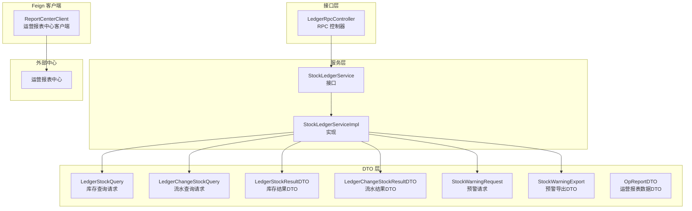
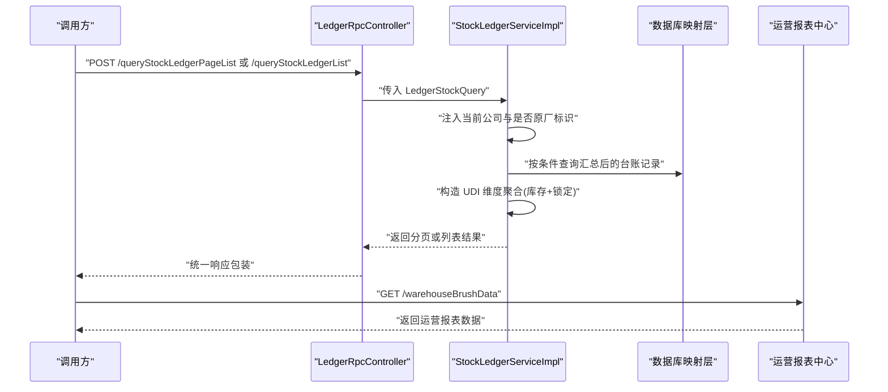
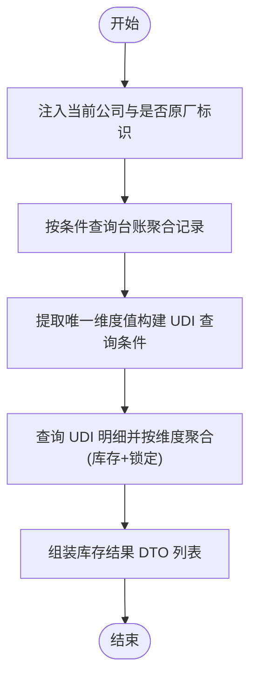
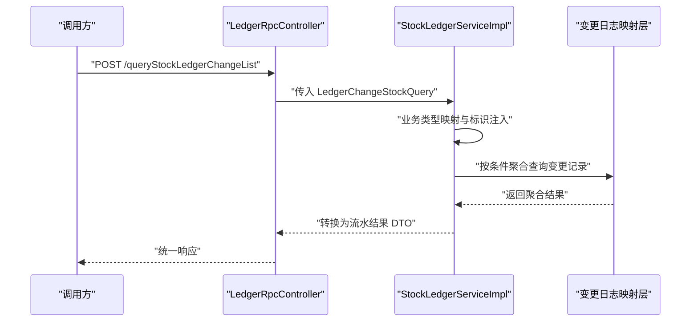
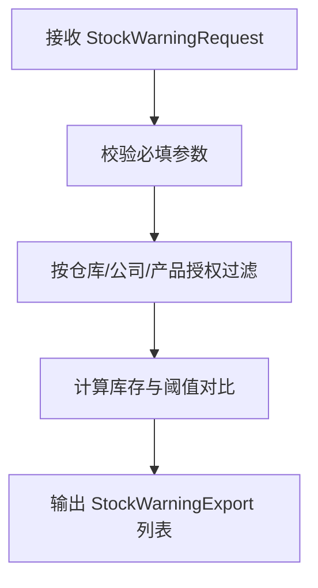
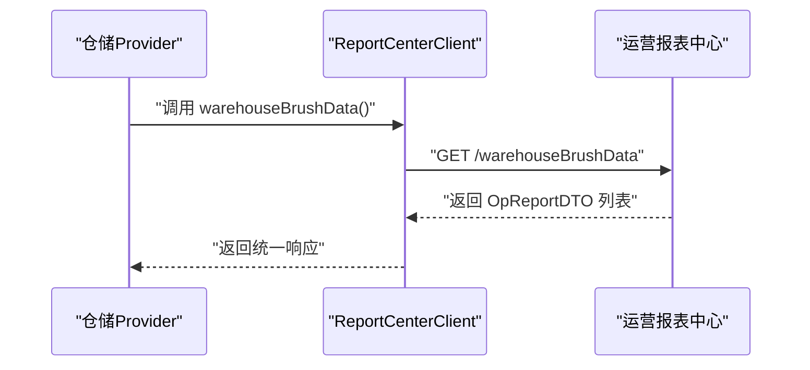
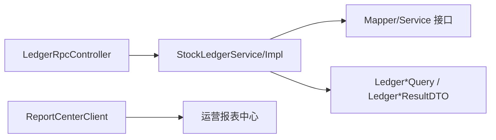

# 报表统计模块

<cite>
**本文引用的文件**
- [ReportCenterClient.java](file://guoke-deepexi-storage-center-provider/src/main/java/com/ deepexi/storage/feign/ReportCenterClient.java)
- [LedgerRpcController.java](file://guoke-deepexi-storage-center-provider/src/main/java/com/deepexi/storage/controller/rpc/LedgerRpcController.java)
- [StockLedgerService.java](file://guoke-deepexi-storage-center-provider/src/main/java/com/deepexi/storage/service/StockLedgerService.java)
- [StockLedgerServiceImpl.java](file://guoke-deepexi-storage-center-provider/src/main/java/com/deepexi/storage/service/impl/StockLedgerServiceImpl.java)
- [LedgerStockQuery.java](file://guoke-deepexi-storage-center-api/src/main/java/com/deepexi/api/storage/dto/ledger/req/LedgerStockQuery.java)
- [LedgerChangeStockQuery.java](file://guoke-deepexi-storage-center-api/src/main/java/com/deepexi/api/storage/dto/ledger/req/LedgerChangeStockQuery.java)
- [LedgerStockResultDTO.java](file://guoke-deepexi-storage-center-api/src/main/java/com/deepexi/api/storage/dto/ledger/res/LedgerStockResultDTO.java)
- [LedgerChangeStockResultDTO.java](file://guoke-deepexi-storage-center-api/src/main/java/com/deepexi/api/storage/dto/ledger/res/LedgerChangeStockResultDTO.java)
- [StockWarningRequest.java](file://guoke-deepexi-storage-center-api/src/main/java/com/deepexi/api/storage/dto/stock/StockWarningRequest.java)
- [StockWarningExport.java](file://guoke-deepexi-storage-center-api/src/main/java/com/deepexi/api/storage/dto/stock/StockWarningExport.java)
- [StockWarningQuery.java](file://guoke-deepexi-storage-center-api/src/main/java/com/deepexi/api/storage/dto/stock/StockWarningQuery.java)
- [OpReportDTO.java](file://guoke-deepexi-storage-center-provider/src/main/java/com/deepexi/storage/pojo/OpReportDTO.java)
</cite>

## 目录
1. [简介](#简介)
2. [项目结构](#项目结构)
3. [核心组件](#核心组件)
4. [架构总览](#架构总览)
5. [详细组件分析](#详细组件分析)
6. [依赖分析](#依赖分析)
7. [性能考虑](#性能考虑)
8. [故障排查指南](#故障排查指南)
9. [结论](#结论)
10. [附录](#附录)

## 简介
本模块聚焦于国科恒泰仓储管理系统的报表统计能力，覆盖库存报表、出入库流水与台账、预警报表等核心场景。文档从系统架构、数据采集与计算逻辑、展示格式、API 接口、聚合算法与时间维度处理、性能优化与缓存策略、配置与安全控制等方面进行系统化梳理，帮助开发者与使用者快速理解并高效使用报表统计能力。

## 项目结构
围绕报表统计的关键代码分布在“接口层”“服务层”“Feign 客户端”“DTO 定义”等层次，形成清晰的分层职责与调用链路。

图表来源
- [LedgerRpcController.java:1-64](file://guoke-deepexi-storage-center-provider/src/main/java/com/deepexi/storage/controller/rpc/LedgerRpcController.java#L1-L64)
- [StockLedgerService.java:1-21](file://guoke-deepexi-storage-center-provider/src/main/java/com/deepexi/storage/service/StockLedgerService.java#L1-L21)
- [StockLedgerServiceImpl.java:1-164](file://guoke-deepexi-storage-center-provider/src/main/java/com/deepexi/storage/service/impl/StockLedgerServiceImpl.java#L1-L164)
- [ReportCenterClient.java:1-23](file://guoke-deepexi-storage-center-provider/src/main/java/com/deepexi/storage/feign/ReportCenterClient.java#L1-L23)
- [LedgerStockQuery.java:1-53](file://guoke-deepexi-storage-center-api/src/main/java/com/deepexi/api/storage/dto/ledger/req/LedgerStockQuery.java#L1-L53)
- [LedgerChangeStockQuery.java](file://guoke-deepexi-storage-center-api/src/main/java/com/deepexi/api/storage/dto/ledger/req/LedgerChangeStockQuery.java)
- [LedgerStockResultDTO.java:1-95](file://guoke-deepexi-storage-center-api/src/main/java/com/deepexi/api/storage/dto/ledger/res/LedgerStockResultDTO.java#L1-L95)
- [LedgerChangeStockResultDTO.java](file://guoke-deepexi-storage-center-api/src/main/java/com/deepexi/api/storage/dto/ledger/res/LedgerChangeStockResultDTO.java)
- [StockWarningRequest.java:1-30](file://guoke-deepexi-storage-center-api/src/main/java/com/deepexi/api/storage/dto/stock/StockWarningRequest.java#L1-L30)
- [StockWarningExport.java:1-46](file://guoke-deepexi-storage-center-api/src/main/java/com/deepexi/api/storage/dto/stock/StockWarningExport.java#L1-L46)
- [OpReportDTO.java](file://guoke-deepexi-storage-center-provider/src/main/java/com/deepexi/storage/pojo/OpReportDTO.java)

章节来源
- [LedgerRpcController.java:1-64](file://guoke-deepexi-storage-center-provider/src/main/java/com/deepexi/storage/controller/rpc/LedgerRpcController.java#L1-L64)
- [StockLedgerService.java:1-21](file://guoke-deepexi-storage-center-provider/src/main/java/com/deepexi/storage/service/StockLedgerService.java#L1-L21)
- [StockLedgerServiceImpl.java:1-164](file://guoke-deepexi-storage-center-provider/src/main/java/com/deepexi/storage/service/impl/StockLedgerServiceImpl.java#L1-L164)
- [ReportCenterClient.java:1-23](file://guoke-deepexi-storage-center-provider/src/main/java/com/deepexi/storage/feign/ReportCenterClient.java#L1-L23)

## 核心组件
- RPC 控制器：提供库存台账与流水的查询接口，支持分页与列表两种返回形式。
- 服务接口与实现：封装库存汇总、流水聚合、UDI 维度统计、权限与工厂标识注入等逻辑。
- Feign 客户端：对接“运营报表中心”，用于拉取运营类报表数据。
- DTO 层：定义查询条件、结果结构、导出字段等，确保前后端契约一致。

章节来源
- [LedgerRpcController.java:24-63](file://guoke-deepexi-storage-center-provider/src/main/java/com/deepexi/storage/controller/rpc/LedgerRpcController.java#L24-L63)
- [StockLedgerService.java:11-20](file://guoke-deepexi-storage-center-provider/src/main/java/com/deepexi/storage/service/StockLedgerService.java#L11-L20)
- [StockLedgerServiceImpl.java:40-163](file://guoke-deepexi-storage-center-provider/src/main/java/com/deepexi/storage/service/impl/StockLedgerServiceImpl.java#L40-L163)
- [ReportCenterClient.java:15-22](file://guoke-deepexi-storage-center-provider/src/main/java/com/deepexi/storage/feign/ReportCenterClient.java#L15-L22)

## 架构总览
报表统计模块采用“控制器-服务-数据访问”的分层设计，结合 DTO 与 Feign 客户端完成跨中心数据集成。核心流程如下：

图表来源
- [LedgerRpcController.java:32-62](file://guoke-deepexi-storage-center-provider/src/main/java/com/deepexi/storage/controller/rpc/LedgerRpcController.java#L32-L62)
- [StockLedgerServiceImpl.java:66-142](file://guoke-deepexi-storage-center-provider/src/main/java/com/deepexi/storage/service/impl/StockLedgerServiceImpl.java#L66-L142)
- [ReportCenterClient.java:19-20](file://guoke-deepexi-storage-center-provider/src/main/java/com/deepexi/storage/feign/ReportCenterClient.java#L19-L20)

## 详细组件分析

### 库存报表（库存总账）
- 数据来源
  - 台账主表：按物权方、经销商、产品、批号等维度聚合。
  - UDI 维度：库存数量与锁定数量合并统计，形成最终可用库存。
- 查询参数
  - 支持按公司名称、产品编码/名称、批号、分页等条件过滤。
  - 自动注入“是否原厂”与“当前公司”标识，保障数据域隔离。
- 计算逻辑
  - 先查询台账聚合结果，再根据采购公司、物权公司、根产品、批号等构建 UDI 查询条件，汇总库存与锁定数量。
  - 使用分组键将多个维度拼接为稳定键，避免重复与错配。
- 展示格式
  - 返回库存结果 DTO，包含物权方/经销商公司信息、产品规格型号单位、批号、生产/有效期、台账数量、库存数量、差异数量等字段。

图表来源
- [StockLedgerServiceImpl.java:96-142](file://guoke-deepexi-storage-center-provider/src/main/java/com/deepexi/storage/service/impl/StockLedgerServiceImpl.java#L96-L142)
- [LedgerStockQuery.java:6-52](file://guoke-deepexi-storage-center-api/src/main/java/com/deepexi/api/storage/dto/ledger/req/LedgerStockQuery.java#L6-L52)
- [LedgerStockResultDTO.java:8-94](file://guoke-deepexi-storage-center-api/src/main/java/com/deepexi/api/storage/dto/ledger/res/LedgerStockResultDTO.java#L8-L94)

章节来源
- [StockLedgerServiceImpl.java:96-142](file://guoke-deepexi-storage-center-provider/src/main/java/com/deepexi/storage/service/impl/StockLedgerServiceImpl.java#L96-L142)
- [LedgerStockQuery.java:6-52](file://guoke-deepexi-storage-center-api/src/main/java/com/deepexi/api/storage/dto/ledger/req/LedgerStockQuery.java#L6-L52)
- [LedgerStockResultDTO.java:8-94](file://guoke-deepexi-storage-center-api/src/main/java/com/deepexi/api/storage/dto/ledger/res/LedgerStockResultDTO.java#L8-L94)

### 出入库流水与台账变更（库存明细账）
- 数据来源
  - 变更日志表：记录物权方与公司主体变更、业务类型等。
- 查询参数
  - 支持按业务类型映射（前端类型可能对应多个后端类型）自动展开。
  - 注入当前公司与是否原厂标识，限制可见范围。
- 计算逻辑
  - 将前端业务类型映射到后端类型集合，执行聚合查询，随后转换为结果 DTO。
- 展示格式
  - 返回流水结果 DTO 列表，包含物权方、经销商、产品、批号、变更数量、时间等字段。

图表来源
- [LedgerRpcController.java:32-46](file://guoke-deepexi-storage-center-provider/src/main/java/com/deepexi/storage/controller/rpc/LedgerRpcController.java#L32-L46)
- [StockLedgerServiceImpl.java:83-94](file://guoke-deepexi-storage-center-provider/src/main/java/com/deepexi/storage/service/impl/StockLedgerServiceImpl.java#L83-L94)
- [LedgerChangeStockQuery.java](file://guoke-deepexi-storage-center-api/src/main/java/com/deepexi/api/storage/dto/ledger/req/LedgerChangeStockQuery.java)
- [LedgerChangeStockResultDTO.java](file://guoke-deepexi-storage-center-api/src/main/java/com/deepexi/api/storage/dto/ledger/res/LedgerChangeStockResultDTO.java)

章节来源
- [LedgerRpcController.java:32-46](file://guoke-deepexi-storage-center-provider/src/main/java/com/deepexi/storage/controller/rpc/LedgerRpcController.java#L32-L46)
- [StockLedgerServiceImpl.java:83-94](file://guoke-deepexi-storage-center-provider/src/main/java/com/deepexi/storage/service/impl/StockLedgerServiceImpl.java#L83-L94)

### 预警报表
- 数据来源
  - 预警规则与库存数据联动，结合仓库、货主/经销商、产品授权 ID、上下线阈值等。
- 查询参数
  - 必填仓库 ID、货主/经销商公司 ID、产品授权 ID 列表；可选上下线阈值。
- 导出格式
  - 支持 Excel 导出，字段包括产品编码/名称/规格/型号、经销商公司名称、仓库名称、库存总量、预警上限、预警下限等。

图表来源
- [StockWarningRequest.java:16-30](file://guoke-deepexi-storage-center-api/src/main/java/com/deepexi/api/storage/dto/stock/StockWarningRequest.java#L16-L30)
- [StockWarningExport.java:18-46](file://guoke-deepexi-storage-center-api/src/main/java/com/deepexi/api/storage/dto/stock/StockWarningExport.java#L18-L46)

章节来源
- [StockWarningRequest.java:16-30](file://guoke-deepexi-storage-center-api/src/main/java/com/deepexi/api/storage/dto/stock/StockWarningRequest.java#L16-L30)
- [StockWarningExport.java:18-46](file://guoke-deepexi-storage-center-api/src/main/java/com/deepexi/api/storage/dto/stock/StockWarningExport.java#L18-L46)

### 运营类报表（仓库刷数）
- 数据来源
  - 通过 Feign 客户端调用“运营报表中心”，获取仓库刷数等运营类报表数据。
- 接口
  - GET /m-operation-report-center/rpc/api/v1/opReportCenter/warehouseBrushData
  - 返回运营报表数据 DTO 列表。

图表来源
- [ReportCenterClient.java:15-22](file://guoke-deepexi-storage-center-provider/src/main/java/com/deepexi/storage/feign/ReportCenterClient.java#L15-L22)
- [OpReportDTO.java](file://guoke-deepexi-storage-center-provider/src/main/java/com/deepexi/storage/pojo/OpReportDTO.java)

章节来源
- [ReportCenterClient.java:15-22](file://guoke-deepexi-storage-center-provider/src/main/java/com/deepexi/storage/feign/ReportCenterClient.java#L15-L22)
- [OpReportDTO.java](file://guoke-deepexi-storage-center-provider/src/main/java/com/deepexi/storage/pojo/OpReportDTO.java)

## 依赖分析
- 控制器依赖服务接口，服务实现依赖映射层与转换器，保证职责分离与可测试性。
- DTO 层作为契约，贯穿查询、计算与返回过程，确保前后端一致性。
- 外部中心通过 Feign 客户端接入，实现报表能力横向扩展。

图表来源
- [LedgerRpcController.java:29-30](file://guoke-deepexi-storage-center-provider/src/main/java/com/deepexi/storage/controller/rpc/LedgerRpcController.java#L29-L30)
- [StockLedgerServiceImpl.java:42-51](file://guoke-deepexi-storage-center-provider/src/main/java/com/deepexi/storage/service/impl/StockLedgerServiceImpl.java#L42-L51)
- [ReportCenterClient.java:15-16](file://guoke-deepexi-storage-center-provider/src/main/java/com/deepexi/storage/feign/ReportCenterClient.java#L15-L16)

章节来源
- [LedgerRpcController.java:29-30](file://guoke-deepexi-storage-center-provider/src/main/java/com/deepexi/storage/controller/rpc/LedgerRpcController.java#L29-L30)
- [StockLedgerServiceImpl.java:42-51](file://guoke-deepexi-storage-center-provider/src/main/java/com/deepexi/storage/service/impl/StockLedgerServiceImpl.java#L42-L51)
- [ReportCenterClient.java:15-16](file://guoke-deepexi-storage-center-provider/src/main/java/com/deepexi/storage/feign/ReportCenterClient.java#L15-L16)

## 性能考虑
- 分页与批量
  - 使用分页组件对大结果集进行分页，降低单次传输与内存压力。
- 聚合与去重
  - 在服务层对 UDI 维度进行分组聚合，减少重复计算与冗余数据。
- 条件约束
  - 通过“是否原厂”与“当前公司”标识缩小查询范围，避免跨域扫描。
- 缓存策略建议
  - 对热点查询（如固定时间段内的库存汇总）引入本地缓存或 Redis 缓存，设置合理过期时间与失效策略。
- 大数据量处理
  - 对导出类报表（如预警导出）采用流式写入与分段导出，避免一次性加载全部数据。
- 并发与锁
  - 对高并发写入场景下的库存与流水统计，建议在服务层增加幂等与重试机制，必要时使用分布式锁。

## 故障排查指南
- 查询无结果
  - 检查是否正确注入“当前公司”与“是否原厂”标识；确认查询条件是否过于严格导致无匹配。
- 结果异常
  - 核对业务类型映射是否完整；检查 UDI 维度聚合键是否包含所有关键维度。
- 导出失败
  - 确认导出 DTO 字段与模板一致；检查 Excel 写入流与分段导出逻辑。
- 外部中心调用失败
  - 检查 Feign 客户端配置与目标服务可达性；关注超时与熔断策略。

章节来源
- [StockLedgerServiceImpl.java:66-94](file://guoke-deepexi-storage-center-provider/src/main/java/com/deepexi/storage/service/impl/StockLedgerServiceImpl.java#L66-L94)
- [StockWarningExport.java:18-46](file://guoke-deepexi-storage-center-api/src/main/java/com/deepexi/api/storage/dto/stock/StockWarningExport.java#L18-L46)
- [ReportCenterClient.java:15-22](file://guoke-deepexi-storage-center-provider/src/main/java/com/deepexi/storage/feign/ReportCenterClient.java#L15-L22)

## 结论
本模块以清晰的分层与 DTO 契约实现了库存总账、流水与台账、预警、运营报表等核心统计能力。通过注入式的数据域控制、聚合与分组算法以及可扩展的外部中心对接，既满足了多维度统计需求，也为后续性能优化与功能扩展提供了良好基础。

## 附录

### API 接口清单（RPC）
- 库存总账（分页）
  - 方法：POST
  - 路径：/api/v1/storage/rpc/ledger/queryStockLedgerPageList
  - 请求体：LedgerStockQuery
  - 返回：分页结果（LedgerStockResultDTO）
- 库存总账（列表）
  - 方法：POST
  - 路径：/api/v1/storage/rpc/ledger/queryStockLedgerList
  - 请求体：LedgerStockQuery
  - 返回：列表（LedgerStockResultDTO）
- 库存流水（分页）
  - 方法：POST
  - 路径：/api/v1/storage/rpc/ledger/queryStockLedgerChangePageList
  - 请求体：LedgerChangeStockQuery
  - 返回：分页结果（LedgerChangeStockResultDTO）
- 库存流水（列表）
  - 方法：POST
  - 路径：/api/v1/storage/rpc/ledger/queryStockLedgerChangeList
  - 请求体：LedgerChangeStockQuery
  - 返回：列表（LedgerChangeStockResultDTO）

章节来源
- [LedgerRpcController.java:32-62](file://guoke-deepexi-storage-center-provider/src/main/java/com/deepexi/storage/controller/rpc/LedgerRpcController.java#L32-L62)
- [LedgerStockQuery.java:6-52](file://guoke-deepexi-storage-center-api/src/main/java/com/deepexi/api/storage/dto/ledger/req/LedgerStockQuery.java#L6-L52)
- [LedgerChangeStockQuery.java](file://guoke-deepexi-storage-center-api/src/main/java/com/deepexi/api/storage/dto/ledger/req/LedgerChangeStockQuery.java)
- [LedgerStockResultDTO.java:8-94](file://guoke-deepexi-storage-center-api/src/main/java/com/deepexi/api/storage/dto/ledger/res/LedgerStockResultDTO.java#L8-L94)
- [LedgerChangeStockResultDTO.java](file://guoke-deepexi-storage-center-api/src/main/java/com/deepexi/api/storage/dto/ledger/res/LedgerChangeStockResultDTO.java)

### 预警报表接口
- 预警查询
  - 方法：POST
  - 路径：/api/v1/storage/rpc/warning/queryStockWarning
  - 请求体：StockWarningRequest
  - 返回：分页或列表结果（视具体实现而定）
- 预警导出
  - 方法：POST
  - 路径：/api/v1/storage/rpc/warning/exportStockWarning
  - 请求体：StockWarningRequest
  - 返回：Excel 文件（字段参考 StockWarningExport）

章节来源
- [StockWarningRequest.java:16-30](file://guoke-deepexi-storage-center-api/src/main/java/com/deepexi/api/storage/dto/stock/StockWarningRequest.java#L16-L30)
- [StockWarningExport.java:18-46](file://guoke-deepexi-storage-center-api/src/main/java/com/deepexi/api/storage/dto/stock/StockWarningExport.java#L18-L46)

### 运营报表接口
- 仓库刷数
  - 方法：GET
  - 路径：/m-operation-report-center/rpc/api/v1/opReportCenter/warehouseBrushData
  - 返回：BaseResponseDto<List<OpReportDTO>>

章节来源
- [ReportCenterClient.java:19-20](file://guoke-deepexi-storage-center-provider/src/main/java/com/deepexi/storage/feign/ReportCenterClient.java#L19-L20)
- [OpReportDTO.java](file://guoke-deepexi-storage-center-provider/src/main/java/com/deepexi/storage/pojo/OpReportDTO.java)