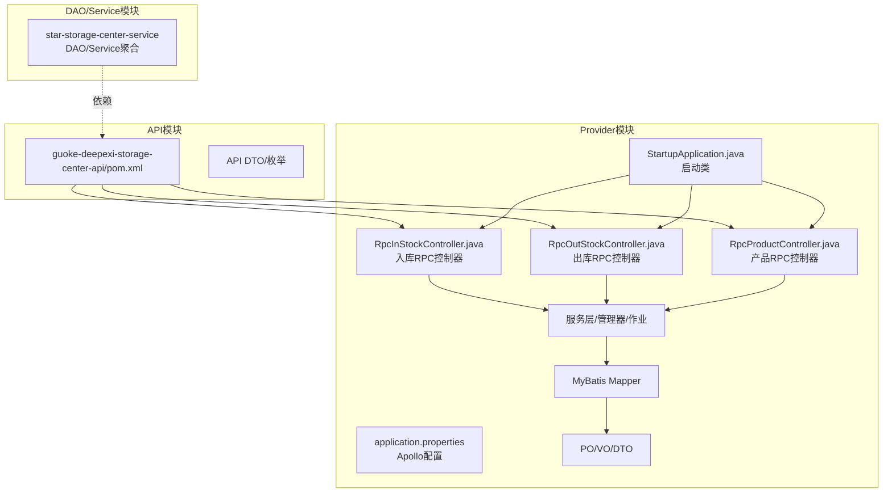
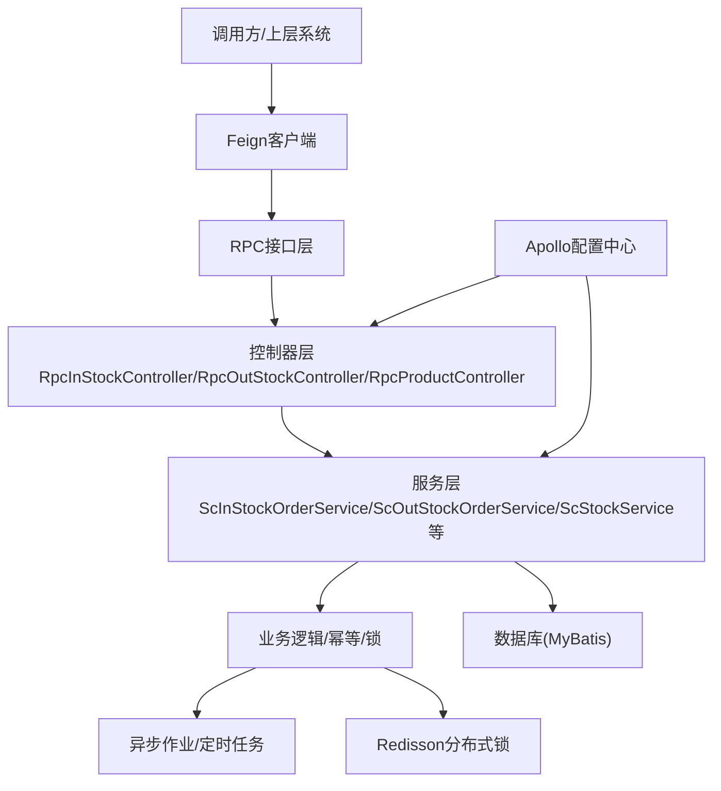
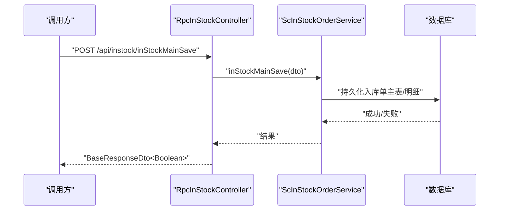
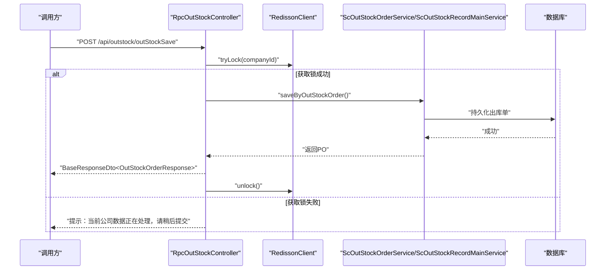
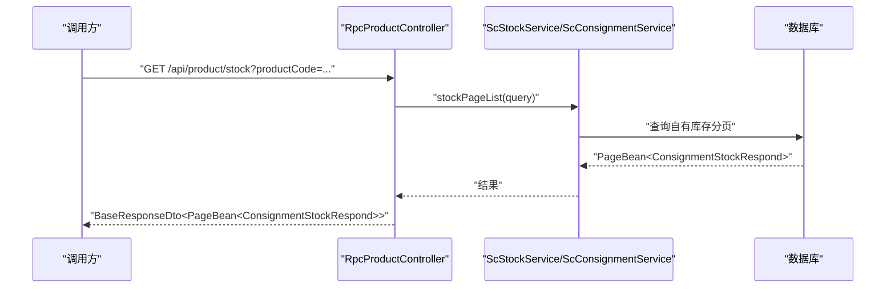
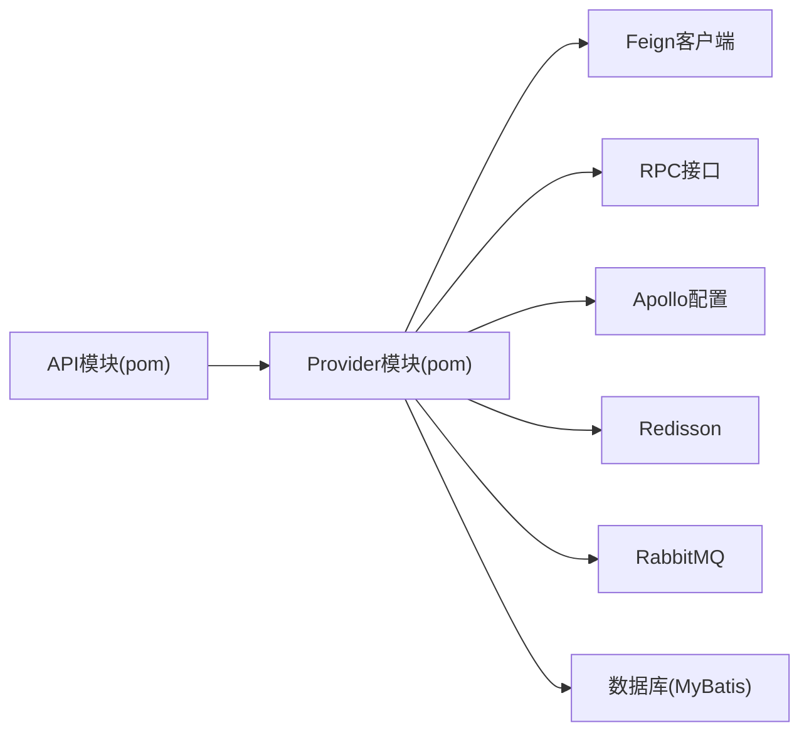

# 核心模块

<cite>
**本文引用的文件**
- [README.md](file://README.md)
- [guoke-deepexi-storage-center-api/pom.xml](file://guoke-deepexi-storage-center-api/pom.xml)
- [guoke-deepexi-storage-center-provider/pom.xml](file://guoke-deepexi-storage-center-provider/pom.xml)
- [guoke-deepexi-storage-center-provider/src/main/java/com/ deepexi/storage/StartupApplication.java](file://guoke-deepexi-storage-center-provider/src/main/java/com/deepexi/storage/StartupApplication.java)
- [guoke-deepexi-storage-center-provider/src/main/resources/application.properties](file://guoke-deepexi-storage-center-provider/src/main/resources/application.properties)
- [guoke-deepexi-storage-center-provider/src/main/java/com/deepexi/storage/controller/rpc/RpcInStockController.java](file://guoke-deepexi-storage-center-provider/src/main/java/com/deepexi/storage/controller/rpc/RpcInStockController.java)
- [guoke-deepexi-storage-center-provider/src/main/java/com/deepexi/storage/controller/rpc/RpcOutStockController.java](file://guoke-deepexi-storage-center-provider/src/main/java/com/deepexi/storage/controller/rpc/RpcOutStockController.java)
- [guoke-deepexi-storage-center-provider/src/main/java/com/deepexi/storage/controller/rpc/RpcProductController.java](file://guoke-deepexi-storage-center-provider/src/main/java/com/deepexi/storage/controller/rpc/RpcProductController.java)
</cite>

## 目录
1. [简介](#简介)
2. [项目结构](#项目结构)
3. [核心组件](#核心组件)
4. [架构总览](#架构总览)
5. [详细组件分析](#详细组件分析)
6. [依赖分析](#依赖分析)
7. [性能考虑](#性能考虑)
8. [故障排查指南](#故障排查指南)
9. [结论](#结论)
10. [附录](#附录)

## 简介
本文件面向国科恒泰仓储管理系统的核心模块，系统采用微服务与RPC双栈架构，围绕“库存管理、入库管理、出库管理、订单管理、产品管理、仓库管理”六大核心业务域展开，提供从接口定义、控制层、服务层、持久层到定时任务与异步作业的完整说明。文档兼顾初学者易读性与资深工程师的技术深度，覆盖模块职责、接口设计、实现原理、数据流与业务流程协调，并给出使用示例、配置项与最佳实践。

## 项目结构
项目采用多模块分层组织：
- API模块：定义对外RPC接口与DTO/枚举，统一契约。
- Provider模块：服务端实现，包含启动类、配置、控制器、服务、映射器、模型与定时任务等。
- DAO/Service模块：作为依赖聚合，提供数据库访问与业务服务能力。

图示来源
- [guoke-deepexi-storage-center-provider/src/main/java/com/deepexi/storage/StartupApplication.java:14-33](file://guoke-deepexi-storage-center-provider/src/main/java/com/deepexi/storage/StartupApplication.java#L14-L33)
- [guoke-deepexi-storage-center-provider/src/main/resources/application.properties:1-6](file://guoke-deepexi-storage-center-provider/src/main/resources/application.properties#L1-L6)
- [guoke-deepexi-storage-center-provider/src/main/java/com/deepexi/storage/controller/rpc/RpcInStockController.java:51-55](file://guoke-deepexi/storage/controller/rpc/RpcInStockController.java#L51-L55)
- [guoke-deepexi-storage-center-provider/src/main/java/com/deepexi/storage/controller/rpc/RpcOutStockController.java:52-56](file://guoke-deepexi/storage/controller/rpc/RpcOutStockController.java#L52-L56)
- [guoke-deepexi-storage-center-provider/src/main/java/com/deepexi/storage/controller/rpc/RpcProductController.java:44-48](file://guoke-deepexi/storage/controller/rpc/RpcProductController.java#L44-L48)

章节来源
- [guoke-deepexi-storage-center-provider/src/main/java/com/deepexi/storage/StartupApplication.java:14-33](file://guoke-deepexi-storage-center-provider/src/main/java/com/deepexi/storage/StartupApplication.java#L14-L33)
- [guoke-deepexi-storage-center-provider/src/main/resources/application.properties:1-6](file://guoke-deepexi-storage-center-provider/src/main/resources/application.properties#L1-L6)

## 核心组件
- 启动与配置
  - 启动类启用服务发现、Feign、事务、扫描包、调度与RPC，作为Provider模块入口。
  - 应用通过Apollo动态配置加载，支持多命名空间。
- 控制器层
  - 入库RPC控制器：负责入库通知单、入库单、OMS对接、扫码导入、文件校验与异步保存等。
  - 出库RPC控制器：负责出库通知单、出库单、批量出库、分布式锁保护等。
  - 产品RPC控制器：负责产品查询、UDI详情、寄售/自有库存查询、配位拣货等。
- 服务层与作业
  - 服务层封装业务逻辑，结合异步作业与Redisson分布式锁保障并发安全。
  - 提供接口日志记录、幂等控制、文件导入校验与保存等能力。

章节来源
- [guoke-deepexi-storage-center-provider/src/main/java/com/deepexi/storage/StartupApplication.java:19-27](file://guoke-deepexi-storage-center-provider/src/main/java/com/deepexi/storage/StartupApplication.java#L19-L27)
- [guoke-deepexi-storage-center-provider/src/main/resources/application.properties:1-6](file://guoke-deepexi-storage-center-provider/src/main/resources/application.properties#L1-L6)
- [guoke-deepexi-storage-center-provider/src/main/java/com/deepexi/storage/controller/rpc/RpcInStockController.java:78-135](file://guoke-deepexi/storage/controller/rpc/RpcInStockController.java#L78-L135)
- [guoke-deepexi-storage-center-provider/src/main/java/com/deepexi/storage/controller/rpc/RpcOutStockController.java:74-177](file://guoke-deepexi/storage/controller/rpc/RpcOutStockController.java#L74-L177)
- [guoke-deepexi-storage-center-provider/src/main/java/com/deepexi/storage/controller/rpc/RpcProductController.java:76-196](file://guoke-deepexi/storage/controller/rpc/RpcProductController.java#L76-L196)

## 架构总览
系统采用“API契约 + Provider实现 + 外部中心对接”的架构模式，通过Feign与RPC协同工作，结合Apollo配置中心、Redisson分布式锁、异步作业与定时任务，实现高可用、可扩展的仓储业务闭环。

图示来源
- [guoke-deepexi-storage-center-provider/src/main/java/com/deepexi/storage/StartupApplication.java:19-27](file://guoke-deepexi-storage-center-provider/src/main/java/com/deepexi/storage/StartupApplication.java#L19-L27)
- [guoke-deepexi-storage-center-provider/src/main/resources/application.properties:1-6](file://guoke-deepexi-storage-center-provider/src/main/resources/application.properties#L1-L6)
- [guoke-deepexi-storage-center-provider/src/main/java/com/deepexi/storage/controller/rpc/RpcInStockController.java:78-135](file://guoke-deepexi/storage/controller/rpc/RpcInStockController.java#L78-L135)
- [guoke-deepexi-storage-center-provider/src/main/java/com/deepexi/storage/controller/rpc/RpcOutStockController.java:74-177](file://guoke-deepexi/storage/controller/rpc/RpcOutStockController.java#L74-L177)
- [guoke-deepexi-storage-center-provider/src/main/java/com/deepexi/storage/controller/rpc/RpcProductController.java:76-196](file://guoke-deepexi/storage/controller/rpc/RpcProductController.java#L76-L196)

## 详细组件分析

### 入库管理模块
职责与能力
- 入库通知单创建与查询
- 入库单主表与明细保存
- OMS对接与回写日志
- 扫码导入与文件中心校验/保存
- 关联单据与状态流转

接口设计要点
- 控制器路径前缀统一为“/api/instock”，便于按业务域隔离。
- 使用BaseResponseDto统一响应包装；部分场景返回具体VO或布尔值。
- 对外暴露的接口方法包括：inStockSave、inStockMainSave、oms、importInStockScanCode、uploadDataCheck、saveFileData等。

实现原理
- 控制器调用服务层完成业务处理，服务层再通过Mapper持久化。
- 分布式锁用于并发保护（如出库场景），入库侧以幂等与接口日志保障一致性。
- 文件导入采用异步校验与保存，避免阻塞主线程。

使用示例（步骤说明）
- 创建入库通知单：POST /api/instock/inStockSave，传入入库通知单DTO。
- 生成入库单：POST /api/instock/inStockMainSave，传入入库单主表DTO。
- OMS对接：POST /api/instock/oms，传入OMS转换后的入库请求。
- 扫码导入：POST /api/instock/importInStockScanCode，传入扫码导入请求。
- 文件导入：POST /api/instock/uploadDataCheck 与 /api/instock/saveFileData，分别进行校验与保存。

最佳实践
- 建议在调用前进行参数校验与幂等标识设置。
- 导入大文件建议使用文件中心回调接口，避免超时。
- 记录接口日志，便于问题追踪与审计。

图示来源
- [guoke-deepexi-storage-center-provider/src/main/java/com/deepexi/storage/controller/rpc/RpcInStockController.java:117-135](file://guoke-deepexi/storage/controller/rpc/RpcInStockController.java#L117-L135)

章节来源
- [guoke-deepexi-storage-center-provider/src/main/java/com/deepexi/storage/controller/rpc/RpcInStockController.java:78-135](file://guoke-deepexi/storage/controller/rpc/RpcInStockController.java#L78-L135)

### 出库管理模块
职责与能力
- 出库通知单创建与查询
- 出库单主表与明细保存
- 批量出库与重复处理防护
- 分布式锁保护并发安全
- 与入库模块的联动（如按出库记录反向关联）

接口设计要点
- 控制器路径前缀统一为“/api/outstock”。
- 支持多种出库保存变体（带/不带锁、带/不带回显等）。
- 使用幂等注解防止重复提交。

实现原理
- 出库保存时对“公司+业务”维度加Redisson分布式锁，避免并发冲突。
- 若订单已全部出库，直接返回已处理提示，避免重复处理。
- 与入库模块通过接口日志与关联单据保持一致。

使用示例（步骤说明）
- 创建出库通知单：POST /api/outstock/outStockSave 或 outStockSaveArgs/outStockSaveArgsByReturn。
- 生成出库单：POST /api/outstock/outStockMainSave，传出入库单主表DTO。
- 批量出库：POST /api/outstock/batchSaveOutStockMain，传入批量请求。

最佳实践
- 在高并发场景下优先使用带锁版本，确保库存一致性。
- 对重复提交场景启用幂等策略，避免二次处理。
- 结合接口日志与异常捕获，快速定位问题。

图示来源
- [guoke-deepexi-storage-center-provider/src/main/java/com/deepexi/storage/controller/rpc/RpcOutStockController.java:74-105](file://guoke-deepexi/storage/controller/rpc/RpcOutStockController.java#L74-L105)

章节来源
- [guoke-deepexi-storage-center-provider/src/main/java/com/deepexi/storage/controller/rpc/RpcOutStockController.java:74-177](file://guoke-deepexi/storage/controller/rpc/RpcOutStockController.java#L74-L177)

### 产品管理模块
职责与能力
- 产品基础信息查询与UDI详情
- 寄售库存与自有库存查询
- 可退货寄售库存查询
- 配位拣货相关查询

接口设计要点
- 控制器路径前缀为“/api/product”。
- 提供GET/POST多种查询方式，支持分页与条件过滤。
- 返回统一的Payload/BaseResponseDto包装。

实现原理
- 产品查询与库存查询由对应服务层实现，内部可能联动出库/入库订单与库存服务。
- 配位拣货查询用于拣货策略与库存分配。

使用示例（步骤说明）
- 查询产品详情：GET /api/product/detail?productCode=...
- 查询寄售库存：GET /api/product/consignment?productCode=...
- 查询自有库存：GET /api/product/stock?productCode=...
- 查询可退货寄售库存：GET /api/product/returnConsignmentList?productCode=...
- 配位拣货查询：GET /api/product/coordination/pick?...

最佳实践
- 查询条件尽量精确，减少全表扫描。
- 对高频查询开启缓存策略（如UDI详情）。
- 结合权限与租户隔离，确保数据安全。

图示来源
- [guoke-deepexi-storage-center-provider/src/main/java/com/deepexi/storage/controller/rpc/RpcProductController.java:124-137](file://guoke-deepexi/storage/controller/rpc/RpcProductController.java#L124-L137)

章节来源
- [guoke-deepexi-storage-center-provider/src/main/java/com/deepexi/storage/controller/rpc/RpcProductController.java:76-196](file://guoke-deepexi/storage/controller/rpc/RpcProductController.java#L76-L196)

### 订单管理模块（概念说明）
- 入库/出库通知单与主单据的关联关系由控制器与服务层维护。
- OMS对接通过统一的入参转换与接口日志记录，保证可追溯性。
- 关联单据状态同步与回写，确保业务闭环。

章节来源
- [guoke-deepexi-storage-center-provider/src/main/java/com/deepexi/storage/controller/rpc/RpcInStockController.java:137-152](file://guoke-deepexi/storage/controller/rpc/RpcInStockController.java#L137-L152)
- [guoke-deepexi-storage-center-provider/src/main/java/com/deepexi/storage/controller/rpc/RpcOutStockController.java:154-177](file://guoke-deepexi/storage/controller/rpc/RpcOutStockController.java#L154-L177)

### 仓库管理模块（概念说明）
- 仓库维度的绑定与映射通过产品仓库绑定RPC接口实现。
- 仓库区域类型、业务类型等枚举在API模块中定义，便于统一约束。
- 与产品、库存、拣货等模块存在跨域协作关系。

章节来源
- [guoke-deepexi-storage-center-api/pom.xml:42-62](file://guoke-deepexi-storage-center-api/pom.xml#L42-L62)

## 依赖分析
- 模块依赖
  - API模块为Provider模块的依赖，提供统一的DTO/枚举与RPC契约。
  - Provider模块依赖多个中心（认证、订单、产品、数据、报告、统计等）与中间件（Apollo、Redisson、AMQP、Elasticsearch等）。
- 组件耦合
  - 控制器与服务层松耦合，通过接口契约交互。
  - 服务层与Mapper/Model紧耦合，遵循分层原则。
- 外部集成
  - Feign用于远程调用，RPC用于内部协议。
  - Apollo集中配置，Redisson提供分布式锁，MQ用于异步消息。

图示来源
- [guoke-deepexi-storage-center-api/pom.xml:14-63](file://guoke-deepexi-storage-center-api/pom.xml#L14-L63)
- [guoke-deepexi-storage-center-provider/pom.xml:15-394](file://guoke-deepexi-storage-center-provider/pom.xml#L15-L394)

章节来源
- [guoke-deepexi-storage-center-api/pom.xml:14-63](file://guoke-deepexi-storage-center-api/pom.xml#L14-L63)
- [guoke-deepexi-storage-center-provider/pom.xml:15-394](file://guoke-deepexi-storage-center-provider/pom.xml#L15-L394)

## 性能考虑
- 并发控制
  - 出库场景使用Redisson分布式锁，避免同一公司维度并发写入导致的数据不一致。
- 异步处理
  - 文件导入采用异步校验与保存，降低接口延迟。
- 缓存与分页
  - 对高频查询（如产品详情、库存分页）建议引入缓存与合理分页策略。
- 日志与监控
  - 统一接口日志记录，结合Apollo配置中心与监控体系，快速定位性能瓶颈。

## 故障排查指南
常见问题与处理
- 接口返回“当前公司数据正在处理，请稍后提交”
  - 原因：分布式锁占用，同一公司并发写入被阻塞。
  - 处理：等待锁释放或调整并发策略。
- 请求失败且无明确错误信息
  - 原因：异常被捕获并统一封装。
  - 处理：查看接口日志与异常堆栈，确认入参与业务规则。
- 文件导入失败
  - 原因：文件中心回调参数为空或解析异常。
  - 处理：检查回调入参结构与字段完整性。

章节来源
- [guoke-deepexi-storage-center-provider/src/main/java/com/deepexi/storage/controller/rpc/RpcOutStockController.java:101-104](file://guoke-deepexi/storage/controller/rpc/RpcOutStockController.java#L101-L104)
- [guoke-deepexi-storage-center-provider/src/main/java/com/deepexi/storage/controller/rpc/RpcInStockController.java:172-186](file://guoke-deepexi/storage/controller/rpc/RpcInStockController.java#L172-L186)

## 结论
本仓储系统以清晰的模块划分与严格的分层设计为基础，通过API契约、RPC与Feign协同、Apollo配置与Redisson锁等技术手段，实现了入库、出库、产品、订单与仓库等核心业务的稳定运行。建议在实际落地中重点关注并发控制、异步处理与日志监控，持续优化查询与导入性能，确保系统在高负载下的可靠性与可维护性。

## 附录
- 快速参考
  - 启动类：StartupApplication.java
  - Apollo配置：application.properties
  - 入库接口：/api/instock/*
  - 出库接口：/api/outstock/*
  - 产品接口：/api/product/*

章节来源
- [guoke-deepexi-storage-center-provider/src/main/java/com/deepexi/storage/StartupApplication.java:19-27](file://guoke-deepexi-storage-center-provider/src/main/java/com/deepexi/storage/StartupApplication.java#L19-L27)
- [guoke-deepexi-storage-center-provider/src/main/resources/application.properties:1-6](file://guoke-deepexi-storage-center-provider/src/main/resources/application.properties#L1-L6)
- [guoke-deepexi-storage-center-provider/src/main/java/com/deepexi/storage/controller/rpc/RpcInStockController.java:51-55](file://guoke-deepexi/storage/controller/rpc/RpcInStockController.java#L51-L55)
- [guoke-deepexi-storage-center-provider/src/main/java/com/deepexi/storage/controller/rpc/RpcOutStockController.java:52-56](file://guoke-deepexi/storage/controller/rpc/RpcOutStockController.java#L52-L56)
- [guoke-deepexi-storage-center-provider/src/main/java/com/deepexi/storage/controller/rpc/RpcProductController.java:44-48](file://guoke-deepexi/storage/controller/rpc/RpcProductController.java#L44-L48)