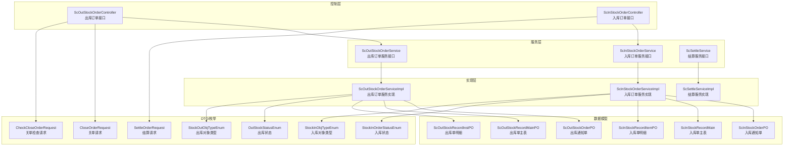
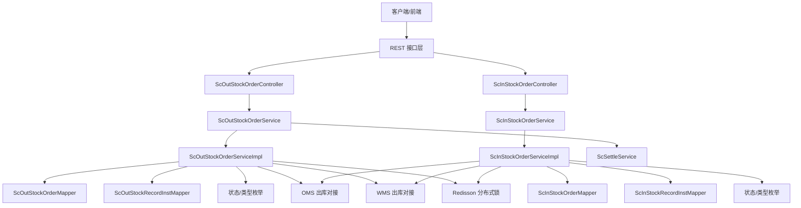
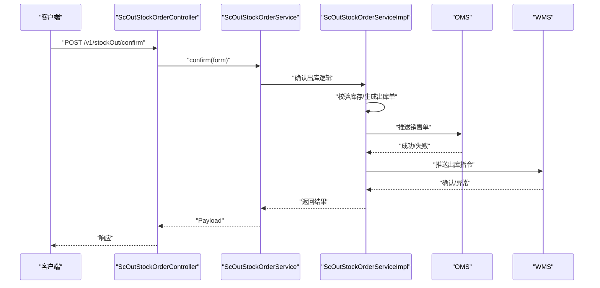
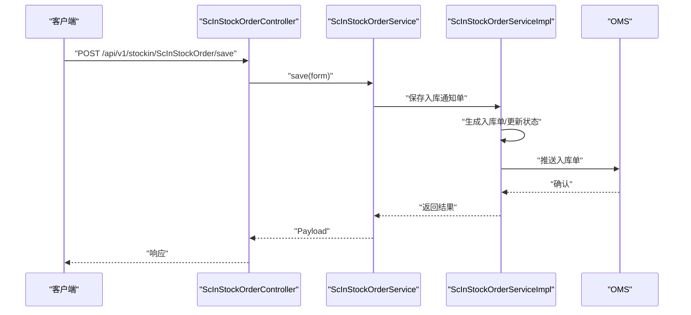
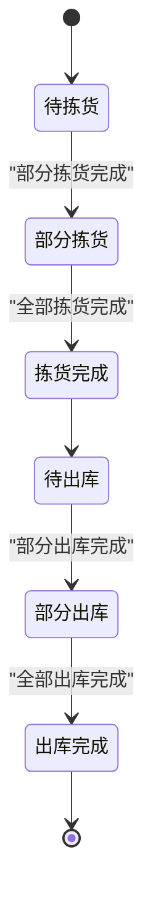
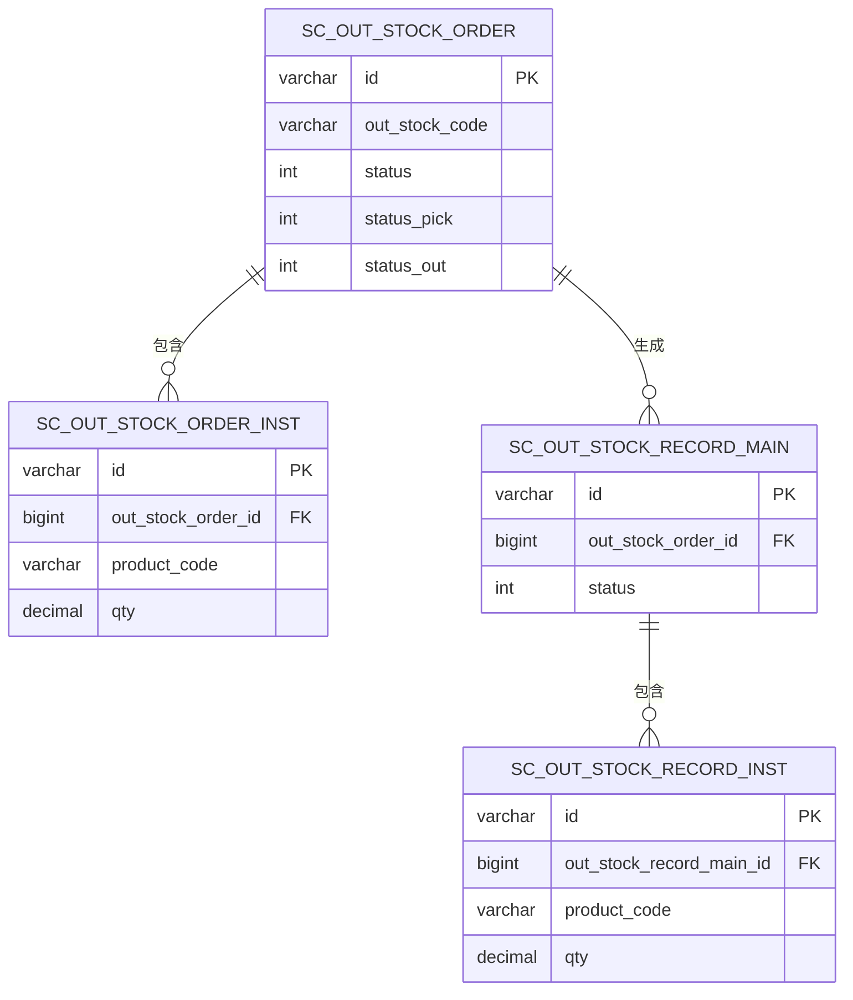
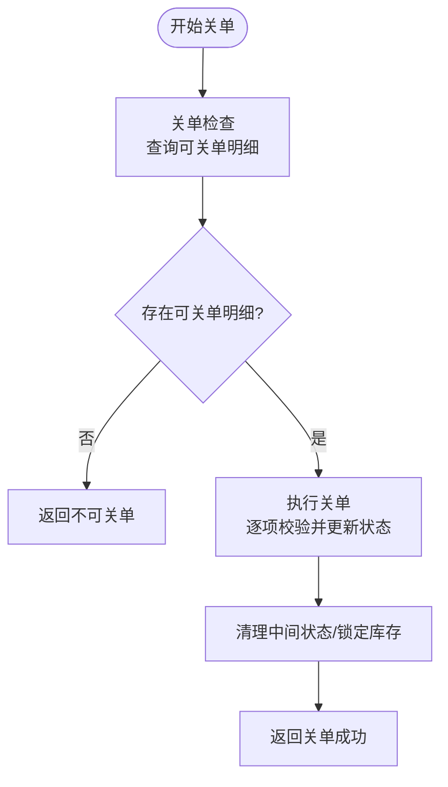
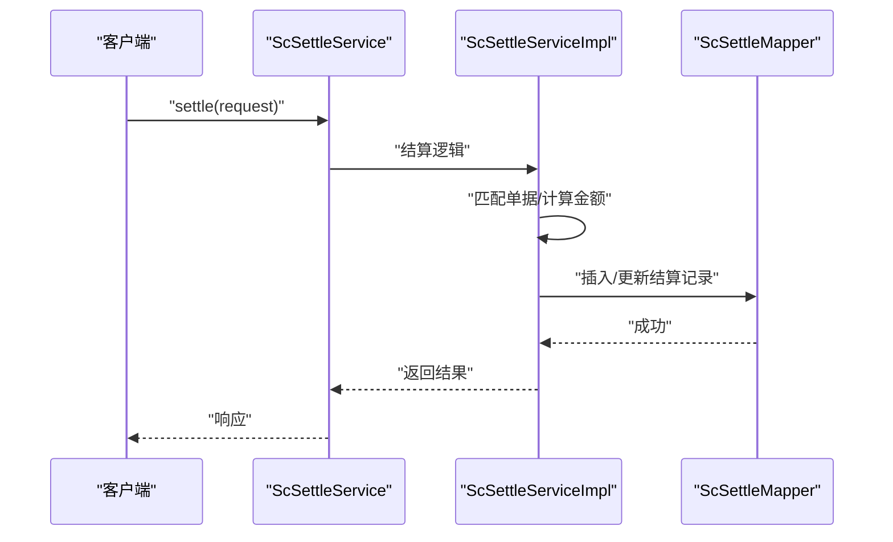
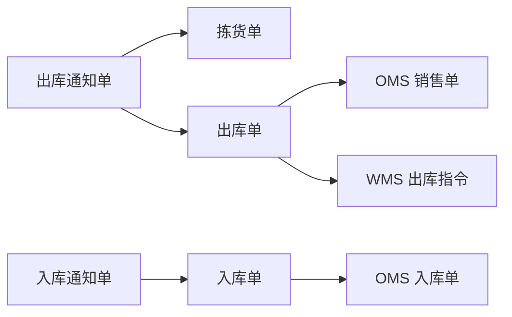
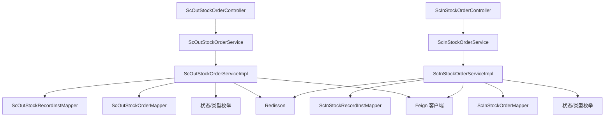

# 订单管理模块

<cite>
**本文引用的文件**
- [ScOutStockOrderController.java](file://guoke-deepexi-storage-center-provider/src/main/java/com/deepexi/storage/controller/web/ScOutStockOrderController.java)
- [ScInStockOrderController.java](file://guoke-deepexi-storage-center-provider/src/main/java/com/deepexi/storage/controller/web/ScInStockOrderController.java)
- [ScOutStockOrderService.java](file://guoke-deepexi-storage-center-provider/src/main/java/com/deepexi/storage/service/ScOutStockOrderService.java)
- [ScInStockOrderService.java](file://guoke-deepexi-storage-center-provider/src/main/java/com/deepexi/storage/service/ScInStockOrderService.java)
- [ScOutStockOrderServiceImpl.java](file://guoke-deepexi-storage-center-provider/src/main/java/com/deepexi/storage/service/impl/ScOutStockOrderServiceImpl.java)
- [ScInStockOrderServiceImpl.java](file://guoke-deepexi-storage-center-provider/src/main/java/com/deepexi/storage/service/impl/ScInStockOrderServiceImpl.java)
- [ScOutStockOrderPO.java](file://guoke-deepexi-storage-center-provider/src/main/java/com/deepexi/storage/model/ScOutStockOrderPO.java)
- [ScInStockOrderPO.java](file://guoke-deepexi-storage-center-provider/src/main/java/com/deepexi/storage/model/ScInStockOrderPO.java)
- [CloseOrderRequest.java](file://guoke-deepexi-storage-center-api/src/main/java/com/deepexi/api/storage/dto/closeorder/CloseOrderRequest.java)
- [CheckCloseOrderRequest.java](file://guoke-deepexi-storage-center-api/src/main/java/com/deepexi/api/storage/dto/closeorder/CheckCloseOrderRequest.java)
- [SettleOrderRequest.java](file://guoke-deepexi-storage-center-api/src/main/java/com/deepexi/api/storage/dto/SettleOrderRequest.java)
- [OrderRpcClient.java](file://guoke-deepexi-storage-center-api/src/main/java/com/deepexi/api/storage/OrderRpcClient.java)
- [ScSettleService.java](file://guoke-deepexi-storage-center-provider/src/main/java/com/deepexi/storage/service/ScSettleService.java)
- [ScSettleMapper.xml](file://guoke-deepexi-storage-center-provider/src/main/resources/mapper/ScSettleMapper.xml)
- [ScOutStockOrderMapper.java](file://guoke-deepexi-storage-center-provider/src/main/java/com/deepexi/storage/mapper/ScOutStockOrderMapper.java)
- [ScInStockOrderMapper.java](file://guoke-deepexi-storage-center-provider/src/main/java/com/deepexi/storage/mapper/ScInStockOrderMapper.java)
- [ScOutStockRecordInstMapper.java](file://guoke-deepexi-storage-center-provider/src/main/java/com/deepexi/storage/mapper/ScOutStockRecordInstMapper.java)
- [ScInStockRecordInstMapper.java](file://guoke-deepexi-storage-center-provider/src/main/java/com/deepexi/storage/mapper/ScInStockRecordInstMapper.java)
- [OutStockStatusEnum.java](file://guoke-deepexi-storage-center-api/src/main/java/com/deepexi/api/storage/enums/out/OutStockStatusEnum.java)
- [StockOutOrderPickStatusEnum.java](file://guoke-deepexi-storage-center-api/src/main/java/com/deepexi/api/storage/enums/out/StockOutOrderPickStatusEnum.java)
- [StockInOrderStatusEnum.java](file://guoke-deepexi-storage-center-api/src/main/java/com/deepexi/api/storage/enums/in/StockInOrderStatusEnum.java)
- [StockOutObjTypeEnum.java](file://guoke-deepexi-storage-center-api/src/main/java/com/deepexi/api/storage/enums/out/StockOutObjTypeEnum.java)
- [StockInObjTypeEnum.java](file://guoke-deepexi-storage-center-api/src/main/java/com/deepexi/api/storage/enums/in/StockInObjTypeEnum.java)
- [StockOriginTypeEnum.java](file://guoke-deepexi-storage-center-api/src/main/java/com/deepexi/api/storage/enums/StockOriginTypeEnum.java)
- [ScOutSockRecordMainConverter.java](file://guoke-deepexi-storage-center-provider/src/main/java/com/deepexi/storage/converter/stockout/ScOutSockRecordMainConverter.java)
- [ScOutStockRecordConverter.java](file://guoke-deepexi-storage-center-provider/src/main/java/com/deepexi/storage/converter/stockout/ScOutStockRecordConverter.java)
- [ScInStockOrderConverter.java](file://guoke-deepexi-storage-center-provider/src/main/java/com/deepexi/storage/converter/stockin/ScInStockOrderConverter.java)
- [ScInStockOrderInstConverter.java](file://guoke-deepexi-storage-center-provider/src/main/java/com/deepexi/storage/converter/stockin/ScInStockOrderInstConverter.java)
- [RedissonClient.java](file://guoke-deepexi-storage-center-provider/src/main/java/com/deepexi/storage/common/util/RedissonClient.java)
- [StorageRedisConstant.java](file://guoke-deepexi-storage-center-provider/src/main/java/com/deepexi/storage/constans/StorageRedisConstant.java)
- [ApplicationExceptionUtil.java](file://guoke-deepexi-storage-center-provider/src/main/java/com/deepexi/storage/common/util/ApplicationExceptionUtil.java)
- [ContextUtil.java](file://guoke-deepexi-storage-center-provider/src/main/java/com/deepexi/storage/common/util/ContextUtil.java)
- [EngineResolver.java](file://guoke-deepexi-storage-center-provider/src/main/java/com/deepexi/storage/statemachine/outother/EngineResolver.java)
- [EngineName.java](file://guoke-deepexi-storage-center-provider/src/main/java/com/deepexi/storage/statemachine/outother/EngineName.java)
- [ThreePartyWmsProxyHandler.java](file://guoke-deepexi-storage-center-provider/src/main/java/com/deepexi/storage/service/hanlder/ThreePartyWmsProxyHandler.java)
- [PushService.java](file://guoke-deepexi-storage-center-provider/src/main/java/com/deepexi/storage/service/push/PushService.java)
- [Oms2StockOut.java](file://guoke-deepexi-storage-center-api/src/main/java/com/deepexi/api/storage/oms/Oms2StockOut.java)
- [Oms2StockIn.java](file://guoke-deepexi-storage-center-api/src/main/java/com/deepexi/api/storage/oms/Oms2StockIn.java)
- [SaleOrder.java](file://guoke-deepexi-storage-center-api/src/main/java/com/deepexi/api/storage/pojo/dto/order/SaleOrder.java)
- [ScOutStockRecordMainPO.java](file://guoke-deepexi-storage-center-provider/src/main/java/com/deepexi/storage/model/ScOutStockRecordMainPO.java)
- [ScOutStockOrderInst.java](file://guoke-deepexi-storage-center-provider/src/main/java/com/deepexi/storage/model/ScOutStockOrderInst.java)
- [ScOutStockRecordMain.java](file://guoke-deepexi-storage-center-provider/src/main/java/com/deepexi/storage/model/ScOutStockRecordMain.java)
- [ScOutStockRecordInstPO.java](file://guoke-deepexi-storage-center-provider/src/main/java/com/deepexi/storage/model/ScOutStockRecordInstPO.java)
- [ScInStockRecordMain.java](file://guoke-deepexi-storage-center-provider/src/main/java/com/deepexi/storage/model/ScInStockRecordMain.java)
- [ScInStockRecordItem.java](file://guoke-deepexi-storage-center-provider/src/main/java/com/deepexi/storage/model/ScInStockRecordItem.java)
- [ScInStockRecordItemPO.java](file://guoke-deepexi-storage-center-provider/src/main/java/com/deepexi/storage/model/ScInStockRecordItemPO.java)
- [ScOutStockPick.java](file://guoke-deepexi-storage-center-provider/src/main/java/com/deepexi/storage/model/ScOutStockPick.java)
- [ScOutStockOrderInstPO.java](file://guoke-deepexi-storage-center-provider/src/main/java/com/deepexi/storage/model/ScOutStockOrderInstPO.java)
- [ScOutStockOrder.java](file://guoke-deepexi-storage-center-provider/src/main/java/com/deepexi/storage/pojo/form/stockout/OutStockCommitForm.java)
- [OutStockRecordItemRequest.java](file://guoke-deepexi-storage-center-provider/src/main/java/com/deepexi/storage/pojo/form/stockout/OutStockRecordItemRequest.java)
- [OutStockOrderItemRequest.java](file://guoke-deepexi-storage-center-provider/src/main/java/com/deepexi/storage/pojo/query/stockout/OutStockOrderItemRequest.java)
- [OutStockOrderItemResponse.java](file://guoke-deepexi-storage-center-provider/src/main/java/com/deepexi/storage/pojo/vo/stockout/OutStockOrderItemResponse.java)
- [ScOutStockOrderQuery.java](file://guoke-deepexi-storage-center-provider/src/main/java/com/deepexi/storage/pojo/query/stockout/ScOutStockOrderQuery.java)
- [ScOutSockRecordMainQuery.java](file://guoke-deepexi-storage-center-provider/src/main/java/com/deepexi/storage/pojo/query/logistics/ScOutSockRecordMainQuery.java)
- [ScOutInfoVO.java](file://guoke-deepexi-storage-center-provider/src/main/java/com/deepexi/storage/pojo/vo/stockout/sale/ScOutInfoVO.java)
- [ScOutStockOrderVO.java](file://guoke-deepexi/storage/pojo/vo/stockout/sale/ScOutStockOrderVO.java)
- [ScOutStockRecordMainVO.java](file://guoke-deepexi-storage-center-provider/src/main/java/com/deepexi/storage/pojo/vo/logistics/ScOutStockRecordMainVO.java)
- [ScInStockOrderQuery.java](file://guoke-deepexi-storage-center-provider/src/main/java/com/deepexi/storage/pojo/query/stockin/ScInStockOrderQuery.java)
- [ScInStockOrderForm.java](file://guoke-deepexi-storage-center-provider/src/main/java/com/deepexi/storage/pojo/form/stockin/ScInStockOrderForm.java)
- [ScInStockReviewForm.java](file://guoke-deepexi-storage-center-provider/src/main/java/com/deepexi/storage/pojo/form/stockin/ScInStockReviewForm.java)
- [ScInStockOrderVO.java](file://guoke-deepexi-storage-center-provider/src/main/java/com/deepexi/storage/pojo/vo/stockin/ScInStockOrderVO.java)
- [OrderPurchaseVO.java](file://guoke-deepexi-storage-center-provider/src/main/java/com/deepexi/storage/pojo/vo/stockin/OrderPurchaseVO.java)
- [orderPurchaseQuery.java](file://guoke-deepexi-storage-center-provider/src/main/java/com/deepexi/storage/pojo/query/stockin/orderPurchaseQuery.java)
- [QueryOutStockRecordResponse.java](file://guoke-deepexi-storage-center-provider/src/main/java/com/deepexi/storage/pojo/vo/stockout/QueryOutStockRecordResponse.java)
- [QueryInStockRecordResponse.java](file://guoke-deepexi-storage-center-provider/src/main/java/com/deepexi/storage/pojo/vo/stockin/QueryInStockRecordResponse.java)
- [QueryInStockOrderResponse.java](file://guoke-deepexi-storage-center-provider/src/main/java/com/deepexi/storage/pojo/vo/stockin/QueryInStockOrderResponse.java)
- [OutStockDetailIncrDTO.java](file://guoke-deepexi-storage-center-provider/src/main/java/com/deepexi/storage/pojo/vo/stockout/res/OutStockDetailIncrDTO.java)
- [OutStockDetailIncrQuery.java](file://guoke-deepexi-storage-center-provider/src/main/java/com/deepexi/storage/pojo/query/stockout/OutStockDetailIncrQuery.java)
- [OutStockOrderHeadDetailVo.java](file://guoke-deepexi-storage-center-provider/src/main/java/com/deepexi/storage/pojo/vo/stockout/OutStockOrderHeadDetailVo.java)
- [OutStockOrderDetailVo.java](file://guoke-deepexi-storage-center-provider/src/main/java/com/deepexi/storage/pojo/vo/stockout/OutStockOrderDetailVo.java)
- [InStockOrderDetailVo.java](file://guoke-deepexi-storage-center-provider/src/main/java/com/deepexi/storage/pojo/vo/stockin/InStockOrderDetailVo.java)
- [OutStockRecordDetailInfoVO.java](file://guoke-deepexi-storage-center-provider/src/main/java/com/deepexi/storage/pojo/vo/stockout/OutStockRecordDetailInfoVO.java)
- [ScOutRecordMainInfoListVO.java](file://guoke-deepexi-storage-center-provider/src/main/java/com/deepexi/storage/pojo/vo/logistics/ScOutStockRecordMainVO.java)
- [OutStockCommitForm.java](file://guoke-deepexi-storage-center-provider/src/main/java/com/deepexi/storage/pojo/form/stockout/OutStockCommitForm.java)
- [StckRefuseForm.java](file://guoke-deepexi-storage-center-provider/src/main/java/com/deepexi/storage/pojo/form/stockout/StckRefuseForm.java)
- [ScanCodeRequest.java](file://guoke-deepexi-storage-center-provider/src/main/java/com/deepexi/storage/pojo/query/stockout/ScanCodeRequest.java)
- [ScanCodeResponse.java](file://guoke-deepexi-storage-center-provider/src/main/java/com/deepexi/storage/pojo/vo/stockout/ScanCodeResponse.java)
- [ScanCodeInfoQuery.java](file://guoke-deepexi-storage-center-provider/src/main/java/com/deepexi/storage/pojo/query/stockout/ScanCodeInfoQuery.java)
- [OutStockSaasUpdateRequest.java](file://guoke-deepexi-storage-center-provider/src/main/java/com/deepexi/storage/pojo/query/stockout/OutStockSaasUpdateRequest.java)
- [OutStockSaasUpdateRequest.java](file://guoke-deepexi-storage-center-provider/src/main/java/com/deepexi/storage/pojo/query/stockout/OutStockSaasUpdateRequest.java)
- [OutStockOrderHeadDetailVo.java](file://guoke-deepexi-storage-center-provider/src/main/java/com/deepexi/storage/pojo/vo/stockout/OutStockOrderHeadDetailVo.java)
- [OutStockOrderDetailVo.java](file://guoke-deepexi-storage-center-provider/src/main/java/com/deepexi/storage/pojo/vo/stockout/OutStockOrderDetailVo.java)
- [InStockOrderDetailVo.java](file://guoke-deepexi-storage-center-provider/src/main/java/com/deepexi/storage/pojo/vo/stockin/InStockOrderDetailVo.java)
- [OutStockRecordDetailInfoVO.java](file://guoke-deepexi-storage-center-provider/src/main/java/com/deepexi/storage/pojo/vo/stockout/OutStockRecordDetailInfoVO.java)
- [ScOutSockRecordMainForm.java](file://guoke-deepexi-storage-center-provider/src/main/java/com/deepexi/storage/pojo/form/logistics/ScOutSockRecordMainForm.java)
- [RecordSingleVO.java](file://guoke-deepexi-storage-center-provider/src/main/java/com/deepexi/storage/pojo/vo/logistics/RecordSingleVO.java)
- [RecordSingleMainVO.java](file://guoke-deepexi-storage-center-provider/src/main/java/com/deepexi/storage/pojo/vo/logistics/RecordSingleMainVO.java)
- [RecordSingleSonVO.java](file://guoke-deepexi-storage-center-provider/src/main/java/com/deepexi/storage/pojo/vo/logistics/RecordSingleSonVO.java)
- [ScOutSockInvoiceMatchProductListVO.java](file://guoke-deepexi-storage-center-provider/src/main/java/com/deepexi/storage/pojo/vo/logistics/ScOutSockInvoiceMatchProductListVO.java)
- [ScOutSockInvoiceMatchProductQuery.java](file://guoke-deepexi-storage-center-provider/src/main/java/com/deepexi/storage/pojo/query/logistics/ScOutSockInvoiceMatchProductQuery.java)
- [ScOutSockRecordLogisticsMapper.java](file://guoke-deepexi-storage-center-provider/src/main/java/com/deepexi/storage/mapper/logistics/ScOutSockRecordLogisticsMapper.java)
- [ScOutSockRecordMainQuery.java](file://guoke-deepexi-storage-center-provider/src/main/java/com/deepexi/storage/pojo/query/logistics/ScOutSockRecordMainQuery.java)
- [ScOutSockRecordMainForm.java](file://guoke-deepexi-storage-center-provider/src/main/java/com/deepexi/storage/pojo/form/logistics/ScOutSockRecordMainForm.java)
- [ScOutSockRecordMainVO.java](file://guoke-deepexi-storage-center-provider/src/main/java/com/deepexi/storage/pojo/vo/logistics/ScOutStockRecordMainVO.java)
- [ScOutSockRecordMainQuery.java](file://guoke-deepexi-storage-center-provider/src/main/java/com/deepexi/storage/pojo/query/logistics/ScOutSockRecordMainQuery.java)
- [ScOutSockRecordMainForm.java](file://guoke-deepexi-storage-center-provider/src/main/java/com/deepexi/storage/pojo/form/logistics/ScOutSockRecordMainForm.java)
- [ScOutSockRecordMainVO.java](file://guoke-deepexi-storage-center-provider/src/main/java/com/deepexi/storage/pojo/vo/logistics/ScOutStockRecordMainVO.java)
- [ScOutSockRecordMainQuery.java](file://guoke-deepexi-storage-center-provider/src/main/java/com/deepexi/storage/pojo/query/logistics/ScOutSockRecordMainQuery.java)
- [ScOutSockRecordMainForm.java](file://guoke-deepexi-storage-center-provider/src/main/java/com/deepexi/storage/pojo/form/logistics/ScOutSockRecordMainForm.java)
- [ScOutSockRecordMainVO.java](file://guoke-deepexi-storage-center-provider/src/main/java/com/deepexi/storage/pojo/vo/logistics/ScOutStockRecordMainVO.java)
- [ScOutSockRecordMainQuery.java](file://guoke-deepexi-storage-center-provider/src/main/java/com/deepexi/storage/pojo/query/logistics/ScOutSockRecordMainQuery.java)
- [ScOutSockRecordMainForm.java](file://guoke-deepexi-storage-center-provider/src/main/java/com/deepexi/storage/pojo/form/logistics/ScOutSockRecordMainForm.java)
- [ScOutSockRecordMainVO.java](file://guoke-deepexi-storage-center-provider/src/main/java/com/deepexi/storage/pojo/vo/logistics/ScOutStockRecordMainVO.java)
- [ScOutSockRecordMainQuery.java](file://guoke-deepexi-storage-center-provider/src/main/java/com/deepexi/storage/pojo/query/logistics/ScOutSockRecordMainQuery.java)
- [ScOutSockRecordMainForm.java](file://guoke-deepexi-storage-center-provider/src/main/java/com/deepexi/storage/pojo/form/logistics/ScOutSockRecordMainForm.java)
- [ScOutSockRecordMainVO.java](file://guoke-deepexi-storage-center-provider/src/main/java/com/deepexi/storage/pojo/vo/logistics/ScOutStockRecordMainVO.java)
- [ScOutSockRecordMainQuery.java](file://guoke-deepexi-storage-center-provider/src/main/java/com/deepexi/storage/pojo/query/logistics/ScOutSockRecordMainQuery.java)
- [ScOutSockRecordMainForm.java](file://guoke-deepexi-storage-center-provider/src/main/java/com/deepexi/storage/pojo/form/logistics/ScOutSockRecordMainForm.java)
- [ScOutSockRecordMainVO.java](file://guoke-deepexi-storage-center-provider/src/main/java/com/deepexi/storage/pojo/vo/logistics/ScOutStockRecordMainVO.java)
- [ScOutSockRecordMainQuery.java](file://guoke-deepexi-storage-center-provider/src/main/java/com/deepexi/storage/pojo/query/logistics/ScOutSockRecordMainQuery.java)
- [ScOutSockRecordMainForm.java](file://guoke-deepexi-storage-center-provider/src/main/java/com/deepexi/storage/pojo/form/logistics/ScOutSockRecordMainForm.java)
- [ScOutSockRecordMainVO.java](file://guoke-deepexi-storage-center-provider/src/main/java/com/deepexi/storage/pojo/vo/logistics......)
</cite>

## 目录
1. [简介](#简介)
2. [项目结构](#项目结构)
3. [核心组件](#核心组件)
4. [架构总览](#架构总览)
5. [详细组件分析](#详细组件分析)
6. [依赖分析](#依赖分析)
7. [性能考虑](#性能考虑)
8. [故障排查指南](#故障排查指南)
9. [结论](#结论)
10. [附录](#附录)

## 简介
本文件面向国科恒泰仓储管理系统的“订单管理模块”，围绕订单创建、订单关闭、订单结算三大核心能力，系统性梳理业务逻辑、技术实现、状态流转、与库存的关联关系、数据完整性保障、异常处理与重复检测、以及与入库/出库业务的协同机制。同时提供API接口说明、数据模型图、流程与时序图，并给出配置与扩展点建议，帮助在不同业务场景下进行定制化落地。

## 项目结构
订单管理模块主要由以下层次构成：
- 控制层：提供REST接口，负责参数校验、鉴权、幂等控制、分布式锁与事务边界控制。
- 服务层：定义订单域核心业务接口，封装订单状态变更、与库存/OMS/WMS对接、结算与关单等能力。
- 实现层：具体业务逻辑落地，包含状态机引擎、分布式锁、Redisson、Feign调用、Mapper访问数据库。
- 数据模型层：出库通知单、入库通知单及其明细、拣货单、出/入库单等核心PO与VO。
- DTO/枚举层：API层的请求/响应DTO、状态/类型枚举，确保跨模块契约稳定。
- Mapper/SQL：MyBatis XML映射，支撑订单与库存、结算、日志等数据持久化。

图表来源
- [ScOutStockOrderController.java:1-352](file://guoke-deepexi-storage-center-provider/src/main/java/com/deepexi/storage/controller/web/ScOutStockOrderController.java#L1-L352)
- [ScInStockOrderController.java:1-160](file://guoke-deepexi-storage-center-provider/src/main/java/com/deepexi/storage/controller/web/ScInStockOrderController.java#L1-L160)
- [ScOutStockOrderService.java:1-532](file://guoke-deepexi-storage-center-provider/src/main/java/com/deepexi/storage/service/ScOutStockOrderService.java#L1-L532)
- [ScInStockOrderService.java:1-423](file://guoke-deepexi-storage-center-provider/src/main/java/com/deepexi/storage/service/ScInStockOrderService.java#L1-L423)
- [ScOutStockOrderPO.java:1-317](file://guoke-deepexi-storage-center-provider/src/main/java/com/deepexi/storage/model/ScOutStockOrderPO.java#L1-L317)
- [ScInStockOrderPO.java:1-192](file://guoke-deepexi-storage-center-provider/src/main/java/com/deepexi/storage/model/ScInStockOrderPO.java#L1-L192)

章节来源
- [ScOutStockOrderController.java:1-352](file://guoke-deepexi-storage-center-provider/src/main/java/com/deepexi/storage/controller/web/ScOutStockOrderController.java#L1-L352)
- [ScInStockOrderController.java:1-160](file://guoke-deepexi-storage-center-provider/src/main/java/com/deepexi/storage/controller/web/ScInStockOrderController.java#L1-L160)

## 核心组件
- 出库订单控制器与服务：提供出库通知单的查询、扫码出库、复核、重新扫码、历史查询、统计等能力，并支持关单检查与执行。
- 入库订单控制器与服务：提供入库通知单的查询、保存、质检/复检、审核、一键入库、按采购单查询等能力，并支持关单检查与执行。
- 结算服务：提供结算请求、自动销货、结算匹配、红冲等能力，支撑与寄售/出库/入库业务的财务闭环。
- 数据模型：出库通知单、入库通知单、出/入库单主表与明细、拣货单等，承载订单状态、数量、来源单据、业务类型等关键字段。
- DTO与枚举：统一对外契约，明确关单、结算、状态、对象类型等语义。

章节来源
- [ScOutStockOrderService.java:1-532](file://guoke-deepexi-storage-center-provider/src/main/java/com/deepexi/storage/service/ScOutStockOrderService.java#L1-L532)
- [ScInStockOrderService.java:1-423](file://guoke-deepexi-storage-center-provider/src/main/java/com/deepexi/storage/service/ScInStockOrderService.java#L1-L423)
- [ScOutStockOrderPO.java:1-317](file://guoke-deepexi-storage-center-provider/src/main/java/com/deepexi/storage/model/ScOutStockOrderPO.java#L1-L317)
- [ScInStockOrderPO.java:1-192](file://guoke-deepexi-storage-center-provider/src/main/java/com/deepexi/storage/model/ScInStockOrderPO.java#L1-L192)
- [CloseOrderRequest.java:1-29](file://guoke-deepexi-storage-center-api/src/main/java/com/deepexi/api/storage/dto/closeorder/CloseOrderRequest.java#L1-L29)
- [CheckCloseOrderRequest.java:1-21](file://guoke-deepexi-storage-center-api/src/main/java/com/deepexi/api/storage/dto/closeorder/CheckCloseOrderRequest.java#L1-L21)
- [SettleOrderRequest.java:1-81](file://guoke-deepexi-storage-center-api/src/main/java/com/deepexi/api/storage/dto/SettleOrderRequest.java#L1-L81)

## 架构总览
订单管理模块采用分层架构，结合分布式锁、幂等、状态机引擎与外部系统对接（OMS/WMS），实现高并发下的数据一致性与业务正确性。

图表来源
- [ScOutStockOrderController.java:1-352](file://guoke-deepexi-storage-center-provider/src/main/java/com/deepexi/storage/controller/web/ScOutStockOrderController.java#L1-L352)
- [ScInStockOrderController.java:1-160](file://guoke-deepexi-storage-center-provider/src/main/java/com/deepexi/storage/controller/web/ScInStockOrderController.java#L1-L160)
- [ScOutStockOrderServiceImpl.java:1-200](file://guoke-deepexi-storage-center-provider/src/main/java/com/deepexi/storage/service/impl/ScOutStockOrderServiceImpl.java#L1-L200)
- [ScInStockOrderServiceImpl.java:1-200](file://guoke-deepexi-storage-center-provider/src/main/java/com/deepexi/storage/service/impl/ScInStockOrderServiceImpl.java#L1-L200)
- [ScOutStockOrderMapper.java](file://guoke-deepexi-storage-center-provider/src/main/java/com/deepexi/storage/mapper/ScOutStockOrderMapper.java)
- [ScInStockOrderMapper.java](file://guoke-deepexi-storage-center-provider/src/main/java/com/deepexi/storage/mapper/ScInStockOrderMapper.java)
- [ScOutStockRecordInstMapper.java](file://guoke-deepexi-storage-center-provider/src/main/java/com/deepexi/storage/mapper/ScOutStockRecordInstMapper.java)
- [ScInStockRecordInstMapper.java](file://guoke-deepexi-storage-center-provider/src/main/java/com/deepexi/storage/mapper/ScInStockRecordInstMapper.java)
- [OutStockStatusEnum.java](file://guoke-deepexi-storage-center-api/src/main/java/com/deepexi/api/storage/enums/out/OutStockStatusEnum.java)
- [StockInOrderStatusEnum.java](file://guoke-deepexi-storage-center-api/src/main/java/com/deepexi/api/storage/enums/in/StockInOrderStatusEnum.java)
- [Oms2StockOut.java](file://guoke-deepexi-storage-center-api/src/main/java/com/deepexi/api/storage/oms/Oms2StockOut.java)
- [Oms2StockIn.java](file://guoke-deepexi-storage-center-api/src/main/java/com/deepexi/api/storage/oms/Oms2StockIn.java)
- [ThreePartyWmsProxyHandler.java:418-445](file://guoke-deepexi-storage-center-provider/src/main/java/com/deepexi/storage/service/hanlder/ThreePartyWmsProxyHandler.java#L418-L445)

## 详细组件分析

### 出库订单管理
- 订单创建与初始化：支持根据业务单据生成出库通知单，设置编码、来源单据、拣货/出库状态、业务类型等。
- 订单状态流转：待拣货/部分拣货/拣货完成、待出库/部分出库/出库完成，配合状态机引擎与服务方法驱动状态变更。
- 扫码出库与复核：提供扫码确认、批量出库、复核通过/拒绝、重新扫码、历史查询等能力。
- 关单检查与执行：提供关单前置检查与执行，支持按订单类型区分出库/入库。
- OMS/WMS对接：在出库完成后向OMS推送销售单，向WMS推送出库指令并处理三方业务。

图表来源
- [ScOutStockOrderController.java:191-211](file://guoke-deepexi-storage-center-provider/src/main/java/com/deepexi/storage/controller/web/ScOutStockOrderController.java#L191-L211)
- [ScOutStockOrderService.java:74-75](file://guoke-deepexi-storage-center-provider/src/main/java/com/deepexi/storage/service/ScOutStockOrderService.java#L74-L75)
- [ScOutStockOrderServiceImpl.java:1-200](file://guoke-deepexi-storage-center-provider/src/main/java/com/deepexi/storage/service/impl/ScOutStockOrderServiceImpl.java#L1-L200)
- [Oms2StockOut.java](file://guoke-deepexi-storage-center-api/src/main/java/com/deepexi/api/storage/oms/Oms2StockOut.java)
- [ThreePartyWmsProxyHandler.java:418-445](file://guoke-deepexi-storage-center-provider/src/main/java/com/deepexi/storage/service/hanlder/ThreePartyWmsProxyHandler.java#L418-L445)

章节来源
- [ScOutStockOrderController.java:191-211](file://guoke-deepexi-storage-center-provider/src/main/java/com/deepexi/storage/controller/web/ScOutStockOrderController.java#L191-L211)
- [ScOutStockOrderService.java:74-75](file://guoke-deepexi-storage-center-provider/src/main/java/com/deepexi/storage/service/ScOutStockOrderService.java#L74-L75)
- [ScOutStockOrderPO.java:120-134](file://guoke-deepexi-storage-center-provider/src/main/java/com/deepexi/storage/model/ScOutStockOrderPO.java#L120-L134)

### 入库订单管理
- 订单创建与审核：支持保存入库通知单、质检/复检、审核、一键入库、按采购单查询等。
- 关单检查与执行：提供关单前置检查与执行，支持按订单类型区分出库/入库。
- OMS对接：在入库完成后向OMS推送入库单。

图表来源
- [ScInStockOrderController.java:57-70](file://guoke-deepexi-storage-center-provider/src/main/java/com/deepexi/storage/controller/web/ScInStockOrderController.java#L57-L70)
- [ScInStockOrderService.java:78-84](file://guoke-deepexi-storage-center-provider/src/main/java/com/deepexi/storage/service/ScInStockOrderService.java#L78-L84)
- [ScInStockOrderServiceImpl.java:1-200](file://guoke-deepexi-storage-center-provider/src/main/java/com/deepexi/storage/service/impl/ScInStockOrderServiceImpl.java#L1-L200)
- [Oms2StockIn.java](file://guoke-deepexi-storage-center-api/src/main/java/com/deepexi/api/storage/oms/Oms2StockIn.java)

章节来源
- [ScInStockOrderController.java:57-70](file://guoke-deepexi-storage-center-provider/src/main/java/com/deepexi/storage/controller/web/ScInStockOrderController.java#L57-L70)
- [ScInStockOrderService.java:78-84](file://guoke-deepexi-storage-center-provider/src/main/java/com/deepexi/storage/service/ScInStockOrderService.java#L78-L84)
- [ScInStockOrderPO.java:88-91](file://guoke-deepexi-storage-center-provider/src/main/java/com/deepexi/storage/model/ScInStockOrderPO.java#L88-L91)

### 订单状态流转机制
- 出库订单状态：待拣货、部分拣货、拣货完成；待出库、部分出库、出库完成。
- 入库订单状态：多种状态枚举，覆盖待入库、质检中、已审核、已完成等。
- 状态变更入口：服务层提供变更方法，实现层通过Mapper更新数据库，确保原子性与一致性。

图表来源
- [OutStockStatusEnum.java](file://guoke-deepexi-storage-center-api/src/main/java/com/deepexi/api/storage/enums/out/OutStockStatusEnum.java)
- [StockOutOrderPickStatusEnum.java](file://guoke-deepexi-storage-center-api/src/main/java/com/deepexi/api/storage/enums/out/StockOutOrderPickStatusEnum.java)
- [StockInOrderStatusEnum.java](file://guoke-deepexi-storage-center-api/src/main/java/com/deepexi/api/storage/enums/in/StockInOrderStatusEnum.java)

章节来源
- [ScOutStockOrderPO.java:120-134](file://guoke-deepexi-storage-center-provider/src/main/java/com/deepexi/storage/model/ScOutStockOrderPO.java#L120-L134)
- [ScInStockOrderPO.java:88-91](file://guoke-deepexi-storage-center-provider/src/main/java/com/deepexi/storage/model/ScInStockOrderPO.java#L88-L91)

### 订单与库存的关联关系
- 出库通知单与出库单明细：通过订单ID与明细ID建立关联，出库完成后更新库存与状态。
- 入库通知单与入库单明细：通过订单ID与明细ID建立关联，入库完成后更新库存与状态。
- 拣货单：根据出库通知单生成拣货单，驱动拣货与出库流程。

图表来源
- [ScOutStockOrderPO.java:1-317](file://guoke-deepexi-storage-center-provider/src/main/java/com/deepexi/storage/model/ScOutStockOrderPO.java#L1-L317)
- [ScOutStockOrderInst.java](file://guoke-deepexi-storage-center-provider/src/main/java/com/deepexi/storage/model/ScOutStockOrderInst.java)
- [ScOutStockRecordMainPO.java](file://guoke-deepexi-storage-center-provider/src/main/java/com/deepexi/storage/model/ScOutStockRecordMainPO.java)
- [ScOutStockRecordInstPO.java](file://guoke-deepexi-storage-center-provider/src/main/java/com/deepexi/storage/model/ScOutStockRecordInstPO.java)

章节来源
- [ScOutStockOrderServiceImpl.java:1-200](file://guoke-deepexi-storage-center-provider/src/main/java/com/deepexi/storage/service/impl/ScOutStockOrderServiceImpl.java#L1-L200)
- [ScInStockOrderServiceImpl.java:1-200](file://guoke-deepexi-storage-center-provider/src/main/java/com/deepexi/storage/service/impl/ScInStockOrderServiceImpl.java#L1-L200)

### 订单关闭机制
- 触发条件：订单需满足“无待出/入库数量”、“无待拣货”、“无异常状态”等前置条件。
- 检查流程：提供关单检查接口，返回可关单的明细项。
- 执行流程：关单执行接口接收关单请求，逐项校验并执行关单动作，更新订单状态与明细状态。
- 数据清理：关单后清理相关中间状态、锁定库存、释放资源。

图表来源
- [CheckCloseOrderRequest.java:1-21](file://guoke-deepexi-storage-center-api/src/main/java/com/deepexi/api/storage/dto/closeorder/CheckCloseOrderRequest.java#L1-L21)
- [CloseOrderRequest.java:1-29](file://guoke-deepexi-storage-center-api/src/main/java/com/deepexi/api/storage/dto/closeorder/CloseOrderRequest.java#L1-L29)
- [ScOutStockOrderService.java:456-458](file://guoke-deepexi-storage-center-provider/src/main/java/com/deepexi/storage/service/ScOutStockOrderService.java#L456-L458)
- [ScInStockOrderService.java:350-352](file://guoke-deepexi-storage-center-provider/src/main/java/com/deepexi/storage/service/ScInStockOrderService.java#L350-L352)

章节来源
- [ScOutStockOrderService.java:456-458](file://guoke-deepexi-storage-center-provider/src/main/java/com/deepexi/storage/service/ScOutStockOrderService.java#L456-L458)
- [ScInStockOrderService.java:350-352](file://guoke-deepexi-storage-center-provider/src/main/java/com/deepexi/storage/service/ScInStockOrderService.java#L350-L352)

### 订单结算机制
- 结算请求：包含供应商信息、结算单号、结算日期、明细等。
- 自动销货：根据业务规则自动匹配寄售/出库/入库单据，生成结算记录。
- 红冲：对已结算单据进行红冲处理，生成负向结算记录。
- 数据持久化：通过Mapper将结算主从表写入数据库，支持唯一键冲突更新。

图表来源
- [SettleOrderRequest.java:1-81](file://guoke-deepexi-storage-center-api/src/main/java/com/deepexi/api/storage/dto/SettleOrderRequest.java#L1-L81)
- [ScSettleService.java:13-33](file://guoke-deepexi-storage-center-provider/src/main/java/com/deepexi/storage/service/ScSettleService.java#L13-L33)
- [ScSettleMapper.xml:246-381](file://guoke-deepexi-storage-center-provider/src/main/resources/mapper/ScSettleMapper.xml#L246-L381)

章节来源
- [ScSettleService.java:13-33](file://guoke-deepexi-storage-center-provider/src/main/java/com/deepexi/storage/service/ScSettleService.java#L13-L33)
- [ScSettleMapper.xml:246-381](file://guoke-deepexi-storage-center-provider/src/main/resources/mapper/ScSettleMapper.xml#L246-L381)

### 订单与入库/出库业务协同
- 出库协同：出库通知单生成后，驱动拣货、出库单创建、OMS销售单推送、WMS出库指令推送。
- 入库协同：入库通知单生成后，驱动质检、审核、入库单创建、OMS入库单推送。
- 关单协同：关单前后联动库存锁定/释放、状态同步、日志记录。

图表来源
- [ScOutStockOrderServiceImpl.java:4832-4852](file://guoke-deepexi-storage-center-provider/src/main/java/com/deepexi/storage/service/impl/ScOutStockOrderServiceImpl.java#L4832-L4852)
- [ThreePartyWmsProxyHandler.java:418-445](file://guoke-deepexi-storage-center-provider/src/main/java/com/deepexi/storage/service/hanlder/ThreePartyWmsProxyHandler.java#L418-L445)
- [Oms2StockOut.java](file://guoke-deepexi-storage-center-api/src/main/java/com/deepexi/api/storage/oms/Oms2StockOut.java)
- [Oms2StockIn.java](file://guoke-deepexi-storage-center-api/src/main/java/com/deepexi/api/storage/oms/Oms2StockIn.java)

章节来源
- [ScOutStockOrderServiceImpl.java:4832-4852](file://guoke-deepexi-storage-center-provider/src/main/java/com/deepexi/storage/service/impl/ScOutStockOrderServiceImpl.java#L4832-L4852)
- [ScInStockOrderServiceImpl.java:1-200](file://guoke-deepexi-storage-center-provider/src/main/java/com/deepexi/storage/service/impl/ScInStockOrderServiceImpl.java#L1-L200)

### 订单数据完整性与一致性
- 幂等与分布式锁：接口层广泛使用Redisson分布式锁与幂等注解，避免并发重复提交。
- 参数校验与上下文：统一参数校验、登录上下文注入、异常工具抛出，保证输入输出一致。
- 事务边界：关键流程（如扫码出库、一键入库）置于事务内，失败回滚。
- 状态机与枚举：通过状态机与枚举约束状态转换合法性，减少脏数据。

章节来源
- [ScOutStockOrderController.java:143-158](file://guoke-deepexi-storage-center-provider/src/main/java/com/deepexi/storage/controller/web/ScOutStockOrderController.java#L143-L158)
- [ScInStockOrderController.java:57-70](file://guoke-deepexi-storage-center-provider/src/main/java/com/deepexi/storage/controller/web/ScInStockOrderController.java#L57-L70)
- [ApplicationExceptionUtil.java](file://guoke-deepexi-storage-center-provider/src/main/java/com/deepexi/storage/common/util/ApplicationExceptionUtil.java)
- [ContextUtil.java](file://guoke-deepexi-storage-center-provider/src/main/java/com/deepexi/storage/common/util/ContextUtil.java)

### 异常处理、重复检测与一致性维护
- 重复检测：通过Redisson锁与幂等注解，避免同一订单在短时间内重复提交。
- 异常处理：统一异常工具抛出业务异常，保证错误信息标准化。
- 一致性维护：状态机引擎与枚举约束、事务边界、Mapper原子更新，确保数据一致性。

章节来源
- [ScOutStockOrderController.java:143-158](file://guoke-deepexi-storage-center-provider/src/main/java/com/deepexi/storage/controller/web/ScOutStockOrderController.java#L143-L158)
- [ApplicationExceptionUtil.java](file://guoke-deepexi-storage-center-provider/src/main/java/com/deepexi/storage/common/util/ApplicationExceptionUtil.java)

### 配置与扩展点
- 业务模型：支持标准与定制（如爱康借货）两种业务模型，通过枚举与配置切换。
- 三方对接：WMS/OMS对接通过Feign与代理处理器扩展，便于接入不同第三方系统。
- 状态机：状态机引擎可扩展新的状态与转换规则，适配不同业务流程。
- 日志与审计：提供操作日志与接口日志，便于问题追踪与审计。

章节来源
- [StockOutObjTypeEnum.java](file://guoke-deepexi-storage-center-api/src/main/java/com/deepexi/api/storage/enums/out/StockOutObjTypeEnum.java)
- [StockInObjTypeEnum.java](file://guoke-deepexi-storage-center-api/src/main/java/com/deepexi/api/storage/enums/in/StockInObjTypeEnum.java)
- [EngineResolver.java](file://guoke-deepexi-storage-center-provider/src/main/java/com/deepexi/storage/statemachine/outother/EngineResolver.java)
- [EngineName.java](file://guoke-deepexi-storage-center-provider/src/main/java/com/deepexi/storage/statemachine/outother/EngineName.java)

## 依赖分析
- 控制器依赖服务接口，服务接口依赖实现类与Mapper。
- 实现类依赖状态枚举、DTO、Feign客户端、Redisson、引擎与管理器。
- Mapper依赖MyBatis XML与数据库表结构。

图表来源
- [ScOutStockOrderController.java:1-352](file://guoke-deepexi-storage-center-provider/src/main/java/com/deepexi/storage/controller/web/ScOutStockOrderController.java#L1-L352)
- [ScInStockOrderController.java:1-160](file://guoke-deepexi-storage-center-provider/src/main/java/com/deepexi/storage/controller/web/ScInStockOrderController.java#L1-L160)
- [ScOutStockOrderServiceImpl.java:1-200](file://guoke-deepexi-storage-center-provider/src/main/java/com/deepexi/storage/service/impl/ScOutStockOrderServiceImpl.java#L1-L200)
- [ScInStockOrderServiceImpl.java:1-200](file://guoke-deepexi-storage-center-provider/src/main/java/com/deepexi/storage/service/impl/ScInStockOrderServiceImpl.java#L1-L200)

章节来源
- [ScOutStockOrderService.java:1-532](file://guoke-deepexi-storage-center-provider/src/main/java/com/deepexi/storage/service/ScOutStockOrderService.java#L1-L532)
- [ScInStockOrderService.java:1-423](file://guoke-deepexi-storage-center-provider/src/main/java/com/deepexi/storage/service/ScInStockOrderService.java#L1-L423)

## 性能考虑
- 分布式锁与幂等：避免热点订单并发重复提交，降低无效计算与数据库压力。
- 分页与增量：提供分页查询与增量明细接口，降低单次请求数据量。
- 事务边界：将关键流程置于事务内，减少回滚成本与数据不一致风险。
- 异步处理：随货同行单等非关键路径异步生成，提升接口响应速度。

## 故障排查指南
- 参数校验失败：检查请求DTO字段是否为空或非法，参考控制器中的参数校验逻辑。
- 并发冲突：查看Redisson锁是否获取失败，定位锁粒度与等待时间。
- 状态异常：核对状态枚举与状态机转换规则，确保状态变更顺序正确。
- OMS/WMS对接失败：查看Feign调用日志与异常信息，确认第三方系统可用性与参数格式。

章节来源
- [ScOutStockOrderController.java:111-121](file://guoke-deepexi-storage-center-provider/src/main/java/com/deepexi/storage/controller/web/ScOutStockOrderController.java#L111-L121)
- [ScInStockOrderController.java:128-137](file://guoke-deepexi-storage-center-provider/src/main/java/com/deepexi/storage/controller/web/ScInStockOrderController.java#L128-L137)
- [ApplicationExceptionUtil.java](file://guoke-deepexi-storage-center-provider/src/main/java/com/deepexi/storage/common/util/ApplicationExceptionUtil.java)

## 结论
订单管理模块通过清晰的分层设计、严格的幂等与分布式锁、完善的状态机与枚举约束、以及与OMS/WMS的对接，实现了出库/入库订单的高效、安全与一致。关单与结算能力进一步完善了业务闭环，满足不同业务模型与场景的定制化需求。

## 附录

### API 接口文档

- 出库订单接口
  - 列表查询：POST /api/v1/stockOut/scOutStockOrder/pageList
  - 出库单详情：POST /api/v1/stockOut/getStockOutOrderInfo
  - 扫码出库确认：POST /api/v1/stockOut/confirm
  - 出库复核：POST /api/v1/stockOut/saleOutStockOutReview
  - 复核拒绝：POST /api/v1/stockOut/reviewRefusal
  - 重新扫码：POST /api/v1/stockOut/afreshScanCode
  - 出库单列表详情：POST /api/v1/stockOut/getOutStockRecordDetailInfo
  - 订单客户查询：POST /api/v1/stockOut/getOrderCustomer
  - 出库订单客户查询：POST /api/v1/stockOut/getOrderRecordMain
  - T1出库查询：POST /api/v1/stockOut/queryT1OutStock

- 入库订单接口
  - 列表查询：POST /api/v1/stockin/ScInStockOrder/pageList
  - 新建保存：POST /api/v1/stockin/ScInStockOrder/save
  - 质检：POST /api/v1/stockin/ScInStockOrder/check
  - 复检：POST /api/v1/stockin/ScInStockOrder/secondCheck
  - 审核：PUT /api/v1/stockin/ScInStockOrder/review/{id}
  - 按订单ID查询：GET /api/v1/stockin/ScInStockOrder/getByOrderId/{orderId}
  - 入库单类型统计：GET /api/v1/stockin/ScInStockOrder/getInStockOrderTypeCount
  - 入库单详情：POST /api/v1/stockin/ScInStockOrder/getById
  - 退货创建-采购单入库信息：POST /api/v1/stockin/ScInStockOrder/orderPurchaseList

- 关单接口
  - 关单检查：POST /api/v1/stockOut/checkCloseOrder
  - 执行关单：POST /api/v1/stockOut/closeOrder

- 结算接口
  - 结算请求：POST /api/v1/settle/settle
  - 自动销货：POST /api/v1/settle/autoSettle
  - 匹配结算：POST /api/v1/settle/matchConsignmentSettle
  - 红冲结算：POST /api/v1/settle/redEntryConsignment

章节来源
- [ScOutStockOrderController.java:74-352](file://guoke-deepexi-storage-center-provider/src/main/java/com/deepexi/storage/controller/web/ScOutStockOrderController.java#L74-L352)
- [ScInStockOrderController.java:44-160](file://guoke-deepexi-storage-center-provider/src/main/java/com/deepexi/storage/controller/web/ScInStockOrderController.java#L44-L160)
- [CloseOrderRequest.java:1-29](file://guoke-deepexi-storage-center-api/src/main/java/com/deepexi/api/storage/dto/closeorder/CloseOrderRequest.java#L1-L29)
- [CheckCloseOrderRequest.java:1-21](file://guoke-deepexi-storage-center-api/src/main/java/com/deepexi/api/storage/dto/closeorder/CheckCloseOrderRequest.java#L1-L21)
- [SettleOrderRequest.java:1-81](file://guoke-deepexi-storage-center-api/src/main/java/com/deepexi/api/storage/dto/SettleOrderRequest.java#L1-L81)